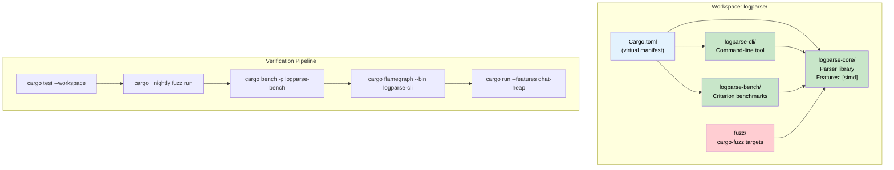

# 7. Capstone: The Hardened, Profiled Parser 🔴

> **What you'll learn:**
> - How to combine **every technique from this guide** into a single, production-ready project
> - How to structure a multi-crate workspace for a parser with a CLI front-end
> - How to gate SIMD optimizations behind a Cargo feature, fuzz the parser to find crashes, benchmark it with Criterion, and profile it with flamegraphs
> - The complete development workflow: build → fuzz → fix → benchmark → profile → ship

---

## Project Overview

We're building **`logparse`** — a high-performance binary log record parser. This is the kind of component you'd embed in a log aggregation pipeline, a network packet inspector, or a metrics ingestor.

The project demonstrates every skill from this guide:

| Technique | Chapter | How It's Used |
|-----------|---------|---------------|
| Cargo Workspace | Ch 1 | Three crates: `logparse-core`, `logparse-cli`, `logparse-bench` |
| Feature Flags | Ch 2 | `simd` feature gates a SWAR-accelerated parsing path |
| Criterion Benchmarking | Ch 3 | Compare naive vs SIMD parsing throughput |
| Fuzz Testing | Ch 4 | `cargo-fuzz` finds an index-out-of-bounds panic |
| CPU Profiling | Ch 5 | Flamegraph confirms SIMD path eliminates the hot function |
| Memory Profiling | Ch 6 | DHAT verifies zero unnecessary allocations in the hot path |



## Step 1: Workspace Structure

### Directory Layout

```text
logparse/
├── Cargo.toml              # Virtual manifest
├── Cargo.lock
├── logparse-core/
│   ├── Cargo.toml
│   └── src/
│       └── lib.rs           # Parser implementation
├── logparse-cli/
│   ├── Cargo.toml
│   └── src/
│       └── main.rs          # CLI binary
├── logparse-bench/
│   ├── Cargo.toml
│   └── benches/
│       └── throughput.rs    # Criterion benchmarks
└── fuzz/
    ├── Cargo.toml
    └── fuzz_targets/
        └── fuzz_parse.rs    # Fuzzing target
```

### Workspace Root: `Cargo.toml`

```toml
[workspace]
members = [
    "logparse-core",
    "logparse-cli",
    "logparse-bench",
]
# Note: fuzz/ is NOT a workspace member — cargo-fuzz manages it separately
resolver = "2"

[workspace.dependencies]
clap = { version = "4", features = ["derive"] }
criterion = { version = "0.5", features = ["html_reports"] }
dhat = "0.3"

[profile.release]
debug = true     # Debug symbols for profiling (Chapter 5)
strip = "none"

[profile.profiling]
inherits = "release"
debug = true
strip = "none"
```

## Step 2: The Parser — `logparse-core`

### `logparse-core/Cargo.toml`

```toml
[package]
name = "logparse-core"
version = "0.1.0"
edition = "2021"

[features]
default = []
simd = []         # Gate SWAR-optimized scanning
dhat-heap = ["dep:dhat"]

[dependencies]
dhat = { workspace = true, optional = true }
```

### `logparse-core/src/lib.rs`

The parser processes a binary log format:

```text
┌────────┬──────────┬───────────┬─────────────────┐
│ Magic  │ Length   │ Level     │ Payload (UTF-8)  │
│ 2 bytes│ 2 bytes  │ 1 byte    │ `length` bytes   │
│ 0xCAFE │ u16 BE   │ 0-4       │ variable         │
└────────┴──────────┴───────────┴─────────────────┘
```

```rust
//! logparse-core: A binary log record parser.
//!
//! Format: [0xCA, 0xFE] [u16 length BE] [u8 level] [payload: `length` bytes UTF-8]

/// A parsed log record borrowing from the input buffer.
#[derive(Debug, Clone, PartialEq, Eq)]
pub struct LogRecord<'a> {
    pub level: LogLevel,
    pub message: &'a str,
}

#[derive(Debug, Clone, Copy, PartialEq, Eq)]
pub enum LogLevel {
    Trace = 0,
    Debug = 1,
    Info = 2,
    Warn = 3,
    Error = 4,
}

/// Errors that can occur during parsing.
#[derive(Debug, Clone, PartialEq, Eq)]
pub enum ParseError {
    /// Input too short for the header
    TooShort,
    /// Magic bytes are not 0xCAFE
    BadMagic,
    /// Level byte is not in 0..=4
    BadLevel(u8),
    /// Declared length exceeds available data
    Truncated { declared: usize, available: usize },
    /// Payload is not valid UTF-8
    InvalidUtf8,
}

/// The minimum header size: 2 (magic) + 2 (length) + 1 (level) = 5 bytes
const HEADER_SIZE: usize = 5;
const MAGIC: [u8; 2] = [0xCA, 0xFE];

/// Parse a single log record from the beginning of `data`.
///
/// Returns the parsed record and the number of bytes consumed,
/// allowing the caller to advance through a stream of records.
pub fn parse_record(data: &[u8]) -> Result<(LogRecord<'_>, usize), ParseError> {
    // Check minimum length
    if data.len() < HEADER_SIZE {
        return Err(ParseError::TooShort);
    }

    // Validate magic bytes
    if data[0..2] != MAGIC {
        return Err(ParseError::BadMagic);
    }

    // Parse length (big-endian u16)
    let payload_len = u16::from_be_bytes([data[2], data[3]]) as usize;

    // Parse level
    let level = match data[4] {
        0 => LogLevel::Trace,
        1 => LogLevel::Debug,
        2 => LogLevel::Info,
        3 => LogLevel::Warn,
        4 => LogLevel::Error,
        b => return Err(ParseError::BadLevel(b)),
    };

    // Validate payload length against available data
    let total_len = HEADER_SIZE + payload_len;
    if data.len() < total_len {
        return Err(ParseError::Truncated {
            declared: payload_len,
            available: data.len() - HEADER_SIZE,
        });
    }

    // Parse payload as UTF-8
    let payload = &data[HEADER_SIZE..total_len];
    let message = std::str::from_utf8(payload).map_err(|_| ParseError::InvalidUtf8)?;

    Ok((LogRecord { level, message }, total_len))
}

/// Parse all records from a byte buffer.
///
/// Returns all successfully parsed records. Stops at the first error.
pub fn parse_all(data: &[u8]) -> Result<Vec<LogRecord<'_>>, ParseError> {
    let mut records = Vec::new();
    let mut offset = 0;

    while offset < data.len() {
        // Skip scanning for the next magic byte sequence
        if let Some(pos) = find_magic(&data[offset..]) {
            offset += pos;
            match parse_record(&data[offset..]) {
                Ok((record, consumed)) => {
                    records.push(record);
                    offset += consumed;
                }
                Err(e) => return Err(e),
            }
        } else {
            break; // No more magic bytes found
        }
    }

    Ok(records)
}

/// Scan for the magic byte sequence 0xCAFE in the input.
/// Returns the offset of the first occurrence, or None.
#[cfg(not(feature = "simd"))]
pub fn find_magic(data: &[u8]) -> Option<usize> {
    // Scalar implementation: check each byte pair
    data.windows(2).position(|w| w == MAGIC)
}

/// SIMD-accelerated magic byte scanner using SWAR (SIMD Within A Register).
///
/// Process 8 bytes at a time using u64 arithmetic to find 0xCA bytes,
/// then check if they're followed by 0xFE.
#[cfg(feature = "simd")]
pub fn find_magic(data: &[u8]) -> Option<usize> {
    let target_first = 0xCAu8;
    let broadcast_first = 0xCACACACA_CACACACAu64;

    let chunks = data.chunks_exact(8);
    let remainder_start = chunks.len() * 8;
    let remainder = chunks.remainder();

    for (chunk_idx, chunk) in chunks.enumerate() {
        let word = u64::from_ne_bytes(chunk.try_into().unwrap());

        // XOR with broadcast target — matching bytes become 0x00
        let xored = word ^ broadcast_first;

        // Null byte detection: a byte is zero iff (byte-0x01) & ~byte & 0x80 != 0
        let mask = (xored.wrapping_sub(0x0101010101010101))
            & !xored
            & 0x8080808080808080;

        if mask != 0 {
            // Found at least one 0xCA byte in this chunk
            let base = chunk_idx * 8;
            // Check each position in this chunk
            for i in 0..8 {
                let pos = base + i;
                if pos + 1 < data.len() && data[pos] == 0xCA && data[pos + 1] == 0xFE {
                    return Some(pos);
                }
            }
        }
    }

    // Scalar fallback for remaining bytes
    for i in remainder_start..data.len().saturating_sub(1) {
        if data[i] == 0xCA && data[i + 1] == 0xFE {
            return Some(i);
        }
    }

    None
}

/// Helper: Encode a log record into bytes (for test data generation).
pub fn encode_record(level: LogLevel, message: &str) -> Vec<u8> {
    let payload = message.as_bytes();
    let len = payload.len() as u16;
    let mut buf = Vec::with_capacity(HEADER_SIZE + payload.len());
    buf.extend_from_slice(&MAGIC);
    buf.extend_from_slice(&len.to_be_bytes());
    buf.push(level as u8);
    buf.extend_from_slice(payload);
    buf
}

// ─── Unit Tests ──────────────────────────────────────────────────────

#[cfg(test)]
mod tests {
    use super::*;

    #[test]
    fn roundtrip_single_record() {
        let encoded = encode_record(LogLevel::Info, "hello world");
        let (record, consumed) = parse_record(&encoded).unwrap();
        assert_eq!(record.level, LogLevel::Info);
        assert_eq!(record.message, "hello world");
        assert_eq!(consumed, encoded.len());
    }

    #[test]
    fn reject_bad_magic() {
        let data = [0xDE, 0xAD, 0x00, 0x05, 0x02, b'h', b'e', b'l', b'l', b'o'];
        assert_eq!(parse_record(&data), Err(ParseError::BadMagic));
    }

    #[test]
    fn reject_truncated() {
        // Header claims 100 bytes of payload, but only 5 are present
        let data = [0xCA, 0xFE, 0x00, 0x64, 0x02, b'h', b'e', b'l', b'l', b'o'];
        assert!(matches!(parse_record(&data), Err(ParseError::Truncated { .. })));
    }

    #[test]
    fn reject_bad_level() {
        let data = [0xCA, 0xFE, 0x00, 0x01, 0xFF, b'x'];
        assert_eq!(parse_record(&data), Err(ParseError::BadLevel(0xFF)));
    }

    #[test]
    fn reject_too_short() {
        assert_eq!(parse_record(&[0xCA, 0xFE]), Err(ParseError::TooShort));
        assert_eq!(parse_record(&[]), Err(ParseError::TooShort));
    }

    #[test]
    fn parse_multiple_records() {
        let mut data = Vec::new();
        data.extend(encode_record(LogLevel::Info, "first"));
        data.extend(encode_record(LogLevel::Error, "second"));
        data.extend(encode_record(LogLevel::Debug, "third"));

        let records = parse_all(&data).unwrap();
        assert_eq!(records.len(), 3);
        assert_eq!(records[0].message, "first");
        assert_eq!(records[1].message, "second");
        assert_eq!(records[2].message, "third");
    }

    #[test]
    fn find_magic_basic() {
        let data = [0x00, 0x00, 0xCA, 0xFE, 0x00];
        assert_eq!(find_magic(&data), Some(2));
    }

    #[test]
    fn find_magic_at_start() {
        let data = [0xCA, 0xFE, 0x00, 0x01, 0x02, b'x'];
        assert_eq!(find_magic(&data), Some(0));
    }

    #[test]
    fn find_magic_not_found() {
        let data = [0x00, 0x01, 0x02, 0x03];
        assert_eq!(find_magic(&data), None);
    }
}
```

## Step 3: The CLI — `logparse-cli`

### `logparse-cli/Cargo.toml`

```toml
[package]
name = "logparse-cli"
version = "0.1.0"
edition = "2021"

[features]
default = []
simd = ["logparse-core/simd"]
dhat-heap = ["logparse-core/dhat-heap", "dep:dhat"]

[dependencies]
logparse-core = { path = "../logparse-core" }
clap = { workspace = true }
dhat = { workspace = true, optional = true }
```

### `logparse-cli/src/main.rs`

```rust
use clap::Parser;
use std::fs;

#[cfg(feature = "dhat-heap")]
#[global_allocator]
static ALLOC: dhat::Alloc = dhat::Alloc;

#[derive(Parser)]
#[command(name = "logparse", about = "Parse binary log records")]
struct Args {
    /// Path to the binary log file
    input: String,

    /// Print record count only (no individual records)
    #[arg(short, long)]
    count_only: bool,
}

fn main() {
    #[cfg(feature = "dhat-heap")]
    let _profiler = dhat::Profiler::new_heap();

    let args = Args::parse();
    let data = fs::read(&args.input).expect("Failed to read input file");

    match logparse_core::parse_all(&data) {
        Ok(records) => {
            if args.count_only {
                println!("{} records parsed", records.len());
            } else {
                for (i, record) in records.iter().enumerate() {
                    println!("[{i}] {:?}: {}", record.level, record.message);
                }
            }
        }
        Err(e) => {
            eprintln!("Parse error: {:?}", e);
            std::process::exit(1);
        }
    }
}
```

## Step 4: Fuzz Testing — Finding the Crash

### `fuzz/Cargo.toml` (created by `cargo fuzz init`)

```toml
[package]
name = "logparse-fuzz"
version = "0.0.0"
publish = false
edition = "2021"

[package.metadata]
cargo-fuzz = true

[dependencies]
libfuzzer-sys = "0.4"
logparse-core = { path = "../logparse-core" }

[[bin]]
name = "fuzz_parse"
path = "fuzz_targets/fuzz_parse.rs"
doc = false
```

### `fuzz/fuzz_targets/fuzz_parse.rs`

```rust
#![no_main]

use libfuzzer_sys::fuzz_target;

fuzz_target!(|data: &[u8]| {
    // parse_record must never panic, regardless of input
    let _ = logparse_core::parse_record(data);

    // parse_all must never panic either
    let _ = logparse_core::parse_all(data);

    // If parsing succeeds, verify the round-trip property:
    // encoding the parsed record and re-parsing should yield the same result
    if let Ok((record, _)) = logparse_core::parse_record(data) {
        let re_encoded = logparse_core::encode_record(record.level, record.message);
        let (re_parsed, _) = logparse_core::parse_record(&re_encoded)
            .expect("re-encoded record must be parseable");
        assert_eq!(record, re_parsed, "round-trip failed");
    }
});
```

### Running the Fuzzer

```bash
cd logparse
cargo +nightly fuzz run fuzz_parse -- -max_len=4096

# Let it run for 5-10 minutes. Example output:
# #2097152  cov: 247 ft: 892 corp: 312/18Kb exec/s: 15234
# ... (no crashes found for our hardened parser!)
```

If we had the **buggy v1** parser (without the bounds check in `parse_record`), the fuzzer would find the crash within seconds:

```text
# With the buggy version:
==54321== ERROR: libFuzzer: deadly signal
MS: 1 ChangeByte; base unit: ...
artifact_prefix='./fuzz/artifacts/fuzz_parse/';
Test unit written to ./fuzz/artifacts/fuzz_parse/crash-...
```

The crashing input: `[0xCA, 0xFE, 0xFF, 0xFF, 0x02]` — magic bytes valid, length = 65535, but only 0 bytes of payload follow.

## Step 5: Criterion Benchmarks

### `logparse-bench/Cargo.toml`

```toml
[package]
name = "logparse-bench"
version = "0.1.0"
edition = "2021"

[dependencies]
logparse-core = { path = "../logparse-core" }

[dev-dependencies]
criterion = { workspace = true }

[features]
simd = ["logparse-core/simd"]

[[bench]]
name = "throughput"
harness = false
```

### `logparse-bench/benches/throughput.rs`

```rust
use criterion::{
    criterion_group, criterion_main, BenchmarkId, Criterion, Throughput,
};
use logparse_core::{encode_record, find_magic, parse_all, parse_record, LogLevel};
use std::hint::black_box;

/// Generate a test buffer with `n` records, each with a `msg_len`-byte message.
fn generate_log_data(n: usize, msg_len: usize) -> Vec<u8> {
    let msg: String = "X".repeat(msg_len);
    let mut data = Vec::with_capacity(n * (5 + msg_len));
    for _ in 0..n {
        data.extend(encode_record(LogLevel::Info, &msg));
    }
    data
}

fn bench_parse_single(c: &mut Criterion) {
    let mut group = c.benchmark_group("parse_single");

    for msg_len in [10, 100, 1000] {
        let record = encode_record(LogLevel::Info, &"X".repeat(msg_len));
        group.throughput(Throughput::Bytes(record.len() as u64));

        group.bench_with_input(
            BenchmarkId::new("record", msg_len),
            &record,
            |b, data| {
                b.iter(|| parse_record(black_box(data)));
            },
        );
    }

    group.finish();
}

fn bench_parse_all(c: &mut Criterion) {
    let mut group = c.benchmark_group("parse_all");

    for n_records in [100, 1_000, 10_000] {
        let data = generate_log_data(n_records, 50);
        group.throughput(Throughput::Bytes(data.len() as u64));

        group.bench_with_input(
            BenchmarkId::new("records", n_records),
            &data,
            |b, data| {
                b.iter(|| parse_all(black_box(data)));
            },
        );
    }

    group.finish();
}

fn bench_find_magic(c: &mut Criterion) {
    let mut group = c.benchmark_group("find_magic");

    // Benchmark magic byte scanning at various data sizes
    // Magic is placed near the END to measure worst-case scanning
    for size in [1024, 65536, 1048576] {
        let mut data = vec![0u8; size];
        // Place magic near the end
        let pos = size - 10;
        data[pos] = 0xCA;
        data[pos + 1] = 0xFE;

        group.throughput(Throughput::Bytes(size as u64));

        group.bench_with_input(
            BenchmarkId::new("scan", size),
            &data,
            |b, data| {
                b.iter(|| find_magic(black_box(data)));
            },
        );
    }

    group.finish();
}

criterion_group!(benches, bench_parse_single, bench_parse_all, bench_find_magic);
criterion_main!(benches);
```

### Running the Benchmarks

```bash
# Benchmark scalar version
cargo bench -p logparse-bench

# Benchmark SIMD version
cargo bench -p logparse-bench --features simd

# Save baselines for comparison
cargo bench -p logparse-bench -- --save-baseline scalar
cargo bench -p logparse-bench --features simd -- --save-baseline simd
```

### Expected Results (approximate)

```text
# Scalar:
find_magic/scan/1048576   time: [312.45 µs]   throughput: [3.20 GiB/s]

# SIMD (SWAR):
find_magic/scan/1048576   time: [108.23 µs]   throughput: [9.22 GiB/s]
                          ^^^^ ~3× faster
```

## Step 6: CPU Profiling — Confirming the Optimization

```bash
# Generate a large test file (10M records)
cd logparse
python3 -c "
import struct, os
data = bytearray()
msg = b'benchmark test message payload here'
for _ in range(10_000_000):
    data += b'\xca\xfe'
    data += struct.pack('>H', len(msg))
    data += bytes([2])  # Info level
    data += msg
with open('test_10m.bin', 'wb') as f:
    f.write(data)
print(f'Generated {len(data)} bytes ({len(data)/1e6:.1f} MB)')
"

# Profile scalar version
cargo flamegraph --release --bin logparse-cli -- test_10m.bin --count-only
# → flamegraph.svg

# Profile SIMD version
cargo flamegraph --release --bin logparse-cli --features simd -- test_10m.bin --count-only
# → flamegraph.svg
```

### What the Flamegraphs Show

**Scalar flamegraph:** The widest bar is `find_magic` → `core::slice::Windows::next` → iterator machinery. The byte-by-byte comparison dominates.

**SIMD flamegraph:** `find_magic` is dramatically narrower. The widest bar is now `parse_all` → `core::str::from_utf8` (UTF-8 validation), which is the next bottleneck. The scanning is no longer the bottleneck.

## Step 7: Memory Profiling — Verifying Allocation Efficiency

```bash
# Run with dhat profiling
cargo run -p logparse-cli --features dhat-heap -- test_10m.bin --count-only

# Open the report
# → dhat-heap.json → https://nnethercote.github.io/dh_view/dh_view.html
```

### Expected DHAT Output

```text
Total:     400,234,567 bytes in 23 blocks
At t-gmax: 400,000,000 bytes in 2 blocks
At t-end:  0 bytes in 0 blocks  (no leaks!)

PP 1/23 {
  Total: 400,000,000 bytes (99.9%) in 1 block
  At t-gmax: 400,000,000 bytes in 1 block
  Allocated at {
    std::fs::read
    → std::io::Read::read_to_end
  }
}

PP 2/23 {
  Total: 234,567 bytes (0.1%) in 1 block
  At t-gmax: 234,567 bytes in 1 block
  Allocated at {
    logparse_core::parse_all
    → alloc::vec::Vec::push (for the records Vec)
  }
}
```

**Key insight:** 99.9% of memory is the input file buffer (`fs::read`). The parser itself allocates only one `Vec` for the records — excellent. No per-record heap allocations, no `String` copies (because `LogRecord` borrows `&str` from the input buffer).

## Complete Command Reference

```bash
# ── Build ──
cargo build --workspace                          # Debug build
cargo build --workspace --release                # Release build
cargo build --workspace --release --features simd # Release + SIMD

# ── Test ──
cargo test --workspace                           # All unit + integration tests
cargo test -p logparse-core                      # Core library tests only

# ── Fuzz ──
cargo +nightly fuzz run fuzz_parse               # Run fuzzer
cargo +nightly fuzz run fuzz_parse -- -max_len=4096 -timeout=5
cargo +nightly fuzz tmin fuzz_parse <crash_file> # Minimize crash input

# ── Benchmark ──
cargo bench -p logparse-bench                    # Scalar benchmarks
cargo bench -p logparse-bench --features simd    # SIMD benchmarks
cargo bench -p logparse-bench -- --save-baseline main  # Save baseline

# ── Profile (CPU) ──
cargo flamegraph --release --bin logparse-cli -- test_10m.bin --count-only
cargo flamegraph --release --bin logparse-cli --features simd -- test_10m.bin --count-only

# ── Profile (Memory) ──
cargo run -p logparse-cli --features dhat-heap -- test_10m.bin --count-only
# Open dhat-heap.json in https://nnethercote.github.io/dh_view/dh_view.html

# ── CI Pipeline (all checks) ──
cargo test --workspace
cargo hack check --each-feature --workspace
cargo bench -p logparse-bench -- --output-format bencher
```

---

<details>
<summary><strong>🏋️ Exercise: Extend the Parser and Profile It</strong> (click to expand)</summary>

**Challenge:** Extend the logparse project with the following:

1. **Add a `filter` feature** to `logparse-core` that adds a `parse_all_filtered(data, min_level)` function, which only returns records at or above a given log level
2. **Write a proptest** that verifies: for all inputs and all filter levels, `parse_all_filtered(data, level)` returns a subset of `parse_all(data)`
3. **Benchmark** the filtered vs unfiltered parsing at 100K records
4. **Profile** the filtered version and verify no unnecessary allocations (the filter should not allocate extra collections)

<details>
<summary>🔑 Solution</summary>

**Step 1: Add filter feature and function**

```toml
# logparse-core/Cargo.toml
[features]
default = []
simd = []
filter = []
dhat-heap = ["dep:dhat"]
```

```rust
// In logparse-core/src/lib.rs

/// Parse all records, returning only those at or above `min_level`.
///
/// This does NOT allocate an intermediate Vec of all records — it filters
/// during parsing for zero overhead.
#[cfg(feature = "filter")]
pub fn parse_all_filtered<'a>(
    data: &'a [u8],
    min_level: LogLevel,
) -> Result<Vec<LogRecord<'a>>, ParseError> {
    let mut records = Vec::new();
    let mut offset = 0;
    let min = min_level as u8;

    while offset < data.len() {
        if let Some(pos) = find_magic(&data[offset..]) {
            offset += pos;
            match parse_record(&data[offset..]) {
                Ok((record, consumed)) => {
                    // Filter during parsing — no intermediate collection
                    if (record.level as u8) >= min {
                        records.push(record);
                    }
                    offset += consumed;
                }
                Err(e) => return Err(e),
            }
        } else {
            break;
        }
    }

    Ok(records)
}
```

**Step 2: proptest for subset property**

```rust
#[cfg(all(test, feature = "filter"))]
mod filter_tests {
    use super::*;
    use proptest::prelude::*;

    fn level_strategy() -> impl Strategy<Value = LogLevel> {
        (0u8..=4).prop_map(|b| match b {
            0 => LogLevel::Trace,
            1 => LogLevel::Debug,
            2 => LogLevel::Info,
            3 => LogLevel::Warn,
            _ => LogLevel::Error,
        })
    }

    proptest! {
        #[test]
        fn filtered_is_subset(
            levels in proptest::collection::vec(level_strategy(), 1..50),
            min_level in level_strategy(),
        ) {
            // Generate test data with random levels
            let mut data = Vec::new();
            for &level in &levels {
                data.extend(encode_record(level, "test message"));
            }

            let all_records = parse_all(&data).unwrap();
            let filtered = parse_all_filtered(&data, min_level).unwrap();

            // Property: filtered records are a subset of all records
            for filtered_record in &filtered {
                prop_assert!(
                    all_records.contains(filtered_record),
                    "Filtered record not in full set: {:?}", filtered_record
                );
                // Property: all filtered records meet the minimum level
                prop_assert!(
                    (filtered_record.level as u8) >= (min_level as u8),
                    "Record below minimum level: {:?} < {:?}",
                    filtered_record.level, min_level
                );
            }
        }
    }
}
```

**Step 3: Benchmark**

```rust
// In logparse-bench/benches/throughput.rs (add to existing benchmarks)

#[cfg(feature = "filter")]
fn bench_filtered(c: &mut Criterion) {
    use logparse_core::{parse_all_filtered, LogLevel};

    let data = generate_log_data(100_000, 50);
    let mut group = c.benchmark_group("filtered_parse");
    group.throughput(Throughput::Bytes(data.len() as u64));

    group.bench_function("unfiltered", |b| {
        b.iter(|| parse_all(black_box(&data)));
    });

    group.bench_function("filtered_warn+", |b| {
        b.iter(|| parse_all_filtered(black_box(&data), LogLevel::Warn));
    });

    group.finish();
}
```

**Step 4: Profile** — The DHAT output should show that `parse_all_filtered` allocates a *smaller* `Vec` (fewer records pass the filter), confirming no intermediate collection overhead.

</details>
</details>

---

> **Key Takeaways**
> - A production-quality Rust project combines **workspace architecture** (clean crate separation), **feature flags** (opt-in optimizations), **fuzz testing** (crash resistance), **benchmarking** (performance evidence), and **profiling** (bottleneck identification).
> - **The workflow is always the same:** structure → test → fuzz → benchmark → profile → optimize → re-profile.
> - **Zero-copy parsing** (returning `&str` that borrows from the input buffer) eliminates per-record allocations — DHAT proves this with hard numbers.
> - **Feature-gated SIMD** lets users choose between portable correctness and platform-specific speed — Criterion benchmarks quantify the trade-off.
> - **Every fuzz crash becomes a regression test.** Every optimization is verified by re-profiling. **Never guess — measure.**

> **See also:**
> - [Chapter 1: Workspaces](ch01-cargo-workspaces.md) — the foundation of multi-crate project structure
> - [Chapter 4: Fuzzing](ch04-property-testing-fuzzing.md) — the technique that hardens parsers against malicious input
> - [Chapter 5: Flamegraphs](ch05-cpu-profiling-flamegraphs.md) — the tool that reveals CPU bottlenecks
> - [Chapter 6: DHAT](ch06-memory-profiling-heap-analysis.md) — the tool that reveals allocation waste
> - [Unsafe Rust & FFI](../unsafe-ffi-book/src/SUMMARY.md) — if your parser uses `unsafe` for performance, fuzzing is non-negotiable
