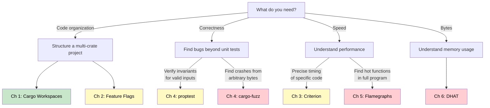

# Summary and Reference Card

> **What you'll learn:**
> - Quick-reference cheat sheets for every tool and technique covered in this guide
> - Copy-paste-ready commands for Cargo workspaces, Criterion, cargo-fuzz, flamegraphs, and DHAT
> - A decision flowchart for choosing the right verification/profiling tool

---

## Tool Decision Flowchart



---

## Cargo Workspace Cheat Sheet

### Virtual Manifest Template

```toml
# Cargo.toml (workspace root)
[workspace]
members = ["crate-a", "crate-b", "crate-c"]
resolver = "2"

[workspace.package]
version = "0.1.0"
edition = "2021"
license = "MIT"

[workspace.dependencies]
serde = { version = "1.0", features = ["derive"] }
tokio = { version = "1", features = ["full"] }

[profile.release]
debug = true    # For profiling
```

### Member Crate Template

```toml
[package]
name = "crate-a"
version.workspace = true
edition.workspace = true

[dependencies]
serde = { workspace = true }
crate-b = { path = "../crate-b" }
```

### Essential Commands

| Command | What It Does |
|---------|-------------|
| `cargo build --workspace` | Build all workspace members |
| `cargo test --workspace` | Test all workspace members |
| `cargo check --workspace` | Type-check without codegen (fast) |
| `cargo build -p crate-a` | Build a single member |
| `cargo build --workspace --timings` | Build with timing report (HTML) |
| `cargo tree --workspace` | Show dependency tree |
| `cargo tree -d --workspace` | Show only duplicate dependencies |
| `cargo hack check --each-feature --workspace` | Test every feature individually |
| `cargo hack check --feature-powerset --workspace` | Test all feature combinations |

---

## Feature Flags Cheat Sheet

### Feature Declaration

```toml
[features]
default = ["json"]
json = ["dep:serde_json"]      # Enables optional dependency
yaml = ["dep:serde_yaml"]
simd = []                       # Pure cfg flag
full = ["json", "yaml", "simd"] # Convenience alias

[dependencies]
serde_json = { version = "1.0", optional = true }
serde_yaml = { version = "0.9", optional = true }
```

### Usage in Code

```rust
#[cfg(feature = "json")]           // Include when feature enabled
#[cfg(not(feature = "json"))]      // Include when feature disabled
#[cfg(any(feature = "a", feature = "b"))]  // Either feature
#[cfg(all(feature = "a", feature = "b"))]  // Both features
```

### The Golden Rule

> **Features must be additive.** Enabling feature A + B must never break compilation. Features add code; they never remove it.

---

## Criterion Benchmarking Cheat Sheet

### Setup

```toml
# Cargo.toml
[dev-dependencies]
criterion = { version = "0.5", features = ["html_reports"] }

[[bench]]
name = "my_bench"
harness = false
```

### Minimal Benchmark

```rust
use criterion::{criterion_group, criterion_main, Criterion};
use std::hint::black_box;

fn my_benchmark(c: &mut Criterion) {
    c.bench_function("name", |b| {
        b.iter(|| {
            black_box(do_work(black_box(input)));
        });
    });
}

criterion_group!(benches, my_benchmark);
criterion_main!(benches);
# fn do_work(_: ()) -> u64 { 42 }
# static input: () = ();
```

### Essential Commands

| Command | What It Does |
|---------|-------------|
| `cargo bench` | Run all benchmarks |
| `cargo bench -p crate-bench` | Run benchmarks for a specific crate |
| `cargo bench -- "regex_pattern"` | Run matching benchmarks only |
| `cargo bench -- --save-baseline main` | Save baseline for comparison |
| `cargo bench -- --baseline main` | Compare against saved baseline |
| `open target/criterion/report/index.html` | View HTML reports with violin plots |

### Key Rules

- **Always `black_box`** inputs *and* outputs
- **Never benchmark in debug mode** — `cargo bench` uses release profile
- **Move setup outside `b.iter()`** — only measure the work
- **Check violin plots** for bimodal distributions (external noise)

---

## cargo-fuzz Cheat Sheet

### Setup

```bash
cargo install cargo-fuzz
cd my-crate
cargo fuzz init     # Creates fuzz/ directory
```

### Fuzz Target Template

```rust
#![no_main]
use libfuzzer_sys::fuzz_target;

fuzz_target!(|data: &[u8]| {
    let _ = my_crate::parse(data);  // Must not panic
});
```

### Essential Commands

| Command | What It Does |
|---------|-------------|
| `cargo +nightly fuzz list` | List all fuzz targets |
| `cargo +nightly fuzz run target_name` | Run fuzzer (Ctrl+C to stop) |
| `cargo +nightly fuzz run target_name -- -max_len=4096` | Limit input size |
| `cargo +nightly fuzz run target_name -- -timeout=5` | Timeout per input (seconds) |
| `cargo +nightly fuzz tmin target_name <crash_file>` | Minimize crash input |
| `cargo +nightly fuzz cmin target_name` | Minimize the corpus |
| `cargo +nightly fuzz coverage target_name` | Generate coverage report |

### After Finding a Crash

1. **Reproduce:** `cargo +nightly fuzz run target_name fuzz/artifacts/target_name/crash-...`
2. **Minimize:** `cargo +nightly fuzz tmin target_name <crash_file>`
3. **Fix** the bug in your code
4. **Add regression test:** Copy the minimized input into a `#[test]`
5. **Re-fuzz** to confirm no more crashes

---

## Flamegraph Cheat Sheet

### Setup

```bash
cargo install flamegraph

# Ensure debug symbols in release profile:
# [profile.release]
# debug = true
```

### Essential Commands

| Command | What It Does |
|---------|-------------|
| `cargo flamegraph --bin myapp -- args` | Profile and generate SVG |
| `cargo flamegraph --release --bin myapp -- args` | Release profile (recommended) |
| `cargo flamegraph -o before.svg --bin myapp -- args` | Custom output filename |
| `sudo cargo flamegraph --bin myapp -- args` | macOS (dtrace needs root) |
| `perf record -F 997 --call-graph dwarf ./target/release/myapp` | Manual perf (Linux) |
| `perf report` | Interactive report from perf.data |
| `perf stat ./target/release/myapp` | Hardware counter summary |

### Reading the Flamegraph

| Visual Pattern | Meaning | Action |
|---------------|---------|--------|
| Wide bar at the top | Leaf function using lots of CPU | Optimize it or call it less |
| Wide `__rust_alloc` bar | Heavy heap allocation | Use DHAT (Chapter 6) to find what |
| Wide `memcpy` bar | Data copying (Vec growth, cloning) | Pre-allocate or use references |
| Wide `clone`/`drop` bar | Expensive type lifecycle | Reduce cloning, use `&` or `Arc` |
| Hex addresses (no names) | Missing debug symbols | Set `debug = true` in profile |
| `tokio::runtime::*` bars | Async runtime overhead | Look past them to your code |

---

## DHAT Memory Profiling Cheat Sheet

### Setup

```toml
[dependencies]
dhat = "0.3"

[features]
dhat-heap = []
```

### Usage

```rust
#[cfg(feature = "dhat-heap")]
#[global_allocator]
static ALLOC: dhat::Alloc = dhat::Alloc;

fn main() {
    #[cfg(feature = "dhat-heap")]
    let _profiler = dhat::Profiler::new_heap();
    // ... your code ...
    // Report written to dhat-heap.json on drop
}
```

### Essential Commands

| Command | What It Does |
|---------|-------------|
| `cargo run --features dhat-heap` | Run with heap profiling |
| Open `dhat-heap.json` in [DHAT viewer](https://nnethercote.github.io/dh_view/dh_view.html) | Analyze allocations |

### Key DHAT Metrics

| Metric | Meaning |
|--------|---------|
| **Total bytes / blocks** | Overall allocation volume |
| **At t-gmax** | Peak live memory (memory high-water mark) |
| **At t-end** | Memory still allocated when program exits (leaks) |
| **Per-allocation-site breakdown** | Which line of code caused each allocation |

### DHAT in Tests

```rust
#[test]
fn allocation_budget() {
    let _profiler = dhat::Profiler::builder().testing().build();
    // ... run code ...
    let stats = dhat::HeapStats::get();
    assert!(stats.total_blocks <= 10, "Too many allocations");
}
```

---

## proptest Cheat Sheet

### Setup

```toml
[dev-dependencies]
proptest = "1.5"
```

### Common Strategies

```rust
use proptest::prelude::*;

proptest! {
    #[test]
    fn my_property(
        x in 0u32..1000,                // Range
        s in "[a-z]{1,20}",             // Regex-generated string
        v in prop::collection::vec(any::<u8>(), 0..100), // Vec
        b in any::<bool>(),              // Any bool
    ) {
        // ... assert properties over x, s, v, b ...
    }
}
```

### Key Operators

| Strategy | Generates |
|----------|-----------|
| `any::<T>()` | Any value of type T |
| `0..100i32` | Integer in range |
| `"[a-z]{1,10}"` | String matching regex |
| `prop::collection::vec(s, 0..n)` | Vec of elements from strategy `s` |
| `Just(value)` | Always the same value |
| `prop_oneof![a, b, c]` | One of several strategies |
| `s.prop_map(f)` | Transform generated values |
| `s.prop_flat_map(f)` | Chain-dependent generation |
| `s.prop_filter("reason", f)` | Reject values that don't match |

---

## Complete CI Pipeline Template

```yaml
# .github/workflows/ci.yml
name: CI

on: [push, pull_request]

jobs:
  test:
    runs-on: ubuntu-latest
    steps:
      - uses: actions/checkout@v4
      - uses: dtolnay/rust-toolchain@stable
      - run: cargo test --workspace

  feature-check:
    runs-on: ubuntu-latest
    steps:
      - uses: actions/checkout@v4
      - uses: dtolnay/rust-toolchain@stable
      - run: cargo install cargo-hack
      - run: cargo hack check --each-feature --workspace

  bench:
    runs-on: ubuntu-latest
    steps:
      - uses: actions/checkout@v4
      - uses: dtolnay/rust-toolchain@stable
      - run: cargo bench -- --output-format bencher | tee bench.txt
      # Optional: compare against baseline

  fuzz:
    runs-on: ubuntu-latest
    steps:
      - uses: actions/checkout@v4
      - uses: dtolnay/rust-toolchain@nightly
      - run: cargo install cargo-fuzz
      - run: cargo +nightly fuzz run fuzz_parse -- -max_total_time=300
```

---

## Quick Reference: When to Use What

| Situation | Tool | Chapter |
|-----------|------|---------|
| "My project has too many crates to manage" | Cargo Workspace | 1 |
| "I need platform-specific code" | `#[cfg]` + Feature Flags | 2 |
| "Is my optimization actually faster?" | Criterion | 3 |
| "Does my invariant hold for all inputs?" | proptest | 4 |
| "Can any byte sequence crash this?" | cargo-fuzz | 4 |
| "Where is CPU time going?" | Flamegraph | 5 |
| "Where are allocations going?" | DHAT | 6 |
| "I need to do all of the above" | Capstone workflow | 7 |

---

> **You've completed the guide.** You now have the tools and techniques to architect, test, benchmark, and profile production Rust systems. Remember the core principle: **measure, don't guess.** Every performance claim should be backed by data — a benchmark number, a flamegraph, or a DHAT report. Ship with confidence.
