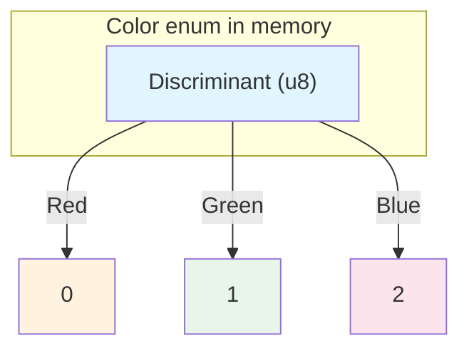
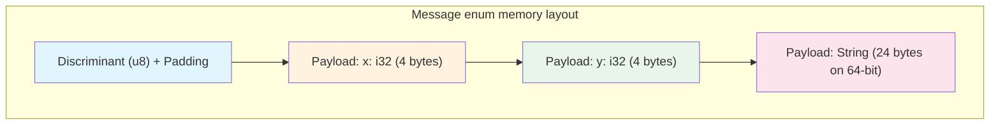

# Chapter 1: Enums and Pattern Matching 🟢

> **What you'll learn:**
> - How Rust's enums differ fundamentally from C-style enums
> - The memory layout of enums (discriminants, payloads, and the null pointer optimization)
> - Why `Option<T>` and `Result<T, E>` are the backbone of Rust's error handling
> - How exhaustiveness checking prevents bugs at compile time

---

## Beyond C-Style Enums

If you're coming from C, C++, Java, or C#, you likely think of enums as "named constants." In C:

```c
enum Color { RED, GREEN, BLUE };
```

This is just an integer with a friendly name. Rust's enums are something entirely different—they're **algebraic data types (ADTs)**, a concept from functional programming that gives you the power of tagged unions.

Let's see the difference:

```rust
// C-style: just a number
enum Color {
    Red,
    Green,
    Blue,
}

// Rust: can carry data!
enum Message {
    Quit,                          // No data
    Move { x: i32, y: i32 },       // Named fields
    Write(String),                 // Single value
    ChangeColor(u8, u8, u8),       // Tuple of values
}
```

The `Message` enum can be **one of four different things**, each with different associated data. This is called a **tagged union**—the enum "tag" tells you which variant you have, and the "union" holds the data for that variant.

---

## The Power of Algebraic Data Types

### Sum Types vs. Product Types

In type theory:
- **Product types** (structs, tuples) are the **AND** of types: "a value that is both A AND B"
- **Sum types** (enums) are the **OR** of types: "a value that is either A OR B"

```rust
// Product type: a User is both an ID AND a Name AND an Email
struct User {
    id: u64,
    name: String,
    email: String,
}

// Sum type: a Status is either Pending OR Approved OR Rejected
enum Status {
    Pending,
    Approved,
    Rejected,
}
```

This matters because the type system can now track **which case** you're dealing with. A function that takes `Status` knows it has exactly three possibilities—and the compiler will verify you've handled all of them.

---

## The Standard Library's Most Important Enums

### Option<T>: The Absence of a Value

`Option` is defined as:

```rust
enum Option<T> {
    None,
    Some(T),
}
```

This replaces the billion-dollar mistake of null pointers. In Rust, there's no `null`. Instead, you explicitly model "might not have a value":

```rust
fn find_user(id: u64) -> Option<User> {
    // Database lookup might find nothing
    if id == 0 {
        None  // User not found
    } else {
        Some(User { id, name: "Alice".into(), email: "alice@example.com".into() })
    }
}

fn main() {
    let user = find_user(42);
    
    // Pattern matching - the compiler ensures you handle both cases!
    match user {
        Some(u) => println!("Found user: {}", u.name),
        None => println!("User not found"),
    }
    
    // Or use if-let for simple cases
    if let Some(u) = find_user(42) {
        println!("Found: {}", u.name);
    }
}
```

### Result<T, E>: The Absence of Success

`Result` is defined as:

```rust
enum Result<T, E> {
    Ok(T),
    Err(E),
}
```

This is Rust's primary error handling mechanism. Unlike exceptions (which can be thrown anywhere and bubble up unpredictably), `Result` makes errors **explicit** in the type signature:

```rust
use std::fs::File;
use std::io::Read;

fn read_file(path: &str) -> Result<String, std::io::Error> {
    // The ? operator propagates errors - more on this in Chapter 10
    let mut file = File::open(path)?;
    let mut contents = String::new();
    file.read_to_string(&mut contents)?;
    Ok(contents)
}
```

> **Key insight:** The `?` operator is syntactic sugar that calls `From::from` on the error. This connects directly to the trait system we'll explore in Part II.

---

## Memory Layout of Enums

Understanding how enums are laid out in memory helps you make informed performance decisions.

### The Simple Case: Discriminant Only

```rust
enum Color {
    Red,
    Green,
    Blue,
}
```



**Size:** 1 byte (just the discriminant). The compiler uses the smallest integer that can hold all variants.

### The Complex Case: Discriminant + Payload

```rust
enum Message {
    Quit,
    Move { x: i32, y: i32 },
    Write(String),
}
```



**Size:** The maximum of:
- Size of discriminant + padding to align the largest variant
- Size of the largest variant

In this case: `max(1 + 7 padding, 8)` = 8 bytes (assuming i32 requires 4-byte alignment).

### The Null Pointer Optimization (NPO)

Rust has a clever optimization for enums where one variant is "nothing" (like `None` in `Option`):

```rust
enum Option<T> {
    None,
    Some(T),
}
```

If `T` is a pointer type (or can be represented as a pointer), Rust can use the **null bit pattern**:

```mermaid
graph TB
    subgraph "Option<&str> memory layout"
        A["Pointer (8 bytes)"]
    end
    
    A -->|"Some(\"hello\")"| B["valid pointer"]
    A -->|"None"| C["null pointer (0x0)"]
    
    style A fill:#e1f5fe
    style B fill:#e8f5e9
    style C fill:#ffcdd2
```

**Size of `Option<&str>`:** 8 bytes (same as a single pointer), not 16 bytes (pointer + discriminant)!

The discriminant is "encoded" in the pointer itself: if it's null, it's `None`; otherwise, it's `Some`. This is the **null pointer optimization**, and it's why `Option<&T>` is zero-cost.

> **Note:** This optimization applies when:
> - The enum has exactly two variants
> - One variant has no data (unit variant)
> - The other variant has a single field that's a pointer-sized type

---

## Pattern Matching: The Compiler's Safety Net

The real power of enums comes from pattern matching. Rust's `match` expression is **exhaustive**—you must handle every possible variant, or the code won't compile.

```rust
fn process_status(status: Status) -> String {
    match status {
        Status::Pending => "Waiting...".to_string(),
        Status::Approved => "Go ahead!".to_string(),
        Status::Rejected => "Not allowed.".to_string(),
        // Compiler error if we forget any variant!
    }
}
```

### What Happens If You Miss a Case?

```rust
// ❌ FAILS: `match` must be exhaustive
enum Status { Pending, Approved, Rejected }

fn process(status: Status) -> i32 {
    match status {
        Status::Pending => 0,
        Status::Approved => 1,
        // ERROR: pattern `Status::Rejected` not covered
    }
}
```

The compiler actually tells you what's missing:

```
error: non-exhaustive patterns: `Status::Rejected` not covered
```

This is **compile-time bug prevention**. In other languages, forgetting a case is a runtime bug. In Rust, it's a compile error.

### Using `_` for Catch-All Cases

Sometimes you want to handle some cases specifically and have a default for everything else:

```rust
fn process(status: Status) -> String {
    match status {
        Status::Pending => "Waiting...".to_string(),
        other => format!("Status code: {:?}", other),  // Catch-all
    }
}
```

Or use `_` to explicitly ignore the value:

```rust
fn process(status: Status) -> String {
    match status {
        Status::Pending => "Waiting...".to_string(),
        _ => "Done".to_string(),  // All other cases
    }
}
```

---

## If-Let and While-Let: Syntactic Sugar

For simple one-variant checks, `match` is verbose. Rust provides `if let` and `while let`:

```rust
// Instead of:
match option_value {
    Some(x) => println!("Got: {}", x),
    None => println!("Nothing"),
}

// You can write:
if let Some(x) = option_value {
    println!("Got: {}", x);
} else {
    println!("Nothing");
}
```

`while let` is particularly useful for iterators:

```rust
// Drain a queue until it's empty
while let Some(item) = queue.pop() {
    process(item);
}
```

---

## Advanced: Custom Enum Memory Layout

You can control the discriminant type with `#[repr]`:

```rust
#[repr(u32)]  // Use 32-bit integer for discriminant
enum Status {
    Pending = 0,
    Approved = 1,
    Rejected = 2,
}
```

This is useful when interoperating with C code or when you need specific discriminant values.

---

## Exercise: Modeling a Payment State Machine

<details>
<summary><strong>🏋️ Exercise: Payment State Machine</strong> (click to expand)</summary>

Create an enum representing a payment that can be in one of these states:
- `Pending` - waiting for processing
- `Authorized` - payment has been authorized (carries amount)
- `Captured` - payment was successfully captured (carries amount and timestamp)
- `Failed` - payment failed (carries error message)

Write a function that processes a payment and returns a description of what happened using pattern matching.

**Challenge:** Make the `Failed` variant carry a custom error type that can be one of:
- `InsufficientFunds`
- `CardExpired`
- `NetworkError(String)`

</details>

<details>
<summary>🔑 Solution</summary>

```rust
// Define the error type first
#[derive(Debug)]
enum PaymentError {
    InsufficientFunds,
    CardExpired,
    NetworkError(String),
}

// The main payment status enum
#[derive(Debug)]
enum PaymentStatus {
    Pending,
    Authorized { amount: f64 },
    Captured { amount: f64, timestamp: u64 },
    Failed(PaymentError),
}

impl PaymentStatus {
    fn process(&self) -> String {
        match self {
            PaymentStatus::Pending => {
                "Payment is pending processing.".to_string()
            }
            PaymentStatus::Authorized { amount } => {
                format!("Payment authorized for ${:.2}", amount)
            }
            PaymentStatus::Captured { amount, timestamp } => {
                format!(
                    "Payment of ${:.2} captured at timestamp {}",
                    amount, timestamp
                )
            }
            PaymentStatus::Failed(error) => {
                match error {
                    PaymentError::InsufficientFunds => {
                        "Payment failed: insufficient funds".to_string()
                    }
                    PaymentError::CardExpired => {
                        "Payment failed: card has expired".to_string()
                    }
                    PaymentError::NetworkError(msg) => {
                        format!("Payment failed: network error - {}", msg)
                    }
                }
            }
        }
    }
}

fn main() {
    let payments = vec![
        PaymentStatus::Pending,
        PaymentStatus::Authorized { amount: 99.99 },
        PaymentStatus::Captured { amount: 99.99, timestamp: 1699999999 },
        PaymentStatus::Failed(PaymentError::InsufficientFunds),
        PaymentStatus::Failed(PaymentError::NetworkError("timeout".to_string())),
    ];
    
    for payment in &payments {
        println!("{}", payment.process());
    }
}
```

**Key points demonstrated:**
1. Nested enums (PaymentError inside PaymentStatus)
2. Named fields in enum variants
3. Pattern matching with destructuring
4. Exhaustiveness checking (try removing one variant!)

</details>

---

## Key Takeaways

1. **Rust enums are algebraic data types** — they can carry data, not just be named constants
2. **`Option<T>` and `Result<T, E>` are foundational** — they replace null pointers and exceptions with explicit type modeling
3. **Memory layout matters** — understanding discriminants, payloads, and the null pointer optimization helps you write performant code
4. **Exhaustiveness checking is a feature** — the compiler prevents missing cases, turning runtime bugs into compile errors

> **See also:**
> - [Chapter 2: Generics and Monomorphization](./ch02-generics-and-monomorphization.md) — How to write generic code over enum types
> - [Chapter 10: Error Handling and Conversions](./ch10-error-handling-and-conversions.md) — Deep dive into `Result` and the `?` operator
> - [Rust Memory Management: The Stack, Heap, and Pointers](../memory-management-book/ch02-stack-heap-and-pointers.md) — Memory layout details