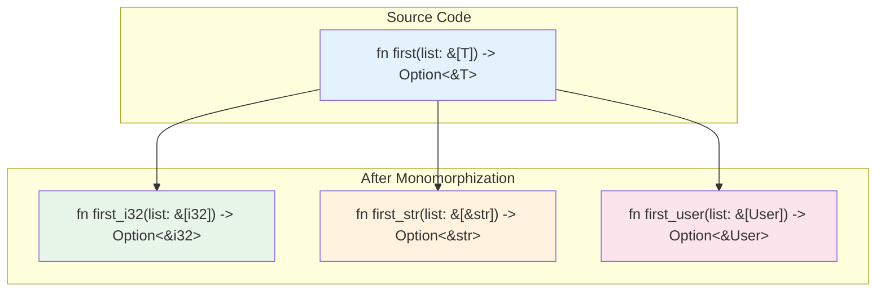
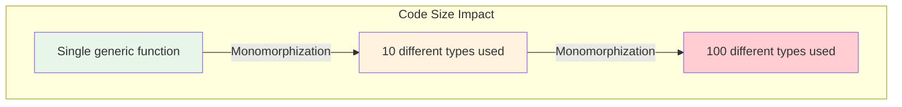

# Chapter 2: Generics and Monomorphization 🟡

> **What you'll learn:**
> - How Rust's generics differ from templates in C++ or generics in Java
> - The process of monomorphization and why it enables zero-cost abstractions
> - When generics provide static dispatch vs. when you need dynamic dispatch
> - The trade-offs between code size and runtime performance

---

## What Are Generics?

Generics allow you to write code that works with **multiple types** without sacrificing type safety. In Rust, generics are checked at compile time—you get the ergonomics of dynamic typing with the performance of static typing.

```rust
// A generic function that works with any type T
fn first<T>(list: &[T]) -> Option<&T> {
    list.first()
}

fn main() {
    let numbers = vec![1, 2, 3];
    let strings = vec!["hello", "world"];
    
    // Same function, different types - no runtime overhead
    println!("{:?}", first(&numbers));  // Some(1)
    println!("{:?}", first(&strings));  // Some("hello")
}
```

---

## Generic Structs and Enums

Generics work with structs, enums, and functions:

```rust
// Generic struct
struct Point<T> {
    x: T,
    y: T,
}

// Generic enum
enum Either<T, E> {
    Left(T),
    Right(E),
}

// Generic implementation
impl<T> Point<T> {
    fn new(x: T, y: T) -> Self {
        Point { x, y }
    }
}

// Generic method with additional type parameter
impl<T> Point<T> {
    fn map<U, F>(self, f: F) -> Point<U>
    where
        F: Fn(T) -> U,
    {
        Point {
            x: f(self.x),
            y: f(self.y),
        }
    }
}
```

---

## How Rust Compiles Generics: Monomorphization

This is the critical concept. Unlike C++ templates (which generate code at link time) or Java generics (which use erasure), Rust uses **monomorphization**.

### What Is Monomorphization?

Monomorphization is the process of generating **specific versions of generic code for each concrete type** it's used with.



### What You Write vs. What Happens Under the Hood

**What you write:**
```rust
fn largest<T: PartialOrd>(list: &[T]) -> Option<&T> {
    let mut largest = &list[0];
    for item in list {
        if item > largest {
            largest = item;
        }
    }
    Some(largest)
}

fn main() {
    let numbers = vec![34, 50, 25, 100, 65];
    let chars = vec!['y', 'm', 'a', 'q', 'b'];
    
    println!("{:?}", largest(&numbers));
    println!("{:?}", largest(&chars));
}
```

**What the compiler generates (conceptually):**
```rust
// Version for i32
fn largest_i32(list: &[i32]) -> Option<&i32> {
    let mut largest = &list[0];
    for item in list {
        if item > largest {
            largest = item;
        }
    }
    Some(largest)
}

// Version for char
fn largest_char(list: &[char]) -> Option<&char> {
    let mut largest = &list[0];
    for item in list {
        if item > largest {
            largest = item;
        }
    }
    Some(largest)
}
```

---

## Zero-Cost Abstractions in Action

Because Rust monomorphizes, generic code has **no runtime overhead** compared to writing the same code for each type:

```rust
// Generic version - compiles to essentially the same machine code
fn sum<T: Add<Output = T>>(a: T, b: T) -> T {
    a + b}

// Explicit versions - what the compiler effectively generates
fn sum_i32(a: i32, b: i32) -> i32 { a + b }
fn sum_f64(a: f64, b: f64) -> f64 { a + b }
```

The machine code is identical. You get:
- **Type safety** at compile time
- **Zero runtime cost** at runtime

This is the "zero-cost abstraction" promise: write high-level code, get low-level performance.

---

## Trait Bounds: Constraining Generics

Sometimes you need to restrict what types can be used with your generic. That's where **trait bounds** come in.

### Basic Trait Bounds

```rust
// T must implement Display - we can print it
fn print<T: std::fmt::Display>(value: T) {
    println!("{}", value);
}

// T must implement Clone - we can copy it
fn duplicate<T: Clone>(value: T) -> (T, T) {
    (value.clone(), value.clone())
}
```

### Multiple Trait Bounds

```rust
// Using + to combine bounds
fn print_and_clone<T: std::fmt::Display + Clone>(value: T) {
    println!("{}", value);
    let _ = value.clone();
}

// Using where clause for cleaner syntax
fn process<T>(value: T) -> String
where
    T: std::fmt::Display + std::fmt::Debug,
{
    format!("Debug: {:?}, Display: {}", value, value)
}
```

### Common Trait Bounds

| Trait | What it requires | Use case |
|-------|------------------|----------|
| `Clone` | Deep copy | Creating independent copies |
| `Copy` | Bitwise copy | Value semantics (no move) |
| `Default` | Default constructor | Creating default values |
| `Debug` | Debug formatting | Printing for debugging |
| `Display` | User-facing formatting | Display to users |
| `PartialEq` | Equality comparison | `==` operator |
| `PartialOrd` | Ordering comparison | `<`, `>`, etc. |
| `Send` | Safe to send across threads | Multi-threaded code |
| `Sync` | Safe to share across threads | Multi-threaded code |

---

## Generic Implementations

You can implement methods for generic types with specific trait bounds:

```rust
struct Wrapper<T> {
    value: T,
}

impl<T> Wrapper<T> {
    // Available for any T
    fn new(value: T) -> Self {
        Wrapper { value }
    }
}

impl<T: std::fmt::Display> Wrapper<T> {
    // Only available when T implements Display
    fn display(&self) {
        println!("Wrapped: {}", self.value);
    }
}

impl<T: Clone> Wrapper<T> {
    // Only available when T implements Clone
    fn clone_inner(&self) -> T {
        self.value.clone()
    }
}
```

---

## Code Bloat: The Trade-Off

Monomorphization has one downside: **code bloat**. Each concrete type generates its own copy of the generic code.



**Practical implications:**
- A generic function used with 100 different types generates 100 copies
- This increases binary size
- But each copy is optimized for its specific type

### When This Matters

```rust
// This could generate many copies
fn process<T>(items: Vec<T>) where T: Trait { ... }

// Consider alternatives for extreme generic usage:
// - Use trait objects (dyn Trait) - Chapter 7
// - Use enums for known variants
// - Accept some runtime polymorphism
```

---

## Static vs. Dynamic Dispatch

This is a crucial distinction:

| Aspect | Static Dispatch (Generics) | Dynamic Dispatch (dyn Trait) |
|--------|---------------------------|------------------------------|
| **Resolution** | Compile time | Runtime |
| **Performance** | Zero overhead | Function pointer lookup |
| **Code size** | Larger (monomorphization) | Smaller (single vtable) |
| **Type information** | Known at compile time | Erased at runtime |
| **Inline potential** | Full inlining | Limited |

```rust
// Static dispatch - monomorphized
fn process<T: Trait>(item: T) {
    item.method();
}

// Dynamic dispatch - uses vtable
fn process_dyn(item: &dyn Trait) {
    item.method();
}
```

We'll explore dynamic dispatch in depth in Chapter 7.

---

## Exercise: Generic Stack Implementation

<details>
<summary><strong>🏋️ Exercise: Generic Stack</strong> (click to expand)</summary>

Implement a generic `Stack<T>` that:
1. Uses a `Vec<T>` internally
2. Has `push`, `pop`, `peek`, and `is_empty` methods
3. Uses trait bounds where appropriate (e.g., `Clone` for peek, `Default` for empty check)

**Challenge:** Add a method `stack_map<U, F>(self, f: F) -> Stack<U>` that transforms the stack elements using a closure, but only when elements are `Clone`.

</details>

<details>
<summary>🔑 Solution</summary>

```rust
#[derive(Debug)]
struct Stack<T> {
    items: Vec<T>,
}

impl<T> Stack<T> {
    fn new() -> Self {
        Stack { items: Vec::new() }
    }
    
    fn push(&mut self, item: T) {
        self.items.push(item);
    }
    
    fn pop(&mut self) -> Option<T> {
        self.items.pop()
    }
    
    fn peek(&self) -> Option<&T> {
        self.items.last()
    }
    
    fn is_empty(&self) -> bool {
        self.items.is_empty()
    }
    
    fn len(&self) -> usize {
        self.items.len()
    }
}

// Default for empty stack
impl<T> Default for Stack<T> {
    fn default() -> Self {
        Self::new()
    }
}

// Clone for peek (can't peek a moved value)
impl<T: Clone> Stack<T> {
    fn peek_cloned(&self) -> Option<T> {
        self.items.last().cloned()
    }
}

// Transform stack elements - requires Clone because we need to 
// keep the original while creating new values
impl<T: Clone> Stack<T> {
    fn map<U, F>(self, f: F) -> Stack<U>
    where
        F: Fn(T) -> U,
    {
        Stack {
            items: self.items.into_iter().map(f).collect(),
        }
    }
}

fn main() {
    let mut stack: Stack<i32> = Stack::new();
    
    stack.push(1);
    stack.push(2);
    stack.push(3);
    
    println!("Peek: {:?}", stack.peek());       // Some(&3)
    println!("Pop: {:?}", stack.pop());         // Some(3)
    println!("Len: {}", stack.len());           // 2
    
    // Transform using map
    let stack: Stack<i32> = Stack::new();
    stack.push(1);
    stack.push(2);
    stack.push(3);
    
    let string_stack = stack.map(|x| x.to_string());
    println!("String stack: {:?}", string_stack);
}
```

**Key points:**
1. Multiple `impl` blocks for different trait bounds
2. `Clone` bound needed when we need to "read" a value without consuming it
3. The `map` method takes `self` (consumes) because we need to move values

</details>

---

## Key Takeaways

1. **Generics provide compile-time polymorphism** — Write once, use with many types
2. **Monomorphization creates specialized code** — Each concrete type gets its own optimized version
3. **Zero-cost abstraction is real** — Generic code compiles to the same machine code as hand-written versions
4. **Trait bounds constrain generic types** — Use `where` clauses for complex bounds
5. **Code bloat is the trade-off** — More types = larger binaries, but faster execution

> **See also:**
> - [Chapter 3: Const Generics and Newtypes](./ch03-const-generics-and-newtypes.md) — Compile-time type-level programming
> - [Chapter 7: Trait Objects and Dynamic Dispatch](./ch07-trait-objects-and-dynamic-dispatch.md) — When to use `dyn Trait` instead of generics
> - [C++ to Rust: Semantic Deep Dives](../c-cpp-book/ch18-cpp-rust-semantic-deep-dives.md) — How Rust generics compare to C++ templates