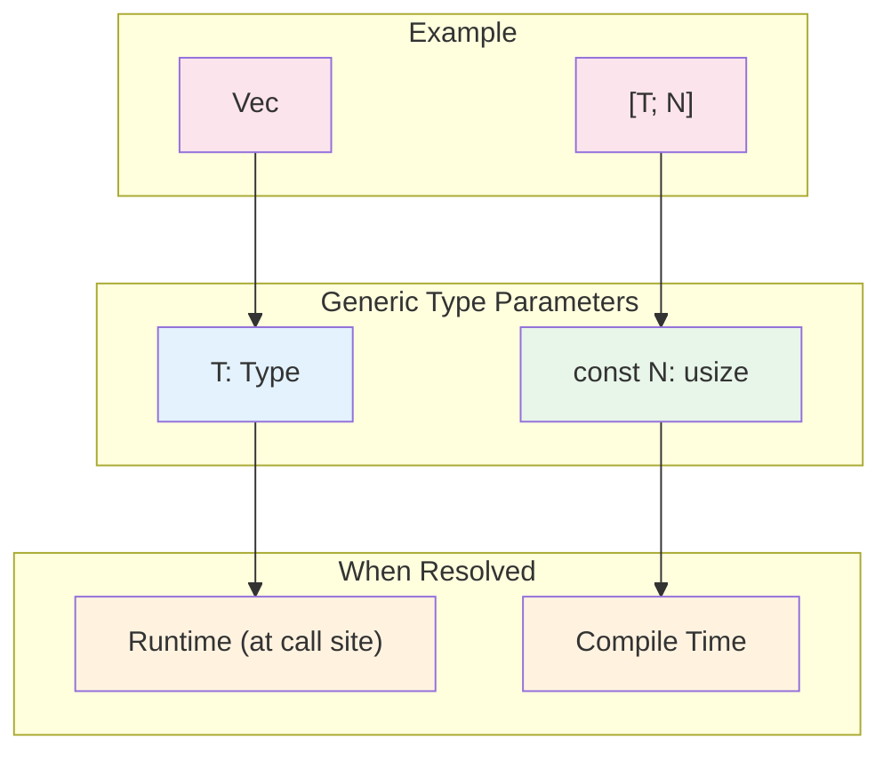
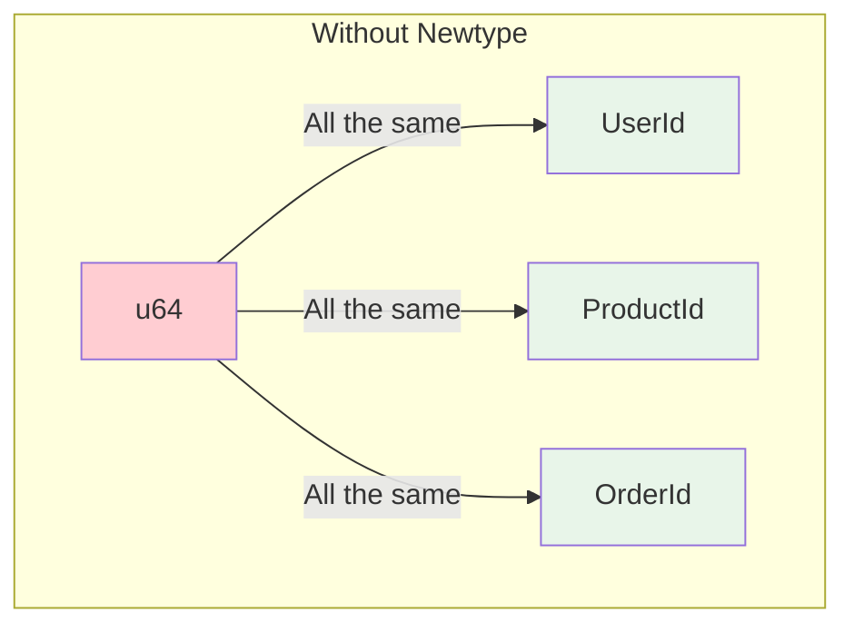

# Chapter 3: Const Generics and Newtypes 🟡

> **What you'll learn:**
> - How const generics enable compile-time type-level programming
> - The Newtype pattern for domain-driven type safety
> - Bypassing the Orphan Rule with the Newtype pattern
> - Using const generics for zero-cost array operations

---

## Const Generics: Types as Values

Const generics allow you to use **compile-time constants** as type parameters. This is different from regular generics (which use types) and from const expressions (which are values).

```rust
// Before const generics: had to use Vec or runtime-sized arrays
struct ArrayVec<T> {
    items: Vec<T>,  // Runtime allocation
}

// With const generics: stack-allocated fixed-size array
struct FixedArray<T, const N: usize> {
    items: [T; N],  // Compile-time known size
}
```

### The Basic Syntax

```rust
// A generic array that holds N elements of type T
struct Matrix<T, const N: usize> {
    data: [T; N],
}

impl<T, const N: usize> Matrix<T, N> {
    fn new() -> Self where T: Default {
        Matrix {
            data: [T::default(); N],
        }
    }
    
    fn len(&self) -> usize {
        N
    }
}

fn main() {
    let matrix: Matrix<i32, 3> = Matrix::new();
    println!("Matrix size: {}", matrix.len());  // 3
    
    // Different size = different type!
    let matrix: Matrix<i32, 5> = Matrix::new();
    println!("Matrix size: {}", matrix.len());  // 5
}
```

---

## Const Generics vs. Runtime Generics



### What You Can Use as Const Generics

```rust
// Integer types
struct Array<T, const N: usize> { ... }

// Works with these sizes:
let arr: Array<i32, 10> = ...;    // Literal
let arr: Array<i32, { 10 }> = ...; // Const expression

// But NOT with runtime values:
let size = 10;
// ❌ FAILS: const expected, found usize
let arr: Array<i32, size> = ...;
```

---

## Practical Use Cases for Const Generics

### 1. Zero-Cost Fixed-Size Buffers

```rust
// Network packet buffer - known size at compile time
struct PacketBuffer<const N: usize> {
    data: [u8; N],
    length: usize,
}

impl<const N: usize> PacketBuffer<N> {
    fn new() -> Self {
        PacketBuffer {
            data: [0; N],
            length: 0,
        }
    }
    
    fn write(&mut self, bytes: &[u8]) -> Result<(), ()> {
        if bytes.len() > N - self.length {
            return Err(());
        }
        self.data[self.length..self.length + bytes.len()].copy_from_slice(bytes);
        self.length += bytes.len();
        Ok(())
    }
}
```

### 2. Type-Level Programming

```rust
// Markers for different buffer sizes
struct TinyBuffer;
struct SmallBuffer;
struct LargeBuffer;

struct Buffer<T, B> {
    data: T,
    _marker: B,
}

// Different types for different sizes - compiler catches misuse
impl Buffer<u8, TinyBuffer> {
    fn new() -> Self {
        Buffer { data: 0, _marker: TinyBuffer }
    }
}
```

### 3. SIMD and Performance-Critical Code

```rust
// Vector of exactly 4 elements - can use SIMD instructions
use std::arch::simd::SimdFloat;

struct SimdVec4<T: SimdFloat> {
    lanes: [T; 4],
}
```

---

## The Newtype Pattern: Types That Mean Something

The Newtype pattern wraps an existing type in a struct to give it **semantic meaning**. This is one of the most powerful patterns in Rust for domain-driven design.

### Basic Newtype

```rust
// A raw u64 is just a number - it could be anything
let user_id: u64 = 42;
let product_id: u64 = 42;

// These are the same type - the compiler can't help us
fn get_user(id: u64) -> User { ... }
fn get_product(id: u64) -> Product { ... }

// Newtypes create distinct types
struct UserId(u64);
struct ProductId(u64);

let user_id = UserId(42);
let product_id = ProductId(42);

// Now the compiler catches our mistakes!
fn get_user(id: UserId) -> User { ... }
fn get_product(id: ProductId) -> Product { ... }

// ❌ FAILS: cannot pass ProductId where UserId is expected
get_user(product_id);  // Compile error!
```

### Why This Matters



The compiler can now catch:
- Passing a user ID where a product ID is expected
- Confusing currency amounts (USD vs EUR)
- Mixing up different kinds of identifiers

---

## Implementing Traits on Newtypes

### The Problem: Orphan Rule

The **Orphan Rule** states: you can't implement a trait from another crate for a type from another crate. This prevents conflicting implementations.

```rust
// ❌ FAILS: Can't implement Display for u64 (both from std)
impl std::fmt::Display for u64 {
    fn fmt(&self, f: &mut std::fmt::Formatter) -> std::fmt::Result {
        write!(f, "User #{}", self)
    }
}
```

### The Solution: Newtype

```rust
// Wrap it - now it's YOUR type
struct UserId(u64);

// Now you CAN implement traits!
impl std::fmt::Display for UserId {
    fn fmt(&self, f: &mut std::fmt::Formatter) -> std::fmt::Result {
        write!(f, "User #{}", self.0)
    }
}

impl std::fmt::Debug for UserId {
    fn fmt(&self, f: &mut std::fmt::Formatter) -> std::fmt::Result {
        write!(f, "UserId({})", self.0)
    }
}

// Implement your own traits
trait Identifiable {
    fn id(&self) -> u64;
}

impl Identifiable for UserId {
    fn id(&self) -> u64 {
        self.0
    }
}
```

---

## Newtypes for Validation

### Compile-Time Validation

```rust
// Email - validated at construction
struct Email(String);

impl Email {
    fn new(s: String) -> Result<Email, String> {
        if s.contains('@') {
            Ok(Email(s))
        } else {
            Err("Invalid email".to_string())
        }
    }
}

// Now any Email is guaranteed valid
fn send_email(email: &Email) { ... }
```

### Type-Level Guarantees

```rust
// Positive number - enforced at construction
struct Positive(i32);

impl Positive {
    fn new(n: i32) -> Option<Positive> {
        if n > 0 {
            Some(Positive(n))
        } else {
            None
        }
    }
    
    fn sqrt(self) -> Positive {
        // We KNOW it's positive, no runtime check needed
        Positive((self.0 as f64).sqrt() as i32)
    }
}

// Usage
let x = Positive::new(5).unwrap();
let root = x.sqrt();  // Guaranteed positive result
```

---

## Tuple Structs vs. Named Fields

```rust
// Tuple struct - like a tuple, but a distinct type
struct UserId(u64);

// Named struct - more readable for complex types
struct User {
    id: UserId,
    name: String,
    email: Email,
}

// When to use which:
// - Tuple struct: single-field wrapper (newtype)
// - Named struct: multiple fields
```

---

## Exercise: Type-Safe Units

<details>
<summary><strong>🏋️ Exercise: Type-Safe Units</strong> (click to expand)</summary>

Create a type-safe measurement system:

1. **Newtypes for different units:**
   - Meters (m)
   - Feet (ft)
   - Kilograms (kg)
   - Pounds (lb)

2. **Conversions between units:**
   - Implement `From` traits for conversions
   - `Meters -> Feet` and vice versa
   - `Kilograms -> Pounds` and vice versa

3. **Const generic for arrays:**
   - Create a `MeasurementArray<T, const N: usize>` that holds N measurements

**Challenge:** Prevent adding meters to kilograms by implementing a marker trait system.

</details>

<details>
<summary>🔑 Solution</summary>

```rust
// Marker trait for distance units
trait Distance: Clone + Copy + std::fmt::Debug {}
impl Distance for Meters {}
impl Distance for Feet {}

// Marker trait for mass units
trait Mass: Clone + Copy + std::fmt::Debug {}
impl Mass for Kilograms {}
impl Mass for Pounds {}

// Newtypes with validation
#[derive(Clone, Copy, Debug)]
struct Meters(f64);

#[derive(Clone, Copy, Debug)]
struct Feet(f64);

#[derive(Clone, Copy, Debug)]
struct Kilograms(f64);

#[derive(Clone, Copy, Debug)]
struct Pounds(f64);

// Conversions
const METERS_TO_FEET: f64 = 3.28084;
const KG_TO_LBS: f64 = 2.20462;

impl From<Meters> for Feet {
    fn from(m: Meters) -> Feet {
        Feet(m.0 * METERS_TO_FEET)
    }
}

impl From<Feet> for Meters {
    fn from(f: Feet) -> Meters {
        Meters(f.0 / METERS_TO_FEET)
    }
}

impl From<Kilograms> for Pounds {
    fn from(k: Kilograms) -> Pounds {
        Pounds(k.0 * KG_TO_LBS)
    }
}

impl From<Pounds> for Kilograms {
    fn from(p: Pounds) -> Kilograms {
        Kilograms(p.0 / KG_TO_LBS)
    }
}

// Const generic array
#[derive(Debug)]
struct MeasurementArray<T, const N: usize> {
    measurements: [T; N],
}

impl<T: Default + Copy, const N: usize> MeasurementArray<T, N> {
    fn new() -> Self {
        MeasurementArray {
            measurements: [T::default(); N],
        }
    }
}

impl<T: Clone, const N: usize> MeasurementArray<T, N> {
    fn from_slice(slice: &[T]) -> Option<Self> {
        if slice.len() != N {
            return None;
        }
        let mut arr = [slice[0].clone(); N];
        arr.copy_from_slice(slice);
        Some(MeasurementArray { measurements: arr })
    }
}

fn main() {
    let distance = Meters(10.0);
    let in_feet: Feet = distance.into();
    println!("{:?} = {:?}", distance, in_feet);
    
    let mass = Kilograms(100.0);
    let in_pounds: Pounds = mass.into();
    println!("{:?} = {:?}", mass, in_pounds);
    
    // Const generic array
    let arr: MeasurementArray<Meters, 3> = MeasurementArray::new();
    println!("Array: {:?}", arr);
    
    // ❌ FAILS: Can't add distance to mass
    // distance + mass;  // Would need trait, but they're different!
}
```

**Key points:**
1. Marker traits (`Distance`, `Mass`) categorize types
2. Newtypes wrap raw values with semantic meaning
3. `From` traits provide idiomatic conversions
4. Const generics work with the newtypes

</details>

---

## Key Takeaways

1. **Const generics enable compile-time type-level programming** — Use `const N: usize` for fixed-size arrays
2. **Newtypes create semantic types** — `UserId(u64)` is different from `ProductId(u64)`
3. **Newtypes bypass the Orphan Rule** — You can implement traits on your newtypes
4. **Type-driven correctness** — The compiler catches mistakes that would be runtime bugs in other languages

> **See also:**
> - [Chapter 4: Defining and Implementing Traits](./ch04-defining-and-implementing-traits.md) — The foundation of trait system
> - [Type-Driven Correctness: The Philosophy](../type-driven-correctness-book/ch01-the-philosophy-why-types-beat-tests.md) — Deep dive into making illegal states unrepresentable
> - [C++ to Rust: Semantic Deep Dives](../c-cpp-book/ch18-cpp-rust-semantic-deep-dives.md) — How newtypes compare to C++ type aliases