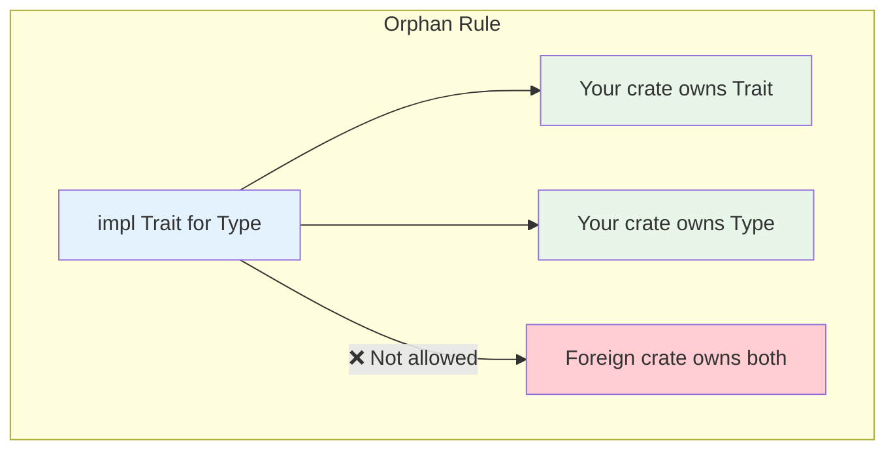

# Chapter 4: Defining and Implementing Traits 🟢

> **What you'll learn:**
> - How traits define shared behavior in Rust
> - The difference between traits and interfaces in other languages
> - The Orphan Rule and trait coherence
> - How to implement traits for your own types and external types

---

## Traits as Contracts

In Rust, **traits** define shared behavior that types can implement. They're similar to interfaces in Java/C# or abstract base classes in C++, but with important differences.

```rust
// Define a trait - the "contract"
trait Printable {
    fn print(&self);
}

// Implement the trait for a type
struct Point {
    x: i32,
    y: i32,
}

impl Printable for Point {
    fn print(&self) {
        println!("Point({}, {})", self.x, self.y);
    }
}
```

---

## Trait Definition Syntax

### Basic Trait

```rust
trait Describable {
    // Method signature - implementors must provide this
    fn describe(&self) -> String;
    
    // Default implementation - optional to override
    fn describe_with_prefix(&self) -> String {
        format!("Description: {}", self.describe())
    }
}
```

### Trait with Multiple Methods

```rust
trait Container {
    fn len(&self) -> usize;
    fn is_empty(&self) -> bool {
        self.len() == 0
    }
    fn push(&mut self, item: Self::Item);
    
    // Associated type (more on this in Chapter 5)
    type Item;
}
```

---

## Implementing Traits

### For Your Own Types

```rust
trait Summable {
    fn sum(&self) -> i32;
}

struct Numbers {
    values: Vec<i32>,
}

impl Summable for Numbers {
    fn sum(&self) -> i32 {
        self.values.iter().sum()
    }
}
```

### For External Types (The Newtype Solution)

Remember the Orphan Rule from Chapter 3? You can't implement external traits for external types, but you can use the Newtype pattern:

```rust
// std's String - we can't implement Display for it directly
// But we can wrap it!

struct PrettyString(String);

impl std::fmt::Display for PrettyString {
    fn fmt(&self, f: &mut std::fmt::Formatter) -> std::fmt::Result {
        // Add quotes around the string
        write!(f, "\"{}\"", self.0)
    }
}

fn main() {
    let s = PrettyString("hello".to_string());
    println!("{}", s);  // "hello"
}
```

---

## Trait Bounds: Using Traits as Constraints

### In Function Signatures

```rust
trait Print {
    fn print(&self);
}

fn print_all<T: Print>(items: &[T]) {
    for item in items {
        item.print();
    }
}

// Or using `impl Trait` syntax (more on this in Chapter 7)
fn print_all_impl(items: &[impl Print]) {
    for item in items {
        item.print();
    }
}
```

### In Struct Definitions

```rust
struct Printer<T: Print> {
    item: T,
}

impl<T: Print> Printer<T> {
    fn new(item: T) -> Self {
        Printer { item }
    }
    
    fn print(&self) {
        self.item.print();
    }
}
```

---

## The Orphan Rule Explained

The **Orphan Rule** is a core Rust rule: you can only implement a trait for a type if either the trait or the type is defined in your crate.



### Why This Rule Exists

The rule prevents **conflicting implementations**. If two crates could both implement `Display` for `Vec<u8>`, which one wins?

```rust
// In crate A
impl std::fmt::Display for Vec<u8> {
    fn fmt(&self, f: &mut std::fmt::Formatter) -> std::fmt::Result {
        write!(f, "Binary: {:?}", self)
    }
}

// In crate B  
impl std::fmt::Display for Vec<u8> {
    fn fmt(&self, f: &mut std::fmt::Formatter) -> std::fmt::Result {
        write!(f, "Hex: {:02x?}", self)
    }
}

// If both crates are used together - which implementation?
// The compiler can't choose - hence the rule!
```

### Workarounds

1. **Newtype pattern** (as shown above)
2. **Wrapper types** for collections
3. **Extension traits** (Chapter 9)

---

## Default Implementations

Traits can provide default method implementations:

```rust
trait Describable {
    fn name(&self) -> &str;
    
    // Default implementation
    fn describe(&self) -> String {
        format!("Item: {}", self.name())
    }
}

struct User {
    username: String,
}

impl Describable for User {
    fn name(&self) -> &str {
        &self.username
    }
    // Inherits describe() default implementation
}
```

This allows traits to be extended without breaking existing implementations.

---

## Supertraits: Trait Inheritance

A trait can require another trait:

```rust
trait Printable {
    fn print(&self);
}

trait Debug: Printable {
    fn debug(&self);
}

impl Debug for Point {
    fn print(&self) {
        println!("Point");
    }
    
    fn debug(&self) {
        println!("Point {{ x: {}, y: {} }}", /* ... */);
    }
}
```

Now anything implementing `Debug` must also implement `Printable`.

---

## Trait Objects vs. Generic Bounds

This is a crucial distinction:

```rust
// Generic approach - static dispatch, monomorphized
fn print_all<T: Print>(items: &[T]) {
    for item in items {
        item.print();  // Inlined at compile time
    }
}

// Trait object approach - dynamic dispatch
fn print_all_dyn(items: &[&dyn Print]) {
    for item in items {
        item.print();  // Virtual call through vtable
    }
}
```

We'll explore this in depth in Chapter 7.

---

## Common Standard Library Traits

| Trait | Purpose | Common Methods |
|-------|---------|----------------|
| `Clone` | Deep copy | `clone()` |
| `Copy` | Bitwise copy | (marker trait) |
| `Default` | Default value | `default()` |
| `Debug` | Debug formatting | `fmt()` |
| `Display` | User display | `fmt()` |
| `Eq` | Equality | (marker trait) |
| `PartialEq` | Equality comparison | `eq()` |
| `PartialOrd` | Ordering | `partial_cmp()` |
| `Ord` | Total ordering | `cmp()` |
| `Hash` | Hashing | `hash()` |
| `AsRef` | Borrow as reference | `as_ref()` |
| `AsMut` | Borrow mutably | `as_mut()` |
| `From` | Conversion from | `from()` |
| `Into` | Conversion into | `into()` |

---

## Exercise: Implementing Standard Traits

<details>
<summary><strong>🏋️ Exercise: Custom Collection</strong> (click to expand)</summary>

Create a `Counter` struct that:
1. Holds a `u64` count
2. Implements `Default` (returns 0)
3. Implements `Display` (shows "Count: N")
4. Implements `From<u64>` (creates counter from number)
5. Implements `From<Counter>` for `u64` (extracts count)
6. Implements `Add` trait for adding two counters

**Challenge:** Also implement `FromStr` trait to parse a counter from a string like "Count: 42".

</details>

<details>
<summary>🔑 Solution</summary>

```rust
use std::fmt;
use std::str::FromStr;
use std::num::ParseIntError;
use std::ops::Add;

// The main struct
#[derive(Clone, Copy, Debug)]
struct Counter(u64);

// 1. Default - returns 0
impl Default for Counter {
    fn default() -> Self {
        Counter(0)
    }
}

// 2. Display - user-facing output
impl fmt::Display for Counter {
    fn fmt(&self, f: &mut fmt::Formatter) -> fmt::Result {
        write!(f, "Count: {}", self.0)
    }
}

// 3. From<u64> - create from number
impl From<u64> for Counter {
    fn from(n: u64) -> Self {
        Counter(n)
    }
}

// 4. From<Counter> for u64 - extract value
impl From<Counter> for u64 {
    fn from(c: Counter) -> Self {
        c.0
    }
}

// 5. Add - combine two counters
impl Add for Counter {
    type Output = Counter;
    
    fn add(self, other: Counter) -> Counter {
        Counter(self.0 + other.0)
    }
}

// Challenge: FromStr
impl FromStr for Counter {
    type Err = ParseIntError;
    
    fn from_str(s: &str) -> Result<Self, Self::Err> {
        // Parse "Count: N" format
        let prefix = "Count: ";
        if let Some(num_str) = s.strip_prefix(prefix) {
            num_str.parse().map(Counter)
        } else {
            s.parse().map(Counter)
        }
    }
}

fn main() {
    // Default
    let c = Counter::default();
    println!("{}", c);  // Count: 0
    
    // From<u64>
    let c = Counter::from(42u64);
    println!("{}", c);  // Count: 42
    
    // From<Counter> for u64
    let n: u64 = c.into();
    println!("{}", n);  // 42
    
    // Add
    let c1 = Counter(10);
    let c2 = Counter(32);
    let c3 = c1 + c2;
    println!("{}", c3);  // Count: 42
    
    // FromStr
    let c: Counter = "Count: 100".parse().unwrap();
    println!("{}", c);  // Count: 100
}
```

**Key points demonstrated:**
1. Multiple `impl` blocks for different traits
2. The `From` trait provides `Into` automatically
3. `FromStr` enables the `parse()` method
4. Deriving `Clone, Copy, Debug` when possible

</details>

---

## Key Takeaways

1. **Traits define contracts** — Methods that implementing types must provide
2. **The Orphan Rule prevents conflicts** — You can only implement external traits for your own types
3. **Newtypes bypass the Orphan Rule** — Wrap external types to implement traits for them
4. **Trait bounds constrain generics** — Use `T: Trait` to require implementations
5. **Default implementations allow evolution** — Add methods without breaking existing code

> **See also:**
> - [Chapter 5: Associated Types vs. Generic Parameters](./ch05-associated-types-vs-generic-parameters.md) — When to use associated types
> - [Chapter 7: Trait Objects and Dynamic Dispatch](./ch07-trait-objects-and-dynamic-dispatch.md) — Using `dyn Trait`
> - [Rust Patterns: Traits In Depth](../rust-patterns-book/ch02-traits-in-depth.md) — Advanced trait patterns