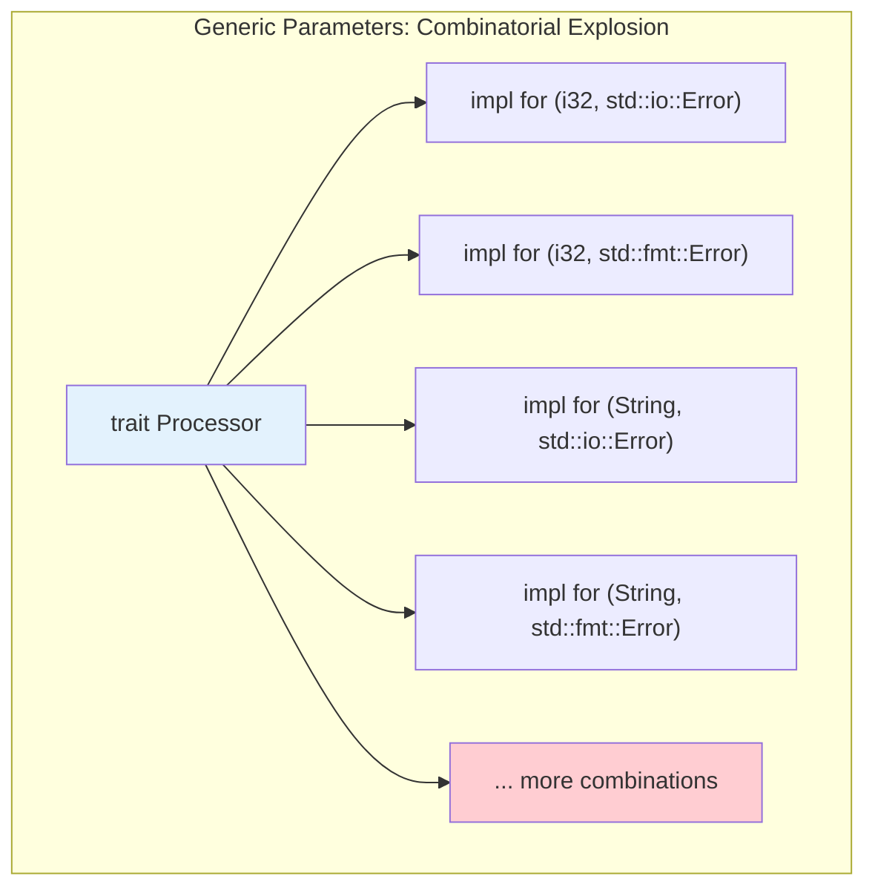

# Chapter 5: Associated Types vs. Generic Parameters 🟡

> **What you'll learn:**
> - The difference between associated types and generic type parameters
> - When to use each approach
> - Why associated types prevent the "combinatorial explosion" problem
> - How the `Iterator` trait uses associated types

---

## The Fundamental Choice

When defining a trait that has a "type" component, you have two options:

```rust
// Option 1: Associated Type
trait Iterator {
    type Item;  // One concrete type per implementation
    
    fn next(&mut self) -> Option<Self::Item>;
}

// Option 2: Generic Parameters
trait Iterator<T> {  // Type parameter for each method
    fn next(&mut self) -> Option<T>;
}
```

Both achieve similar goals, but they have different trade-offs.

---

## Associated Types: One Type Per Implementation

With associated types, **each implementation chooses one type**:

```rust
struct Counter {
    current: i32,
}

impl Iterator for Counter {
    type Item = i32;  // Fixed for this implementation
    
    fn next(&mut self) -> Option<Self::Item> {
        if self.current < 10 {
            let value = self.current;
            self.current += 1;
            Some(value)
        } else {
            None
        }
    }
}

struct Strings {
    items: Vec<String>,
    index: usize,
}

impl Iterator for Strings {
    type Item = String;  // Different type for this implementation
    
    fn next(&mut self) -> Option<Self::Item> {
        if self.index < self.items.len() {
            let item = self.items[self.index].clone();
            self.index += 1;
            Some(item)
        } else {
            None
        }
    }
}
```

---

## Generic Parameters: Multiple Types Possible

With generic parameters, the **caller can choose the type** at each use site:

```rust
trait Container<T> {
    fn get(&self, index: usize) -> Option<&T>;
    fn add(&mut self, item: T);
}

struct VecWrapper {
    items: Vec<i32>,
}

impl Container<i32> for VecWrapper {
    fn get(&self, index: usize) -> Option<&i32> {
        self.items.get(index)
    }
    
    fn add(&mut self, item: i32) {
        self.items.push(item);
    }
}

// You could also implement Container<String> for the same type!
```

---

## The Combinatorial Explosion Problem

This is the key insight for when to use which.



### With Generic Parameters

```rust
// Suppose we have a generic Reader trait
trait Reader<T, E> {
    fn read(&mut self) -> Result<T, E>;
}

// Now a function that needs to work with different error types:
fn process<T, E, R: Reader<T, E>>(reader: &mut R) { ... }

// Each combination of (T, E) is effectively a different type
```

### With Associated Types

```rust
// Same concept but with associated types
trait Reader {
    type Output;
    type Error;
    
    fn read(&mut self) -> Result<Self::Output, Self::Error>;
}

// Each implementation picks ONE Output and ONE Error type
// The trait itself stays as one type - no combinatorial explosion!
```

---

## Comparison Table

| Aspect | Associated Types | Generic Parameters |
|--------|-----------------|-------------------|
| **Flexibility** | One type per impl | Multiple types per use site |
| **Trait object safety** | ✅ Yes | ❌ No (usually) |
| **Multiple implementations** | One impl per type | Many impls per type |
| **Combinatorial explosion** | Avoids it | Can cause it |
| **Use case** | "What type IS this" | "What type do YOU want" |
| **Example** | `Iterator::Item` | `From<T>` (any T) |

---

## Practical Example: The Standard Library

The standard library uses both approaches:

### Iterator Uses Associated Types

```rust
// From std::iter::Iterator
pub trait Iterator {
    type Item;  // Each iterator produces ONE type of item
    
    fn next(&mut self) -> Option<Self::Item>;
    // ... other methods
}

// This works with trait objects!
fn process(iter: &mut dyn Iterator<Item = i32>) { }
```

### From Uses Generic Parameters

```rust
// From std::convert::From
pub trait From<T> {
    fn from(value: T) -> Self;
}

// Multiple implementations for one type
impl From<u64> for MyType { ... }
impl From<String> for MyType { ... }
impl From<Vec<u8>> for MyType { ... }
```

### Example from Async Rust

In the async ecosystem, this distinction matters a lot:

```rust
// AsyncRead uses associated types (stable in Rust 1.81+)
trait AsyncRead {
    type ReadFuture<'a>: Future<Output = Result<usize, Self::Error>>
    where Self: 'a;
    type Error;
    
    fn poll_read(
        self: Pin<&mut Self>,
        buf: &mut ReadBuf<'_>,
    ) -> Poll<Result<usize, Self::Error>>;
}
```

---

## When to Use Associated Types

Use associated types when:
1. **Each implementation has a single "canonical" type** — The iterator's item type is intrinsic to the iterator
2. **You need trait objects** — Associated types work with `dyn Trait`
3. **You want to avoid combinatorial explosion** — One impl = one set of types
4. **The type is tied to the implementation** — Not a parameter the caller chooses

```rust
// Perfect for associated types
trait Graph {
    type Node;
    type Edge;
    
    fn nodes(&self) -> impl Iterator<Item = &Self::Node>;
    fn edges(&self) -> impl Iterator<Item = &Self::Edge>;
}
```

---

## When to Use Generic Parameters

Use generic parameters when:
1. **The caller should choose the type** — Like `From<T>` where T can be anything
2. **You need multiple implementations** — Same type implementing trait multiple times with different parameters
3. **The type is a method parameter** — Not intrinsic to the trait itself

```rust
// Perfect for generic parameters
trait Serializer<T> {
    fn serialize(&self, value: &T) -> Vec<u8>;
}

// Can have multiple implementations for one type
impl Serializer<User> for JsonSerializer { ... }
impl Serializer<User> for XmlSerializer { ... }
impl Serializer<Product> for JsonSerializer { ... }
```

---

## Supertraits with Both

You can combine both approaches:

```rust
trait Read {
    type Error;
    fn read(&mut self, buf: &mut [u8]) -> Result<usize, Self::Error>;
}

trait AsyncRead: Read {  // Inherits the associated type
    type ReadFuture<'a>: Future<Output = Result<usize, Self::Error>>
    where Self: 'a;
    
    fn poll_read(
        self: Pin<&mut Self>,
        buf: &mut ReadBuf<'_>,
    ) -> Poll<Result<usize, Self::Error>>;
}
```

---

## Exercise: Design a Cache Trait

<details>
<summary><strong>🏋️ Exercise: Cache Trait Design</strong> (click to expand)</summary>

Design a `Cache` trait with the following requirements:

1. **Associated type for keys and values:**
   - Keys must be hashable
   - Values can be any type

2. **Methods:**
   - `get(&self, key: &K) -> Option<&V>`
   - `insert(&mut self, key: K, value: V)`
   - `remove(&mut self, key: &K) -> Option<V>`

3. **Use an enum for errors** that can represent different failure modes

**Challenge:** Add a generic method `get_or_insert_with` that takes a closure to compute the value if the key is missing. This requires the value type to implement `Default`.

</details>

<details>
<summary>🔑 Solution</summary>

```rust
use std::hash::Hash;
use std::collections::HashMap;

// Error type
#[derive(Debug, Clone)]
enum CacheError {
    KeyNotFound,
    Full,
    Other(String),
}

// Associated types - perfect use case!
trait Cache {
    type Key: Eq + Hash + Clone;
    type Value;
    
    fn get(&self, key: &Self::Key) -> Option<&Self::Value>;
    fn insert(&mut self, key: Self::Key, value: Self::Value) -> Result<(), CacheError>;
    fn remove(&mut self, key: &Self::Key) -> Option<Self::Value>;
    
    // Default implementation
    fn contains(&self, key: &Self::Key) -> bool {
        self.get(key).is_some()
    }
}

// Simple in-memory implementation
struct InMemoryCache<K, V> {
    data: HashMap<K, V>,
}

impl<K, V> InMemoryCache<K, V> {
    fn new() -> Self {
        InMemoryCache {
            data: HashMap::new(),
        }
    }
}

impl<K, V> Cache for InMemoryCache<K, V>
where
    K: Eq + Hash + Clone,
    V: Clone,
{
    type Key = K;
    type Value = V;
    
    fn get(&self, key: &Self::Key) -> Option<&Self::Value> {
        self.data.get(key)
    }
    
    fn insert(&mut self, key: Self::Key, value: Self::Value) -> Result<(), CacheError> {
        self.data.insert(key, value);
        Ok(())
    }
    
    fn remove(&mut self, key: &Self::Key) -> Option<Self::Value> {
        self.data.remove(key)
    }
}

// Challenge: Generic method with Default bound
impl<K, V> Cache for InMemoryCache<K, V>
where
    K: Eq + Hash + Clone,
    V: Clone + Default,
{
    fn get_or_insert_with<F>(&mut self, key: Self::Key, f: F) -> &Self::Value
    where
        F: FnOnce() -> Self::Value,
    {
        // This uses the Clone bound on V to get the reference
        // Note: This is tricky because we need to return &V but HashMap
        // returns &mut V. In practice you'd use RefCell or different API.
        // Simplified for demonstration:
        self.data.entry(key.clone()).or_insert_with(f).borrow()
    }
}

fn main() {
    let mut cache: InMemoryCache<String, i32> = InMemoryCache::new();
    
    cache.insert("answer".to_string(), 42).unwrap();
    println!("Got: {:?}", cache.get(&"answer".to_string()));
    
    cache.remove(&"answer".to_string());
    println!("After remove: {:?}", cache.get(&"answer".to_string()));
}
```

**Key points:**
1. Associated types for the key/value types
2. The trait defines the contract, the impl chooses the types
3. Generic method with trait bounds (`Clone`, `Default`)
4. Works with trait objects!

</details>

---

## Key Takeaways

1. **Associated types** = one type per implementation (use when the type is intrinsic)
2. **Generic parameters** = caller chooses type at use site (use when flexibility is needed)
3. **Associated types avoid combinatorial explosion** — One trait, one set of types
4. **Generic parameters allow multiple implementations** — Same type, multiple trait impls
5. **Iterator uses associated types** — Each iterator produces ONE type of item

> **See also:**
> - [Chapter 4: Defining and Implementing Traits](./ch04-defining-and-implementing-traits.md) — Foundation of traits
> - [Chapter 7: Trait Objects and Dynamic Dispatch](./ch07-trait-objects-and-dynamic-dispatch.md) — Why associated types work with `dyn`
> - [Async Rust: The Future Trait](../async-book/ch02-the-future-trait.md) — Associated types in async context