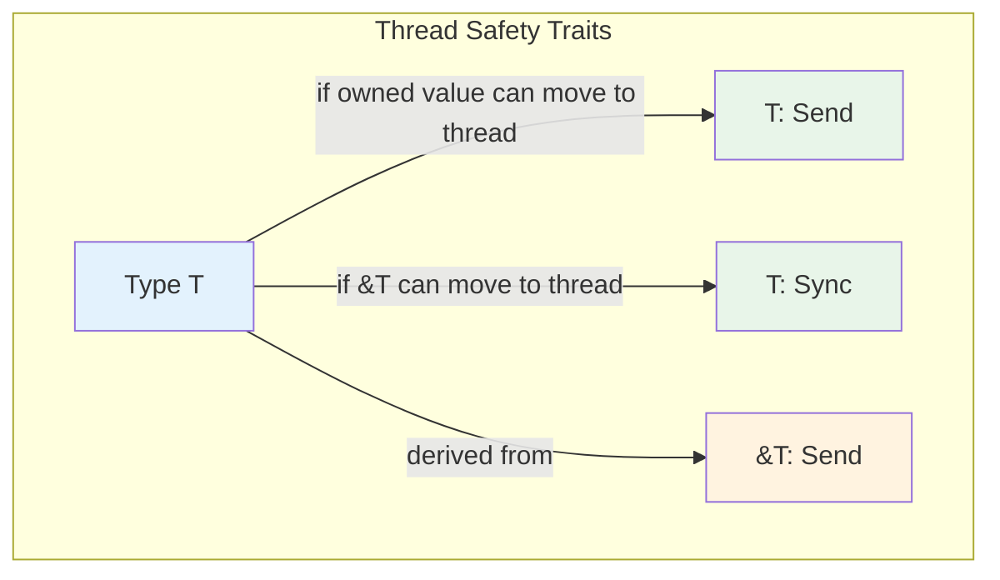
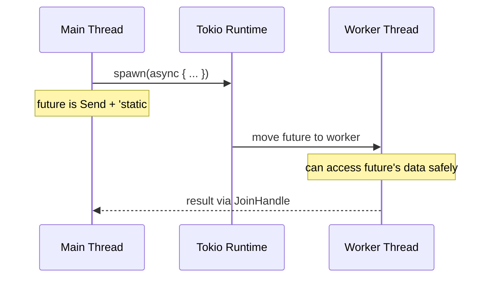

# Chapter 6: Marker Traits and Auto Traits 🔴

> **What you'll learn:**
> - How marker traits like `Send`, `Sync`, `Sized`, and `Unpin` work
> - How the compiler auto-implements these traits
> - Why `tokio::spawn` requires `Send + 'static`
> - How auto traits enable safe concurrency

---

## What Are Marker Traits?

Marker traits have **no methods**. They just mark types as having certain properties. The compiler implements them automatically based on the type's structure.

```rust
// These traits have no methods - they're just markers!
trait Send { }      // Can be transferred across thread boundaries
trait Sync { }      // Can be safely shared between threads
trait Sized { }    // Has a known size at compile time
trait Unpin { }    // Can be safely moved after pinning
trait 'static { }  // Doesn't contain any non-'static references
```

---

## The Holy Trinity: Send, Sync, and Sized

### Sized: The Most Fundamental

Almost every type in Rust is `Sized`. This means the compiler knows its size at compile time:

```rust
// These are all Sized
struct Point { x: i32, y: i32 }
enum Option<T> { Some(T), None }
let x: i32 = 42;

// These are NOT Sized - they need a pointer to be stored
trait Foo { }
dyn Foo  // ❌ Can't store this directly - need &dyn Foo or Box<dyn Foo>
```

The `?Sized` bound allows a type to be either sized or unsized:

```rust
fn generic<T: ?Sized>(value: &T) {
    // T can be Sized or not - &T always has a known size
}
```

### Send: Safe to Send Between Threads

A type is `Send` if it's safe to move to another thread:

```rust
// These are Send
let x: i32 = 42;
let s: String = "hello".to_string();

// These are NOT Send (simplified - actual rules are more complex)
let rc = std::rc::Rc::new(42);  // Rc is not Send - refcount is not thread-safe
```

### Sync: Safe to Share Between Threads

A type is `Sync` if it's safe to share references to it between threads:

```rust
// These are Sync (because i32 is Send and Copy)
let x: &i32 = &42;

// A type is Sync if &T is Send
// This means: if you can share a reference to it safely, it's Sync
let s: &String = &"hello".to_string();  // String is Sync
```



---

## How the Compiler Auto-Implements These

The compiler uses simple rules to automatically derive these traits:

### Derivation Rules

| Type | Send | Sync | Sized |
|------|------|------|-------|
| `i32`, `f64`, etc. | ✅ | ✅ | ✅ |
| `struct` with all Send fields | ✅ | ✅ | ✅ |
| `struct` with all Sync fields | (if all Send) | ✅ | ✅ |
| `&T` | ✅ | (if T: Sync) | ✅ |
| `Box<T>` | ✅ | ✅ | (if T: ?Sized) |
| `Rc<T>` | ❌ | ❌ | ✅ |
| `Arc<T>` | ✅ | ✅ | ✅ |
| `Mutex<T>` | ✅ | ✅ | ✅ |
| `Cell<T>` | (if T: Copy) | ❌ | ✅ |
| `RefCell<T>` | ❌ | ❌ | ✅ |

```rust
// The compiler automatically implements these - you never write:
// impl<T> Send for MyStruct { }

use std::rc::Rc;
use std::sync::Arc;
use std::marker::Sync;
use std::cell::RefCell;

// These compile fine - auto-implemented
#[derive(Debug)]
struct MyStruct {
    x: i32,
}

// Send because i32 is Send
struct Container<T>(T);

// These require manual implementation (or won't compile as Send/Sync)
// Rc is not thread-safe - can't be Send or Sync
struct NotThreadSafe(Rc<i32>);

// RefCell is not thread-safe
struct NotThreadSafe2(RefCell<i32>);
```

---

## The Connection to Async Rust

This is where everything clicks for async programming.

### Why tokio::spawn Requires Send

```rust
// The signature (simplified)
pub fn spawn<F>(future: F) -> JoinHandle<F::Output>
where
    F: Future + Send + 'static,
    //            │    │        │
    //            │    │        └── No borrowed data
    //            │    └── Can move between threads
    //            └── Returns a Future
```

**Why?** When a future is spawned, it might be moved to a different thread by the executor. The future's captured data must be safe to move:

```rust
// ❌ FAILS: this future captures a RefCell which is NOT Send
async fn bad() {
    let counter = std::cell::RefCell::new(0);
    // RefCell::borrow returns a Ref, which is !Send
    let _ = *counter.borrow();
}

// ✅ WORKS: this future captures an i32 which IS Send
async fn good() {
    let counter = 0;
    // Moving i32 between threads is safe
}

// ✅ WORKS: this future captures an Arc<Mutex<i32>>
// Both Arc and Mutex are Send + Sync
async fn also_good() {
    let counter = Arc::new(Mutex::new(0));
    *counter.lock().unwrap() += 1;
}
```

### The 'static Lifetime Requirement

`'static` means the future doesn't contain any non-static references:

```rust
// ❌ FAILS: captures a reference with limited lifetime
async fn bad(user: &User) -> String {
    user.name  // &User is not 'static!
}

// ✅ WORKS: owns all its data
async fn good(user: User) -> String {
    user.name  // User is owned, so 'static
}
```



---

## Unpin: The Pinning Story

`Unpin` is for the **pinning** system, which is essential for async.

### What is Pinning?

When you pin a value, you prevent it from being moved in memory. This is needed for self-referential structs (like async state machines):

```rust
use std::pin::Pin;
use std::task::{Context, Poll};

// Futures are pinned when polled - they can't move
impl<T> Future for Pin<&mut T> {
    fn poll(self: Pin<&mut Self>, cx: &mut Context<'_>) -> Poll<Self::Output> {
        // Can't move self.get_mut() - it's pinned!
    }
}

// Types that can safely be unpinned implement Unpin
// Most types are Unpin - you can Pin/Unpin them freely

struct AsyncState {
    buffer: Vec<u8>,
    state: AsyncStateMachine,
}

// Some types are !Unpin - they must stay pinned
// Specifically: futures generated by async/await
```

### Unpin is Auto-Implemented

```rust
// By default, all types are Unpin - you can pin them and then unpin them

// You can opt OUT of Unpin for self-referential types
struct PinnedData {
    ptr: *const u8,  // Points to self!
}

// This struct is !Unpin - you can't accidentally unpin it
```

---

## The Drop Trait: Not Just a Marker

`Drop` is the only "normal" marker trait - it has a method:

```rust
trait Drop {
    fn drop(&mut self);
}
```

The compiler calls this when a value goes out of scope:

```rust
struct MyStruct {
    data: Vec<u8>,
}

impl Drop for MyStruct {
    fn drop(&mut self) {
        println!("Cleaning up!");
    }
}

fn main() {
    let _ = MyStruct { data: vec![1, 2, 3] };
    // Prints "Cleaning up!" when dropped
}
```

---

## Auto Traits: The Full List

Rust has these auto traits:

| Trait | Meaning | Auto-Implemented |
|-------|---------|------------------|
| `Send` | Safe to send to another thread | ✅ |
| `Sync` | Safe to share across threads | ✅ |
| `Sized` | Known compile-time size | ✅ |
| `Unpin` | Can be unpinned | ✅ (by default) |
| `'static` | No borrowed data | ✅ (by default) |

You can **opt out** of these with `!`:

```rust
// This type is NOT Send
struct NotSend {
    data: std::rc::Rc<u8>,  // Rc is !Send
}
```

---

## Exercise: Thread-Safe Data Structures

<details>
<summary><strong>🏋️ Exercise: Thread-Safe Counter</strong> (click to expand)</summary>

Create a `ThreadSafeCounter` that:
1. Uses `Arc<Mutex<i32>>` internally
2. Is both `Send` and `Sync`
3. Has `increment`, `decrement`, and `get` methods

Then verify:
- Is it `Send`? (Compile-time check)
- Is it `Sync`?
- Can you spawn a future that uses it?

**Challenge:** Add a `try_decrement` method that returns a `Result` if the counter is already zero.

</details>

<details>
<summary>🔑 Solution</summary>

```rust
use std::sync::{Arc, Mutex};
use std::thread;
use tokio;

// The thread-safe counter - uses Arc<Mutex<i32>>
#[derive(Clone)]
struct ThreadSafeCounter {
    inner: Arc<Mutex<i32>>,
}

impl ThreadSafeCounter {
    fn new() -> Self {
        ThreadSafeCounter {
            inner: Arc::new(Mutex::new(0)),
        }
    }
    
    fn increment(&self) {
        let mut counter = self.inner.lock().unwrap();
        *counter += 1;
    }
    
    fn decrement(&self) {
        let mut counter = self.inner.lock().unwrap();
        *counter -= 1;
    }
    
    fn get(&self) -> i32 {
        *self.inner.lock().unwrap()
    }
    
    // Challenge: try_decrement that returns Result
    fn try_decrement(&self) -> Result<(), &'static str> {
        let mut counter = self.inner.lock().unwrap();
        if *counter > 0 {
            *counter -= 1;
            Ok(())
        } else {
            Err("Counter is already zero")
        }
    }
}

// Verify Send and Sync at compile time
fn assert_send<T: Send>() {}
fn assert_sync<T: Sync>() {}

fn main() {
    // Compile-time verification that our type is Send + Sync
    assert_send::<ThreadSafeCounter>();
    assert_sync::<ThreadSafeCounter>();
    
    println!("✅ ThreadSafeCounter is Send + Sync");
    
    // Test in threads
    let counter = Arc::new(ThreadSafeCounter::new());
    
    let mut handles = vec![];
    for _ in 0..10 {
        let counter = counter.clone();
        let handle = thread::spawn(move || {
            for _ in 0..1000 {
                counter.increment();
            }
        });
        handles.push(handle);
    }
    
    for handle in handles {
        handle.join().unwrap();
    }
    
    println!("Counter value: {}", counter.get());  // Should be 10000
    
    // Test try_decrement
    let small = ThreadSafeCounter::new();
    small.increment();
    println!("Before try_decrement: {}", small.get());
    small.try_decrement().unwrap();
    println!("After try_decrement: {}", small.get());
    
    // Try to decrement at zero - should fail
    let result = small.try_decrement();
    println!("Try decrement at zero: {:?}", result);  // Err
    
    // Async test (requires tokio)
    println!("Testing in async context...");
}
```

**Key points:**
1. `Arc` allows sharing across threads, `Mutex` provides synchronization
2. The `Clone` derive enables easy sharing
3. `Send + Sync` are auto-implemented because `Arc<Mutex<T>>` is both
4. The compile-time assertions verify the traits

</details>

---

## Key Takeaways

1. **Marker traits have no methods** — They just mark properties
2. **Send + Sync are auto-implemented** — Based on field types
3. **tokio::spawn requires `Send + 'static`** — Future must be safe to move and have no borrowed references
4. **Unpin is for pinning** — Needed for async/await and self-referential structs
5. **Auto traits enable concurrency** — The compiler enforces thread safety at compile time

> **See also:**
> - [Chapter 7: Trait Objects and Dynamic Dispatch](./ch07-trait-objects-and-dynamic-dispatch.md) — Fat pointers and vtables
> - [Async Rust: Pin and Unpin](../async-book/ch04-pin-and-unpin.md) — Deep dive into pinning
> - [Rust Memory Management: Interior Mutability](../memory-management-book/ch08-interior-mutability.md) — Cell, RefCell, and why they're !Sync