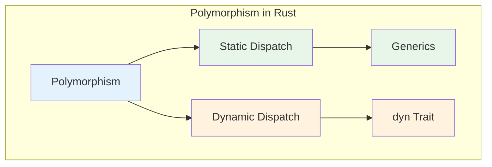
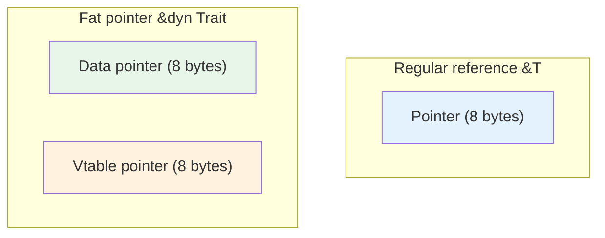
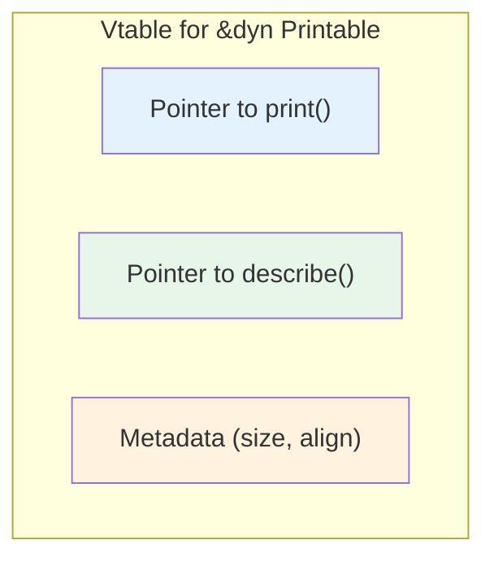
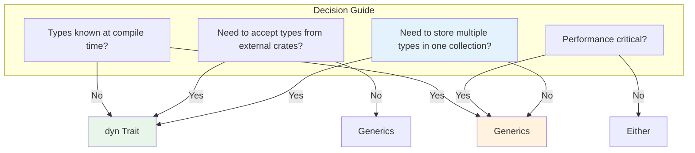

# Chapter 7: Trait Objects and Dynamic Dispatch 🟡

> **What you'll learn:**
> - How `dyn Trait` enables runtime polymorphism
> - Fat pointers and virtual method tables (vtables)
> - When to use static dispatch (generics) vs. dynamic dispatch (trait objects)
> - Object safety rules - why not all traits can be `dyn`

---

## The Two Paths of Polymorphism

Rust gives you two ways to achieve polymorphism:



---

## Static vs. Dynamic Dispatch

### Static Dispatch (Monomorphization)

```rust
// What you write
fn print_all<T: Printable>(items: &[T]) {
    for item in items {
        item.print();
    }
}

// What the compiler generates (conceptually)
fn print_all_i32(items: &[i32]) { ... }
fn print_all_string(items: &[String]) { ... }
fn print_all_user(items: &[User]) { ... }
```

**Pros:**
- Zero runtime overhead - fully inlined
- Compiler can optimize
- More code bloat

**Cons:**
- Binary size grows with each type
- Must know types at compile time

### Dynamic Dispatch (Trait Objects)

```rust
// What you write
fn print_all(items: &[&dyn Printable]) {
    for item in items {
        item.print();
    }
}

// What happens at runtime:
// Each &dyn Printable is a fat pointer:
// [pointer to data, pointer to vtable]
```

**Pros:**
- Single function handles all types
- Smaller binary size
- Works with types known only at runtime

**Cons:**
- Virtual call overhead
- Limited inlining
- Not all traits can use this

---

## Fat Pointers: The Key to Dynamic Dispatch

A `&dyn Trait` is a **fat pointer** - it's twice the size of a regular pointer:



```rust
// Regular pointer - 8 bytes on 64-bit
let x: &i32 = &42;
println!("Size: {}", std::mem::size_of::<&i32>());  // 8

// Fat pointer - 16 bytes
let trait_obj: &dyn std::fmt::Debug = &42;
println!("Size: {}", std::mem::size_of::<&dyn std::fmt::Debug>());  // 16
```

### What's in the Vtable?



The vtable contains:
- Function pointers for each method
- Metadata (size, alignment)

---

## Creating Trait Objects

### From References

```rust
trait Printable {
    fn print(&self);
}

struct Point { x: i32, y: i32 }
impl Printable for Point { fn print(&self) { ... } }

let point = Point { x: 1, y: 2 };

// Create trait object from reference
let print_ref: &dyn Printable = &point;
let print_box: Box<dyn Printable> = Box::new(point);
```

### From Box

```rust
let print_box: Box<dyn Printable> = Box::new(Point { x: 1, y: 2 });
```

### With Object Safety

Not all traits can be used as `dyn Trait`. The trait must be **object safe**:

```rust
// ❌ NOT object-safe: generic method
trait Bad {
    fn method<T>(&self, item: T);
}

// ❌ NOT object-safe: returns Self
trait AlsoBad {
    fn new() -> Self;
}

// ✅ Object-safe: only reference-based methods
trait Good {
    fn method(&self);
}
```

---

## Object Safety Rules

A trait is object-safe (can be used as `dyn Trait`) if:

1. **No generic methods** - Can't have `fn method<T>(&self)`
2. **No returns of Self** - Can't return `-> Self` (but `-> &Self` is OK)
3. **Has a receiver** - Methods must take `&self`, `&mut self`, or `self`
4. **No static methods** - Can't have `fn static_method()`

```rust
// ❌ FAILS: generic method - not object safe
trait Iterator {
    fn next<T>(&mut self) -> Option<T>;  // ERROR!
}

// ✅ Object safe
trait Printable {
    fn print(&self);
    fn describe(&self) -> String;
}

// ❌ FAILS: returns Self
trait Factory {
    fn create() -> Self;  // ERROR!
}

// ✅ Works - returns reference instead
trait Factory {
    fn create_ref(&self) -> &dyn Clone;  // OK
}
```

---

## When to Use Which?



| Scenario | Use |
|----------|-----|
| Heterogeneous collection (buttons, inputs, etc.) | `dyn Trait` |
| Performance-critical hot path | Generics |
| Plugin system / dynamic loading | `dyn Trait` |
| Library API accepting any type | Generics |
| Type-erased caching | `dyn Trait` |

---

## The Syntax Variations

```rust
trait Printable { fn print(&self); }

// In function parameters
fn print(item: &dyn Printable) { }
fn print(item: Box<dyn Printable>) { }
fn print(item: Rc<dyn Printable>) { }

// As type annotations
let x: Box<dyn Printable> = Box::new(Point { x: 1, y: 2 });
let x: &dyn Printable = &point;

// With auto-deref (Rust 1.76+)
fn print(item: impl Printable) { }  // Sugar for generics
```

---

## Exercise: Building a Plugin System

<details>
<summary><strong>🏋️ Exercise: Plugin System</strong> (click to expand)</summary>

Build a plugin system with:

1. A `Plugin` trait with:
   - `name(&self) -> String`
   - `run(&self)`

2. A `PluginRegistry` that:
   - Stores plugins as `Box<dyn Plugin>`
   - Has `register(impl Plugin)` and `run_all()` methods

3. Create at least 3 different plugins

**Challenge:** Add a `DynPlugin` extension that allows plugins to specify dependencies on other plugins, using `&dyn Plugin` in method signatures.

</details>

<details>
<summary>🔑 Solution</summary>

```rust
use std::collections::HashMap;

// The plugin trait - object safe!
trait Plugin {
    fn name(&self) -> String;
    fn run(&self);
}

// A simple plugin
struct HelloPlugin;

impl Plugin for HelloPlugin {
    fn name(&self) -> String {
        "Hello".to_string()
    }
    
    fn run(&self) {
        println!("👋 Hello from plugin!");
    }
}

// Another plugin
struct CounterPlugin {
    count: usize,
}

impl CounterPlugin {
    fn new() -> Self {
        CounterPlugin { count: 0 }
    }
}

impl Plugin for CounterPlugin {
    fn name(&self) -> String {
        "Counter".to_string()
    }
    
    fn run(&mut self) {
        self.count += 1;
        println!("🔢 Counter: {}", self.count);
    }
}

// Need mutability for this one - use &mut self in trait
// But Box<dyn Plugin> doesn't allow mutation...
// Instead, we'll use interior mutability or re-run each time

struct MathPlugin;

impl Plugin for MathPlugin {
    fn name(&self) -> String {
        "Math".to_string()
    }
    
    fn run(&self) {
        println!("🧮 2 + 2 = {}", 2 + 2);
    }
}

// Plugin registry
struct PluginRegistry {
    plugins: Vec<Box<dyn Plugin>>,
}

impl PluginRegistry {
    fn new() -> Self {
        PluginRegistry { plugins: Vec::new() }
    }
    
    fn register(&mut self, plugin: impl Plugin + 'static) {
        // Box<dyn Plugin> is object-safe!
        self.plugins.push(Box::new(plugin));
    }
    
    fn run_all(&mut self) {
        // Need &mut dyn for &mut self methods
        for plugin in &mut self.plugins {
            plugin.run();
        }
    }
}

fn main() {
    let mut registry = PluginRegistry::new();
    
    // Register plugins
    registry.register(HelloPlugin);
    registry.register(CounterPlugin::new());  // Note: consumed
    registry.register(MathPlugin);
    
    // Run all - dynamic dispatch!
    println!("=== Running plugins ===");
    registry.run_all();
    
    // Run again - they all run
    println!("\n=== Running again ===");
    registry.run_all();
}
```

**Key points:**
1. Trait is object-safe (only `&self` methods)
2. `Box<dyn Plugin>` enables dynamic dispatch
3. Registry stores heterogeneous types
4. `register<T: Plugin + 'static>` accepts any implementing type

</details>

---

## Key Takeaways

1. **`dyn Trait` enables runtime polymorphism** — Single function handles multiple types
2. **Fat pointers have two parts** — Data pointer + vtable pointer
3. **Vtables contain method pointers** — Runtime resolution
4. **Object safety rules** — No generic methods, no `-> Self` returns
5. **Trade-off: performance vs. flexibility** — Static dispatch faster, dynamic dispatch more flexible

> **See also:**
> - [Chapter 8: Closures and the Fn Traits](./ch08-closures-and-the-fn-traits.md) — How closures use trait objects
> - [Chapter 5: Associated Types vs. Generic Parameters](./ch05-associated-types-vs-generic-parameters.md) — Why associated types work with dyn
> - [Async Rust: AsyncRead and AsyncWrite](../async-book/ch08-tokio-deep-dive.md) - Using dyn in async contexts