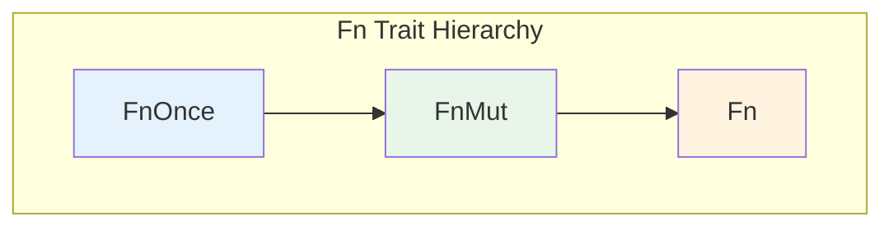
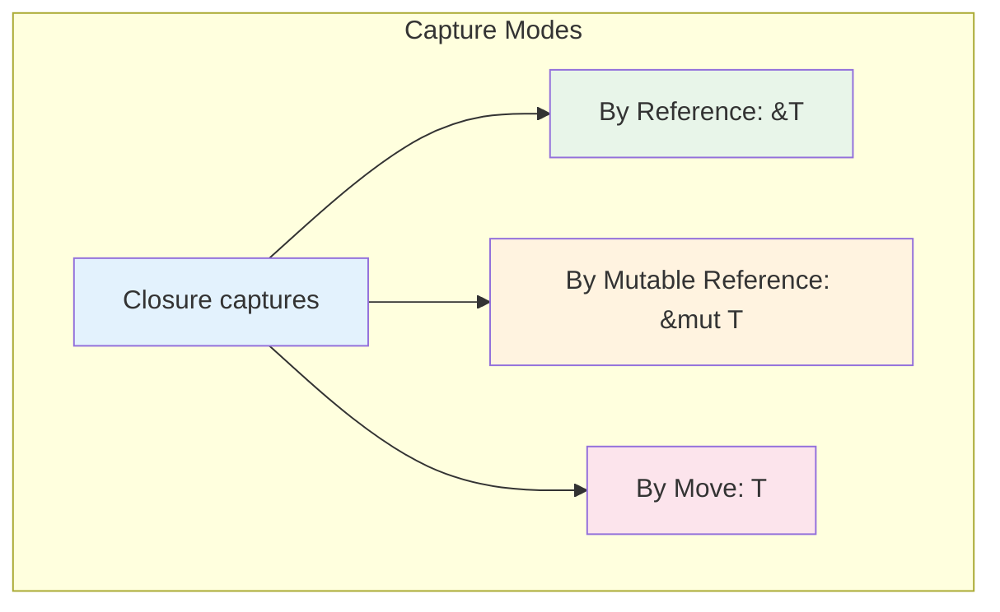

# Chapter 8: Closures and the `Fn` Traits 🔴

> **What you'll learn:**
> - How closures are compiler-generated anonymous structs
> - The three `Fn` traits: `Fn`, `FnMut`, and `FnOnce`
> - Capturing environment and move semantics
> - How async closures work in Rust

---

## What Are Closures?

In Rust, closures are **anonymous functions** that can capture variables from their environment. But under the hood, they're something more interesting: the compiler generates a unique anonymous struct for each closure, implementing one of the `Fn` traits.

```rust
// What you write
let add = |a, b| a + b;

// What the compiler generates (conceptually)
struct ClosureAdd {
    // Empty - no captured variables
}

impl Fn<(i32, i32)> for ClosureAdd {
    fn call(&self, (a, b): (i32, i32)) -> i32 {
        a + b
    }
}

let add = ClosureAdd;
```

---

## The Three Closure Traits



- **`FnOnce`** — Can be called once (consumes self)
- **`FnMut`** — Can be called mutably (can mutate captured values)
- **`Fn`** — Can be called immutably (borrows captured values)

```rust
// The actual trait definitions (simplified)
trait FnOnce<Args> {
    fn call_once(self, args: Args) -> Self::Output;
}

trait FnMut<Args>: FnOnce<Args> {
    fn call_mut(&mut self, args: Args) -> Self::Output;
}

trait Fn<Args>: FnMut<Args> {
    fn call(&self, args: Args) -> Self::Output;
}
```

---

## Understanding the Hierarchy

A `Fn` closure can also be used as `FnMut` and `FnOnce`.
An `FnMut` closure can also be used as `FnOnce`.
But not the other way around!

```rust
// Fn - can be called any number of times, immutably
let a = || println!("Hello");
fn use_fn<F: Fn()>(f: F) { f(); }

// FnMut - can mutate captured state
let mut b = 0;
let mut increment = || { b += 1; };
fn use_fn_mut<F: FnMut()>(f: mut F) { f(); }

// FnOnce - consumes itself
let c = || { println!("Only once!") };
fn use_fn_once<F: FnOnce()>(f: F) { f(); }
```

---

## Capturing Environment

Closures capture variables from their environment:

```rust
fn main() {
    let x = 5;
    let y = 10;
    
    // Captures x by reference
    let print_x = || println!("x = {}", x);
    
    // Captures y by mutable reference
    let mut counter = 0;
    let increment = || {
        counter += 1;
        println!("Counter: {}", counter);
    };
    
    // Captures by move (takes ownership)
    let data = vec![1, 2, 3];
    let consume = move || {
        println!("Consumed: {:?}", data);
        // data is moved into the closure
    };
    
    print_x();
    increment();
    increment();
    consume();
    
    // ❌ FAILS: data was moved!
    // println!("{:?}", data);
}
```



---

## The `move` Keyword

Use `move` to force ownership transfer:

```rust
// Without move: closure borrows
let data = vec![1, 2, 3];
let print = || println!("{:?}", data);
print();
// data still usable here!

// With move: closure takes ownership
let data = vec![1, 2, 3];
let print = move || println!("{:?}", data);
// data moved into closure!
```

### Common Pattern: Spawning Threads

```rust
use std::thread;

let data = vec![1, 2, 3];

// Thread needs owned data - use move
let handle = thread::spawn(move || {
    // data is now in this thread
    for item in &data {
        println!("{}", item);
    }
});

handle.join().unwrap();
```

---

## Closures in Function Parameters

You can accept closures as parameters:

```rust
// Fn - immutable borrow
fn apply<F>(f: F) where F: Fn() {
    f();
}

// FnMut - mutable borrow
fn apply_mut<F>(mut f: F) where F: FnMut() {
    f();
}

// FnOnce - takes ownership
fn apply_once<F>(f: F) where F: FnOnce() {
    f();
}

// impl Trait syntax (Rust 1.26+)
fn apply_impl(f: impl Fn()) {
    f();
}
```

### Accepting Multiple Types

You can use closures generically without specifying the concrete type:

```rust
// Accept any closure that takes i32 and returns i32
fn double_all<F>(values: &mut Vec<i32>, op: F)
where
    F: Fn(i32) -> i32,
{
    for v in values.iter_mut() {
        *v = op(*v);
    }
}
```

---

## Closures vs. Function Pointers

A function pointer (`fn`) is different from a closure (`Fn`):

```rust
// Function pointer - a regular function
fn add(a: i32, b: i32) -> i32 { a + b }
let fn_ptr: fn(i32, i32) -> i32 = add;

// Closure - captures environment
let closure = |a, b| a + b;

// fn can be CoerceSized to Fn
fn call_fn(f: fn(i32, i32) -> i32, a: i32, b: i32) -> i32 {
    f(a, b)
}

// But not all Fn are fn!
fn call_closure<F: Fn(i32, i32) -> i32>(f: F, a: i32, b: i32) -> i32 {
    f(a, b)
}

fn main() {
    // Both work
    println!("{}", call_fn(add, 1, 2));
    println!("{}", call_closure(closure, 1, 2));
}
```

---

## Async Closures (Rust 1.79+)

Rust 1.79 stabilized async closures:

```rust
async fn process_data() {
    let data = vec![1, 2, 3];
    
    // Async closure - returns a Future
    let async_closure = async move || {
        // This is async!
        for item in &data {
            tokio::time::sleep(std::time::Duration::from_millis(100)).await;
            println!("Processed: {}", item);
        }
    };
    
    // Call the async closure to get a Future
    async_closure().await;
}
```

### The `AsyncFn` Traits

```rust
// Similar hierarchy to Fn, but returns futures
trait AsyncFnOnce<Args> {
    type CallRefFuture<'a>: Future<Output = Self::Output>
    where
        Self: 'a;
    async fn call_once(self, args: Args) -> Self::Output;
}

trait AsyncFnMut<Args>: AsyncFnOnce<Args> {
    async fn call_mut(&mut self, args: Args) -> Self::Output;
}

trait AsyncFn<Args>: AsyncFnMut<Args> {
    async fn call(&self, args: Args) -> Self::Output;
}
```

---

## Exercise: Callback System

<details>
<summary><strong>🏋️ Exercise: Event Handler with Closures</strong> (click to expand)</summary>

Build an event handler system:

1. An `EventHandler` that accepts closures as callbacks
2. Different methods for `Fn`, `FnMut`, and `FnOnce`
3. A `HandlerBuilder` that uses the builder pattern with closures

**Challenge:** Create an async event handler that accepts `impl AsyncFn()` closures.

</details>

<details>
<summary>🔑 Solution</summary>

```rust
use std::collections::HashMap;

// Event type
#[derive(Debug, Clone, Copy)]
enum Event {
    Click,
    KeyPress,
}

// Handler that accepts different closure types
struct EventHandler {
    // Fn handlers - stored as Box<dyn Fn(Event)>
    fn_handlers: Vec<Box<dyn Fn(Event)>>,
    // FnMut handlers - wrapped in Option for interior mutability
    fn_mut_handlers: Vec<Box<dyn FnMut(Event)>>,
    // FnOnce handlers - must be called immediately, not stored
}

// For FnOnce, we can't really store them - they consume themselves
// Instead, we provide a method that accepts FnOnce

impl EventHandler {
    fn new() -> Self {
        EventHandler {
            fn_handlers: Vec::new(),
            fn_mut_handlers: Vec::new(),
        }
    }
    
    // Add a Fn closure - can be called multiple times, immutably
    fn on<F: Fn(Event) + 'static>(&mut self, handler: F) {
        self.fn_handlers.push(Box::new(handler));
    }
    
    // Add a FnMut closure - can mutate internal state
    fn on_mut<F: FnMut(Event) + 'static>(&mut self, handler: F) {
        self.fn_mut_handlers.push(Box::new(handler));
    }
    
    // Add a FnOnce closure - can only be called once
    // We'll call it immediately and store the result
    fn on_once<F: FnOnce(Event) + 'static>(&mut self, handler: F) {
        // Store the result of calling once
        // In practice you'd want to return this
        handler(Event::Click);  // Just call it
    }
    
    fn trigger(&mut self, event: Event) {
        // Call all Fn handlers
        for handler in &self.fn_handlers {
            handler(event);
        }
        
        // Call all FnMut handlers
        for handler in &mut self.fn_mut_handlers {
            handler(event);
        }
    }
}

// Builder pattern with closures
struct HandlerBuilder {
    event_type: Option<Event>,
    handler: Option<Box<dyn Fn(Event)>>,
}

impl HandlerBuilder {
    fn new() -> Self {
        HandlerBuilder {
            event_type: None,
            handler: None,
        }
    }
    
    fn for_event(mut self, event: Event) -> Self {
        self.event_type = Some(event);
        self
    }
    
    fn with_handler<F: Fn(Event) + 'static>(mut self, handler: F) -> Self {
        self.handler = Some(Box::new(handler));
        self
    }
    
    fn build(self) -> Box<dyn Fn(Event)> {
        self.handler.unwrap_or_else(|| Box::new(|_| {}))
    }
}

fn main() {
    let mut handler = EventHandler::new();
    
    // Fn closure - captures nothing
    handler.on(|event| {
        println!("📝 Fn handler: {:?}", event);
    });
    
    // FnMut closure - mutable capture
    let mut count = 0;
    handler.on_mut(move |event| {
        count += 1;
        println!("🔄 FnMut handler #{}: {:?}", count, event);
    });
    
    // FnOnce - consumes captured value
    let message = "One-time message".to_string();
    handler.on_once(move |_| {
        println!("🔥 FnOnce: {}", message);
    });
    
    // Trigger events
    println!("\n=== Triggering Click ===");
    handler.trigger(Event::Click);
    
    println!("\n=== Triggering KeyPress ===");
    handler.trigger(Event::KeyPress);
    
    // Builder pattern
    println!("\n=== Using Builder ===");
    let handler = HandlerBuilder::new()
        .for_event(Event::Click)
        .with_handler(|e| println!("Built: {:?}", e))
        .build();
    
    handler(Event::Click);
}
```

**Key points:**
1. `Box<dyn Fn(Event)>` - stored as trait object
2. Different traits for different capture modes
3. Builder pattern with closures
4. Interior mutability for `FnMut` storage

</details>

---

## Key Takeaways

1. **Closures are compiler-generated structs** — Each closure gets a unique type
2. **Three trait hierarchy** — `FnOnce` → `FnMut` → `Fn`
3. **Capture modes** — By reference, mutable reference, or move
4. **`move` transfers ownership** — Essential for threading
5. **Async closures** — Return futures, enabled in Rust 1.79+

> **See also:**
> - [Chapter 7: Trait Objects and Dynamic Dispatch](./ch07-trait-objects-and-dynamic-dispatch.md) — Trait objects in closures
> - [Async Rust: Async Traits](../async-book/ch10-async-traits.md) — How async traits work
> - [C++ to Rust: Closures](../c-cpp-book/ch12-closures.md) — Comparing to C++ lambdas