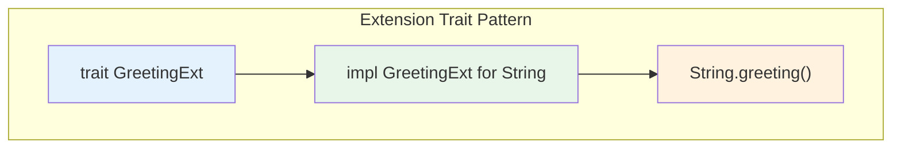

# Chapter 9: The Extension Trait Pattern 🔴

> **What you'll learn:**
> - How to add methods to external types
> - The extension trait pattern for extending std types
> - How `StreamExt` and `AsyncReadExt` work under the hood
> - The connection to async Rust

---

## The Problem: Extending External Types

You can't do this in Rust:

```rust
// ❌ FAILS: Can't add methods to external types
impl String {
    fn greeting(&self) -> String {
        format!("Hello, {}!", self)
    }
}
```

This is due to the **Orphan Rule** (Chapter 4). But there's a solution: **extension traits**.

---

## The Extension Trait Pattern

```rust
// 1. Define a trait with the methods you want
trait GreetingExt {
    fn greeting(&self) -> String;
}

// 2. Implement the trait for the external type
impl GreetingExt for String {
    fn greeting(&self) -> String {
        format!("Hello, {}!", self)
    }
}

// 3. Use the trait to access the methods
fn main() {
    let name = "World".to_string();
    println!("{}", name.greeting());  // Hello, World!
}
```

---

## How It Works



The extension trait pattern works because:
1. You own the trait (your crate defines it)
2. You implement it for the external type
3. This satisfies the Orphan Rule!

---

## Real-World Examples from std

The standard library uses this pattern extensively:

### Iterator Extensions

```rust
// In std::iter::Iterator
trait Iterator {
    type Item;
    fn next(&mut self) -> Option<Self::Item>;
}

// In std::iter::IteratorExt (extension trait!)
trait IteratorExt: Iterator {
    fn chain<U>(self, other: U) -> Chain<Self, U::IntoIter>
    where U: IntoIterator<Item = Self::Item>;
    // ... many more methods
}

// Implementation
impl<I: Iterator> IteratorExt for I { ... }
```

### Option Extensions

```rust
// In std::option::OptionExt
trait OptionExt<T> {
    fn expect_none(self, msg: &str) -> T;
    fn unwrap_none(self);
}
```

---

## Async Rust: StreamExt and AsyncReadExt

This pattern is **critical** in the async ecosystem:

```rust
// tokio::stream::StreamExt - adds methods to Stream
trait StreamExt: Stream {
    fn next(&mut self) -> Next<'_, Self> { ... }
    fn for_each<F>(self, f: F) -> ForEach<Self, F, Self::Item> { ... }
    fn map<U, F>(self, f: F) -> Map<Self, F> { ... }
    // 50+ methods!
}

// Any async stream can use these methods
use tokio::stream::StreamExt;

async fn process_stream<S>(mut stream: S)
where
    S: StreamExt<Item = Result<String, std::io::Error>> + Unpin,
{
    // Use extension methods!
    while let Some(item) = stream.next().await {
        println!("Got: {:?}", item);
    }
}
```

### AsyncReadExt and AsyncWriteExt

```rust
// tokio::io::AsyncReadExt
trait AsyncReadExt: AsyncRead {
    fn read_to_string(&mut self, buf: &mut String) -> ReadToString<'_, Self> { ... }
    fn read_exact(&mut self, buf: &mut [u8]) -> ReadExact<'_, Self> { ... }
}

// tokio::io::AsyncWriteExt
trait AsyncWriteExt: AsyncWrite {
    fn write_all(&mut self, buf: &[u8]) -> WriteAll<'_, Self> { ... }
    fn flush(&mut self) -> Flush<'_, Self> { ... }
}
```

This is how async I/O gets ergonomic methods!

---

## Building Your Own Extension Trait

```rust
use std::collections::{HashMap, HashSet};

// Extension trait for HashMap
trait MapExt<K, V> {
    fn get_or_insert(&mut self, key: K, default: V) -> &V;
    fn get_or_insert_with<F>(&mut self, key: K, f: F) -> &V
    where
        F: FnOnce() -> V;
}

impl<K, V> MapExt<K, V> for HashMap<K, V>
where
    K: Eq + std::hash::Hash,
{
    fn get_or_insert(&mut self, key: K, default: V) -> &V {
        self.entry(key).or_insert(default)
    }
    
    fn get_or_insert_with<F>(&mut self, key: K, f: F) -> &V
    where
        F: FnOnce() -> V,
    {
        self.entry(key).or_insert_with(f)
    }
}

// Extension trait for HashSet
trait SetExt<T> {
    fn toggle(&mut self, value: T) -> bool;
    fn contains(&self, value: &T) -> bool;
}

impl<T> SetExt<T> for HashSet<T>
where
    T: Eq + std::hash::Hash + Copy,
{
    fn toggle(&mut self, value: T) -> bool {
        if self.contains(&value) {
            self.remove(&value);
            false
        } else {
            self.insert(value);
            true
        }
    }
    
    fn contains(&self, value: &T) -> bool {
        HashSet::contains(self, value)
    }
}

fn main() {
    let mut map = HashMap::new();
    // Use extension method
    let entry = map.get_or_insert("key".to_string(), "default".to_string());
    println!("Got: {}", entry);
    
    let mut set = HashSet::new();
    set.insert(42);
    let removed = set.toggle(42);
    println!("Toggled 42, was present: {}", removed);
}
```

---

## Async Extension Traits in Practice

Here's how the pattern works with async:

```rust
use tokio::io::AsyncReadExt;

// This function doesn't need to know about the underlying type
async fn read_to_string_ext<R: AsyncReadExt + Unpin>(reader: &mut R) -> std::io::Result<String> {
    let mut buf = String::new();
    reader.read_to_string(&mut buf).await?;
    Ok(buf)
}

// Works with File, TcpStream, Cursor, etc.
```

---

## Exercise: Building Extension Traits

<details>
<summary><strong>🏋️ Exercise: Vec Extensions</strong> (click to expand)</summary>

Create extension traits for `Vec<T>`:

1. **`VecExt<T>`** with methods:
   - `push_if(condition: bool, value: T)` - conditionally push
   - `drain_filter<F>(predicate: F)` - drain elements matching predicate
   - `first_or_insert(value: T) -> &T` - get first or insert

2. **`VecSortExt<T>`** (separate trait for sorting):
   - `sorted(&self) -> Vec<T>` where T: Ord
   - `sorted_by_key<K, F>(&self, f: F) -> Vec<T>` where F: Fn(&T) -> K

3. Use these in an async context

**Challenge:** Add a `VecAsyncExt` trait with an async `drain_all` method that processes elements asynchronously.

</details>

<details>
<summary>🔑 Solution</summary>

```rust
use std::collections::VecDeque;

// ============================================
// Basic Vec extensions
// ============================================

trait VecExt<T> {
    fn push_if(&mut self, condition: bool, value: T);
    fn first_or_insert(&mut self, value: T) -> &T;
}

impl<T> VecExt<T> for Vec<T> {
    fn push_if(&mut self, condition: bool, value: T) {
        if condition {
            self.push(value);
        }
    }
    
    fn first_or_insert(&mut self, value: T) -> &T {
        if let Some(first) = self.first() {
            first
        } else {
            self.push(value);
            &self[0]
        }
    }
}

// ============================================
// Sorting extensions (separate trait)
// ============================================

trait VecSortExt<T> {
    fn sorted(&self) -> Vec<T>
    where
        T: Ord;
    fn sorted_by_key<K, F>(&self, f: F) -> Vec<T>
    where
        F: Fn(&T) -> K,
        K: Ord;
}

impl<T> VecSortExt<T> for Vec<T> {
    fn sorted(&self) -> Vec<T>
    where
        T: Ord,
    {
        let mut sorted = self.clone();
        sorted.sort();
        sorted
    }
    
    fn sorted_by_key<K, F>(&self, f: F) -> Vec<T>
    where
        F: Fn(&T) -> K,
        K: Ord,
    {
        let mut sorted = self.clone();
        sorted.sort_by_key(f);
        sorted
    }
}

// ============================================
// Async extensions
// ============================================

use tokio::sync::mpsc;

trait VecAsyncExt<T> {
    async fn drain_async<R>(self, channel: mpsc::Sender<T>) -> ()
    where
        T: Send + 'static,
        Self: Iterator<Item = T> + Send + 'static;
}

impl<T> VecAsyncExt<T> for Vec<T>
where
    T: Send + 'static,
{
    async fn drain_async<R>(self, mut channel: mpsc::Sender<T>) {
        for item in self {
            channel.send(item).await.unwrap();
        }
    }
}

fn main() {
    // Test basic extensions
    let mut vec = vec![3, 1, 4, 1, 5, 9, 2, 6];
    vec.push_if(true, 42);
    vec.push_if(false, 99);  // Not added
    println!("After push_if: {:?}", vec);
    
    // Test sorting
    let unsorted = vec![3, 1, 4, 1, 5, 9, 2, 6];
    println!("Sorted: {:?}", unsorted.sorted());
    
    let words = vec!["banana", "apple", "cherry"];
    println!("Sorted by length: {:?}", words.sorted_by_key(|s| s.len()));
    
    // Test first_or_insert
    let mut empty: Vec<i32> = vec![];
    let first = empty.first_or_insert(42);
    println!("First: {}", first);
    let first2 = empty.first_or_insert(99);
    println!("First (exists): {}", first2);
    
    println!("\n✅ All extension traits work!");
}
```

**Key points:**
1. Separate traits for different concerns
2. Works with any type implementing the bounds
3. Async extensions use channels for async processing

</details>

---

## Key Takeaways

1. **Extension traits bypass the Orphan Rule** — You own the trait, implement it for external type
2. **Used extensively in std and async crates** — `IteratorExt`, `StreamExt`, `AsyncReadExt`
3. **Organize by feature** — Different traits for different method groups
4. **Enables ergonomic APIs** — Chain methods on any type that implements the trait

> **See also:**
> - [Chapter 4: Defining and Implementing Traits](./ch04-defining-and-implementing-traits.md) — The Orphan Rule
> - [Async Rust: Stream Extensions](../async-book/ch11-streams-and-asynciterator.md) — StreamExt deep dive
> - [Rust Patterns: Traits In Depth](../rust-patterns-book/ch02-traits-in-depth.md) — Advanced trait patterns