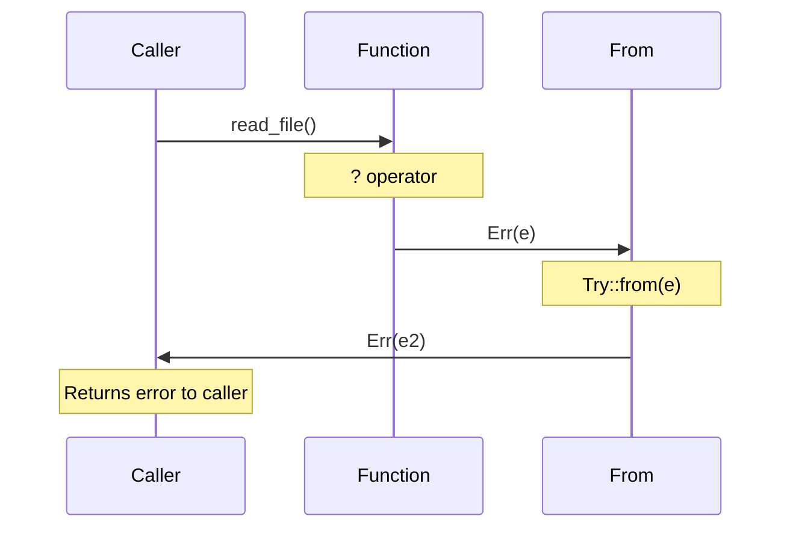

# Chapter 10: Error Handling and Conversions 🟡

> **What you'll learn:**
> - How `From` and `Into` work for type conversions
> - How the `?` operator utilizes `From` for error propagation
> - The `thiserror` vs `anyhow` design philosophy
> - Building robust error handling in production codebases

---

## The Error Handling Ecosystem

Rust's error handling is built on two key mechanisms:
1. **`Result<T, E>`** — The explicit error type we saw in Chapter 1
2. **The `?` operator** — Syntactic sugar for error propagation

```rust
use std::fs::File;
use std::io::{self, Read};

fn read_file(path: &str) -> Result<String, io::Error> {
    let mut file = File::open(path)?;
    let mut contents = String::new();
    file.read_to_string(&mut contents)?;
    Ok(contents)
}
```

The `?` operator is doing more than you might think—it's using the `From` trait!

---

## The `From` and `Into` Traits

### The From Trait

```rust
// In std::convert::From
pub trait From<T> {
    fn from(value: T) -> Self;
}

// When you implement From, you get Into for free!
pub trait Into<T> {
    fn into(self) -> T;
}

impl<T, U> Into<U> for T
where
    U: From<T>,
{
    fn into(self) -> U {
        U::from(self)
    }
}
```

### Implementing From

```rust
// Custom error type
#[derive(Debug)]
enum MyError {
    Io(std::io::Error),
    Parse(std::num::ParseIntError),
    Custom(String),
}

// Convert from std::io::Error
impl From<std::io::Error> for MyError {
    fn from(err: std::io::Error) -> Self {
        MyError::Io(err)
    }
}

// Convert from ParseIntError
impl From<std::num::ParseIntError> for MyError {
    fn from(err: std::num::ParseIntError) -> Self {
        MyError::Parse(err)
    }
}

// Now the ? operator works with any of these!
fn parse_and_read(path: &str) -> Result<i32, MyError> {
    let contents = std::fs::read_to_string(path)?;  // Io -> MyError
    let num = contents.parse::<i32>()?;             // Parse -> MyError
    Ok(num)
}
```

---

## How the ? Operator Works



The `?` operator is syntactic sugar for:

```rust
// What you write:
let file = File::open("foo.txt")?;

// What the compiler generates (roughly):
let file = match File::open("foo.txt") {
    Ok(f) => f,
    Err(e) => return Err(From::from(e)),
};
```

The key insight: `From::from(e)` is called to convert the error!

---

## thiserror vs anyhow

Two major error handling approaches in the ecosystem:

### thiserror: Structural Errors

```rust
use thiserror::Error;

#[derive(Error, Debug)]
pub enum MyError {
    #[error("IO error: {0}")]
    Io(#[from] std::io::Error),
    
    #[error("Parse error: {0}")]
    Parse(#[from] std::num::ParseIntError),
    
    #[error("Custom: {name}")]
    Custom { name: String },
}

// Automatically implements From for the source types!
```

**Best for:** Library code where you need specific error types

### anyhow: Contextual Errors

```rust
use anyhow::{Context, Result};

fn read_config() -> Result<Config> {
    let contents = std::fs::read_to_string("config.json")
        .context("Failed to read config file")?;
    
    let config: Config = serde_json::from_str(&contents)
        .context("Failed to parse config")?;
    
    Ok(config)
}
```

**Best for:** Application code where you just want errors to work

---

## Conversion Patterns in Production

### The Standard Pattern

```rust
use std::convert::From;

// Define your error type
#[derive(Debug)]
enum AppError {
    Io(std::io::Error),
    Parse(serde_json::Error),
    Validation(String),
    Other(String),
}

// Implement From for each error source
impl From<std::io::Error> for AppError {
    fn from(e: std::io::Error) -> Self {
        AppError::Io(e)
    }
}

impl From<serde_json::Error> for AppError {
    fn from(e: serde_json::Error) -> Self {
        AppError::Parse(e)
    }
}

// Now any function returning Result<T, io::Error> can use ?
fn process() -> Result<Output, AppError> {
    let data = std::fs::read_to_string("input.txt")?;
    let parsed = serde_json::from_str::<Data>(&data)?;
    Ok(process_data(parsed))
}
```

### The Into Pattern

```rust
// Sometimes you want to convert TO a different error
fn generic() -> Result<String, AppError> {
    // Using .into() explicitly
    let result: Result<u32, std::io::Error> = Ok(42);
    Ok(result.map(|n| n.to_string())?)
}
```

---

## TryFrom and TryInto

For fallible conversions that might fail:

```rust
use std::convert::TryFrom;
use std::convert::TryInto;

#[derive(Debug, Clone, Copy)]
struct Positive(i32);

impl TryFrom<i32> for Positive {
    type Error = &'static str;
    
    fn try_from(value: i32) -> Result<Self, Self::Error> {
        if value > 0 {
            Ok(Positive(value))
        } else {
            Err("Value must be positive")
        }
    }
}

fn main() {
    let p = Positive::try_from(42).unwrap();
    let p2: Result<Positive, _> = (-5).try_into();
    // Err("Value must be positive")
}
```

---

## Exercise: Building an Error Stack

<details>
<summary><strong>🏋️ Exercise: Config Parser</strong> (click to expand)</summary>

Build a config parser with:

1. **Custom error type** using `thiserror` with:
   - File not found variants
   - Parse errors
   - Validation errors

2. **From implementations** for:
   - `std::io::Error`
   - `serde_json::Error`
   - A custom validation error type

3. **Context chains** using `anyhow` for a "read-validate-process" pipeline

**Challenge:** Add a `TryFrom` implementation that validates configuration values at the type level.

</details>

<details>
<summary>🔑 Solution</summary>

```rust
use thiserror::Error;
use anyhow::{Context, Result};
use serde::Deserialize;

// ============================================
// Custom error types
// ============================================

#[derive(Debug, Error)]
pub enum ConfigError {
    #[error("IO error: {0}")]
    Io(#[from] std::io::Error),
    
    #[error("JSON parse error: {0}")]
    Parse(#[from] serde_json::Error),
    
    #[error("Validation error: {0}")]
    Validation(String),
    
    #[error("Missing required field: {0}")]
    MissingField(String),
}

// Custom validation error for the challenge
#[derive(Debug)]
pub struct ValidationError {
    field: String,
    message: String,
}

impl std::fmt::Display for ValidationError {
    fn fmt(&self, f: &mut std::fmt::Formatter) -> std::fmt::Result {
        write!(f, "{}: {}", self.field, self.message)
    }
}

impl From<ValidationError> for ConfigError {
    fn from(e: ValidationError) -> Self {
        ConfigError::Validation(e.message)
    }
}

// ============================================
// Config structure
// ============================================

#[derive(Debug, Deserialize)]
struct Config {
    port: u16,
    host: String,
    max_connections: Option<u32>,
}

// ============================================
// Type-level validation (Challenge)
// ============================================

#[derive(Debug, Clone, Copy)]
struct ValidPort(u16);

impl TryFrom<u16> for ValidPort {
    type Error = ValidationError;
    
    fn try_from(value: u16) -> Result<Self, Self::Error> {
        if value == 0 {
            Err(ValidationError {
                field: "port".to_string(),
                message: "Port cannot be zero".to_string(),
            })
        } else if value < 1024 {
            Err(ValidationError {
                field: "port".to_string(),
                message: "Port should be >= 1024".to_string(),
            })
        } else {
            Ok(ValidPort(value))
        }
    }
}

// ============================================
// Functions using the error system
// ============================================

fn read_config(path: &str) -> Result<Config, ConfigError> {
    let contents = std::fs::read_to_string(path)
        .context(format!("Failed to read {}", path))?;
    
    let config: Config = serde_json::from_str(&contents)?;
    
    // Validate
    if config.host.is_empty() {
        return Err(ConfigError::Validation("Host cannot be empty".to_string()));
    }
    
    // Try the type-level validation
    let _valid_port = ValidPort::try_from(config.port)?;
    
    Ok(config)
}

fn process_with_anyhow(path: &str) -> Result<String, anyhow::Error> {
    let config = read_config(path)
        .context("Failed to load config")?;
    
    Ok(format!(
        "Server running on {}:{} with {} max connections",
        config.host,
        config.port,
        config.max_connections.unwrap_or(10)
    ))
}

fn main() {
    // Test with a valid config
    let config_str = r#"{"port": 8080, "host": "localhost", "max_connections": 100}"#;
    std::fs::write("/tmp/test_config.json", config_str).unwrap();
    
    match read_config("/tmp/test_config.json") {
        Ok(config) => println!("✅ Config loaded: {:?}", config),
        Err(e) => println!("❌ Error: {}", e),
    }
    
    // Test validation
    let invalid_config = r#"{"port": 0, "host": "localhost"}"#;
    std::fs::write("/tmp/invalid.json", invalid_config).unwrap();
    
    match read_config("/tmp/invalid.json") {
        Ok(config) => println!("✅ Config loaded: {:?}", config),
        Err(e) => println!("❌ Error: {}", e),  // Should fail validation
    }
    
    // Test with anyhow
    match process_with_anyhow("/tmp/test_config.json") {
        Ok(msg) => println!("✅ {}", msg),
        Err(e) => println!("❌ Error: {}", e),
    }
}
```

**Key points:**
1. `thiserror` for structured errors
2. `From` implementations enable `?` chaining
3. `Context` from `anyhow` adds context to errors
4. `TryFrom` for type-level validation

</details>

---

## Key Takeaways

1. **`From` enables error conversion** — Implement `From<OtherError>` to use `?`
2. **`?` is syntactic sugar** — Calls `From::from` on the error
3. **thiserror for libraries** — Structured, specific error types
4. **anyhow for applications** — Flexible, contextual errors
5. **TryFrom for fallible conversions** — Type-level validation

> **See also:**
> - [Chapter 1: Enums and Pattern Matching](./ch01-enums-and-pattern-matching.md) — Result<T, E>
> - [Chapter 4: Defining and Implementing Traits](./ch04-defining-and-implementing-traits.md) — Trait implementation
> - [C++ to Rust: Error Handling Best Practices](../c-cpp-book/ch09-1-error-handling-best-practices.md) — Comparing to exceptions