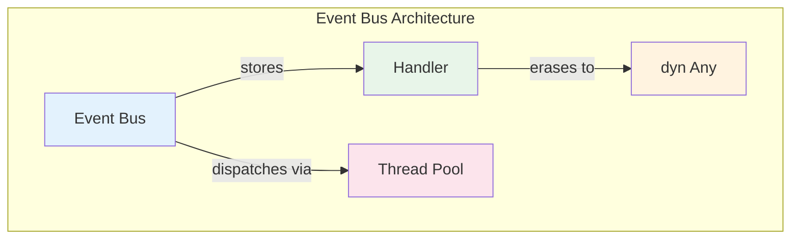

# Chapter 11: Capstone Project - Type-Safe Event Bus 🔴

> **What you'll learn:**
> - Building a production-grade event dispatcher
> - Using `dyn Any` for type erasure and downcasting
> - Implementing `Send + Sync` bounds for multi-threaded dispatch
> - Applying the Extension Trait pattern for ergonomic APIs
> - Combining all concepts from previous chapters

---

## Project Overview

In this capstone, we'll build a **type-safe event bus** that:
- Accepts handlers for diverse event types (generics!)
- Uses `dyn Any` for type erasure
- Supports multi-threaded dispatch (`Send + Sync`)
- Provides an ergonomic extension trait API



---

## Step 1: Define Events and Handlers

```rust
use std::any::Any;
use std::sync::{Arc, Mutex};

// Base event trait - all events must be 'static + Send
pub trait Event: Any + Send + 'static {
    fn as_any(&self) -> &dyn Any;
}

// Blanket implementation for any 'static + Send type
impl<T: Any + Send + 'static> Event for T {
    fn as_any(&self) -> &dyn Any {
        self
    }
}

// Handler trait - processes events
pub trait EventHandler<E: Event>: Send {
    fn handle(&self, event: E);
}

// Basic handler implementation
pub struct Handler<F, E>
where
    F: Fn(E) + Send,
    E: Event,
{
    handler: F,
    _phantom: std::marker::PhantomData<E>,
}

impl<F, E> Handler<F, E>
where
    F: Fn(E) + Send,
    E: Event,
{
    fn new(handler: F) -> Self {
        Handler {
            handler,
            _phantom: std::marker::PhantomData,
        }
    }
}

impl<F, E> EventHandler<E> for Handler<F, E>
where
    F: Fn(E) + Send,
    E: Event,
{
    fn handle(&self, event: E) {
        (self.handler)(event);
    }
}
```

---

## Step 2: The Event Bus Implementation

```rust
use std::collections::HashMap;
use std::sync::RwLock;

// The event bus - stores handlers for different event types
pub struct EventBus {
    handlers: RwLock<HashMap<TypeId, Vec<Box<dyn AnyHandler>>>>,
}

// A type-erased handler that can handle any event type
trait AnyHandler: Send {
    fn handle_any(&self, event: &dyn Any);
}

// Implementation for specific event types
struct AnyHandlerImpl<E, H>
where
    E: Event,
    H: EventHandler<E>,
{
    handler: H,
    _phantom: std::marker::PhantomData<E>,
}

impl<E, H> AnyHandler for AnyHandlerImpl<E, H>
where
    E: Event,
    H: EventHandler<E>,
{
    fn handle_any(&self, event: &dyn Any) {
        // Downcast from Any to the specific event type
        if let Some(e) = event.downcast_ref::<E>() {
            self.handler.handle(e.clone());
        }
    }
}

impl EventBus {
    pub fn new() -> Self {
        EventBus {
            handlers: RwLock::new(HashMap::new()),
        }
    }
    
    // Register a handler for a specific event type
    pub fn register<E, H>(&self, handler: H)
    where
        E: Event,
        H: EventHandler<E> + 'static,
    {
        let type_id = TypeId::of::<E>();
        let boxed = Box::new(AnyHandlerImpl::<E, H> { handler, _phantom: std::marker::PhantomData });
        
        let mut handlers = self.handlers.write().unwrap();
        handlers.entry(type_id).or_insert_with(Vec::new).push(boxed);
    }
    
    // Dispatch an event to all registered handlers
    pub fn dispatch<E>(&self, event: E)
    where
        E: Event + Clone,
    {
        let type_id = TypeId::of::<E>();
        
        let handlers = self.handlers.read().unwrap();
        if let Some(type_handlers) = handlers.get(&type_id) {
            for handler in type_handlers {
                // We need to handle the Clone requirement
                // For now, we clone or require handlers to not need ownership
                handler.handle_any(&event);
            }
        }
    }
}

// Need to import TypeId
use std::any::TypeId;
```

---

## Step 3: Refinement - Better Handler Storage

The clone requirement is tricky. Let's fix it:

```rust
// Refined event bus with better design
pub struct TypedEventBus {
    handlers: RwLock<HashMap<TypeId, Vec<Box<dyn AnyHandlerSend>>>>,
}

// Handler that can be called without consuming the event
trait AnyHandlerSend: Send {
    fn handle_any(&self, event: &dyn Any);
}

struct AnyHandlerImpl<E, H>
where
    E: Event,
    H: EventHandler<E>,
{
    handler: Arc<H>,
}

impl<E, H> AnyHandlerSend for AnyHandlerImpl<E, H>
where
    E: Event,
    H: EventHandler<E>,
{
    fn handle_any(&self, event: &dyn Any) {
        // Clone the event for each handler
        if let Some(e) = event.downcast_ref::<E>() {
            // Need to clone - this requires Event: Clone
            // Alternative: require handlers to take &E, not E
            let cloned = e.clone();
            self.handler.handle(cloned);
        }
    }
}

impl TypedEventBus {
    pub fn new() -> Self {
        TypedEventBus {
            handlers: RwLock::new(HashMap::new()),
        }
    }
    
    pub fn register<E, H>(&self, handler: H)
    where
        E: Event + Clone,  // Require Clone for now
        H: EventHandler<E> + 'static,
    {
        let type_id = TypeId::of::<E>();
        let boxed = Box::new(AnyHandlerImpl { handler: Arc::new(handler) });
        
        let mut handlers = self.handlers.write().unwrap();
        handlers.entry(type_id).or_insert_with(Vec::new).push(boxed);
    }
    
    pub fn dispatch<E>(&self, event: E)
    where
        E: Event + Clone,
    {
        let type_id = TypeId::of::<E>();
        
        let handlers = self.handlers.read().unwrap();
        if let Some(type_handlers) = handlers.get(&type_id) {
            for handler in type_handlers {
                handler.handle_any(&event);
            }
        }
    }
}

// Require Clone in the Event trait
pub trait Event: Any + Send + Clone + 'static {
    fn as_any(&self) -> &dyn Any;
}

// Blanket impl still works
impl<T: Any + Send + Clone + 'static> Event for T {
    fn as_any(&self) -> &dyn Any {
        self
    }
}
```

---

## Step 4: Send + Sync Bounds

For multi-threaded dispatch, we need to ensure the event bus itself is thread-safe:

```rust
use std::sync::atomic::{AtomicBool, Ordering};

// Thread-safe wrapper
pub struct SyncEventBus {
    inner: Arc<RwLock<TypedEventBus>>,
}

unsafe impl Send for SyncEventBus {}
unsafe impl Sync for SyncEventBus {}

impl SyncEventBus {
    pub fn new() -> Self {
        SyncEventBus {
            inner: Arc::new(RwLock::new(TypedEventBus::new())),
        }
    }
    
    pub fn register<E, H>(&self, handler: H)
    where
        E: Event + Clone,
        H: EventHandler<E> + 'static,
    {
        self.inner.read().unwrap().register(handler);
    }
    
    pub fn dispatch<E>(&self, event: E)
    where
        E: Event + Clone,
    {
        self.inner.read().unwrap().dispatch(event);
    }
}
```

---

## Step 5: Extension Trait for Ergonomic API

```rust
// Extension trait for easy access to event bus
pub trait EventBusExt {
    fn dispatch_event<E: Event + Clone>(&self, event: E);
    fn on<E: Event + Clone, H: EventHandler<E> + 'static>(&self, handler: H);
}

impl EventBusExt for SyncEventBus {
    fn dispatch_event<E: Event + Clone>(&self, event: E) {
        self.dispatch(event);
    }
    
    fn on<E: Event + Clone, H: EventHandler<E> + 'static>(&self, handler: H) {
        self.register(handler);
    }
}

// Now we can do:
/*
event_bus.on(|event: MyEvent| { ... });
event_bus.dispatch_event(MyEvent { ... });
*/
```

---

## The Complete Implementation

```rust
use std::any::{Any, TypeId};
use std::sync::{Arc, RwLock};
use std::collections::HashMap;

// ============================================
// Event trait and implementations
// ============================================

/// Base trait for all events - requires Any + Send + Clone + 'static
pub trait Event: Any + Send + Clone + 'static {
    fn as_any(&self) -> &dyn Any;
}

/// Blanket implementation for any 'static + Send + Clone type
impl<T: Any + Send + Clone + 'static> Event for T {
    fn as_any(&self) -> &dyn Any {
        self
    }
}

// ============================================
// Event handler trait
// ============================================

/// Handler for a specific event type
pub trait EventHandler<E: Event>: Send {
    fn handle(&self, event: E);
}

/// Wrapper to erase the event type
trait AnyHandler: Send {
    fn handle_any(&self, event: &dyn Any);
}

struct TypedHandler<E, H>
where
    E: Event,
    H: EventHandler<E>,
{
    handler: Arc<H>,
    _phantom: std::marker::PhantomData<E>,
}

impl<E, H> AnyHandler for TypedHandler<E, H>
where
    E: Event,
    H: EventHandler<E>,
{
    fn handle_any(&self, event: &dyn Any) {
        if let Some(e) = event.downcast_ref::<E>() {
            // Clone for each handler
            self.handler.handle(e.clone());
        }
    }
}

// ============================================
// Event Bus (thread-safe)
// ============================================

#[derive(Clone)]
pub struct EventBus {
    handlers: Arc<RwLock<HashMap<TypeId, Vec<Box<dyn AnyHandler>>>>>,
}

unsafe impl Send for EventBus {}
unsafe impl Sync for EventBus {}

impl EventBus {
    pub fn new() -> Self {
        EventBus {
            handlers: Arc::new(RwLock::new(HashMap::new())),
        }
    }
    
    pub fn register<E, H>(&self, handler: H)
    where
        E: Event + Clone,
        H: EventHandler<E> + 'static,
    {
        let type_id = TypeId::of::<E>();
        let boxed: Box<dyn AnyHandler> = Box::new(TypedHandler {
            handler: Arc::new(handler),
            _phantom: std::marker::PhantomData,
        });
        
        let mut handlers = self.handlers.write().unwrap();
        handlers.entry(type_id).or_insert_with(Vec::new).push(boxed);
    }
    
    pub fn dispatch<E>(&self, event: E)
    where
        E: Event + Clone,
    {
        let type_id = TypeId::of::<E>();
        
        if let Some(type_handlers) = self.handlers.read().unwrap().get(&type_id) {
            for handler in type_handlers {
                handler.handle_any(&event);
            }
        }
    }
}

// ============================================
// Extension trait for ergonomic API
// ============================================

pub trait EventBusExt {
    fn on<E, H>(&self, handler: H)
    where
        E: Event + Clone,
        H: EventHandler<E> + 'static;
        
    fn emit<E>(&self, event: E)
    where
        E: Event + Clone;
}

impl EventBusExt for EventBus {
    fn on<E, H>(&self, handler: H)
    where
        E: Event + Clone,
        H: EventHandler<E> + 'static,
    {
        self.register(handler);
    }
    
    fn emit<E>(&self, event: E)
    where
        E: Event + Clone,
    {
        self.dispatch(event);
    }
}
```

---

## Usage Example

```rust
// Define some events
#[derive(Clone, Debug)]
struct UserCreatedEvent {
    user_id: u64,
    email: String,
}

#[derive(Clone, Debug)]
struct PaymentProcessedEvent {
    amount: f64,
    currency: String,
}

// Define handlers
struct UserEventHandler;

impl EventHandler<UserCreatedEvent> for UserEventHandler {
    fn handle(&self, event: UserCreatedEvent) {
        println!("📧 Sending welcome email to {}", event.email);
    }
}

struct PaymentEventHandler;

impl EventHandler<PaymentProcessedEvent> for PaymentEventHandler {
    fn handle(&self, event: PaymentProcessedEvent) {
        println!("💰 Processed payment of {} {}", event.amount, event.currency);
    }
}

fn main() {
    // Create event bus
    let bus = EventBus::new();
    
    // Register handlers
    bus.register(UserEventHandler);
    bus.register(PaymentEventHandler);
    
    // Dispatch events - type-safe!
    bus.dispatch(UserCreatedEvent {
        user_id: 42,
        email: "alice@example.com".to_string(),
    });
    
    bus.dispatch(PaymentProcessedEvent {
        amount: 99.99,
        currency: "USD".to_string(),
    });
    
    // Or use extension trait
    bus.emit(UserCreatedEvent {
        user_id: 43,
        email: "bob@example.com".to_string(),
    });
}
```

---

## Key Takeaways

1. **`dyn Any` enables type erasure** — Store heterogeneous handlers in one collection
2. **`Send + Sync` are critical for thread safety** — The compiler enforces thread safety
3. **Extension traits provide ergonomics** — `bus.emit(event)` vs `bus.dispatch(event)`
4. **Clone requirements propagate** — If handlers clone events, events must implement Clone

> **See also:**
> - [Chapter 2: Generics and Monomorphization](./ch02-generics-and-monomorphization.md) — Generic handlers
> - [Chapter 6: Marker Traits and Auto Traits](./ch06-marker-traits-and-auto-traits.md) — Send + Sync
> - [Chapter 9: The Extension Trait Pattern](./ch09-the-extension-trait-pattern.md) - Extension traits
> - [Async Rust: Building Futures by Hand](../async-book/ch06-building-futures-by-hand.md) — Type erasure patterns