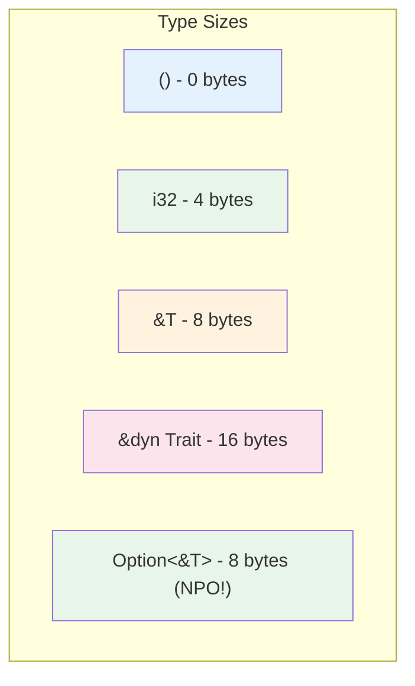

# Summary and Reference Card 🟡

> **What you'll learn:**
> - Quick reference for key type system concepts
> - Decision guides for choosing between patterns
> - Common trait signatures and usage
> - Links to deeper exploration

---

## Decision Guide: When to Use What

### Static vs. Dynamic Dispatch

| Use Static Dispatch (`<T: Trait>`) | Use Dynamic Dispatch (`dyn Trait`) |
|-----------------------------------|-------------------------------------|
| Performance critical hot paths | Heterogeneous collections |
| Types known at compile time | Plugin systems |
| Maximum optimization needed | Type erasure needed |
| Binary size not a concern | Many types, one interface |

### Associated Types vs. Generic Parameters

| Use Associated Types | Use Generic Parameters |
|---------------------|----------------------|
| One canonical type per impl | Caller chooses type |
| Need trait objects | Multiple impls per type |
| Avoid combinatorial explosion | Type is a parameter |

### Closure Traits

| Trait | Use When |
|-------|----------|
| `Fn()` | Reading captured data, no mutation |
| `FnMut()` | Mutating captured data |
| `FnOnce()` | Consuming captured data |

---

## Quick Reference: Common Traits

### Core Standard Traits

```rust
// Clone - deep copy
trait Clone {
    fn clone(&self) -> Self;
}

// Copy - bitwise copy (marker trait)
trait Copy: Clone { }  // No methods, just marker

// Default - create default value
trait Default {
    fn default() -> Self;
}

// Debug - debug formatting
trait Debug {
    fn fmt(&self, f: &mut Formatter) -> Result;
}

// Display - user-facing formatting  
trait Display {
    fn fmt(&self, f: &mut Formatter) -> Result;
}

// PartialEq - equality
trait PartialEq<Rhs = Self> {
    fn eq(&self, other: &Rhs) -> bool;
}

// PartialOrd - ordering
trait PartialOrd<Rhs = Self>: PartialEq {
    fn partial_cmp(&self, other: &Rhs) -> Option<Ordering>;
}
```

### Conversion Traits

```rust
// From - conversion from
trait From<T> {
    fn from(value: T) -> Self;
}

// Into - conversion into
trait Into<T> {
    fn into(self) -> T;
}

// TryFrom - fallible conversion
trait TryFrom<T> {
    type Error;
    fn try_from(value: T) -> Result<Self, Self::Error>;
}

// TryInto - fallible conversion
trait TryInto<T> {
    type Error;
    fn try_into(self) -> Result<T, Self::Error>;
}

// AsRef - borrow as reference
trait AsRef<T> {
    fn as_ref(&self) -> &T;
}
```

### Iterator Traits

```rust
trait Iterator {
    type Item;
    fn next(&mut self) -> Option<Self::Item>;
    // ... many default methods
}

trait IntoIterator {
    type Item;
    type IntoIter: Iterator<Item = Self::Item>;
    fn into_iter(self) -> Self::IntoIter;
}
```

---

## Memory Layout Summary



| Type | Size (64-bit) | Notes |
|------|---------------|-------|
| `()` | 0 | Empty tuple |
| `i32` | 4 | Fixed size |
| `&T` | 8 | Single pointer |
| `&dyn Trait` | 16 | Fat pointer (data + vtable) |
| `Box<dyn Trait>` | 16 | Pointer + metadata |
| `Option<&T>` | 8 | Null pointer optimization! |
| `Option<Box<T>>` | 16 | No NPO (needs discriminant) |

---

## Auto Traits Summary

| Trait | Meaning | Derives From |
|-------|---------|--------------|
| `Send` | Safe to send to another thread | All fields are Send |
| `Sync` | Safe to share across threads | `&T: Send` |
| `Sized` | Known compile-time size | By default |
| `Unpin` | Can be unpinned | By default |
| `'static` | No borrowed data | By default |

---

## Cheat Sheet: Syntax Guide

### Trait Bounds

```rust
// Single bound
fn f<T: Trait>(x: T)

// Multiple bounds
fn f<T: Trait1 + Trait2>(x: T)

// Where clause
fn f<T>(x: T)
where
    T: Trait1 + Trait2,
{
}

// impl Trait syntax
fn f(x: impl Trait) { }

// Return type
fn f() -> impl Trait { }
```

### Trait Objects

```rust
// Reference
let x: &dyn Trait = &value;

// Box
let x: Box<dyn Trait> = Box::new(value);

// In function
fn f(x: &dyn Trait) { }
fn f(x: Box<dyn Trait>) { }
```

### Closures

```rust
// By reference
let closure = || { ... };

// By move
let closure = move || { ... };

// Generic
fn f<F: Fn()>(closure: F) { }
```

---

## Pattern Summary

### Newtype Pattern

```rust
struct UserId(u64);

impl Display for UserId { ... }
impl From<u64> for UserId { ... }
```

### Extension Trait Pattern

```rust
trait MyExt {
    fn method(&self);
}

impl<T> MyExt for T {
    fn method(&self) { ... }
}
```

### Builder Pattern

```rust
struct Builder {
    field: Option<Type>,
}

impl Builder {
    fn field(mut self, value: Type) -> Self {
        self.field = Some(value);
        self
    }
    
    fn build(self) -> Result<FinalType, Error> { ... }
}
```

---

## Common Compiler Errors and Fixes

### Missing Trait Implementation

```rust
// ❌ FAILS: trait not implemented
struct MyType;
impl std::fmt::Display for MyType { }

// ✅ FIX: implement the trait
impl std::fmt::Display for MyType {
    fn fmt(&self, f: &mut std::fmt::Formatter) -> std::fmt::Result {
        write!(f, "MyType")
    }
}
```

### Orphan Rule Violation

```rust
// ❌ FAILS: can't implement external trait for external type
impl SomeTrait for Vec<u8> { }

// ✅ FIX: use newtype pattern
struct MyVec(Vec<u8>);
impl SomeTrait for MyVec { }
```

### Trait Object Safety

```rust
// ❌ FAILS: generic method - not object safe
trait Bad {
    fn method<T>(&self);
}

// ✅ FIX: remove generic parameter
trait Good {
    fn method(&self);
}
```

---

## Further Reading

| Topic | Resource |
|-------|----------|
| Rust Book | [doc.rust-lang.org/book](https://doc.rust-lang.org/book) |
| Async Rust | [async-book](./async-book/SUMMARY.md) |
| Memory Management | [memory-management-book](./memory-management-book/SUMMARY.md) |
| Type-Driven Correctness | [type-driven-correctness-book](./type-driven-correctness-book/SUMMARY.md) |
| Rust Patterns | [rust-patterns-book](./rust-patterns-book/SUMMARY.md) |

---

## Final Notes

The type system is Rust's most powerful feature. It enables:
- **Zero-cost abstractions** through monomorphization
- **Type-driven correctness** making illegal states unrepresentable
- **Safe concurrency** through Send + Sync
- **Flexible polymorphism** through traits

Master these concepts and you'll write Rust that's not just safe, but elegantly correct.

> **See also:**
> - [Chapter 1: Enums and Pattern Matching](./ch01-enums-and-pattern-matching.md)
> - [Chapter 7: Trait Objects and Dynamic Dispatch](./ch07-trait-objects-and-dynamic-dispatch.md)
> - [Introduction](./ch00-introduction.md)