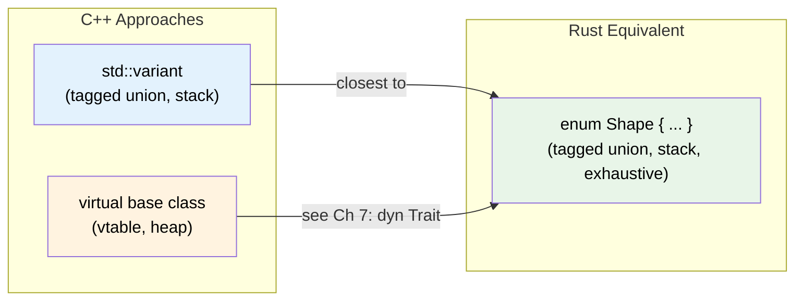
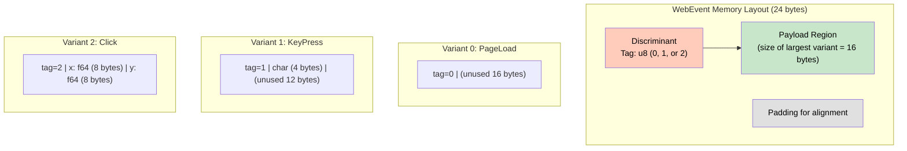
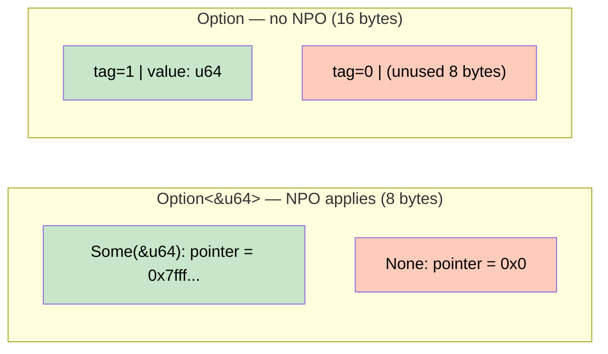

# 1. Enums and Pattern Matching 🟢

> **What you'll learn:**
> - How Rust enums differ from C/C++/C# enums — they carry data, not just integers
> - The memory layout of enums: discriminant + payload, and null-pointer optimization (NPO)
> - `Option<T>` and `Result<T, E>` as the foundational algebraic data types
> - Exhaustive pattern matching and why the compiler forces you to handle every case

---

## Beyond C-Style Enums

If you come from C, C++, Go, or C#, you think of enums as named integers:

```c
// C
enum Color { RED = 0, GREEN = 1, BLUE = 2 };
```

```csharp
// C#
enum Color { Red, Green, Blue }
```

Rust *can* do this — but that's the least interesting thing enums can do.

```rust
// Rust: C-style enum (values are just integers)
enum Color {
    Red,
    Green,
    Blue,
}
```

The real power is that each variant can carry **different data**:

```rust
enum Shape {
    Circle { radius: f64 },
    Rectangle { width: f64, height: f64 },
    Triangle { base: f64, height: f64 },
    Point,  // no data at all
}
```

This is an **algebraic data type** (ADT). Specifically, it's a **tagged union** — a discriminated union that knows which variant it currently holds. The compiler tracks this information at compile time and *forces* you to handle every possibility.

### The C++ Developer's Frame of Reference

In C++, you'd model this with either:
- A `std::variant<Circle, Rectangle, Triangle, Point>` (C++17) — Rust enums are the native equivalent
- An abstract base class with virtual methods — this uses dynamic dispatch and heap allocation; Rust enums are stack-allocated and statically dispatched



## `Option<T>` — The Null Replacement

In Rust, there is no `null`, `nil`, or `nullptr`. Instead, the *possibility* of absence is encoded in the type system:

```rust
enum Option<T> {
    Some(T),
    None,
}
```

This means a function's return type **tells you whether it can fail to return a value**:

```rust
fn find_user(id: u64) -> Option<User> {
    // Returns Some(user) or None — the type makes this explicit
}

// You MUST handle both cases:
match find_user(42) {
    Some(user) => println!("Found: {}", user.name),
    None => println!("No user with that ID"),
}
```

Compare with C# or Java where *any* reference can be null — the "billion-dollar mistake."

## `Result<T, E>` — Errors as Values

```rust
enum Result<T, E> {
    Ok(T),
    Err(E),
}
```

No exceptions. No try/catch. Errors are **values** that flow through the type system:

```rust
use std::fs;
use std::io;

fn read_config(path: &str) -> Result<String, io::Error> {
    fs::read_to_string(path)
}

fn main() {
    match read_config("config.toml") {
        Ok(contents) => println!("Config loaded: {} bytes", contents.len()),
        Err(e) => eprintln!("Failed to read config: {e}"),
    }
}
```

> **Why this matters:** The compiler will reject code that ignores errors. In Go, you can write `result, _ := riskyOperation()` and silently discard the error. In Rust, `Result` forces you to decide what to do.

## Memory Layout of Enums

This is where most tutorials skip ahead to syntax. Let's look at what the compiler *actually generates*.

### Discriminant + Payload

An enum is stored as a **discriminant** (a tag integer telling which variant is active) followed by a **payload** (the data for the largest variant).

```rust
enum WebEvent {
    PageLoad,                       // no payload
    KeyPress(char),                 // 4 bytes
    Click { x: f64, y: f64 },      // 16 bytes
}
```



The total size of `WebEvent` is **the discriminant + the largest payload + alignment padding**. You can verify:

```rust
use std::mem::size_of;

fn main() {
    println!("WebEvent: {} bytes", size_of::<WebEvent>());   // 24
    println!("PageLoad alone would be: 0 bytes of payload");
    println!("KeyPress alone would be: {} bytes", size_of::<char>()); // 4
    println!("Click alone would be: {} bytes", 2 * size_of::<f64>()); // 16
}
```

### Null-Pointer Optimization (NPO)

Here's a compiler trick that makes `Option` genuinely zero-cost. For types that have an invalid bit pattern — like references (`&T`), `Box<T>`, `NonZeroU64` — the compiler uses that invalid value as the `None` discriminant instead of adding a separate tag byte.

```rust
use std::mem::size_of;

fn main() {
    // &T can never be null, so the compiler uses 0x0 to represent None
    assert_eq!(size_of::<&u64>(), size_of::<Option<&u64>>());         // both 8 bytes!
    assert_eq!(size_of::<Box<u64>>(), size_of::<Option<Box<u64>>>()); // both 8 bytes!

    // But for plain integers, there's no "invalid" value — we need a tag byte
    assert_eq!(size_of::<Option<u64>>(), 16); // 8 (u64) + 8 (tag + padding)
}
```



This means `Option<&T>` has the **exact same runtime representation** as a nullable pointer in C — but with compile-time safety guarantees.

> **Connection to Memory Management guide:** For a detailed exploration of how `Box`, `Rc`, and `Arc` interact with NPO and enum layouts, see the companion *Rust Memory Management* guide.

## Exhaustive Pattern Matching

The most important consequence of algebraic data types: the compiler **forces you to handle every case**.

```rust
enum Command {
    Quit,
    Echo(String),
    Move { x: i32, y: i32 },
    ChangeColor(u8, u8, u8),
}

fn handle(cmd: Command) {
    match cmd {
        Command::Quit => println!("Quitting"),
        Command::Echo(msg) => println!("{msg}"),
        Command::Move { x, y } => println!("Moving to ({x}, {y})"),
        // ❌ FAILS: "non-exhaustive patterns: `ChangeColor(_, _, _)` not covered"
    }
}
```

```rust
// ✅ FIX: handle every variant
fn handle(cmd: Command) {
    match cmd {
        Command::Quit => println!("Quitting"),
        Command::Echo(msg) => println!("{msg}"),
        Command::Move { x, y } => println!("Moving to ({x}, {y})"),
        Command::ChangeColor(r, g, b) => println!("Color: ({r}, {g}, {b})"),
    }
}
```

### Why This Matters at Scale

When you add a new variant to an enum, the compiler tells you **every place in your codebase** that needs updating. In C++ with `switch` on an `enum class`, you *might* get a warning (if you're lucky and have `-Wswitch` enabled). In Go, there's no exhaustiveness check at all. Rust makes this a **hard error**.

### Guards, Bindings, and Nested Patterns

```rust
fn classify_age(age: Option<u32>) -> &'static str {
    match age {
        None => "unknown",
        Some(0) => "newborn",
        Some(1..=12) => "child",
        Some(13..=19) => "teenager",
        Some(n) if n >= 65 => "senior",
        Some(_) => "adult",
    }
}
```

### Destructuring Nested Enums

```rust
enum Expr {
    Num(f64),
    Add(Box<Expr>, Box<Expr>),
    Mul(Box<Expr>, Box<Expr>),
}

fn eval(expr: &Expr) -> f64 {
    match expr {
        Expr::Num(n) => *n,
        Expr::Add(a, b) => eval(a) + eval(b),
        Expr::Mul(a, b) => eval(a) * eval(b),
    }
}

fn main() {
    // (2 + 3) * 4
    let expr = Expr::Mul(
        Box::new(Expr::Add(
            Box::new(Expr::Num(2.0)),
            Box::new(Expr::Num(3.0)),
        )),
        Box::new(Expr::Num(4.0)),
    );
    assert_eq!(eval(&expr), 20.0);
}
```

## `if let` and `let else` — Ergonomic Matching

When you only care about one variant:

```rust
// if let — handle one case, ignore the rest
if let Some(user) = find_user(42) {
    println!("Found {}", user.name);
}

// let else — handle the happy path, bail on the rest (Rust 1.65+)
fn process(id: u64) -> Result<(), String> {
    let Some(user) = find_user(id) else {
        return Err(format!("User {id} not found"));
    };
    // `user` is available here — not wrapped in Option
    println!("Processing {}", user.name);
    Ok(())
}
```

---

<details>
<summary><strong>🏋️ Exercise: Build a Calculator AST</strong> (click to expand)</summary>

Design an `Expr` enum that supports:
- Integer literals
- Addition, Subtraction, Multiplication
- Negation (unary minus)

Write an `eval` function that recursively evaluates the expression tree. Then write a `pretty_print` function that produces a string like `"(-(2 + 3) * 4)"`.

**Requirements:**
1. All variants must use `Box<Expr>` for recursive types
2. `eval` must use exhaustive pattern matching
3. `pretty_print` must parenthesize binary operations

<details>
<summary>🔑 Solution</summary>

```rust
/// An expression in our mini-calculator language.
/// Recursive variants use Box to give them a known size.
enum Expr {
    /// A literal integer value
    Lit(i64),
    /// Unary negation: -expr
    Neg(Box<Expr>),
    /// Addition: left + right
    Add(Box<Expr>, Box<Expr>),
    /// Subtraction: left - right
    Sub(Box<Expr>, Box<Expr>),
    /// Multiplication: left * right
    Mul(Box<Expr>, Box<Expr>),
}

/// Recursively evaluate an expression tree to a single i64.
fn eval(expr: &Expr) -> i64 {
    match expr {
        Expr::Lit(n) => *n,
        Expr::Neg(inner) => -eval(inner),
        Expr::Add(l, r) => eval(l) + eval(r),
        Expr::Sub(l, r) => eval(l) - eval(r),
        Expr::Mul(l, r) => eval(l) * eval(r),
    }
}

/// Produce a parenthesized string representation.
fn pretty_print(expr: &Expr) -> String {
    match expr {
        Expr::Lit(n) => n.to_string(),
        Expr::Neg(inner) => format!("(-{})", pretty_print(inner)),
        Expr::Add(l, r) => format!("({} + {})", pretty_print(l), pretty_print(r)),
        Expr::Sub(l, r) => format!("({} - {})", pretty_print(l), pretty_print(r)),
        Expr::Mul(l, r) => format!("({} * {})", pretty_print(l), pretty_print(r)),
    }
}

fn main() {
    // Build: (-(2 + 3)) * 4
    let expr = Expr::Mul(
        Box::new(Expr::Neg(Box::new(Expr::Add(
            Box::new(Expr::Lit(2)),
            Box::new(Expr::Lit(3)),
        )))),
        Box::new(Expr::Lit(4)),
    );

    println!("{} = {}", pretty_print(&expr), eval(&expr));
    // Output: ((-(2 + 3)) * 4) = -20

    assert_eq!(eval(&expr), -20);
    assert_eq!(pretty_print(&expr), "((-(2 + 3)) * 4)");
}
```

</details>
</details>

---

> **Key Takeaways:**
> - Rust enums are **tagged unions** — each variant can carry different data, and the compiler tracks which variant is active.
> - The memory layout is **discriminant + largest payload + padding**. Null-pointer optimization makes `Option<&T>` zero-cost.
> - Exhaustive `match` means adding a new variant produces a compile error everywhere it's not handled — your refactoring tool is the compiler.
> - `Option<T>` replaces null; `Result<T, E>` replaces exceptions. Both are just enums with special standard-library support.

> **See also:**
> - [Ch 7: Trait Objects and Dynamic Dispatch](ch07-trait-objects-and-dynamic-dispatch.md) — the *other* way to model "one of many types" (runtime polymorphism instead of compile-time)
> - [Ch 10: Error Handling and Conversions](ch10-error-handling-and-conversions.md) — production patterns for `Result` and the `?` operator
> - *Rust Memory Management* companion guide — deep-dive into `Box`, `Rc`, `Arc` and how they interact with enum layout
