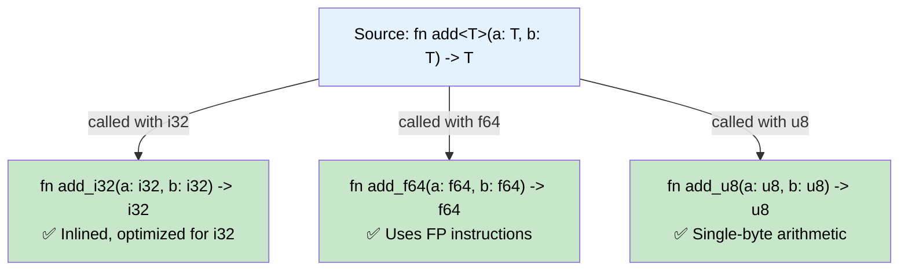
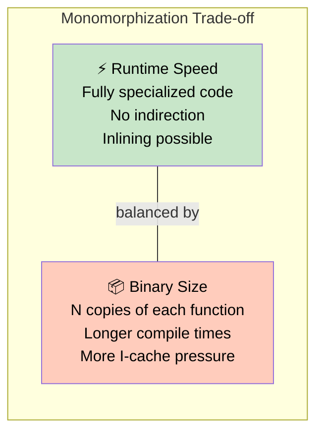

# 2. Generics and Monomorphization 🟡

> **What you'll learn:**
> - How Rust generics work compared to C++ templates, Java generics, and Go generics
> - What monomorphization is and how it delivers zero-cost abstractions
> - The binary size vs. runtime speed trade-off
> - How to read and reason about generic function signatures with trait bounds

---

## What Generics Actually Are

A generic function is a *template for many concrete functions*. When you write:

```rust
fn largest<T: PartialOrd>(list: &[T]) -> &T {
    let mut max = &list[0];
    for item in &list[1..] {
        if item > max {
            max = item;
        }
    }
    max
}
```

You're not writing one function — you're writing a recipe that the compiler will use to stamp out as many concrete functions as needed.

## Monomorphization: What the Compiler Actually Does

**Monomorphization** is Rust's strategy for compiling generics. For every *distinct concrete type* that a generic function is called with, the compiler generates a separate, specialized version of that function.

### What You Write

```rust
fn add<T: std::ops::Add<Output = T>>(a: T, b: T) -> T {
    a + b
}

fn main() {
    let x = add(1_i32, 2_i32);
    let y = add(1.0_f64, 2.0_f64);
    let z = add(1_u8, 2_u8);
}
```

### What the Compiler Generates

```rust
// The compiler creates three separate functions:

fn add_i32(a: i32, b: i32) -> i32 {
    a + b
}

fn add_f64(a: f64, b: f64) -> f64 {
    a + b
}

fn add_u8(a: u8, b: u8) -> u8 {
    a + b
}

fn main() {
    let x = add_i32(1, 2);
    let y = add_f64(1.0, 2.0);
    let z = add_u8(1, 2);
}
```



Each generated function is **fully optimized** for its specific type — the CPU operates directly on `i32`s, `f64`s, and `u8`s. There's no boxing, no type-checking at runtime, no vtable indirection.

**This is what "zero-cost abstraction" means:** The generic version has the same runtime performance as hand-written specialized code.

## Comparing Generic Strategies Across Languages

| Language | Strategy | Runtime Cost | Binary Size | Type Checking |
|----------|----------|-------------|-------------|---------------|
| **Rust** | Monomorphization | Zero — fully specialized | Larger (N copies) | At instantiation, with trait bounds |
| **C++** | Template instantiation | Zero — fully specialized | Larger (N copies) | At instantiation (concepts in C++20) |
| **Java** | Type erasure | Boxing overhead | One copy | At definition via interfaces |
| **Go** | Dictionary passing + stenciling | Small dictionary overhead | Moderate | At definition via constraints |
| **C#** | JIT specialization | JIT overhead, then fast | Dynamic, via JIT | At definition via constraints |

### Rust vs. C++ Templates

Rust generics and C++ templates both monomorphize, but there are critical differences:

```cpp
// C++ template — no constraints on T
template<typename T>
T add(T a, T b) {
    return a + b; // Compiles for any T with operator+
    // Error only at instantiation with a type that lacks operator+
    // Error messages can be horrific (pages of template nesting)
}
```

```rust
// Rust generic — T must satisfy a trait bound
fn add<T: std::ops::Add<Output = T>>(a: T, b: T) -> T {
    a + b // Guaranteed to work for any T: Add<Output = T>
    // Error at the CALL SITE is clear: "trait bound not satisfied"
}

// ❌ FAILS: the trait bound `String: Add<Output = String>` is not satisfied
// (actually String implements Add, but let's use a type that doesn't)
// let r = add(vec![1], vec![2]); // Vec doesn't implement Add
```

**Key difference:** Rust checks that the *generic definition* is valid for *all* types satisfying the bounds, not just the specific types you happen to instantiate it with. This means:
- Errors are caught at the definition site, not at the call site
- Error messages are comprehensible
- It's impossible to write a generic function that compiles only by accident

## The Binary Size Trade-Off

Monomorphization generates **one copy per type instantiation**. This has a real cost:

```rust
// If you use Vec<i32>, Vec<String>, Vec<f64>, Vec<User>, Vec<Order>...
// The compiler generates all of Vec's methods FIVE times.
```



**Mitigation strategies:**
1. **Dynamic dispatch** (`dyn Trait`) — generates one copy, uses vtable indirection (see [Ch 7](ch07-trait-objects-and-dynamic-dispatch.md))
2. **Non-generic inner functions** — extract the type-independent logic into a concrete helper:

```rust
// ❌ The entire function gets monomorphized for each T
fn process_items<T: Display>(items: &[T]) {
    println!("Processing {} items", items.len()); // This line doesn't depend on T!
    for item in items {
        println!("  {item}");
    }
}

// ✅ FIX: extract the non-generic parts
fn process_items<T: Display>(items: &[T]) {
    print_header(items.len());  // One copy — not generic
    for item in items {
        println!("  {item}");
    }
}

fn print_header(count: usize) {
    println!("Processing {count} items");
}
```

This is a common pattern in the standard library — `Vec::push` delegates to a non-generic inner function for the reallocation logic.

## Trait Bounds: The Vocabulary of Generics

### Where Clause Syntax

For complex bounds, the `where` clause is clearer than inline bounds:

```rust
// Inline bounds — fine for simple cases
fn print_all<T: Display + Debug>(items: &[T]) { /* ... */ }

// Where clause — better for complex bounds
fn merge<K, V, I>(iter: I) -> HashMap<K, V>
where
    K: Eq + Hash + Clone,
    V: Default + AddAssign,
    I: IntoIterator<Item = (K, V)>,
{
    let mut map = HashMap::new();
    for (k, v) in iter {
        *map.entry(k).or_default() += v;
    }
    map
}
```

### `impl Trait` in Argument vs. Return Position

```rust
use std::fmt::Display;

// Argument position: caller chooses the type (syntactic sugar for generics)
fn print_it(item: &impl Display) {
    println!("{item}");
}
// Desugars to:
fn print_it_desugared<T: Display>(item: &T) {
    println!("{item}");
}

// Return position: callee chooses the type (opaque return type)
fn make_greeting(name: &str) -> impl Display {
    format!("Hello, {name}!")
    // The caller can't see it's a String — only that it implements Display
}
```

**The critical distinction:**
- **Argument position** `impl Trait` = "the caller picks any type satisfying the bound" — it's **universal**
- **Return position** `impl Trait` = "I (the function) return *one specific type*, but I'm not telling you which" — it's **existential**

```rust
// ❌ FAILS: return-position impl Trait must be a single concrete type
fn make_value(flag: bool) -> impl Display {
    if flag {
        42_i32      // returns i32
    } else {
        "hello"     // returns &str — different type!
        // error[E0308]: `if` and `else` have incompatible types
    }
}

// ✅ FIX: use dyn Trait for runtime polymorphism
fn make_value(flag: bool) -> Box<dyn Display> {
    if flag {
        Box::new(42_i32)
    } else {
        Box::new("hello")
    }
}
```

## Turbofish Syntax: `::<>`

When the compiler can't infer the type, you help it:

```rust
let numbers: Vec<i32> = vec![1, 2, 3];

// Or using turbofish:
let numbers = vec![1, 2, 3]; // infers Vec<i32>
let parsed = "42".parse::<i32>().unwrap();  // turbofish tells parse what to return
let collected = (0..10).collect::<Vec<_>>(); // turbofish on collect, _ for element type
```

## Phantom Type Parameters

Sometimes you need a generic parameter that doesn't appear in any field — it exists only for the type system.

```rust
use std::marker::PhantomData;

struct Meters;
struct Seconds;

struct Measurement<Unit> {
    value: f64,
    _unit: PhantomData<Unit>,
}

impl<Unit> Measurement<Unit> {
    fn new(value: f64) -> Self {
        Measurement { value, _unit: PhantomData }
    }
}

fn main() {
    let distance = Measurement::<Meters>::new(100.0);
    let time = Measurement::<Seconds>::new(9.58);

    // ❌ FAILS: mismatched types
    // Measurement<Meters> != Measurement<Seconds>
    // let nonsense: Measurement<Meters> = time;
}
```

This is a stepping stone to the full Newtype pattern (next chapter) and the type-state pattern (see companion *Type-Driven Correctness* guide).

---

<details>
<summary><strong>🏋️ Exercise: Generic Statistics</strong> (click to expand)</summary>

Write a generic `statistics` function that accepts a slice of any numeric type and returns the minimum, maximum, and count. Use appropriate trait bounds.

**Requirements:**
1. The function must work for `i32`, `f64`, and `u64`
2. Return a struct `Stats<T>` containing `min: T`, `max: T`, `count: usize`
3. Handle the empty-slice case by returning `None`
4. Don't use any external crates — only `std` trait bounds

<details>
<summary>🔑 Solution</summary>

```rust
/// Statistics result holding min, max, and count.
#[derive(Debug)]
struct Stats<T> {
    min: T,
    max: T,
    count: usize,
}

/// Compute basic statistics on a slice of comparable, copyable values.
/// Returns `None` if the slice is empty.
fn statistics<T>(data: &[T]) -> Option<Stats<T>>
where
    T: PartialOrd + Copy,  // PartialOrd for comparisons, Copy to avoid ownership issues
{
    let first = data.first()?;  // Returns None if empty

    let mut min = *first;
    let mut max = *first;

    for &item in &data[1..] {
        if item < min {
            min = item;
        }
        if item > max {
            max = item;
        }
    }

    Some(Stats {
        min,
        max,
        count: data.len(),
    })
}

fn main() {
    // Works with i32
    let ints = [3, 1, 4, 1, 5, 9, 2, 6];
    let s = statistics(&ints).unwrap();
    println!("i32: min={}, max={}, count={}", s.min, s.max, s.count);
    assert_eq!(s.min, 1);
    assert_eq!(s.max, 9);

    // Works with f64
    let floats = [2.7, 1.4, 3.1, 0.5];
    let s = statistics(&floats).unwrap();
    println!("f64: min={}, max={}, count={}", s.min, s.max, s.count);

    // Works with u64
    let big: Vec<u64> = vec![100, 200, 50, 300];
    let s = statistics(&big).unwrap();
    println!("u64: min={}, max={}, count={}", s.min, s.max, s.count);
    assert_eq!(s.min, 50);
    assert_eq!(s.max, 300);

    // Empty slice returns None
    let empty: &[i32] = &[];
    assert!(statistics(empty).is_none());
}
```

**What the compiler generates:** Three monomorphized versions of `statistics` — one for `i32`, one for `f64`, and one for `u64`. Each uses direct comparisons with no boxing or indirection.

</details>
</details>

---

> **Key Takeaways:**
> - **Monomorphization** stamps out one specialized copy of a generic function per concrete type — this is how Rust achieves zero-cost abstractions.
> - Unlike C++ templates, Rust checks generic definitions against trait bounds *before* instantiation — errors are clear and localized.
> - The trade-off is **binary size**: more instantiations = more code. Use `dyn Trait` (Ch 7) or non-generic inner functions to mitigate.
> - `impl Trait` in argument position is sugar for generics; in return position it's an opaque type that must be a single concrete type.

> **See also:**
> - [Ch 3: Const Generics and Newtypes](ch03-const-generics-and-newtypes.md) — generics over *values*, not just types
> - [Ch 7: Trait Objects and Dynamic Dispatch](ch07-trait-objects-and-dynamic-dispatch.md) — the alternative to monomorphization when you need runtime flexibility
> - *Rust Memory Management* companion guide — how monomorphization affects cache behavior and memory layout
