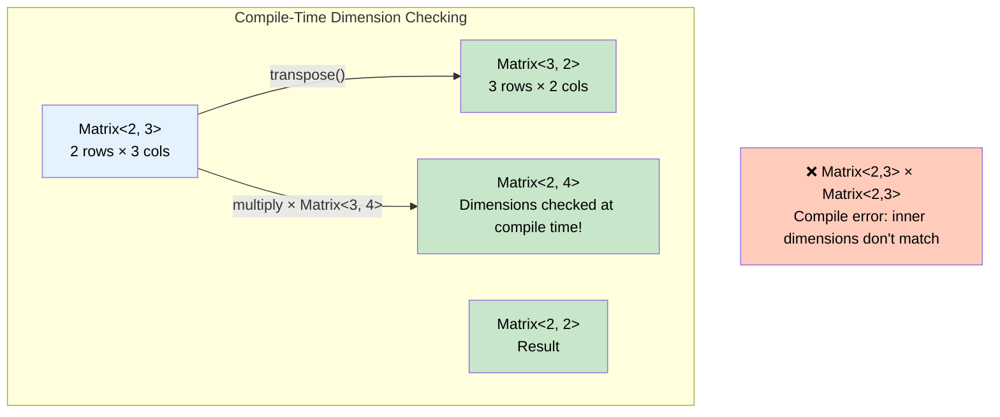
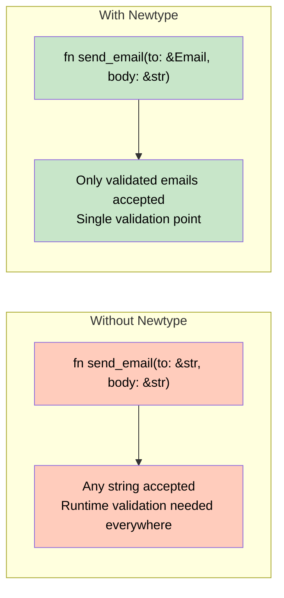

# 3. Const Generics and Newtypes 🟡

> **What you'll learn:**
> - How const generics let you parameterize types over *values* (`[T; N]`), not just types
> - The Newtype pattern: wrapping a primitive to create a distinct type with zero-cost
> - How Newtypes bypass the Orphan Rule to implement foreign traits on foreign types
> - Compile-time domain validation: making illegal states unrepresentable

---

## Const Generics: Types Parameterized by Values

Before const generics (stabilized in Rust 1.51), you couldn't write a generic function that worked for arrays of *any size*. You had to implement traits manually for `[T; 0]`, `[T; 1]`, `[T; 2]`, ... up to `[T; 32]`.

Now you can parameterize over the array length itself:

```rust
/// Compute the dot product of two arrays of the same length.
fn dot_product<const N: usize>(a: &[f64; N], b: &[f64; N]) -> f64 {
    let mut sum = 0.0;
    for i in 0..N {
        sum += a[i] * b[i];
    }
    sum
}

fn main() {
    let a = [1.0, 2.0, 3.0];
    let b = [4.0, 5.0, 6.0];
    println!("dot = {}", dot_product(&a, &b)); // 32.0

    let c = [1.0, 2.0];
    let d = [3.0, 4.0];
    println!("dot = {}", dot_product(&c, &d)); // 11.0

    // ❌ FAILS: mismatched array lengths
    // dot_product(&a, &c);
    // error: expected `&[f64; 3]`, found `&[f64; 2]`
}
```

The compiler monomorphizes `dot_product` for each `N` — you get `dot_product::<3>` and `dot_product::<2>`, each fully optimized. The length mismatch is caught **at compile time**, not runtime.

### What Const Generics Can Be

As of Rust 1.79+, const generic parameters can be:

| Type | Example | Notes |
|------|---------|-------|
| Integers | `const N: usize`, `const M: i32` | Most common |
| `bool` | `const CHECKED: bool` | Feature flags at type level |
| `char` | `const SEP: char` | Rare but valid |

More complex types (structs, enums, strings) are not yet supported as const generic parameters — this is an area of active development.

### Practical Example: Fixed-Size Matrix

```rust
use std::ops::{Add, Mul};

#[derive(Debug, Clone, Copy)]
struct Matrix<const ROWS: usize, const COLS: usize> {
    data: [[f64; COLS]; ROWS],
}

impl<const ROWS: usize, const COLS: usize> Matrix<ROWS, COLS> {
    fn new(data: [[f64; COLS]; ROWS]) -> Self {
        Matrix { data }
    }

    fn transpose(&self) -> Matrix<COLS, ROWS> {
        let mut result = [[0.0; ROWS]; COLS];
        for i in 0..ROWS {
            for j in 0..COLS {
                result[j][i] = self.data[i][j];
            }
        }
        Matrix { data: result }
    }
}

fn main() {
    let m = Matrix::<2, 3>::new([
        [1.0, 2.0, 3.0],
        [4.0, 5.0, 6.0],
    ]);

    let t = m.transpose(); // Matrix<3, 2> — dimensions flipped at compile time!
    println!("{:?}", t);

    // ❌ FAILS: can't add Matrix<2,3> + Matrix<3,2> — dimensions don't match
    // let bad = m + t;
}
```



## The Newtype Pattern

A **newtype** is a single-field tuple struct that wraps an existing type to give it a new identity:

```rust
struct UserId(u64);
struct OrderId(u64);
struct Meters(f64);
struct Seconds(f64);
```

Both `UserId` and `OrderId` are `u64` underneath, but the type system treats them as **completely different types**:

```rust
fn find_user(id: UserId) -> Option<String> {
    // ...
    # Some(format!("User {}", id.0))
}

fn find_order(id: OrderId) -> Option<String> {
    // ...
    # Some(format!("Order {}", id.0))
}

fn main() {
    let user_id = UserId(42);
    let order_id = OrderId(42);

    find_user(user_id);    // ✅
    // find_user(order_id); // ❌ FAILS: expected `UserId`, found `OrderId`
}
```

### Zero-Cost Guarantee

A newtype has **exactly the same runtime representation** as the type it wraps. There's no extra memory, no indirection, no overhead:

```rust
use std::mem::size_of;

struct UserId(u64);

fn main() {
    assert_eq!(size_of::<UserId>(), size_of::<u64>()); // Both 8 bytes
}
```

The compiler can (and does) optimize newtypes away entirely — function calls on `UserId` generate the same machine code as calls on `u64`.

### Why Newtypes Matter: Real Bugs They Prevent

In 1999, NASA's Mars Climate Orbiter was lost because one team used imperial units and another metric. The software passed raw `f64` values without any type distinction. In Rust:

```rust
struct NewtonSeconds(f64);
struct PoundForceSeconds(f64);

fn adjust_trajectory(impulse: NewtonSeconds) {
    // use impulse.0 to get the raw value
    println!("Adjusting by {} N·s", impulse.0);
}

fn main() {
    let metric = NewtonSeconds(4.45);
    let imperial = PoundForceSeconds(1.0);

    adjust_trajectory(metric);    // ✅
    // adjust_trajectory(imperial); // ❌ FAILS: expected NewtonSeconds
}
```

## Bypassing the Orphan Rule with Newtypes

Rust's **Orphan Rule** says: you can implement a trait for a type only if *either* the trait *or* the type is defined in your crate. This prevents conflicting implementations across crates.

```rust
// ❌ FAILS: neither `Display` nor `Vec` is defined in our crate
// impl std::fmt::Display for Vec<i32> {
//     fn fmt(&self, f: &mut std::fmt::Formatter) -> std::fmt::Result {
//         write!(f, "[{}]", self.iter().map(|i| i.to_string()).collect::<Vec<_>>().join(", "))
//     }
// }
// error[E0117]: only traits defined in the current crate can be implemented for types defined outside
```

The **newtype wrapper** solves this:

```rust
use std::fmt;

struct PrettyVec(Vec<i32>);

impl fmt::Display for PrettyVec {
    fn fmt(&self, f: &mut fmt::Formatter) -> fmt::Result {
        let items: Vec<String> = self.0.iter().map(|i| i.to_string()).collect();
        write!(f, "[{}]", items.join(", "))
    }
}

fn main() {
    let v = PrettyVec(vec![1, 2, 3, 4, 5]);
    println!("{v}"); // [1, 2, 3, 4, 5]
}
```

### Making Newtypes Ergonomic with `Deref`

The downside of newtypes is you lose access to the inner type's methods. You can restore access with `Deref`:

```rust
use std::ops::Deref;

struct Username(String);

impl Deref for Username {
    type Target = str;

    fn deref(&self) -> &str {
        &self.0
    }
}

fn main() {
    let name = Username("alice".to_string());

    // These work because of Deref coercion:
    println!("Length: {}", name.len());       // str::len
    println!("Upper: {}", name.to_uppercase()); // str::to_uppercase
}
```

> **Caution:** `Deref` should only be used when the newtype *is-a* wrapper around its target and you want transparent access. Don't use it to simulate inheritance.

## Compile-Time Validation with Newtypes

The most powerful use of newtypes is encoding constraints into the type system:

```rust
/// An email address that has been validated.
/// You can only create one through `Email::parse`, which validates format.
#[derive(Debug, Clone)]
struct Email(String);

impl Email {
    /// Parse and validate an email address.
    fn parse(s: &str) -> Result<Self, String> {
        if s.contains('@') && s.contains('.') && s.len() >= 5 {
            Ok(Email(s.to_string()))
        } else {
            Err(format!("Invalid email: {s}"))
        }
    }

    fn as_str(&self) -> &str {
        &self.0
    }
}

fn send_email(to: &Email, body: &str) {
    // We KNOW `to` is valid — the type guarantees it
    println!("Sending to {}: {}", to.as_str(), body);
}

fn main() {
    // ✅ Valid email
    let email = Email::parse("alice@example.com").unwrap();
    send_email(&email, "Hello!");

    // ❌ Invalid — caught at runtime by the constructor
    let bad = Email::parse("not-an-email");
    assert!(bad.is_err());

    // ❌ FAILS at compile time — can't bypass the constructor
    // let sneaky = Email("whatever".to_string());
    // error: tuple struct constructor `Email` is private
    // (if we make the inner field private, which we should!)
}
```

To make the inner field truly private, put the newtype in a module:

```rust
mod validated {
    #[derive(Debug, Clone)]
    pub struct Email(String); // String field is private

    impl Email {
        pub fn parse(s: &str) -> Result<Self, String> {
            if s.contains('@') && s.contains('.') && s.len() >= 5 {
                Ok(Email(s.to_string()))
            } else {
                Err(format!("Invalid email: {s}"))
            }
        }

        pub fn as_str(&self) -> &str {
            &self.0
        }
    }
}

use validated::Email;

fn main() {
    let email = Email::parse("alice@example.com").unwrap();
    // Email("bypass") — ❌ private field, won't compile
}
```



> **Connection to Type-Driven Correctness guide:** This pattern is the foundation of the Type-State pattern covered in the companion *Type-Driven Correctness in Rust* guide — where you use phantom type parameters to track state transitions through the type system.

---

<details>
<summary><strong>🏋️ Exercise: Units of Measurement Library</strong> (click to expand)</summary>

Build a type-safe units library using newtypes and const generics.

**Requirements:**
1. Define newtypes `Meters`, `Kilometers`, and `Miles` wrapping `f64`
2. Implement `Add` for each type (adding Meters + Meters → Meters)
3. Implement `From<Kilometers> for Meters` and `From<Miles> for Meters` for conversions
4. Make it a compile error to add `Meters + Miles` directly
5. **Bonus:** Write a generic `fn total_distance<const N: usize>(segments: &[Meters; N]) -> Meters`

<details>
<summary>🔑 Solution</summary>

```rust
use std::ops::Add;
use std::fmt;

/// Distance in meters.
#[derive(Debug, Clone, Copy, PartialEq)]
struct Meters(f64);

/// Distance in kilometers.
#[derive(Debug, Clone, Copy, PartialEq)]
struct Kilometers(f64);

/// Distance in miles.
#[derive(Debug, Clone, Copy, PartialEq)]
struct Miles(f64);

// --- Addition within the same unit ---

impl Add for Meters {
    type Output = Meters;
    fn add(self, rhs: Self) -> Self::Output {
        Meters(self.0 + rhs.0)
    }
}

impl Add for Kilometers {
    type Output = Kilometers;
    fn add(self, rhs: Self) -> Self::Output {
        Kilometers(self.0 + rhs.0)
    }
}

impl Add for Miles {
    type Output = Miles;
    fn add(self, rhs: Self) -> Self::Output {
        Miles(self.0 + rhs.0)
    }
}

// --- Display ---

impl fmt::Display for Meters {
    fn fmt(&self, f: &mut fmt::Formatter) -> fmt::Result {
        write!(f, "{:.2} m", self.0)
    }
}

// --- Conversions to Meters ---

impl From<Kilometers> for Meters {
    fn from(km: Kilometers) -> Self {
        Meters(km.0 * 1000.0)
    }
}

impl From<Miles> for Meters {
    fn from(mi: Miles) -> Self {
        Meters(mi.0 * 1609.344)
    }
}

/// Sum an array of Meters segments using const generics.
fn total_distance<const N: usize>(segments: &[Meters; N]) -> Meters {
    let mut sum = 0.0;
    for s in segments {
        sum += s.0;
    }
    Meters(sum)
}

fn main() {
    // Same-unit addition works
    let a = Meters(100.0);
    let b = Meters(200.0);
    let c = a + b;
    assert_eq!(c, Meters(300.0));
    println!("a + b = {c}");

    // Cross-unit requires explicit conversion
    let marathon_miles = Miles(26.2);
    let marathon_meters: Meters = marathon_miles.into();
    println!("Marathon: {marathon_meters}");

    // Meters + Miles directly is a compile error:
    // let bad = a + marathon_miles; // ❌ error: mismatched types

    // Const-generic total distance
    let segments = [Meters(100.0), Meters(200.0), Meters(300.0)];
    let total = total_distance(&segments);
    assert_eq!(total, Meters(600.0));
    println!("Total: {total}");
}
```

</details>
</details>

---

> **Key Takeaways:**
> - **Const generics** let you parameterize types over values like array lengths — catching dimension mismatches at compile time.
> - The **Newtype pattern** wraps a type to create a distinct type with zero runtime cost — it prevents unit confusion, enables domain validation, and bypasses the Orphan Rule.
> - Newtypes are most powerful when the inner field is **private** — forcing construction through a validating constructor guarantees invariants.
> - Use `Deref` sparingly to restore ergonomic access to the wrapped type's methods.

> **See also:**
> - [Ch 4: Defining and Implementing Traits](ch04-defining-and-implementing-traits.md) — the Orphan Rule in detail
> - [Ch 10: Error Handling and Conversions](ch10-error-handling-and-conversions.md) — `From`/`Into` conversions between newtypes
> - *Type-Driven Correctness in Rust* companion guide — the Type-State pattern builds on newtypes with phantom type parameters
