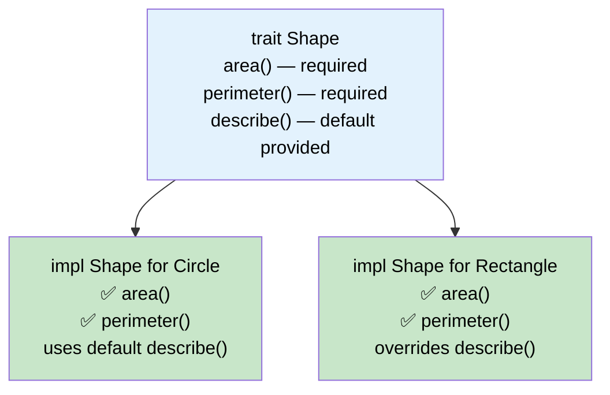
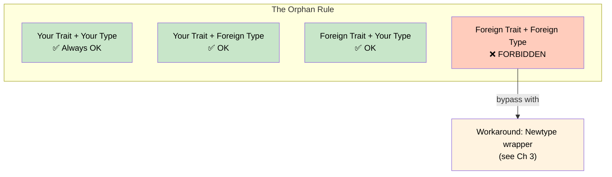

# 4. Defining and Implementing Traits 🟢

> **What you'll learn:**
> - What a trait is and how it differs from interfaces in Java/C#/Go and abstract classes in C++
> - How to define traits with required methods, provided (default) methods, and associated constants
> - The Coherence rules and Orphan Rule — why Rust restricts where you can implement traits
> - Supertraits and trait inheritance

---

## Traits: The Rust Interface

A trait defines a **contract**: a set of methods that a type promises to support. If you come from other languages:

| Language | Rust Equivalent | Key Difference |
|----------|----------------|----------------|
| Java `interface` | `trait` | Traits can have default method bodies, associated types, and const values |
| C# `interface` | `trait` | Traits can't have fields; default methods added in C# 8 |
| C++ abstract class | `trait` | No fields, no constructors, no inheritance hierarchy |
| Go `interface` | `trait` | Rust traits are *explicit* — you `impl Trait for Type`, Go uses structural typing |
| Haskell `typeclass` | `trait` | Closest analogue — Rust traits are inspired by typeclasses |

### Defining a Trait

```rust
trait Shape {
    /// Required — every implementor must provide this.
    fn area(&self) -> f64;

    /// Required.
    fn perimeter(&self) -> f64;

    /// Provided (default) — implementors get this for free, but can override it.
    fn describe(&self) -> String {
        format!(
            "Shape with area {:.2} and perimeter {:.2}",
            self.area(),
            self.perimeter()
        )
    }
}
```

### Implementing a Trait

```rust
struct Circle {
    radius: f64,
}

struct Rectangle {
    width: f64,
    height: f64,
}

impl Shape for Circle {
    fn area(&self) -> f64 {
        std::f64::consts::PI * self.radius * self.radius
    }

    fn perimeter(&self) -> f64 {
        2.0 * std::f64::consts::PI * self.radius
    }
    // describe() uses the default implementation
}

impl Shape for Rectangle {
    fn area(&self) -> f64 {
        self.width * self.height
    }

    fn perimeter(&self) -> f64 {
        2.0 * (self.width + self.height)
    }

    // Override the default
    fn describe(&self) -> String {
        format!("{}×{} rectangle", self.width, self.height)
    }
}
```



## Associated Constants

Traits can require associated constants:

```rust
trait Dimensional {
    const DIMENSIONS: usize;

    fn origin() -> Self;
}

struct Point2D { x: f64, y: f64 }
struct Point3D { x: f64, y: f64, z: f64 }

impl Dimensional for Point2D {
    const DIMENSIONS: usize = 2;

    fn origin() -> Self {
        Point2D { x: 0.0, y: 0.0 }
    }
}

impl Dimensional for Point3D {
    const DIMENSIONS: usize = 3;

    fn origin() -> Self {
        Point3D { x: 0.0, y: 0.0, z: 0.0 }
    }
}

fn main() {
    println!("2D has {} dimensions", Point2D::DIMENSIONS);
    println!("3D has {} dimensions", Point3D::DIMENSIONS);
}
```

## The Coherence Rules and the Orphan Rule

Rust enforces **coherence**: for any given type and trait, there must be **at most one implementation**. This prevents ambiguity — the compiler must always know which implementation to use.

The mechanism is the **Orphan Rule**:

> You can implement trait `T` for type `S` only if **at least one** of `T` or `S` is defined in **your** crate.

```rust
// ✅ Your trait, foreign type:
trait Greet {
    fn greet(&self) -> String;
}
impl Greet for String {
    fn greet(&self) -> String {
        format!("Hello, {self}!")
    }
}

// ✅ Foreign trait, your type:
struct UserId(u64);
impl std::fmt::Display for UserId {
    fn fmt(&self, f: &mut std::fmt::Formatter) -> std::fmt::Result {
        write!(f, "user#{}", self.0)
    }
}

// ❌ FAILS: Foreign trait, foreign type:
// impl std::fmt::Display for Vec<i32> {
//     fn fmt(&self, f: &mut std::fmt::Formatter) -> std::fmt::Result {
//         write!(f, "my custom vec display")
//     }
// }
// error[E0117]: only traits defined in the current crate can be implemented
// for types defined outside of the crate
```



### Why the Orphan Rule Exists

Without it, two different crates could both implement `Display` for `Vec<i32>` with different behavior. Your program, depending on both crates, would have **two conflicting implementations** and no way to choose. Coherence prevents this at compile time.

## Supertraits: Trait Inheritance

A trait can require that its implementors also implement another trait:

```rust
use std::fmt;

// Display is a supertrait of PrettyPrint
trait PrettyPrint: fmt::Display {
    fn pretty(&self) -> String {
        format!("✨ {} ✨", self) // Can use Display because of the supertrait bound
    }
}
```

This means: "To implement `PrettyPrint` for a type, that type must *also* implement `Display`."

```rust
# use std::fmt;
# trait PrettyPrint: fmt::Display {
#     fn pretty(&self) -> String {
#         format!("✨ {} ✨", self)
#     }
# }
struct Name(String);

impl fmt::Display for Name {
    fn fmt(&self, f: &mut fmt::Formatter) -> fmt::Result {
        write!(f, "{}", self.0)
    }
}

impl PrettyPrint for Name {} // Uses the default pretty() method

fn main() {
    let name = Name("Rust".to_string());
    println!("{}", name.pretty()); // ✨ Rust ✨
}
```

### Multiple Trait Bounds as Supertraits

```rust
use std::fmt::{Debug, Display};

trait Reportable: Display + Debug + Send + Sync {
    fn report(&self) -> String;
}
```

This is common in production code — a `Reportable` error type that can be displayed, debug-printed, and sent across threads.

## Standard Library Traits You Should Know

| Trait | Purpose | Derivable? |
|-------|---------|-----------|
| `Debug` | `{:?}` formatting | ✅ `#[derive(Debug)]` |
| `Display` | `{}` formatting | ❌ Manual only |
| `Clone` | Explicit duplication | ✅ `#[derive(Clone)]` |
| `Copy` | Implicit bitwise copy | ✅ `#[derive(Copy, Clone)]` |
| `PartialEq`, `Eq` | Equality comparison | ✅ `#[derive(PartialEq, Eq)]` |
| `PartialOrd`, `Ord` | Ordering | ✅ `#[derive(PartialOrd, Ord)]` |
| `Hash` | Hashing for `HashMap`/`HashSet` | ✅ `#[derive(Hash)]` |
| `Default` | Default value construction | ✅ `#[derive(Default)]` |
| `From`/`Into` | Type conversions | ❌ Manual |
| `Iterator` | Iteration protocol | ❌ Manual |

### Derive Macros: Code Generation

`#[derive]` is syntactic sugar — the compiler generates a standard implementation:

```rust
#[derive(Debug, Clone, PartialEq, Eq, Hash)]
struct Point {
    x: i32,
    y: i32,
}
```

What the compiler generates for `PartialEq`:

```rust
// Auto-generated by #[derive(PartialEq)]
impl PartialEq for Point {
    fn eq(&self, other: &Self) -> bool {
        self.x == other.x && self.y == other.y
    }
}
```

---

<details>
<summary><strong>🏋️ Exercise: Design a Trait Hierarchy</strong> (click to expand)</summary>

Design a `Storage` trait for a key-value store with the following requirements:

1. Define a `Storage` trait with `get(&self, key: &str) -> Option<String>` and `set(&mut self, key: &str, value: String)`
2. Define a supertrait `PersistentStorage: Storage + Debug` that adds `fn flush(&self) -> Result<(), String>`
3. Implement `Storage` for `HashMap<String, String>` (yes, this is allowed — foreign trait? No, `Storage` is yours)
4. Implement a `MemoryStore` struct that wraps `HashMap<String, String>` and implements both `Storage` and `Debug`
5. Implement `PersistentStorage` for `MemoryStore` (the `flush` can just print "flushed")

<details>
<summary>🔑 Solution</summary>

```rust
use std::collections::HashMap;
use std::fmt::Debug;

/// A key-value storage contract.
trait Storage {
    fn get(&self, key: &str) -> Option<String>;
    fn set(&mut self, key: &str, value: String);

    /// Default method: check if a key exists.
    fn contains(&self, key: &str) -> bool {
        self.get(key).is_some()
    }
}

/// A persistent storage that can flush to durable storage.
/// Requires Storage + Debug as supertraits.
trait PersistentStorage: Storage + Debug {
    fn flush(&self) -> Result<(), String>;
}

// --- Implement Storage directly for HashMap ---

impl Storage for HashMap<String, String> {
    fn get(&self, key: &str) -> Option<String> {
        HashMap::get(self, key).cloned()
    }

    fn set(&mut self, key: &str, value: String) {
        self.insert(key.to_string(), value);
    }
}

// --- MemoryStore wrapping HashMap ---

#[derive(Debug)]
struct MemoryStore {
    data: HashMap<String, String>,
}

impl MemoryStore {
    fn new() -> Self {
        MemoryStore {
            data: HashMap::new(),
        }
    }
}

impl Storage for MemoryStore {
    fn get(&self, key: &str) -> Option<String> {
        self.data.get(key).cloned()
    }

    fn set(&mut self, key: &str, value: String) {
        self.data.insert(key.to_string(), value);
    }
}

impl PersistentStorage for MemoryStore {
    fn flush(&self) -> Result<(), String> {
        println!("Flushed {} entries to /dev/null", self.data.len());
        Ok(())
    }
}

fn main() {
    let mut store = MemoryStore::new();
    store.set("name", "Rust".to_string());
    store.set("version", "2024".to_string());

    println!("name = {:?}", store.get("name"));
    println!("contains 'name': {}", store.contains("name"));
    println!("contains 'missing': {}", store.contains("missing"));

    store.flush().unwrap();
    println!("Debug: {:?}", store);
}
```

</details>
</details>

---

> **Key Takeaways:**
> - Traits are Rust's **contracts** — they define required methods, can provide default implementations, and support associated constants.
> - The **Orphan Rule** ensures coherence: at least one of the trait or the type must be local to your crate. Use the Newtype pattern (Ch 3) to work around it.
> - **Supertraits** let you build trait hierarchies without the complexity of class inheritance.
> - `#[derive]` generates standard trait implementations — use it for `Debug`, `Clone`, `PartialEq`, `Hash`, and more.

> **See also:**
> - [Ch 3: Const Generics and Newtypes](ch03-const-generics-and-newtypes.md) — bypassing the Orphan Rule with newtypes
> - [Ch 5: Associated Types vs. Generic Parameters](ch05-associated-types-vs-generic-parameters.md) — the next level of trait design
> - [Ch 7: Trait Objects and Dynamic Dispatch](ch07-trait-objects-and-dynamic-dispatch.md) — using traits at runtime with `dyn`
