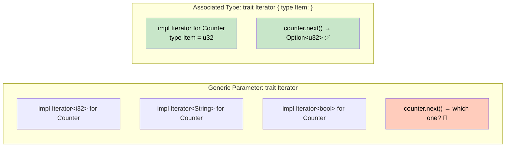

# 5. Associated Types vs. Generic Parameters 🟡

> **What you'll learn:**
> - The difference between `trait Foo { type Item; }` and `trait Foo<Item>`
> - When associated types prevent combinatorial explosion in trait implementations
> - How to use associated types with bounds and defaults
> - Real-world examples from the standard library: `Iterator`, `Add`, `Deref`

---

## The Problem: Combinatorial Explosion

Imagine designing an `Iterator` trait. You could use a generic parameter:

```rust
// Hypothetical: generic parameter approach
trait Iterator<Item> {
    fn next(&mut self) -> Option<Item>;
}
```

This means a single type could implement `Iterator` **multiple times** — once for each `Item`:

```rust
# trait Iterator<Item> { fn next(&mut self) -> Option<Item>; }
struct Counter;

impl Iterator<i32> for Counter {
    fn next(&mut self) -> Option<i32> { Some(1) }
}

impl Iterator<String> for Counter {
    fn next(&mut self) -> Option<String> { Some("one".to_string()) }
}

// Now which one do you get when you call counter.next()?
// The compiler would need help disambiguating EVERY call:
// <Counter as Iterator<i32>>::next(&mut counter)
```

This quickly becomes unusable. A `Counter` should iterate over *one specific type*, not be an arbitrary multi-output factory.

## Associated Types: One Implementation Per Type

The real `Iterator` uses an **associated type**:

```rust
trait Iterator {
    type Item; // Each impl chooses exactly ONE type for Item

    fn next(&mut self) -> Option<Self::Item>;
}
```

Now a type can implement `Iterator` **exactly once**, and the associated type is determined by that implementation:

```rust
struct Counter {
    count: u32,
}

impl Iterator for Counter {
    type Item = u32; // Decided once, here

    fn next(&mut self) -> Option<Self::Item> {
        self.count += 1;
        if self.count <= 5 {
            Some(self.count)
        } else {
            None
        }
    }
}
```

No ambiguity. No turbofish needed. `counter.next()` always returns `Option<u32>`.



## When to Use Which

| Use | Associated Type (`type Item;`) | Generic Parameter (`<Item>`) |
|-----|-------------------------------|------------------------------|
| **One impl per type** | ✅ `Iterator`, `Deref`, `IntoIterator` | |
| **Multiple impls per type** | | ✅ `From<T>`, `Add<Rhs>`, `AsRef<T>` |
| **The type "has a" relationship** | ✅ An iterator "has a" item type | |
| **The trait "works with" different types** | | ✅ `From<String>`, `From<&str>`, `From<Vec<u8>>` |
| **Caller needs to specify the type** | | ✅ `"42".parse::<i32>()` |

### Decision Rule

> **Use an associated type** when there's a **natural, unique** relationship between the implementor and the type parameter. Use a generic parameter when a single type should implement the trait **multiple times** for different parameters.

## Standard Library Examples

### `Iterator` — Associated Type

```rust
// One item type per iterator. A Vec<String>'s iterator yields &String.
trait Iterator {
    type Item;
    fn next(&mut self) -> Option<Self::Item>;
    // ... 70+ provided methods that all refer to Self::Item
}
```

If `Item` were a generic parameter, every single method that accepts or returns an iterator would need the extra parameter: `fn map<B, F: FnMut(Item) -> B>(self, f: F) -> Map<Self, F, Item>` — an explosion of parameters.

### `From<T>` — Generic Parameter

```rust
// Multiple conversions for one type. String implements From<&str>, From<Vec<u8>>, etc.
trait From<T> {
    fn from(value: T) -> Self;
}

// This is correct! String can be created from many sources:
// impl From<&str> for String { ... }
// impl From<Vec<u8>> for String { ... }
// impl From<char> for String { ... }
```

### `Add<Rhs>` — Generic With Default

```rust
// The Rhs parameter defaults to Self
trait Add<Rhs = Self> {
    type Output; // But Output is an associated type!

    fn add(self, rhs: Rhs) -> Self::Output;
}
```

Notice the design: `Rhs` is generic (you might add different types: `Duration + Duration`, `SystemTime + Duration`) but `Output` is associated (the result type is determined by the combination of `Self` and `Rhs`).

```rust
use std::ops::Add;

#[derive(Debug)]
struct Point { x: f64, y: f64 }

#[derive(Debug)]
struct Vector { dx: f64, dy: f64 }

// Point + Vector = Point (translation)
impl Add<Vector> for Point {
    type Output = Point;  // Determined by the (Point, Vector) combination

    fn add(self, rhs: Vector) -> Point {
        Point {
            x: self.x + rhs.dx,
            y: self.y + rhs.dy,
        }
    }
}

// Vector + Vector = Vector
impl Add for Vector {  // Rhs defaults to Self
    type Output = Vector;

    fn add(self, rhs: Vector) -> Vector {
        Vector {
            dx: self.dx + rhs.dx,
            dy: self.dy + rhs.dy,
        }
    }
}
```

## Associated Types with Bounds

You can constrain associated types:

```rust
trait Container {
    type Item: Clone + Send; // Item must implement Clone + Send

    fn items(&self) -> Vec<Self::Item>;
}
```

This is especially important in async Rust, where you often see:

```rust
// From the futures crate (simplified)
trait Stream {
    type Item;

    fn poll_next(
        self: std::pin::Pin<&mut Self>,
        cx: &mut std::task::Context<'_>,
    ) -> std::task::Poll<Option<Self::Item>>;
}
```

### Associated Type Defaults (Nightly)

On nightly Rust, associated types can have defaults:

```rust,ignore
// Nightly only
trait MyTrait {
    type Error = std::io::Error; // Default, can be overridden
    fn operate(&self) -> Result<(), Self::Error>;
}
```

## Fully Qualified Syntax (Disambiguation)

When a type implements multiple traits with the same method name, you need to specify which one:

```rust
trait Pilot {
    fn fly(&self);
}

trait Wizard {
    fn fly(&self);
}

struct Human;

impl Pilot for Human {
    fn fly(&self) { println!("Captain speaking..."); }
}

impl Wizard for Human {
    fn fly(&self) { println!("Wingardium leviosa!"); }
}

impl Human {
    fn fly(&self) { println!("*waves arms*"); }
}

fn main() {
    let person = Human;

    person.fly();                        // Calls Human::fly: "*waves arms*"
    Pilot::fly(&person);                 // Calls Pilot::fly: "Captain speaking..."
    Wizard::fly(&person);                // Calls Wizard::fly: "Wingardium leviosa!"
    <Human as Pilot>::fly(&person);      // Fully qualified syntax
}
```

For associated functions (no `self`), fully qualified syntax is required:

```rust
trait Animal {
    fn name() -> String;
}

struct Dog;

impl Animal for Dog {
    fn name() -> String { "dog".to_string() }
}

impl Dog {
    fn name() -> String { "puppy".to_string() }
}

fn main() {
    println!("{}", Dog::name());                  // "puppy" (inherent method)
    println!("{}", <Dog as Animal>::name());       // "dog" (trait method)
}
```

---

<details>
<summary><strong>🏋️ Exercise: Design a Graph Trait</strong> (click to expand)</summary>

Design a `Graph` trait using associated types for the node and edge types.

**Requirements:**
1. Define a `Graph` trait with associated types `Node` and `Edge`
2. `Node` must implement `Eq + Hash + Clone` (so it can be used in `HashSet`)
3. `Edge` must implement `Debug`
4. Required methods: `nodes(&self) -> Vec<Self::Node>`, `edges(&self) -> Vec<(Self::Node, Self::Node, Self::Edge)>`, `neighbors(&self, node: &Self::Node) -> Vec<Self::Node>`
5. Implement it for a simple adjacency-list graph

<details>
<summary>🔑 Solution</summary>

```rust
use std::collections::{HashMap, HashSet};
use std::fmt::Debug;
use std::hash::Hash;

/// A graph with typed nodes and edges.
trait Graph {
    type Node: Eq + Hash + Clone;
    type Edge: Debug;

    fn nodes(&self) -> Vec<Self::Node>;
    fn edges(&self) -> Vec<(Self::Node, Self::Node, Self::Edge)>;
    fn neighbors(&self, node: &Self::Node) -> Vec<Self::Node>;

    /// Default method: count of all nodes.
    fn node_count(&self) -> usize {
        self.nodes().len()
    }
}

/// A simple adjacency-list graph with String nodes and weighted edges.
#[derive(Debug)]
struct SimpleGraph {
    // node -> [(neighbor, weight)]
    adjacency: HashMap<String, Vec<(String, f64)>>,
}

impl SimpleGraph {
    fn new() -> Self {
        SimpleGraph {
            adjacency: HashMap::new(),
        }
    }

    fn add_edge(&mut self, from: &str, to: &str, weight: f64) {
        self.adjacency
            .entry(from.to_string())
            .or_default()
            .push((to.to_string(), weight));

        // Ensure `to` exists in the map even if it has no outgoing edges
        self.adjacency.entry(to.to_string()).or_default();
    }
}

impl Graph for SimpleGraph {
    type Node = String;
    type Edge = f64; // Weight

    fn nodes(&self) -> Vec<String> {
        self.adjacency.keys().cloned().collect()
    }

    fn edges(&self) -> Vec<(String, String, f64)> {
        let mut result = Vec::new();
        for (from, neighbors) in &self.adjacency {
            for (to, weight) in neighbors {
                result.push((from.clone(), to.clone(), *weight));
            }
        }
        result
    }

    fn neighbors(&self, node: &String) -> Vec<String> {
        self.adjacency
            .get(node)
            .map(|edges| edges.iter().map(|(n, _)| n.clone()).collect())
            .unwrap_or_default()
    }
}

fn main() {
    let mut graph = SimpleGraph::new();
    graph.add_edge("A", "B", 1.0);
    graph.add_edge("A", "C", 2.5);
    graph.add_edge("B", "C", 0.5);

    println!("Nodes: {:?}", graph.nodes());
    println!("Edges: {:?}", graph.edges());
    println!("Neighbors of A: {:?}", graph.neighbors(&"A".to_string()));
    println!("Node count: {}", graph.node_count());
}
```

</details>
</details>

---

> **Key Takeaways:**
> - **Associated types** create a one-to-one mapping: each implementor chooses *one* type. Use them when the relationship is "an iterator *has* an item type."
> - **Generic parameters** allow many-to-one: a type can implement the trait multiple times. Use them when "a type can be converted *from* many sources."
> - The standard library mixes both: `Add<Rhs>` is generic on `Rhs` but has an *associated* `Output` type.
> - Use **fully qualified syntax** (`<Type as Trait>::method()`) to disambiguate when multiple traits provide the same method name.

> **See also:**
> - [Ch 4: Defining and Implementing Traits](ch04-defining-and-implementing-traits.md) — trait fundamentals
> - [Ch 6: Marker Traits and Auto Traits](ch06-marker-traits-and-auto-traits.md) — traits with no methods at all
> - [Ch 9: The Extension Trait Pattern](ch09-the-extension-trait-pattern.md) — adding methods via traits with associated types
