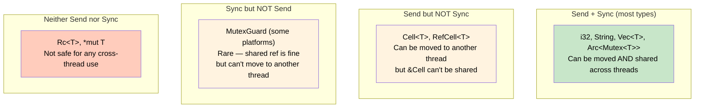
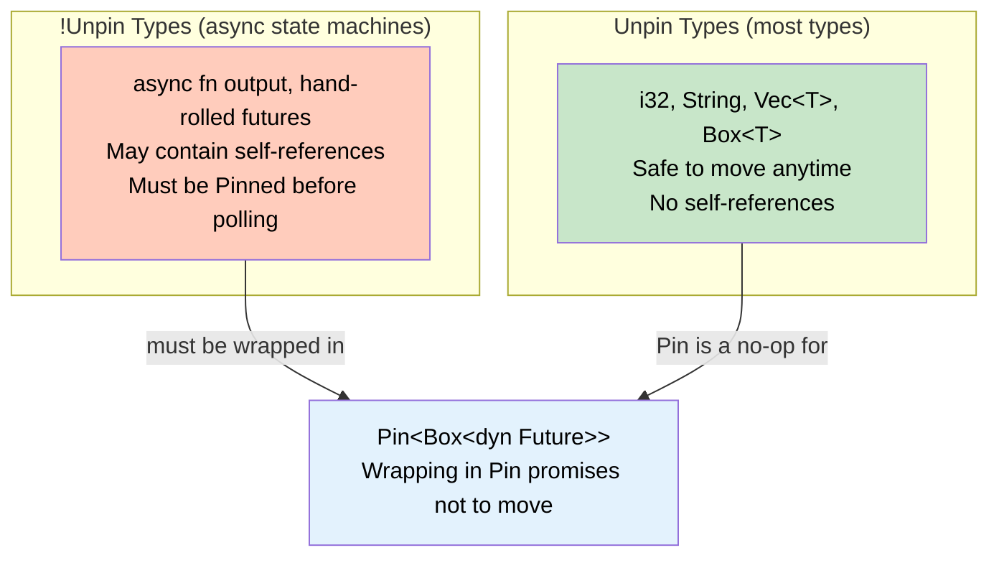

# 6. Marker Traits and Auto Traits 🔴

> **What you'll learn:**
> - What marker traits are and why traits with no methods matter
> - How `Send`, `Sync`, `Sized`, and `Unpin` govern thread safety, memory layout, and async
> - How auto traits are automatically implemented (and how to opt out)
> - **Connection to Async Rust:** why `tokio::spawn` requires `Send + 'static` and what `Unpin` means for futures

---

## Marker Traits: Contracts Without Methods

A **marker trait** has no methods. It tells the compiler (and other programmers) something about a type's *properties* rather than its *behavior*:

```rust
// From std — the actual definitions:
pub unsafe auto trait Send {}   // Safe to transfer between threads
pub unsafe auto trait Sync {}   // Safe to share references between threads
pub trait Sized {}               // Has a known size at compile time
pub auto trait Unpin {}          // Safe to move after being pinned
```

These traits are arguably the most important in Rust — they underpin the entire safety model. Yet most developers encounter them only through confusing compiler errors.

## `Send` and `Sync`: Thread Safety Through Types

### `Send`: Can Be Moved to Another Thread

A type is `Send` if a value of that type can be safely **transferred** (moved) to another thread. Almost everything in Rust is `Send`:

```rust
use std::thread;

fn main() {
    let data = vec![1, 2, 3]; // Vec<i32> is Send

    let handle = thread::spawn(move || {
        // `data` has been moved to this thread — this is safe because Vec is Send
        println!("Got {} items", data.len());
    });

    handle.join().unwrap();
}
```

**Not `Send`:**

| Type | Why | Alternative |
|------|-----|-------------|
| `Rc<T>` | Reference count is not atomic — concurrent increment/decrement causes data races | Use `Arc<T>` |
| `*const T`, `*mut T` | Raw pointers have no safety guarantees | Wrap in a `Send` type |
| `MutexGuard<T>` (some platforms) | Must be unlocked on the same thread | Restructure to drop before spawn |

### `Sync`: Can Be Shared Between Threads

A type is `Sync` if a **shared reference** (`&T`) can be safely sent to another thread. The rule:

> **`T` is `Sync` if and only if `&T` is `Send`.**

```rust
use std::sync::Arc;
use std::thread;

fn main() {
    let data = Arc::new(vec![1, 2, 3]); // Arc<Vec<i32>> is Send + Sync

    let handles: Vec<_> = (0..4)
        .map(|i| {
            let data = Arc::clone(&data); // Clone the Arc, not the Vec
            thread::spawn(move || {
                // Multiple threads reading &Vec<i32> simultaneously — safe because Sync
                println!("Thread {i}: sum = {}", data.iter().sum::<i32>());
            })
        })
        .collect();

    for h in handles {
        h.join().unwrap();
    }
}
```

**Not `Sync`:**

| Type | Why | Alternative |
|------|-----|-------------|
| `Cell<T>` | Interior mutability without synchronization | Use `Mutex<T>` or `AtomicT` |
| `RefCell<T>` | Runtime borrow checking is not thread-safe | Use `RwLock<T>` |
| `Rc<T>` | Non-atomic reference counting | Use `Arc<T>` |

### The Relationship Between `Send` and `Sync`



## Auto Traits: The Compiler Implements Them For You

`Send` and `Sync` are **auto traits** — the compiler automatically implements them for any type whose fields are all `Send`/`Sync`:

```rust
// The compiler auto-derives Send and Sync:
struct MyStruct {
    name: String,   // String is Send + Sync
    count: u64,     // u64 is Send + Sync
}
// MyStruct is automatically Send + Sync ✅

struct NotSendStruct {
    name: String,
    shared: std::rc::Rc<String>,  // Rc is NOT Send or Sync
}
// NotSendStruct is NOT Send and NOT Sync ❌
// Because one field isn't Send, the whole struct isn't
```

### Opting Out of Auto Traits

You can explicitly state that a type is *not* `Send` or `Sync` using negative implementations:

```rust
use std::marker::PhantomData;

struct MyHandle {
    ptr: *mut u8,
    // raw pointer is !Send and !Sync — so MyHandle inherits that
    // But what if we can guarantee safety? We can opt IN:
}

// SAFETY: MyHandle's pointer is only accessed from one thread at a time,
// and the resource it points to lives for the lifetime of the handle.
unsafe impl Send for MyHandle {}
unsafe impl Sync for MyHandle {}
```

The `unsafe impl` is a **contract**: you're promising the compiler that the type upholds the `Send`/`Sync` guarantees even though the compiler can't verify it automatically. Getting this wrong causes data races — undefined behavior.

## `Sized`: Known Size at Compile Time

`Sized` is a trait bound that's **implicitly added** to almost every generic parameter:

```rust
// These are equivalent:
fn print_it<T: std::fmt::Display>(item: T) { /* ... */ }
fn print_it_explicit<T: std::fmt::Display + Sized>(item: T) { /* ... */ }
```

**Unsized types** (also called dynamically sized types or DSTs):
- `str` — a string slice of unknown length
- `[T]` — a slice of unknown length
- `dyn Trait` — a trait object of unknown concrete type

You can never have a bare unsized type on the stack — you access them through references (`&str`, `&[T]`, `&dyn Trait`) or smart pointers (`Box<dyn Trait>`).

To accept unsized types, opt out with `?Sized`:

```rust
// This accepts both sized and unsized types
fn print_it<T: std::fmt::Display + ?Sized>(item: &T) {
    println!("{item}");
}

fn main() {
    print_it(&42_i32);      // T = i32 (Sized)
    print_it("hello");       // T = str (!Sized, passed as &str)
}
```

## `Unpin`: The Async Connection

`Unpin` is a marker trait that says: "This type is safe to move even after it's been pinned."

**Why this matters:** In async Rust, the compiler generates state machines from `async fn` blocks. These state machines can be **self-referential** — they contain pointers into their own fields. Moving such a struct would invalidate those pointers.

```rust
use std::pin::Pin;

// Most types are Unpin — they can be freely moved:
// i32, String, Vec<T>, HashMap<K,V> — all Unpin

// async fn state machines are NOT Unpin — they might be self-referential:
async fn example() {
    let data = vec![1, 2, 3];
    let reference = &data; // This reference points into the state machine's own memory
    tokio::time::sleep(std::time::Duration::from_secs(1)).await;
    println!("{:?}", reference); // reference must still be valid after the await
}
// The future returned by example() is !Unpin
```



### Why `tokio::spawn` Requires `Send + 'static`

This is the single most common source of confusion in async Rust. Let's break it down:

```rust
// tokio::spawn signature (simplified):
pub fn spawn<T>(future: T) -> JoinHandle<T::Output>
where
    T: Future + Send + 'static,
    T::Output: Send + 'static,
{ /* ... */ }
```

| Bound | Why |
|-------|-----|
| `Send` | The future might be polled on **any** thread in the runtime's thread pool. It must be safe to move between threads. |
| `'static` | The spawned task is detached — it has **no lifetime connection** to the caller. It could outlive the scope that created it. All captured data must be owned (not borrowed). |

```rust
use tokio::task;

async fn good() {
    let data = vec![1, 2, 3]; // Owned, Send, 'static ✅
    task::spawn(async move {
        println!("{:?}", data);
    }).await.unwrap();
}

async fn bad() {
    let data = vec![1, 2, 3];
    let reference = &data; // Borrows local — NOT 'static!

    // ❌ FAILS: `data` does not live long enough
    // task::spawn(async {
    //     println!("{:?}", reference);
    // });
}
```

```rust
use std::rc::Rc;

async fn also_bad() {
    let data = Rc::new(vec![1, 2, 3]); // Rc is NOT Send!

    // ❌ FAILS: `Rc<Vec<i32>>` cannot be sent between threads safely
    // task::spawn(async move {
    //     println!("{:?}", data);
    // });

    // ✅ FIX: use Arc instead
    let data = std::sync::Arc::new(vec![1, 2, 3]);
    task::spawn(async move {
        println!("{:?}", data); // Arc is Send ✅
    }).await.unwrap();
}
```

> **See the Async Rust companion guide** for deep coverage of `Pin`, self-referential futures, and when to use `tokio::task::spawn_local` (which doesn't require `Send`).

## Summary Table: The Four Key Marker Traits

| Trait | Question It Answers | Auto? | Opt Out? |
|-------|-------------------|-------|----------|
| `Send` | Can this value be moved to another thread? | Yes | `impl !Send` or contain a `!Send` field |
| `Sync` | Can `&self` be shared between threads? | Yes | `impl !Sync` or contain a `!Sync` field |
| `Sized` | Is the size known at compile time? | Implicit bound | `?Sized` to opt out |
| `Unpin` | Is it safe to move after pinning? | Yes | `impl !Unpin` or contain `PhantomPinned` |

---

<details>
<summary><strong>🏋️ Exercise: Diagnose Send/Sync Errors</strong> (click to expand)</summary>

The following code has three compilation errors related to `Send`, `Sync`, and `'static`. Identify each error, explain *why* it fails, and fix it.

```rust,ignore
use std::rc::Rc;
use std::cell::RefCell;

struct AppState {
    counter: RefCell<u64>,
    name: Rc<String>,
}

async fn process(state: &AppState) {
    state.counter.borrow_mut().add_assign(1);
    println!("Processing for {}", state.name);
}

#[tokio::main]
async fn main() {
    let state = AppState {
        counter: RefCell::new(0),
        name: Rc::new("MyApp".to_string()),
    };

    tokio::spawn(process(&state));

    println!("Counter: {}", state.counter.borrow());
}
```

<details>
<summary>🔑 Solution</summary>

```rust
use std::sync::{Arc, Mutex};

/// Fixed AppState: uses thread-safe types.
/// 
/// Problem 1: Rc is !Send and !Sync → replaced with Arc
/// Problem 2: RefCell is !Sync → replaced with Mutex
/// Problem 3: &state borrows local, not 'static → use Arc and clone
struct AppState {
    counter: Mutex<u64>,      // RefCell → Mutex (thread-safe interior mutability)
    name: Arc<String>,        // Rc → Arc (thread-safe reference counting)
}

async fn process(state: Arc<AppState>) {
    // Lock the mutex instead of borrowing RefCell
    let mut counter = state.counter.lock().unwrap();
    *counter += 1;
    println!("Processing for {}", state.name);
}

#[tokio::main]
async fn main() {
    let state = Arc::new(AppState {
        counter: Mutex::new(0),
        name: Arc::new("MyApp".to_string()),
    });

    // Clone the Arc — the spawned task owns its handle
    let state_clone = Arc::clone(&state);
    tokio::spawn(async move {
        process(state_clone).await;
    }).await.unwrap();

    println!("Counter: {}", state.counter.lock().unwrap());
}
```

**Errors explained:**
1. **`Rc` is `!Send`** — `Rc` uses non-atomic reference counting, which is a data race in multi-threaded contexts. Fix: use `Arc`.
2. **`RefCell` is `!Sync`** — `RefCell`'s runtime borrow checking isn't thread-safe. Fix: use `Mutex` (blocking) or `tokio::sync::Mutex` (async-aware).
3. **`&state` is not `'static`** — `tokio::spawn` requires `'static` because the task may outlive the current scope. Fix: wrap in `Arc` and clone.

</details>
</details>

---

> **Key Takeaways:**
> - **Marker traits** have no methods but encode critical type properties: thread safety (`Send`/`Sync`), size (`Sized`), and pin safety (`Unpin`).
> - **Auto traits** are derived by the compiler from a type's fields — if all fields are `Send`, the struct is `Send`.
> - `Send` = safe to *move* across threads. `Sync` = safe to *share references* across threads. `T: Sync` ⟺ `&T: Send`.
> - `tokio::spawn` requires `Send + 'static` because tasks can be polled on any thread and may outlive their creator.
> - Use `Arc` instead of `Rc`, `Mutex`/`RwLock` instead of `RefCell` when crossing thread boundaries.

> **See also:**
> - *Async Rust* companion guide, Ch 4: Pin and Unpin — deep dive into self-referential futures
> - *Async Rust* companion guide, Ch 12: Common Pitfalls — production `Send`/`Sync` debugging
> - [Ch 7: Trait Objects and Dynamic Dispatch](ch07-trait-objects-and-dynamic-dispatch.md) — `dyn Trait + Send + Sync` for thread-safe dynamic dispatch
