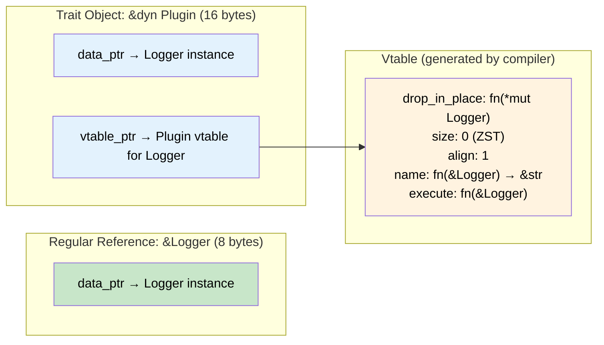
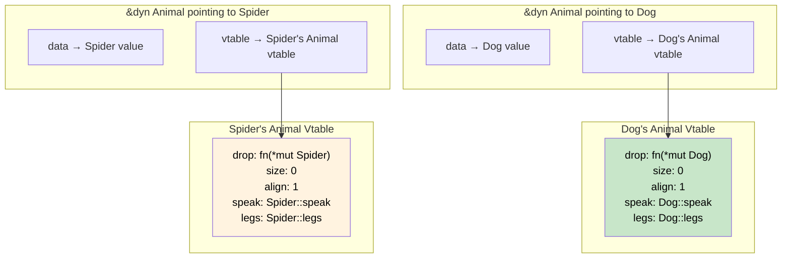

# 7. Trait Objects and Dynamic Dispatch 🟡

> **What you'll learn:**
> - How `dyn Trait` works at the memory level: fat pointers and vtables
> - Static dispatch (generics) vs. dynamic dispatch (trait objects) — performance and ergonomics trade-offs
> - Object safety rules: why some traits can't be used as `dyn Trait`
> - When to choose dynamic dispatch in production code

---

## Two Ways to Use Traits

Everything up to now has been **static dispatch** — the compiler knows the concrete type at compile time and monomorphizes. But sometimes you need to handle *different concrete types through the same interface at runtime*. That's **dynamic dispatch** via trait objects.

```rust
use std::fmt::Display;

// Static dispatch: compiler generates one function per concrete type
fn print_static(item: &impl Display) {
    println!("{item}");
}

// Dynamic dispatch: one function, runtime indirection through a vtable
fn print_dynamic(item: &dyn Display) {
    println!("{item}");
}
```

### When You Need Dynamic Dispatch

```rust
trait Plugin {
    fn name(&self) -> &str;
    fn execute(&self);
}

struct Logger;
impl Plugin for Logger {
    fn name(&self) -> &str { "logger" }
    fn execute(&self) { println!("Logging..."); }
}

struct Metrics;
impl Plugin for Metrics {
    fn name(&self) -> &str { "metrics" }
    fn execute(&self) { println!("Recording metrics..."); }
}

// You can't use generics here — the Vec needs to hold DIFFERENT concrete types:
fn run_plugins(plugins: &[Box<dyn Plugin>]) {
    for plugin in plugins {
        println!("Running: {}", plugin.name());
        plugin.execute();
    }
}

// ❌ FAILS: Vec<impl Plugin> doesn't work — all elements must be the same type
// fn run_plugins(plugins: &[impl Plugin]) { ... }

fn main() {
    let plugins: Vec<Box<dyn Plugin>> = vec![
        Box::new(Logger),
        Box::new(Metrics),
    ];
    run_plugins(&plugins);
}
```

## Fat Pointers: The Memory Layout of `dyn Trait`

A `dyn Trait` reference is a **fat pointer** — two machine words (16 bytes on 64-bit):

1. **Data pointer** — points to the actual value
2. **Vtable pointer** — points to a table of function pointers for that trait



### What's in the Vtable?

Every vtable contains:

| Entry | Purpose |
|-------|---------|
| `drop_in_place` | Destructor — how to drop the concrete type |
| `size` | Size of the concrete type |
| `align` | Alignment of the concrete type |
| Trait method 1 | Function pointer to the concrete impl |
| Trait method 2 | Function pointer to the concrete impl |
| ... | One entry per trait method |

### Vtable in Detail

```rust
trait Animal {
    fn speak(&self) -> &str;
    fn legs(&self) -> u32;
}

struct Dog;
impl Animal for Dog {
    fn speak(&self) -> &str { "Woof!" }
    fn legs(&self) -> u32 { 4 }
}

struct Spider;
impl Animal for Spider {
    fn speak(&self) -> &str { "..." }
    fn legs(&self) -> u32 { 8 }
}
```



When you call `animal.speak()` on a `&dyn Animal`, the compiler generates code like:

```rust,ignore
// Pseudocode — what the compiler actually does:
let vtable = animal.vtable_ptr;
let speak_fn = vtable.speak; // Load function pointer from vtable
(speak_fn)(animal.data_ptr)  // Call it with the data pointer
```

This is exactly what C++ does with virtual method dispatch — but Rust makes the vtable explicit in the type system (`dyn Trait`).

## Static vs. Dynamic Dispatch: Trade-offs

| Aspect | Static (`impl Trait` / generics) | Dynamic (`dyn Trait`) |
|--------|----------------------------------|-----------------------|
| **Resolution** | Compile time | Runtime |
| **Performance** | Zero-cost; inlining possible | Vtable indirection (1 pointer chase) |
| **Binary size** | One copy per type (monomorphization) | One copy shared |
| **Heterogeneous collections** | ❌ All elements must be same type | ✅ Different types behind `dyn` |
| **Return from functions** | ✅ `-> impl Trait` (one type) | ✅ `-> Box<dyn Trait>` (any type) |
| **Object safety required** | No | Yes |

### When to Use Each

```rust
// ✅ Use STATIC dispatch when:
// - You know the concrete types at compile time
// - Performance is critical (hot loops, embedded)
// - You want inlining
fn process<T: Serialize>(item: &T) { /* ... */ }

// ✅ Use DYNAMIC dispatch when:
// - You need heterogeneous collections (plugin systems, event handlers)
// - You want to reduce binary size (many concrete types)
// - You're designing a library API and want to hide implementation details
// - The indirection cost is negligible (network I/O, file I/O)
fn process(item: &dyn Serialize) { /* ... */ }
```

## Object Safety: Not All Traits Can Be `dyn`

A trait is **object-safe** (can be used as `dyn Trait`) only if:

1. **No methods return `Self`** — the compiler doesn't know the concrete type behind `dyn Trait`, so it can't determine the return size
2. **No generic method parameters** — vtable entries must have fixed signatures
3. **No `Sized` bound on `Self`** — `dyn Trait` is unsized by definition

```rust
// ✅ Object-safe
trait Draw {
    fn draw(&self);
    fn bounding_box(&self) -> (f64, f64, f64, f64);
}

// ❌ NOT object-safe: returns Self
trait Clonable {
    fn clone_self(&self) -> Self;
    // error: the trait `Clonable` cannot be made into an object
    // because method `clone_self` references the `Self` type in its return type
}

// ❌ NOT object-safe: generic method
trait Converter {
    fn convert<T>(&self) -> T;
    // The vtable can't store entries for ALL possible T
}
```

### Workarounds for Object Safety

**Problem: `Clone` returns `Self`**

```rust
// Clone is not object-safe, but you can make a clonable trait object:
trait ClonableAnimal: Animal {
    fn clone_box(&self) -> Box<dyn ClonableAnimal>;
}

// Blanket implementation for anything that is Animal + Clone
impl<T: Animal + Clone + 'static> ClonableAnimal for T {
    fn clone_box(&self) -> Box<dyn ClonableAnimal> {
        Box::new(self.clone())
    }
}
# trait Animal { fn speak(&self) -> &str; }
```

**Problem: You want `Clone` + trait object**

The standard library's approach: `dyn Any` with downcasting (seen in the capstone chapter).

## `Box<dyn Trait>` vs `&dyn Trait` vs `Arc<dyn Trait>`

| Type | Ownership | Thread-safe | Heap allocation |
|------|-----------|-------------|-----------------|
| `&dyn Trait` | Borrowed | If `Trait: Sync` | No (points to existing value) |
| `Box<dyn Trait>` | Owned, single owner | If `Trait: Send` | Yes |
| `Rc<dyn Trait>` | Shared, single-thread | No | Yes |
| `Arc<dyn Trait>` | Shared, multi-thread | If `Trait: Send + Sync` | Yes |

### Thread-Safe Trait Objects in Async

```rust
use std::sync::Arc;

trait Service: Send + Sync {
    fn handle(&self, request: &str) -> String;
}

struct EchoService;
impl Service for EchoService {
    fn handle(&self, request: &str) -> String {
        format!("Echo: {request}")
    }
}

async fn serve(service: Arc<dyn Service>) {
    // Can be shared across tokio tasks because Service: Send + Sync
    let response = service.handle("hello");
    println!("{response}");
}
```

## Dispatching on Enums vs. Trait Objects

You have two ways to model "one of many types." Here's a decision guide:

```rust
// Approach 1: Enum (closed set, static dispatch)
enum Shape {
    Circle(f64),
    Rectangle(f64, f64),
}

fn area_enum(s: &Shape) -> f64 {
    match s {
        Shape::Circle(r) => std::f64::consts::PI * r * r,
        Shape::Rectangle(w, h) => w * h,
    }
}

// Approach 2: Trait object (open set, dynamic dispatch)
trait ShapeTrait {
    fn area(&self) -> f64;
}

fn area_dyn(s: &dyn ShapeTrait) -> f64 {
    s.area()
}
```

| Factor | Enum | Trait Object |
|--------|------|-------------|
| Adding new variants/types | Requires changing all `match` arms | Just `impl Trait` — no existing code changes |
| Adding new operations | Just add a function with `match` | Requires adding method to trait (breaks all impls) |
| Performance | Pattern match, no indirection | Vtable indirection |
| Use case | Closed set of known variants | Open set, plugin-style extensibility |

This is the classic **expression problem** from programming language theory.

---

<details>
<summary><strong>🏋️ Exercise: Build a Plugin System</strong> (click to expand)</summary>

Build a simple plugin system using trait objects.

**Requirements:**
1. Define an object-safe `Plugin` trait with `name(&self) -> &str`, `on_event(&mut self, event: &str)`, and `report(&self) -> String`
2. Implement two plugins: `CounterPlugin` (counts events) and `FilterPlugin` (only counts events matching a keyword)
3. Store them in a `Vec<Box<dyn Plugin>>`
4. Write a `dispatch` function that sends an event to all plugins
5. Print each plugin's report after dispatching several events

<details>
<summary>🔑 Solution</summary>

```rust
/// An object-safe plugin trait.
trait Plugin {
    fn name(&self) -> &str;
    fn on_event(&mut self, event: &str);
    fn report(&self) -> String;
}

/// Counts all events.
struct CounterPlugin {
    count: usize,
}

impl CounterPlugin {
    fn new() -> Self {
        CounterPlugin { count: 0 }
    }
}

impl Plugin for CounterPlugin {
    fn name(&self) -> &str {
        "counter"
    }

    fn on_event(&mut self, _event: &str) {
        self.count += 1;
    }

    fn report(&self) -> String {
        format!("Counted {} total events", self.count)
    }
}

/// Counts only events containing a keyword.
struct FilterPlugin {
    keyword: String,
    matches: usize,
}

impl FilterPlugin {
    fn new(keyword: &str) -> Self {
        FilterPlugin {
            keyword: keyword.to_string(),
            matches: 0,
        }
    }
}

impl Plugin for FilterPlugin {
    fn name(&self) -> &str {
        "filter"
    }

    fn on_event(&mut self, event: &str) {
        if event.contains(&self.keyword) {
            self.matches += 1;
        }
    }

    fn report(&self) -> String {
        format!("Matched '{}' in {} events", self.keyword, self.matches)
    }
}

/// Dispatch an event to all plugins (dynamic dispatch).
fn dispatch(plugins: &mut [Box<dyn Plugin>], event: &str) {
    for plugin in plugins.iter_mut() {
        plugin.on_event(event);
    }
}

fn main() {
    let mut plugins: Vec<Box<dyn Plugin>> = vec![
        Box::new(CounterPlugin::new()),
        Box::new(FilterPlugin::new("error")),
        Box::new(FilterPlugin::new("warn")),
    ];

    let events = [
        "info: server started",
        "error: connection refused",
        "warn: disk space low",
        "error: timeout",
        "info: request processed",
    ];

    for event in &events {
        dispatch(&mut plugins, event);
    }

    println!("\n--- Plugin Reports ---");
    for plugin in &plugins {
        println!("[{}] {}", plugin.name(), plugin.report());
    }
    // Output:
    // [counter] Counted 5 total events
    // [filter] Matched 'error' in 2 events
    // [filter] Matched 'warn' in 1 events
}
```

</details>
</details>

---

> **Key Takeaways:**
> - `dyn Trait` creates a **trait object**: a fat pointer with a data pointer + vtable pointer (16 bytes on 64-bit).
> - The vtable holds function pointers for each trait method, plus `drop`, `size`, and `align`.
> - **Object safety** requires: no `Self` in return types, no generic methods, no `Self: Sized`.
> - Use **static dispatch** for performance-critical paths; use **dynamic dispatch** for plugin systems, heterogeneous collections, and large APIs where binary size matters.
> - The enum-vs-trait-object choice is the **expression problem**: closed set + easy new operations (enum) vs. open set + easy new types (trait object).

> **See also:**
> - [Ch 2: Generics and Monomorphization](ch02-generics-and-monomorphization.md) — the static dispatch counterpart
> - [Ch 8: Closures and the Fn Traits](ch08-closures-and-the-fn-traits.md) — closures as trait objects (`Box<dyn Fn()>`)
> - [Ch 11: Capstone](ch11-capstone-event-bus.md) — combining trait objects with `Any` for type-erased dispatch
> - *Rust Memory Management* companion guide — fat pointers and heap layout of `Box<dyn Trait>`
