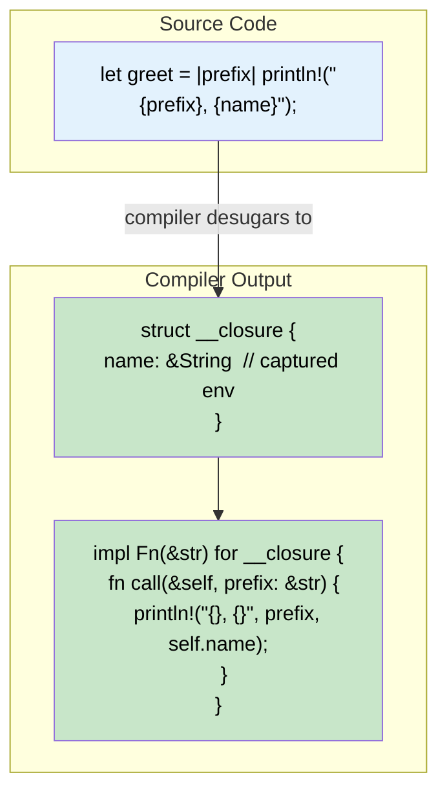
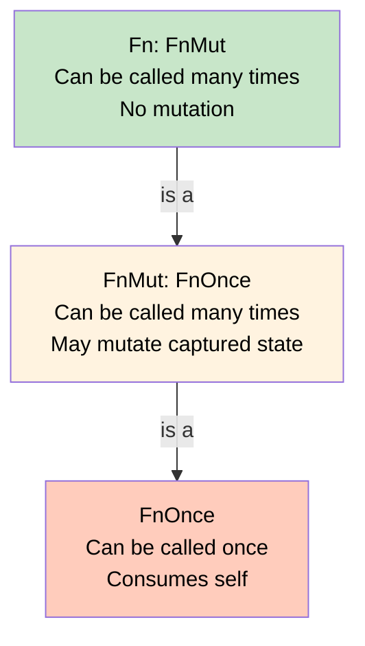

# 8. Closures and the `Fn` Traits 🔴

> **What you'll learn:**
> - What closures really are: compiler-generated anonymous structs that implement `Fn` traits
> - The three closure traits — `Fn`, `FnMut`, `FnOnce` — and how the compiler chooses which to implement
> - How closures capture their environment (by reference, mutable reference, or value)
> - **Connection to Async Rust:** async closures, returning futures from closures, and the `Fn` + `Send` pattern

---

## Closures Are Not Magic — They're Structs

In most languages, closures are "just functions that capture variables." In Rust, closures are **anonymous structs** that the compiler generates, with trait implementations for calling them.

### What You Write

```rust
fn main() {
    let name = String::from("Rust");
    let greet = |prefix: &str| {
        println!("{prefix}, {name}!");
    };
    greet("Hello");
    greet("Hi");
}
```

### What the Compiler Generates (Approximately)

```rust
// The compiler creates an anonymous struct to hold captured variables:
struct __closure_greet<'a> {
    name: &'a String, // Captured by reference (immutable borrow)
}

// And implements the Fn trait for it:
impl<'a> Fn<(&str,)> for __closure_greet<'a> {
    fn call(&self, (prefix,): (&str,)) {
        println!("{}, {}!", prefix, self.name);
    }
}

fn main() {
    let name = String::from("Rust");
    let greet = __closure_greet { name: &name };
    Fn::call(&greet, ("Hello",));
    Fn::call(&greet, ("Hi",));
}
```



## The Three `Fn` Traits

| Trait | Signature | Captures | Can Call | Use When |
|-------|-----------|----------|----------|----------|
| `Fn` | `fn call(&self, args) -> R` | By shared ref `&T` | Many times | Read-only access to environment |
| `FnMut` | `fn call_mut(&mut self, args) -> R` | By mutable ref `&mut T` | Many times | Needs to mutate captured state |
| `FnOnce` | `fn call_once(self, args) -> R` | By value (moves) | **Once** | Consumes captured values |

They form a hierarchy:



**Every `Fn` is also `FnMut` is also `FnOnce`.** If a function accepts `FnOnce`, you can pass any closure. If it accepts `Fn`, only non-mutating closures work.

### Examples of Each

```rust
fn main() {
    let name = String::from("Rust");

    // Fn: captures `name` by shared reference
    let greet = || println!("Hello, {name}!");
    greet();
    greet(); // Can call multiple times
    // `name` is still usable here

    // FnMut: captures `count` by mutable reference
    let mut count = 0;
    let mut increment = || {
        count += 1;
        println!("Count: {count}");
    };
    increment();
    increment();

    // FnOnce: captures `data` by value (moves it into the closure)
    let data = vec![1, 2, 3];
    let consume = move || {
        let sum: i32 = data.into_iter().sum(); // Consumes data
        println!("Sum: {sum}");
    };
    consume();
    // consume(); // ❌ FAILS: can't call FnOnce closure twice
    // println!("{:?}", data); // ❌ FAILS: data was moved into the closure
}
```

### The `move` Keyword

`move` forces the closure to take **ownership** of captured variables, regardless of whether it needs to:

```rust
fn main() {
    let name = String::from("Rust");

    // Without move: borrows `name`
    let greet = || println!("{name}");
    greet();
    println!("Name still here: {name}"); // ✅ still accessible

    // With move: takes ownership of `name`
    let name2 = String::from("Rust");
    let greet_owned = move || println!("{name2}");
    greet_owned();
    // println!("{name2}"); // ❌ FAILS: value moved into closure
}
```

**Key insight:** `move` doesn't change which `Fn` trait is implemented — it changes *how* the variables are captured. A `move` closure that only reads the captured data still implements `Fn`.

```rust
fn main() {
    let name = String::from("Rust");

    // This is a MOVE closure that implements Fn (not FnOnce!)
    // because it only reads `name`, even though it owns it
    let greet = move || println!("{name}");
    greet(); // ✅ Can call multiple times — it's Fn
    greet();
}
```

## How the Compiler Chooses the Trait

The compiler looks at what the closure **does with** captured variables:

| What the closure does | Trait implemented | Capture mode |
|----------------------|-------------------|--------------|
| Only reads captured values | `Fn` + `FnMut` + `FnOnce` | `&T` |
| Mutates captured values | `FnMut` + `FnOnce` | `&mut T` |
| Moves/consumes captured values | `FnOnce` only | `T` |

```rust
fn apply_fn(f: &dyn Fn()) { f(); }
fn apply_fn_mut(f: &mut dyn FnMut()) { f(); }
fn apply_fn_once(f: impl FnOnce()) { f(); }

fn main() {
    let x = 42;

    let read_only = || println!("{x}");
    apply_fn(&read_only);       // ✅ Fn
    apply_fn_mut(&mut || println!("{x}")); // ✅ Fn implies FnMut
    apply_fn_once(|| println!("{x}"));     // ✅ Fn implies FnOnce

    let mut count = 0;
    let mut mutating = || count += 1;
    // apply_fn(&mutating);  // ❌ FAILS: FnMut is not Fn
    apply_fn_mut(&mut mutating); // ✅ FnMut
    apply_fn_once(|| { let _ = count + 1; }); // ✅ FnMut implies FnOnce

    let data = vec![1, 2, 3];
    let consuming = move || {
        drop(data); // Consumes data — this is FnOnce
    };
    // apply_fn(&consuming);         // ❌ FAILS
    // apply_fn_mut(&mut consuming); // ❌ FAILS
    apply_fn_once(consuming);         // ✅ FnOnce
}
```

## Closures as Function Parameters

### Static Dispatch (Generic — Most Common)

```rust
fn apply<F: Fn(i32) -> i32>(f: F, value: i32) -> i32 {
    f(value)
}

fn main() {
    let double = |x| x * 2;
    let result = apply(double, 21);
    assert_eq!(result, 42);
}
```

### Dynamic Dispatch (Trait Object)

```rust
fn apply(f: &dyn Fn(i32) -> i32, value: i32) -> i32 {
    f(value)
}

// Useful for storing closures in collections:
fn main() {
    let transforms: Vec<Box<dyn Fn(i32) -> i32>> = vec![
        Box::new(|x| x + 1),
        Box::new(|x| x * 2),
        Box::new(|x| x * x),
    ];

    let value = 3;
    for transform in &transforms {
        println!("{} → {}", value, transform(value));
    }
}
```

## Returning Closures

Closures have anonymous types — you can't name them. Use `impl Fn` or `Box<dyn Fn>`:

```rust
// Static dispatch: returns one specific closure type
fn make_adder(n: i32) -> impl Fn(i32) -> i32 {
    move |x| x + n
}

// Dynamic dispatch: can return different closures
fn make_transform(kind: &str) -> Box<dyn Fn(i32) -> i32> {
    match kind {
        "double" => Box::new(|x| x * 2),
        "square" => Box::new(|x| x * x),
        _ => Box::new(|x| x),
    }
}

fn main() {
    let add5 = make_adder(5);
    assert_eq!(add5(10), 15);

    let transform = make_transform("square");
    assert_eq!(transform(7), 49);
}
```

## Async Closures and Futures

This is where closures intersect with async Rust.

### The Problem: Returning Futures from Closures

```rust
use std::future::Future;

// You want a closure that returns a Future:
fn spawn_task<F, Fut>(f: F)
where
    F: Fn() -> Fut + Send + 'static,
    Fut: Future<Output = ()> + Send + 'static,
{
    tokio::spawn(async move {
        f().await;
    });
}

// This works:
async fn my_handler() {
    println!("Handling!");
}

// spawn_task(my_handler); // ✅ async fn is Fn() -> impl Future
```

### Async Closures (Rust 1.85+)

Rust now supports `async` closures natively:

```rust
#![feature(async_closure)]

// Before: had to use a regular closure returning an async block
let handler = || async { println!("Hello from async!"); };

// After: async closure syntax
let handler = async || { println!("Hello from async!"); };
```

### The `Fn` + `Send` + `'static` Pattern in Async

In production async code, you'll see this pattern constantly:

```rust
use std::future::Future;
use std::pin::Pin;

/// A type alias for a boxed, sendable future — common in async frameworks.
type BoxFuture<T> = Pin<Box<dyn Future<Output = T> + Send>>;

/// A handler function that is callable, sendable, and not borrowed.
trait Handler: Send + Sync + 'static {
    fn call(&self, input: String) -> BoxFuture<String>;
}

// Implement Handler for any Fn that returns a Send future
impl<F, Fut> Handler for F
where
    F: Fn(String) -> Fut + Send + Sync + 'static,
    Fut: Future<Output = String> + Send + 'static,
{
    fn call(&self, input: String) -> BoxFuture<String> {
        Box::pin((self)(input))
    }
}
```

This pattern is used in web frameworks like Axum, Actix, and Warp — it's how they accept both `async fn` and closures as route handlers.

> **See the Async Rust companion guide**, Ch 10: Async Traits, for the full story on returning futures from trait methods and the RPITIT (Return Position Impl Trait in Traits) feature.

---

<details>
<summary><strong>🏋️ Exercise: Build a Middleware Chain</strong> (click to expand)</summary>

Build a synchronous middleware chain where each middleware transforms an input string.

**Requirements:**
1. Define a type `Middleware = Box<dyn Fn(String) -> String>`
2. Write a `Chain` struct that holds `Vec<Middleware>`
3. Implement `Chain::add` that accepts any `Fn(String) -> String + 'static`
4. Implement `Chain::execute` that runs all middlewares in sequence, passing each output as the next input
5. Test with: trimming, uppercasing, and adding a prefix

<details>
<summary>🔑 Solution</summary>

```rust
/// A middleware transforms a String into another String.
type Middleware = Box<dyn Fn(String) -> String>;

/// A chain of middlewares executed in sequence.
struct Chain {
    middlewares: Vec<Middleware>,
}

impl Chain {
    fn new() -> Self {
        Chain {
            middlewares: Vec::new(),
        }
    }

    /// Add a middleware to the chain.
    /// Accepts any closure that is Fn(String) -> String + 'static.
    fn add<F>(&mut self, f: F)
    where
        F: Fn(String) -> String + 'static,
    {
        self.middlewares.push(Box::new(f));
    }

    /// Execute all middlewares in sequence.
    fn execute(&self, input: String) -> String {
        self.middlewares
            .iter()
            .fold(input, |acc, middleware| middleware(acc))
    }
}

fn main() {
    let mut chain = Chain::new();

    // Middleware 1: trim whitespace
    chain.add(|s| s.trim().to_string());

    // Middleware 2: uppercase
    chain.add(|s| s.to_uppercase());

    // Middleware 3: add prefix
    let prefix = String::from("[LOG]");
    chain.add(move |s| format!("{prefix} {s}"));

    let result = chain.execute("  hello, world!  ".to_string());
    assert_eq!(result, "[LOG] HELLO, WORLD!");
    println!("{result}");

    // Run again — all closures are Fn, so they can be reused
    let result2 = chain.execute("  another message  ".to_string());
    assert_eq!(result2, "[LOG] ANOTHER MESSAGE");
    println!("{result2}");
}
```

</details>
</details>

---

> **Key Takeaways:**
> - Closures are **anonymous structs** with auto-generated `Fn`, `FnMut`, or `FnOnce` implementations — the compiler decides based on how captured variables are used.
> - `Fn` ⊂ `FnMut` ⊂ `FnOnce` — accept the **most permissive** trait your API needs (`FnOnce` for callbacks, `Fn` for reusable operations).
> - `move` changes *capture mode* (by value), not which trait is implemented — a `move` closure that only reads data still implements `Fn`.
> - In async Rust, the `Fn() -> impl Future + Send + 'static` pattern is the foundation of handler/route systems in web frameworks.
> - Use `Box<dyn Fn(...)>` for heterogeneous closure collections or when returning different closures from a function.

> **See also:**
> - [Ch 7: Trait Objects and Dynamic Dispatch](ch07-trait-objects-and-dynamic-dispatch.md) — closures as trait objects
> - [Ch 9: The Extension Trait Pattern](ch09-the-extension-trait-pattern.md) — extension traits often accept closure parameters
> - *Async Rust* companion guide, Ch 10: Async Traits — returning futures from trait methods
> - *Async Rust* companion guide, Ch 8: Tokio Deep Dive — `tokio::spawn` requirements for closures
