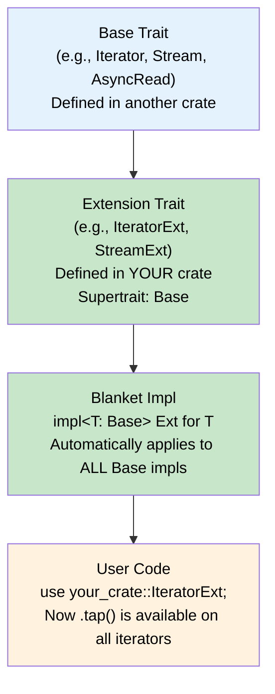

# 9. The Extension Trait Pattern 🔴

> **What you'll learn:**
> - How to add methods to types you don't own using extension traits
> - How `StreamExt`, `AsyncReadExt`, and `IteratorExt` work under the hood
> - Blanket implementations: `impl<T: Trait> ExtTrait for T`
> - Design guidelines: when to use extension traits in your own libraries

---

## The Problem: You Want to Add Methods to Someone Else's Type

You're using a library trait like `Iterator` or `Stream`. You want to add a convenience method — say `.tap()` that logs each element — but you can't modify the trait definition. The Orphan Rule prevents you from adding methods directly.

**Extension traits** solve this:

```rust
/// Extension trait that adds a `.tap()` method to all iterators.
trait IteratorExt: Iterator {
    /// Call a function on each element without consuming it.
    fn tap<F>(self, f: F) -> Tap<Self, F>
    where
        Self: Sized,
        F: FnMut(&Self::Item);
}

/// Blanket implementation: this applies to ALL types that implement Iterator.
impl<I: Iterator> IteratorExt for I {
    fn tap<F>(self, f: F) -> Tap<Self, F>
    where
        F: FnMut(&Self::Item),
    {
        Tap { iter: self, f }
    }
}
```

Now any `Iterator` has `.tap()` — just by importing `IteratorExt`:

```rust
# trait IteratorExt: Iterator { fn tap<F>(self, f: F) -> Tap<Self, F> where Self: Sized, F: FnMut(&Self::Item); }
# impl<I: Iterator> IteratorExt for I { fn tap<F>(self, f: F) -> Tap<Self, F> where F: FnMut(&Self::Item) { Tap { iter: self, f } } }
# struct Tap<I, F> { iter: I, f: F }
# impl<I: Iterator, F: FnMut(&I::Item)> Iterator for Tap<I, F> { type Item = I::Item; fn next(&mut self) -> Option<Self::Item> { let item = self.iter.next()?; (self.f)(&item); Some(item) } }
use std::collections::HashMap;

fn main() {
    let sum: i32 = (1..=5)
        .tap(|x| print!("{x} "))
        .filter(|x| x % 2 == 0)
        .tap(|x| print!("(even: {x}) "))
        .sum();

    println!("\nSum of evens: {sum}");
    // Output: 1 2 (even: 2) 3 4 (even: 4) 5
    // Sum of evens: 6
}
```

## Anatomy of the Pattern



The three ingredients:

1. **Extension trait** — a new trait with a supertrait bound on the base trait
2. **Blanket implementation** — `impl<T: BaseTrait> ExtensionTrait for T`
3. **Import requirement** — users must `use ExtensionTrait` to see the new methods

## Real-World Examples from the Ecosystem

### `futures::StreamExt`

The `Stream` trait has only one method: `poll_next`. All the combinators — `.map()`, `.filter()`, `.for_each()`, `.buffer_unordered()` — live on `StreamExt`:

```rust,ignore
// From the futures crate (simplified):
pub trait StreamExt: Stream {
    fn next(&mut self) -> Next<'_, Self>
    where
        Self: Unpin,
    {
        Next::new(self)
    }

    fn map<T, F>(self, f: F) -> Map<Self, F>
    where
        F: FnMut(Self::Item) -> T,
        Self: Sized,
    {
        Map::new(self, f)
    }

    fn filter<F>(self, f: F) -> Filter<Self, F>
    where
        F: FnMut(&Self::Item) -> bool,
        Self: Sized,
    {
        Filter::new(self, f)
    }

    // ... dozens more combinators
}

// Blanket impl — every Stream gets these methods for free
impl<T: Stream + ?Sized> StreamExt for T {}
```

### `tokio::io::AsyncReadExt`

```rust,ignore
// From tokio (simplified):
pub trait AsyncReadExt: AsyncRead {
    fn read(&mut self, buf: &mut [u8]) -> Read<'_, Self>
    where
        Self: Unpin,
    {
        Read::new(self, buf)
    }

    fn read_to_end(&mut self, buf: &mut Vec<u8>) -> ReadToEnd<'_, Self>
    where
        Self: Unpin,
    {
        ReadToEnd::new(self, buf)
    }

    fn read_to_string(&mut self, buf: &mut String) -> ReadToString<'_, Self>
    where
        Self: Unpin,
    {
        ReadToString::new(self, buf)
    }
}

impl<R: AsyncRead + ?Sized> AsyncReadExt for R {}
```

> **Connection to Async Rust:** The entire async ecosystem's ergonomics are built on extension traits. The base traits (`Future`, `Stream`, `AsyncRead`, `AsyncWrite`) define the *minimal contract*. Extension traits layer on the *convenience API*. This separation is deliberate — it keeps the base traits small and implementable, while making users' lives comfortable.

### Standard Library: `Iterator` itself

Even `Iterator` uses this pattern internally — methods like `.map()`, `.filter()`, `.collect()` are **provided methods** on the trait, which is conceptually the same as an extension trait that's always in scope.

## Building Your Own Extension Trait

Let's build a practical example: adding `.log_err()` to any `Result`:

```rust
use std::fmt::Debug;

/// Extension trait for Result that adds logging convenience methods.
trait ResultExt<T, E> {
    /// Log the error (if any) and return the Result unchanged.
    fn log_err(self, context: &str) -> Self;
}

impl<T, E: Debug> ResultExt<T, E> for Result<T, E> {
    fn log_err(self, context: &str) -> Self {
        if let Err(ref e) = self {
            eprintln!("[ERROR] {context}: {e:?}");
        }
        self
    }
}

fn parse_config(input: &str) -> Result<u64, std::num::ParseIntError> {
    input.parse()
}

fn main() {
    // Now every Result<T, E: Debug> has .log_err()!
    let value = parse_config("42").log_err("parsing config");
    assert_eq!(value.unwrap(), 42);

    let value = parse_config("not_a_number").log_err("parsing config");
    // Prints: [ERROR] parsing config: ParseIntError { kind: InvalidDigit }
    assert!(value.is_err());
}
```

## Design Guidelines

### When to Use Extension Traits

| Scenario | Use Extension Trait? |
|----------|---------------------|
| Adding convenience methods to a foreign trait | ✅ Yes — this is the primary use case |
| Adding domain-specific methods (`.as_json()`, `.validate()`) | ✅ Yes |
| Providing a "prelude" of useful methods | ✅ Yes — `use mylib::prelude::*` |
| Core functionality that all implementors need | ❌ No — put it on the base trait |
| Methods that need access to private fields | ❌ No — extension traits can only use the base trait's API |

### Naming Conventions

| Base Trait | Extension Trait | Crate |
|-----------|----------------|-------|
| `Stream` | `StreamExt` | futures |
| `AsyncRead` | `AsyncReadExt` | tokio |
| `Iterator` | `Itertools` | itertools |
| `Future` | `FutureExt` | futures |

The convention is `{BaseTrait}Ext`, and the extension trait should be re-exported from a prelude module.

### The `?Sized` Decision

Include `?Sized` in your blanket impl if the extension methods should work on trait objects:

```rust
# trait MyTrait {}
trait MyTraitExt: MyTrait {
    fn convenience(&self);
}

// With ?Sized: works on &dyn MyTrait too
impl<T: MyTrait + ?Sized> MyTraitExt for T {
    fn convenience(&self) {
        // ...
    }
}
```

Without `?Sized`, the methods won't be available on `dyn MyTrait`.

---

<details>
<summary><strong>🏋️ Exercise: Build a SliceExt Trait</strong> (click to expand)</summary>

Build an extension trait for slices that adds convenience methods.

**Requirements:**
1. Define `SliceExt<T>` as an extension trait for `[T]` (not `Vec<T>` — raw slices)
2. Add `.frequencies(&self) -> HashMap<&T, usize>` where `T: Hash + Eq` — counts occurrences
3. Add `.chunks_exact_or_err(&self, size: usize) -> Result<&[&[T]], String>` that returns an error if the slice length isn't a multiple of `size`
4. Add `.is_sorted(&self) -> bool` where `T: Ord`
5. All methods should work on any `&[T]` — vectors, arrays, or slices

<details>
<summary>🔑 Solution</summary>

```rust
use std::collections::HashMap;
use std::hash::Hash;

/// Extension methods for slices.
trait SliceExt<T> {
    /// Count the frequency of each element.
    fn frequencies(&self) -> HashMap<&T, usize>
    where
        T: Hash + Eq;

    /// Check if the slice is sorted in ascending order.
    fn is_sorted_asc(&self) -> bool
    where
        T: Ord;

    /// Return chunks of exact size, or an error if the length isn't divisible.
    fn chunks_exact_or_err(&self, size: usize) -> Result<Vec<&[T]>, String>;
}

impl<T> SliceExt<T> for [T] {
    fn frequencies(&self) -> HashMap<&T, usize>
    where
        T: Hash + Eq,
    {
        let mut map = HashMap::new();
        for item in self {
            *map.entry(item).or_insert(0) += 1;
        }
        map
    }

    fn is_sorted_asc(&self) -> bool
    where
        T: Ord,
    {
        self.windows(2).all(|w| w[0] <= w[1])
    }

    fn chunks_exact_or_err(&self, size: usize) -> Result<Vec<&[T]>, String> {
        if size == 0 {
            return Err("chunk size must be > 0".into());
        }
        if self.len() % size != 0 {
            return Err(format!(
                "slice length {} is not divisible by chunk size {}",
                self.len(),
                size
            ));
        }
        Ok(self.chunks(size).collect())
    }
}

fn main() {
    // Works on Vec
    let data = vec![1, 2, 3, 2, 1, 1];
    let freq = data.frequencies();
    println!("Frequencies: {:?}", freq);
    assert_eq!(freq[&1], 3);
    assert_eq!(freq[&2], 2);

    // Works on arrays
    let sorted = [1, 2, 3, 4, 5];
    assert!(sorted.is_sorted_asc());

    let unsorted = [1, 3, 2];
    assert!(!unsorted.is_sorted_asc());

    // Works on slices
    let data = vec![1, 2, 3, 4, 5, 6];
    let chunks = data.chunks_exact_or_err(3).unwrap();
    assert_eq!(chunks, vec![&[1, 2, 3][..], &[4, 5, 6][..]]);

    let bad = data.chunks_exact_or_err(4);
    assert!(bad.is_err());
    println!("Error: {}", bad.unwrap_err());
}
```

</details>
</details>

---

> **Key Takeaways:**
> - The **extension trait pattern** adds methods to types you don't own: define a new trait with a supertrait bound, then blanket-implement it.
> - This is the backbone of the async ecosystem: `StreamExt`, `AsyncReadExt`, `FutureExt` all add ergonomic methods to minimal base traits.
> - Blanket implementations (`impl<T: BaseT> Ext for T`) make the extension available to all existing and future implementors automatically.
> - Use `?Sized` in blanket impls to support trait objects. Follow the `{Base}Ext` naming convention.

> **See also:**
> - [Ch 4: Defining and Implementing Traits](ch04-defining-and-implementing-traits.md) — the Orphan Rule that motivates extension traits
> - [Ch 5: Associated Types vs. Generic Parameters](ch05-associated-types-vs-generic-parameters.md) — extension traits often use associated types from the base trait
> - *Async Rust* companion guide, Ch 11: Streams and AsyncIterator — `StreamExt` in action
> - [Ch 11: Capstone](ch11-capstone-event-bus.md) — uses extension traits to add `.dispatch()` to a context object
