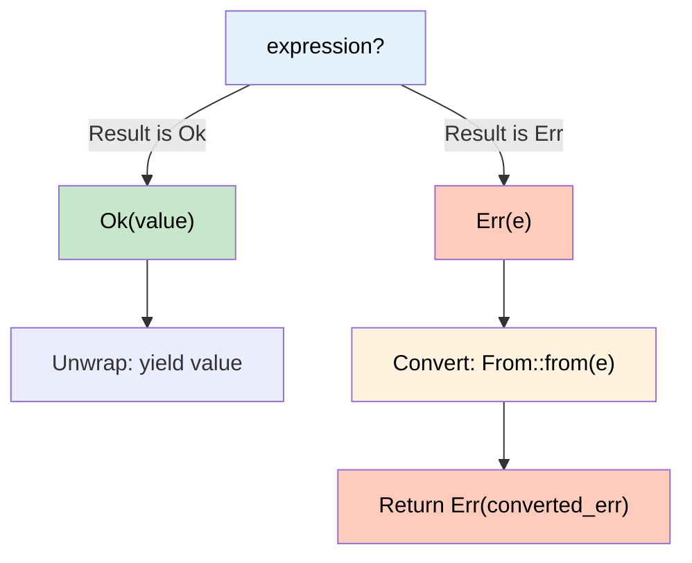

# 10. Error Handling and Conversions 🟡

> **What you'll learn:**
> - How `From`, `Into`, `TryFrom`, and `TryInto` power Rust's conversion ecosystem
> - How the `?` operator desugars to `From::from()` for seamless error propagation
> - The design philosophy behind `thiserror` (libraries) vs. `anyhow` (applications)
> - Production patterns for error hierarchies in large codebases

---

## The Conversion Traits

Rust doesn't do implicit type coercion (with rare exceptions like `Deref` coercion). Instead, conversions are **explicit, type-checked, and trait-based**.

### `From` and `Into`

```rust
trait From<T> {
    fn from(value: T) -> Self;
}

// Into is automatically derived from From — you almost never implement it directly
trait Into<T> {
    fn into(self) -> T;
}
```

The compiler provides a **blanket implementation**: if you implement `From<T> for U`, you get `Into<U> for T` for free.

```rust
struct Celsius(f64);
struct Fahrenheit(f64);

impl From<Celsius> for Fahrenheit {
    fn from(c: Celsius) -> Self {
        Fahrenheit(c.0 * 9.0 / 5.0 + 32.0)
    }
}

fn main() {
    let boiling = Celsius(100.0);

    // Using From explicitly:
    let f = Fahrenheit::from(boiling);
    println!("{}°F", f.0);

    // Using Into (provided for free):
    let boiling2 = Celsius(100.0);
    let f2: Fahrenheit = boiling2.into();
    println!("{}°F", f2.0);
}
```

### `TryFrom` and `TryInto` — Fallible Conversions

When conversion can fail:

```rust
use std::num::TryFromIntError;

struct PortNumber(u16);

impl TryFrom<u32> for PortNumber {
    type Error = String;

    fn try_from(value: u32) -> Result<Self, Self::Error> {
        if value <= 65535 {
            Ok(PortNumber(value as u16))
        } else {
            Err(format!("{value} is not a valid port number (max 65535)"))
        }
    }
}

fn main() {
    let port: Result<PortNumber, _> = 8080_u32.try_into();
    assert!(port.is_ok());

    let bad_port: Result<PortNumber, _> = 100_000_u32.try_into();
    assert!(bad_port.is_err());
    println!("Error: {}", bad_port.unwrap_err());
}
```

## The `?` Operator: Desugaring

The `?` operator is the most important ergonomic feature for error handling. Here's what it actually does:

### What You Write

```rust
use std::fs;
use std::io;

fn read_username() -> Result<String, io::Error> {
    let contents = fs::read_to_string("username.txt")?;
    Ok(contents.trim().to_string())
}
```

### What the Compiler Generates

```rust
use std::fs;
use std::io;

fn read_username() -> Result<String, io::Error> {
    let contents = match fs::read_to_string("username.txt") {
        Ok(val) => val,
        Err(e) => return Err(From::from(e)),
        //                    ^^^^^^^^^^^ This is the key!
    };
    Ok(contents.trim().to_string())
}
```



The critical insight: **`?` calls `From::from()` on the error**. This means you can use `?` across different error types as long as `From` conversions exist.

## Building Error Hierarchies with `From`

```rust
use std::io;
use std::num::ParseIntError;
use std::fmt;

// Application-level error that unifies multiple error sources
#[derive(Debug)]
enum AppError {
    Io(io::Error),
    Parse(ParseIntError),
    Custom(String),
}

impl fmt::Display for AppError {
    fn fmt(&self, f: &mut fmt::Formatter) -> fmt::Result {
        match self {
            AppError::Io(e) => write!(f, "I/O error: {e}"),
            AppError::Parse(e) => write!(f, "Parse error: {e}"),
            AppError::Custom(msg) => write!(f, "{msg}"),
        }
    }
}

// These From impls enable the ? operator to auto-convert:
impl From<io::Error> for AppError {
    fn from(e: io::Error) -> Self {
        AppError::Io(e)
    }
}

impl From<ParseIntError> for AppError {
    fn from(e: ParseIntError) -> Self {
        AppError::Parse(e)
    }
}

// Now ? works seamlessly across error types:
fn load_config() -> Result<u64, AppError> {
    let contents = std::fs::read_to_string("config.txt")?; // io::Error → AppError
    let port = contents.trim().parse::<u64>()?;              // ParseIntError → AppError
    Ok(port)
}
```

## `thiserror` vs. `anyhow`: The Two Schools

### `thiserror` — For Libraries

`thiserror` is a derive macro that generates `Display`, `Error`, and `From` implementations from annotations:

```rust,ignore
use thiserror::Error;

#[derive(Debug, Error)]
enum DatabaseError {
    #[error("connection failed: {0}")]
    Connection(#[from] std::io::Error),

    #[error("query failed: {query}")]
    Query { query: String, source: sqlx::Error },

    #[error("record not found: {0}")]
    NotFound(String),
}
```

What `thiserror` generates under the hood:

```rust,ignore
// These are approximately what #[derive(Error)] + annotations produce:
impl fmt::Display for DatabaseError { /* per-variant formatting */ }
impl std::error::Error for DatabaseError { /* source() returns inner error */ }
impl From<std::io::Error> for DatabaseError { /* wraps in Connection variant */ }
```

**Use `thiserror` for libraries** — callers get structured, matchable error types they can handle programmatically.

### `anyhow` — For Applications

`anyhow` provides a single, opaque error type that wraps any `std::error::Error`:

```rust,ignore
use anyhow::{Context, Result};

fn load_config(path: &str) -> Result<Config> {
    let contents = std::fs::read_to_string(path)
        .with_context(|| format!("failed to read config from {path}"))?;

    let config: Config = toml::from_str(&contents)
        .context("failed to parse config TOML")?;

    Ok(config)
}
```

**Use `anyhow` for applications** — you don't need callers to match on specific error variants, just propagate and display them.

### Decision Matrix

| Factor | `thiserror` | `anyhow` |
|--------|-----------|---------|
| **Use in** | Libraries | Applications |
| **Error type** | Custom enum/struct | Opaque `anyhow::Error` |
| **Callers can match** | ✅ Yes — `match err {}` | ❌ No (without downcasting) |
| **Context/backtrace** | Manual | Built-in `.context()` |
| **Boilerplate** | Low (derive macro) | Zero |
| **Type safety** | High — errors are part of API | Low — all errors are one type |

### Under the Hood: `anyhow::Error`

```rust,ignore
// Simplified — anyhow::Error is essentially:
struct Error {
    inner: Box<dyn std::error::Error + Send + Sync + 'static>,
    context: Vec<String>,
    backtrace: Option<Backtrace>,
}
```

It uses `dyn Error` (trait object!) — exactly the dynamic dispatch from Ch 7. The `Send + Sync + 'static` bounds make it safe for async and multi-threaded code.

## The `std::error::Error` Trait

The `Error` trait is the standard interface for errors:

```rust,ignore
pub trait Error: Display + Debug {
    fn source(&self) -> Option<&(dyn Error + 'static)> {
        None // Default: no underlying cause
    }
}
```

This creates an **error chain** — each error can point to its source, enabling messages like:

```text
failed to load config
  caused by: failed to read file "config.toml"
    caused by: No such file or directory (os error 2)
```

## Pattern: Accepting Broad Types with `Into`

Use `Into` bounds to make APIs flexible:

```rust
#[derive(Debug)]
struct AppError(String);

impl<T: std::fmt::Display> From<T> for AppError {
    fn from(e: T) -> Self {
        AppError(e.to_string())
    }
}

// Accept anything that can become a String
fn log_message(msg: impl Into<String>) {
    let s: String = msg.into();
    println!("[LOG] {s}");
}

fn main() {
    log_message("static str");              // &str → String
    log_message(String::from("owned"));     // String → String (no-op)
    log_message(format!("formatted {}", 42)); // String → String
}
```

## Pattern: Newtype Errors for Domain Boundaries

At module boundaries, define newtype errors to avoid leaking implementation details:

```rust
use std::fmt;

// Public error type — hides internal details
#[derive(Debug)]
pub struct ServiceError {
    message: String,
    // Don't expose: is it a database error? A network error? Callers shouldn't know.
}

impl fmt::Display for ServiceError {
    fn fmt(&self, f: &mut fmt::Formatter) -> fmt::Result {
        write!(f, "service error: {}", self.message)
    }
}

impl std::error::Error for ServiceError {}

// Internal conversion: database errors become ServiceErrors
impl From<DatabaseError> for ServiceError {
    fn from(e: DatabaseError) -> Self {
        ServiceError {
            message: format!("database failure: {e}"),
        }
    }
}
# #[derive(Debug)] struct DatabaseError;
# impl fmt::Display for DatabaseError { fn fmt(&self, f: &mut fmt::Formatter) -> fmt::Result { write!(f, "db error") } }
```

---

<details>
<summary><strong>🏋️ Exercise: Build an Error Hierarchy</strong> (click to expand)</summary>

Build a layered error system for a hypothetical web application.

**Requirements:**
1. Define `ParseError` (wrapping `serde_json::Error` or just `String` for simplicity)
2. Define `StorageError` with variants: `NotFound(String)`, `ConnectionFailed(String)`
3. Define `ApiError` that unifies both via `From` implementations
4. Write functions that use `?` to propagate through the hierarchy
5. Each error must implement `Display` and `Debug`

<details>
<summary>🔑 Solution</summary>

```rust
use std::fmt;

// --- Layer 1: Parse errors ---

#[derive(Debug)]
struct ParseError {
    message: String,
}

impl ParseError {
    fn new(msg: impl Into<String>) -> Self {
        ParseError { message: msg.into() }
    }
}

impl fmt::Display for ParseError {
    fn fmt(&self, f: &mut fmt::Formatter) -> fmt::Result {
        write!(f, "parse error: {}", self.message)
    }
}

impl std::error::Error for ParseError {}

// --- Layer 2: Storage errors ---

#[derive(Debug)]
enum StorageError {
    NotFound(String),
    ConnectionFailed(String),
}

impl fmt::Display for StorageError {
    fn fmt(&self, f: &mut fmt::Formatter) -> fmt::Result {
        match self {
            StorageError::NotFound(key) => write!(f, "not found: {key}"),
            StorageError::ConnectionFailed(msg) => write!(f, "connection failed: {msg}"),
        }
    }
}

impl std::error::Error for StorageError {}

// --- Layer 3: Unified API error ---

#[derive(Debug)]
enum ApiError {
    Parse(ParseError),
    Storage(StorageError),
    Internal(String),
}

impl fmt::Display for ApiError {
    fn fmt(&self, f: &mut fmt::Formatter) -> fmt::Result {
        match self {
            ApiError::Parse(e) => write!(f, "API parse error: {e}"),
            ApiError::Storage(e) => write!(f, "API storage error: {e}"),
            ApiError::Internal(msg) => write!(f, "API internal error: {msg}"),
        }
    }
}

impl std::error::Error for ApiError {
    fn source(&self) -> Option<&(dyn std::error::Error + 'static)> {
        match self {
            ApiError::Parse(e) => Some(e),
            ApiError::Storage(e) => Some(e),
            ApiError::Internal(_) => None,
        }
    }
}

// From impls enable ? operator across layers
impl From<ParseError> for ApiError {
    fn from(e: ParseError) -> Self {
        ApiError::Parse(e)
    }
}

impl From<StorageError> for ApiError {
    fn from(e: StorageError) -> Self {
        ApiError::Storage(e)
    }
}

// --- Functions using ? across layers ---

fn parse_user_id(input: &str) -> Result<u64, ParseError> {
    input
        .parse::<u64>()
        .map_err(|e| ParseError::new(format!("invalid user id '{input}': {e}")))
}

fn fetch_user(id: u64) -> Result<String, StorageError> {
    if id == 42 {
        Ok("Alice".to_string())
    } else {
        Err(StorageError::NotFound(format!("user#{id}")))
    }
}

/// API handler that uses ? to propagate ParseError and StorageError as ApiError.
fn handle_request(raw_id: &str) -> Result<String, ApiError> {
    let id = parse_user_id(raw_id)?;       // ParseError → ApiError
    let name = fetch_user(id)?;             // StorageError → ApiError
    Ok(format!("Hello, {name}!"))
}

fn main() {
    // Success case
    match handle_request("42") {
        Ok(msg) => println!("✅ {msg}"),
        Err(e) => println!("❌ {e}"),
    }

    // Parse error
    match handle_request("abc") {
        Ok(msg) => println!("✅ {msg}"),
        Err(e) => println!("❌ {e}"),
    }

    // Storage error
    match handle_request("99") {
        Ok(msg) => println!("✅ {msg}"),
        Err(e) => println!("❌ {e}"),
    }
}
```

</details>
</details>

---

> **Key Takeaways:**
> - `From`/`Into` are the backbone of Rust's type conversion system. Implement `From` — you get `Into` for free via a blanket impl.
> - The `?` operator desugars to `match expr { Ok(v) => v, Err(e) => return Err(From::from(e)) }` — it calls `From::from()` on the error, enabling seamless cross-type error propagation.
> - Use `thiserror` for **library** error types (structured, matchable). Use `anyhow` for **application** error types (ergonomic, context-rich).
> - `TryFrom`/`TryInto` are the fallible counterparts — use them for conversions that can fail (e.g., `u32 → u16`).

> **See also:**
> - [Ch 1: Enums and Pattern Matching](ch01-enums-and-pattern-matching.md) — `Result<T, E>` is just an enum
> - [Ch 3: Const Generics and Newtypes](ch03-const-generics-and-newtypes.md) — newtype errors at domain boundaries
> - [Ch 9: The Extension Trait Pattern](ch09-the-extension-trait-pattern.md) — `.context()` in anyhow is an extension method on `Result`
> - [Ch 11: Capstone](ch11-capstone-event-bus.md) — error handling in a real project
