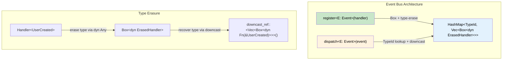
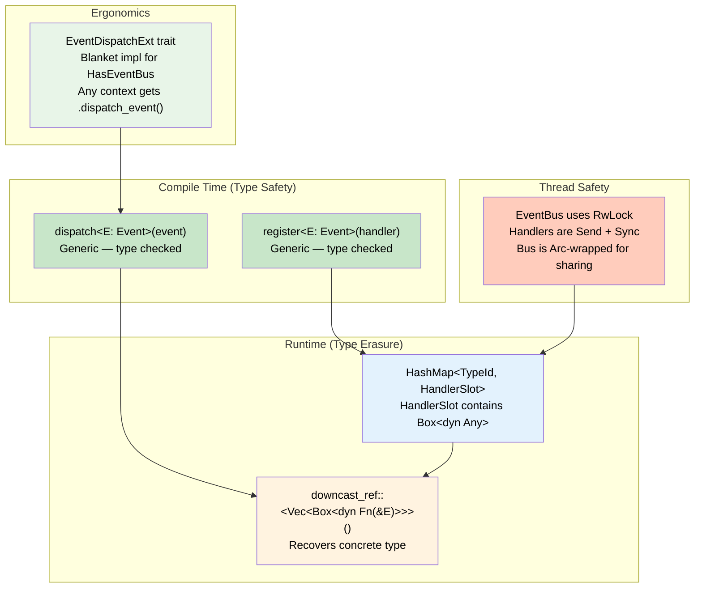

# 11. Capstone: Strongly-Typed Event Bus 🔴

> **What you'll learn:**
> - How to combine generics, trait objects, `dyn Any`, type erasure, and downcasting into a real system
> - Implementing `Send + Sync` bounds for thread-safe event dispatch
> - Using the extension trait pattern to add `.dispatch()` to a context object
> - Production design: registration, dispatch, and type-safe handler retrieval

---

## What We're Building

A **type-safe event bus** that allows:
1. **Registering handlers** for specific event types (using generics)
2. **Dispatching events** at runtime through type-erased storage (using `dyn Any`)
3. **Thread-safe** operation with `Send + Sync` bounds
4. **Extension trait** that adds a `.dispatch()` method to any context object

This capstone integrates concepts from every chapter:

| Chapter | Concept Used |
|---------|-------------|
| Ch 1: Enums | Event types as data-carrying enums |
| Ch 2: Generics | Generic `register<E>()` and `dispatch<E>()` |
| Ch 3: Newtypes | `TypeId` as the key for handler lookup |
| Ch 4: Traits | `Event` trait with associated data |
| Ch 5: Associated Types | Handler trait with `type Event` |
| Ch 6: Marker Traits | `Send + Sync + 'static` for thread safety |
| Ch 7: Trait Objects | `dyn Any` for type erasure, `Box<dyn Handler>` |
| Ch 8: Closures | Closure-based event handlers |
| Ch 9: Extension Traits | `.dispatch()` on context objects |
| Ch 10: Error Handling | `Result`-based dispatch with custom errors |



## Step 1: Define the Event Trait

```rust
use std::any::Any;
use std::fmt::Debug;

/// Marker trait for events. Must be Send + Sync for cross-thread dispatch,
/// Debug for logging, and 'static for storage in Any.
trait Event: Any + Debug + Send + Sync + 'static {}
```

Now define some concrete events:

```rust
# use std::any::Any; use std::fmt::Debug;
# trait Event: Any + Debug + Send + Sync + 'static {}
#[derive(Debug, Clone)]
struct UserCreated {
    user_id: u64,
    username: String,
}
impl Event for UserCreated {}

#[derive(Debug, Clone)]
struct OrderPlaced {
    order_id: u64,
    amount_cents: u64,
}
impl Event for OrderPlaced {}

#[derive(Debug, Clone)]
struct SystemShutdown {
    reason: String,
}
impl Event for SystemShutdown {}
```

## Step 2: Type-Erased Handler Storage

The challenge: we need to store handlers for *different event types* in the *same collection*. We use `dyn Any` for type erasure.

```rust
use std::any::{Any, TypeId};
use std::collections::HashMap;
use std::fmt::Debug;
use std::sync::{Arc, RwLock};

# trait Event: Any + Debug + Send + Sync + 'static {}

/// A type-erased handler wrapper.
/// Internally stores a Vec<Box<dyn Fn(&E) + Send + Sync>> as Box<dyn Any + Send + Sync>.
struct HandlerSlot {
    handlers: Box<dyn Any + Send + Sync>,
}

/// The event bus: maps event TypeId → type-erased handler slots.
struct EventBus {
    slots: RwLock<HashMap<TypeId, HandlerSlot>>,
}

impl EventBus {
    fn new() -> Self {
        EventBus {
            slots: RwLock::new(HashMap::new()),
        }
    }

    /// Register a handler for a specific event type.
    /// The handler is a closure that takes a reference to the event.
    fn register<E: Event>(&self, handler: impl Fn(&E) + Send + Sync + 'static) {
        let mut slots = self.slots.write().unwrap();

        let type_id = TypeId::of::<E>();

        let slot = slots.entry(type_id).or_insert_with(|| HandlerSlot {
            handlers: Box::new(Vec::<Box<dyn Fn(&E) + Send + Sync>>::new()),
        });

        // Downcast the Any back to the concrete Vec type
        let vec = slot
            .handlers
            .downcast_mut::<Vec<Box<dyn Fn(&E) + Send + Sync>>>()
            .expect("handler type mismatch — this is a bug in EventBus");

        vec.push(Box::new(handler));
    }

    /// Dispatch an event to all registered handlers.
    /// Returns the number of handlers that were called.
    fn dispatch<E: Event>(&self, event: &E) -> usize {
        let slots = self.slots.read().unwrap();

        let type_id = TypeId::of::<E>();

        match slots.get(&type_id) {
            Some(slot) => {
                let vec = slot
                    .handlers
                    .downcast_ref::<Vec<Box<dyn Fn(&E) + Send + Sync>>>()
                    .expect("handler type mismatch — this is a bug in EventBus");

                for handler in vec {
                    handler(event);
                }

                vec.len()
            }
            None => 0, // No handlers registered for this event type
        }
    }

    /// Check if any handlers are registered for an event type.
    fn has_handlers<E: Event>(&self) -> bool {
        let slots = self.slots.read().unwrap();
        slots.contains_key(&TypeId::of::<E>())
    }
}
```

## Step 3: Thread-Safe Shared Bus

Wrap the bus in `Arc` for multi-threaded access:

```rust
# use std::any::{Any, TypeId}; use std::collections::HashMap; use std::fmt::Debug; use std::sync::{Arc, RwLock};
# trait Event: Any + Debug + Send + Sync + 'static {}
# #[derive(Debug, Clone)] struct UserCreated { user_id: u64, username: String } impl Event for UserCreated {}
# #[derive(Debug, Clone)] struct OrderPlaced { order_id: u64, amount_cents: u64 } impl Event for OrderPlaced {}
# struct HandlerSlot { handlers: Box<dyn Any + Send + Sync> }
# struct EventBus { slots: RwLock<HashMap<TypeId, HandlerSlot>> }
# impl EventBus {
#     fn new() -> Self { EventBus { slots: RwLock::new(HashMap::new()) } }
#     fn register<E: Event>(&self, handler: impl Fn(&E) + Send + Sync + 'static) {
#         let mut slots = self.slots.write().unwrap();
#         let type_id = TypeId::of::<E>();
#         let slot = slots.entry(type_id).or_insert_with(|| HandlerSlot { handlers: Box::new(Vec::<Box<dyn Fn(&E) + Send + Sync>>::new()) });
#         let vec = slot.handlers.downcast_mut::<Vec<Box<dyn Fn(&E) + Send + Sync>>>().unwrap();
#         vec.push(Box::new(handler));
#     }
#     fn dispatch<E: Event>(&self, event: &E) -> usize {
#         let slots = self.slots.read().unwrap();
#         let type_id = TypeId::of::<E>();
#         match slots.get(&type_id) { Some(slot) => { let vec = slot.handlers.downcast_ref::<Vec<Box<dyn Fn(&E) + Send + Sync>>>().unwrap(); for handler in vec { handler(event); } vec.len() } None => 0 }
#     }
#     fn has_handlers<E: Event>(&self) -> bool { self.slots.read().unwrap().contains_key(&TypeId::of::<E>()) }
# }
fn main() {
    let bus = Arc::new(EventBus::new());

    // Register handlers
    bus.register::<UserCreated>(|event| {
        println!("📧 Send welcome email to {} (id: {})", event.username, event.user_id);
    });

    bus.register::<UserCreated>(|event| {
        println!("📊 Update analytics: new user {}", event.user_id);
    });

    bus.register::<OrderPlaced>(|event| {
        println!("💰 Process payment: order #{} for ${:.2}", event.order_id, event.amount_cents as f64 / 100.0);
    });

    // Dispatch events
    let count = bus.dispatch(&UserCreated {
        user_id: 1,
        username: "alice".to_string(),
    });
    println!("→ {count} handlers invoked for UserCreated\n");

    let count = bus.dispatch(&OrderPlaced {
        order_id: 1001,
        amount_cents: 4999,
    });
    println!("→ {count} handlers invoked for OrderPlaced\n");

    // No handlers registered for SystemShutdown
    # #[derive(Debug, Clone)] struct SystemShutdown { reason: String } impl Event for SystemShutdown {}
    let count = bus.dispatch(&SystemShutdown {
        reason: "maintenance".to_string(),
    });
    println!("→ {count} handlers invoked for SystemShutdown");
}
```

## Step 4: Extension Trait for Context Objects

Add a `.dispatch()` method to any context object that holds an `EventBus`:

```rust
# use std::any::{Any, TypeId}; use std::collections::HashMap; use std::fmt::Debug; use std::sync::{Arc, RwLock};
# trait Event: Any + Debug + Send + Sync + 'static {}
# struct HandlerSlot { handlers: Box<dyn Any + Send + Sync> }
# struct EventBus { slots: RwLock<HashMap<TypeId, HandlerSlot>> }
# impl EventBus {
#     fn new() -> Self { EventBus { slots: RwLock::new(HashMap::new()) } }
#     fn dispatch<E: Event>(&self, event: &E) -> usize { 0 }
#     fn register<E: Event>(&self, handler: impl Fn(&E) + Send + Sync + 'static) {}
# }
/// Trait that marks a type as having access to an EventBus.
trait HasEventBus {
    fn event_bus(&self) -> &EventBus;
}

/// Extension trait: adds .dispatch() to any type that has an EventBus.
trait EventDispatchExt: HasEventBus {
    fn dispatch_event<E: Event>(&self, event: &E) -> usize {
        self.event_bus().dispatch(event)
    }
}

// Blanket implementation: every HasEventBus type gets dispatch_event() for free
impl<T: HasEventBus> EventDispatchExt for T {}

// --- Example context that uses the extension ---

struct AppContext {
    bus: EventBus,
    app_name: String,
}

impl HasEventBus for AppContext {
    fn event_bus(&self) -> &EventBus {
        &self.bus
    }
}

struct RequestContext<'a> {
    app: &'a AppContext,
    request_id: u64,
}

impl<'a> HasEventBus for RequestContext<'a> {
    fn event_bus(&self) -> &EventBus {
        &self.app.bus
    }
}

// Now both AppContext and RequestContext have .dispatch_event()!
# #[derive(Debug, Clone)] struct UserCreated { user_id: u64, username: String } impl Event for UserCreated {}
fn handle_request(ctx: &RequestContext) {
    println!("Handling request #{}", ctx.request_id);

    // dispatch_event() comes from the extension trait
    ctx.dispatch_event(&UserCreated {
        user_id: ctx.request_id,
        username: "new_user".to_string(),
    });
}
```

## Step 5: Multi-Threaded Dispatch

```rust
# use std::any::{Any, TypeId}; use std::collections::HashMap; use std::fmt::Debug; use std::sync::{Arc, RwLock};
# use std::thread;
# trait Event: Any + Debug + Send + Sync + 'static {}
# #[derive(Debug, Clone)] struct UserCreated { user_id: u64, username: String } impl Event for UserCreated {}
# struct HandlerSlot { handlers: Box<dyn Any + Send + Sync> }
# struct EventBus { slots: RwLock<HashMap<TypeId, HandlerSlot>> }
# impl EventBus {
#     fn new() -> Self { EventBus { slots: RwLock::new(HashMap::new()) } }
#     fn register<E: Event>(&self, handler: impl Fn(&E) + Send + Sync + 'static) {
#         let mut slots = self.slots.write().unwrap();
#         let type_id = TypeId::of::<E>();
#         let slot = slots.entry(type_id).or_insert_with(|| HandlerSlot { handlers: Box::new(Vec::<Box<dyn Fn(&E) + Send + Sync>>::new()) });
#         let vec = slot.handlers.downcast_mut::<Vec<Box<dyn Fn(&E) + Send + Sync>>>().unwrap();
#         vec.push(Box::new(handler));
#     }
#     fn dispatch<E: Event>(&self, event: &E) -> usize {
#         let slots = self.slots.read().unwrap();
#         let type_id = TypeId::of::<E>();
#         match slots.get(&type_id) { Some(slot) => { let vec = slot.handlers.downcast_ref::<Vec<Box<dyn Fn(&E) + Send + Sync>>>().unwrap(); for handler in vec { handler(event); } vec.len() } None => 0 }
#     }
# }
fn main() {
    let bus = Arc::new(EventBus::new());

    // Register handlers (must be Send + Sync because they're called from any thread)
    bus.register::<UserCreated>(|event| {
        println!(
            "[thread {:?}] Welcome, {}!",
            std::thread::current().id(),
            event.username
        );
    });

    // Clone Arc for each thread
    let handles: Vec<_> = (0..4)
        .map(|i| {
            let bus = Arc::clone(&bus);
            thread::spawn(move || {
                bus.dispatch(&UserCreated {
                    user_id: i,
                    username: format!("user_{i}"),
                });
            })
        })
        .collect();

    for handle in handles {
        handle.join().unwrap();
    }
}
```

## Architecture Summary



---

<details>
<summary><strong>🏋️ Exercise: Extend the Event Bus</strong> (click to expand)</summary>

Extend the event bus with the following features:

**Requirements:**
1. Add an `unregister_all<E: Event>()` method that removes all handlers for an event type
2. Add a `handler_count<E: Event>()` method that returns how many handlers are registered
3. Add a `dispatch_result<E: Event>()` method that returns `Result<usize, BusError>` where `BusError` is a custom error type (e.g., if the bus lock is poisoned)
4. Write tests that verify thread-safe concurrent registration and dispatch
5. **Bonus:** Add a `once<E: Event>()` method that registers a handler that fires only once (hint: use `Arc<AtomicBool>` or `Arc<Mutex<Option<...>>>`)

<details>
<summary>🔑 Solution</summary>

```rust
use std::any::{Any, TypeId};
use std::collections::HashMap;
use std::fmt;
use std::sync::{Arc, RwLock, atomic::{AtomicBool, Ordering}};

trait Event: Any + fmt::Debug + Send + Sync + 'static {}

struct HandlerSlot {
    handlers: Box<dyn Any + Send + Sync>,
}

#[derive(Debug)]
enum BusError {
    LockPoisoned(String),
}

impl fmt::Display for BusError {
    fn fmt(&self, f: &mut fmt::Formatter) -> fmt::Result {
        match self {
            BusError::LockPoisoned(msg) => write!(f, "bus lock poisoned: {msg}"),
        }
    }
}

impl std::error::Error for BusError {}

struct EventBus {
    slots: RwLock<HashMap<TypeId, HandlerSlot>>,
}

impl EventBus {
    fn new() -> Self {
        EventBus { slots: RwLock::new(HashMap::new()) }
    }

    fn register<E: Event>(&self, handler: impl Fn(&E) + Send + Sync + 'static) {
        let mut slots = self.slots.write().unwrap();
        let slot = slots
            .entry(TypeId::of::<E>())
            .or_insert_with(|| HandlerSlot {
                handlers: Box::new(Vec::<Box<dyn Fn(&E) + Send + Sync>>::new()),
            });
        let vec = slot
            .handlers
            .downcast_mut::<Vec<Box<dyn Fn(&E) + Send + Sync>>>()
            .unwrap();
        vec.push(Box::new(handler));
    }

    /// Register a handler that fires only once.
    fn once<E: Event>(&self, handler: impl Fn(&E) + Send + Sync + 'static) {
        let fired = Arc::new(AtomicBool::new(false));
        let fired_clone = Arc::clone(&fired);

        self.register::<E>(move |event| {
            // Compare-and-swap: only the first call wins
            if fired_clone
                .compare_exchange(false, true, Ordering::SeqCst, Ordering::SeqCst)
                .is_ok()
            {
                handler(event);
            }
        });
    }

    fn dispatch<E: Event>(&self, event: &E) -> usize {
        let slots = self.slots.read().unwrap();
        match slots.get(&TypeId::of::<E>()) {
            Some(slot) => {
                let vec = slot
                    .handlers
                    .downcast_ref::<Vec<Box<dyn Fn(&E) + Send + Sync>>>()
                    .unwrap();
                for handler in vec {
                    handler(event);
                }
                vec.len()
            }
            None => 0,
        }
    }

    fn dispatch_result<E: Event>(&self, event: &E) -> Result<usize, BusError> {
        let slots = self.slots.read().map_err(|e| {
            BusError::LockPoisoned(e.to_string())
        })?;

        match slots.get(&TypeId::of::<E>()) {
            Some(slot) => {
                let vec = slot
                    .handlers
                    .downcast_ref::<Vec<Box<dyn Fn(&E) + Send + Sync>>>()
                    .unwrap();
                for handler in vec {
                    handler(event);
                }
                Ok(vec.len())
            }
            None => Ok(0),
        }
    }

    fn handler_count<E: Event>(&self) -> usize {
        let slots = self.slots.read().unwrap();
        match slots.get(&TypeId::of::<E>()) {
            Some(slot) => {
                slot.handlers
                    .downcast_ref::<Vec<Box<dyn Fn(&E) + Send + Sync>>>()
                    .map(|v| v.len())
                    .unwrap_or(0)
            }
            None => 0,
        }
    }

    fn unregister_all<E: Event>(&self) {
        let mut slots = self.slots.write().unwrap();
        slots.remove(&TypeId::of::<E>());
    }
}

// --- Test ---

#[derive(Debug, Clone)]
struct TestEvent { value: i32 }
impl Event for TestEvent {}

fn main() {
    let bus = Arc::new(EventBus::new());

    // Register two normal handlers + one once handler
    bus.register::<TestEvent>(|e| println!("Handler A: {}", e.value));
    bus.register::<TestEvent>(|e| println!("Handler B: {}", e.value));
    bus.once::<TestEvent>(|e| println!("ONCE handler: {} (only fires once!)", e.value));

    assert_eq!(bus.handler_count::<TestEvent>(), 3);

    // First dispatch: all 3 fire
    println!("--- Dispatch 1 ---");
    let count = bus.dispatch(&TestEvent { value: 1 });
    assert_eq!(count, 3);

    // Second dispatch: once handler is silent
    println!("\n--- Dispatch 2 ---");
    let count = bus.dispatch(&TestEvent { value: 2 });
    assert_eq!(count, 3); // Still 3 registered, but once handler is no-op

    // Unregister all
    bus.unregister_all::<TestEvent>();
    assert_eq!(bus.handler_count::<TestEvent>(), 0);

    println!("\n--- Dispatch after unregister ---");
    let count = bus.dispatch(&TestEvent { value: 3 });
    assert_eq!(count, 0);

    // Multi-threaded test
    println!("\n--- Multi-threaded dispatch ---");
    bus.register::<TestEvent>(|e| {
        println!("[{:?}] Got event: {}", std::thread::current().id(), e.value);
    });

    let handles: Vec<_> = (0..4)
        .map(|i| {
            let bus = Arc::clone(&bus);
            std::thread::spawn(move || {
                bus.dispatch(&TestEvent { value: i });
            })
        })
        .collect();

    for h in handles {
        h.join().unwrap();
    }

    println!("\n✅ All tests passed!");
}
```

</details>
</details>

---

> **Key Takeaways:**
> - The event bus combines **generics** (compile-time type safety) with **`dyn Any`** (runtime type erasure) — a powerful pattern for plugin-style architectures.
> - `TypeId::of::<E>()` is the bridge between the compile-time and runtime worlds — it gives each type a unique identifier.
> - `Send + Sync + 'static` bounds on handlers and events ensure thread safety for concurrent dispatch.
> - The **extension trait pattern** (`EventDispatchExt`) makes the API ergonomic by adding methods to arbitrary context objects.
> - This pattern is used in production systems: ECS frameworks (Bevy), dependency injection containers, and middleware pipelines.

> **See also:**
> - Every previous chapter — this capstone integrates all concepts
> - *Async Rust* companion guide — for async event dispatch, you'd use `tokio::sync::broadcast` or `tokio::sync::mpsc` channels
> - *Type-Driven Correctness* companion guide — for event bus variants with type-state tracking
