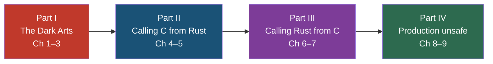

# Unsafe Rust & FFI: Breaking the Rules Safely

## Speaker Intro

- Principal Systems Architect with decades of experience in C, C++, and Rust
- Extensive background in firmware, operating systems, hypervisors, and C-interop library design at Microsoft SCHIE (Silicon and Cloud Hardware Infrastructure Engineering)
- Authored and maintained production FFI layers bridging Rust with C/C++ codebases spanning millions of lines
- Started programming in Rust in 2017 (@AWS EC2), and have been in love with the language ever since

---

This is a comprehensive deep-dive guide to `unsafe` Rust and the Foreign Function Interface (FFI). Unlike tutorials that treat `unsafe` as a footnote or a warning sign, this guide builds mastery from first principles — what the compiler actually guarantees, what Undefined Behavior truly means, how memory provenance works — then progresses to production-grade FFI patterns that let you safely bind Rust to any C or C++ library and expose idiomatic Rust APIs back to the outside world.

By the end, you will understand `unsafe` not as a keyword to fear, but as the **foundational bedrock** upon which all of Rust's safe abstractions — `Vec`, `Arc`, `Mutex`, `Pin`, `Waker` — are built.

## Who This Is For

- **C/C++ veterans moving to Rust** who need to understand how Rust's safety guarantees map to concepts they already know (RAII, move semantics, `volatile`, `restrict`)
- **Rustaceans who need to bind to C libraries** — wrapping OpenSSL, SQLite, zlib, system APIs, or proprietary SDKs
- **Systems programmers optimizing hot paths** who need to use raw pointers, inline assembly, or custom allocators
- **Library authors** building safe abstractions that use `unsafe` internally — the same design pattern behind `std::vec::Vec`, `tokio::sync::Mutex`, and `crossbeam`'s lock-free structures
- **Anyone who has been bitten by** `Segmentation fault (core dumped)`, Miri's `Undefined Behavior` errors, or mysterious `#[link]` failures at build time

## Prerequisites

You should be comfortable with:

| Concept | Where to learn it |
|---------|-------------------|
| Ownership, borrowing, lifetimes | [Rust Memory Management](../memory-management-book/src/SUMMARY.md) |
| Traits, generics, `impl Trait`, `dyn Trait` | [Rust's Type System & Traits](../type-system-traits-book/src/SUMMARY.md) |
| `Result<T, E>`, `Option<T>`, and the `?` operator | [The Rust Programming Language, Ch. 9](https://doc.rust-lang.org/book/ch09-00-error-handling.html) |
| Basic multi-threading (`std::thread`, `Arc`, `Mutex`) | [Fearless Concurrency](../concurrency-book/src/SUMMARY.md) |
| C language fundamentals (pointers, `malloc`/`free`, headers, linking) | Any C reference — we explain the Rust side |

No prior `unsafe` Rust or FFI experience is needed. We start from zero.

## How to Use This Book

**Read linearly the first time.** Parts I–IV build on each other. Each chapter has:

| Symbol | Meaning |
|--------|---------|
| 🟢 | Beginner — foundational concept |
| 🟡 | Intermediate — requires earlier chapters |
| 🔴 | Advanced — deep internals or production patterns |

Every chapter includes:
- A **"What you'll learn"** block at the top
- **Mermaid diagrams** illustrating memory layouts, ABI boundaries, pointer lifecycles, and ownership transfers
- **"What you write in Rust" vs. "What C sees"** side-by-side code blocks
- Code that triggers **Undefined Behavior** (marked `// 💥 UB:`) followed by the **fix** (marked `// ✅ FIX:`)
- An **inline exercise** with a hidden solution
- **Key Takeaways** summarizing the core ideas
- **Cross-references** to related chapters and companion guides

## Pacing Guide

| Chapters | Topic | Suggested Time | Checkpoint |
|----------|-------|----------------|------------|
| 1–3 | The Dark Arts: `unsafe` and UB | 6–8 hours | You can explain the 5 superpowers, identify UB in code snippets, run Miri, and reason about pointer provenance |
| 4–5 | Calling C from Rust | 4–6 hours | You can use `bindgen` to generate bindings, call C functions safely, and handle string conversions across the FFI boundary |
| 6–7 | Calling Rust from C | 4–6 hours | You can expose Rust functions to C with `cbindgen`, manage opaque pointers, and implement `Drop`-based cleanup |
| 8 | Safe Abstractions | 3–4 hours | You can design safe wrappers that completely encapsulate `unsafe` invariants |
| 9 | Capstone | 4–6 hours | You've built a production-quality safe Rust wrapper around a C library with callbacks, cleanup, and lifetime safety |

**Total: ~21–30 hours** for a thorough first pass.

## Working Through Exercises

Every content chapter has an inline exercise. The capstone (Ch 9) integrates everything into a single project. For maximum learning:

1. **Try the exercise before expanding the solution** — struggling is where learning happens
2. **Type the code, don't copy-paste** — muscle memory matters for Rust's syntax
3. **Run every example** — `cargo new unsafe-exercises` and test as you go
4. **Run Miri on your unsafe code** — `cargo +nightly miri test` is your new best friend

## Table of Contents

### Part I: The Dark Arts — `unsafe` and Undefined Behavior
1. **The Five Superpowers of `unsafe`** 🟢 — What unsafe unlocks, what it does NOT disable, and how to think about safety contracts
2. **Undefined Behavior and Miri** 🟡 — What constitutes UB in Rust, how it differs from C/C++ UB, and how to use Miri to catch it
3. **Strict Provenance and Pointer Aliasing** 🔴 — Why an integer is not a pointer, `expose_provenance` and `with_exposed_provenance`, and the `noalias` contract

### Part II: FFI — Calling C from Rust
4. **The `extern "C"` ABI and `bindgen`** 🟢 — Linking against C libraries, the Application Binary Interface, and automated binding generation
5. **Strings, Nulls, and Memory Boundaries** 🟡 — `CString` vs `CStr`, null pointers, and the golden rule: who allocated it must free it

### Part III: FFI — Calling Rust from C
6. **Exposing Safe Rust to the Outside World** 🟡 — `#[no_mangle]`, `extern "C" fn`, and generating C headers with `cbindgen`
7. **Opaque Pointers and Manual Memory Management** 🔴 — `Box::into_raw`, `Box::from_raw`, and passing complex Rust types through C's `void*`

### Part IV: Production `unsafe` and Capstone
8. **Safe Abstractions Over Unsafe Code** 🔴 — The core philosophy of Rust library design, and how `Pin`, `Waker`, `Vec`, and `Arc` use this pattern
9. **Capstone: The C-Crypto Wrapper** 🔴 — Build a complete safe Rust wrapper around a mock C cryptographic library

### Appendices
- **Summary and Reference Card** — Cheat sheet for C↔Rust type equivalents, `CString`/`CStr` conversions, and safe-abstraction checklists

---

> **Companion Guides:** This book is part of the Rust Training series. It explicitly builds on and references:
> - [Rust Memory Management](../memory-management-book/src/SUMMARY.md) — ownership, borrowing, lifetimes, smart pointers
> - [Rust's Type System & Traits](../type-system-traits-book/src/SUMMARY.md) — trait objects, `dyn Trait`, `Send`/`Sync`
> - [Async Rust](../async-book/src/SUMMARY.md) — we show how `Pin`, `Waker`, and async runtimes are safe abstractions over `unsafe`
> - [Fearless Concurrency](../concurrency-book/src/SUMMARY.md) — atomics, `Arc`, `Mutex` internals that rely on `unsafe`
> - [Rust Metaprogramming](../metaprogramming-book/src/SUMMARY.md) — proc macros that generate `unsafe` FFI glue
> - [Rust for C/C++ Programmers](../c-cpp-book/src/SUMMARY.md) — the companion bridge guide for C/C++ developers
> - [Rust Engineering Practices](../engineering-book/src/SUMMARY.md) — CI integration, Miri in CI, sanitizers
