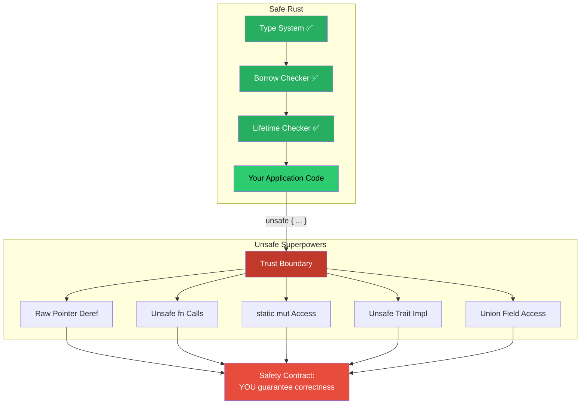

# The Five Superpowers of `unsafe` 🟢

> **What you'll learn:**
> - The exact five capabilities that `unsafe` unlocks — and nothing more
> - Why `unsafe` does NOT turn off the borrow checker for safe references
> - The concept of a **safety contract** (preconditions you promise to uphold)
> - How to read `unsafe` as a signpost, not a warning label

The `unsafe` keyword is the most misunderstood feature in Rust. Newcomers treat it like a panic button. C++ veterans see it as "finally, normal mode." Both are wrong.

`unsafe` is a **contract mechanism**. It is Rust's way of saying: *"The compiler cannot verify this invariant — you, the programmer, are signing a contract that you will uphold it."* Breaking that contract is Undefined Behavior (UB), and UB means your program has no defined semantics — not "it might crash," but **"the compiler is free to do literally anything."**

## The Five — and Only Five — Superpowers

Inside an `unsafe` block or `unsafe fn`, you can do exactly five things that you cannot do in safe Rust:

| # | Superpower | What it lets you do |
|---|-----------|---------------------|
| 1 | **Dereference raw pointers** | Read/write through `*const T` and `*mut T` |
| 2 | **Call unsafe functions** | Invoke functions marked `unsafe fn` (including FFI) |
| 3 | **Access or modify mutable statics** | Read/write `static mut` variables |
| 4 | **Implement unsafe traits** | Provide implementations for traits marked `unsafe trait` |
| 5 | **Access fields of `union`s** | Read fields of a `union` (since the compiler can't know which variant is valid) |

That's it. There is no sixth superpower. `unsafe` does not:
- Turn off the borrow checker for `&T` and `&mut T` references
- Disable lifetime checking
- Allow data races on safe types
- Permit calling safe functions in unsafe ways
- Let you ignore type checking

```rust
unsafe {
    let mut x = 42;
    let r1 = &x;
    let r2 = &mut x; // ❌ STILL a compile error — borrow checker is ON
    println!("{}", r1);
}
```

> **Critical insight:** `unsafe` is a *narrowly scoped trust boundary*, not an "anything goes" escape hatch. The compiler still enforces every rule it can. You only take on responsibility for the things the compiler *cannot* check.

## Superpower 1: Dereferencing Raw Pointers

Raw pointers (`*const T` and `*mut T`) are Rust's equivalent of C pointers. Creating them is safe; **dereferencing** them is not.

```rust
fn main() {
    let x = 42;
    let ptr: *const i32 = &x; // ✅ Safe: creating a raw pointer

    // println!("{}", *ptr); // ❌ Compile error: dereference of raw pointer requires unsafe

    unsafe {
        println!("{}", *ptr); // ✅ We assert ptr is valid, aligned, and points to initialized data
    }
}
```

### Why raw pointers exist

| Feature | `&T` / `&mut T` | `*const T` / `*mut T` |
|---------|:---:|:---:|
| Borrow checker enforced | ✅ | ❌ |
| Guaranteed non-null | ✅ | ❌ |
| Guaranteed aligned | ✅ | ❌ |
| Guaranteed valid | ✅ | ❌ |
| Can be null | ❌ | ✅ |
| Can alias mutably | ❌ | ✅ |
| Can point to freed memory | ❌ | ✅ |
| Needed for FFI | Rarely | ✅ |

Raw pointers are the bridge between Rust's safety guarantees and the outside world. Every FFI call, every custom allocator, every lock-free data structure uses them.

## Superpower 2: Calling Unsafe Functions

Any function marked `unsafe fn` has a **safety contract** — preconditions that the caller must satisfy. The compiler cannot verify these, so it requires you to call them from an `unsafe` block.

```rust
/// # Safety
///
/// `ptr` must point to a valid, initialized `i32`. The caller must ensure
/// the pointer is not dangling and that no mutable reference to the same
/// memory exists.
unsafe fn read_value(ptr: *const i32) -> i32 {
    *ptr
}

fn main() {
    let val = 10;
    let ptr = &val as *const i32;
    
    // read_value(ptr); // ❌ Compile error: requires unsafe block
    
    let result = unsafe { read_value(ptr) }; // ✅ We uphold the contract
    assert_eq!(result, 10);
}
```

### The `/// # Safety` doc convention

Every `unsafe fn` in the Rust ecosystem is expected to document its safety contract:

```rust
/// Transmutes a `u32` into an `f32` with the same bit pattern.
///
/// # Safety
///
/// The caller must ensure that the bit pattern of `bits` represents
/// a valid, non-signaling `f32` value for their use case.
unsafe fn u32_to_f32(bits: u32) -> f32 {
    std::mem::transmute(bits)
}
```

This convention is enforced by Clippy (`clippy::missing_safety_doc`). If you write `unsafe fn` without `# Safety`, your CI should fail.

## Superpower 3: Accessing Mutable Statics

Mutable static variables are inherently unsafe because any thread can access them at any time — creating potential data races.

```rust
static mut COUNTER: u64 = 0;

fn increment() {
    unsafe {
        COUNTER += 1; // 💥 UB if called from multiple threads without synchronization
    }
}
```

> **Guidance:** Avoid `static mut` in almost all cases. Use `std::sync::atomic::AtomicU64`, `std::sync::Mutex`, or `std::sync::OnceLock` instead. The only legitimate uses for `static mut` are:
> - Pre-`main` initialization in `no_std` environments
> - FFI callbacks where the C library requires a global (and you protect access with external synchronization)

```rust
use std::sync::atomic::{AtomicU64, Ordering};

static COUNTER: AtomicU64 = AtomicU64::new(0); // ✅ FIX: No unsafe needed

fn increment() {
    COUNTER.fetch_add(1, Ordering::Relaxed);
}
```

## Superpower 4: Implementing Unsafe Traits

An `unsafe trait` is a trait whose implementation requires upholding invariants that the compiler cannot check. The most important examples in `std` are:

| Trait | Contract |
|-------|----------|
| `Send` | Values of this type can be safely transferred to another thread |
| `Sync` | References to this type can be safely shared between threads |
| `GlobalAlloc` | The allocator must return properly aligned, non-overlapping memory |

```rust
struct MyType {
    ptr: *mut u8, // raw pointer → not auto-Send or auto-Sync
}

// We assert: our usage of `ptr` is thread-safe because we protect it
// with external synchronization (e.g., we never write to it after init).
//
// # Safety
// `MyType` only reads from `ptr` after construction. The pointed-to data
// is immutable and lives for `'static`.
unsafe impl Send for MyType {}
unsafe impl Sync for MyType {}
```

Getting this wrong doesn't produce a compile error — it produces a data race, which is UB.

## Superpower 5: Accessing Union Fields

Rust's `union` type is similar to C's `union` — all fields share the same memory. Reading the "wrong" field reinterprets the bytes, which is undefined behavior if the types have different validity requirements.

```rust
#[repr(C)]
union IntOrFloat {
    i: i32,
    f: f32,
}

fn main() {
    let u = IntOrFloat { i: 42 };
    
    // Access requires unsafe because the compiler can't know which
    // field was last written to.
    unsafe {
        println!("As int: {}", u.i);   // ✅ Fine — we wrote `i`
        println!("As float: {}", u.f); // ⚠️ Technically valid for repr(C)
                                        // but semantically dubious
    }
}
```

> In FFI contexts, `#[repr(C)]` unions are common for interfacing with C libraries that use tagged unions.

## The Mental Model: `unsafe` as a Trust Boundary

Think of `unsafe` blocks as **checkpoints** at a border crossing. Inside the checkpoint, you must present your documents (safety contracts). Outside, you enjoy the freedoms of safe Rust. The checkpoint exists so that if something goes wrong, you know *exactly* where to look.



### Minimize the blast radius

The Rust style guide encourages keeping `unsafe` blocks as **small as possible**. Don't wrap an entire function in `unsafe` — isolate the one operation that needs it:

```rust
// ❌ BAD: Too much code inside unsafe
unsafe {
    let len = compute_length(&data);
    let ptr = data.as_ptr();
    let slice = std::slice::from_raw_parts(ptr, len);
    process(slice);
}

// ✅ GOOD: Only the unsafe operation is inside the block
let len = compute_length(&data);
let ptr = data.as_ptr();
let slice = unsafe { std::slice::from_raw_parts(ptr, len) };
process(slice);
```

## `unsafe fn` vs `unsafe { }` — Who Bears the Responsibility?

| Construct | Meaning |
|-----------|---------|
| `unsafe { expr }` | "I (the caller) have verified the preconditions." |
| `unsafe fn foo()` | "This function has preconditions the compiler can't check. Every caller must verify them." |
| Safe function containing `unsafe { }` | "I (the library author) have verified the unsafe preconditions internally. My callers don't need to worry." |

The third row is the **most important pattern in Rust library design** — it's how `Vec::push`, `Arc::clone`, `Mutex::lock`, and thousands of other safe functions work. We'll explore this deeply in Chapter 8.

<details>
<summary><strong>🏋️ Exercise: Classify the Superpowers</strong> (click to expand)</summary>

For each code snippet, identify which of the 5 superpowers is being used and whether the `unsafe` usage is correct.

```rust
// Snippet A
static mut GLOBAL_ID: u64 = 0;
fn next_id() -> u64 {
    unsafe {
        GLOBAL_ID += 1;
        GLOBAL_ID
    }
}

// Snippet B
fn read_first(data: &[i32]) -> i32 {
    let ptr = data.as_ptr();
    unsafe { *ptr }
}

// Snippet C
#[repr(C)]
union Packet {
    raw: [u8; 4],
    value: u32,
}
fn parse(bytes: [u8; 4]) -> u32 {
    let p = Packet { raw: bytes };
    unsafe { p.value }
}

// Snippet D
struct Wrapper(*mut Vec<String>);
unsafe impl Send for Wrapper {}
```

<details>
<summary>🔑 Solution</summary>

```rust
// Snippet A — Superpower 3: Mutable static access
// CORRECTNESS: ⚠️ Compiles, but UB if called from multiple threads.
// Fix: Use AtomicU64 instead of static mut.
//
// static mut GLOBAL_ID: u64 = 0;
// fn next_id() -> u64 { unsafe { GLOBAL_ID += 1; GLOBAL_ID } }
// 💥 UB: data race if two threads call next_id() concurrently.
//
// ✅ FIX:
use std::sync::atomic::{AtomicU64, Ordering};
static GLOBAL_ID: AtomicU64 = AtomicU64::new(0);
fn next_id() -> u64 {
    GLOBAL_ID.fetch_add(1, Ordering::Relaxed)
}

// Snippet B — Superpower 1: Raw pointer dereference
// CORRECTNESS: ✅ Safe in practice — `data.as_ptr()` on a non-empty
// slice returns a valid pointer. However, this panics if data is empty
// in safe code (data[0]), but with raw pointers we'd get UB.
// A robust version should check `!data.is_empty()` first.

// Snippet C — Superpower 5: Union field access
// CORRECTNESS: ✅ For #[repr(C)] unions with all bit patterns valid
// (u8 array → u32), this is well-defined. Note: endianness matters.

// Snippet D — Superpower 4: Unsafe trait implementation
// CORRECTNESS: ⚠️ DANGEROUS. This sends a *mut Vec<String> across
// threads. If two threads access the Vec through the raw pointer,
// that's a data race (UB). Only safe if external synchronization
// guarantees exclusive access. The `// # Safety` doc is missing.
```

</details>
</details>

> **Key Takeaways:**
> - `unsafe` grants exactly **five superpowers** — no more, no less
> - The borrow checker, type system, and lifetime checker remain **fully active** inside `unsafe` blocks
> - Every use of `unsafe` is a **contract**: you promise correctness that the compiler cannot verify
> - Minimize `unsafe` blocks to isolate the trust boundary and make auditing easy
> - Document every `unsafe fn` with a `/// # Safety` section explaining the preconditions

> **See also:**
> - [Chapter 2: Undefined Behavior and Miri](ch02-undefined-behavior-and-miri.md) — what happens when you break the contract
> - [Chapter 8: Safe Abstractions Over Unsafe Code](ch08-safe-abstractions-over-unsafe-code.md) — how to encapsulate `unsafe` so users never see it
> - [Rust Memory Management](../memory-management-book/src/SUMMARY.md) — ownership and borrowing fundamentals
> - [Rust's Type System & Traits](../type-system-traits-book/src/SUMMARY.md) — `Send`, `Sync`, and trait safety
