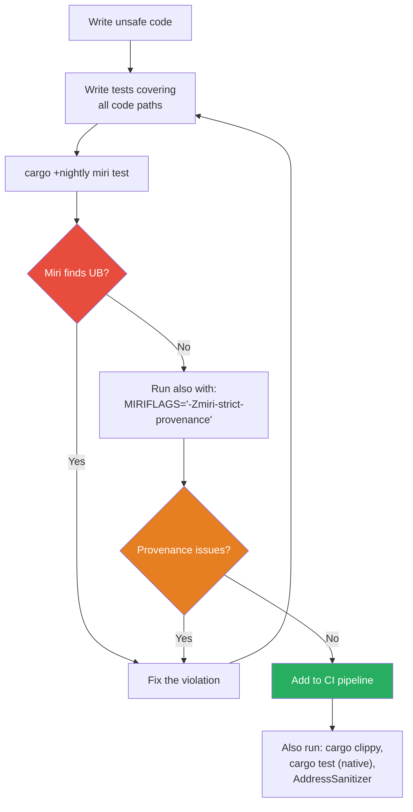

# Undefined Behavior and Miri 🟡

> **What you'll learn:**
> - The complete list of Undefined Behavior (UB) in Rust and how it differs from C/C++ UB
> - Why UB is not "it might crash" but "the compiler may assume it never happens"
> - How to install and use **Miri** to dynamically detect UB in your unsafe code
> - Practical patterns for testing unsafe code in CI

In Chapter 1, we learned that `unsafe` is a contract mechanism. In this chapter, we learn what happens when you **break** that contract. The answer is not "your program crashes." The answer is far worse: your program has *no defined semantics at all*.

## What Is Undefined Behavior?

Undefined Behavior means the program has violated a fundamental assumption the compiler relies on. Once UB occurs, the compiler's optimizations — which were derived from those assumptions — can produce **literally any result**: crashes, silent data corruption, security vulnerabilities, or code that *appears* to work until you upgrade your compiler or change an unrelated function.

> **The C programmer's curse:** "It works on my machine" is the canonical UB symptom. UB code may run correctly for years, then break catastrophically when the optimizer gets smarter.

### UB is not a runtime error

UB is a **compile-time contract violation** that manifests at runtime in unpredictable ways. The compiler is *allowed* to assume UB never happens. This means:

```rust
// If the compiler can prove that `x` is always a valid reference,
// it may optimize away null checks, reorder memory accesses, or
// eliminate entire branches — all of which produce wrong results
// if `x` was actually invalid.
```

## The Complete UB Catalog for Rust

Rust's UB list is more *restrictive* than C's — meaning Rust has *more* rules you must follow, but in exchange, the compiler can optimize more aggressively.

| Category | Specific UB | C/C++ equivalent |
|----------|------------|-------------------|
| **Memory** | Dereferencing a null, dangling, or unaligned pointer | Same |
| **Memory** | Reading uninitialized memory (`MaybeUninit` abuse) | Same |
| **Memory** | Use-after-free: accessing memory after deallocation | Same |
| **Memory** | Out-of-bounds access | Same |
| **Memory** | Double-free | Same |
| **Aliasing** | Creating two `&mut T` to the same location simultaneously | C has `restrict` keyword; Rust enforces by default |
| **Aliasing** | Mutating data behind a `&T` (without `UnsafeCell`) | Rust-specific |
| **Types** | Creating an invalid value (e.g., a `bool` that is `2`, a `char` above `0x10FFFF`) | Partially — C is more lenient |
| **Types** | Invalid `enum` discriminant | Rust-specific |
| **Types** | Uninitialized integers (pre-2024 — now "just" indeterminate) | Debated in C |
| **Concurrency** | Data race: unsynchronized access where at least one is a write | Same |
| **Control** | Unwinding from a function marked `extern "C"` (without `catch_unwind`) | ABI violation |
| **Control** | Executing unreachable code (`std::hint::unreachable_unchecked`) | `__builtin_unreachable` |

### The aliasing rules are Rust's *unique* UB category

C/C++ programmers: pay close attention here. In Rust, `&mut T` gives the compiler permission to assume **exclusive access** for the duration of the borrow. This is stronger than C's `restrict` keyword (which is opt-in and rarely used).

```rust
fn aliasing_demo() {
    let mut x = 42i32;
    let ptr1 = &mut x as *mut i32;
    let ptr2 = &mut x as *mut i32;
    
    // 💥 UB: The compiler assumes each &mut T is exclusive.
    // Even though we "erased" the borrows into raw pointers,
    // Miri tracks provenance and will flag this.
    unsafe {
        *ptr1 = 10;
        *ptr2 = 20; // 💥 UB: Miri detects overlapping mutable provenance
    }
}
```

```rust
fn aliasing_fixed() {
    let mut x = 42i32;
    let ptr = &mut x as *mut i32;
    
    // ✅ FIX: Use a single raw pointer, derived once
    unsafe {
        *ptr = 10;
        *ptr = 20; // Fine — single provenance chain
    }
}
```

## The "Nasal Demons" Argument, Grounded

When we say "the compiler may do anything," we mean it literally. Here's a concrete example of how UB enables dangerous miscompilation:

```rust
fn check_password(input: &str, secret: &str) -> bool {
    if input.len() != secret.len() {
        return false;
    }
    // Assume some unsafe code earlier created UB by violating aliasing rules.
    // The optimizer, having assumed those rules hold, may now incorrectly
    // conclude that this branch is unreachable and REMOVE the length check.
    input == secret
}
```

This is not hypothetical. LLVM (Rust's backend) aggressively exploits `noalias` (derived from `&mut T`) and `nonnull` (derived from `&T`) to eliminate branches and reorder loads.

## Miri: The Undefined Behavior Detector

[Miri](https://github.com/rust-lang/miri) is an interpreter for Rust's Mid-level Intermediate Representation (MIR). It executes your program step-by-step and checks for UB violations at every operation.

### Installing Miri

```bash
rustup +nightly component add miri
```

### Running Miri

```bash
# Run all tests under Miri
cargo +nightly miri test

# Run a specific binary
cargo +nightly miri run

# Run with Strict Provenance checking (recommended)
MIRIFLAGS="-Zmiri-strict-provenance" cargo +nightly miri test
```

### What Miri catches

| Detection | Example |
|-----------|---------|
| ✅ Use-after-free | Dereferencing a pointer to freed memory |
| ✅ Out-of-bounds | Pointer arithmetic past allocation bounds |
| ✅ Aliasing violations | Two `&mut` to the same memory (Stacked Borrows / Tree Borrows) |
| ✅ Invalid values | `bool` with value `2`, uninitialized reads |
| ✅ Data races | Unsynchronized concurrent access |
| ✅ Memory leaks | Allocations never freed (optional flag) |
| ❌ Hardware-specific | SIMD misuse, alignment on specific architectures |
| ❌ Linker issues | Missing symbols, ABI mismatches |
| ❌ Real I/O | File system, network, syscalls |

### What Miri does NOT catch

Miri is a *dynamic* analysis tool — it can only find UB on code paths that are actually executed. If your test doesn't exercise a particular branch, Miri won't check it. This is why **comprehensive test coverage of unsafe code is critical**.



## Practical Example: Miri Catches Use-After-Free

```rust
#[cfg(test)]
mod tests {
    #[test]
    fn use_after_free() {
        let ptr: *const i32;
        {
            let val = 42;
            ptr = &val as *const i32;
        } // `val` is dropped here — ptr is now dangling
        
        // 💥 UB: Dereferencing a dangling pointer
        let _x = unsafe { *ptr };
        // Miri output:
        // error: Undefined Behavior: dereferencing pointer failed:
        //        alloc1234 has been freed
    }
}
```

### The fix: ensure the pointed-to data outlives the pointer

```rust
#[cfg(test)]
mod tests {
    #[test]
    fn use_after_free_fixed() {
        let val = 42; // ✅ FIX: val lives long enough
        let ptr = &val as *const i32;
        
        let x = unsafe { *ptr }; // ✅ ptr is valid
        assert_eq!(x, 42);
    }
}
```

## Practical Example: Miri Catches Aliasing Violations

```rust
#[cfg(test)]
mod tests {
    #[test]
    fn aliasing_violation() {
        let mut data = vec![1, 2, 3];
        let ptr = data.as_mut_ptr();
        
        let slice = &data[..]; // immutable borrow of data
        
        unsafe {
            // 💥 UB: Writing through raw pointer while an immutable 
            // reference (slice) exists. Violates Stacked Borrows.
            *ptr = 99;
        }
        
        println!("{:?}", slice);
        // Miri: error: Undefined Behavior: attempting a write access
        //        using <tag> which is a SharedReadOnly
    }
}
```

```rust
#[cfg(test)]
mod tests {
    #[test]
    fn aliasing_fixed() {
        let mut data = vec![1, 2, 3];
        let ptr = data.as_mut_ptr();
        
        // ✅ FIX: No overlapping references — do the write first
        unsafe {
            *ptr = 99;
        }
        
        let slice = &data[..]; // borrow starts after the write
        assert_eq!(slice, &[99, 2, 3]);
    }
}
```

## Miri in CI: A Non-Negotiable for Unsafe Code

If your crate contains `unsafe`, Miri must be in your CI pipeline. Here's a minimal GitHub Actions job:

```yaml
# .github/workflows/miri.yml
name: Miri
on: [push, pull_request]

jobs:
  miri:
    runs-on: ubuntu-latest
    steps:
      - uses: actions/checkout@v4
      - uses: dtolnay/rust-toolchain@nightly
        with:
          components: miri
      - run: cargo miri test
        env:
          MIRIFLAGS: "-Zmiri-strict-provenance"
```

## Stacked Borrows vs Tree Borrows

Miri supports two aliasing models. Understanding both is important for writing correct unsafe code.

| Model | Status | Strictness | Use case |
|-------|--------|------------|----------|
| **Stacked Borrows** | Default (stable) | Strict | Conservative correctness checking |
| **Tree Borrows** | Experimental | More permissive | Closer to what LLVM actually exploits |

Stacked Borrows models every pointer access as a stack of permissions. When you create a `&mut T`, it pushes a new "Unique" item onto the stack. Accessing through an older pointer pops everything above it — invalidating the `&mut T`.

```bash
# Use Tree Borrows instead (experimental, less false positives)
MIRIFLAGS="-Zmiri-tree-borrows" cargo +nightly miri test
```

> **Practical guidance:** If Stacked Borrows flags your code and Tree Borrows doesn't, your code is probably fine but *might* break in a future compiler. Fix it if you can.

## Common Patterns That Are Deceptively UB

### 1. Creating a reference to uninitialized memory

```rust
// 💥 UB: References must point to initialized, valid data
let x: i32 = unsafe { std::mem::uninitialized() }; // DEPRECATED — always UB

// ✅ FIX: Use MaybeUninit
use std::mem::MaybeUninit;
let x: i32 = unsafe {
    let mut val = MaybeUninit::<i32>::uninit();
    val.as_mut_ptr().write(42); // Initialize before reading
    val.assume_init()           // Now safe to read
};
```

### 2. `transmute` to a type with stricter validity

```rust
// 💥 UB: 2 is not a valid bool
let b: bool = unsafe { std::mem::transmute(2u8) };

// ✅ FIX: Validate before transmuting
let byte: u8 = 2;
let b: bool = match byte {
    0 => false,
    1 => true,
    _ => panic!("invalid bool value: {byte}"),
};
```

### 3. Forgetting that `Vec::set_len` trusts you

```rust
let mut v: Vec<String> = Vec::with_capacity(10);

// 💥 UB: We told Vec it has 10 initialized Strings, but it has 0.
// When dropped, Vec will call drop() on 10 uninitialized Strings.
unsafe { v.set_len(10); }

// ✅ FIX: Only set_len after actually initializing the elements
let mut v: Vec<i32> = Vec::with_capacity(10);
let ptr = v.as_mut_ptr();
unsafe {
    for i in 0..10 {
        ptr.add(i).write(i as i32); // Initialize each element
    }
    v.set_len(10); // Now this is correct
}
```

<details>
<summary><strong>🏋️ Exercise: Find the UB</strong> (click to expand)</summary>

The following code compiles and even produces the "expected" output on most machines. Identify **all** instances of Undefined Behavior. Then fix each one.

```rust
use std::mem;

fn main() {
    // Part 1
    let mut x: u32 = 42;
    let r1 = &x as *const u32;
    let r2 = &mut x as *mut u32;
    unsafe {
        println!("r1 = {}", *r1);
        *r2 = 100;
        println!("r1 = {}", *r1);
    }
    
    // Part 2: "Clever" zero-initialization
    let s: String = unsafe { mem::zeroed() };
    println!("len = {}", s.len());
    
    // Part 3
    let v = vec![1u8, 2, 3];
    let ptr = v.as_ptr();
    drop(v);
    let first = unsafe { *ptr };
    println!("first = {first}");
}
```

<details>
<summary>🔑 Solution</summary>

```rust
use std::mem::MaybeUninit;

fn main() {
    // Part 1 — 💥 UB: Aliasing violation
    // We derive a *const from &x, then a *mut from &mut x.
    // Reading through r1 after writing through r2 violates
    // Stacked Borrows: the shared borrow was invalidated when
    // we created the mutable borrow.
    //
    // ✅ FIX: Derive both pointers from a single &mut
    let mut x: u32 = 42;
    let r2 = &mut x as *mut u32;
    let r1 = r2 as *const u32; // derived from the same mutable provenance
    unsafe {
        println!("r1 = {}", *r1); // ✅ Valid read through derived pointer
        *r2 = 100;
        println!("r1 = {}", *r1); // ✅ Still valid — same provenance chain
    }
    
    // Part 2 — 💥 UB: String's internal pointer would be null (zeroed),
    // its capacity and length would be 0, but the vtable/allocator
    // metadata would be invalid. Dropping this String is UB.
    //
    // ✅ FIX: Use the proper constructor
    let s = String::new();
    println!("len = {}", s.len());
    
    // Part 3 — 💥 UB: Use-after-free
    // We dropped the Vec, so ptr is dangling.
    //
    // ✅ FIX: Don't drop the Vec until you're done with the pointer
    let v = vec![1u8, 2, 3];
    let ptr = v.as_ptr();
    let first = unsafe { *ptr }; // ✅ v is still alive
    println!("first = {first}");
    drop(v); // Now safe to drop
}
```

</details>
</details>

> **Key Takeaways:**
> - UB is not "a crash" — it's the absence of any defined program semantics. The compiler is free to do **anything**.
> - Rust's UB rules are **stricter** than C's, especially around aliasing (`&mut T` exclusivity) and value validity.
> - **Miri** is the essential tool for testing unsafe code. Install it, run it, put it in CI.
> - Always use `MaybeUninit` instead of `mem::zeroed()`/`mem::uninitialized()` for delayed initialization.
> - UB that "works today" can break with any compiler upgrade — it's a ticking time bomb.

> **See also:**
> - [Chapter 1: The Five Superpowers](ch01-the-five-superpowers-of-unsafe.md) — the contract you're breaking when UB occurs
> - [Chapter 3: Strict Provenance](ch03-strict-provenance-and-pointer-aliasing.md) — the deeper theory behind pointer aliasing rules
> - [Rust Engineering Practices](../engineering-book/src/SUMMARY.md) — CI pipelines, Miri integration, sanitizers
> - [Rust Memory Management](../memory-management-book/src/SUMMARY.md) — ownership model that prevents most UB at compile time
