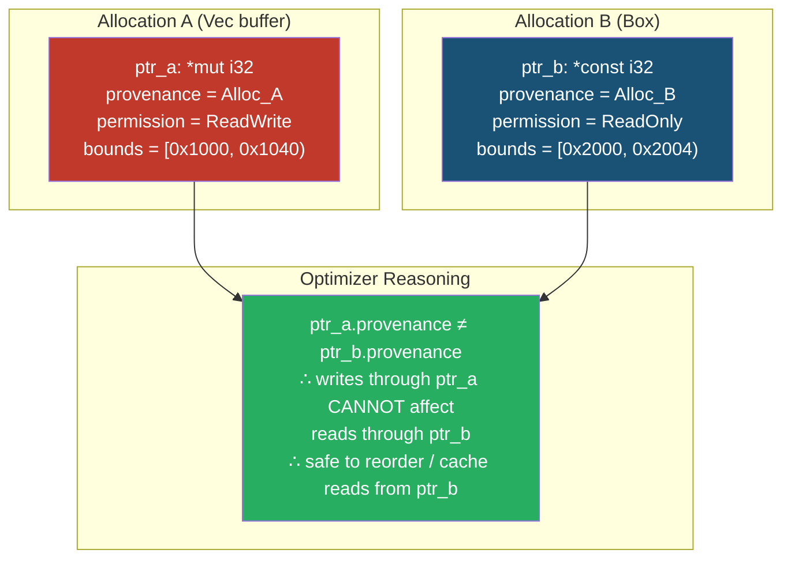
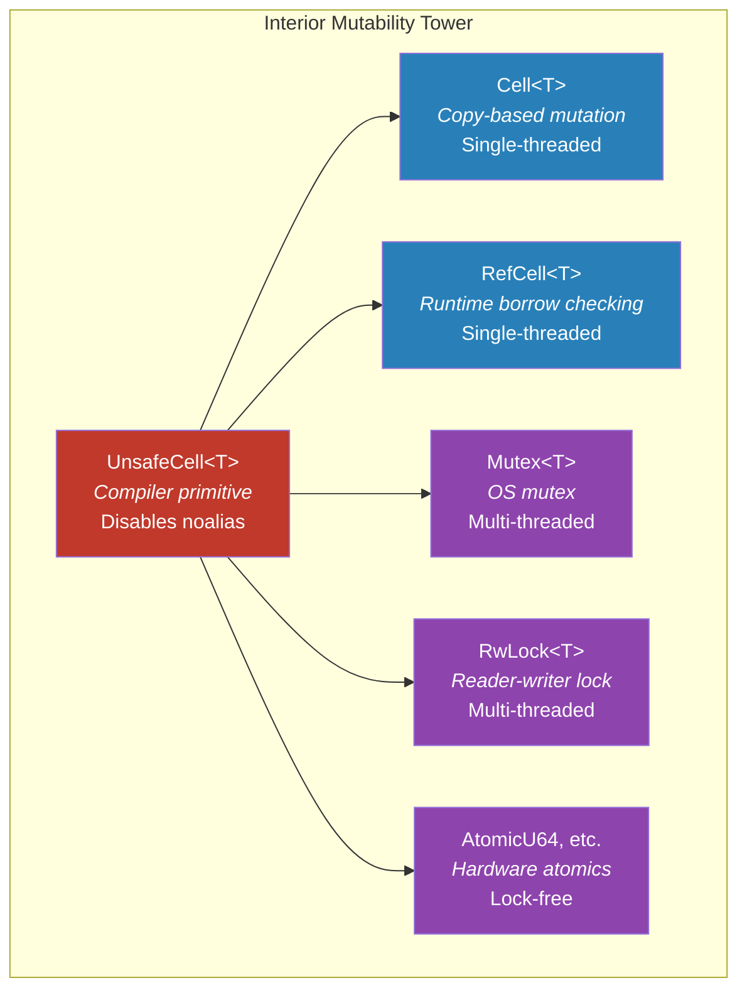

# Strict Provenance and Pointer Aliasing 🔴

> **What you'll learn:**
> - Why a pointer is not just an integer — it carries **provenance** (permission metadata)
> - The Strict Provenance model and its APIs: `expose_provenance`, `with_exposed_provenance`, `addr`, `with_addr`
> - How LLVM's `noalias` attribute connects to Rust's `&mut T` exclusivity guarantees
> - Why integer-to-pointer round-trips are inherently problematic and how to avoid them

This is the most conceptually challenging chapter in the book. It covers the theoretical foundations that underpin *all* of Rust's pointer and reference semantics. If you understand provenance, you understand **why** the aliasing rules from Chapter 2 exist and how the optimizer exploits them.

## The Core Problem: Pointers Are Not Integers

In C, casting between pointers and integers is routine:

```c
// C code — common but problematic
void *ptr = malloc(64);
uintptr_t addr = (uintptr_t)ptr;
// ... store addr in a hash map, log it, etc.
void *ptr2 = (void *)addr;  // "reconstitute" the pointer
memcpy(ptr2, src, 64);      // use it
```

This works in practice on most hardware because pointers *are* implemented as integers in the CPU. But it is a lie. The compiler's optimization model — the Abstract Machine — treats pointers as carrying invisible metadata called **provenance**: information about *which allocation* the pointer is allowed to access and *how*.

When you round-trip through an integer, you *strip* the provenance. The reconstituted pointer is technically "unprovenanced" — it has the right address but no permission to access anything.

## What Is Provenance?

Provenance is a compile-time concept that tracks three things:

| Property | Meaning |
|----------|---------|
| **Origin allocation** | Which `malloc`/`Box`/stack variable this pointer was derived from |
| **Permission** | Read-only (`&T`/`*const T`) vs read-write (`&mut T`/`*mut T`) |
| **Bounds** | How far from the origin the pointer may travel (e.g., within a single allocation) |

The compiler uses provenance to decide:
- Whether two pointers can alias (point to the same memory)
- Whether a write through pointer A can affect a read through pointer B
- Whether it's safe to reorder, vectorize, or eliminate memory accesses



## Strict Provenance: The Rules

Rust's [Strict Provenance](https://doc.rust-lang.org/std/ptr/index.html#strict-provenance) experiment (stabilized as APIs, with the semantic model still evolving) defines clear rules:

### Rule 1: Every pointer has provenance

A pointer is a `(address, provenance)` pair. Two pointers to the same address but with different provenance are *different* pointers to the optimizer.

### Rule 2: Provenance is derived, not created

You get provenance by:
- Taking a reference (`&x`, `&mut x`) — provenance covers `x`'s allocation
- Calling an allocator (`Box::new`, `Vec::with_capacity`, `alloc::alloc`) — provenance covers the new allocation
- Deriving from an existing pointer (`ptr.add(1)`, `ptr.cast::<U>()`) — inherits the parent's provenance

### Rule 3: Integer-to-pointer casts destroy provenance

```rust
let x = 42;
let ptr = &x as *const i32;
let addr: usize = ptr as usize;       // strip provenance → just an integer
let ptr2 = addr as *const i32;        // ⚠️ ptr2 has NO provenance
unsafe { println!("{}", *ptr2); }     // 💥 UB under Strict Provenance
```

### Rule 4: Use the Strict Provenance APIs instead

```rust
let x = 42;
let ptr = &x as *const i32;

// ✅ Get the address without losing provenance context
let addr: usize = ptr.addr();        // Returns the address as usize

// ✅ Create a new pointer with the same provenance but a different address
let other_ptr = ptr.with_addr(addr);  // Keeps ptr's provenance

// If you MUST round-trip through an integer (e.g., storing in a HashMap):
let exposed: usize = ptr.expose_provenance();  // "Expose" the provenance
// ... later ...
let recovered: *const i32 = std::ptr::with_exposed_provenance(exposed);
// This is the ONLY sanctioned way to go integer → pointer
```

## The Strict Provenance API Surface

| API | Purpose | Provenance effect |
|-----|---------|-------------------|
| `ptr.addr()` | Get the address as `usize` | Provenance stays on `ptr` (not transferred) |
| `ptr.with_addr(addr)` | Create new pointer with `ptr`'s provenance at `addr` | New pointer inherits `ptr`'s provenance |
| `ptr.map_addr(f)` | Transform address, keep provenance | Same as `with_addr(f(addr))` |
| `ptr.expose_provenance()` | Get address AND expose provenance for later recovery | Side effect: marks provenance as "exposed" |
| `std::ptr::with_exposed_provenance::<T>(addr)` | Recover a pointer from a previously exposed address | Provenance recovered from the exposed set |
| `std::ptr::without_provenance::<T>(addr)` | Create a pointer with NO provenance (for sentinel values) | No provenance — cannot be dereferenced |

### When to use `expose_provenance`

The `expose`/`with_exposed_provenance` pair exists for legacy patterns that *require* storing pointers as integers:

- Tagged pointers (using the low bits of an aligned pointer for metadata)
- XOR linked lists
- Pointer compression schemes
- Storing pointers in `AtomicUsize`

```rust
// Tagged pointer: store a boolean in the lowest bit of an aligned pointer
fn tag_pointer(ptr: *mut u64) -> usize {
    let addr = ptr.expose_provenance();
    assert!(addr % 8 == 0, "pointer must be 8-byte aligned");
    addr | 1 // Set the tag bit
}

fn untag_pointer(tagged: usize) -> *mut u64 {
    let addr = tagged & !0b111; // Clear the low 3 bits
    std::ptr::with_exposed_provenance_mut::<u64>(addr)
}
```

## LLVM `noalias` and Why `&mut T` Is Sacred

When Rust passes an `&mut T` to a function, LLVM marks the corresponding parameter with `noalias`. This is the same attribute as C99's `restrict` keyword, but Rust applies it **everywhere**, **always**, **automatically**.

### What `noalias` means to LLVM

"For the duration of this function, no other pointer accesses the same memory." This enables:

| Optimization | What LLVM does | Speedup |
|-------------|----------------|---------|
| **Load elimination** | Read from `&mut x` once, cache the result | Avoid redundant memory reads |
| **Store forwarding** | Assume no other writes happen between two reads | Eliminate defensive reloads |
| **Vectorization** | Assume arrays don't overlap | Use SIMD instructions |
| **Dead store elimination** | If a write is never read, remove it | Less memory traffic |

### The consequence: aliasing `&mut T` is *always* UB

```rust
fn add_to_both(a: &mut i32, b: &mut i32) {
    *a += 1;
    *b += 1;
}

fn main() {
    let mut x = 0;
    // This doesn't compile — borrow checker prevents it:
    // add_to_both(&mut x, &mut x); // ❌ Compile error
    
    // But with raw pointers, you could BYPASS the borrow checker:
    let ptr = &mut x as *mut i32;
    unsafe {
        // 💥 UB: Two &mut references to the same memory
        add_to_both(&mut *ptr, &mut *ptr);
    }
    // LLVM assumed a and b don't alias. It may have reordered
    // the increments or cached values, producing x = 1 instead of 2.
}
```

```rust
fn main() {
    let mut x = 0;
    
    // ✅ FIX: If you truly need to increment twice, just do it:
    x += 1;
    x += 1;
    assert_eq!(x, 2);
    
    // Or, if the aliasing is inherent to your data structure,
    // use UnsafeCell (see Chapter 8). Interior mutability is the
    // sanctioned escape hatch for aliased mutation.
}
```

## `UnsafeCell`: The Foundation of Interior Mutability

`UnsafeCell<T>` is the *only* legal way to mutate data behind a shared reference (`&T`). It is the primitive that `Cell`, `RefCell`, `Mutex`, `RwLock`, and `AtomicU64` are all built on.

```rust
use std::cell::UnsafeCell;

// Without UnsafeCell — 💥 UB:
fn mutate_behind_shared_ref(x: &i32) {
    let ptr = x as *const i32 as *mut i32;
    unsafe { *ptr = 99; } // 💥 UB: mutating through &T without UnsafeCell
}

// With UnsafeCell — ✅ correct:
fn mutate_with_unsafe_cell(x: &UnsafeCell<i32>) {
    unsafe { *x.get() = 99; } // ✅ UnsafeCell opts out of noalias
}
```

`UnsafeCell` tells the compiler: "Do NOT apply `noalias` to pointers derived from this value." This is what makes `Mutex<T>` sound — the inner `T` is behind an `UnsafeCell`, so the compiler knows multiple pointers might access it.



## Provenance in Practice: Implementing a Simple Arena Allocator

Here's a practical example showing correct provenance management in a bump allocator:

```rust
use std::alloc::{alloc, dealloc, Layout};

struct Arena {
    start: *mut u8,  // Provenance for the entire allocation
    offset: usize,
    capacity: usize,
    layout: Layout,
}

impl Arena {
    fn new(capacity: usize) -> Self {
        let layout = Layout::from_size_align(capacity, 8).unwrap();
        let start = unsafe { alloc(layout) };
        if start.is_null() {
            std::alloc::handle_alloc_error(layout);
        }
        Arena { start, offset: 0, capacity, layout }
    }
    
    fn alloc<T>(&mut self) -> Option<*mut T> {
        let align = std::mem::align_of::<T>();
        let size = std::mem::size_of::<T>();
        
        // Align up
        let aligned_offset = (self.offset + align - 1) & !(align - 1);
        if aligned_offset + size > self.capacity {
            return None;
        }
        
        // ✅ Correct: derive the returned pointer from self.start
        // This preserves provenance for the arena's allocation.
        let ptr = unsafe { self.start.add(aligned_offset) as *mut T };
        self.offset = aligned_offset + size;
        Some(ptr)
    }
}

impl Drop for Arena {
    fn drop(&mut self) {
        unsafe { dealloc(self.start, self.layout); }
    }
}
```

**Why provenance matters here:** The pointer returned by `alloc::<T>()` is derived from `self.start` via `ptr.add()`. This means it inherits the provenance of the original allocation. If we had instead computed the address as an integer and cast it back, the resulting pointer might have no provenance — and dereferencing it would be UB under the Strict Provenance model.

```rust
// ❌ BAD: Integer round-trip destroys provenance
fn alloc_wrong<T>(&mut self) -> Option<*mut T> {
    let base_addr = self.start as usize; // provenance lost!
    let addr = base_addr + self.offset;
    let ptr = addr as *mut T; // 💥 No provenance — UB to deref
    Some(ptr)
}

// ✅ GOOD: Pointer arithmetic preserves provenance
fn alloc_correct<T>(&mut self) -> Option<*mut T> {
    let ptr = unsafe { self.start.add(self.offset) as *mut T };
    Some(ptr) // provenance inherited from self.start
}
```

<details>
<summary><strong>🏋️ Exercise: Fix the Provenance Violations</strong> (click to expand)</summary>

The following code implements a tagged pointer for a simple discriminated union. It uses integer casts liberally. Rewrite it using the Strict Provenance APIs.

```rust
// BROKEN: Uses integer round-trips
enum TaggedValue {
    Int(*mut i64),
    Float(*mut f64),
}

fn tag(ptr: *mut i64, is_float: bool) -> usize {
    let addr = ptr as usize;
    if is_float { addr | 1 } else { addr }
}

fn untag(tagged: usize) -> (*mut u8, bool) {
    let is_float = tagged & 1 != 0;
    let addr = tagged & !1;
    (addr as *mut u8, is_float)
}
```

<details>
<summary>🔑 Solution</summary>

```rust
use std::ptr;

// ✅ FIX: Use Strict Provenance APIs to preserve pointer metadata

fn tag(p: *mut i64, is_float: bool) -> usize {
    // expose_provenance() gives us the address AND remembers the provenance
    // so we can recover it later with with_exposed_provenance().
    let addr = p.expose_provenance();
    debug_assert!(addr % 2 == 0, "pointer must be 2-byte aligned for tagging");
    if is_float { addr | 1 } else { addr }
}

fn untag(tagged: usize) -> (*mut u8, bool) {
    let is_float = tagged & 1 != 0;
    let clean_addr = tagged & !1;
    // with_exposed_provenance_mut recovers the provenance that was
    // previously exposed by expose_provenance().
    let ptr = ptr::with_exposed_provenance_mut::<u8>(clean_addr);
    (ptr, is_float)
}

#[cfg(test)]
mod tests {
    use super::*;
    
    #[test]
    fn round_trip_int() {
        let mut value: i64 = 42;
        let ptr = &mut value as *mut i64;
        
        let tagged = tag(ptr, false);
        let (recovered, is_float) = untag(tagged);
        
        assert!(!is_float);
        unsafe {
            assert_eq!(*(recovered as *const i64), 42);
        }
    }
    
    #[test]
    fn round_trip_float() {
        let mut value: i64 = 0; // storage for f64 (same size)
        let ptr = &mut value as *mut i64;
        
        // Write an f64 into the i64 storage
        unsafe { (ptr as *mut f64).write(3.14); }
        
        let tagged = tag(ptr, true);
        let (recovered, is_float) = untag(tagged);
        
        assert!(is_float);
        unsafe {
            let f = *(recovered as *const f64);
            assert!((f - 3.14).abs() < f64::EPSILON);
        }
    }
}
```

</details>
</details>

> **Key Takeaways:**
> - A pointer is a `(address, provenance)` pair — the integer address alone is not enough to dereference safely
> - Provenance is derived from allocations and flows through pointer arithmetic — integer round-trips break the chain
> - Use `ptr.addr()`, `ptr.with_addr()`, and `ptr.expose_provenance()` / `with_exposed_provenance()` instead of `as usize` / `as *const T`
> - `&mut T` maps to LLVM `noalias` — aliasing it is **always** UB, enabling powerful optimizations
> - `UnsafeCell<T>` is the *only* way to opt out of `noalias` — it's the foundation of all interior mutability in Rust
> - When building custom allocators or data structures, always derive pointers from the allocation's root pointer using `ptr.add()` / `ptr.sub()`

> **See also:**
> - [Chapter 2: Undefined Behavior and Miri](ch02-undefined-behavior-and-miri.md) — Miri checks provenance violations with `-Zmiri-strict-provenance`
> - [Chapter 7: Opaque Pointers](ch07-opaque-pointers-and-manual-memory-management.md) — practical provenance when passing pointers through FFI
> - [Rust Memory Management](../memory-management-book/src/SUMMARY.md) — smart pointers, `Box`, `Rc`, `Arc` and their provenance implications
> - [Fearless Concurrency](../concurrency-book/src/SUMMARY.md) — atomics and `UnsafeCell` in concurrent contexts
