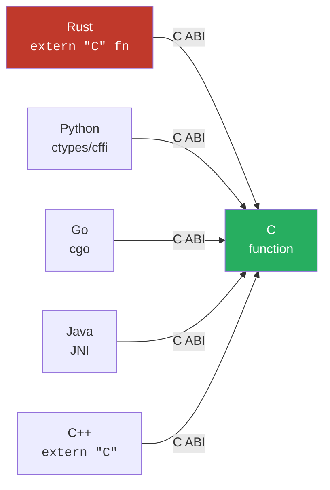
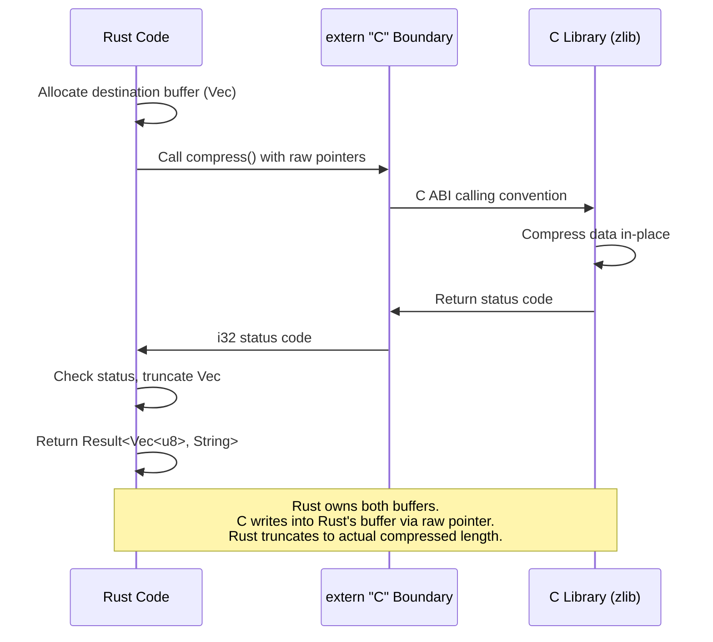

# The `extern "C"` ABI and `bindgen` 🟢

> **What you'll learn:**
> - What an Application Binary Interface (ABI) is and why `extern "C"` matters
> - How to link Rust programs against C libraries (static and dynamic)
> - How to use `bindgen` to automatically generate Rust FFI bindings from C headers
> - The `#[link]` attribute, `build.rs`, and Cargo's linking infrastructure

This chapter marks the beginning of Part II: calling C from Rust. Before we can call a C function, we need to understand the invisible contract that makes cross-language function calls possible — the **Application Binary Interface**.

## What Is an ABI?

An ABI defines how compiled code from different compilers (or languages) can call each other. It specifies:

| ABI Component | What it determines |
|---------------|-------------------|
| **Calling convention** | How are arguments passed? (registers? stack? which registers?) |
| **Return value** | Where does the return value go? (register? pointer?) |
| **Name mangling** | How are function names encoded in the object file? |
| **Stack frame layout** | Who sets up/tears down the stack frame? (caller or callee?) |
| **Struct layout** | How are struct fields ordered and aligned in memory? |

### Rust's default ABI is unstable

Rust **does not guarantee** its internal ABI between compiler versions. A struct compiled by `rustc 1.79` may have a different memory layout than the same struct compiled by `rustc 1.80`. This is intentional — it gives the compiler freedom to optimize.

### The C ABI is the lingua franca

The C ABI (often called the "platform ABI" or "System V ABI" on Linux) is the universal standard. Every language that wants to interoperate — C++, Python, Go, Java (via JNI), Swift — does so by speaking C ABI.



## Your First FFI Call: Calling C's `abs()` from Rust

```rust
// Tell the Rust compiler: "There exists a C function called `abs`
// with this signature. Use the C calling convention."
extern "C" {
    fn abs(n: i32) -> i32;
}

fn main() {
    let result = unsafe { abs(-42) };
    println!("abs(-42) = {result}"); // 42
}
```

### Why is the call `unsafe`?

The compiler cannot verify:
1. That a function called `abs` actually exists in the linked libraries
2. That its signature matches what we declared (C has no type-checking across compilation units)
3. That the function doesn't have side effects or preconditions we don't know about

If we declared `abs` as returning `f64` instead of `i32`, the code would compile but produce garbage — a classic FFI bug.

## Linking Against C Libraries

### The `#[link]` attribute

```rust
// Link against libm (the C math library)
#[link(name = "m")]
extern "C" {
    fn sqrt(x: f64) -> f64;
    fn pow(base: f64, exp: f64) -> f64;
    fn ceil(x: f64) -> f64;
}
```

### Linking kinds

| Kind | Syntax | What it does |
|------|--------|--------------|
| **Dynamic** (default) | `#[link(name = "foo")]` | Links against `libfoo.so` / `libfoo.dylib` / `foo.dll` |
| **Static** | `#[link(name = "foo", kind = "static")]` | Links against `libfoo.a` / `foo.lib` |
| **Framework** (macOS) | `#[link(name = "Security", kind = "framework")]` | Links against `Security.framework` |

### Using `build.rs` for complex linking

For real-world libraries, you typically use a `build.rs` build script:

```rust
// build.rs
fn main() {
    // Tell Cargo where to find the library
    println!("cargo:rustc-link-search=native=/usr/local/lib");
    
    // Link against it
    println!("cargo:rustc-link-lib=static=mylib");
    
    // Re-run if the library changes
    println!("cargo:rerun-if-changed=/usr/local/lib/libmylib.a");
}
```

Or use the `pkg-config` crate for system libraries:

```rust
// build.rs
fn main() {
    pkg_config::Config::new()
        .atleast_version("1.0")
        .probe("libfoo")
        .expect("libfoo not found");
}
```

## `repr(C)`: Making Rust Structs C-Compatible

By default, Rust may reorder struct fields for optimal packing. To match C's layout:

```rust
// ❌ Rust ABI: compiler may reorder fields
struct RustPoint {
    x: f64,
    y: f64,
    label: u8,
}

// ✅ C ABI: fields are in declaration order with C alignment rules
#[repr(C)]
struct CPoint {
    x: f64,
    y: f64,
    label: u8,
    // 7 bytes of padding here (C struct padding rules)
}
```

### `repr(C)` vs Rust default layout

| Property | Rust default | `#[repr(C)]` |
|----------|:---:|:---:|
| Field order | Compiler may reorder | Declaration order |
| Padding | Compiler-optimized | Follows C rules |
| Size deterministic | ❌ (may change across `rustc` versions) | ✅ (matches C compiler) |
| Can pass to C | ❌ | ✅ |
| Can `transmute` safely | ❌ (across compiler versions) | ✅ (if types match) |

## `bindgen`: Automated Binding Generation

Manually writing `extern "C"` declarations is tedious and error-prone. [bindgen](https://rust-lang.github.io/rust-bindgen/) reads C/C++ headers and generates Rust FFI bindings automatically.

### Installation

```bash
cargo install bindgen-cli
# Or use it as a library in build.rs (more common)
```

### Example: Binding to a C library

Given a C header:

```c
// mylib.h
#ifndef MYLIB_H
#define MYLIB_H

#include <stdint.h>

typedef struct {
    double x;
    double y;
} Point;

typedef enum {
    STATUS_OK = 0,
    STATUS_ERROR = 1,
    STATUS_TIMEOUT = 2,
} Status;

Point point_add(Point a, Point b);
Status point_validate(const Point *p);
void point_free(Point *p);

#endif
```

### Using bindgen in `build.rs`

```rust
// build.rs
fn main() {
    println!("cargo:rerun-if-changed=wrapper.h");
    
    let bindings = bindgen::Builder::default()
        .header("wrapper.h")
        // Only generate bindings for our functions (not all of libc)
        .allowlist_function("point_.*")
        .allowlist_type("Point")
        .allowlist_type("Status")
        // Generate Rust enums instead of constants
        .rustified_enum("Status")
        // Derive useful traits
        .derive_debug(true)
        .derive_default(true)
        .derive_copy(true)
        .generate()
        .expect("Unable to generate bindings");
    
    let out_path = std::path::PathBuf::from(std::env::var("OUT_DIR").unwrap());
    bindings
        .write_to_file(out_path.join("bindings.rs"))
        .expect("Couldn't write bindings");
}
```

### Using the generated bindings

```rust
// src/lib.rs
#![allow(non_upper_case_globals)]
#![allow(non_camel_case_types)]
#![allow(non_snake_case)]

// Include the auto-generated bindings
include!(concat!(env!("OUT_DIR"), "/bindings.rs"));

// Now we can use the generated types and functions:
pub fn add_points(a: Point, b: Point) -> Point {
    unsafe { point_add(a, b) }
}
```

### What bindgen generates

```rust
// Generated by bindgen (simplified)
#[repr(C)]
#[derive(Debug, Default, Copy, Clone)]
pub struct Point {
    pub x: f64,
    pub y: f64,
}

#[repr(u32)]
#[derive(Debug, Copy, Clone, PartialEq, Eq)]
pub enum Status {
    STATUS_OK = 0,
    STATUS_ERROR = 1,
    STATUS_TIMEOUT = 2,
}

extern "C" {
    pub fn point_add(a: Point, b: Point) -> Point;
    pub fn point_validate(p: *const Point) -> Status;
    pub fn point_free(p: *mut Point);
}
```

## Type Mappings: C Types → Rust Types

| C type | Rust type | Notes |
|--------|-----------|-------|
| `int` | `c_int` (`i32` on most platforms) | Use `std::ffi::c_int` for portability |
| `unsigned int` | `c_uint` | |
| `long` | `c_long` | 32-bit on Windows, 64-bit on LP64 Unix |
| `size_t` | `usize` | Always pointer-width |
| `float` | `f32` | |
| `double` | `f64` | |
| `char` | `c_char` | Signed or unsigned depending on platform! |
| `const char *` | `*const c_char` | See Chapter 5 for string handling |
| `void *` | `*mut c_void` | Opaque pointer — see Chapter 7 |
| `bool` (`_Bool`) | `bool` | C's `_Bool` and Rust's `bool` have same repr |
| `int32_t` | `i32` | Fixed-width types map directly |
| `uint8_t` | `u8` | |

> **Critical:** Use `std::ffi::c_int`, `std::ffi::c_long`, etc. instead of raw `i32`/`i64`. The C types have **platform-dependent sizes** that `std::ffi` types handle correctly.

## Calling Conventions: Beyond `extern "C"`

| Convention | Syntax | Platform | Use case |
|-----------|--------|----------|----------|
| C | `extern "C"` | Universal | Default for FFI |
| System | `extern "system"` | Windows | Win32 API (`stdcall` on x86, C on x64) |
| Rust | `extern "Rust"` / default | Rust only | Normal Rust functions |
| C-unwind | `extern "C-unwind"` | Universal | C ABI that allows Rust panics to propagate |

```rust
// Win32 API example (Windows)
#[cfg(windows)]
extern "system" {
    fn GetLastError() -> u32;
    fn SetLastError(dwErrCode: u32);
}
```

## Complete Example: Calling `zlib` for Compression

```rust
// build.rs
fn main() {
    pkg_config::probe_library("zlib").expect("zlib not found");
}
```

```rust
// src/lib.rs
use std::ffi::{c_int, c_ulong, c_uchar};

extern "C" {
    fn compress(
        dest: *mut c_uchar,
        dest_len: *mut c_ulong,
        source: *const c_uchar,
        source_len: c_ulong,
    ) -> c_int;
}

const Z_OK: c_int = 0;

pub fn zlib_compress(data: &[u8]) -> Result<Vec<u8>, String> {
    let mut dest_len: c_ulong = (data.len() + data.len() / 1000 + 12) as c_ulong;
    let mut dest = vec![0u8; dest_len as usize];
    
    let result = unsafe {
        compress(
            dest.as_mut_ptr(),
            &mut dest_len,
            data.as_ptr(),
            data.len() as c_ulong,
        )
    };
    
    if result == Z_OK {
        dest.truncate(dest_len as usize);
        Ok(dest)
    } else {
        Err(format!("zlib compress failed with code {result}"))
    }
}
```



<details>
<summary><strong>🏋️ Exercise: Bind to a C Math Function</strong> (click to expand)</summary>

Write a Rust program that calls C's `hypot(x, y)` function (from `libm`) to compute the hypotenuse of a right triangle, and wraps it in a safe Rust function. Your wrapper should:

1. Declare the `extern "C"` binding with the correct types
2. Wrap it in a safe function `safe_hypot(x: f64, y: f64) -> f64`
3. Call it and verify the result against Rust's `f64::hypot`

<details>
<summary>🔑 Solution</summary>

```rust
use std::ffi::c_double;

// Declare the C function. On most Unix systems, libm is
// automatically linked. On some, you need #[link(name = "m")].
#[link(name = "m")]
extern "C" {
    /// Computes sqrt(x² + y²) without intermediate overflow/underflow.
    fn hypot(x: c_double, y: c_double) -> c_double;
}

/// Safe wrapper around C's `hypot()`.
///
/// This is safe because `hypot` is a pure mathematical function
/// with no preconditions: all f64 inputs (including NaN, Inf)
/// produce defined results per IEEE 754.
pub fn safe_hypot(x: f64, y: f64) -> f64 {
    // SAFETY: hypot is a pure function with no preconditions.
    // All f64 bit patterns are valid inputs. It does not access
    // global state, allocate memory, or have side effects.
    unsafe { hypot(x, y) }
}

#[cfg(test)]
mod tests {
    use super::*;
    
    #[test]
    fn test_3_4_5_triangle() {
        let result = safe_hypot(3.0, 4.0);
        assert!((result - 5.0).abs() < f64::EPSILON);
    }
    
    #[test]
    fn matches_rust_stdlib() {
        let (x, y) = (7.5, 13.2);
        let c_result = safe_hypot(x, y);
        let rust_result = x.hypot(y);
        assert!((c_result - rust_result).abs() < f64::EPSILON,
            "C hypot = {c_result}, Rust hypot = {rust_result}");
    }
    
    #[test]
    fn handles_special_values() {
        assert!(safe_hypot(f64::NAN, 1.0).is_nan());
        assert!(safe_hypot(f64::INFINITY, 1.0).is_infinite());
    }
}
```

</details>
</details>

> **Key Takeaways:**
> - The **C ABI** is the universal calling convention for cross-language interop — Rust uses `extern "C"` to speak it
> - Use `#[repr(C)]` on any struct or enum that crosses the FFI boundary
> - **`bindgen`** automates the tedious and error-prone work of translating C headers into Rust declarations
> - Use `std::ffi::c_int`, `c_long`, etc. for portable type mappings — **not** hard-coded `i32`/`i64`
> - All FFI calls are `unsafe` because the compiler cannot verify the C side's correctness
> - Use `build.rs` and `pkg-config` for robust library discovery and linking

> **See also:**
> - [Chapter 5: Strings, Nulls, and Memory Boundaries](ch05-strings-nulls-and-memory-boundaries.md) — the trickiest part of C↔Rust type translation
> - [Chapter 6: Exposing Rust to C](ch06-exposing-safe-rust-to-the-outside-world.md) — the reverse direction
> - [Rust for C/C++ Programmers](../c-cpp-book/src/SUMMARY.md) — comprehensive C/C++ to Rust bridge guide
> - [Rust Engineering Practices](../engineering-book/src/SUMMARY.md) — build scripts, cross-compilation, CI/CD
