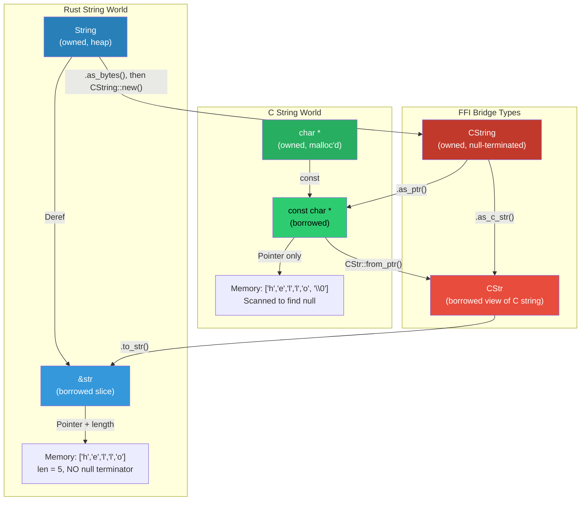

# Strings, Nulls, and Memory Boundaries 🟡

> **What you'll learn:**
> - Why string handling is the #1 source of FFI bugs — and the mental model to avoid them
> - The full `CString` (owned) vs `CStr` (borrowed) lifecycle and their relationship to `String`/`&str`
> - How to handle `*const c_char` coming from C and going to C
> - The **golden rule of FFI memory**: whoever allocated it must free it

Strings are the most dangerous type in FFI. Not because they're inherently complex, but because C and Rust have fundamentally different ideas about what a "string" is. Getting this wrong leads to null-pointer dereferences, buffer overflows, double-frees, and use-after-free — the entire rogues' gallery of memory safety bugs.

## Two Worlds of Strings

| Property | Rust `String` / `&str` | C `char *` / `const char *` |
|----------|:---:|:---:|
| Encoding | Always valid UTF-8 | Arbitrary bytes (usually ASCII or locale-dependent) |
| Null terminator | ❌ Not null-terminated | ✅ Null-terminated (convention) |
| Embedded nulls | ✅ Allowed (`\0` is a valid byte) | ❌ Null terminates the string |
| Length tracking | ✅ Stored alongside data (`len` field) | ❌ Determined by scanning for `\0` |
| Allocation | `String` owns its buffer | Caller must know who owns the buffer |

These differences mean you **cannot** simply cast a Rust `&str` to `*const c_char` and hand it to C — the C code will look for a null terminator that doesn't exist (or exists in the wrong place).



## The FFI String Types

### `CString` — Owned, Null-Terminated Bytes

`CString` is Rust's owned, heap-allocated, null-terminated byte string. It's designed to be created from Rust data and passed to C.

```rust
use std::ffi::CString;

// Create a CString from a Rust &str
let greeting = CString::new("Hello, C!").expect("CString::new failed");

// Get a raw pointer to pass to C
let ptr: *const std::ffi::c_char = greeting.as_ptr();

// CRITICAL: `greeting` must stay alive as long as `ptr` is used!
// The pointer is only valid while `greeting` is not dropped.
```

### `CStr` — Borrowed, Null-Terminated Bytes

`CStr` is a borrowed view of a null-terminated byte string. It's designed to wrap raw pointers coming *from* C.

```rust
use std::ffi::{CStr, c_char};

extern "C" {
    fn get_version() -> *const c_char;
}

fn version() -> String {
    unsafe {
        let ptr = get_version();
        // SAFETY: get_version() returns a valid, null-terminated string
        // that remains valid for the 'static lifetime.
        let c_str = CStr::from_ptr(ptr);
        c_str.to_str()
            .expect("version string is not valid UTF-8")
            .to_owned()
    }
}
```

## The Conversion Matrix

| From → To | Method | May fail? | Allocates? |
|-----------|--------|-----------|------------|
| `&str` → `CString` | `CString::new(s)` | ✅ If `s` contains `\0` | ✅ Allocates |
| `CString` → `*const c_char` | `cs.as_ptr()` | ❌ | ❌ |
| `CString` → `&CStr` | `cs.as_c_str()` | ❌ | ❌ |
| `*const c_char` → `&CStr` | `CStr::from_ptr(ptr)` | ❌ (but `unsafe`) | ❌ |
| `&CStr` → `&str` | `cstr.to_str()` | ✅ If not valid UTF-8 | ❌ |
| `&CStr` → `String` | `cstr.to_string_lossy().into_owned()` | ❌ (replaces invalid UTF-8 with `�`) | ✅ |
| `String` → `CString` | `CString::new(s)` | ✅ If `s` contains `\0` | May reuse buffer |

## Passing Strings: Rust → C

### Pattern 1: Rust creates, C borrows

```rust
use std::ffi::{CString, c_char, c_int};

extern "C" {
    fn puts(s: *const c_char) -> c_int;
}

fn print_message(msg: &str) {
    // Step 1: Create a CString (adds null terminator, checks for interior nulls)
    let c_msg = CString::new(msg).expect("msg contains a null byte");
    
    // Step 2: Get the raw pointer
    // SAFETY: puts() reads the string synchronously and does not store the pointer.
    // c_msg outlives this call.
    unsafe { puts(c_msg.as_ptr()); }
    
    // Step 3: c_msg is dropped here — memory is freed
}
```

### The dangling pointer trap

```rust
use std::ffi::{CString, c_char};

extern "C" {
    fn register_name(name: *const c_char);
}

fn bad_register(name: &str) {
    // 💥 UB: CString is a TEMPORARY — dropped at the end of the expression!
    let ptr = CString::new(name).unwrap().as_ptr();
    // `ptr` is now DANGLING — the CString was dropped on the line above.
    unsafe { register_name(ptr); } // 💥 Use-after-free
}

fn good_register(name: &str) {
    // ✅ FIX: Bind CString to a variable so it lives long enough
    let c_name = CString::new(name).unwrap();
    unsafe { register_name(c_name.as_ptr()); }
    // c_name is dropped here — after the FFI call
}
```

> **Rule:** Never call `.as_ptr()` on a temporary `CString`. Always bind it to a variable first.

## Receiving Strings: C → Rust

### Pattern 2: C owns the string, Rust borrows

```rust
use std::ffi::{CStr, c_char};

extern "C" {
    /// Returns a pointer to a static string. Caller must NOT free it.
    fn library_version() -> *const c_char;
}

fn get_version() -> &'static str {
    unsafe {
        let ptr = library_version();
        assert!(!ptr.is_null(), "library_version returned null");
        
        // SAFETY: The C library guarantees this pointer is:
        // 1. Non-null (we just checked)
        // 2. Points to a valid null-terminated string
        // 3. Valid for 'static lifetime (static string in the C library)
        CStr::from_ptr(ptr)
            .to_str()
            .expect("version is not valid UTF-8")
    }
}
```

### Pattern 3: C allocates, Rust must copy and NOT free

```rust
use std::ffi::{CStr, c_char};

extern "C" {
    /// Returns a pointer to an internal buffer. Valid until the next call.
    /// Caller must NOT free this pointer.
    fn get_error_message() -> *const c_char;
}

fn last_error() -> String {
    unsafe {
        let ptr = get_error_message();
        if ptr.is_null() {
            return String::from("(no error)");
        }
        // Copy the string into Rust-owned memory immediately,
        // because the C library may overwrite the buffer on the next call.
        CStr::from_ptr(ptr)
            .to_string_lossy()
            .into_owned()
    }
}
```

### Pattern 4: C allocates, Rust must take ownership and free with C's allocator

```rust
use std::ffi::{CStr, CString, c_char};

extern "C" {
    /// Returns a newly allocated string. Caller must free it with `free_string`.
    fn compute_result() -> *mut c_char;
    fn free_string(s: *mut c_char);
}

fn get_result() -> String {
    unsafe {
        let ptr = compute_result();
        assert!(!ptr.is_null(), "compute_result returned null");
        
        // Copy the content into a Rust String
        let result = CStr::from_ptr(ptr)
            .to_string_lossy()
            .into_owned();
        
        // Free the C-allocated memory using C's own free function!
        // DO NOT use Rust's allocator (drop, Box::from_raw, etc.)
        free_string(ptr);
        
        result
    }
}
```

## The Golden Rule of FFI Memory

> **Whoever allocated the memory must free it.**

This is the single most important rule for FFI correctness:

| Allocated by | Must be freed by | Method |
|-------------|-----------------|--------|
| Rust (`Box`, `Vec`, `String`, `CString`) | Rust | `drop()`, `Box::from_raw()` |
| C (`malloc`, `calloc`, custom allocator) | C | The C library's free function |
| C++ (`new`, `std::make_unique`) | C++ | The C++ library's destructor/free function |

**Mixing allocators is UB.** Rust and C may use different allocators (jemalloc, mimalloc, the system allocator). Freeing a Rust `Box` with C's `free()` or a C `malloc` with Rust's `drop` is undefined behavior.

```rust
// 💥 UB: Freeing C memory with Rust's allocator
extern "C" {
    fn get_data() -> *mut u8;
}

fn wrong() {
    let ptr = unsafe { get_data() };
    // 💥 UB: Box was not allocated by Rust's allocator!
    let _boxed = unsafe { Box::from_raw(ptr) };
    // Drop calls Rust's dealloc, but the memory came from C's malloc
}
```

## Handling Null Pointers

C uses null pointers extensively to indicate "no value" or "error." Rust's `Option` type is the idiomatic equivalent.

```rust
use std::ffi::{CStr, c_char};

extern "C" {
    /// Returns the value for `key`, or NULL if not found.
    fn config_get(key: *const c_char) -> *const c_char;
}

fn get_config(key: &str) -> Option<String> {
    let c_key = std::ffi::CString::new(key).ok()?;
    
    unsafe {
        let ptr = config_get(c_key.as_ptr());
        if ptr.is_null() {
            None  // C returned NULL → Rust None
        } else {
            Some(CStr::from_ptr(ptr).to_string_lossy().into_owned())
        }
    }
}
```

### `std::ptr::null()` and `std::ptr::null_mut()`

When you need to pass null to C:

```rust
use std::ptr;
use std::ffi::c_char;

extern "C" {
    fn init(config_path: *const c_char) -> i32;
}

fn init_default() -> i32 {
    // Pass null to C to mean "use defaults"
    unsafe { init(ptr::null()) }
}
```

## Byte Strings: When UTF-8 Is Not Guaranteed

Sometimes C strings are not valid UTF-8 (file paths on Unix, legacy encodings). Use `CStr::to_bytes()` to get the raw bytes:

```rust
use std::ffi::{CStr, c_char};

extern "C" {
    fn get_filename() -> *const c_char;
}

fn filename_as_bytes() -> Vec<u8> {
    unsafe {
        let ptr = get_filename();
        if ptr.is_null() {
            return Vec::new();
        }
        CStr::from_ptr(ptr).to_bytes().to_vec()
    }
}
```

For file paths specifically, use `std::ffi::OsString`:

```rust
use std::ffi::{CStr, OsString, c_char};
use std::os::unix::ffi::OsStringExt;

fn filename_as_path() -> std::path::PathBuf {
    unsafe {
        let ptr = get_filename();
        if ptr.is_null() {
            return std::path::PathBuf::new();
        }
        let bytes = CStr::from_ptr(ptr).to_bytes().to_vec();
        OsString::from_vec(bytes).into()
    }
}
```

## Common Mistakes and Their Fixes

### Mistake 1: Passing `&str` directly as `*const c_char`

```rust
// 💥 WRONG: &str is NOT null-terminated
fn bad(s: &str) {
    let ptr = s.as_ptr() as *const c_char;
    unsafe { puts(ptr); } // C reads past the end looking for \0
}

// ✅ FIX: Use CString
fn good(s: &str) {
    let c_s = CString::new(s).unwrap();
    unsafe { puts(c_s.as_ptr()); }
}
```

### Mistake 2: Forgetting that `CString::new` fails on interior nulls

```rust
// This will panic (or return Err if you use ?)
let s = CString::new("hello\0world"); // ❌ NulError

// ✅ FIX: Either escape the null or handle the error
match CString::new(user_input) {
    Ok(c_str) => { /* use it */ }
    Err(e) => {
        let nul_position = e.nul_position();
        eprintln!("Input contains null byte at position {nul_position}");
    }
}
```

### Mistake 3: Using `CStr::from_ptr` on a non-null-terminated buffer

```rust
// If the C function returns a fixed-length buffer without null terminator:
extern "C" {
    fn read_fixed(buf: *mut u8, len: usize) -> usize;
}

fn read_data() -> String {
    let mut buf = vec![0u8; 256];
    let n = unsafe { read_fixed(buf.as_mut_ptr(), buf.len()) };
    
    // ❌ DON'T use CStr::from_ptr — the buffer might not be null-terminated
    // ✅ Use std::str::from_utf8 on the known-length slice
    String::from_utf8_lossy(&buf[..n]).into_owned()
}
```

<details>
<summary><strong>🏋️ Exercise: Safe String Wrapper</strong> (click to expand)</summary>

Write a safe wrapper around these mock C functions. Handle all edge cases: null returns, invalid UTF-8, interior nulls in input, and memory ownership.

```rust
// Pretend these are real C functions
extern "C" {
    /// Sets the user's display name. Takes a null-terminated string.
    /// Returns 0 on success, -1 on failure.
    fn set_display_name(name: *const c_char) -> c_int;
    
    /// Gets the user's display name.
    /// Returns a pointer to an internally-managed string (do NOT free).
    /// Returns NULL if no name is set.
    fn get_display_name() -> *const c_char;
}
```

Write `safe_set_name(name: &str) -> Result<(), String>` and `safe_get_name() -> Option<String>`.

<details>
<summary>🔑 Solution</summary>

```rust
use std::ffi::{CStr, CString, c_char, c_int};

extern "C" {
    fn set_display_name(name: *const c_char) -> c_int;
    fn get_display_name() -> *const c_char;
}

/// Sets the user's display name.
///
/// Returns `Err` if the name contains an interior null byte
/// or if the C function returns a failure code.
pub fn safe_set_name(name: &str) -> Result<(), String> {
    // CString::new handles the interior-null check
    let c_name = CString::new(name)
        .map_err(|e| format!("name contains null byte at position {}", e.nul_position()))?;
    
    // SAFETY: c_name is a valid, null-terminated string.
    // c_name outlives this call (it's alive until end of this function).
    // set_display_name reads the string synchronously and copies it internally.
    let result = unsafe { set_display_name(c_name.as_ptr()) };
    
    if result == 0 {
        Ok(())
    } else {
        Err(format!("set_display_name failed with code {result}"))
    }
}

/// Gets the user's display name, if set.
///
/// Returns `None` if no name is set (C function returned null).
/// Returns `Some` with a copy of the name string.
/// Non-UTF-8 bytes are replaced with the Unicode replacement character.
pub fn safe_get_name() -> Option<String> {
    // SAFETY: get_display_name returns either null or a pointer to a
    // valid, null-terminated, internally-managed string.
    unsafe {
        let ptr = get_display_name();
        
        // Handle null (no name set)
        if ptr.is_null() {
            return None;
        }
        
        // Borrow the C string. We immediately copy it into a Rust String
        // because we don't control the lifetime of the C-managed buffer.
        let c_str = CStr::from_ptr(ptr);
        
        // Use to_string_lossy to handle non-UTF-8 gracefully
        // (.to_str() would return Err on invalid UTF-8)
        Some(c_str.to_string_lossy().into_owned())
    }
}

#[cfg(test)]
mod tests {
    use super::*;
    
    #[test]
    fn rejects_interior_null() {
        let result = safe_set_name("hello\0world");
        assert!(result.is_err());
        assert!(result.unwrap_err().contains("null byte at position 5"));
    }
}
```

</details>
</details>

> **Key Takeaways:**
> - Rust strings (`String`/`&str`) are UTF-8, length-tracked, NOT null-terminated. C strings are null-terminated byte arrays.
> - Use `CString` (owned) to send strings **to** C. Use `CStr` (borrowed) to receive strings **from** C.
> - **Never** call `.as_ptr()` on a temporary `CString` — bind it to a variable first
> - **Whoever allocated the memory must free it.** Never free C memory with Rust's allocator or vice versa.
> - Always check for null before calling `CStr::from_ptr`. Always handle `CString::new` errors (interior nulls).
> - For non-UTF-8 data, use `to_string_lossy()` or work with raw bytes via `to_bytes()`

> **See also:**
> - [Chapter 4: The extern "C" ABI](ch04-the-extern-c-abi-and-bindgen.md) — type mappings and calling conventions
> - [Chapter 7: Opaque Pointers](ch07-opaque-pointers-and-manual-memory-management.md) — extending the ownership model to complex types
> - [Rust Memory Management](../memory-management-book/src/SUMMARY.md) — ownership, borrowing, and smart pointer fundamentals
