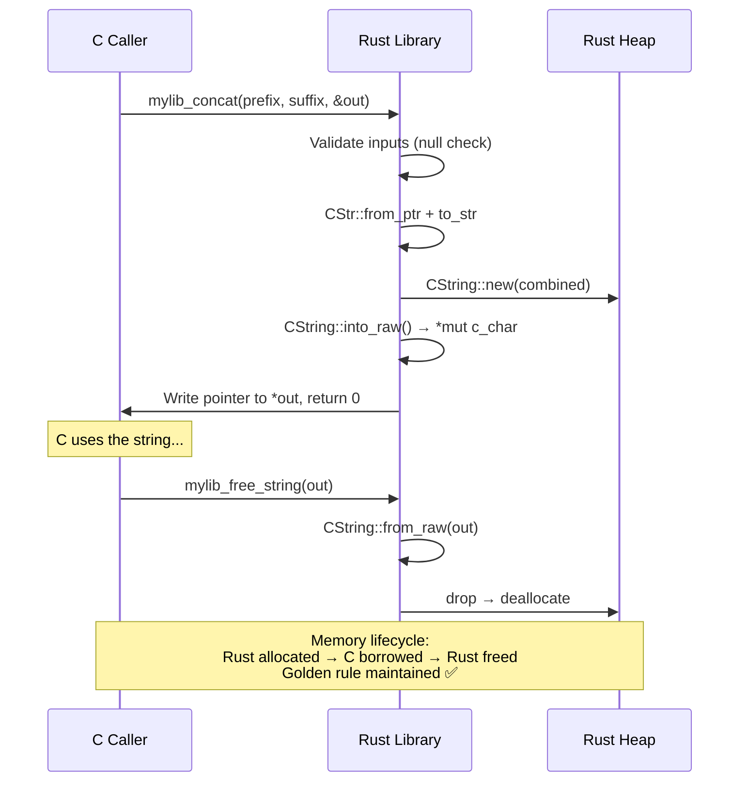

# Exposing Safe Rust to the Outside World 🟡

> **What you'll learn:**
> - How to make Rust functions callable from C using `#[no_mangle]` and `extern "C" fn`
> - How to build Rust as a **static library** (`staticlib`) or **dynamic library** (`cdylib`) for C consumption
> - How to use `cbindgen` to automatically generate C/C++ headers from your Rust code
> - The rules for panic safety at the FFI boundary

The previous two chapters covered calling C *from* Rust. Now we reverse direction: exposing Rust functionality so that C, C++, Python, Swift, or any language that speaks the C ABI can call it. This is essential for:

- Embedding Rust components in existing C/C++ codebases
- Building shared libraries for language-agnostic consumption
- Creating plugins and extensions (e.g., Python native modules, Node.js addons)
- Replacing performance-critical C code incrementally with Rust

## Your First Exported Rust Function

```rust
// src/lib.rs

/// Add two integers. Callable from C.
#[no_mangle]
pub extern "C" fn rust_add(a: i32, b: i32) -> i32 {
    a + b
}
```

What C sees:

```c
// Generated or hand-written header
int32_t rust_add(int32_t a, int32_t b);
```

Let's break down each component:

| Component | Purpose |
|-----------|---------|
| `#[no_mangle]` | Prevents Rust from name-mangling the function. Without it, the symbol might be called `_ZN7mylib8rust_add17h9d3f6a8b7c2e1f4aE` instead of `rust_add` |
| `pub` | Makes the function visible outside the crate |
| `extern "C"` | Uses the C calling convention (argument passing, stack frame layout) |
| `fn` | Regular function definition |

## Building as a C-Compatible Library

### Cargo.toml configuration

```toml
[package]
name = "mylib"
version = "0.1.0"
edition = "2024"

[lib]
crate-type = ["cdylib", "staticlib"]
```

| Crate type | Output | Use case |
|-----------|--------|----------|
| `staticlib` | `libmylib.a` (Unix) / `mylib.lib` (Windows) | Linked at compile time into a C/C++ executable |
| `cdylib` | `libmylib.so` (Linux) / `libmylib.dylib` (macOS) / `mylib.dll` (Windows) | Loaded at runtime via `dlopen` / `LoadLibrary` |
| `rlib` | Default Rust library | Not usable from C — Rust-only |

### Building

```bash
cargo build --release
# Outputs: target/release/libmylib.a and target/release/libmylib.so (or .dylib)
```

### Calling from C

```c
// main.c
#include <stdio.h>
#include <stdint.h>

// Declare the Rust function
int32_t rust_add(int32_t a, int32_t b);

int main(void) {
    int32_t result = rust_add(3, 4);
    printf("3 + 4 = %d\n", result);  // 3 + 4 = 7
    return 0;
}
```

```bash
# Compile and link
gcc main.c -L target/release -lmylib -lpthread -ldl -o main
./main
```

> **Note:** The `-lpthread -ldl` flags are needed because Rust's standard library depends on pthreads and dynamic linking, even for simple functions.

## `cbindgen`: Automatic C Header Generation

Just as `bindgen` generates Rust from C headers, [cbindgen](https://github.com/mozilla/cbindgen) generates C/C++ headers from Rust source code.

### Installation

```bash
cargo install cbindgen
```

### Configuration

```toml
# cbindgen.toml
language = "C"
include_guard = "MYLIB_H"
autogen_warning = "/* Warning: this file is autogenerated by cbindgen. Do not modify. */"

[export]
include = ["Point", "Status"]

[fn]
# Prefix all exported functions
prefix = "mylib_"
```

### Rust source

```rust
// src/lib.rs

/// A 2D point.
#[repr(C)]
pub struct Point {
    pub x: f64,
    pub y: f64,
}

/// Status codes returned by library functions.
#[repr(C)]
pub enum Status {
    Ok = 0,
    InvalidInput = 1,
    OutOfMemory = 2,
}

/// Compute the distance between two points.
#[no_mangle]
pub extern "C" fn mylib_distance(a: &Point, b: &Point) -> f64 {
    ((a.x - b.x).powi(2) + (a.y - b.y).powi(2)).sqrt()
}

/// Create a new point at the origin.
#[no_mangle]
pub extern "C" fn mylib_origin() -> Point {
    Point { x: 0.0, y: 0.0 }
}
```

### Generate the header

```bash
cbindgen --config cbindgen.toml --crate mylib --output mylib.h
```

### Generated header

```c
/* Warning: this file is autogenerated by cbindgen. Do not modify. */

#ifndef MYLIB_H
#define MYLIB_H

#include <stdarg.h>
#include <stdbool.h>
#include <stdint.h>
#include <stdlib.h>

typedef struct Point {
  double x;
  double y;
} Point;

typedef enum Status {
  Ok = 0,
  InvalidInput = 1,
  OutOfMemory = 2,
} Status;

double mylib_distance(const struct Point *a, const struct Point *b);

struct Point mylib_origin(void);

#endif /* MYLIB_H */
```

## Panic Safety at the FFI Boundary

**Unwinding across an `extern "C"` boundary is Undefined Behavior.** If a Rust function marked `extern "C"` panics and the panic tries to unwind past the FFI boundary, the behavior is undefined. This is because C has no stack unwinding mechanism compatible with Rust's.

```rust
// 💥 UB: Panic unwinds across the C ABI boundary
#[no_mangle]
pub extern "C" fn risky_divide(a: i32, b: i32) -> i32 {
    a / b // panics if b == 0 — UB!
}
```

### Solution 1: `catch_unwind`

```rust
use std::panic;

#[no_mangle]
pub extern "C" fn safe_divide(a: i32, b: i32, result: *mut i32) -> i32 {
    let outcome = panic::catch_unwind(|| {
        if b == 0 {
            return Err(-1i32);
        }
        Ok(a / b)
    });
    
    match outcome {
        Ok(Ok(val)) => {
            if !result.is_null() {
                unsafe { *result = val; }
            }
            0 // success
        }
        Ok(Err(code)) => code, // handled error
        Err(_) => -2, // panic occurred — converted to error code
    }
}
```

### Solution 2: `extern "C-unwind"` (Rust 1.71+)

The `extern "C-unwind"` ABI allows panics to propagate through C frames — **if** the C code was compiled with compatible unwinding (e.g., `-fexceptions` in GCC). This is useful when Rust calls C which calls back into Rust:

```rust
// Rust → C (with C-unwind) → Rust callback that panics
// The panic can propagate back through the C frame safely.
extern "C-unwind" fn my_callback() {
    panic!("this is okay with C-unwind");
}
```

> **Practical guidance:** For most FFI, use `extern "C"` + `catch_unwind`. Use `extern "C-unwind"` only when you control both sides and understand the unwinding implications.

## Returning Complex Data: The Error Pattern

C APIs typically return error codes (integers) and write output through pointer parameters. Here's the idiomatic pattern:

```rust
use std::ffi::{CStr, CString, c_char, c_int};
use std::ptr;

/// Concatenates `prefix` and `suffix` into a newly allocated string.
/// On success, writes the result pointer to `*out` and returns 0.
/// On failure, returns a negative error code and does NOT write to `*out`.
///
/// The caller must free the returned string with `mylib_free_string`.
#[no_mangle]
pub extern "C" fn mylib_concat(
    prefix: *const c_char,
    suffix: *const c_char,
    out: *mut *mut c_char,
) -> c_int {
    // Validate inputs
    if prefix.is_null() || suffix.is_null() || out.is_null() {
        return -1; // NULL_INPUT error
    }
    
    let result = std::panic::catch_unwind(|| {
        let p = unsafe { CStr::from_ptr(prefix) }.to_str().map_err(|_| -2)?;
        let s = unsafe { CStr::from_ptr(suffix) }.to_str().map_err(|_| -2)?;
        
        let combined = format!("{p}{s}");
        CString::new(combined).map_err(|_| -3)
    });
    
    match result {
        Ok(Ok(c_string)) => {
            // Transfer ownership to C: into_raw() prevents Rust from dropping it
            unsafe { *out = c_string.into_raw(); }
            0 // success
        }
        Ok(Err(code)) => code,
        Err(_) => -99, // panic caught
    }
}

/// Frees a string previously returned by `mylib_concat`.
#[no_mangle]
pub extern "C" fn mylib_free_string(s: *mut c_char) {
    if !s.is_null() {
        // SAFETY: This pointer was created by CString::into_raw() in mylib_concat.
        // It was allocated by Rust's allocator and is being freed by Rust's allocator.
        unsafe { drop(CString::from_raw(s)); }
    }
}
```



## Exporting Structs

Only `#[repr(C)]` structs can cross the FFI boundary:

```rust
#[repr(C)]
pub struct Config {
    pub max_connections: u32,
    pub timeout_ms: u64,
    pub verbose: bool,
}

#[no_mangle]
pub extern "C" fn mylib_default_config() -> Config {
    Config {
        max_connections: 100,
        timeout_ms: 5000,
        verbose: false,
    }
}

#[no_mangle]
pub extern "C" fn mylib_apply_config(config: *const Config) -> c_int {
    if config.is_null() {
        return -1;
    }
    let config = unsafe { &*config };
    
    // Use the config...
    println!("Max connections: {}", config.max_connections);
    0
}
```

## Slices and Arrays Across the Boundary

Rust slices (`&[T]`) are fat pointers (data + length). C expects thin pointers plus a separate length parameter:

```rust
/// Process an array of integers.
/// `data` must point to at least `len` valid i32 values.
#[no_mangle]
pub extern "C" fn mylib_sum(data: *const i32, len: usize) -> i64 {
    if data.is_null() || len == 0 {
        return 0;
    }
    
    // SAFETY: caller guarantees data points to len valid i32 values
    let slice = unsafe { std::slice::from_raw_parts(data, len) };
    slice.iter().map(|&x| x as i64).sum()
}
```

What C sees:

```c
int64_t mylib_sum(const int32_t *data, size_t len);
```

<details>
<summary><strong>🏋️ Exercise: Export a Key-Value Store</strong> (click to expand)</summary>

Build a simple key-value store in Rust and expose it to C via FFI. Requirements:

1. Export functions: `kvstore_new()`, `kvstore_set(store, key, value)`, `kvstore_get(store, key)`, `kvstore_free(store)`
2. The store should be an opaque pointer from C's perspective (hint: `Box::into_raw` and `Box::from_raw`)
3. Handle null inputs gracefully
4. Ensure panic safety at all FFI boundaries
5. Generate a C header (describe what `cbindgen` would produce)

<details>
<summary>🔑 Solution</summary>

```rust
use std::collections::HashMap;
use std::ffi::{CStr, CString, c_char, c_int};
use std::panic;

/// An opaque key-value store.
pub struct KVStore {
    data: HashMap<String, String>,
}

/// Creates a new, empty key-value store.
/// Returns an opaque pointer. Caller must free with `kvstore_free`.
#[no_mangle]
pub extern "C" fn kvstore_new() -> *mut KVStore {
    let store = Box::new(KVStore {
        data: HashMap::new(),
    });
    Box::into_raw(store)
}

/// Sets a key-value pair. Overwrites existing values.
/// Returns 0 on success, -1 on null input, -2 on invalid UTF-8.
#[no_mangle]
pub extern "C" fn kvstore_set(
    store: *mut KVStore,
    key: *const c_char,
    value: *const c_char,
) -> c_int {
    if store.is_null() || key.is_null() || value.is_null() {
        return -1;
    }
    
    let result = panic::catch_unwind(|| {
        // SAFETY: We checked for null. The caller guarantees valid
        // null-terminated strings and that `store` was created by kvstore_new.
        unsafe {
            let store = &mut *store;
            let key = CStr::from_ptr(key).to_str().map_err(|_| -2)?;
            let value = CStr::from_ptr(value).to_str().map_err(|_| -2)?;
            store.data.insert(key.to_owned(), value.to_owned());
            Ok(0)
        }
    });
    
    match result {
        Ok(Ok(code)) => code,
        Ok(Err(code)) => code,
        Err(_) => -99,
    }
}

/// Gets a value by key.
/// Returns a newly allocated string on success (caller must free with kvstore_free_string).
/// Returns NULL if the key is not found or inputs are invalid.
#[no_mangle]
pub extern "C" fn kvstore_get(
    store: *const KVStore,
    key: *const c_char,
) -> *mut c_char {
    if store.is_null() || key.is_null() {
        return std::ptr::null_mut();
    }
    
    let result = panic::catch_unwind(|| {
        unsafe {
            let store = &*store;
            let key = CStr::from_ptr(key).to_str().ok()?;
            let value = store.data.get(key)?;
            CString::new(value.as_str()).ok()
        }
    });
    
    match result {
        Ok(Some(c_string)) => c_string.into_raw(),
        _ => std::ptr::null_mut(),
    }
}

/// Frees a string returned by `kvstore_get`.
#[no_mangle]
pub extern "C" fn kvstore_free_string(s: *mut c_char) {
    if !s.is_null() {
        // SAFETY: pointer was created by CString::into_raw
        unsafe { drop(CString::from_raw(s)); }
    }
}

/// Destroys the key-value store and frees all memory.
#[no_mangle]
pub extern "C" fn kvstore_free(store: *mut KVStore) {
    if !store.is_null() {
        // SAFETY: pointer was created by Box::into_raw in kvstore_new.
        // Taking ownership via Box::from_raw triggers Drop,
        // which frees the HashMap and all owned Strings.
        unsafe { drop(Box::from_raw(store)); }
    }
}

// What cbindgen would generate:
//
// typedef struct KVStore KVStore;  /* opaque */
//
// KVStore *kvstore_new(void);
// int kvstore_set(KVStore *store, const char *key, const char *value);
// char *kvstore_get(const KVStore *store, const char *key);
// void kvstore_free_string(char *s);
// void kvstore_free(KVStore *store);
```

</details>
</details>

> **Key Takeaways:**
> - `#[no_mangle] pub extern "C" fn` is the recipe for making any Rust function callable from C
> - Build with `crate-type = ["cdylib", "staticlib"]` to produce libraries C can link against
> - **Panics across `extern "C"` boundaries are UB** — use `std::panic::catch_unwind` or `extern "C-unwind"`
> - Use `cbindgen` to auto-generate C headers from annotated Rust code
> - Only `#[repr(C)]` types have guaranteed layout that C can understand
> - Pass slices as `(pointer, length)` pairs — C doesn't have fat pointers

> **See also:**
> - [Chapter 5: Strings, Nulls, and Memory](ch05-strings-nulls-and-memory-boundaries.md) — handling strings across the boundary
> - [Chapter 7: Opaque Pointers](ch07-opaque-pointers-and-manual-memory-management.md) — passing complex Rust types as `void*` to C
> - [Chapter 8: Safe Abstractions](ch08-safe-abstractions-over-unsafe-code.md) — building safe Rust APIs on top of FFI
> - [Rust for C/C++ Programmers](../c-cpp-book/src/SUMMARY.md) — the companion guide for C developers integrating Rust
