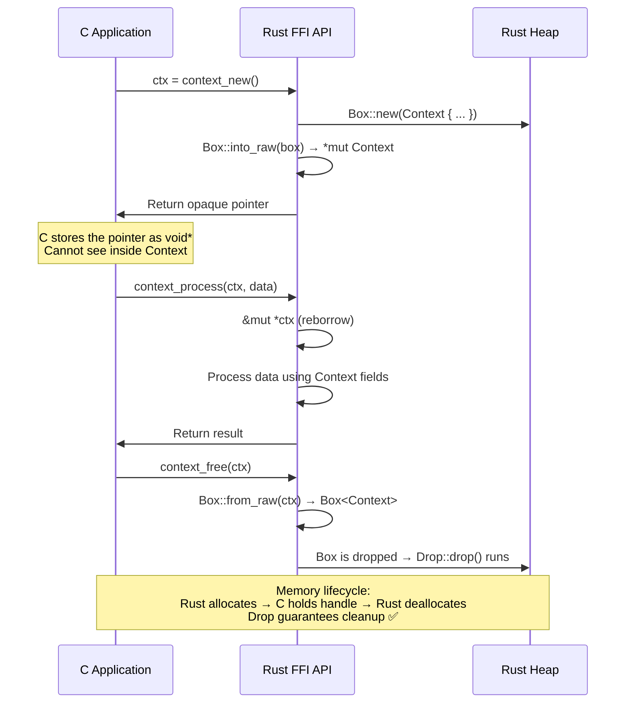
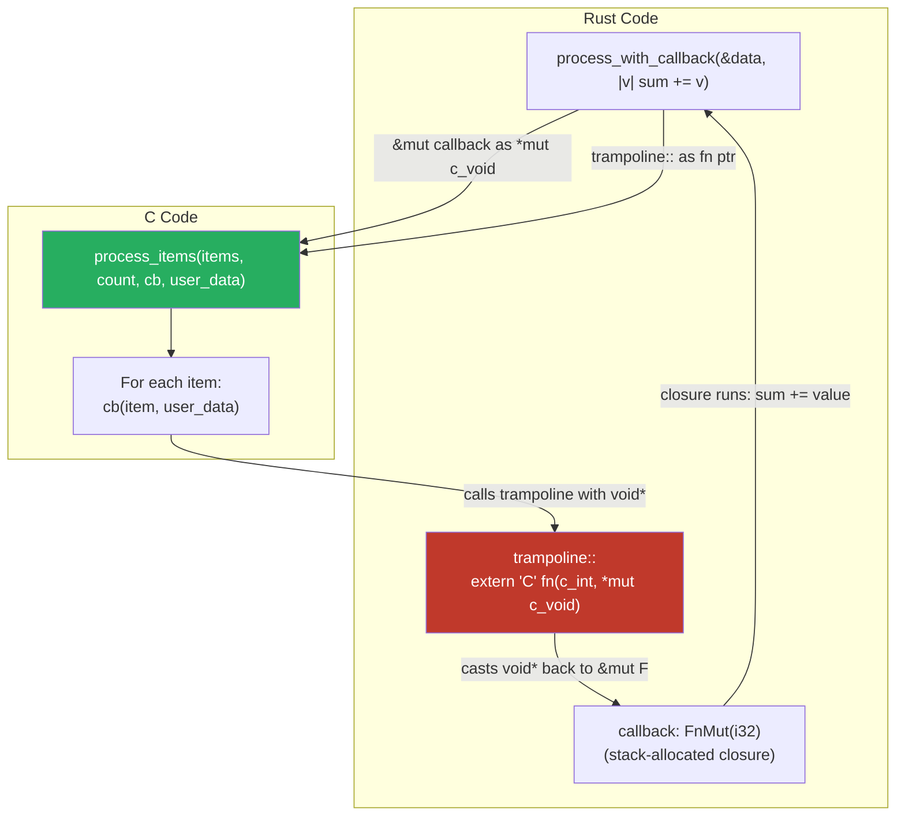

# Opaque Pointers and Manual Memory Management 🔴

> **What you'll learn:**
> - The **opaque pointer pattern**: passing complex Rust types through C's `void*` without exposing internal layout
> - `Box::into_raw` to transfer ownership from Rust to C, and `Box::from_raw` to reclaim it
> - Implementing `Drop`-based cleanup to prevent resource leaks across the FFI boundary
> - Thread-safety considerations when opaque pointers cross thread boundaries

This chapter is where FFI gets serious. Chapters 4–6 covered simple types — integers, floats, C-compatible structs, strings. But real-world FFI often requires passing complex Rust types — `HashMap`, `Mutex<Vec<T>>`, database connections, async runtimes — through C code that cannot possibly understand their internal layout.

The solution is the **opaque pointer pattern**: C gets a raw pointer to a Rust object. To C, it's just a `void*` — a handle. The Rust library provides `create`, `use`, and `destroy` functions. C never dereferences the pointer directly.

## The Opaque Pointer Pattern



## `Box::into_raw` and `Box::from_raw`: The Ownership Transfer Mechanism

### `Box::into_raw`: Rust → C (hand over ownership)

```rust
let boxed = Box::new(MyStruct { ... });
let raw: *mut MyStruct = Box::into_raw(boxed);
// `boxed` is consumed. Rust will NOT drop it.
// The raw pointer is now the sole owner.
// Someone (C code, via our API) must eventually call Box::from_raw
// to reclaim ownership and trigger Drop.
```

### `Box::from_raw`: C → Rust (take back ownership)

```rust
// SAFETY: `raw` must have been created by Box::into_raw for the same type,
// and must not have been previously freed.
let boxed: Box<MyStruct> = unsafe { Box::from_raw(raw) };
// `boxed` will be dropped at the end of this scope,
// running MyStruct's Drop implementation if it has one.
```

### The contract

| Operation | Effect | Ownership |
|-----------|--------|-----------|
| `Box::new(val)` | Allocate on heap | Rust owns it |
| `Box::into_raw(b)` | Consume Box, get raw pointer | **Nobody** owns it (leak until reclaimed) |
| `Box::from_raw(ptr)` | Reconstitute Box from raw pointer | Rust owns it again |
| `drop(reconstituted_box)` | Dealloc + run Drop | Memory freed |

> **Warning:** Between `into_raw` and `from_raw`, Rust's type system cannot help you. The raw pointer is just a number. If C calls your `free` function twice, that's a double-free. If C never calls it, that's a memory leak. If C passes a pointer from a different allocation, that's UB.

## Complete Example: A Process Pool

Let's build a realistic example — a worker pool that C code can create, use, and destroy.

### The Rust side

```rust
use std::ffi::{c_char, c_int, CStr};
use std::sync::Mutex;

/// A thread-safe pool of named workers.
/// This type has no #[repr(C)] — C cannot see inside it.
pub struct WorkerPool {
    workers: Mutex<Vec<String>>,
    max_workers: usize,
}

impl WorkerPool {
    fn new(max: usize) -> Self {
        WorkerPool {
            workers: Mutex::new(Vec::new()),
            max_workers: max,
        }
    }
    
    fn add_worker(&self, name: &str) -> Result<(), &'static str> {
        let mut workers = self.workers.lock().unwrap();
        if workers.len() >= self.max_workers {
            return Err("pool is full");
        }
        workers.push(name.to_owned());
        Ok(())
    }
    
    fn worker_count(&self) -> usize {
        self.workers.lock().unwrap().len()
    }
}

impl Drop for WorkerPool {
    fn drop(&mut self) {
        // This runs when the pool is freed — cleanup logic goes here.
        // In a real system, this might signal threads to shut down,
        // close file handles, flush buffers, etc.
        let workers = self.workers.get_mut().unwrap();
        eprintln!("WorkerPool dropping with {} workers", workers.len());
        workers.clear();
    }
}

// ---- FFI API ----

/// Create a new worker pool with the given maximum capacity.
/// Returns an opaque pointer. Caller must free with `pool_free`.
#[no_mangle]
pub extern "C" fn pool_new(max_workers: usize) -> *mut WorkerPool {
    let pool = Box::new(WorkerPool::new(max_workers));
    Box::into_raw(pool)
}

/// Add a named worker to the pool.
/// Returns 0 on success, -1 on null input, -2 if the pool is full.
#[no_mangle]
pub extern "C" fn pool_add_worker(pool: *mut WorkerPool, name: *const c_char) -> c_int {
    if pool.is_null() || name.is_null() {
        return -1;
    }
    
    let result = std::panic::catch_unwind(|| {
        // SAFETY: pool was created by pool_new and hasn't been freed.
        // name is a valid null-terminated string.
        unsafe {
            let pool = &*pool; // Borrow, don't take ownership!
            let name = CStr::from_ptr(name).to_str().map_err(|_| -1)?;
            pool.add_worker(name).map_err(|_| -2i32)?;
            Ok::<_, i32>(0)
        }
    });
    
    match result {
        Ok(Ok(code)) => code,
        Ok(Err(code)) => code,
        Err(_) => -99,
    }
}

/// Get the number of workers in the pool.
/// Returns -1 if pool is null.
#[no_mangle]
pub extern "C" fn pool_worker_count(pool: *const WorkerPool) -> c_int {
    if pool.is_null() {
        return -1;
    }
    // SAFETY: pool was created by pool_new and hasn't been freed.
    let pool = unsafe { &*pool };
    pool.worker_count() as c_int
}

/// Destroy the worker pool and free all associated memory.
/// After calling this, the pointer is invalid — using it is UB.
#[no_mangle]
pub extern "C" fn pool_free(pool: *mut WorkerPool) {
    if !pool.is_null() {
        // SAFETY: pool was created by Box::into_raw in pool_new.
        // This is the only call that takes ownership back.
        // The Drop impl will run, cleaning up the Mutex and Vec.
        unsafe { drop(Box::from_raw(pool)); }
    }
}
```

### What C sees (header)

```c
/* worker_pool.h — generated by cbindgen */
#ifndef WORKER_POOL_H
#define WORKER_POOL_H

#include <stddef.h>
#include <stdint.h>

/* Opaque type — C cannot see inside */
typedef struct WorkerPool WorkerPool;

WorkerPool *pool_new(size_t max_workers);
int pool_add_worker(WorkerPool *pool, const char *name);
int pool_worker_count(const WorkerPool *pool);
void pool_free(WorkerPool *pool);

#endif
```

### C usage

```c
#include "worker_pool.h"
#include <stdio.h>

int main(void) {
    WorkerPool *pool = pool_new(4);
    
    pool_add_worker(pool, "Alice");
    pool_add_worker(pool, "Bob");
    
    printf("Workers: %d\n", pool_worker_count(pool));  // 2
    
    pool_free(pool);
    // pool is now invalid — do NOT use it again
    
    return 0;
}
```

## Common Anti-Patterns and Fixes

### Anti-Pattern 1: Taking ownership when you should borrow

```rust
// 💥 BAD: Box::from_raw takes ownership — the pool is FREED after this call!
#[no_mangle]
pub extern "C" fn pool_worker_count_bad(pool: *mut WorkerPool) -> c_int {
    if pool.is_null() { return -1; }
    let pool = unsafe { Box::from_raw(pool) }; // ← Takes ownership!
    let count = pool.worker_count() as c_int;
    count
    // pool is dropped here — the C caller's pointer is now dangling!
}

// ✅ FIX: Borrow through the raw pointer — don't reconstitute the Box
#[no_mangle]
pub extern "C" fn pool_worker_count_good(pool: *const WorkerPool) -> c_int {
    if pool.is_null() { return -1; }
    let pool = unsafe { &*pool }; // ← Borrow only!
    pool.worker_count() as c_int
}
```

### Anti-Pattern 2: Double-free

```c
// C code — 💥 UB: double-free
WorkerPool *pool = pool_new(4);
pool_free(pool);
pool_free(pool);  // 💥 The second call frees already-freed memory
```

**Prevention strategy:** Set the pointer to NULL after freeing (C convention), or use a wrapper that tracks the freed state:

```rust
/// Sets *pool to NULL after freeing, preventing double-free from the C side.
#[no_mangle]
pub extern "C" fn pool_free_safe(pool: *mut *mut WorkerPool) {
    if pool.is_null() {
        return;
    }
    unsafe {
        let ptr = *pool;
        if !ptr.is_null() {
            drop(Box::from_raw(ptr));
            *pool = std::ptr::null_mut(); // Null out the caller's pointer
        }
    }
}
```

```c
// C usage — safer
WorkerPool *pool = pool_new(4);
pool_free_safe(&pool);   // pool is now NULL
pool_free_safe(&pool);   // no-op — pool is NULL
```

### Anti-Pattern 3: Forgetting to free (memory leak)

C has no destructors. If C code creates a Rust object and never calls `free`, the memory leaks. Rust's `Drop` never runs.

**Prevention strategies:**
1. Document the ownership contract prominently in the header
2. Provide a "cleanup all" function for shutdown
3. Consider reference counting (Chapter 8) for shared ownership scenarios

## Callbacks: Passing Rust Closures to C

A critical FFI pattern is passing callbacks. C represents callbacks as function pointers + a `void*` context (sometimes called "user data" or "cookie"):

```c
// C API that accepts a callback
typedef void (*callback_fn)(int value, void *user_data);
void process_items(int *items, size_t count, callback_fn cb, void *user_data);
```

To pass a Rust closure as a C callback, we use a **trampoline** — an `extern "C"` function that unpacks the `void*` back into our Rust data:

```rust
use std::ffi::{c_int, c_void};
use std::os::raw::c_uint;

// Declare the C function
extern "C" {
    fn process_items(
        items: *const c_int,
        count: usize,
        cb: Option<extern "C" fn(c_int, *mut c_void)>,
        user_data: *mut c_void,
    );
}

/// The trampoline: an extern "C" function that C can call.
/// It receives the void* and casts it back to our closure.
extern "C" fn trampoline<F: FnMut(i32)>(value: c_int, user_data: *mut c_void) {
    // SAFETY: user_data is a pointer to F, set up by our calling code below.
    let closure = unsafe { &mut *(user_data as *mut F) };
    closure(value as i32);
}

/// Safe, idiomatic Rust wrapper.
fn process_with_callback<F: FnMut(i32)>(items: &[i32], mut callback: F) {
    unsafe {
        process_items(
            items.as_ptr(),
            items.len(),
            Some(trampoline::<F>),
            &mut callback as *mut F as *mut c_void,
        );
    }
}

// Usage:
fn example() {
    let mut sum = 0;
    let data = vec![1, 2, 3, 4, 5];
    process_with_callback(&data, |value| {
        sum += value;
    });
    println!("Sum: {sum}"); // 15
}
```



### Key safety invariant for callbacks

The closure (`F`) must live at least as long as C might call the trampoline. In the example above, `process_items` calls the callback synchronously (within the same function), so the closure on the stack is fine. If C stores the callback for later asynchronous invocation, you must `Box` the closure and manage its lifetime manually:

```rust
// For async callbacks (C stores the callback and calls it later):
fn register_callback<F: FnMut(i32) + 'static>(callback: F) {
    let boxed: Box<Box<dyn FnMut(i32)>> = Box::new(Box::new(callback));
    let user_data = Box::into_raw(boxed) as *mut c_void;
    
    unsafe {
        // C stores both the function pointer and user_data
        c_register_callback(Some(async_trampoline), user_data);
    }
}

extern "C" fn async_trampoline(value: c_int, user_data: *mut c_void) {
    // SAFETY: user_data was created by Box::into_raw above
    let closure = unsafe { &mut *(user_data as *mut Box<dyn FnMut(i32)>) };
    closure(value as i32);
}

// Don't forget to provide a way to unregister and free the closure!
fn unregister_callback(user_data: *mut c_void) {
    if !user_data.is_null() {
        unsafe {
            let _: Box<Box<dyn FnMut(i32)>> = Box::from_raw(user_data as *mut _);
            // Dropped and freed
        }
    }
}
```

<details>
<summary><strong>🏋️ Exercise: RAII Wrapper for a C File Handle</strong> (click to expand)</summary>

Design and implement a safe Rust wrapper around these mock C file operations:

```rust
extern "C" {
    /// Opens a file. Returns an opaque handle, or null on failure.
    fn c_file_open(path: *const c_char, mode: *const c_char) -> *mut c_void;
    
    /// Writes bytes to the file. Returns number of bytes written, or -1 on error.
    fn c_file_write(handle: *mut c_void, data: *const u8, len: usize) -> isize;
    
    /// Reads bytes from the file. Returns number of bytes read, or -1 on error.
    fn c_file_read(handle: *mut c_void, buf: *mut u8, len: usize) -> isize;
    
    /// Closes the file and frees the handle. Must be called exactly once.
    fn c_file_close(handle: *mut c_void);
}
```

Requirements:
1. Create a `SafeFile` struct that wraps the opaque handle
2. Implement `Drop` to call `c_file_close` automatically
3. Provide safe `write` and `read` methods
4. Make it impossible to use a `SafeFile` after close
5. Handle errors with `Result`

<details>
<summary>🔑 Solution</summary>

```rust
use std::ffi::{CString, c_char, c_void};
use std::io;
use std::ptr::NonNull;

extern "C" {
    fn c_file_open(path: *const c_char, mode: *const c_char) -> *mut c_void;
    fn c_file_write(handle: *mut c_void, data: *const u8, len: usize) -> isize;
    fn c_file_read(handle: *mut c_void, buf: *mut u8, len: usize) -> isize;
    fn c_file_close(handle: *mut c_void);
}

/// A safe wrapper around the C file API.
///
/// The file is automatically closed when this value is dropped.
/// Using `NonNull` guarantees the handle is never null — a null
/// result from `c_file_open` is turned into an `Err` before
/// construction.
pub struct SafeFile {
    // NonNull<c_void> guarantees:
    // 1. The handle is never null (checked at construction)
    // 2. It's !Send by default (we could impl Send if the C API is thread-safe)
    handle: NonNull<c_void>,
}

impl SafeFile {
    /// Opens a file at `path` with the given `mode` (e.g., "rb", "wb").
    pub fn open(path: &str, mode: &str) -> io::Result<Self> {
        let c_path = CString::new(path)
            .map_err(|_| io::Error::new(io::ErrorKind::InvalidInput, "path contains null"))?;
        let c_mode = CString::new(mode)
            .map_err(|_| io::Error::new(io::ErrorKind::InvalidInput, "mode contains null"))?;
        
        // SAFETY: c_path and c_mode are valid null-terminated strings.
        let raw = unsafe { c_file_open(c_path.as_ptr(), c_mode.as_ptr()) };
        
        // Convert null to an error — NonNull guarantees non-null after this
        let handle = NonNull::new(raw)
            .ok_or_else(|| io::Error::new(io::ErrorKind::NotFound, "c_file_open returned null"))?;
        
        Ok(SafeFile { handle })
    }
    
    /// Writes data to the file. Returns the number of bytes written.
    pub fn write(&mut self, data: &[u8]) -> io::Result<usize> {
        // SAFETY: handle is valid (guaranteed by NonNull + our lifecycle management).
        // data.as_ptr() and data.len() describe a valid byte slice.
        let n = unsafe {
            c_file_write(self.handle.as_ptr(), data.as_ptr(), data.len())
        };
        
        if n < 0 {
            Err(io::Error::new(io::ErrorKind::Other, "c_file_write failed"))
        } else {
            Ok(n as usize)
        }
    }
    
    /// Reads up to `buf.len()` bytes from the file.
    /// Returns the number of bytes actually read (0 = EOF).
    pub fn read(&mut self, buf: &mut [u8]) -> io::Result<usize> {
        // SAFETY: handle is valid. buf describes a valid, writable byte slice.
        let n = unsafe {
            c_file_read(self.handle.as_ptr(), buf.as_mut_ptr(), buf.len())
        };
        
        if n < 0 {
            Err(io::Error::new(io::ErrorKind::Other, "c_file_read failed"))
        } else {
            Ok(n as usize)
        }
    }
}

impl Drop for SafeFile {
    fn drop(&mut self) {
        // SAFETY: handle was obtained from c_file_open (via NonNull).
        // Drop runs exactly once (Rust guarantees this).
        // After drop, the SafeFile is gone — no one can use the handle.
        unsafe { c_file_close(self.handle.as_ptr()); }
    }
}

// SafeFile is NOT Send/Sync by default (because NonNull<c_void> is !Send).
// This is conservative and correct — the C API may not be thread-safe.
// If the C API IS thread-safe, explicitly:
//   unsafe impl Send for SafeFile {}

// Usage:
// fn example() -> io::Result<()> {
//     let mut f = SafeFile::open("/tmp/test.txt", "wb")?;
//     f.write(b"Hello, FFI!")?;
//     // f is automatically closed when dropped
//     Ok(())
// }
```

**Why this design is safe:**
1. **Construction validates:** null handle → `Err` before `SafeFile` is created
2. **`NonNull` enforces:** once constructed, handle is guaranteed non-null
3. **`Drop` ensures cleanup:** `c_file_close` is called exactly once, automatically
4. **Ownership prevents use-after-close:** once dropped, `self` is gone (Rust's move semantics)
5. **`&mut self` on methods:** prevents concurrent use without explicit synchronization
6. **Not `Send` by default:** prevents sending to other threads unless explicitly opted in

</details>
</details>

> **Key Takeaways:**
> - The **opaque pointer pattern** lets C hold handles to complex Rust types without knowing their layout
> - `Box::into_raw` transfers ownership from Rust to the raw pointer; `Box::from_raw` reclaims it
> - **Between `into_raw` and `from_raw`, Rust cannot help you** — double-free, use-after-free, and leaks are all possible
> - Always implement `Drop` on wrapper types to ensure cleanup logic runs when the Rust side reclaims ownership
> - Use `NonNull<T>` in wrapper types to encode the "non-null handle" invariant at the type level
> - Callbacks use the **trampoline pattern**: `extern "C" fn` + `void*` context to bridge C function pointers to Rust closures

> **See also:**
> - [Chapter 6: Exposing Rust to C](ch06-exposing-safe-rust-to-the-outside-world.md) — the basics of `#[no_mangle]` and `extern "C"`
> - [Chapter 8: Safe Abstractions](ch08-safe-abstractions-over-unsafe-code.md) — encapsulating all the `unsafe` from this chapter behind safe APIs
> - [Chapter 9: Capstone](ch09-capstone-project-the-c-crypto-wrapper.md) — applying all these patterns to build a production wrapper
> - [Rust Memory Management](../memory-management-book/src/SUMMARY.md) — `Box`, smart pointers, and RAII
> - [Async Rust](../async-book/src/SUMMARY.md) — how `Waker` uses opaque pointers internally
