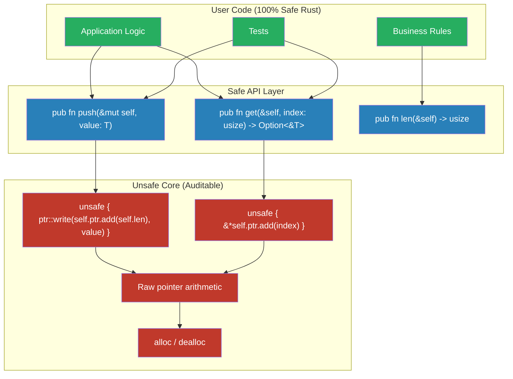

# Safe Abstractions Over Unsafe Code 🔴

> **What you'll learn:**
> - The **core philosophy** of Rust library design: unsafe implementation, safe interface
> - How to identify, document, and enforce safety invariants so downstream users **cannot** trigger UB
> - How the standard library uses this pattern in `Vec`, `Arc`, `Mutex`, and `String`
> - How the async ecosystem uses it for `Pin`, `Waker`, and `RawWaker` — safe abstractions over highly unsafe pointer logic

This is the most important chapter in the book. Everything we've learned — the five superpowers, UB detection, provenance, FFI mechanics, opaque pointers — converges here. The goal is not to avoid `unsafe`. The goal is to **contain** it: build a small, auditable core of `unsafe` code, then wrap it in a safe API that makes it **structurally impossible** for users to trigger UB.

This is how Rust's standard library works. This is how every production-quality Rust crate works. This is the pattern that makes Rust *Rust*.

## The Safe Abstraction Principle

> **If your `unsafe` code is correct, then no sequence of operations using your safe API can cause Undefined Behavior.**

This is a stronger guarantee than most languages offer. In C++, even standard library types can be misused to cause UB (`std::vector::operator[]` with an out-of-bounds index). In Rust, `Vec::get(index)` returns `Option<&T>` — the API makes the failure mode explicit and safe.



## Case Study 1: How `Vec<T>` Works

`Vec<T>` is the poster child for safe abstractions. Its internal implementation is full of `unsafe` — raw pointer arithmetic, manual allocation, `ptr::write`, `ptr::read` — but its public API is 100% safe.

### The invariants `Vec` maintains

| Invariant | What it means | How Vec enforces it |
|-----------|--------------|---------------------|
| `ptr` is valid | Points to allocated memory (or dangling if cap=0) | Checked in alloc/realloc |
| `len ≤ cap` | We never read beyond initialized elements | `push` grows if needed; `get` bounds-checks |
| Elements `0..len` are initialized | No uninitialized reads | Only `push`/`insert` increment len after writing |
| `ptr` was allocated by the global allocator | `Drop` calls the same allocator to free | Private field — users can't substitute a different pointer |

### Vec's `push` — safe API, unsafe core

```rust
// Simplified from std::vec::Vec
impl<T> Vec<T> {
    pub fn push(&mut self, value: T) {
        // Safe: bounds check + resize
        if self.len == self.cap {
            self.grow();  // reallocate (internally unsafe)
        }
        
        // Unsafe core: write to raw pointer
        unsafe {
            let end = self.ptr.add(self.len);
            std::ptr::write(end, value);
        }
        
        // Safe: update bookkeeping
        self.len += 1;
    }
}
```

**Why this is sound:** By the time we reach the `unsafe` block, we've guaranteed:
1. `self.ptr` is valid (enforced by `grow()`)
2. `self.ptr.add(self.len)` is within bounds (because `len < cap` after the check)
3. The memory at that offset is not yet initialized (because elements `0..len` are initialized, and `len` is the *next* slot)

No safe caller can violate these invariants because `ptr`, `len`, and `cap` are private fields.

## Case Study 2: How `Pin<P>` Works (Connection to Async)

`Pin<P>` is perhaps the most *subtle* safe abstraction in Rust. It exists to solve a problem in async: self-referential types created by `async fn` state machines.

### The problem

When you write `async fn fetch()`, the compiler generates a state machine struct. That struct may contain references to its own fields:

```rust
async fn fetch(url: String) -> Vec<u8> {
    let response = download(&url).await; // &url borrows from the struct
    response.body().await
}
// The generated state machine has both `url` (owned) and a borrow of `url`.
// If the struct is MOVED in memory, the borrow becomes dangling. UB.
```

### How Pin fixes this

`Pin<&mut T>` is a wrapper that says: "This value will **never** be moved in memory." The unsafe core:

```rust
// Simplified Pin
pub struct Pin<P> {
    pointer: P,
}

impl<P: Deref> Pin<P> {
    /// Create a Pin.
    /// SAFETY: The pointee must never be moved after this call.
    pub unsafe fn new_unchecked(pointer: P) -> Self {
        Pin { pointer }
    }
}

impl<T: Unpin> Pin<&mut T> {
    /// Safe to construct if T: Unpin (most types).
    /// Unpin means "I don't care about being moved."
    pub fn new(pointer: &mut T) -> Self {
        // SAFETY: T: Unpin means moving is always safe.
        unsafe { Pin::new_unchecked(pointer) }
    }
}
```

**The safe abstraction pattern:**
- `Pin::new_unchecked` is `unsafe` — the caller must guarantee the value won't be moved
- `Pin::new` is *safe* — but only works for `T: Unpin` (types that don't care about being moved)
- Self-referential async state machines are `!Unpin`, so they can only be pinned through `unsafe` — which the runtime (Tokio, async-std) handles for you

> **This is the pattern in action:** Unsafe complexity in the core (`Pin::new_unchecked`, runtime internals), safe interface for users (`tokio::spawn`, `.await`). The user never writes `unsafe`.

## Case Study 3: `Waker` and `RawWaker` (Async Runtime Internals)

The `Waker` type in `std::task` is how async runtimes know which task to poll next. Its internals are a manually managed vtable — one of the most unsafe patterns in Rust:

```rust
// From std::task (simplified)
pub struct RawWaker {
    data: *const (),                  // Opaque pointer (void*)
    vtable: &'static RawWakerVTable, // Function pointers for clone, wake, drop
}

pub struct RawWakerVTable {
    clone: unsafe fn(*const ()) -> RawWaker,
    wake: unsafe fn(*const ()),
    wake_by_ref: unsafe fn(*const ()),
    drop: unsafe fn(*const ()),
}
```

This is raw `void*` + function-pointer dispatch — the exact pattern from C. Every function in the vtable is `unsafe fn` because:
- `data` might be null, dangling, or the wrong type
- `clone` must produce a valid new waker (reference counting)
- `drop` must not double-free
- `wake` must correctly notify the runtime

**But users never see this.** They interact with the safe `Waker` type:

```rust
// Safe API — users call this
impl Waker {
    pub fn wake(self) { /* calls the vtable's wake fn internally */ }
    pub fn wake_by_ref(&self) { /* calls the vtable's wake_by_ref fn internally */ }
}
```

Tokio implements the `RawWaker` vtable internally using `Arc`-based reference counting. The `unsafe` is confined to Tokio's internals. Application developers just call `waker.wake()`.

## The Checklist: Writing Your Own Safe Abstraction

When you're building a type that wraps `unsafe` code, follow this checklist:

### 1. Identify the safety invariants

Write them down explicitly. For each piece of `unsafe` code, ask:
- What must be true for this to be safe?
- Who ensures it — the constructor? The caller? The type's internal logic?

### 2. Make invariants structurally unbreakable

Use the type system to make violations **impossible**:

| Technique | What it prevents |
|-----------|-----------------|
| Private fields | Users can't modify internal state |
| `NonNull<T>` | Null pointers |
| `PhantomData<T>` | Incorrect Send/Sync auto-implementations |
| Newtype wrappers | Invalid values |
| Builder pattern | Partially initialized structs |
| Typestate | Operations in wrong order |

### 3. Validate at the boundary

```rust
pub fn new(input: &str) -> Result<Self, Error> {
    // ALL validation happens here, at the safe API boundary.
    // Once the struct is constructed, invariants are guaranteed.
    if input.is_empty() {
        return Err(Error::EmptyInput);
    }
    // ... construct the type with unsafe internals
    Ok(Self { ... })
}
```

### 4. Implement `Drop` for cleanup

If your type manages resources (memory, file handles, C objects), `Drop` must clean them up. This is non-negotiable.

### 5. Get `Send`/`Sync` right

If your type contains raw pointers, it's `!Send` and `!Sync` by default. Only implement `Send`/`Sync` if you can prove thread-safety. Document why.

### 6. Test with Miri

```bash
MIRIFLAGS="-Zmiri-strict-provenance" cargo +nightly miri test
```

## Putting It All Together: A Safe Ring Buffer

Here's a complete example applying all principles — a safe ring buffer backed by raw pointer arithmetic:

```rust
use std::alloc::{self, Layout};
use std::ptr::{self, NonNull};
use std::marker::PhantomData;

/// A fixed-capacity ring buffer (circular queue).
///
/// # Safety invariants (internal):
/// - `buf` points to a valid allocation of `cap` elements of type `T`
/// - `head` and `tail` are always in `0..cap`
/// - Elements at indices `head..tail` (wrapping) are initialized
/// - The buffer was allocated by the global allocator
pub struct RingBuffer<T> {
    buf: NonNull<T>,
    cap: usize,
    head: usize,
    tail: usize,
    len: usize,
    _marker: PhantomData<T>, // For drop check: "we own T values"
}

// SAFETY: RingBuffer owns its data exclusively. If T is Send, the buffer
// can be sent to another thread. No shared mutable state.
unsafe impl<T: Send> Send for RingBuffer<T> {}
// SAFETY: &RingBuffer<T> only provides &T access. If T is Sync, this is safe.
unsafe impl<T: Sync> Sync for RingBuffer<T> {}

impl<T> RingBuffer<T> {
    /// Creates a new ring buffer with the given capacity.
    ///
    /// # Panics
    /// Panics if `cap` is 0 or if allocation fails.
    pub fn new(cap: usize) -> Self {
        assert!(cap > 0, "capacity must be > 0");
        
        let layout = Layout::array::<T>(cap).expect("layout overflow");
        // SAFETY: layout has non-zero size (cap > 0 and T is not ZST... 
        // for simplicity we'll handle the non-ZST case here)
        let buf = unsafe { alloc::alloc(layout) as *mut T };
        let buf = NonNull::new(buf).expect("allocation failed");
        
        RingBuffer {
            buf,
            cap,
            head: 0,
            tail: 0,
            len: 0,
            _marker: PhantomData,
        }
    }
    
    /// Pushes a value to the back. Returns `Err(value)` if full.
    pub fn push_back(&mut self, value: T) -> Result<(), T> {
        if self.len == self.cap {
            return Err(value); // Full — safe error, no UB
        }
        
        // SAFETY: tail is in 0..cap (invariant), and we just checked len < cap,
        // so the slot at tail is uninitialized.
        unsafe {
            ptr::write(self.buf.as_ptr().add(self.tail), value);
        }
        self.tail = (self.tail + 1) % self.cap;
        self.len += 1;
        Ok(())
    }
    
    /// Pops a value from the front. Returns `None` if empty.
    pub fn pop_front(&mut self) -> Option<T> {
        if self.len == 0 {
            return None; // Empty — safe, no UB
        }
        
        // SAFETY: head is in 0..cap (invariant), and len > 0 means the slot
        // at head is initialized.
        let value = unsafe { ptr::read(self.buf.as_ptr().add(self.head)) };
        self.head = (self.head + 1) % self.cap;
        self.len -= 1;
        Some(value)
    }
    
    pub fn len(&self) -> usize { self.len }
    pub fn is_empty(&self) -> bool { self.len == 0 }
    pub fn capacity(&self) -> usize { self.cap }
}

impl<T> Drop for RingBuffer<T> {
    fn drop(&mut self) {
        // Drop all remaining elements
        while self.pop_front().is_some() {}
        
        // Deallocate the buffer
        let layout = Layout::array::<T>(self.cap).unwrap();
        // SAFETY: buf was allocated with this exact layout in new()
        unsafe { alloc::dealloc(self.buf.as_ptr() as *mut u8, layout); }
    }
}
```

**Why no safe caller can trigger UB:**
- `buf` is `NonNull` and private — users can't replace it
- `head`, `tail`, `cap`, `len` are private — users can't desync them
- `push_back` checks `len < cap` before writing
- `pop_front` checks `len > 0` before reading
- `Drop` cleans up all elements and frees memory
- `Send`/`Sync` are only implemented with appropriate bounds

## Anti-Pattern: Leaking Unsafe Through the API

```rust
// 💥 BAD: Exposing raw internals
pub struct Buffer {
    pub ptr: *mut u8,  // 💥 Public raw pointer — anyone can invalidate it
    pub len: usize,     // 💥 Public len — anyone can set len > allocated
}

// ✅ GOOD: Private internals, safe methods
pub struct Buffer {
    ptr: NonNull<u8>,  // Private
    len: usize,         // Private
    cap: usize,         // Private
}

impl Buffer {
    pub fn as_slice(&self) -> &[u8] {
        // SAFETY: invariants guarantee ptr is valid for len bytes
        unsafe { std::slice::from_raw_parts(self.ptr.as_ptr(), self.len) }
    }
}
```

<details>
<summary><strong>🏋️ Exercise: Safe Wrapper for a C Configuration Library</strong> (click to expand)</summary>

Given these C bindings:

```rust
extern "C" {
    fn config_init() -> *mut c_void;
    fn config_set(ctx: *mut c_void, key: *const c_char, value: *const c_char) -> c_int;
    fn config_get(ctx: *const c_void, key: *const c_char) -> *const c_char;
    fn config_destroy(ctx: *mut c_void);
}
```

Build a safe `Config` type that:
1. Handles all null checks
2. Manages the context pointer's lifecycle with `Drop`
3. Converts strings safely with `CString`/`CStr`
4. Returns `Result` and `Option` instead of error codes and null
5. Is impossible to misuse from safe Rust code

<details>
<summary>🔑 Solution</summary>

```rust
use std::ffi::{CStr, CString, c_char, c_int, c_void};
use std::ptr::NonNull;

extern "C" {
    fn config_init() -> *mut c_void;
    fn config_set(ctx: *mut c_void, key: *const c_char, value: *const c_char) -> c_int;
    fn config_get(ctx: *const c_void, key: *const c_char) -> *const c_char;
    fn config_destroy(ctx: *mut c_void);
}

/// A safe, RAII wrapper around the C configuration library.
///
/// # Invariants
/// - `ctx` was obtained from `config_init()` and has not been destroyed
/// - `config_destroy()` will be called exactly once, when this value is dropped
///
/// # Thread Safety
/// Not `Send` or `Sync` — the C library does not document thread safety.
pub struct Config {
    ctx: NonNull<c_void>,
}

/// Errors that can occur when interacting with the config library.
#[derive(Debug)]
pub enum ConfigError {
    /// The C library failed to initialize.
    InitFailed,
    /// A string parameter contained an interior null byte.
    NulByte(usize),
    /// The C library returned an error code.
    SetFailed { key: String, code: i32 },
}

impl std::fmt::Display for ConfigError {
    fn fmt(&self, f: &mut std::fmt::Formatter<'_>) -> std::fmt::Result {
        match self {
            ConfigError::InitFailed => write!(f, "config_init returned null"),
            ConfigError::NulByte(pos) => write!(f, "string contains null at byte {pos}"),
            ConfigError::SetFailed { key, code } => {
                write!(f, "config_set({key}) failed with code {code}")
            }
        }
    }
}

impl std::error::Error for ConfigError {}

impl Config {
    /// Creates a new configuration context.
    pub fn new() -> Result<Self, ConfigError> {
        // SAFETY: config_init has no preconditions.
        let raw = unsafe { config_init() };
        let ctx = NonNull::new(raw).ok_or(ConfigError::InitFailed)?;
        Ok(Config { ctx })
    }
    
    /// Sets a configuration key-value pair.
    pub fn set(&mut self, key: &str, value: &str) -> Result<(), ConfigError> {
        let c_key = CString::new(key)
            .map_err(|e| ConfigError::NulByte(e.nul_position()))?;
        let c_value = CString::new(value)
            .map_err(|e| ConfigError::NulByte(e.nul_position()))?;
        
        // SAFETY: ctx is valid (NonNull, not yet destroyed).
        // c_key and c_value are valid null-terminated strings that
        // outlive this call.
        let code = unsafe {
            config_set(self.ctx.as_ptr(), c_key.as_ptr(), c_value.as_ptr())
        };
        
        if code == 0 {
            Ok(())
        } else {
            Err(ConfigError::SetFailed {
                key: key.to_owned(),
                code,
            })
        }
    }
    
    /// Gets a configuration value by key.
    ///
    /// Returns `None` if the key is not found (C returned null).
    /// Non-UTF-8 values are returned with lossy replacement.
    pub fn get(&self, key: &str) -> Option<String> {
        let c_key = CString::new(key).ok()?;
        
        // SAFETY: ctx is valid, c_key is a valid null-terminated string.
        let ptr = unsafe { config_get(self.ctx.as_ptr(), c_key.as_ptr()) };
        
        if ptr.is_null() {
            return None;
        }
        
        // SAFETY: config_get returned a non-null pointer.
        // We assume it's a valid null-terminated string owned by the
        // config context (we copy it immediately, so lifetime is fine).
        let c_str = unsafe { CStr::from_ptr(ptr) };
        Some(c_str.to_string_lossy().into_owned())
    }
}

impl Drop for Config {
    fn drop(&mut self) {
        // SAFETY: ctx was created by config_init in Config::new().
        // Drop runs exactly once (Rust guarantees this).
        unsafe { config_destroy(self.ctx.as_ptr()); }
    }
}

// DELIBERATELY NOT implementing Send or Sync.
// The C library's thread safety is unknown.

#[cfg(test)]
mod tests {
    use super::*;
    
    #[test]
    fn rejects_null_bytes_in_key() {
        // This test doesn't call C — it tests our safe layer
        let mut config = Config::new().unwrap();
        let result = config.set("bad\0key", "value");
        assert!(matches!(result, Err(ConfigError::NulByte(3))));
    }
}
```

**What makes this safe:**

| Invariant | How it's enforced |
|-----------|-------------------|
| ctx is never null | `NonNull` + `new()` returns `Err` on null |
| ctx is freed exactly once | `Drop` (Rust guarantees single drop) |
| No use-after-free | Private field + ownership model |
| No interior nulls in strings | `CString::new()` checks |
| No thread-safety bugs | Not `Send`/`Sync` (conservative default) |
| All C errors surfaced | `Result`/`Option` at every boundary |

</details>
</details>

> **Key Takeaways:**
> - The **safe abstraction principle**: if your `unsafe` is correct, no safe API usage can cause UB
> - Make safety invariants **structurally unbreakable** using private fields, `NonNull`, `PhantomData`, and the type system
> - **Validate at the boundary** (constructors, public methods) — once the type exists, invariants are guaranteed
> - Always implement `Drop` for resource cleanup; always get `Send`/`Sync` right
> - `Vec`, `Arc`, `Mutex`, `Pin`, `Waker` all follow this exact pattern — `unsafe` internals, safe surface
> - This pattern is **why Rust exists**: it enables systems-level performance with compile-time safety guarantees

> **See also:**
> - [Chapter 7: Opaque Pointers](ch07-opaque-pointers-and-manual-memory-management.md) — the `Box::into_raw`/`Box::from_raw` pattern this chapter wraps
> - [Chapter 9: Capstone Project](ch09-capstone-project-the-c-crypto-wrapper.md) — applying all these patterns to build a production wrapper
> - [Async Rust — Pin and Unpin](../async-book/src/ch04-pin-and-unpin.md) — the `Pin` safe abstraction in detail
> - [Async Rust — Executors and Runtimes](../async-book/src/ch07-executors-and-runtimes.md) — `Waker`/`RawWaker` internals
> - [Rust's Type System & Traits](../type-system-traits-book/src/SUMMARY.md) — `Send`, `Sync`, `Unpin` traits
> - [Type-Driven Correctness](../type-driven-correctness-book/src/SUMMARY.md) — typestate, phantom types, and capability tokens for advanced safety
