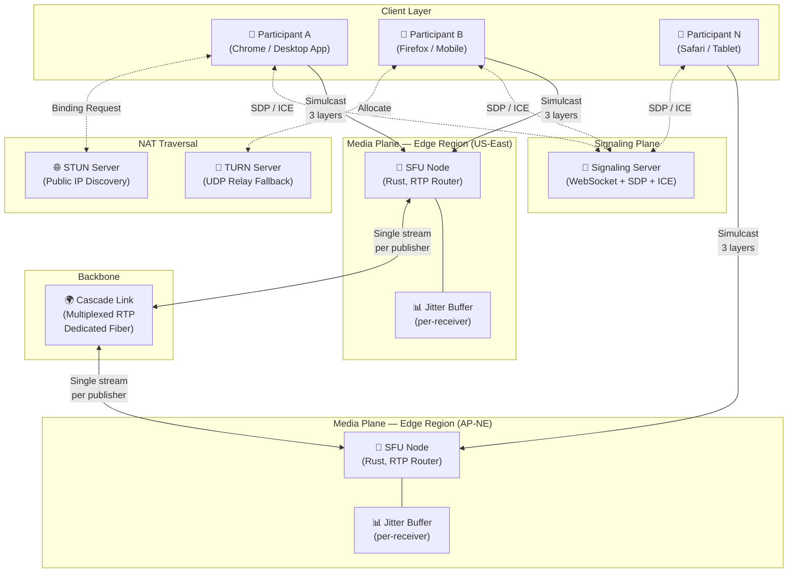

# System Design: The Massively Scalable Video Conferencing Engine

## Speaker Intro

This handbook is written from the perspective of a **Principal Media Architect** who has designed, deployed, and operated real-time video conferencing infrastructure supporting millions of daily meetings across every network condition imaginable. The content draws from first-hand experience building Selective Forwarding Units (SFUs) in Rust that route 100,000 simultaneous media streams with sub-millisecond forwarding latency, engineering WebRTC signaling planes that complete ICE negotiation through the nastiest corporate firewalls in under 2 seconds, deploying Simulcast and SVC pipelines that let a participant on 200 kbps mobile tethering sit in the same meeting as someone on a 1 Gbps fiber connection — without either noticing, and operating globally cascaded SFU meshes that keep mouth-to-ear latency under 200ms for town halls spanning Tokyo, London, and São Paulo.

## Who This Is For

- **Backend systems engineers** building real-time communication (RTC) platforms who want to understand why video conferencing is not just "WebRTC in a browser" — and why a naive approach collapses at 5 participants.
- **Rust and C++ engineers** who want to build production SFUs — understanding RTP packet routing, RTCP feedback loops, NACK-based retransmission, and how to forward 10 Gbps of media traffic without ever decoding a single video frame.
- **WebRTC engineers** who have used `RTCPeerConnection` in JavaScript but need to understand the signaling plane, ICE candidate gathering, STUN/TURN traversal, and SDP negotiation at the protocol level — not just the browser API level.
- **Infrastructure engineers** designing the network backbone for a global conferencing service who need to understand edge cascading, anycast routing, and how to keep inter-region latency from destroying the conversational flow of a meeting.
- **Staff+ engineers** preparing for system design interviews where "design a video conferencing system like Zoom/Teams/Meet" is a top-tier question — and where hand-waving about "just use WebRTC" exposes a shallow understanding of the actual hard problems.

## Prerequisites

| Concept | Where to Learn |
|---|---|
| Intermediate Rust (ownership, traits, `async/.await`) | [Async Rust](../async-book/src/SUMMARY.md) |
| Basic networking (TCP, UDP, RTP, NAT) | [Distributed Systems](../distributed-systems-book/src/SUMMARY.md) |
| Concurrency primitives (mutexes, channels, atomics) | [Concurrency in Rust](../concurrency-book/src/SUMMARY.md) |
| Understanding of video codecs (H.264, VP8/VP9) | [Video Streaming Engine](../video-streaming-book/src/SUMMARY.md) |
| Cloud infrastructure basics (load balancing, DNS) | [Cloud-Native Rust](../cloud-native-book/src/SUMMARY.md) |

## How to Use This Book

| Emoji | Meaning |
|---|---|
| 🟢 | **Architecture** — topology decisions and system-level design that everything else builds on |
| 🟡 | **WebRTC/Media** — signaling protocols, SDP negotiation, ICE traversal with working code |
| 🔴 | **Network Optimization** — Simulcast adaptation, jitter compensation, FEC, and global edge cascading |

Each chapter addresses **one critical layer** of a video conferencing system. Read them in order — later chapters assume the SFU, signaling server, and WebRTC connectivity from earlier chapters are operational.

## The Problem We Are Solving

> Architect a **sub-200ms latency, massively scalable video conferencing engine** capable of hosting meetings with **1,000+ simultaneous participants** across every continent — using Rust for the SFU media plane, WebRTC for browser-native connectivity, Simulcast for heterogeneous network adaptation, and a globally cascaded edge topology for intercontinental meetings.

The system we will build has these non-negotiable requirements:

| Requirement | Target |
|---|---|
| Participants per meeting | ≥ 1,000 (town hall mode), ≥ 50 (interactive grid) |
| Mouth-to-ear audio latency | < 200ms end-to-end |
| Glass-to-glass video latency | < 300ms end-to-end |
| Time to join meeting | < 2 seconds from click to first audio |
| Packet loss tolerance | Maintain quality at ≤ 5% random loss, degrade gracefully to 15% |
| Bandwidth adaptation | Serve 360p at 200 kbps to 1080p at 2.5 Mbps — per receiver |
| Concurrent meetings | ≥ 500,000 globally with 99.99% availability |
| NAT traversal success | ≥ 99.5% of participants connect without TURN relay |
| Global edge reach | SFU edge node within 50ms RTT of 95% of users |

## Pacing Guide

| Chapter | Topic | Time | Checkpoint |
|---|---|---|---|
| Ch 0 | Introduction & Architecture Overview | 30 min | Understand the full conferencing pipeline |
| Ch 1 | The Topology — Mesh vs MCU vs SFU | 6–8 hours | Understand why SFU wins, build a basic Rust SFU frame |
| Ch 2 | WebRTC Signaling and ICE | 8–10 hours | Working signaling server, SDP exchange, STUN/TURN traversal |
| Ch 3 | Simulcast and SVC | 8–10 hours | Client-side multi-resolution encoding, SFU-side stream switching |
| Ch 4 | Jitter Buffers and Packet Loss Concealment | 6–8 hours | Dynamic jitter buffer, FEC, NetEQ audio reconstruction |
| Ch 5 | Edge Cascading — Distributed Meetings | 8–10 hours | Multi-region SFU mesh with single-stream backbone links |

**Total: ~37–47 hours** of focused study.

## Table of Contents

### Part I: Topology
- **Chapter 1 — The Topology: Mesh vs MCU vs SFU 🟢** — Why peer-to-peer (Mesh) video calling collapses at 5 participants, why MCUs are prohibitively expensive, and why the Selective Forwarding Unit (SFU) is the architecture that powers every modern conferencing system at scale. We design and build an SFU in Rust that acts as a smart UDP router — receiving one video stream per publisher and forwarding it to 1,000 subscribers without ever decoding a single frame.

### Part II: Signaling
- **Chapter 2 — WebRTC Signaling and ICE 🟡** — Establishing the WebRTC connection between client and SFU. Building the signaling server (via WebSockets) that orchestrates SDP offer/answer exchange. Deep-diving into ICE candidate gathering, STUN binding requests for server-reflexive candidates, and TURN relay allocation for the 0.5% of users behind symmetric NATs and paranoid enterprise firewalls.

### Part III: Adaptive Media
- **Chapter 3 — Simulcast and SVC (Scalable Video Coding) 🔴** — Solving the "bad WiFi participant" problem without degrading the experience for everyone else. The client simultaneously uploads three resolutions (1080p, 720p, 360p), and the SFU dynamically selects and routes the appropriate stream to each receiver based on their real-time bandwidth estimate, available CPU, and viewport size.

### Part IV: Real-Time Audio
- **Chapter 4 — Jitter Buffers and Packet Loss Concealment 🔴** — Audio is more important than video — a 50ms audio gap is more disruptive than a frozen video frame. Dealing with out-of-order UDP packets by implementing a dynamic jitter buffer on the client, using Forward Error Correction (FEC) to reconstruct lost packets without retransmission, and deploying NetEQ-style algorithms to conceal the gaps that can't be recovered.

### Part V: Global Scale
- **Chapter 5 — Edge Cascading: Distributed Meetings 🔴** — Supporting a global all-hands meeting with 500 users in Tokyo and 500 in New York. Routing all traffic to a single SFU creates 150ms+ one-way latency that destroys conversational flow. We architect a cascaded SFU network where each region's users connect to a local edge server, and edge servers exchange a single multiplexed stream over dedicated backbone links — keeping inter-region overhead to O(1) instead of O(N).

## Architecture Overview

The complete video conferencing system has four planes: signaling, media, control, and backbone.

## Companion Guides

This book focuses on the real-time conferencing engine. For related topics, see:

| Topic | Book |
|---|---|
| Video streaming (VOD/live HLS/DASH) | [The Global Video Streaming Engine](../video-streaming-book/src/SUMMARY.md) |
| Async Rust and Tokio internals | [Async Rust](../async-book/src/SUMMARY.md) |
| Distributed systems fundamentals | [Distributed Systems](../distributed-systems-book/src/SUMMARY.md) |
| Low-level networking and zero-copy I/O | [Zero-Copy Rust](../zero-copy-book/src/SUMMARY.md) |
| Unsafe Rust and FFI (for codec bindings) | [Unsafe Rust & FFI](../unsafe-ffi-book/src/SUMMARY.md) |
| Edge computing and CDN architecture | [Edge CDN](../edge-cdn-book/src/SUMMARY.md) |
