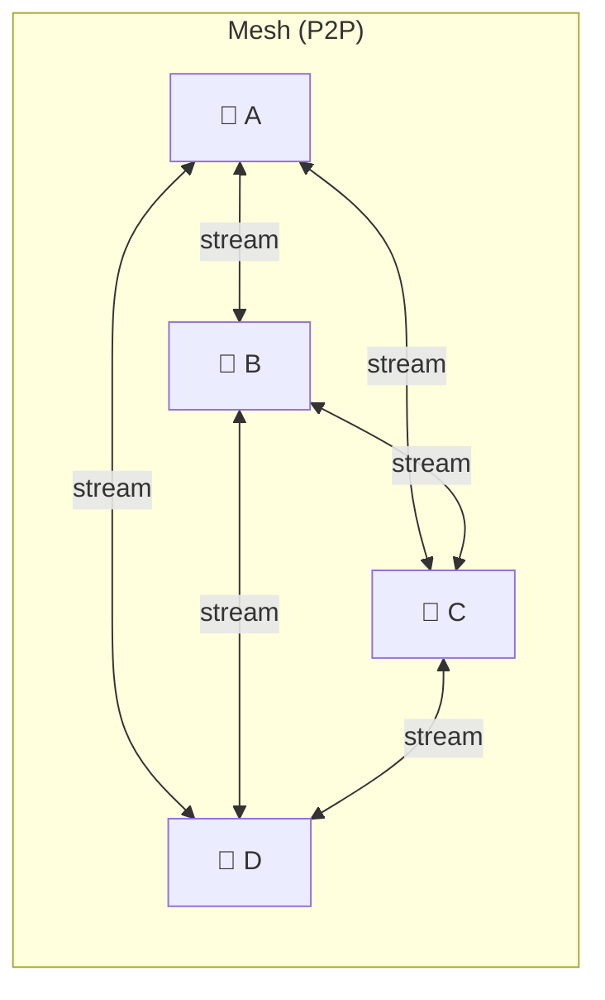
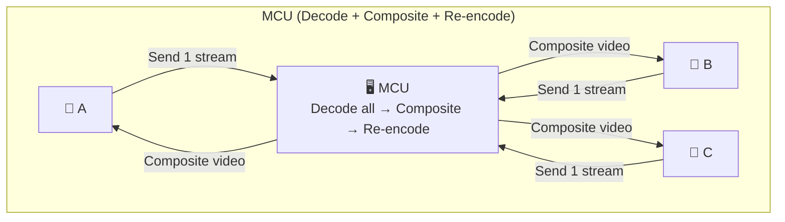
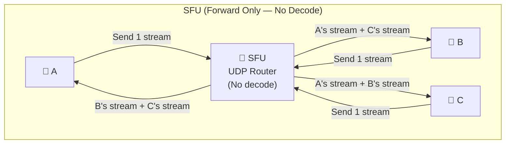
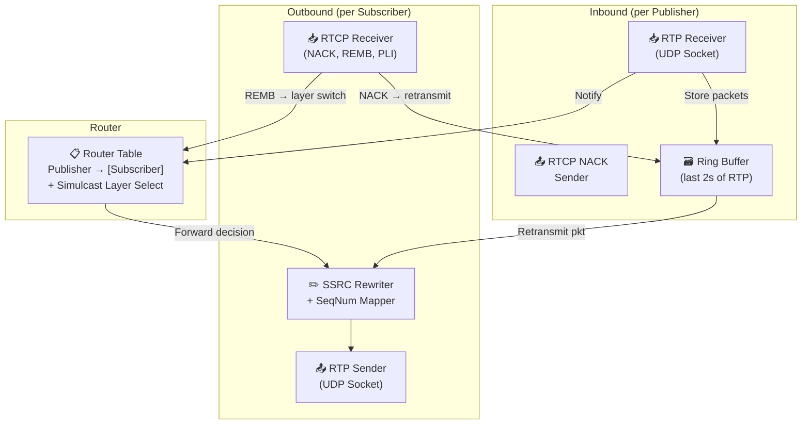

# Chapter 1: The Topology — Mesh vs MCU vs SFU 🟢

> **The Problem:** You need to build a video meeting for 50 participants. A naive peer-to-peer (Mesh) approach requires each client to encode and upload N−1 separate video streams — at 5 participants that's 20 simultaneous streams consuming 40 Mbps upstream bandwidth per user, causing laptops to thermal-throttle and WiFi to collapse. You also cannot decode-transcode-re-encode for 1,000 viewers because a Multipoint Control Unit (MCU) burns 1 CPU core per decoded stream — totalling 1,000 cores for a single meeting. You need a topology that routes media to 1,000 subscribers using only the resources of a packet router: a **Selective Forwarding Unit (SFU)**.

---

## 1.1 The Three Topologies

Every multi-party video system uses one of three fundamental topologies. The difference between them determines your CPU cost, latency budget, scalability ceiling, and engineering complexity.







---

## 1.2 Mesh: Beautiful in Theory, Broken at 5 Users

In a Mesh topology, every participant establishes a direct WebRTC `RTCPeerConnection` to every other participant. Each client:

1. **Encodes** its camera feed once per remote peer (or once with multiple send tracks).
2. **Uploads** the encoded stream N−1 times — once to each other participant.
3. **Downloads** N−1 streams from every other participant.
4. **Decodes** N−1 video streams simultaneously.

### The Math That Kills Mesh

| Participants (N) | Connections (total) | Streams per client (up + down) | Bandwidth per client (@ 2 Mbps each) |
|---|---|---|---|
| 2 | 1 | 1 + 1 = 2 | 4 Mbps |
| 3 | 3 | 2 + 2 = 4 | 8 Mbps |
| 5 | 10 | 4 + 4 = 8 | 16 Mbps |
| 10 | 45 | 9 + 9 = 18 | 36 Mbps |
| 50 | 1,225 | 49 + 49 = 98 | 196 Mbps |

At **5 participants**, each client needs ~16 Mbps of symmetric bandwidth and must decode 4 simultaneous 720p video streams. Most laptop WiFi has 5–10 Mbps *upload*. The CPU has to run 4 parallel H.264 decoders. Chrome starts dropping frames. Battery drains in 20 minutes.

At **10 participants**, you need 36 Mbps symmetric and 9 parallel decoders. This is physically impossible on consumer hardware.

> **Key Insight:** Mesh is O(N²) in connections and O(N) in per-client bandwidth and CPU. It works for 2–3 users. It is architecturally broken for anything larger.

### When Mesh Still Makes Sense

Mesh is the right choice for exactly one scenario: **1:1 calls with no server infrastructure**. Consumer apps (FaceTime-style 1:1 calls) use Mesh because:
- Zero server cost for media relay.
- Lowest possible latency (direct peer-to-peer path).
- Maximum privacy (media never touches a server).

For **anything ≥ 4 participants**, you must centralize.

---

## 1.3 MCU: Correct but Prohibitively Expensive

A **Multipoint Control Unit (MCU)** solves the Mesh problem by centralizing media processing:

1. Each client sends **one** video stream to the MCU.
2. The MCU **decodes** every incoming stream (H.264/VP8/VP9 → raw YUV frames).
3. The MCU **composites** all decoded frames into a single "gallery view" image.
4. The MCU **re-encodes** the composited frame into a single output stream.
5. Each client receives **one** composited stream.

### The CPU Cost

Modern video codecs (H.264, VP9, AV1) are designed to be expensive to encode. Encoding a single 720p30 stream consumes approximately 0.5–1.0 CPU cores (depending on preset and codec). Decoding is cheaper but still significant:

| Operation | CPU per stream (720p30) |
|---|---|
| Decode (H.264) | ~0.1 cores |
| Composite (GPU or CPU blit) | ~0.01 cores per source |
| Encode (H.264 medium) | ~0.5 cores |
| Encode (VP9 realtime) | ~0.8 cores |

For a 50-person meeting, the MCU must:
- **Decode 50 streams:** 50 × 0.1 = 5 cores
- **Composite:** ~0.5 cores
- **Encode 50 personalized outputs:** 50 × 0.5 = 25 cores (each participant gets a layout excluding themselves)

**Total: ~30 CPU cores for a single 50-person meeting.**

For a 1,000-person town hall: ~500+ cores for a single meeting. At $0.05/core-hour, that's $25/hour for one meeting. Multiply by 500,000 concurrent meetings and the bill is **$12.5 million per hour**.

> **Key Insight:** MCUs are O(N) in CPU cost per meeting because they decode and re-encode. They are used in legacy telecom (Cisco CMS, Polycom RMX) where high-quality compositing is mandated, but they are economically unviable for internet-scale conferencing.

### MCU Latency Penalty

The decode-composite-encode pipeline adds **100–200ms** of latency:
- Decode buffering: ~30ms (need full frame).
- Composite: ~5ms.
- Encode: ~50–100ms (needs reference frame buffering, rate control lookahead).
- Output jitter buffer: ~30ms.

This makes the MCU unsuitable for low-latency conversational video where the total mouth-to-ear budget is 200ms.

---

## 1.4 The SFU: A Smart Packet Router

A **Selective Forwarding Unit (SFU)** is the architecture used by Zoom, Google Meet, Microsoft Teams, Discord, and every modern conferencing system at scale. The key insight:

> **The SFU never decodes video. It is a UDP packet router.**

1. Each client sends **one** encoded video stream (or multiple Simulcast layers — see Chapter 3) to the SFU.
2. The SFU **receives RTP packets** and writes them to a per-publisher buffer.
3. For each subscriber, the SFU **reads the relevant packets** from the publisher buffers and **forwards them unchanged** via UDP.
4. The client decodes incoming streams locally.

### Why This Changes Everything

| Property | Mesh | MCU | SFU |
|---|---|---|---|
| Streams uploaded per client | N−1 | 1 | 1 (or 3 for Simulcast) |
| Server decode? | N/A | Yes (all) | **No** |
| Server encode? | N/A | Yes (all) | **No** |
| Server CPU per meeting (50 users) | 0 | ~30 cores | **~0.5 cores** |
| Added server latency | 0 | 100-200ms | **< 5ms** |
| Per-receiver bandwidth adaptation | No | Yes (composited) | **Yes (Simulcast switching)** |
| Scalability ceiling | ~4 users | ~50 users (cost) | **1,000+ users** |
| Client download bandwidth (50 users) | 49 × stream | 1 × stream | 49 × stream (or selective) |

The SFU's CPU cost is dominated by **packet copying** — reading from kernel socket buffers, rewriting RTP headers (SSRC remapping, sequence number rewriting), and writing to outbound sockets. This is I/O-bound, not compute-bound. A single modern server core can forward ~1 Gbps of RTP traffic.

---

## 1.5 SFU Internal Architecture

The SFU is composed of four subsystems: the **RTP Receiver**, the **Router Table**, the **Subscriber Forwarder**, and the **RTCP Feedback Processor**.



### RTP Receiver

The RTP Receiver binds to a UDP socket (one per publisher PeerConnection, or multiplexed via BUNDLE) and parses incoming RTP packets. It extracts:
- **SSRC** (Synchronization Source) — identifies the media stream.
- **Sequence Number** — 16-bit, wrapping, used for loss detection.
- **Timestamp** — RTP timestamp for clock recovery.
- **Payload Type** — identifies the codec (VP8=96, H.264=97, Opus=111, etc.).

Packets are stored in a **ring buffer** indexed by sequence number. The ring buffer holds the last ~2 seconds of packets (~2000 packets for video at 30fps with ~20 packets per frame). This enables retransmission when a subscriber sends a NACK.

### Router Table

The Router Table maintains the mapping: *who is subscribed to whom, and at what Simulcast layer*. When a new RTP packet arrives from Publisher A, the router looks up all subscribers of A and schedules a forwarding operation for each.

### SSRC Rewriting

WebRTC clients expect each incoming stream to have a unique SSRC. Since the SFU is forwarding packets from multiple publishers to a single subscriber PeerConnection, it must **rewrite SSRCs** in forwarded packets to avoid collisions. The SFU maintains a mapping:

```
(publisher_ssrc, subscriber_id) → rewritten_ssrc
```

It must also **rewrite sequence numbers** to be contiguous from the subscriber's perspective — especially important when switching Simulcast layers (Chapter 3), because a layer switch means jumping between different RTP streams with different sequence number spaces.

---

## 1.6 Building the SFU in Rust: Core Data Structures

Let's define the core data structures for a minimal SFU.

### The RTP Packet

```rust
/// A parsed RTP packet header + payload.
/// We keep the raw bytes to enable zero-copy forwarding.
#[derive(Clone)]
pub struct RtpPacket {
    /// Synchronization Source identifier
    pub ssrc: u32,
    /// 16-bit sequence number (wraps at 65535)
    pub sequence_number: u16,
    /// RTP timestamp (codec clock rate dependent)
    pub timestamp: u32,
    /// Payload type (e.g., 96 for VP8, 111 for Opus)
    pub payload_type: u8,
    /// Marker bit — indicates last packet of a video frame
    pub marker: bool,
    /// The complete original packet bytes (header + payload)
    /// Stored as Bytes for zero-copy cloning.
    pub raw: bytes::Bytes,
}

impl RtpPacket {
    /// Parse an RTP packet from raw UDP payload.
    /// Returns None if the packet is too short or has invalid version.
    pub fn parse(data: bytes::Bytes) -> Option<Self> {
        if data.len() < 12 {
            return None;
        }
        let version = (data[0] >> 6) & 0x03;
        if version != 2 {
            return None;
        }
        let marker = (data[1] & 0x80) != 0;
        let payload_type = data[1] & 0x7F;
        let sequence_number = u16::from_be_bytes([data[2], data[3]]);
        let timestamp = u32::from_be_bytes([data[4], data[5], data[6], data[7]]);
        let ssrc = u32::from_be_bytes([data[8], data[9], data[10], data[11]]);

        Some(Self {
            ssrc,
            sequence_number,
            timestamp,
            payload_type,
            marker,
            raw: data,
        })
    }

    /// Rewrite the SSRC and sequence number in-place for forwarding.
    /// Returns a new Bytes with the modified header.
    pub fn rewrite(&self, new_ssrc: u32, new_seq: u16) -> bytes::Bytes {
        let mut buf = bytes::BytesMut::from(self.raw.as_ref());
        buf[2..4].copy_from_slice(&new_seq.to_be_bytes());
        buf[8..12].copy_from_slice(&new_ssrc.to_be_bytes());
        buf.freeze()
    }
}
```

### The Publisher Ring Buffer

```rust
use std::collections::HashMap;

/// A ring buffer that stores the last N RTP packets keyed by sequence number.
/// Enables retransmission on NACK and Simulcast layer switching.
pub struct RtpRingBuffer {
    /// Packets indexed by (sequence_number % capacity)
    packets: Vec<Option<RtpPacket>>,
    capacity: usize,
}

impl RtpRingBuffer {
    pub fn new(capacity: usize) -> Self {
        Self {
            packets: (0..capacity).map(|_| None).collect(),
            capacity,
        }
    }

    pub fn insert(&mut self, packet: RtpPacket) {
        let idx = packet.sequence_number as usize % self.capacity;
        self.packets[idx] = Some(packet);
    }

    pub fn get(&self, seq: u16) -> Option<&RtpPacket> {
        let idx = seq as usize % self.capacity;
        self.packets[idx]
            .as_ref()
            .filter(|pkt| pkt.sequence_number == seq)
    }
}
```

### The Router Table

```rust
use std::collections::{HashMap, HashSet};
use tokio::sync::mpsc;

/// Identifies a participant in the meeting.
pub type ParticipantId = u64;

/// Which Simulcast layer a subscriber wants from a publisher.
#[derive(Debug, Clone, Copy, PartialEq, Eq)]
pub enum SimulcastLayer {
    /// 1080p — high quality, ~2.5 Mbps
    High,
    /// 720p — medium quality, ~1.0 Mbps
    Medium,
    /// 360p — low quality, ~300 kbps
    Low,
}

/// A subscription: subscriber S wants publisher P's stream at layer L.
#[derive(Debug, Clone)]
pub struct Subscription {
    pub publisher_id: ParticipantId,
    pub subscriber_id: ParticipantId,
    pub layer: SimulcastLayer,
}

/// The Router Table maps publishers to their subscribers.
/// This is the core forwarding decision structure.
pub struct RouterTable {
    /// publisher_id → list of (subscriber_id, desired_layer, outbound_channel)
    subscriptions: HashMap<ParticipantId, Vec<SubscriberSlot>>,
}

struct SubscriberSlot {
    subscriber_id: ParticipantId,
    layer: SimulcastLayer,
    /// Channel to the subscriber's outbound task
    tx: mpsc::Sender<RtpPacket>,
    /// Rewritten SSRC for this (publisher, subscriber) pair
    rewritten_ssrc: u32,
    /// Sequence number offset for contiguous rewriting
    seq_offset: i32,
}

impl RouterTable {
    pub fn new() -> Self {
        Self {
            subscriptions: HashMap::new(),
        }
    }

    /// Forward a packet from a publisher to all its subscribers.
    /// Only sends to subscribers whose desired layer matches the packet's layer.
    pub async fn forward(
        &self,
        publisher_id: ParticipantId,
        packet: &RtpPacket,
        packet_layer: SimulcastLayer,
    ) {
        if let Some(subs) = self.subscriptions.get(&publisher_id) {
            for slot in subs {
                if slot.layer == packet_layer {
                    let new_seq = (packet.sequence_number as i32 + slot.seq_offset) as u16;
                    let rewritten = packet.rewrite(slot.rewritten_ssrc, new_seq);
                    let mut fwd_packet = packet.clone();
                    fwd_packet.raw = rewritten;
                    // Non-blocking send — drop packet if subscriber is slow
                    let _ = slot.tx.try_send(fwd_packet);
                }
            }
        }
    }
}
```

---

## 1.7 The SFU's I/O Model: Why Rust Excels

The SFU is a **packet-level data plane**. Its hot path is:

1. `recvmsg()` → read UDP packet from kernel buffer (~1 μs).
2. Parse RTP header (~50 ns).
3. Store in ring buffer (~20 ns).
4. Look up subscriber list (~100 ns).
5. Rewrite SSRC + sequence number (~30 ns per subscriber).
6. `sendmsg()` → write to each subscriber's UDP socket (~1 μs per packet).

For a meeting with 1 publisher and 100 subscribers, each incoming packet generates 100 outgoing packets. At 30fps video with ~20 packets per frame, thats 600 packets/second in and 60,000 packets/second out — per video stream.

### Why Not Go or Java?

| Concern | Go / Java / Node | Rust / C++ |
|---|---|---|
| GC pauses | 1–10ms STW pauses break real-time SLA | No GC — deterministic latency |
| Memory per connection | ~8 KB goroutine / ~1 MB thread | ~200 bytes of state |
| UDP `sendmmsg` batching | Requires CGo / JNI | Native syscall access |
| Zero-copy packet forwarding | GC moves objects, invalidating pointers | `bytes::Bytes` refcount, no copy |
| SIMD for RTP header parsing | Rare | `std::arch` intrinsics available |
| Tail latency (p99.9) | 10–50ms (GC + scheduler) | < 1ms |

Real-time media has a **hard deadline**: if a video frame's last packet arrives > 33ms late (for 30fps), the frame is missed. GC pauses of even 5ms cascade into visible glitches.

### The `recvmmsg` / `sendmmsg` Optimization

Linux provides `recvmmsg(2)` and `sendmmsg(2)` syscalls that read/write **multiple UDP packets in a single syscall**. This amortizes the user-kernel context switch cost:

```rust
use std::os::unix::io::AsRawFd;
use std::net::UdpSocket;

/// Batch-receive up to `batch_size` UDP packets in a single syscall.
/// Returns the number of packets received.
///
/// # Safety
/// Uses raw `recvmmsg` syscall. Buffers must be pre-allocated.
#[cfg(target_os = "linux")]
pub unsafe fn recv_batch(
    socket: &UdpSocket,
    buffers: &mut [Vec<u8>],
    lengths: &mut [usize],
    batch_size: usize,
) -> std::io::Result<usize> {
    use libc::{mmsghdr, iovec, recvmmsg, sockaddr_storage};
    use std::mem::zeroed;
    use std::ptr;

    let fd = socket.as_raw_fd();
    let count = batch_size.min(buffers.len());

    let mut iovecs: Vec<iovec> = Vec::with_capacity(count);
    let mut msgs: Vec<mmsghdr> = Vec::with_capacity(count);
    let mut addrs: Vec<sockaddr_storage> = vec![unsafe { zeroed() }; count];

    for i in 0..count {
        iovecs.push(iovec {
            iov_base: buffers[i].as_mut_ptr() as *mut _,
            iov_len: buffers[i].len(),
        });
        let mut msg: mmsghdr = unsafe { zeroed() };
        msg.msg_hdr.msg_iov = &mut iovecs[i];
        msg.msg_hdr.msg_iovlen = 1;
        msg.msg_hdr.msg_name = &mut addrs[i] as *mut _ as *mut _;
        msg.msg_hdr.msg_namelen = std::mem::size_of::<sockaddr_storage>() as u32;
        msgs.push(msg);
    }

    let n = unsafe {
        recvmmsg(fd, msgs.as_mut_ptr(), count as u32, 0, ptr::null_mut())
    };
    if n < 0 {
        return Err(std::io::Error::last_os_error());
    }

    for i in 0..n as usize {
        lengths[i] = msgs[i].msg_len as usize;
    }

    Ok(n as usize)
}
```

A production SFU typically uses a batch size of 64–256 packets, reducing syscall overhead by 10–50× compared to individual `recvfrom` calls.

---

## 1.8 RTCP: The Feedback Loop

RTCP (RTP Control Protocol) runs alongside RTP on the same UDP transport (multiplexed via BUNDLE). It provides critical feedback:

| RTCP Message | Direction | Purpose |
|---|---|---|
| **Sender Report (SR)** | Publisher → SFU → Subscribers | NTP-RTP timestamp mapping for lip-sync |
| **Receiver Report (RR)** | Subscriber → SFU | Packet loss fraction, jitter, RTT |
| **NACK** | Subscriber → SFU | Request retransmission of specific sequence numbers |
| **PLI** (Picture Loss Indication) | Subscriber → SFU → Publisher | Request a new keyframe (IDR) |
| **FIR** (Full Intra Request) | SFU → Publisher | Force an immediate keyframe |
| **REMB** (Receiver Estimated Max Bitrate) | Subscriber → SFU | Subscriber's available bandwidth estimate |

### NACK Handling in the SFU

When a subscriber detects a missing RTP packet (gap in sequence numbers), it sends a NACK to the SFU. The SFU looks up the packet in the publisher's ring buffer and retransmits it:

```rust
/// Process a NACK from a subscriber.
/// Retransmits the requested packets from the publisher's ring buffer.
pub fn handle_nack(
    publisher_buffer: &RtpRingBuffer,
    subscriber_slot: &SubscriberSlot,
    lost_sequence_numbers: &[u16],
    tx: &tokio::sync::mpsc::Sender<RtpPacket>,
) {
    for &seq in lost_sequence_numbers {
        // Convert from subscriber's rewritten seq to publisher's original seq
        let original_seq = (seq as i32 - subscriber_slot.seq_offset) as u16;
        if let Some(pkt) = publisher_buffer.get(original_seq) {
            let rewritten = pkt.rewrite(
                subscriber_slot.rewritten_ssrc,
                seq,
            );
            let mut fwd = pkt.clone();
            fwd.raw = rewritten;
            let _ = tx.try_send(fwd);
        }
    }
}
```

### PLI Aggregation

If 100 subscribers simultaneously send PLI (requesting a keyframe from the same publisher), the SFU should **not** forward 100 PLI messages to the publisher — that would cause the encoder to generate 100 keyframes, devastating the encoder's rate control. Instead, the SFU **aggregates** PLIs:

```rust
use std::time::Instant;

/// Throttle PLI requests to a publisher. Forward at most one PLI per 
/// interval to prevent keyframe flooding.
pub struct PliThrottle {
    last_pli_sent: Option<Instant>,
    min_interval: std::time::Duration,
}

impl PliThrottle {
    pub fn new(min_interval: std::time::Duration) -> Self {
        Self {
            last_pli_sent: None,
            min_interval,
        }
    }

    /// Returns true if a PLI should be forwarded to the publisher.
    pub fn should_send(&mut self) -> bool {
        let now = Instant::now();
        match self.last_pli_sent {
            Some(last) if now.duration_since(last) < self.min_interval => false,
            _ => {
                self.last_pli_sent = Some(now);
                true
            }
        }
    }
}
```

---

## 1.9 Scaling the SFU: One Server Is Not Enough

A single SFU server can handle **~5,000–10,000 media streams** (a mix of publishers and subscribers) depending on hardware and network I/O capacity. For a platform with 500,000 concurrent meetings:

| Meeting size | Meetings | Streams per meeting | Total streams |
|---|---|---|---|
| 2 (1:1 calls) | 400,000 | 4 (2 up + 2 down) | 1,600,000 |
| 10 (team meetings) | 80,000 | 100 (10 up + 90 down) | 8,000,000 |
| 50 (department meetings) | 15,000 | 2,500 | 37,500,000 |
| 1,000 (town halls) | 5,000 | 50,000 | 250,000,000 |

**~300 million streams** across the platform. At 10,000 streams per SFU, you need **~30,000 SFU servers** globally.

### Meeting-to-SFU Assignment

When a new meeting is created, a **meeting allocator** selects which SFU server hosts it. The decision is based on:

1. **Geographic proximity** — assign the meeting to an SFU in the region where the first participant connects.
2. **Server load** — avoid overloading a single SFU.
3. **Room stickiness** — once assigned, all participants in that meeting connect to the same SFU (unless cascading is used — Chapter 5).

```rust
use std::collections::HashMap;

/// A simple least-loaded SFU allocator.
pub struct SfuAllocator {
    /// SFU addresses keyed by region, sorted by current load.
    servers: HashMap<String, Vec<SfuEntry>>,
}

#[derive(Clone)]
struct SfuEntry {
    address: String,
    current_streams: u32,
    max_streams: u32,
}

impl SfuAllocator {
    /// Allocate an SFU for a new meeting in the given region.
    /// Returns the SFU address, or None if all servers are full.
    pub fn allocate(&mut self, region: &str) -> Option<String> {
        let servers = self.servers.get_mut(region)?;
        // Find the least-loaded server with capacity
        servers.sort_by_key(|s| s.current_streams);
        let server = servers.iter_mut().find(|s| s.current_streams < s.max_streams)?;
        server.current_streams += 1;
        Some(server.address.clone())
    }
}
```

---

## 1.10 Putting It All Together: The SFU Event Loop

Here is the high-level event loop for a single SFU process handling one meeting:

```rust
use tokio::net::UdpSocket;
use tokio::sync::mpsc;
use bytes::BytesMut;

/// Main SFU event loop for a single meeting room.
pub async fn sfu_room_loop(
    socket: UdpSocket,
    mut router: RouterTable,
    mut buffers: HashMap<ParticipantId, RtpRingBuffer>,
) {
    let mut recv_buf = vec![0u8; 1500]; // MTU-sized buffer

    loop {
        // 1. Receive a UDP packet
        let (len, src_addr) = match socket.recv_from(&mut recv_buf).await {
            Ok(result) => result,
            Err(_) => continue,
        };

        let data = bytes::Bytes::copy_from_slice(&recv_buf[..len]);

        // 2. Determine if this is RTP or RTCP
        //    RTP payload types are in range 96-127 for dynamic types
        //    RTCP payload types are 200-206
        let pt = data[1] & 0x7F;

        if (200..=206).contains(&pt) {
            // RTCP packet — handle feedback (NACK, PLI, REMB)
            handle_rtcp_packet(&data, &router, &buffers).await;
        } else {
            // RTP packet — parse, buffer, and forward
            if let Some(packet) = RtpPacket::parse(data) {
                let publisher_id = resolve_publisher(&src_addr);

                // 3. Store in publisher's ring buffer
                if let Some(buf) = buffers.get_mut(&publisher_id) {
                    buf.insert(packet.clone());
                }

                // 4. Determine Simulcast layer from SSRC mapping
                let layer = resolve_simulcast_layer(publisher_id, packet.ssrc);

                // 5. Forward to all subscribers
                router.forward(publisher_id, &packet, layer).await;
            }
        }
    }
}

// Placeholder functions for the event loop
fn resolve_publisher(_addr: &std::net::SocketAddr) -> ParticipantId { 0 }
fn resolve_simulcast_layer(_pub_id: ParticipantId, _ssrc: u32) -> SimulcastLayer {
    SimulcastLayer::High
}
async fn handle_rtcp_packet(
    _data: &bytes::Bytes,
    _router: &RouterTable,
    _buffers: &HashMap<ParticipantId, RtpRingBuffer>,
) {}
```

---

## 1.11 Topology Decision Matrix

Use this matrix to select the right topology for your use case:

| Factor | Mesh | MCU | SFU |
|---|---|---|---|
| Max participants | 3–4 | 50 (cost-limited) | **1,000+** |
| Server CPU cost | None | Very High | **Very Low** |
| Client CPU cost | High (N decoders) | Low (1 decoder) | **Medium (N decoders)** |
| Client upload bandwidth | High (N streams) | Low (1 stream) | **Low (1–3 streams)** |
| Server-added latency | 0ms | 100–200ms | **< 5ms** |
| Per-receiver quality adapt | No | Yes (composite) | **Yes (Simulcast)** |
| Privacy (no server decode) | ✅ | ❌ | **✅** |
| E2E encryption possible | ✅ | ❌ (must decode) | **✅ (Insertable Streams)** |
| Infrastructure cost at scale | $0 | $$$$ | **$** |
| Best for | 1:1 calls | Legacy telecom | **All modern platforms** |

---

## 1.12 Real-World SFU Implementations

| SFU | Language | Open Source | Used By |
|---|---|---|---|
| mediasoup | C++ (worker) + Node (signaling) | Yes | Many startups |
| Janus | C | Yes | Meetecho, educational platforms |
| Pion | Go | Yes | LiveKit, Twilio |
| ion-sfu | Go | Yes | Community projects |
| LiveKit | Go (media) + Rust (Egress) | Yes | LiveKit Cloud |
| Jitsi Videobridge | Java | Yes | Jitsi Meet, 8x8 |
| Custom (Zoom) | C++ | No | Zoom |
| Custom (Teams) | C++ | No | Microsoft Teams |
| Custom (Meet) | C++ | No | Google Meet |

> **Key Insight:** Every hyperscaler (Zoom, Teams, Meet) builds their SFU in C++ or is migrating critical paths to Rust. The latency and memory guarantees of systems languages are non-negotiable for the media data plane.

---

> **Key Takeaways**
>
> 1. **Mesh is O(N²) and breaks at 5 users** — each client must encode, upload, download, and decode N−1 streams. Consumer hardware cannot handle it.
> 2. **MCUs decode and re-encode all streams** — correct but the CPU cost is O(N) per meeting and adds 100–200ms of latency. Economically unviable at internet scale.
> 3. **The SFU is a UDP packet router** — it never decodes video. It receives encoded RTP packets and forwards them to subscribers with SSRC/sequence number rewriting. CPU cost is dominated by packet I/O, not codec processing.
> 4. **Rust is ideal for SFU development** — no GC pauses, zero-copy `bytes::Bytes` for packet forwarding, native `recvmmsg`/`sendmmsg` for syscall batching, and deterministic sub-millisecond latency.
> 5. **RTCP feedback (NACK, PLI, REMB)** is the SFU's control plane — it enables retransmission, keyframe requests, and bandwidth adaptation without ever touching the media payload.
> 6. **A single SFU handles ~10,000 streams** — to serve 500,000 concurrent meetings, you need ~30,000 SFU servers globally, assigned via a least-loaded geographic allocator.
