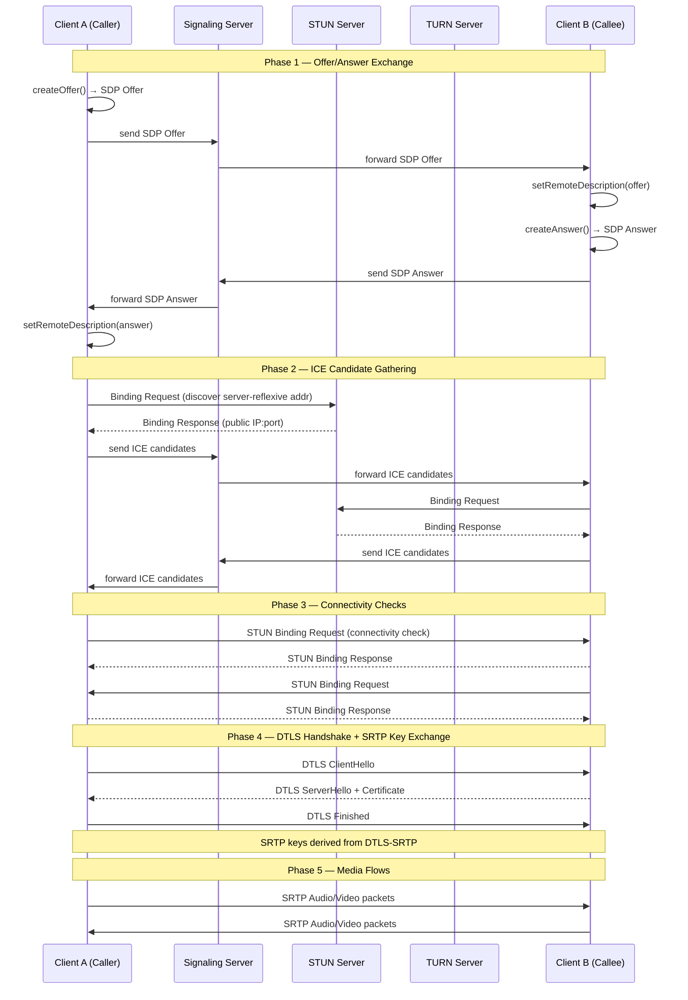
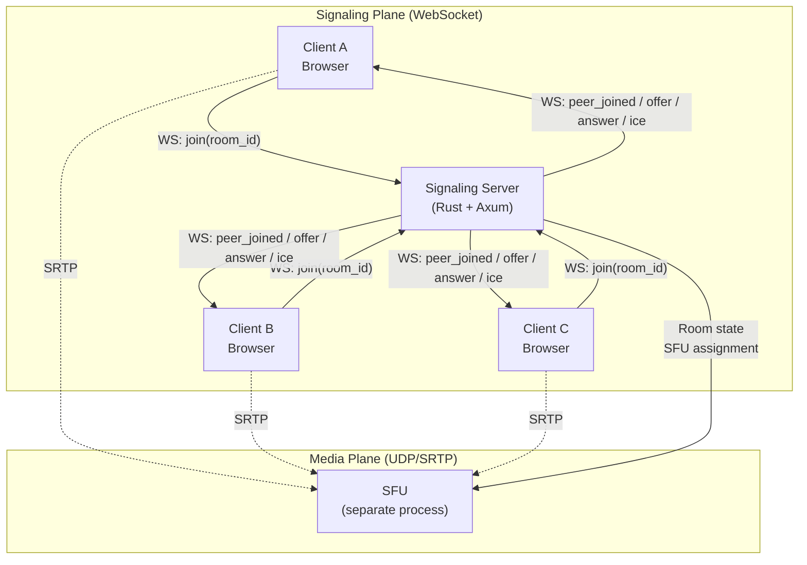
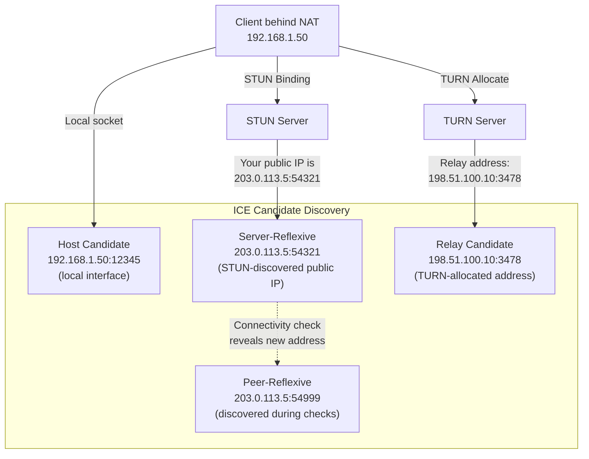
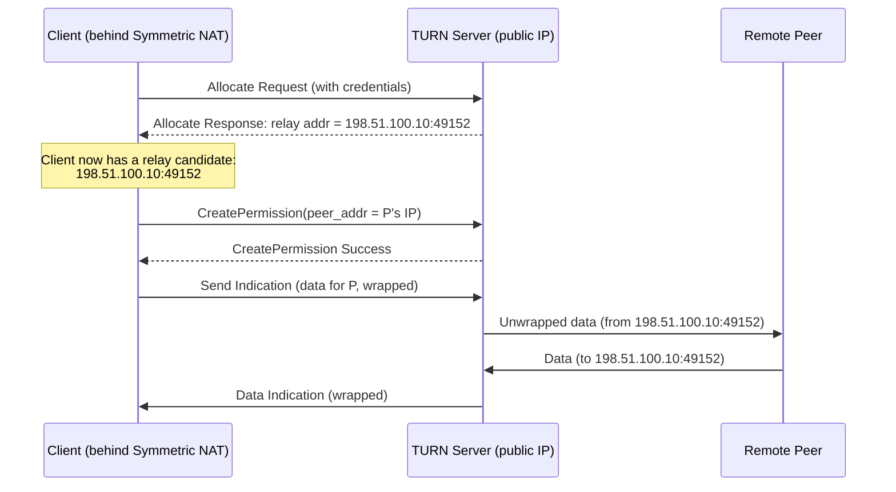
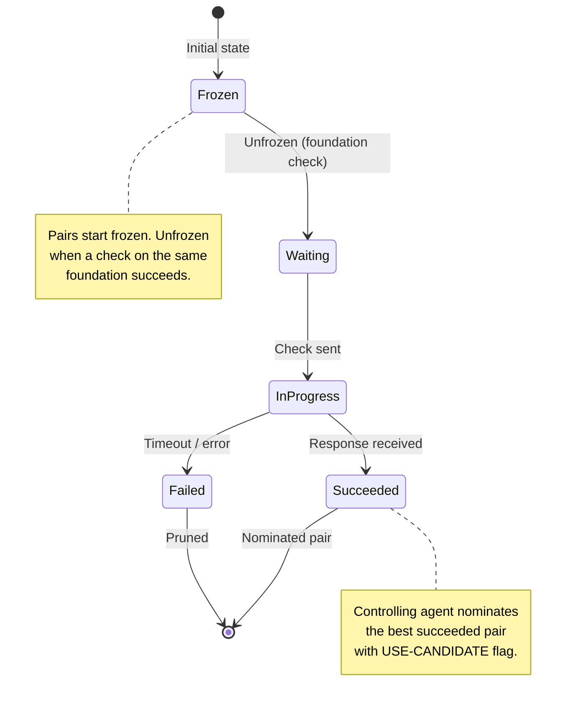
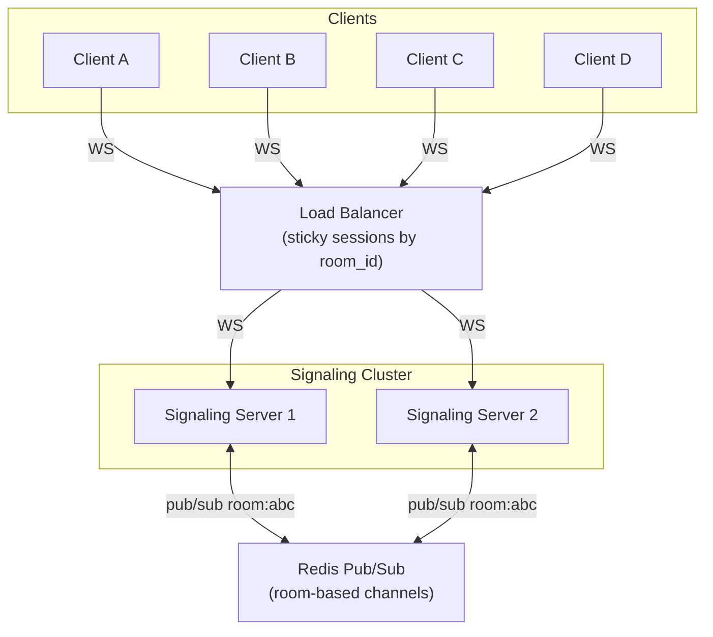

# Chapter 2: WebRTC Signaling and ICE 🟡

> **The Problem:** Two browsers want to exchange real-time video. They share no common network, sit behind corporate firewalls with symmetric NATs, and have no idea of each other's IP addresses. Before a single video frame can flow, you must solve three problems simultaneously: **signaling** (how do the peers discover each other and agree on codecs?), **NAT traversal** (how do you punch a UDP hole through two layers of NAT?), and **connectivity checking** (which of the 20+ candidate address pairs actually works best?). Get any of these wrong and the user sees a black screen with a spinning indicator — the worst possible first impression.

---

## 2.1 The WebRTC Connection Lifecycle

Every WebRTC session follows a precise choreography. Understanding this sequence is essential before writing a single line of signaling code.



### The Five Phases

| Phase | Protocol | Purpose | Failure Mode |
|---|---|---|---|
| 1. Offer/Answer | SDP over WebSocket | Agree on codecs, media types, ICE credentials | Mismatched codec capabilities → no media |
| 2. ICE Gathering | STUN/TURN | Discover all possible network addresses | No server-reflexive candidates → NAT traversal fails |
| 3. Connectivity Checks | STUN (peer-to-peer) | Find the best working address pair | All pairs fail → fall back to TURN relay |
| 4. DTLS Handshake | DTLS 1.2 over ICE | Authenticate peers and derive SRTP keys | Certificate mismatch → connection rejected |
| 5. Media Flow | SRTP/SRTCP over UDP | Encrypted audio/video transport | Packet loss > 15% → quality collapses |

---

## 2.2 SDP: The Session Description Protocol

SDP is the lingua franca of WebRTC negotiation. It is a text-based protocol (RFC 8866) that describes what media a peer can send and receive.

### Anatomy of an SDP Offer

```text
v=0
o=- 4611731400430051336 2 IN IP4 127.0.0.1
s=-
t=0 0
a=group:BUNDLE 0 1
a=extmap-allow-mixed
a=msid-semantic: WMS stream0

m=audio 9 UDP/TLS/RTP/SAVPF 111 63 9 0 8 13 110 126
c=IN IP4 0.0.0.0
a=rtcp:9 IN IP4 0.0.0.0
a=ice-ufrag:EsAO
a=ice-pwd:bP+XJMM09aR8AXeS2vJlaN2x
a=fingerprint:sha-256 D1:20:B4:2C:...
a=setup:actpass
a=mid:0
a=sendrecv
a=rtcp-mux
a=rtpmap:111 opus/48000/2
a=fmtp:111 minptime=10;useinbandfec=1
a=rtpmap:9 G722/8000

m=video 9 UDP/TLS/RTP/SAVPF 96 97 98 99
c=IN IP4 0.0.0.0
a=rtcp:9 IN IP4 0.0.0.0
a=ice-ufrag:EsAO
a=ice-pwd:bP+XJMM09aR8AXeS2vJlaN2x
a=fingerprint:sha-256 D1:20:B4:2C:...
a=setup:actpass
a=mid:1
a=sendrecv
a=rtcp-mux
a=rtcp-rsize
a=rtpmap:96 VP8/90000
a=rtcp-fb:96 goog-remb
a=rtcp-fb:96 transport-cc
a=rtcp-fb:96 nack
a=rtcp-fb:96 nack pli
a=rtpmap:97 rtx/90000
a=fmtp:97 apt=96
a=rtpmap:98 VP9/90000
a=rtpmap:99 rtx/90000
a=fmtp:99 apt=98
```

### Critical SDP Fields for SFU Integration

| SDP Line | Purpose | SFU Relevance |
|---|---|---|
| `a=ice-ufrag` / `a=ice-pwd` | ICE short-term credentials | SFU uses these for STUN connectivity checks |
| `a=fingerprint:sha-256` | DTLS certificate fingerprint | SFU verifies client identity during DTLS |
| `a=setup:actpass` | DTLS role negotiation | SFU always sets `a=setup:active` in answer |
| `a=rtpmap:111 opus/48000/2` | Codec declaration (Opus audio) | SFU forwards Opus packets without re-encoding |
| `a=rtcp-fb:96 transport-cc` | Transport-wide congestion control | SFU generates TWCC feedback to senders |
| `a=rtcp-fb:96 nack` | Negative acknowledgement | SFU retransmits lost packets from its jitter buffer |
| `a=rtcp-fb:96 nack pli` | Picture Loss Indication | SFU requests keyframes when new subscribers join |
| `a=extmap` | RTP header extensions | SFU reads abs-send-time, transport-cc seq numbers |
| `a=ssrc` | Synchronization source IDs | SFU maps SSRCs to participant tracks |

---

## 2.3 Building the Signaling Server in Rust

The signaling server's only job is to relay SDP offers/answers and ICE candidates between peers — it never touches media. WebSockets are the standard transport.

### Architecture



### Signaling Protocol Messages

```rust
use serde::{Deserialize, Serialize};

/// Every message on the signaling WebSocket is one of these variants.
#[derive(Debug, Serialize, Deserialize)]
#[serde(tag = "type", rename_all = "snake_case")]
enum SignalMessage {
    /// Client → Server: join a meeting room.
    Join {
        room_id: String,
        /// Opaque display name (never used for auth).
        display_name: String,
    },

    /// Server → Client: a new peer has joined the room.
    PeerJoined {
        peer_id: String,
        display_name: String,
    },

    /// Client → Server → Client: SDP offer for a new PeerConnection.
    Offer {
        from: String,
        to: String,
        sdp: String,
    },

    /// Client → Server → Client: SDP answer.
    Answer {
        from: String,
        to: String,
        sdp: String,
    },

    /// Client → Server → Client: trickle ICE candidate.
    IceCandidate {
        from: String,
        to: String,
        candidate: String,
        sdp_mid: Option<String>,
        sdp_m_line_index: Option<u32>,
    },

    /// Server → Client: a peer has left the room.
    PeerLeft { peer_id: String },

    /// Server → Client: error notification.
    Error { message: String },
}
```

### Signaling Server Implementation

```rust
use axum::{
    extract::{
        ws::{Message, WebSocket},
        State, WebSocketUpgrade,
    },
    response::IntoResponse,
    routing::get,
    Router,
};
use dashmap::DashMap;
use std::sync::Arc;
use tokio::sync::broadcast;
use uuid::Uuid;

/// Shared state across all WebSocket connections.
struct AppState {
    /// room_id → set of (peer_id, sender channel).
    rooms: DashMap<String, Vec<Peer>>,
}

struct Peer {
    id: String,
    display_name: String,
    tx: broadcast::Sender<String>,
}

async fn ws_handler(
    ws: WebSocketUpgrade,
    State(state): State<Arc<AppState>>,
) -> impl IntoResponse {
    ws.on_upgrade(move |socket| handle_connection(socket, state))
}

async fn handle_connection(mut socket: WebSocket, state: Arc<AppState>) {
    let peer_id = Uuid::new_v4().to_string();
    let (tx, _) = broadcast::channel(256);
    let mut current_room: Option<String> = None;
    let mut rx = tx.subscribe();

    loop {
        tokio::select! {
            // Inbound: message from this client's WebSocket
            Some(Ok(Message::Text(text))) = socket.recv() => {
                let msg: SignalMessage = match serde_json::from_str(&text) {
                    Ok(m) => m,
                    Err(_) => {
                        let err = SignalMessage::Error {
                            message: "Invalid message format".into(),
                        };
                        let _ = socket
                            .send(Message::Text(
                                serde_json::to_string(&err).unwrap().into(),
                            ))
                            .await;
                        continue;
                    }
                };

                match msg {
                    SignalMessage::Join { room_id, display_name } => {
                        // Notify existing peers
                        if let Some(room) = state.rooms.get(&room_id) {
                            for peer in room.iter() {
                                let notification = SignalMessage::PeerJoined {
                                    peer_id: peer_id.clone(),
                                    display_name: display_name.clone(),
                                };
                                let _ = peer.tx.send(
                                    serde_json::to_string(&notification).unwrap(),
                                );
                            }
                        }

                        // Add self to room
                        state
                            .rooms
                            .entry(room_id.clone())
                            .or_default()
                            .push(Peer {
                                id: peer_id.clone(),
                                display_name,
                                tx: tx.clone(),
                            });

                        current_room = Some(room_id);
                    }

                    SignalMessage::Offer { to, sdp, .. } => {
                        relay_to_peer(&state, &current_room, &to, &SignalMessage::Offer {
                            from: peer_id.clone(),
                            to: to.clone(),
                            sdp,
                        });
                    }

                    SignalMessage::Answer { to, sdp, .. } => {
                        relay_to_peer(&state, &current_room, &to, &SignalMessage::Answer {
                            from: peer_id.clone(),
                            to: to.clone(),
                            sdp,
                        });
                    }

                    SignalMessage::IceCandidate {
                        to,
                        candidate,
                        sdp_mid,
                        sdp_m_line_index,
                        ..
                    } => {
                        relay_to_peer(
                            &state,
                            &current_room,
                            &to,
                            &SignalMessage::IceCandidate {
                                from: peer_id.clone(),
                                to: to.clone(),
                                candidate,
                                sdp_mid,
                                sdp_m_line_index,
                            },
                        );
                    }

                    _ => {}
                }
            }

            // Outbound: message from another peer via broadcast
            Ok(text) = rx.recv() => {
                let _ = socket.send(Message::Text(text.into())).await;
            }

            else => break,
        }
    }

    // Cleanup: remove peer from room, notify others
    if let Some(room_id) = &current_room {
        if let Some(mut room) = state.rooms.get_mut(room_id) {
            room.retain(|p| p.id != peer_id);
            for peer in room.iter() {
                let notification = SignalMessage::PeerLeft {
                    peer_id: peer_id.clone(),
                };
                let _ = peer.tx.send(
                    serde_json::to_string(&notification).unwrap(),
                );
            }
        }
    }
}

fn relay_to_peer(
    state: &AppState,
    current_room: &Option<String>,
    to: &str,
    msg: &SignalMessage,
) {
    if let Some(room_id) = current_room {
        if let Some(room) = state.rooms.get(room_id) {
            if let Some(peer) = room.iter().find(|p| p.id == to) {
                let _ = peer.tx.send(serde_json::to_string(msg).unwrap());
            }
        }
    }
}

#[tokio::main]
async fn main() {
    let state = Arc::new(AppState {
        rooms: DashMap::new(),
    });

    let app = Router::new()
        .route("/ws", get(ws_handler))
        .with_state(state);

    let listener = tokio::net::TcpListener::bind("0.0.0.0:8080")
        .await
        .unwrap();
    axum::serve(listener, app).await.unwrap();
}
```

> **Design Decision:** The signaling server is intentionally stateless with respect to media. It knows nothing about codecs, RTP, or SRTP. This separation means you can scale the signaling plane horizontally behind a load balancer while the SFU media plane scales independently.

---

## 2.4 ICE: Interactive Connectivity Establishment

ICE (RFC 8445) is the protocol that solves NAT traversal. It works by discovering every possible way two peers might be able to communicate, then systematically testing each pair to find the best one.

### Candidate Types



| Candidate Type | Source | Priority | Latency | Cost |
|---|---|---|---|---|
| **Host** | Local network interface | Highest | Lowest (LAN) | Free |
| **Server-Reflexive** | STUN binding response | High | Low (direct UDP) | Free (STUN is cheap) |
| **Peer-Reflexive** | Discovered during checks | Medium-High | Low (direct UDP) | Free |
| **Relay** | TURN allocation | Lowest | Highest (double hop) | Expensive (bandwidth cost) |

### The NAT Problem

Not all NATs are equal. The success rate of direct connectivity depends entirely on the NAT type:

| NAT Type | How It Maps | Server-Reflexive Works? | Direct P2P? |
|---|---|---|---|
| **Full Cone** | Same external port for all destinations | ✅ | ✅ Always |
| **Address-Restricted** | Same port, but filters by remote IP | ✅ | ✅ With STUN |
| **Port-Restricted** | Same port, filters by remote IP:port | ✅ | ✅ With STUN (both sides) |
| **Symmetric** | Different external port per destination | ⚠️ Port predicted wrong | ❌ Must use TURN |

**Symmetric NAT** is the killer. Enterprise firewalls almost always use symmetric NAT. When Client A sends a STUN binding request to the STUN server, the NAT assigns external port 54321. But when Client A sends a connectivity check to Client B, the NAT assigns a *different* external port (54322). Client B was told to send to 54321 — which the NAT drops.

> **Key Insight:** Approximately 8–12% of enterprise users sit behind symmetric NATs. If your system doesn't deploy TURN servers, those users get black screens. This is why the industry target is 99.5%+ NAT traversal success, with TURN as the guaranteed fallback.

---

## 2.5 STUN: Session Traversal Utilities for NAT

STUN (RFC 8489) is a lightweight protocol that allows a client behind a NAT to discover its public IP address and port mapping.

### STUN Binding Transaction

```rust
/// Minimal STUN Binding Request builder for ICE connectivity checks.
///
/// STUN message format (RFC 8489 §6):
///   0                   1                   2                   3
///   0 1 2 3 4 5 6 7 8 9 0 1 2 3 4 5 6 7 8 9 0 1 2 3 4 5 6 7 8 9 0 1
///  +-+-+-+-+-+-+-+-+-+-+-+-+-+-+-+-+-+-+-+-+-+-+-+-+-+-+-+-+-+-+-+-+
///  |0 0|     STUN Message Type     |         Message Length        |
///  +-+-+-+-+-+-+-+-+-+-+-+-+-+-+-+-+-+-+-+-+-+-+-+-+-+-+-+-+-+-+-+-+
///  |                         Magic Cookie                          |
///  +-+-+-+-+-+-+-+-+-+-+-+-+-+-+-+-+-+-+-+-+-+-+-+-+-+-+-+-+-+-+-+-+
///  |                     Transaction ID (96 bits)                  |
///  +-+-+-+-+-+-+-+-+-+-+-+-+-+-+-+-+-+-+-+-+-+-+-+-+-+-+-+-+-+-+-+-+

const STUN_MAGIC_COOKIE: u32 = 0x2112A442;
const STUN_BINDING_REQUEST: u16 = 0x0001;
const STUN_BINDING_RESPONSE: u16 = 0x0101;
const STUN_HEADER_SIZE: usize = 20;

#[derive(Debug)]
struct StunMessage {
    msg_type: u16,
    transaction_id: [u8; 12],
    attributes: Vec<StunAttribute>,
}

#[derive(Debug)]
enum StunAttribute {
    XorMappedAddress { ip: std::net::IpAddr, port: u16 },
    Username(String),
    MessageIntegrity([u8; 20]),
    Fingerprint(u32),
}

impl StunMessage {
    fn new_binding_request() -> Self {
        let mut transaction_id = [0u8; 12];
        getrandom::getrandom(&mut transaction_id)
            .expect("failed to generate random transaction ID");
        Self {
            msg_type: STUN_BINDING_REQUEST,
            transaction_id,
            attributes: Vec::new(),
        }
    }

    fn encode(&self) -> Vec<u8> {
        let mut buf = Vec::with_capacity(STUN_HEADER_SIZE + 128);

        // Header: type (2) + length (2) + magic cookie (4) + txn id (12)
        buf.extend_from_slice(&self.msg_type.to_be_bytes());
        buf.extend_from_slice(&0u16.to_be_bytes()); // placeholder for length
        buf.extend_from_slice(&STUN_MAGIC_COOKIE.to_be_bytes());
        buf.extend_from_slice(&self.transaction_id);

        // Encode attributes...
        let attr_len = (buf.len() - STUN_HEADER_SIZE) as u16;
        buf[2..4].copy_from_slice(&attr_len.to_be_bytes());

        buf
    }

    fn parse_binding_response(data: &[u8]) -> Option<(std::net::IpAddr, u16)> {
        if data.len() < STUN_HEADER_SIZE {
            return None;
        }

        let msg_type = u16::from_be_bytes([data[0], data[1]]);
        if msg_type != STUN_BINDING_RESPONSE {
            return None;
        }

        // Verify magic cookie
        let cookie = u32::from_be_bytes([data[4], data[5], data[6], data[7]]);
        if cookie != STUN_MAGIC_COOKIE {
            return None;
        }

        // Parse attributes looking for XOR-MAPPED-ADDRESS (0x0020)
        let msg_len = u16::from_be_bytes([data[2], data[3]]) as usize;
        let mut offset = STUN_HEADER_SIZE;
        let end = STUN_HEADER_SIZE + msg_len.min(data.len() - STUN_HEADER_SIZE);

        while offset + 4 <= end {
            let attr_type = u16::from_be_bytes([data[offset], data[offset + 1]]);
            let attr_len =
                u16::from_be_bytes([data[offset + 2], data[offset + 3]]) as usize;
            let attr_start = offset + 4;

            if attr_type == 0x0020 && attr_len >= 8 {
                // XOR-MAPPED-ADDRESS
                let family = data[attr_start + 1];
                let xport = u16::from_be_bytes([
                    data[attr_start + 2],
                    data[attr_start + 3],
                ]);
                let port = xport ^ (STUN_MAGIC_COOKIE >> 16) as u16;

                if family == 0x01 {
                    // IPv4
                    let xaddr = u32::from_be_bytes([
                        data[attr_start + 4],
                        data[attr_start + 5],
                        data[attr_start + 6],
                        data[attr_start + 7],
                    ]);
                    let addr = xaddr ^ STUN_MAGIC_COOKIE;
                    let ip = std::net::IpAddr::V4(std::net::Ipv4Addr::from(addr));
                    return Some((ip, port));
                }
            }

            // Attributes are padded to 4-byte boundaries
            offset = attr_start + ((attr_len + 3) & !3);
        }

        None
    }
}
```

---

## 2.6 TURN: Traversal Using Relays around NAT

When direct connectivity fails (symmetric NAT on both sides), TURN (RFC 8656) provides a guaranteed relay path. The TURN server allocates a public address and relays all UDP packets between the two peers.

### TURN Allocation Flow



### TURN Cost Analysis

TURN is expensive because it doubles bandwidth consumption and adds latency:

| Metric | Direct (SRFLX) | TURN Relay |
|---|---|---|
| Latency overhead | 0ms (direct path) | +20–80ms (double hop through relay) |
| Server bandwidth | 0 (peer-to-peer) | 2× media bitrate (in + out) |
| Monthly cost (1 Gbps relay) | $0 | ~$5,000–$15,000 |
| Packet loss | Network-dependent | Slightly higher (extra hop) |

> **Production Rule:** Deploy TURN servers but design your architecture so < 10% of connections use them. Every dollar spent on TURN should trigger an investigation into why STUN failed.

### TURN Server Deployment Strategy

```rust
/// TURN server configuration for a global deployment.
/// Deploy at least one TURN server per major region.
struct TurnDeployment {
    /// Regional TURN clusters.
    regions: Vec<TurnRegion>,
    /// Shared secret for time-limited TURN credentials.
    /// Credentials are computed as: username = "timestamp:user_id",
    /// password = HMAC-SHA1(shared_secret, username).
    shared_secret: String,
}

struct TurnRegion {
    name: String,             // e.g. "us-east-1"
    turn_urls: Vec<String>,   // e.g. ["turn:turn-us.example.com:3478"]
    turns_urls: Vec<String>,  // e.g. ["turns:turn-us.example.com:443"]
}

impl TurnDeployment {
    /// Generate time-limited TURN credentials (RFC 8489 long-term).
    /// Credentials expire after `ttl_seconds` to prevent abuse.
    fn generate_credentials(
        &self,
        user_id: &str,
        ttl_seconds: u64,
    ) -> TurnCredentials {
        use hmac::{Hmac, Mac};
        use sha1::Sha1;

        let expiry = std::time::SystemTime::now()
            .duration_since(std::time::UNIX_EPOCH)
            .unwrap()
            .as_secs()
            + ttl_seconds;

        let username = format!("{expiry}:{user_id}");

        let mut mac = Hmac::<Sha1>::new_from_slice(
            self.shared_secret.as_bytes(),
        )
        .expect("HMAC key size is always valid");
        mac.update(username.as_bytes());
        let password = base64::encode(mac.finalize().into_bytes());

        TurnCredentials {
            username,
            password,
            ttl_seconds,
            urls: self
                .regions
                .iter()
                .flat_map(|r| {
                    r.turn_urls
                        .iter()
                        .chain(r.turns_urls.iter())
                        .cloned()
                })
                .collect(),
        }
    }
}

struct TurnCredentials {
    username: String,
    password: String,
    ttl_seconds: u64,
    urls: Vec<String>,
}
```

---

## 2.7 ICE Candidate Pair Prioritization

ICE doesn't just find *a* working path — it finds the *best* path. RFC 8445 defines a priority formula that ensures direct paths are always preferred over relayed paths.

### Priority Calculation

```rust
/// ICE candidate priority calculation per RFC 8445 §5.1.2.1.
///
/// priority = (2^24) × type_preference + (2^8) × local_preference + (2^0) × (256 - component_id)
///
/// type_preference values:
///   Host:              126
///   Server-Reflexive:  100
///   Peer-Reflexive:    110
///   Relay:               0
fn ice_candidate_priority(
    candidate_type: CandidateType,
    local_preference: u32,
    component_id: u32,
) -> u32 {
    let type_pref = match candidate_type {
        CandidateType::Host => 126,
        CandidateType::PeerReflexive => 110,
        CandidateType::ServerReflexive => 100,
        CandidateType::Relay => 0,
    };

    (1 << 24) * type_pref + (1 << 8) * local_preference + (256 - component_id)
}

#[derive(Debug, Clone, Copy)]
enum CandidateType {
    Host,
    ServerReflexive,
    PeerReflexive,
    Relay,
}

/// ICE candidate pair priority per RFC 8445 §6.1.2.3.
///
/// pair_priority = 2^32 × min(G, D) + 2 × max(G, D) + (G > D ? 1 : 0)
///
/// G = controlling agent's candidate priority
/// D = controlled agent's candidate priority
fn candidate_pair_priority(
    controlling_priority: u64,
    controlled_priority: u64,
) -> u64 {
    let g = controlling_priority;
    let d = controlled_priority;
    let min = g.min(d);
    let max = g.max(d);
    let tie_break = if g > d { 1u64 } else { 0u64 };

    (1u64 << 32) * min + 2 * max + tie_break
}
```

### Connectivity Check State Machine



---

## 2.8 DTLS-SRTP: Securing the Media

Once ICE selects a working candidate pair, the peers must establish encryption before any media flows. WebRTC mandates DTLS-SRTP (RFC 5764):

1. **DTLS handshake** runs over the ICE-selected UDP path.
2. The DTLS certificate fingerprint is verified against the `a=fingerprint` line in the SDP.
3. SRTP master keys are exported from the DTLS session using the `EXTRACTOR-dtls_srtp` label.
4. All RTP packets are encrypted using AES-128-CM with HMAC-SHA1-80 authentication.

```rust
/// SRTP key derivation from DTLS-SRTP (RFC 5764 §4.2).
///
/// After the DTLS handshake completes, both sides export keying material:
///   keying_material = DTLS-SRTP exporter(
///       label = "EXTRACTOR-dtls_srtp",
///       context = "",
///       length = 2 * (srtp_key_len + srtp_salt_len)
///   )
///
/// The exported material is split into:
///   client_write_key || server_write_key || client_write_salt || server_write_salt
struct SrtpKeyMaterial {
    client_write_key: [u8; 16],   // AES-128 key
    server_write_key: [u8; 16],   // AES-128 key
    client_write_salt: [u8; 14],  // 112-bit salt
    server_write_salt: [u8; 14],  // 112-bit salt
}

impl SrtpKeyMaterial {
    fn from_dtls_export(exported: &[u8; 60]) -> Self {
        let mut client_write_key = [0u8; 16];
        let mut server_write_key = [0u8; 16];
        let mut client_write_salt = [0u8; 14];
        let mut server_write_salt = [0u8; 14];

        client_write_key.copy_from_slice(&exported[0..16]);
        server_write_key.copy_from_slice(&exported[16..32]);
        client_write_salt.copy_from_slice(&exported[32..46]);
        server_write_salt.copy_from_slice(&exported[46..60]);

        Self {
            client_write_key,
            server_write_key,
            client_write_salt,
            server_write_salt,
        }
    }
}
```

---

## 2.9 SFU-Side ICE and DTLS

In a production SFU, the SFU terminates ICE and DTLS for every participant. This is fundamentally different from P2P WebRTC:

| Aspect | P2P (Browser ↔ Browser) | SFU (Browser ↔ SFU) |
|---|---|---|
| ICE candidates | Both peers gather candidates | SFU has known public IPs — fewer candidates |
| DTLS role | Negotiated via `a=setup` | SFU is always `a=setup:active` (client) or `passive` |
| Certificate | Browser-generated per session | SFU uses a long-lived certificate (fingerprint in SDP) |
| ICE-Lite | Not applicable | SFU implements ICE-Lite (RFC 8445 §2.2) — only responds to checks |
| Candidate pairs | O(N²) combinations | Minimal — SFU has 1–2 candidates per interface |

### ICE-Lite on the SFU

Most production SFUs implement **ICE-Lite** instead of full ICE:

```rust
/// ICE-Lite implementation for an SFU.
///
/// ICE-Lite means:
/// 1. SFU only gathers Host candidates (its own public IPs).
/// 2. SFU never initiates connectivity checks.
/// 3. SFU only responds to STUN Binding Requests from clients.
/// 4. SFU always acts as the "controlled" agent.
///
/// This dramatically simplifies the SFU — it just listens on known ports
/// and responds to STUN checks from clients.
struct IceLiteEndpoint {
    /// Public IP addresses this SFU listens on.
    local_candidates: Vec<std::net::SocketAddr>,
    /// ICE credentials for this session.
    ufrag: String,
    pwd: String,
}

impl IceLiteEndpoint {
    fn new(listen_addrs: Vec<std::net::SocketAddr>) -> Self {
        Self {
            local_candidates: listen_addrs,
            ufrag: generate_ice_string(4),
            pwd: generate_ice_string(22),
        }
    }

    /// Handle an incoming STUN Binding Request (ICE connectivity check).
    /// Validates ICE credentials and returns a Binding Response with
    /// the XOR-MAPPED-ADDRESS of the sender.
    fn handle_stun_request(
        &self,
        request: &StunMessage,
        from: std::net::SocketAddr,
    ) -> Option<StunMessage> {
        // Verify USERNAME attribute contains our ufrag
        // Verify MESSAGE-INTEGRITY using our pwd
        // Return Binding Response with XOR-MAPPED-ADDRESS = from
        Some(StunMessage {
            msg_type: STUN_BINDING_RESPONSE,
            transaction_id: request.transaction_id,
            attributes: vec![StunAttribute::XorMappedAddress {
                ip: from.ip(),
                port: from.port(),
            }],
        })
    }

    /// Generate the SDP fragment for ICE-Lite.
    fn to_sdp_attributes(&self) -> String {
        format!(
            "a=ice-lite\r\n\
             a=ice-ufrag:{}\r\n\
             a=ice-pwd:{}\r\n\
             a=candidate:1 1 udp {} {} {} typ host\r\n",
            self.ufrag,
            self.pwd,
            ice_candidate_priority(CandidateType::Host, 65535, 1),
            self.local_candidates[0].ip(),
            self.local_candidates[0].port(),
        )
    }
}

fn generate_ice_string(len: usize) -> String {
    use rand::Rng;
    const CHARSET: &[u8] = b"abcdefghijklmnopqrstuvwxyz\
                              ABCDEFGHIJKLMNOPQRSTUVWXYZ\
                              0123456789+/";
    let mut rng = rand::thread_rng();
    (0..len)
        .map(|_| CHARSET[rng.gen_range(0..CHARSET.len())] as char)
        .collect()
}
```

---

## 2.10 Production Signaling: Scaling and Reliability

### Horizontal Scaling with Redis Pub/Sub

A single signaling server handles ~50,000 concurrent WebSocket connections. For larger deployments, you need multiple signaling server instances behind a load balancer:



```rust
/// Cross-instance message relay using Redis Pub/Sub.
/// When a client on Server 1 sends an offer to a client on Server 2,
/// the message is published to a Redis channel named after the room.
async fn relay_via_redis(
    redis: &redis::Client,
    room_id: &str,
    message: &SignalMessage,
) -> Result<(), redis::RedisError> {
    let mut conn = redis.get_multiplexed_async_connection().await?;
    let channel = format!("room:{room_id}");
    let payload = serde_json::to_string(message).unwrap();
    redis::cmd("PUBLISH")
        .arg(&channel)
        .arg(&payload)
        .query_async(&mut conn)
        .await?;
    Ok(())
}
```

### Connection Time Budget

Every millisecond counts in the "time to first audio" metric:

| Step | Target | Notes |
|---|---|---|
| DNS resolution | < 50ms | Use anycast or pre-resolved |
| WebSocket TLS handshake | < 100ms | TLS 1.3, 0-RTT when possible |
| Signaling: join + receive offer | < 50ms | In-memory room lookup |
| SDP parsing + ICE candidate gathering | < 200ms | Parallel STUN queries |
| ICE connectivity checks | < 500ms | Aggressive nomination after first success |
| DTLS handshake | < 100ms | SFU pre-generates certificate |
| First SRTP packet | — | **Total: < 1,000ms** |

If any step exceeds its budget, you blow beyond the 2-second join target. The most common killer is ICE gathering — if the STUN server is slow or unreachable, gathering can take 5+ seconds.

> **Key Takeaways**
>
> 1. **Signaling is just a relay** — it passes SDP and ICE candidates between peers. It never touches media. This makes it trivial to scale horizontally.
> 2. **ICE is the real hero** — it discovers all possible network paths and systematically tests them. Without ICE, NAT traversal is guesswork.
> 3. **STUN handles 88–92% of connections** for free. TURN handles the remaining 8–12% (symmetric NAT) at significant cost. Always deploy both.
> 4. **ICE-Lite on the SFU** eliminates half the ICE complexity — the SFU has known public IPs and never initiates connectivity checks.
> 5. **DTLS-SRTP is mandatory** — WebRTC will not transmit media without encryption. The SDP fingerprint is the trust anchor.
> 6. **Time to first audio < 2 seconds** is the target. Measure and optimize every step: DNS, TLS, signaling, ICE gathering, connectivity checks, DTLS.
