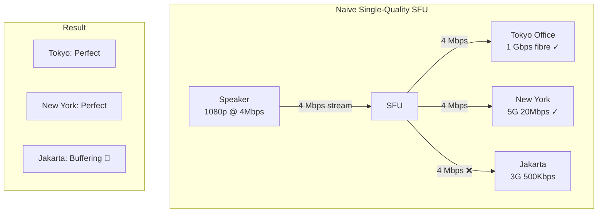
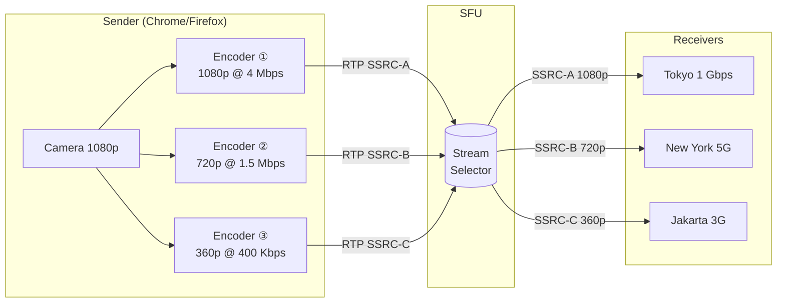
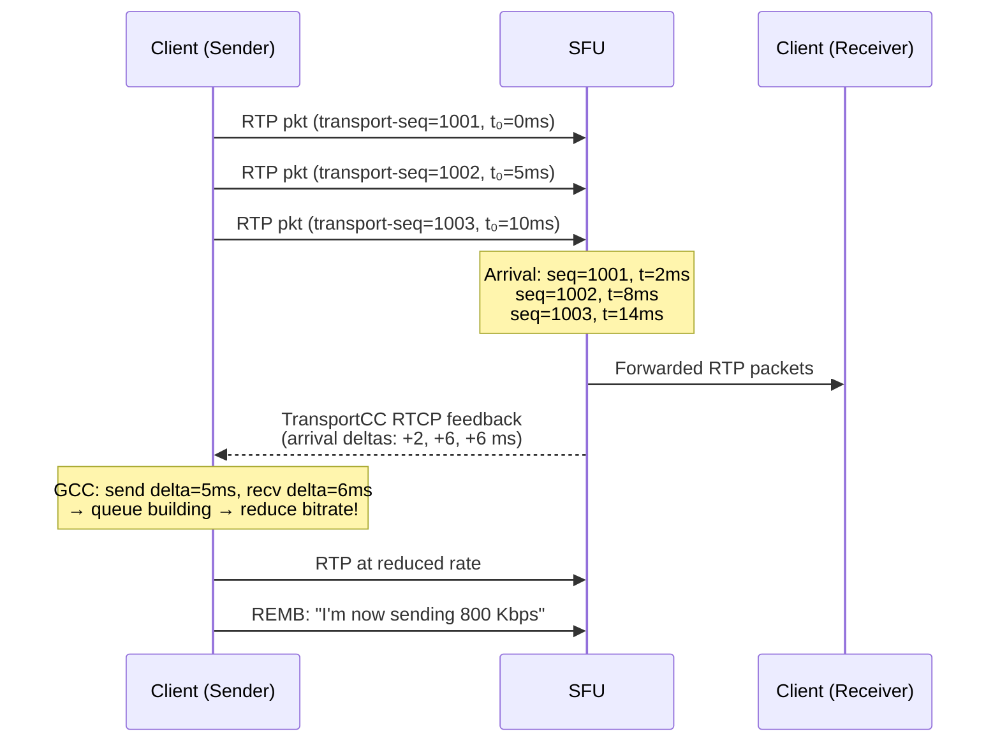
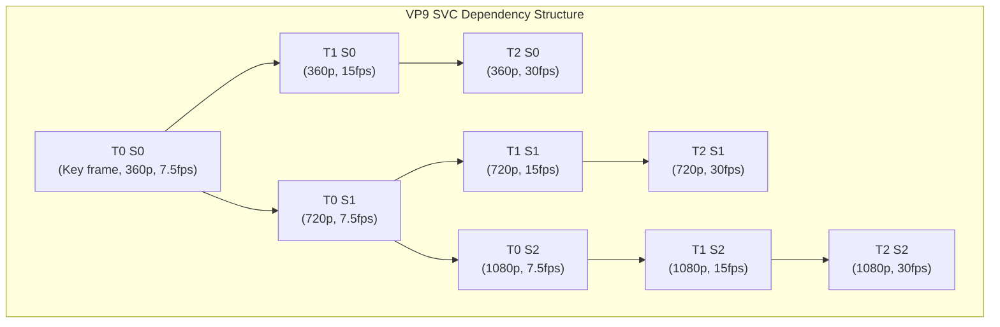
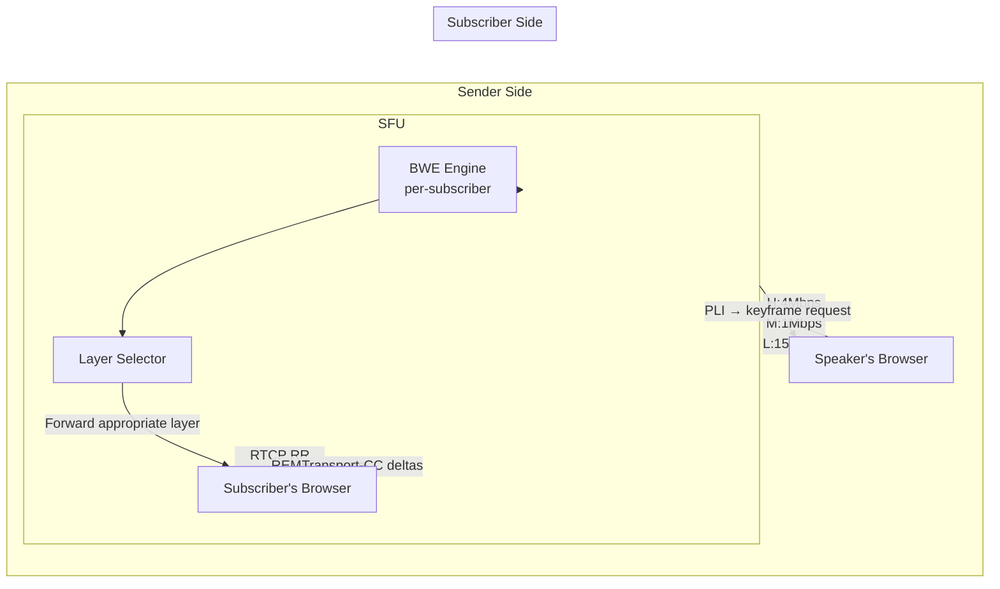

# Chapter 3: Simulcast and SVC (Scalable Video Coding) 🔴

> **The Problem:** Your video conference has 50 participants spread across a Tokyo office on gigabit fibre, a New York home worker on solid 5G, and a field engineer in Jakarta on a shaky 3G connection. The SFU receives a single 1080p H.264 stream from the speaker and must simultaneously serve crisp 1080p to Tokyo, smooth 720p to New York, and a listenable 360p to Jakarta — all without ever decoding the video and without destroying the experience for the majority when one participant has a bad connection. This is the core adaptive media problem. Simulcast and Scalable Video Coding (SVC) are the two dominant architectural answers.

---

## 3.1 Naive Approaches and Why They Fail

Before exploring the solutions, understand why the obvious approaches are broken.

### 3.1.1 The "Lowest Common Denominator" Trap

The simplest SFU just forwards one stream to everyone. When Jakarta drops to 3G, you have two choices: keep sending 1080p to Jakarta (causing catastrophic packet loss and a frozen/black screen) or re-encode the 1080p stream to 360p. The re-encoding path has three fatal problems:

| Problem | Impact |
|---|---|
| CPU cost | Re-encoding H.264/VP8 in real-time requires 2–4 dedicated CPU cores per participant |
| Latency | Encoding adds 50–200ms — imperceptible in recorded video, catastrophic in live call |
| Quality cascade | Re-encoding an already-compressed stream is "transcoding hell" — artefacts multiply |

### 3.1.2 The "Downgrade Everyone" Trap

Some naive implementations simply cap the entire conference to the weakest participant's bandwidth. This is the "design by committee" failure — noticeable immediately when a mobile participant joins and everyone else's HD video turns to muddy 360p.



---

## 3.2 Simulcast: The Client Sends Multiple Qualities

Simulcast is brutally direct: make the **sender** encode and transmit the stream at multiple resolutions simultaneously. The SFU receives all three, but only forwards the one appropriate for each receiver.



### 3.2.1 How the Browser Sends Simulcast

In WebRTC, simulcast is configured on the `RTCRtpSender` using encodings. Each encoding maps to a separate RTP SSRC (Synchronization Source Identifier).

```javascript
// JavaScript: Configuring simulcast on the sender
const sender = pc.addTrack(videoTrack, localStream);
const params = sender.getParameters();

params.encodings = [
    // High quality — 720p spatial scale, unlimited temporal
    { rid: 'high', maxBitrate: 4_000_000, scaleResolutionDownBy: 1.0 },
    // Medium quality — 360p (scaled down by 2x)
    { rid: 'mid',  maxBitrate: 1_000_000, scaleResolutionDownBy: 2.0 },
    // Low quality — 180p (scaled down by 4x), for poor connections
    { rid: 'low',  maxBitrate: 150_000,   scaleResolutionDownBy: 4.0 },
];

await sender.setParameters(params);
```

The browser now sends three independent RTP streams. Each stream has its own SSRC and RID (Restriction Identifier) header extension (RFC 8851), which the SFU reads to identify which quality tier each packet belongs to.

### 3.2.2 The RTP Header Extension: RID

The RID is a small ASCII string sent as an RTP header extension in every packet for the first few seconds, then only in key packets (for bandwidth efficiency).

```
 0                   1                   2                   3
 0 1 2 3 4 5 6 7 8 9 0 1 2 3 4 5 6 7 8 9 0 1 2 3 4 5 6 7 8 9 0 1
+-+-+-+-+-+-+-+-+-+-+-+-+-+-+-+-+-+-+-+-+-+-+-+-+-+-+-+-+-+-+-+-+
|V=2|P|X|  CC   |M|     PT      |       sequence number         |
+-+-+-+-+-+-+-+-+-+-+-+-+-+-+-+-+-+-+-+-+-+-+-+-+-+-+-+-+-+-+-+-+
|                           timestamp                           |
+-+-+-+-+-+-+-+-+-+-+-+-+-+-+-+-+-+-+-+-+-+-+-+-+-+-+-+-+-+-+-+-+
|           synchronization source (SSRC) identifier           |
+=+=+=+=+=+=+=+=+=+=+=+=+=+=+=+=+=+=+=+=+=+=+=+=+=+=+=+=+=+=+=+=+
|       0xBE    |    0xDE       |           length=1            |
+-+-+-+-+-+-+-+-+-+-+-+-+-+-+-+-+-+-+-+-+-+-+-+-+-+-+-+-+-+-+-+-+
| ID=3  |len=2  |  'h' (0x68)  |  'i' (0x69)   |  'g' (0x67) |  ← RID = "hig"h
+-+-+-+-+-+-+-+-+-+-+-+-+-+-+-+-+-+-+-+-+-+-+-+-+-+-+-+-+-+-+-+-+
```

---

## 3.3 SFU Layer: Implementing the Simulcast Router in Rust

The SFU's simulcast layer has two primary jobs:
1. **Parse** incoming RTP packets to identify their stream (SSRC → RID → quality tier)
2. **Route** packets to each subscriber's designated quality tier, with seamless **layer switching**

### 3.3.1 Data Structures

```rust
use std::collections::HashMap;
use std::sync::Arc;
use tokio::sync::RwLock;

/// Identifies a simulcast quality layer.
#[derive(Debug, Clone, Copy, PartialEq, Eq, Hash)]
pub enum QualityLayer {
    High,   // e.g., 1080p @ 4 Mbps
    Medium, // e.g., 360p @ 1 Mbps
    Low,    // e.g., 180p @ 150 Kbps
}

/// A single RTP packet received by the SFU.
#[derive(Debug, Clone)]
pub struct RtpPacket {
    pub ssrc: u32,
    pub sequence: u16,
    pub timestamp: u32,
    pub payload_type: u8,
    pub marker: bool,       // last packet of a frame
    pub rid: Option<String>, // from RTP header extension
    pub payload: Vec<u8>,
}

/// Per-sender state: tracks the three simulcast SSRCs
#[derive(Debug)]
pub struct SimulcastSender {
    pub participant_id: String,
    /// Maps SSRC → quality layer (learned from RID header ext)
    pub ssrc_to_layer: HashMap<u32, QualityLayer>,
    /// Per-layer: the highest received sequence number
    pub layer_seq: HashMap<QualityLayer, u16>,
    /// Per-layer: last timestamp seen (for re-stamping on switch)
    pub layer_ts:  HashMap<QualityLayer, u32>,
}

impl SimulcastSender {
    pub fn new(participant_id: String) -> Self {
        Self {
            participant_id,
            ssrc_to_layer: HashMap::new(),
            layer_seq: HashMap::new(),
            layer_ts: HashMap::new(),
        }
    }

    /// Learn the SSRC→layer mapping from a packet's RID extension.
    pub fn observe_packet(&mut self, pkt: &RtpPacket) {
        if let Some(rid) = &pkt.rid {
            let layer = match rid.as_str() {
                "high" | "h" => QualityLayer::High,
                "mid"  | "m" => QualityLayer::Medium,
                _             => QualityLayer::Low,
            };
            self.ssrc_to_layer.entry(pkt.ssrc).or_insert(layer);
            self.layer_seq.insert(layer, pkt.sequence);
            self.layer_ts.insert(layer, pkt.timestamp);
        }
    }

    pub fn layer_for_ssrc(&self, ssrc: u32) -> Option<QualityLayer> {
        self.ssrc_to_layer.get(&ssrc).copied()
    }
}
```

### 3.3.2 The Subscriber Routing State

Each subscriber maintains which quality layer they are currently receiving, and the SFU must perform **sequence number rewriting** when switching layers (so the receiver's jitter buffer doesn't see a sudden discontinuity of thousands of sequence numbers).

```rust
/// Per-subscriber routing state.
#[derive(Debug)]
pub struct SubscriberState {
    pub participant_id:    String,
    pub target_layer:      QualityLayer,
    pub current_layer:     Option<QualityLayer>,

    // Sequence/timestamp rewrite state to hide layer switches from the receiver
    pub last_sent_seq:     u16,
    pub seq_offset:        i32,   // added to incoming seq before forwarding
    pub last_sent_ts:      u32,
    pub ts_offset:         i32,   // added to incoming ts before forwarding

    /// If Some, we are mid-switch: waiting for a keyframe on target_layer
    pub pending_switch:    Option<QualityLayer>,
}

impl SubscriberState {
    pub fn new(participant_id: String, initial_layer: QualityLayer) -> Self {
        Self {
            participant_id,
            target_layer:   initial_layer,
            current_layer:  None,
            last_sent_seq:  0,
            seq_offset:     0,
            last_sent_ts:   0,
            ts_offset:      0,
            pending_switch: None,
        }
    }

    /// Signal that the subscriber should move to a different quality layer.
    /// Actual switch happens on the next keyframe boundary.
    pub fn request_layer_switch(&mut self, new_layer: QualityLayer) {
        if Some(new_layer) != self.current_layer {
            self.pending_switch = Some(new_layer);
        }
    }
}
```

### 3.3.3 The Simulcast Router Core

```rust
use tokio::sync::mpsc;

pub struct SimulcastRouter {
    senders:     Arc<RwLock<HashMap<String, SimulcastSender>>>,
    subscribers: Arc<RwLock<HashMap<String, SubscriberState>>>,
    /// Channel to inject PLI (Picture Loss Indication) RTCP back to senders
    rtcp_tx:     mpsc::Sender<RtcpMessage>,
}

#[derive(Debug)]
pub enum RtcpMessage {
    /// Request a keyframe from a specific sender's SSRC.
    Pli { sender_id: String, ssrc: u32 },
    /// Receiver Estimated Maximum Bitrate (REMB)
    Remb { sender_id: String, bitrate_bps: u64 },
}

impl SimulcastRouter {
    /// Process one incoming RTP packet from a sender.
    /// Returns a list of (subscriber_id, rewritten_packet) pairs to forward.
    pub async fn route_packet(
        &self,
        sender_id: &str,
        mut pkt: RtpPacket,
    ) -> Vec<(String, RtpPacket)> {
        // 1. Update sender state.
        {
            let mut senders = self.senders.write().await;
            if let Some(sender) = senders.get_mut(sender_id) {
                sender.observe_packet(&pkt);
            }
        }

        let incoming_layer = {
            let senders = self.senders.read().await;
            senders
                .get(sender_id)
                .and_then(|s| s.layer_for_ssrc(pkt.ssrc))
        };

        let Some(incoming_layer) = incoming_layer else {
            return vec![]; // RID not yet learned for this SSRC
        };

        let is_keyframe = self.is_keyframe(&pkt);
        let mut results = Vec::new();

        let mut subscribers = self.subscribers.write().await;
        for (sub_id, sub) in subscribers.iter_mut() {
            // Skip if this packet's layer isn't what the subscriber wants
            // (either current layer or pending target).
            let relevant = Some(incoming_layer) == sub.current_layer
                || (sub.pending_switch == Some(incoming_layer) && is_keyframe);

            if !relevant {
                continue;
            }

            // Commit a pending layer switch on keyframe boundary.
            if sub.pending_switch == Some(incoming_layer) && is_keyframe {
                if let Some(current) = sub.current_layer {
                    // Compute offsets so receiver sees continuous seq/ts.
                    let seq_gap = (pkt.sequence as i32)
                        .wrapping_sub(sub.last_sent_seq as i32);
                    sub.seq_offset = sub.seq_offset.wrapping_add(1 - seq_gap);

                    let ts_gap = (pkt.timestamp as i32)
                        .wrapping_sub(sub.last_sent_ts as i32);
                    sub.ts_offset = sub.ts_offset.wrapping_add(3000 - ts_gap);
                    let _ = current; // suppress unused warning
                }
                sub.current_layer = Some(incoming_layer);
                sub.pending_switch = None;
            }

            if sub.current_layer.is_none() && is_keyframe {
                // First packet ever for this subscriber.
                sub.current_layer = Some(incoming_layer);
            }

            if sub.current_layer != Some(incoming_layer) {
                continue;
            }

            // Rewrite sequence number and timestamp to hide layer switches.
            let mut fwd = pkt.clone();
            fwd.sequence = (pkt.sequence as i32)
                .wrapping_add(sub.seq_offset) as u16;
            fwd.timestamp = (pkt.timestamp as i32)
                .wrapping_add(sub.ts_offset) as u32;

            sub.last_sent_seq = fwd.sequence;
            sub.last_sent_ts  = fwd.timestamp;

            results.push((sub_id.clone(), fwd));
        }

        results
    }

    /// Crudely detect a keyframe from VP8/H.264 RTP payload.
    fn is_keyframe(&self, pkt: &RtpPacket) -> bool {
        // VP8 keyframe: S=1, partition_index=0, start of partition, P-bit=0
        if pkt.payload.len() < 3 {
            return false;
        }
        // VP8 payload descriptor heuristic
        let desc = pkt.payload[0];
        let s_bit = (desc >> 4) & 1;
        let p_bit = pkt.payload[1] & 1; // 0 means keyframe
        s_bit == 1 && p_bit == 0
    }

    /// Called periodically (or on RTCP feedback) to adapt layer selection.
    pub async fn adapt_subscriber_layer(
        &self,
        subscriber_id: &str,
        estimated_bandwidth_bps: u64,
    ) {
        let target = match estimated_bandwidth_bps {
            b if b >= 3_500_000 => QualityLayer::High,
            b if b >= 700_000  => QualityLayer::Medium,
            _                  => QualityLayer::Low,
        };

        let mut subscribers = self.subscribers.write().await;
        if let Some(sub) = subscribers.get_mut(subscriber_id) {
            if sub.target_layer != target {
                tracing::info!(
                    subscriber = subscriber_id,
                    ?target,
                    bw_bps = estimated_bandwidth_bps,
                    "Layer switch requested"
                );
                sub.request_layer_switch(target);

                // If switching UP, we need a PLI to get a keyframe quickly.
                // If switching DOWN, the next keyframe in the lower layer suffices.
                if target as u8 > sub.current_layer.unwrap_or(QualityLayer::Low) as u8 {
                    // Trigger PLI on the sender (would need sender SSRC lookup)
                }
            }
        }
    }
}
```

---

## 3.4 Bandwidth Estimation: How Does the SFU Know When to Switch?

Layer switching is only as good as your bandwidth estimate. WebRTC uses two complementary mechanisms.

### 3.4.1 REMB (Receiver Estimated Maximum Bitrate)

REMB is an RTCP message that the **receiver** sends back to the sender, estimating the available bandwidth based on observed packet loss and inter-arrival jitter (using Google's GCC — "Google Congestion Control" algorithm).

```
REMB RTCP Packet (RFC 8888 predecessor):
  - SSRC of media source
  - Estimated max bitrate in bits/second
  - List of SSRCs this estimate applies to
```

The SFU intercepts REMB messages from receivers and uses them to drive layer selection — a receiver reporting 600 Kbps should be switched to the Low layer immediately.

### 3.4.2 Transport-CC (Transport-Wide Congestion Control)

Transport-CC is more powerful. Instead of per-stream estimates, the **SFU itself** generates per-packet arrival timestamps across all RTP streams and sends them to the sender as `TransportCC` RTCP feedback. The sender-side GCC algorithm then estimates bandwidth per transport, enabling the sender to pace packets more evenly.



### 3.4.3 Bandwidth Estimation State Machine

```rust
#[derive(Debug, Clone, Copy, PartialEq)]
pub enum BweState {
    Hold,       // Just switched — hold current estimate steady
    Increase,   // Probing up — increase by 8% per RTT
    Decrease,   // Loss detected — cut by 15% immediately
}

pub struct BandwidthEstimator {
    pub estimate_bps: u64,
    pub state:        BweState,
    last_loss_ratio:  f64,
    rtt_ms:           f64,
}

impl BandwidthEstimator {
    pub fn new(initial_bps: u64) -> Self {
        Self {
            estimate_bps: initial_bps,
            state:        BweState::Hold,
            last_loss_ratio: 0.0,
            rtt_ms: 50.0,
        }
    }

    /// Called on each RTCP RR (Receiver Report) with latest loss stats.
    pub fn on_receiver_report(&mut self, fraction_lost: u8, rtt_ms: f64) {
        self.rtt_ms = rtt_ms;
        self.last_loss_ratio = fraction_lost as f64 / 256.0;

        self.state = if self.last_loss_ratio > 0.10 {
            // >10% loss: aggressive decrease
            BweState::Decrease
        } else if self.last_loss_ratio > 0.02 {
            // 2–10% loss: hold steady
            BweState::Hold
        } else {
            // <2% loss: probe upward
            BweState::Increase
        };

        self.step();
    }

    fn step(&mut self) {
        self.estimate_bps = match self.state {
            BweState::Increase => {
                // AIMD additive increase: 8% per RTT
                let increment = (self.estimate_bps as f64 * 0.08) as u64;
                self.estimate_bps.saturating_add(increment).min(8_000_000)
            }
            BweState::Decrease => {
                // AIMD multiplicative decrease: cut 15%
                (self.estimate_bps as f64 * 0.85) as u64
            }
            BweState::Hold => self.estimate_bps,
        };
    }
}
```

---

## 3.5 Scalable Video Coding (SVC): The Alternative to Simulcast

SVC is architecturally inverse to simulcast: instead of sending **N independent streams**, the sender sends a **single hierarchically structured bitstream** where each layer depends on lower layers.

### 3.5.1 SVC Layer Types

| Layer Type | Description | Example |
|---|---|---|
| **Temporal** (T) | Frames are skippable; dropping a T-layer reduces frame rate | T0=7.5fps, T1=15fps, T2=30fps |
| **Spatial** (S) | Each S-layer builds on the previous; drop S2 to get lower resolution | S0=360p, S1=720p, S2=1080p |
| **Quality** (Q) | Same resolution, different bitrates (finer DCT quantization) | Q0=coarse, Q1=medium, Q2=fine |

VP9 SVC and AV1 SVC (using SFrame-based scalable coding) are the dominant implementations in WebRTC. H.264 has SVC extensions (H.264/SVC, ANNEX G) but browser support is minimal.



A frame at `T2 S2` depends on all frames below it in both dimensions. The SFU can drop any frame at the "leaf" tier independently. The key insight: **the SFU can drop packets without transcoding**, it simply stops forwarding packets above a chosen layer boundary.

### 3.5.2 SVC vs. Simulcast: The Trade-offs

| Factor | Simulcast | SVC (VP9/AV1) |
|---|---|---|
| **Sender bandwidth** | 3× (sends all 3 streams always) | ~1.4× (shared base layer, thin enhancement layers) |
| **Encoder complexity** | Low (3 independent encoders) | High (VP9 SVC is complex; libvpx is the reference) |
| **SFU complexity** | Medium (keyframe-gated switches) | Lower (just drop packets above layer boundary) |
| **Layer switch latency** | 200–500ms (wait for keyframe) | <one frame (~33ms) for temporal layer drops |
| **Browser support (2026)** | Chrome, Firefox, Safari (H.264) | Chrome + VP9/AV1 only |
| **Content type** | Best for motion-heavy video | Best for screenshare, slides |

**Practical recommendation**: Use **simulcast with H.264** for maximum compatibility in video calls. Use **VP9 SVC** for screen-share codecs and when all clients are Chromium-based.

---

## 3.6 Layer Switching in Practice: PLI and RTCP FIR

The most operationally tricky part of simulcast layer switching is the **keyframe requirement**. When switching from Low → High, the receiver cannot decode the High stream until it receives a keyframe (IDR frame) — if you forward High inter-frames from mid-stream, the decoder produces garbled video ("green screen" artefact).

### 3.6.1 PLI (Picture Loss Indication)

The SFU sends a PLI to the sender to force an immediate keyframe, encoded as an RTCP feedback message (RFC 4585):

```rust
/// Build a PLI RTCP packet.
/// Format: 20 bytes total
pub fn build_pli(sender_ssrc: u32, media_ssrc: u32) -> Vec<u8> {
    let mut buf = Vec::with_capacity(20);

    // RTCP Header: V=2, P=0, count=1 (PLI), PT=206 (PSFB)
    buf.push(0b10_0_00001u8); // V=2, P=0, FMT=1 (PLI)
    buf.push(206);             // PT = PSFB (Payload-Specific Feedback)
    buf.extend_from_slice(&1u16.to_be_bytes()); // length in 32-bit words - 1 = 4 words - 1 = 3? 
    // actually length field = (total_bytes/4) - 1 = (20/4) - 1 = 4
    // Rewrite:
    buf.clear();

    // Word 0: header
    buf.push(0x81); // V=2, P=0, FMT=1
    buf.push(206);  // PT=206 PSFB
    buf.extend_from_slice(&4u16.to_be_bytes()); // length = 4 (20 bytes ÷ 4 - 1)

    // Word 1: sender SSRC
    buf.extend_from_slice(&sender_ssrc.to_be_bytes());

    // Word 2: media SSRC
    buf.extend_from_slice(&media_ssrc.to_be_bytes());

    // Words 3–4: FCI (empty for PLI)
    buf.extend_from_slice(&[0u8; 8]);

    buf
}
```

### 3.6.2 FIR (Full Intra Request)

FIR (RFC 5104) is the stronger form: it includes a sequence number to prevent duplicate keyframe requests and is preferred for SVC layer activations.

### 3.6.3 Keyframe Caching: Hide the Transition Delay

A production SFU caches the last keyframe + delta frames from each simulcast layer so it can immediately forward a complete decodable unit when a new subscriber joins or a layer switch occurs, without waiting for the next IDR from the sender.

```rust
use std::collections::VecDeque;

#[derive(Debug)]
pub struct KeyframeCache {
    /// The most recent keyframe packet for this layer.
    keyframe: Option<RtpPacket>,
    /// Delta frames that arrived after the keyframe, before the next keyframe.
    deltas: VecDeque<RtpPacket>,
}

impl KeyframeCache {
    pub fn new() -> Self {
        Self { keyframe: None, deltas: VecDeque::new() }
    }

    pub fn on_packet(&mut self, pkt: RtpPacket, is_keyframe: bool) {
        if is_keyframe {
            self.keyframe = Some(pkt.clone());
            self.deltas.clear();
            self.deltas.push_back(pkt);
        } else {
            // Limit cache to ~10 frames to bound memory
            if self.deltas.len() > 10 {
                self.deltas.pop_front();
            }
            self.deltas.push_back(pkt);
        }
    }

    /// Return all cached packets needed for a clean decode entry point.
    pub fn catchup_packets(&self) -> Vec<&RtpPacket> {
        self.deltas.iter().collect()
    }
}
```

---

## 3.7 Screenshare: A Special Simulcast Case

Screenshare content has completely different characteristics from webcam video:

- **Extremely low motion** — most frames are identical or nearly identical
- **Sharp text and UI elements** — lossy artefacts are immediately visible
- **Occasional high-motion bursts** — slide transitions, scrolling

The optimal encoding is VP9 SVC at a very high quality factor (low quantiser), with aggressive temporal layer allocation:

```javascript
// Screenshare sender configuration
const params = screenSender.getParameters();
params.encodings = [
    {
        rid: 'h',
        maxBitrate: 2_500_000,
        scaleResolutionDownBy: 1.0,
        // Force VP9 with SVC via scalabilityMode
        scalabilityMode: 'L1T3', // 1 spatial layer, 3 temporal layers
    }
];
await screenSender.setParameters(params);
```

`L1T3` means one spatial layer (no resolution scaling) with 3 temporal layers. The SFU can drop to `L1T1` (7.5 fps) for a constrained subscriber without ever needing a keyframe for temporal drops.

---

## 3.8 End-to-End Simulcast Configuration: The SDP Negotiation

Simulcast must be negotiated in the SDP. The sender declares RID values and the receiver declares which RIDs it wants to receive:

```
// Sender SDP (offer fragment):
a=msid:local-stream camera-track
a=ssrc-group:FID 11111 22222       // high-layer SSRC pair (video + RTX)
a=ssrc-group:FID 33333 44444       // mid-layer SSRC pair
a=ssrc-group:FID 55555 66666       // low-layer SSRC pair
a=rid:high send
a=rid:mid send
a=rid:low send
a=simulcast:send high;mid;low

// Receiver SDP (answer fragment from SFU):
a=rid:high recv
a=rid:mid recv
a=rid:low recv
a=simulcast:recv high;mid;low
```

The SFU must generate a correct SDP answer that declares itself as receiving all three RIDs, while presenting only one RID to each downstream subscriber.

---

## 3.9 Putting It Together: The Adaptive Quality Loop

The complete adaptive quality system is a closed-loop control system:



1. Subscriber browser reports loss and jitter every second in RTCP Receiver Reports.
2. SFU's BWE estimates 650 Kbps available bandwidth for this subscriber.
3. Layer Selector requests switch from Medium to Low.
4. SFU waits for the next Low-layer keyframe (or sends PLI if switching up).
5. On keyframe arrival: rewrite sequence/timestamp, begin forwarding Low.
6. Subscriber's buffer stabilises, loss drops to 0%.
7. After 5 seconds of 0% loss, BWE probes up → switch back to Medium.

---

## 3.10 Operational Metrics to Monitor

| Metric | Alert Threshold | Meaning |
|---|---|---|
| `layer_switch_latency_ms` | p99 > 800ms | PLI/keyframe path is broken |
| `pli_rate_per_minute` | > 10/min per participant | BWE instability or bad network |
| `subscriber_layer_low_percent` | > 20% of join-time | Network degradation at scale |
| `seq_rewrite_overflow` | > 0 | Sequence number arithmetic bug |
| `keyframe_cache_miss_rate` | > 5% | Cache too small or keyframe interval too long |

> **Key Takeaways**
>
> - **Simulcast** solves the "bad WiFi participant" problem without transcoding: the sender encodes 3 resolutions; the SFU routes the appropriate one per receiver.
> - Layer switches must be **gated on keyframes** to prevent decoder artefacts. Use PLI to accelerate keyframe delivery when switching _up_ in quality.
> - **Sequence number and timestamp rewriting** is mandatory when switching layers — the receiver must see a continuous, monotonic RTP stream.
> - **Transport-CC + GCC** is the state-of-the-art bandwidth estimator; REMB is legacy but still widely deployed.
> - Use **VP9/AV1 SVC with L1T3** for screenshare; use **H.264 simulcast** for webcam video for maximum cross-browser compatibility.
> - The BWE-to-layer-switch feedback loop must be **dampened** (minimum 2–5s in a layer) to prevent oscillation under noisy network conditions.
