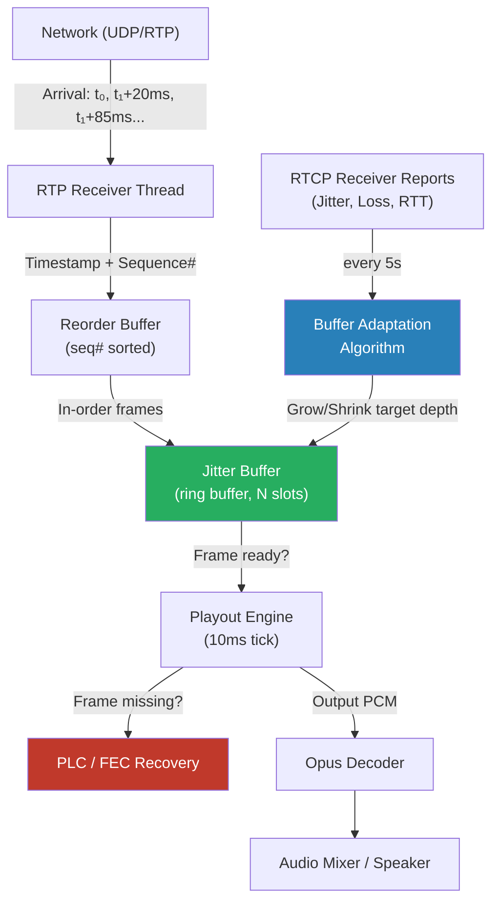
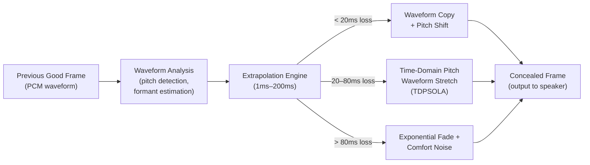
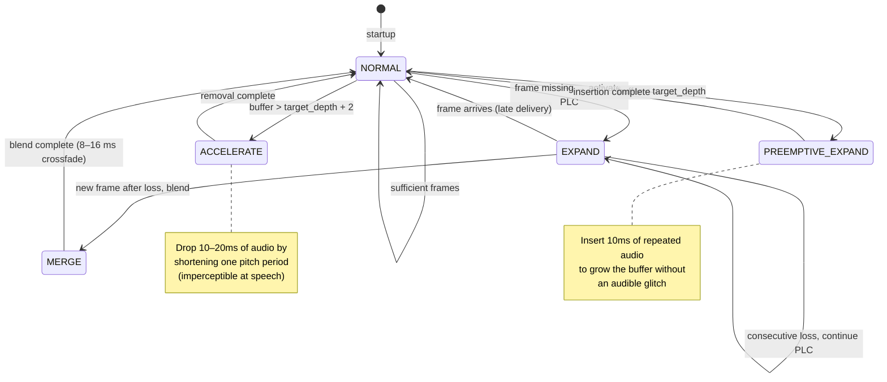
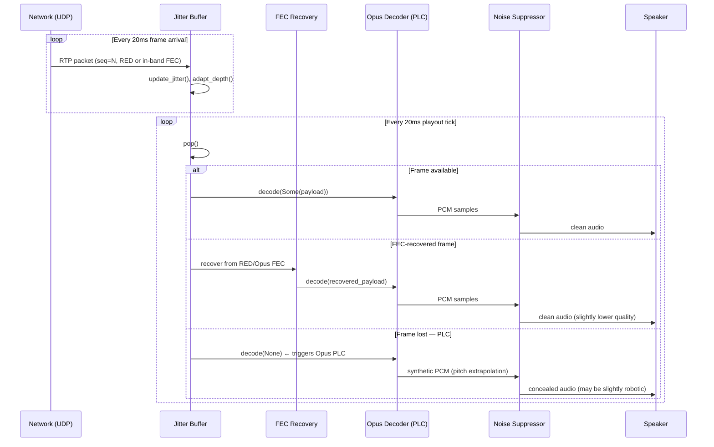

# Chapter 4: Jitter Buffers and Packet Loss Concealment 🔴

> **The Problem:** Audio travels over UDP — an unreliable protocol that guarantees nothing. Packets arrive out of order, duplicated, or not at all. A 20 ms audio frame lost at the wrong moment produces a jarring click or gap that breaks conversational flow. At 48 kHz with Opus encoding, every 20 ms frame is sacred. The challenge isn't the average case — it's the tail: a 200 ms network spike that delivers 10 frames simultaneously, followed by silence. The client must absorb the spike without glitching, then fill the gap without revealing the loss. This chapter implements the full audio reliability stack: dynamic jitter buffering, out-of-order resequencing, Forward Error Correction (FEC), and Packet Loss Concealment (PLC) — the same stack used by Google Meet, Zoom, and Microsoft Teams.

---

## 4.1 The Physics of Audio Over UDP

Real-Time Transport Protocol (RTP) carries audio over UDP. UDP has no ordering guarantee, no retransmission, and no congestion control. This is intentional — retransmitting a 20 ms audio frame 40 ms late makes it useless. You need it *now*, or you need a synthetic replacement.

The three failure modes of UDP audio:

| Failure Mode | Definition | Symptom |
|---|---|---|
| **Jitter** | Variance in packet inter-arrival time | Choppy / robotic audio |
| **Out-of-order** | Packet N+1 arrives before packet N | Scrambled words |
| **Packet Loss** | Packet never arrives | Click, gap, or dropout |

### 4.1.1 Measuring Jitter: The RFC 3550 Algorithm

RFC 3550 (the RTP specification) defines an exponentially weighted moving average (EWMA) for jitter estimation:

```
D(i,j) = |arrival(j) - arrival(i)| - |send(j) - send(i)|
J(i)   = J(i-1) + (|D(i-1,i)| - J(i-1)) / 16
```

- `D(i,j)` = the difference in transit time between two consecutive packets
- `J(i)` = the smoothed jitter estimate (in RTP timestamp units)

This exponential average with weight 1/16 means that a single anomalous spike barely moves the estimate — but sustained jitter drives it up quickly.

### 4.1.2 Real-World Jitter Profiles

```
Packet Inter-Arrival Time (ms)
│
80ms ┤                          ╔═══╗
     │                          ║   ║
60ms ┤                   ╔══╗   ║   ║
     │                   ║  ║   ║   ║
40ms ┤            ╔══╗   ║  ║   ║   ║
     │            ║  ║   ║  ║   ║   ║
20ms ┤ ╔══╗ ╔══╗  ║  ║   ║  ║   ║   ║
     │ ║  ║ ║  ║  ║  ║   ║  ║   ║   ║
     └─╨──╨─╨──╨──╨──╨───╨──╨───╨──╨──
       20   20   40   60   80  (ideal: all 20ms)

Jitter: 0ms baseline → burst to 80ms at frame 5
```

A corporate VPN, WiFi congestion, or a routing path change can create exactly this spike: packets arrive bunched together after a 60 ms silence.

---

## 4.2 The Jitter Buffer: Architecture

A jitter buffer delays playback intentionally to absorb network variance. Think of it as a shock absorber: it stores incoming packets, reorders them if necessary, and releases them at a steady clock rate for the audio decoder.



### 4.2.1 Static vs. Dynamic Jitter Buffers

| Property | Static Buffer | Dynamic Buffer (NetEQ-style) |
|---|---|---|
| **Target delay** | Fixed (e.g., 60 ms) | Adapts to measured jitter |
| **Good WiFi** | Wastes 50 ms unnecessarily | Shrinks to 20–30 ms |
| **Bad WiFi** | Drops packets if jitter > target | Expands to absorb spikes |
| **Latency** | Predictable | Variable but optimal |
| **Algorithm** | None | EWMA + percentile tracking |

**Static buffers** are simpler but pay a constant latency cost. **Dynamic buffers** (used by all modern video conferencing systems) measure actual jitter and continuously adjust the target playout delay. The state of the art is Google's **NetEQ**, which uses a hybrid adaptation: normal operation shrinks the buffer aggressively; bursty loss events trigger rapid expansion.

---

## 4.3 Implementing a Dynamic Jitter Buffer in Rust

We'll build a production-quality dynamic jitter buffer. The core data structures:

```rust
use std::collections::BTreeMap;
use std::time::{Duration, Instant};

/// One decoded audio frame (20 ms of audio at 48 kHz = 960 samples).
pub struct AudioFrame {
    pub seq:           u16,
    pub rtp_timestamp: u32,
    pub arrival_time:  Instant,
    pub payload:       Vec<u8>,   // Opus-encoded bytes
    pub fec_payload:   Option<Vec<u8>>, // Redundant encoding for prev frame
}

/// Ring-buffer slot state.
#[derive(Clone, Debug)]
enum SlotState {
    Empty,
    Received(Vec<u8>),
    FecRecovered(Vec<u8>),
    PlcGenerated,
}

/// The core dynamic jitter buffer.
pub struct JitterBuffer {
    // Reorder storage: seq# → frame
    pending:        BTreeMap<u16, AudioFrame>,

    // Playout ring buffer (fixed capacity)
    slots:          Vec<SlotState>,
    slot_count:     usize,
    read_seq:       u16,          // Next seq# to hand to decoder
    write_seq:      u16,          // Highest seq# received

    // Jitter estimation
    jitter_ewma_ms: f64,          // RFC 3550 EWMA
    last_arrival:   Option<Instant>,
    last_send_ts:   Option<u32>,

    // Dynamic adaptation
    target_depth:   usize,        // Target buffered frames
    min_depth:      usize,        // Minimum frames (1 = 20 ms)
    max_depth:      usize,        // Maximum frames (25 = 500 ms)

    // Statistics
    received:       u64,
    lost:           u64,
    fec_recovered:  u64,
    plc_generated:  u64,
}

impl JitterBuffer {
    pub fn new() -> Self {
        Self {
            pending:        BTreeMap::new(),
            slots:          vec![SlotState::Empty; 512],
            slot_count:     512,
            read_seq:       0,
            write_seq:      0,
            jitter_ewma_ms: 0.0,
            last_arrival:   None,
            last_send_ts:   None,
            target_depth:   3,    // Start at 3 frames = 60 ms
            min_depth:      1,
            max_depth:      25,
            received:       0,
            lost:           0,
            fec_recovered:  0,
            plc_generated:  0,
        }
    }

    /// Called for every arriving RTP packet.
    pub fn push(&mut self, frame: AudioFrame) {
        self.received += 1;
        self.update_jitter(&frame);

        let seq = frame.seq;

        // Discard late packets (already played out)
        if seq_lt(seq, self.read_seq) {
            return;
        }

        // Check for FEC: does this frame carry redundant data for a
        // previous frame we haven't received yet?
        if let Some(fec) = &frame.fec_payload {
            let fec_seq = seq.wrapping_sub(1);
            let slot = (fec_seq as usize) % self.slot_count;
            if matches!(self.slots[slot], SlotState::Empty) {
                self.slots[slot] = SlotState::FecRecovered(fec.clone());
                self.fec_recovered += 1;
            }
        }

        // Store the frame
        let slot = (seq as usize) % self.slot_count;
        self.slots[slot] = SlotState::Received(frame.payload.clone());
        self.pending.insert(seq, frame);

        if seq_gt(seq, self.write_seq) {
            self.write_seq = seq;
        }
    }

    /// Update RFC 3550 jitter estimate.
    fn update_jitter(&mut self, frame: &AudioFrame) {
        if let (Some(last_arr), Some(last_ts)) = (self.last_arrival, self.last_send_ts) {
            let arrive_diff = frame.arrival_time
                .duration_since(last_arr)
                .as_millis() as f64;
            let send_diff = rtp_ts_to_ms(
                frame.rtp_timestamp.wrapping_sub(last_ts)
            );
            let d = (arrive_diff - send_diff).abs();
            // RFC 3550 EWMA: J += (|D| - J) / 16
            self.jitter_ewma_ms += (d - self.jitter_ewma_ms) / 16.0;
        }
        self.last_arrival = Some(frame.arrival_time);
        self.last_send_ts = Some(frame.rtp_timestamp);
    }

    /// Called every 10 ms by the playout engine.
    /// Returns a 20 ms audio frame (may be PLC-synthesized or FEC-recovered).
    pub fn pop(&mut self) -> PopResult {
        let buffered = seq_diff(self.write_seq, self.read_seq) as usize;

        // Not enough frames buffered yet — wait (return silence).
        if buffered < self.target_depth {
            return PopResult::Buffering;
        }

        let seq   = self.read_seq;
        let slot  = (seq as usize) % self.slot_count;
        let state = std::mem::replace(&mut self.slots[slot], SlotState::Empty);
        self.pending.remove(&seq);
        self.read_seq = self.read_seq.wrapping_add(1);

        // Adapt buffer depth after each pop.
        self.adapt_depth(buffered);

        match state {
            SlotState::Received(payload) => PopResult::Frame(payload),
            SlotState::FecRecovered(payload) => {
                self.fec_recovered += 1;
                PopResult::FecFrame(payload)
            }
            SlotState::PlcGenerated | SlotState::Empty => {
                self.lost        += 1;
                self.plc_generated += 1;
                PopResult::NeedPlc(seq)
            }
        }
    }

    /// NetEQ-inspired adaptation: shrink cautiously, expand aggressively.
    fn adapt_depth(&mut self, current_buffered: usize) {
        let jitter_frames = (self.jitter_ewma_ms / 20.0).ceil() as usize + 1;
        let target = jitter_frames.clamp(self.min_depth, self.max_depth);

        if target > self.target_depth {
            // Sudden jitter spike: expand immediately.
            self.target_depth = target;
        } else if target < self.target_depth {
            // Jitter improved: shrink by 1 frame every 200 pops (~4 seconds).
            // This prevents thrashing.
            if self.received % 200 == 0 {
                self.target_depth = (self.target_depth - 1).max(self.min_depth);
            }
        }
    }

    pub fn stats(&self) -> JitterStats {
        JitterStats {
            jitter_ms:      self.jitter_ewma_ms,
            target_depth_ms: self.target_depth as f64 * 20.0,
            loss_rate:      self.lost as f64 / self.received.max(1) as f64,
            fec_recovery_rate: self.fec_recovered as f64 / self.lost.max(1) as f64,
            plc_rate:       self.plc_generated as f64 / self.received.max(1) as f64,
        }
    }
}

#[derive(Debug)]
pub enum PopResult {
    Buffering,              // Not enough frames yet
    Frame(Vec<u8>),         // Normal decoded frame
    FecFrame(Vec<u8>),      // Recovered via FEC
    NeedPlc(u16),           // Frame lost — generate PLC
}

#[derive(Debug)]
pub struct JitterStats {
    pub jitter_ms:          f64,
    pub target_depth_ms:    f64,
    pub loss_rate:          f64,
    pub fec_recovery_rate:  f64,
    pub plc_rate:           f64,
}

// ---- Sequence number arithmetic (16-bit wraparound) ----

fn seq_lt(a: u16, b: u16) -> bool {
    // Handles wraparound: a < b if the unsigned distance a→b < 32768
    (b.wrapping_sub(a) as i16) > 0
}

fn seq_gt(a: u16, b: u16) -> bool { seq_lt(b, a) }

fn seq_diff(high: u16, low: u16) -> u16 {
    high.wrapping_sub(low)
}

fn rtp_ts_to_ms(rtp_diff: u32) -> f64 {
    // Opus at 48000 Hz: 1 ms = 48 RTP timestamp units
    rtp_diff as f64 / 48.0
}
```

> **Key Insight:** Sequence number arithmetic must handle 16-bit wraparound. Treating sequence numbers as signed distances — `(b - a) as i16 > 0` — gives correct ordering even across the 65535→0 boundary.

---

## 4.4 Forward Error Correction (FEC)

FEC is the art of embedding enough redundancy in the transmitted stream that the receiver can reconstruct lost packets without retransmission.

### 4.4.1 Opus In-Band FEC

The Opus codec has FEC built-in. When the encoder detects that the network is losing packets (via RTCP feedback), it enables FEC mode: the current packet carries a *lower-quality copy of the previous frame* in a special header extension.

```
RTP Packet N (with FEC enabled):
┌─────────────────────────────────────────────────┐
│ RTP Header (seq=N, ts=..., ssrc=...)            │
├─────────────────────────────────────────────────┤
│ Opus TOC byte: FEC_PRESENT=1                    │
├─────────────────────────────────────────────────┤
│ FEC payload (8 kbps encoding of frame N-1)      │  ← ~25 bytes
│ Main payload (frame N at full quality)          │  ← ~60 bytes
└─────────────────────────────────────────────────┘
```

If packet N-1 was lost but packet N arrives, the receiver:
1. Detects that sequence N-1 is missing.
2. Looks inside packet N's FEC header for the redundant copy of N-1.
3. Decodes the lower-quality N-1 replica — still much better than silence.

Bandwidth cost: ~15% overhead (Opus FEC adds ~10–12 bytes per 20 ms packet).

### 4.4.2 RED (Redundant Encoding)

RFC 2198 defines a more general FEC mechanism that works at the RTP level independently of the codec. Each RED packet carries the current frame **plus one or more previous frames**:

```
RED Packet (RFC 2198):
┌──────────────────────────────────────────────────────┐
│ RTP Header                                           │
├──────────────────────────────────────────────────────┤
│ RED Header Block 1: ts_offset=60ms, block_length=25  │ ← frame N-3
│ RED Header Block 2: ts_offset=40ms, block_length=30  │ ← frame N-2
│ RED Header Block 3: ts_offset=20ms, block_length=35  │ ← frame N-1
│ Last Header:        primary frame (no offset)        │ ← frame N
├──────────────────────────────────────────────────────┤
│ Payload: [frame N-3][frame N-2][frame N-1][frame N]  │
└──────────────────────────────────────────────────────┘
```

RED recovery covers up to `depth` consecutive losses with zero additional delay. Chrome's WebRTC implementation uses RED with depth=2 for audio when packet loss exceeds 3%.

### 4.4.3 ULPFEC — Video FEC

For video, RFC 5109 defines Uneven Level Protection FEC. Video packets are grouped into a "protection group," and XOR-based redundancy packets are generated:

```
Media packets:  P₁  P₂  P₃  P₄
FEC packet:     F  = P₁ ⊕ P₂ ⊕ P₃ ⊕ P₄
```

If any single packet in the group is lost, it can be recovered:
`P₃ = F ⊕ P₁ ⊕ P₂ ⊕ P₄`

ULPFEC adds 25% bandwidth overhead but can recover from single-packet loss in any video RTP group.

---

## 4.5 Packet Loss Concealment (PLC)

When FEC cannot recover a lost frame — either because no FEC was transmitted, or because consecutive packets were lost — the client must **synthesize audio** to hide the gap.



### 4.5.1 Opus Built-In PLC

Opus (`libopus`) includes a high-quality PLC algorithm. When the decoder is called with `NULL` input (loss indicator), it executes:

1. **Pitch analysis** of the last good frame — finds the fundamental frequency (F0).
2. **Waveform extension** — replicates the pitch period forward in time.
3. **Graceful decay** — applies exponential attenuation so prolonged loss fades to silence rather than producing jarring repetition.

```rust
use opus::{Decoder, Channels, Application};

pub struct OpusDecoder {
    inner:   Decoder,
    last_good_pcm: Vec<i16>,
}

impl OpusDecoder {
    pub fn new() -> Result<Self, opus::Error> {
        Ok(Self {
            inner: Decoder::new(48000, Channels::Mono)?,
            last_good_pcm: vec![0i16; 960],
        })
    }

    /// Decode a received frame (payload = Some) or generate PLC (payload = None).
    pub fn decode(&mut self, payload: Option<&[u8]>) -> Result<Vec<i16>, opus::Error> {
        let mut output = vec![0i16; 960]; // 20 ms at 48 kHz

        match payload {
            Some(data) => {
                // Normal decode.
                let samples = self.inner.decode(data, &mut output, false)?;
                output.truncate(samples);
                self.last_good_pcm = output.clone();
                Ok(output)
            }
            None => {
                // Loss concealment: pass empty slice to trigger Opus PLC.
                // Opus internally uses the decoder state from the last frame.
                let samples = self.inner.decode(&[], &mut output, false)?;
                output.truncate(samples);
                Ok(output)
            }
        }
    }
}
```

> **Critical Detail:** Opus PLC quality depends entirely on calling `decode(&[], ...)` — NOT resetting the decoder state. The decoder's internal LPC (Linear Predictive Coding) model retains the waveform characteristics of the previous frame and extrapolates forward. Resetting the decoder destroys this state and produces noise.

### 4.5.2 PLC Quality vs. Loss Profile

| Loss Duration | Best PLC Strategy | Perceived Quality |
|---|---|---|
| 1 frame (20 ms) | Opus built-in PLC | **Transparent** — imperceptible to listeners |
| 2–4 frames (40–80 ms) | Pitch waveform stretch | **Good** — slight robotic quality |
| 5–10 frames (100–200 ms) | Attenuation + comfort noise | **Degraded** — noticeable but tolerable |
| > 10 frames (> 200 ms) | Silence / reconnect signal | **Broken** — must signal user |

---

## 4.6 NetEQ: Google's Production Jitter Buffer

Google's **NetEQ** (Network Equalizer) is the most studied adaptive jitter buffer in production. Its state machine governs how the buffer responds to network conditions:



### 4.6.1 The Four NetEQ Operations

**1. NORMAL** — Steady state. One frame decoded per 20 ms tick.

**2. ACCELERATE** — Buffer is growing too large (network jitter spike subsided, old packets caught up). NetEQ uses WSOLA (Waveform Similarity Overlap-Add) to shorten a frame by 10–20 ms by finding a pitch period boundary and removing it. This is inaudible for speech.

**3. PREEMPTIVE EXPAND** — Buffer is dangerously low. NetEQ inserts a synthetic 10–20 ms extension of the current frame by repeating a pitch period. This is also inaudible for speech.

**4. EXPAND (PLC + Merge)** — A frame is missing. NetEQ generates PLC audio. When the next good frame eventually arrives, it cross-fades from the synthetic PLC output into the real audio over 16 ms to eliminate the click that would otherwise occur at the boundary.

### 4.6.2 Implementing the WSOLA Accelerate Step

```rust
/// WSOLA: Waveform Similarity Overlap-Add
/// Removes one pitch period from `pcm` to shorten audio by ~8ms
/// without audible artifacts.
pub fn wsola_accelerate(pcm: &[i16], sample_rate: u32) -> Vec<i16> {
    // Estimate pitch period using normalized autocorrelation
    let pitch_period = estimate_pitch_period(pcm, sample_rate);
    
    if pitch_period == 0 || pitch_period >= pcm.len() / 2 {
        // Cannot shorten safely — return as-is
        return pcm.to_vec();
    }

    // Find the best cut point: the zero crossing nearest to the
    // center of the buffer where we'll remove one pitch period.
    let center = pcm.len() / 2;
    let cut_start = find_zero_crossing(pcm, center.saturating_sub(pitch_period / 2));
    let cut_end   = cut_start + pitch_period;

    if cut_end >= pcm.len() {
        return pcm.to_vec();
    }

    // Remove [cut_start..cut_end] with a short crossfade to avoid clicks.
    let fade_len = (pitch_period / 4).min(8);
    let mut output: Vec<i16> = pcm[..cut_start].to_vec();

    for i in 0..fade_len {
        let alpha = i as f32 / fade_len as f32;
        let before = pcm[cut_start + i] as f32;
        let after  = pcm[cut_end + i] as f32;
        let blended = before * (1.0 - alpha) + after * alpha;
        output.push(blended as i16);
    }

    output.extend_from_slice(&pcm[cut_end + fade_len..]);
    output
}

fn estimate_pitch_period(pcm: &[i16], sample_rate: u32) -> usize {
    // Search range: 60 Hz to 400 Hz (human voice)
    let min_period = (sample_rate / 400) as usize;
    let max_period = (sample_rate / 60) as usize;
    let search_len = (pcm.len() / 2).min(max_period * 2);

    let mut best_corr   = 0.0f64;
    let mut best_period = 0usize;

    for lag in min_period..=max_period.min(search_len) {
        let mut corr = 0.0f64;
        let mut e0   = 0.0f64;
        let mut e1   = 0.0f64;
        for i in 0..search_len - lag {
            corr += pcm[i] as f64 * pcm[i + lag] as f64;
            e0   += pcm[i] as f64 * pcm[i] as f64;
            e1   += pcm[i + lag] as f64 * pcm[i + lag] as f64;
        }
        // Normalized autocorrelation
        let norm_corr = corr / (e0 * e1 + 1.0).sqrt();
        if norm_corr > best_corr {
            best_corr   = norm_corr;
            best_period = lag;
        }
    }
    best_period
}

fn find_zero_crossing(pcm: &[i16], start: usize) -> usize {
    for i in start..pcm.len().saturating_sub(1) {
        if (pcm[i] >= 0) != (pcm[i + 1] >= 0) {
            return i;
        }
    }
    start
}
```

---

## 4.7 The Full Audio Reliability Pipeline

The complete client-side audio pipeline integrates all the components above:



### 4.7.1 Adaptive Bitrate and Loss Response

The jitter buffer must communicate its observations back to the sender via **RTCP Receiver Reports**:

```rust
/// RTCP Receiver Report — sent every ~5 seconds or on significant events.
pub struct ReceiverReport {
    pub ssrc:            u32,
    pub fraction_lost:   u8,    // 0–255, represents 0%–100% as fixed-point 1/256
    pub cumulative_lost: u32,   // Total packets lost (24-bit)
    pub highest_seq:     u32,   // Highest seq# received (extended)
    pub jitter:          u32,   // EWMA jitter in RTP timestamp units
    pub last_sr:         u32,   // Last Sender Report timestamp
    pub delay_since_sr:  u32,   // Delay since last SR (in 1/65536 seconds)
}

/// SFU decision based on Receiver Report.
pub fn adapt_on_receiver_report(rr: &ReceiverReport) -> SenderAction {
    let loss_pct = rr.fraction_lost as f64 / 256.0 * 100.0;
    let jitter_ms = rr.jitter as f64 / 48.0; // Opus at 48 kHz

    if loss_pct > 10.0 {
        // High loss: reduce bitrate 30%, enable FEC
        SenderAction::ReduceBitrate { factor: 0.70, enable_fec: true }
    } else if loss_pct > 3.0 {
        // Moderate loss: enable Opus in-band FEC
        SenderAction::EnableFec { red_depth: 1 }
    } else if loss_pct < 1.0 && jitter_ms < 10.0 {
        // Good conditions: increase bitrate 10%
        SenderAction::IncreaseBitrate { factor: 1.10, disable_fec: true }
    } else {
        SenderAction::Hold
    }
}

pub enum SenderAction {
    ReduceBitrate  { factor: f64, enable_fec: bool },
    EnableFec      { red_depth: u8 },
    IncreaseBitrate { factor: f64, disable_fec: bool },
    Hold,
}
```

---

## 4.8 Audio vs. Video: Priority and QoS

Audio and video have fundamentally different loss tolerance profiles:

| Attribute | Audio (Opus) | Video (VP8/H.264) |
|---|---|---|
| **Frame duration** | 20 ms (fixed) | 33 ms (30fps), variable |
| **Loss tolerance** | < 5% before audible degradation | < 2% before visible artifacts |
| **FEC overhead** | 15% (Opus FEC) | 25% (ULPFEC) |
| **PLC quality** | Excellent (< 80 ms loss) | Poor (decoder state corruption) |
| **DSCP marking** | EF (46) — Expedited Forwarding | AF41 (34) — Assured Forwarding |
| **Retransmission** | Never (latency kills value) | NACK for I-frames only |

### 4.8.1 DSCP Marking

In enterprise networks, IP packets carry a DSCP (Differentiated Services Code Point) field in the IP header. WebRTC implementations should set:

```
Audio RTP:  DSCP 46 (EF — highest priority, minimal queuing)
Video RTP:  DSCP 34 (AF41 — high priority, some queuing allowed)
Signaling:  DSCP 26 (AF31 — medium priority)
Data:       DSCP 0  (BE — best effort)
```

Most enterprise switches respect DSCP markings in their QoS queues. This alone can reduce audio jitter by 40–60% on congested enterprise WiFi.

### 4.8.2 Why Audio Beats Video in Priority

When bandwidth is constrained:

1. **Silence is more disturbing than pixelation.** A 100 ms audio gap breaks comprehension; a 100 ms video freeze is barely noticed.
2. **Audio requires ~32–128 kbps** (Opus). Video requires 500 kbps–8 Mbps. Audio always wins.
3. **Video has an I-frame recovery path.** A decoder can request a new keyframe and recover in one frame time. There is no equivalent "reset" for audio — the conversation is already lost.

---

## 4.9 Comfort Noise and Background Audio

Silence in real audio isn't zero amplitude — it's room tone, HVAC noise, and microphone self-noise. When PLC runs out and must produce silence, that silence is jarring compared to the background noise from a real room.

**Comfort Noise Generation (CNG)** addresses this by:

1. **Modeling the noise floor** from periods of actual silence in the microphone capture.
2. **Transmitting CN packets** (RFC 3389) — very small packets containing only noise spectral parameters.
3. **Generating matching synthetic noise** at the receiver during silence periods.

This creates the perceptual illusion that the connection is still "alive" — you hear the other person's room even when they're not speaking, which signals normalcy rather than a dropped call.

```rust
/// CN (Comfort Noise) packet per RFC 3389.
/// Sent once per 200–500 ms during silence to update noise model.
pub struct ComfortNoisePacket {
    pub noise_level_dbov: i8,  // -127 to 0 dBov (0 = full scale)
    pub spectral_info:    Vec<u8>, // 0–10 reflection coefficients
}

pub fn generate_comfort_noise(
    params: &ComfortNoisePacket,
    samples: usize
) -> Vec<i16> {
    let amplitude = 10f64.powf(params.noise_level_dbov as f64 / 20.0)
        * i16::MAX as f64;
    // Simple white noise scaled to measured noise floor.
    // Real implementations use the spectral coefficients with an AR filter.
    (0..samples)
        .map(|_| {
            let r: f64 = rand_f64() * 2.0 - 1.0;
            (r * amplitude) as i16
        })
        .collect()
}

fn rand_f64() -> f64 {
    // In production: use a proper PRNG (e.g., xoshiro256++)
    use std::collections::hash_map::DefaultHasher;
    use std::hash::{Hash, Hasher};
    let mut h = DefaultHasher::new();
    std::time::SystemTime::now().hash(&mut h);
    (h.finish() as f64) / (u64::MAX as f64)
}
```

---

## 4.10 End-to-End Latency Budget

Every component in the audio pipeline adds latency. For interactive voice, the target is **glass-to-glass < 150 ms** (ITU-T G.114 recommendation):

| Stage | Latency | Notes |
|---|---|---|
| **Microphone capture** | 5–10 ms | OS audio buffer |
| **Opus encoder** | 5 ms | `OPUS_APPLICATION_VOIP` mode |
| **Network (same city)** | 5–15 ms | LAN/metro |
| **Network (cross-continent)** | 70–140 ms | Speed of light + routing |
| **Jitter buffer target** | 20–80 ms | Dynamic — grows with jitter |
| **Opus decoder** | <1 ms | |
| **Speaker output buffer** | 5–10 ms | OS audio buffer |
| **Total (local)** | **~40–80 ms** | Excellent |
| **Total (cross-continent)** | **~120–260 ms** | Acceptable to degraded |

> The jitter buffer is the **only tunable variable** within the client's control. All other components have fixed latency. Minimizing the jitter buffer target (by upgrading network quality or using edge cascade — see Chapter 5) is the primary lever for reducing end-to-end latency.

---

## 4.11 Monitoring and Observability

Production audio pipelines emit the following metrics for SRE dashboards:

```rust
/// Published to Prometheus/OpenTelemetry every 10 seconds per session.
pub struct AudioQualityMetrics {
    // Buffer health
    pub jitter_buffer_depth_ms:    f64,  // Current buffer depth
    pub jitter_buffer_target_ms:   f64,  // Target depth
    pub jitter_ewma_ms:            f64,  // Current jitter estimate

    // Loss and recovery
    pub packet_loss_rate:          f64,  // Fraction 0.0–1.0
    pub fec_recovery_rate:         f64,  // Fraction of losses FEC-recovered
    pub plc_rate:                  f64,  // Fraction of frames PLC-generated

    // Quality signals
    pub mos_estimate:              f64,  // 1.0–5.0 Mean Opinion Score (estimated)
    pub concealment_events:        u64,  // Total PLC activations this session
    pub burst_loss_rate:           f64,  // Burstiness of losses (Gilbert-Elliott)
}

/// Simplified E-model MOS estimation (ITU-T G.107).
/// Returns estimated MOS 1.0–5.0.
pub fn estimate_mos(packet_loss: f64, jitter_ms: f64, rtt_ms: f64) -> f64 {
    // Simplified R-factor calculation
    let r0 = 93.2; // Max achievable R with Opus
    let id = 0.024 * rtt_ms / 2.0 + 0.11 * (rtt_ms / 2.0 - 177.3).max(0.0);
    let ie = 11.0 + 40.0 * (1.0 + 10.0 * packet_loss).ln();
    let jitter_penalty = (jitter_ms / 10.0).min(5.0);
    let r = (r0 - id - ie - jitter_penalty).max(0.0).min(100.0);
    
    if r < 0.0 { 1.0 }
    else if r > 100.0 { 4.5 }
    else { 1.0 + 0.035 * r + r * (r - 60.0) * (100.0 - r) * 7e-6 }
}
```

### 4.11.1 MOS Alert Thresholds

| MOS Range | User Experience | Action |
|---|---|---|
| **4.0–5.0** | Excellent | No action |
| **3.6–4.0** | Good | Monitor |
| **3.1–3.6** | Fair | Notify user; suggest headphones |
| **2.6–3.1** | Poor | Enable max FEC; alert support |
| **< 2.6** | Bad / Unusable | Surface reconnect prompt |

---

## Key Takeaways

> **Key Takeaways:**
>
> - **UDP is unreliable by design** — the entire audio reliability stack exists to compensate. Jitter buffers, FEC, and PLC are not nice-to-haves; they are the difference between a working call and a broken one.
>
> - **The jitter buffer is a latency/reliability trade-off knob.** A deeper buffer absorbs more jitter but adds delay. NetEQ's insight is to adapt this knob dynamically: shrink it during good conditions (every few seconds, cautiously) and expand it immediately during spikes.
>
> - **FEC is not free** — Opus in-band FEC adds ~15% bandwidth. Only enable it when loss exceeds ~3%. This is why RTCP Receiver Reports driving sender adaptation is critical.
>
> - **Opus PLC is remarkably good for short losses** (up to 80 ms), but it requires decoder state continuity. Never reset an Opus decoder mid-session — the PLC quality drops catastrophically.
>
> - **Audio priority over video** is not just a QoS configuration — it's an architectural principle. During congestion, the SFU should suppress video layers before ever impacting the audio stream.
>
> - **Sequence number wraparound** (16-bit) is a real bug waiting to happen. Always use signed-distance arithmetic for RTP sequence number comparisons.
>
> - **Comfort Noise** maintains the perceptual illusion of a live connection during silence. Its absence is felt immediately — unexplained silence reads as a dropped call.
>
> - **The E-model MOS formula** gives you a real-time quality score you can dashboard, alert on, and use to decide when to surface a "poor connection" warning to the user.
