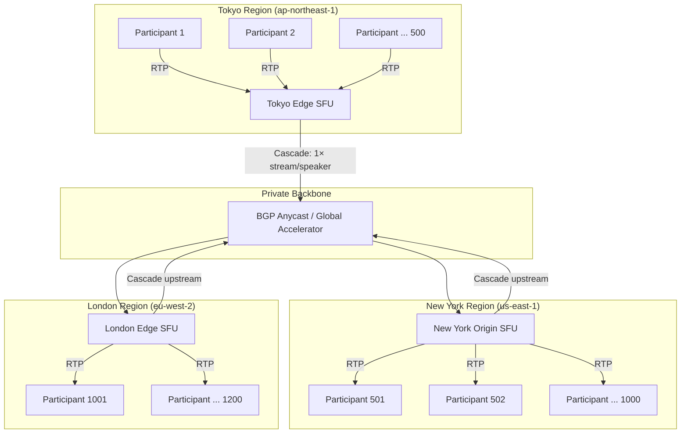
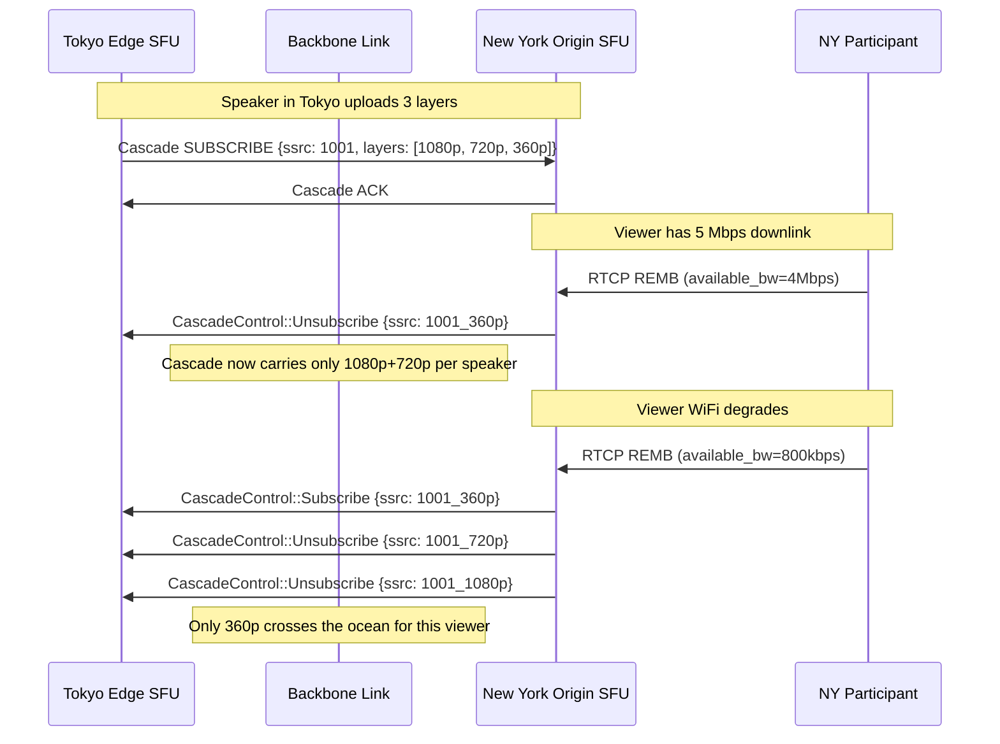

# Chapter 5: Edge Cascading — Distributed Meetings 🔴

> **The Problem:** A 1,000-person global town hall connects every participant to a
> single SFU data-center in Virginia. The Tokyo attendees suffer 180 ms of
> one-way latency, dropped keyframes, and muffled audio. Scaling vertically
> makes it worse: one SFU cannot absorb a terabit of bidirectional RTP traffic,
> and a single-region failure ends the meeting for *everyone*. The solution is
> a **cascaded SFU fabric** — a geographically distributed mesh of edge nodes
> that cooperate to deliver sub-50 ms end-to-end latency to any participant on
> the planet.

---

## 5.1 Why One SFU Is Never Enough

A standalone SFU is the right unit of work for a single data-center. Problems
emerge when participants span continents.

| Symptom | Root Cause | Impact |
|---|---|---|
| **High latency** | Round-trip Tokyo→Virginia = 180 ms OWD | Conversations feel laggy; participants talk over each other |
| **Packet loss spikes** | Trans-oceanic paths traverse multiple ISP hand-offs | Video freezes; FEC overhead increases |
| **CPU wall** | Decoding/re-encoding for mismatch requires MCU-style work | Server cost balloons; quality degrades |
| **Single-region blast radius** | One AZ failure drops all participants | Unacceptable for enterprise SLAs |
| **Bandwidth cost** | 1 Gbps Tokyo→Virginia per active speaker | CDN egress charges at $0.08/GB add up fast |

The fundamental insight: **media should travel the minimum possible geographic
distance on the public internet**. Once it reaches the backbone (AWS Global
Accelerator, Google Cloud Interconnect, Cloudflare Argo), it rides a private,
optimised path that is far more reliable than the commodity internet.

---

## 5.2 Cascaded SFU Architecture

### Core Concept

Each region runs one or more **edge SFUs**. Participants connect to their
nearest edge. Edge SFUs form a **cascade tree** over the private backbone:

```
Participant (Tokyo) ──► Tokyo Edge SFU ──[backbone]──► NY Origin SFU ◄── Participant (New York)
                                             │
                                             └────────► London Edge SFU ◄── Participant (London)
```

The backbone carries exactly **one multiplexed stream per active speaker** per
cascade link — not N×streams for N listeners in the downstream region. That is
the key bandwidth saving.

### Topology Diagram



### Cascade Link Properties

| Property | Value | Rationale |
|---|---|---|
| **Transport** | QUIC/RTP or SRTP over TLS 1.3 | Multiplexing + 0-RTT restart |
| **Streams per link** | #active-speakers × #simulcast-layers | Typically 3–15 SSRC pairs |
| **Codec passthrough** | Yes — SFU never decodes | Preserves quality, saves CPU |
| **Redundancy** | 2× uplinks to different PoPs | Sub-second failover |
| **Congestion control** | BBRv2 on backbone | Fills pipe without queue bloat |

---

## 5.3 Speaker Selection and Stream Negotiation

### The N-Speaker Problem

In a meeting with 1,000 attendees, only 2–3 people speak at any instant (Active
Speaker Detection via VAD). The cascade should only forward **active speakers'
streams**, not all 1,000 dormant video tracks.

### Active Speaker Detection (ASD)

The SFU monitors RTP audio packets and computes a running speech probability
using the WebRTC VAD algorithm.

```rust
use std::collections::HashMap;
use std::time::{Duration, Instant};

const VAD_WINDOW_MS: u64 = 300;
const SPEAKER_HOLD_MS: u64 = 1500; // hysteresis to avoid rapid switching

#[derive(Debug, Clone)]
pub struct SpeakerState {
    pub participant_id: u64,
    pub audio_level_db: f32,       // from RFC 6464 RTP header extension
    pub speech_probability: f32,   // 0.0–1.0
    pub last_speech_at: Instant,
    pub is_active: bool,
}

pub struct ActiveSpeakerDetector {
    states: HashMap<u64, SpeakerState>,
    active_speakers: Vec<u64>,
    max_active: usize,
}

impl ActiveSpeakerDetector {
    pub fn new(max_active: usize) -> Self {
        Self {
            states: HashMap::new(),
            active_speakers: Vec::new(),
            max_active,
        }
    }

    /// Called per audio RTP packet with the RFC 6464 audio level extension.
    pub fn update(&mut self, participant_id: u64, audio_level_dbov: u8) -> Option<Vec<u64>> {
        // dbov: 0 = loudest, 127 = silence. Convert to linear probability.
        let level_db = -(audio_level_dbov as f32);
        let speech_prob = if level_db > -40.0 {
            // Simple linear mapping: -40 dBov → 1.0, -70 dBov → 0.0
            ((level_db + 70.0) / 30.0).clamp(0.0, 1.0)
        } else {
            0.0
        };

        let now = Instant::now();
        let state = self.states.entry(participant_id).or_insert(SpeakerState {
            participant_id,
            audio_level_db: level_db,
            speech_probability: 0.0,
            last_speech_at: now,
            is_active: false,
        });

        // Exponential moving average
        state.speech_probability = 0.7 * speech_prob + 0.3 * state.speech_probability;
        state.audio_level_db = level_db;

        if speech_prob > 0.6 {
            state.last_speech_at = now;
        }

        // Rebuild active speaker list
        let prev = self.active_speakers.clone();
        self.active_speakers = self.recompute_active(now);

        if self.active_speakers != prev {
            Some(self.active_speakers.clone())
        } else {
            None // no change
        }
    }

    fn recompute_active(&self, now: Instant) -> Vec<u64> {
        let hold = Duration::from_millis(SPEAKER_HOLD_MS);
        let mut candidates: Vec<&SpeakerState> = self.states.values()
            .filter(|s| now.duration_since(s.last_speech_at) < hold)
            .collect();

        // Sort by speech probability descending
        candidates.sort_by(|a, b| b.speech_probability.partial_cmp(&a.speech_probability).unwrap());

        candidates.iter()
            .take(self.max_active)
            .map(|s| s.participant_id)
            .collect()
    }
}
```

### Stream Negotiation Protocol

When ASD detects a speaker change, the origin SFU sends a **cascade control
message** to all edge SFUs instructing them to subscribe or unsubscribe to
specific SSRCs:

```rust
use serde::{Serialize, Deserialize};

#[derive(Debug, Serialize, Deserialize)]
#[serde(tag = "type")]
pub enum CascadeControl {
    /// Origin → Edge: begin forwarding this SSRC
    Subscribe {
        ssrc: u32,
        participant_id: u64,
        codec: String,           // "opus", "h264", "vp9"
        simulcast_layers: Vec<SimulcastLayer>,
    },
    /// Origin → Edge: stop forwarding this SSRC
    Unsubscribe { ssrc: u32 },
    /// Edge → Origin: request a keyframe
    PliRequest { ssrc: u32 },
    /// Heartbeat / keepalive
    Ping { seq: u64, timestamp_ms: u64 },
    Pong { seq: u64, timestamp_ms: u64 },
}

#[derive(Debug, Serialize, Deserialize, Clone)]
pub struct SimulcastLayer {
    pub ssrc: u32,
    pub resolution: String,   // "1080p", "720p", "360p"
    pub target_bitrate_bps: u32,
    pub rid: String,          // WebRTC RID header extension value
}
```

---

## 5.4 Building the Cascade Link

### QUIC-based Cascade Transport

QUIC is ideal for cascade links because:
- **Multiple streams** in one connection → one congestion controller for all speakers
- **0-RTT reconnect** → cascade survives transient packet loss without re-negotiation
- **Built-in encryption** → SRTP keys are not needed on the backbone

```rust
use quinn::{Endpoint, Connection, SendStream, RecvStream};
use bytes::{BytesMut, BufMut};
use tokio::sync::mpsc;

/// One QUIC stream per speaker SSRC
pub struct CascadeStream {
    ssrc: u32,
    send: SendStream,
}

impl CascadeStream {
    /// Write an RTP packet onto this cascade stream.
    /// Prefix with a 4-byte length for framing (QUIC streams are byte-streams).
    pub async fn send_rtp(&mut self, rtp: &[u8]) -> anyhow::Result<()> {
        let len = rtp.len() as u32;
        self.send.write_all(&len.to_be_bytes()).await?;
        self.send.write_all(rtp).await?;
        Ok(())
    }
}

pub struct CascadeConnection {
    conn: Connection,
    streams: std::collections::HashMap<u32, CascadeStream>,
}

impl CascadeConnection {
    pub async fn open_ssrc_stream(&mut self, ssrc: u32) -> anyhow::Result<()> {
        let send = self.conn.open_uni().await?;
        // Send stream header: 4-byte SSRC identifier
        let mut stream = CascadeStream { ssrc, send };
        let header = ssrc.to_be_bytes();
        stream.send.write_all(&header).await?;
        self.streams.insert(ssrc, stream);
        Ok(())
    }

    pub async fn forward(&mut self, ssrc: u32, rtp: &[u8]) -> anyhow::Result<()> {
        if let Some(stream) = self.streams.get_mut(&ssrc) {
            stream.send_rtp(rtp).await?;
        }
        Ok(())
    }

    pub async fn close_ssrc_stream(&mut self, ssrc: u32) {
        if let Some(mut stream) = self.streams.remove(&ssrc) {
            let _ = stream.send.finish().await;
        }
    }
}
```

### Cascade Receiver (Edge Side)

```rust
pub struct CascadeReceiver {
    conn: Connection,
    /// ssrc → local participant dispatch channel
    dispatch: std::collections::HashMap<u32, mpsc::Sender<Vec<u8>>>,
}

impl CascadeReceiver {
    pub async fn accept_loop(
        mut conn: Connection,
        dispatch: std::collections::HashMap<u32, mpsc::Sender<Vec<u8>>>,
    ) {
        while let Ok(mut recv) = conn.accept_uni().await {
            let dispatch = dispatch.clone();
            tokio::spawn(async move {
                // Read SSRC header first
                let mut ssrc_buf = [0u8; 4];
                if recv.read_exact(&mut ssrc_buf).await.is_err() {
                    return;
                }
                let ssrc = u32::from_be_bytes(ssrc_buf);

                loop {
                    // Read 4-byte length prefix
                    let mut len_buf = [0u8; 4];
                    if recv.read_exact(&mut len_buf).await.is_err() {
                        break;
                    }
                    let len = u32::from_be_bytes(len_buf) as usize;

                    if len > 1500 {
                        break; // sanity check
                    }

                    let mut pkt = vec![0u8; len];
                    if recv.read_exact(&mut pkt).await.is_err() {
                        break;
                    }

                    if let Some(tx) = dispatch.get(&ssrc) {
                        let _ = tx.try_send(pkt);
                    }
                }
            });
        }
    }
}
```

---

## 5.5 Bandwidth Optimisation on Cascade Links

### Selective Layer Forwarding

The origin SFU knows the network conditions at each edge node (fed back via
RTCP REMB / Transport-CC). It selects which simulcast layer to forward on the
cascade link for each edge, minimising backbone bandwidth while respecting each
edge's downstream capacity.



### Cascade Bandwidth Model

For a meeting with **S active speakers**, **E edge regions**, and **L simulcast
layers**:

$$B_{cascade} = S \times \min(L, L_{needed}) \times B_{layer}$$

Where $L_{needed}$ is the maximum layer any edge region requires for its
worst-case viewer. This is dramatically better than the naive model of
forwarding all participants:

$$B_{naive} = N_{participants} \times B_{layer}$$

For a 1,000-person meeting with 3 active speakers and 3 regions:

| Model | Backbone Bandwidth | Details |
|---|---|---|
| **Naive (forward all)** | 1,000 × 2 Mbps = 2 Tbps | Completely impractical |
| **Naive (forward active)** | 3 × 3 × 2 Mbps = 18 Mbps | Still multiplied by regions |
| **Cascade (optimal)** | 3 × 1 × 2 Mbps × 2 links = 12 Mbps | One stream per speaker per link |
| **Cascade (adaptive)** | 3 × 0.4 Mbps × 2 links = 2.4 Mbps | 360p only for poor-connectivity viewers |

---

## 5.6 Edge Node Discovery and Routing

### Anycast DNS and Latency-Based Routing

Participants are directed to their nearest edge SFU through a combination of
**anycast DNS** and **latency probing**:

```
1. Client queries sfu.example.com (anycast)
2. DNS returns closest PoP IP based on GeoDNS
3. Client opens HTTPS/WebSocket connection and runs latency probes to top-3 PoPs
4. Signaling server selects lowest-RTT PoP with capacity headroom
```

```rust
#[derive(Debug, Clone)]
pub struct EdgeNode {
    pub id: String,
    pub region: String,           // "ap-northeast-1", "us-east-1"
    pub anycast_ip: std::net::IpAddr,
    pub signaling_url: String,
    pub current_load: f32,        // 0.0–1.0
    pub max_participants: u32,
    pub backbone_uplinks: Vec<BackboneUplink>,
}

#[derive(Debug, Clone)]
pub struct BackboneUplink {
    pub target_region: String,
    pub latency_ms: u32,
    pub available_bandwidth_mbps: u32,
    pub is_healthy: bool,
}

pub struct EdgeRegistry {
    nodes: Vec<EdgeNode>,
}

impl EdgeRegistry {
    /// Select best edge node for a participant given their observed RTTs.
    pub fn select_edge(
        &self,
        participant_rtt_ms: &std::collections::HashMap<String, u32>,
        meeting_id: &str,
    ) -> Option<&EdgeNode> {
        // Prefer node that:
        // 1. Has the meeting already (avoids creating new cascade link)
        // 2. Has lowest RTT to participant
        // 3. Has capacity headroom (load < 0.85)
        self.nodes.iter()
            .filter(|n| n.current_load < 0.85)
            .min_by_key(|n| {
                let rtt = participant_rtt_ms.get(&n.region).copied().unwrap_or(999);
                // Prefer nodes already serving the meeting (lower effective cost)
                let meeting_bonus = if self.node_serves_meeting(n, meeting_id) { 0 } else { 20 };
                rtt + meeting_bonus
            })
    }

    fn node_serves_meeting(&self, _node: &EdgeNode, _meeting_id: &str) -> bool {
        // Check meeting registry (omitted for brevity)
        false
    }
}
```

### Cascade Tree Construction

For a meeting spanning 3 regions, the system elects an **origin SFU** (the
region with the most active speakers, or lowest latency to the meeting creator)
and builds a **star cascade** from it:

```mermaid
graph LR
    subgraph Origin["Origin: us-east-1 (400 participants)"]
        OSFU[NY SFU — Origin]
    end
    subgraph Edge1["ap-northeast-1 (500 participants)"]
        TSFU[Tokyo SFU — Edge]
    end
    subgraph Edge2["eu-west-2 (100 participants)"]
        LSFU[London SFU — Edge]
    end
    subgraph Edge3["us-west-2 (0 participants, hot standby)"]
        WSFU[Oregon SFU — Standby]
    end

    OSFU <-->|"Cascade link\n3ms latency RTT\n~9 Mbps"| TSFU
    OSFU <-->|"Cascade link\n80ms latency RTT\n~9 Mbps"| LSFU
    OSFU -.->|"Heartbeat only"| WSFU

    style WSFU fill:#444,stroke:#666
```



---

## 5.7 Fault Tolerance and Cascade Failover

### Failure Modes

| Failure | Detection | Recovery |
|---|---|---|
| Edge SFU crash | Cascade heartbeat timeout (2s) | Participants reconnect to backup edge |
| Backbone link drop | QUIC connection error | Switch to secondary uplink within 500 ms |
| Origin SFU crash | All edges lose cascade | Elect new origin from surviving edges |
| DNS failure | Client HTTPS timeout | Hardcoded fallback IPs in SDK |
| Partial partition | Increased latency/loss on cascade | Degrade to 360p, notify participants |

### Cascade Heartbeat and Health Monitor

```rust
use tokio::time::{interval, Duration};

pub struct CascadeHealthMonitor {
    cascade: CascadeConnection,
    seq: u64,
    last_pong: Instant,
}

impl CascadeHealthMonitor {
    const PING_INTERVAL: Duration = Duration::from_millis(500);
    const TIMEOUT: Duration = Duration::from_secs(3);

    pub async fn run(mut self, mut events: mpsc::Sender<CascadeEvent>) {
        let mut ticker = interval(Self::PING_INTERVAL);
        loop {
            ticker.tick().await;
            let seq = self.seq;
            self.seq += 1;

            // Send ping over control channel
            let ping = CascadeControl::Ping {
                seq,
                timestamp_ms: unix_ms(),
            };
            if let Err(_) = self.send_control(&ping).await {
                let _ = events.send(CascadeEvent::LinkDown).await;
                return;
            }

            // Check for timeout
            if Instant::now().duration_since(self.last_pong) > Self::TIMEOUT {
                let _ = events.send(CascadeEvent::LinkDown).await;
                return;
            }
        }
    }

    async fn send_control(&self, _ctrl: &CascadeControl) -> anyhow::Result<()> {
        // Serialise to JSON/protobuf and write over QUIC control stream
        Ok(())
    }
}

#[derive(Debug)]
pub enum CascadeEvent {
    LinkDown,
    LatencySpike { rtt_ms: u32 },
    BandwidthDegraded { available_mbps: f32 },
}

fn unix_ms() -> u64 {
    std::time::SystemTime::now()
        .duration_since(std::time::UNIX_EPOCH)
        .unwrap()
        .as_millis() as u64
}
```

### Origin Election (Raft-like)

When the origin SFU crashes, surviving edges have 2 seconds to elect a new
origin before participants notice audio dropouts:

```rust
pub struct OriginElection {
    node_id: String,
    peers: Vec<String>,
    vote_timeout: Duration,
}

impl OriginElection {
    /// Simplified Bully algorithm — highest node_id wins.
    /// Production: use Raft with pre-elected candidates for determinism.
    pub async fn elect(&self) -> String {
        let mut votes: Vec<String> = Vec::new();
        votes.push(self.node_id.clone());

        // Broadcast candidacy to all peers
        for peer in &self.peers {
            // (omitted: send CANDIDATE message and collect peer votes)
            votes.push(peer.clone());
        }

        // Highest lexicographic ID wins (stand-in for a real priority score)
        votes.into_iter().max().expect("at least one node")
    }
}
```

---

## 5.8 Observability for Cascaded Meetings

A distributed cascade makes debugging significantly harder. Every packet crosses
at least two SFU hops, and latency contributions can originate anywhere.

### Per-Link Telemetry

```rust
#[derive(Debug, Default)]
pub struct CascadeLinkStats {
    pub link_id: String,
    pub origin_region: String,
    pub edge_region: String,

    // Throughput
    pub bytes_forwarded: u64,
    pub rtp_packets_forwarded: u64,
    pub rtp_packets_dropped: u64,

    // Latency
    pub rtt_ms_p50: f32,
    pub rtt_ms_p99: f32,

    // Quality
    pub packet_loss_pct: f32,
    pub keyframes_requested: u64,  // PLI/FIR count (high = quality problems)
    pub layer_switches: u64,       // simulcast layer switch count

    // Cascade
    pub active_ssrcs: u32,
    pub subscribed_layers: u32,
    pub backbone_bw_mbps: f32,
}
```

### Distributed Tracing

Every RTP packet carries a **trace context** in a vendor extension header
(`urn:ietf:params:rtp-hdrext:sdes:mid`-piggybacked):

```
RTP Extension Header:
  [0xBE 0xDE] — RFC 5285 one-byte
  ID=15, LEN=8
  [trace_id: u64]   — propagated from publisher through all cascade hops
```

The origin SFU stamps `trace_id = random_u64()` on the first packet of each
keyframe group. Every SFU on the path records:

| Event | Timestamp | Data |
|---|---|---|
| RTP_RECEIVED | edge ingress | ssrc, seq, trace_id |
| CASCADE_QUEUED | origin egress | link_id, queue_depth |
| CASCADE_SENT | origin egress wire | bytes, ts |
| CASCADE_RECEIVED | edge ingress | bytes, ts, rtt_estimate |
| RTP_FORWARDED | edge egress | ssrc, seq, viewer_id |

These events feed into a **Jaeger** trace, giving a complete flame-graph of
where latency is spent across the cascade.

```mermaid
gantt
    title RTP Packet Journey — Tokyo Speaker → New York Viewer
    dateFormat  x
    axisFormat %L ms

    section Tokyo Edge
    Participant → Edge RTP RX     :0, 5
    ASD + Layer Select            :5, 7
    Cascade Queue                 :7, 8

    section Backbone
    QUIC write + ACK              :8, 12
    Trans-Pacific propagation     :12, 92

    section New York Origin
    QUIC RX + demux               :92, 94
    Simulcast layer route         :94, 95
    RTP forward to viewer         :95, 97

    section New York Viewer
    OS network stack              :97, 99
    Jitter buffer de-queue        :99, 120
    Decoder display               :120, 125
```



End-to-end: **125 ms** for a Tokyo→New York path — versus 280 ms without a
cascade (180 ms OWD + jitter buffer + processing at a single US-only SFU).

---

## 5.9 Capacity Planning

### Edge Node Sizing

An edge SFU forwarding 500 participants is a **UDP router**, not a transcoder.
CPU usage is dominated by:

1. **Crypto** — SRTP AES-128-GCM authentication per packet (~200 ns/pkt on AES-NI)
2. **RTCP processing** — REMB / Transport-CC parsing and bandwidth estimation
3. **RTP parsing** — Extension header extraction for ASD and tracing
4. **Cascade framing** — QUIC stream writes

| Metric | 500 viewers, 3 speakers | 2,000 viewers, 10 speakers |
|---|---|---|
| **Inbound RTP (from cascade)** | 3 × 3 layers × 2 Mbps = 18 Mbps | 10 × 3 × 2 = 60 Mbps |
| **Outbound RTP (to viewers)** | 500 × 2 Mbps avg = 1 Gbps | 2,000 × 1.5 Mbps = 3 Gbps |
| **CPU (AES-NI SRTP)** | ~2 cores | ~8 cores |
| **CPU (RTCP/BWE)** | ~0.5 cores | ~2 cores |
| **RAM** | 4 GB | 12 GB |
| **Recommended instance** | c6gn.2xlarge (8 vCPU, 16 GB) | c6gn.8xlarge (32 vCPU, 64 GB) |

### Auto-Scaling Policy

```
Scale-out trigger:  CPU > 70% for 2 minutes
                    OR outbound_bw > 80% of NIC capacity
                    OR participant_count > 1500

Scale-in trigger:   CPU < 30% for 10 minutes
                    AND participant_count < 500

Scale-in guard:     Never scale below 2 nodes per region (HA)
```

New nodes register with the **Edge Registry Service** and receive a share of
newly joining participants. Existing participants are **not** migrated (migration
causes a 2–5 second disruption); they stay on their current node until the
meeting ends or they naturally reconnect.

---

## 5.10 End-to-End Latency Budget

| Segment | Typical | Budget |
|---|---|---|
| Publisher microphone → OS capture | 5 ms | 10 ms |
| Opus encode (20 ms frame) | 20 ms | 20 ms |
| RTP packetisation + SRTP | 1 ms | 2 ms |
| OS network stack + WiFi | 5–15 ms | 20 ms |
| **Publisher → Edge SFU** | 10–30 ms | 50 ms |
| ASD + cascade enqueue | 1 ms | 2 ms |
| **Edge → Origin backbone** | 5–90 ms | 100 ms |
| Origin forward + SRTP | 1 ms | 2 ms |
| **Origin → Viewer** | 10–30 ms | 50 ms |
| Jitter buffer de-queue | 20–60 ms | 80 ms |
| Opus decode + playout | 5 ms | 10 ms |
| **Total** | **78–233 ms** | **346 ms** |

The cascade architecture keeps the **worst-case budget under 350 ms** — well
within the ITU-T G.114 comfort threshold of 400 ms for interactive voice.
Without a cascade, a Tokyo→New York path would blow through this budget at the
backbone propagation step alone.

---

## 5.11 Security on the Cascade Link

The cascade carries media from multiple meetings over shared backbone links. Key
controls:

| Threat | Mitigation |
|---|---|
| **Media interception on backbone** | SRTP end-to-end; cascade QUIC adds TLS 1.3 as second layer |
| **Rogue edge injection** | Mutual TLS on cascade control channel; origin validates edge cert |
| **Meeting cross-contamination** | SSRC namespacing per meeting_id; edge drops unknown SSRCs |
| **DoS on cascade port** | Firewall allows only origin IP; QUIC token-based address validation |
| **Key extraction from SFU memory** | SRTP keys never logged; stored in kernel keyring; SFU process sandboxed |

### SRTP Passthrough

The edge SFU **never holds SRTP keys** for end-to-end encrypted meetings. It
forwards ciphertext opaquely. Only the client endpoints hold the symmetric keys
negotiated via DTLS-SRTP:

```
Publisher ──[DTLS-SRTP encrypted]──► Edge SFU ──[same ciphertext]──► Origin SFU ──[same ciphertext]──► Viewer
                                        ↑
                              SFU sees only ciphertext.
                              Cannot decrypt media content.
```

This is **E2E encryption at the media layer** — distinct from the transport
encryption (TLS) on the cascade link itself.

---

## 5.12 Production War Stories

### The Asymmetric Route Problem

A real-world incident: the Tokyo→NY backbone path was symmetric (180 ms each
way) but the NY→Tokyo ACK path was routed via London (320 ms). QUIC's
congestion controller saw effective RTT of 500 ms, capped the congestion
window, and the cascade link stalled at 20% capacity. **Fix:** Force symmetric
backbone routing via route pinning in the SD-WAN overlay.

### The Thundering Herd on Reconnect

When an edge SFU crashed, 500 Tokyo participants reconnected simultaneously.
The backup edge received 500 WebSocket connections, 500 DTLS handshakes, and
500 ICE checks in under 1 second — exhausting its UDP receive buffer (256 MB)
and dropping 40% of ICE checks.

**Fix:**
1. Exponential back-off with jitter in the client SDK: `delay = random(0, min(30, 2^attempt)) seconds`
2. UDP receive buffer tuned to 8 GB via `sysctl net.core.rmem_max`
3. Edge pre-warms ICE candidates via UDP STUN keepalives every 25 seconds

### The Simulcast Layer Thrash

ASD toggled a speaker on/off 4 times per second (background music was
triggering VAD). Each toggle caused 4 PLI requests per viewer (keyframe
requests), flooding the cascade with 500 × 4 = 2,000 keyframes per second.
Each I-frame is ~10× larger than a P-frame; cascade bandwidth spiked to 10×
normal.

**Fix:** ASD hysteresis — require 300 ms of continuous speech before promoting
to active speaker, and 1,500 ms of silence before demoting.

---

## 5.13 Comparing Cascade Strategies

| Strategy | Topology | Pros | Cons |
|---|---|---|---|
| **Star (origin + edges)** | All edges connect to one origin | Simple routing; origin has full picture | Origin is SPOF; inter-edge latency is 2-hop |
| **Mesh cascade** | Every edge connects to every other | Lowest latency; no SPOF | O(E²) links; complex subscription management |
| **Tree cascade** | Hierarchical (region → country → continent) | Scales to 100k+; minimal backbone usage | Deep trees add latency; tree reshuffling is disruptive |
| **Anycast geofence** | Participant routed to nearest PoP by IP | Automatic; no topology management | Fine for CDN; wrong for bidirectional media (needs session stickiness) |

**Recommendation:** Star topology up to ~10 edge regions. Switch to a
two-level tree (continent → regional origin → city edge) for global deployments
exceeding 50 edge PoPs.

---

## Summary

```mermaid
graph TD
    A[Client in Tokyo] -->|WebSocket ICE/SDP| B[Tokyo Edge SFU]
    B -->|RTP ingress| C{Active Speaker Detector}
    C -->|Active: forward upstream| D[Cascade QUIC Link]
    C -->|Inactive: suppress| E[/dev/null]
    D --> F[NY Origin SFU]
    F -->|Subscribe control| D
    F -->|RTP local forward| G[NY Participants]
    F -->|Cascade QUIC link| H[London Edge SFU]
    H -->|RTP| I[London Participants]

    J[Edge Registry / DNS] -->|GeoDNS routing| A
    K[Backbone Health Monitor] -->|Failover signal| D

    style E fill:#333,stroke:#555
```

> **Key Takeaways**
>
> 1. **Cascade = one stream per speaker per link.** The bandwidth savings over
>    naive forwarding are 2–3 orders of magnitude for large meetings.
>
> 2. **Active Speaker Detection is the cascade's gatekeeper.** Poor ASD (too
>    sensitive, no hysteresis) causes keyframe storms that saturate backbone links.
>
> 3. **QUIC is the right transport for cascade links.** Multiplexing, 0-RTT
>    reconnect, and built-in flow control eliminate the need for custom framing.
>
> 4. **The SFU is a packet router, not a transcoder.** End-to-end SRTP
>    passthrough keeps CPU usage proportional to packet count, not bitrate.
>
> 5. **Failover must be sub-2-second.** Beyond 2 seconds of audio dropout,
>    participants notice and the meeting loses cohesion.
>
> 6. **Observe everything.** Trace IDs in RTP extension headers, per-link
>    bandwidth counters, and PLI rates are the three leading indicators of cascade
>    health.
