# System Design: The Global Video Streaming Engine

## Speaker Intro

This handbook is written from the perspective of a **Principal Streaming Architect** who has designed, deployed, and operated global-scale video infrastructure serving millions of concurrent viewers across six continents. The content draws from first-hand experience building RTMP/SRT ingest gateways in Rust that absorb 50 Gbps of live broadcaster traffic without dropping a frame, orchestrating GPU transcoding clusters that produce adaptive bitrate ladders in real time, operating CDN edge layers that achieve 99.6% cache hit rates on live video segments, and shipping Flutter-based player applications with sub-second startup times and seamless quality adaptation from 4G subway tunnels to fiber-optic home connections — all protected end-to-end by multi-DRM encryption with FairPlay, Widevine, and PlayReady.

## Who This Is For

- **Backend systems engineers** building video platforms who want to understand the full pipeline from camera to screen — and why their naive "just use FFmpeg" approach falls apart at 10,000 concurrent viewers.
- **Rust engineers** who want to push the language into the media domain — binding to `libavcodec` via FFI, managing GPU worker pools, and building zero-copy ingest servers that saturate 10GbE NICs.
- **Flutter developers** building cross-platform video players who need to go beyond `video_player` and implement adaptive bitrate heuristics, DRM license acquisition, and seamless quality switching with platform channels to ExoPlayer and AVPlayer.
- **Infrastructure engineers** designing CDN edge architectures who want quantitative models for cache hit rates, segment TTLs, and origin shielding strategies that actually work for live video's unique access patterns.
- **Staff+ engineers** preparing for system design interviews where "design a video streaming platform like Netflix/Twitch" is a top-5 question — and where hand-waving about "just use a CDN" gets you rejected.

## Prerequisites

| Concept | Where to Learn |
|---|---|
| Intermediate Rust (ownership, traits, `async/.await`) | [Async Rust](../async-book/src/SUMMARY.md) |
| FFI and unsafe Rust fundamentals | [Unsafe Rust & FFI](../unsafe-ffi-book/src/SUMMARY.md) |
| Flutter fundamentals (widget tree, platform channels) | [The Omni-Platform Flutter Architect](../flutter-omni-book/src/SUMMARY.md) |
| Basic networking (TCP, UDP, HTTP) | [Distributed Systems](../distributed-systems-book/src/SUMMARY.md) |
| Understanding of container orchestration (Kubernetes) | [Cloud-Native Rust](../cloud-native-book/src/SUMMARY.md) |

## How to Use This Book

| Emoji | Meaning |
|---|---|
| 🟢 | **Architecture** — protocol fundamentals and system topology decisions that everything else builds on |
| 🟡 | **Implementation** — production-grade Rust transcoding and CDN engineering with working code |
| 🔴 | **Advanced Media/Networking** — adaptive bitrate algorithms, DRM cryptography, and client-side player internals |

Each chapter solves **one specific bottleneck or failure mode** in a video streaming pipeline. Read them in order — later chapters assume the ingest gateway, transcoding cluster, and CDN infrastructure from earlier chapters are operational.

## The Problem We Are Solving

> Architect a **low-latency, adaptive video streaming platform** capable of handling **millions of concurrent viewers** — using Rust for the transcoding pipeline and edge ingest nodes, and Flutter for cross-platform client players — with end-to-end DRM encryption, sub-3-second glass-to-glass latency for live streams, and seamless quality adaptation across network conditions.

The system we will build has these non-negotiable requirements:

| Requirement | Target |
|---|---|
| Concurrent viewers | ≥ 2 million per live event, ≥ 50 million daily for VOD |
| Glass-to-glass latency (live) | < 3 seconds from camera to viewer screen |
| Startup time (time to first frame) | < 1 second on broadband, < 2 seconds on 4G |
| Adaptive bitrate ladder | 4K, 1080p, 720p, 480p, 360p — seamless switching with no rebuffering |
| Rebuffer rate | < 0.5% of total viewing sessions |
| CDN cache hit rate | ≥ 99% for live segments, ≥ 95% for long-tail VOD |
| DRM coverage | Widevine (Android/Chrome), FairPlay (iOS/Safari), PlayReady (Edge/Smart TVs) |
| Global availability | Content served from edge nodes within 50ms RTT of 95% of viewers |
| Encoding efficiency | Hardware-accelerated (NVENC/VA-API) transcoding at ≤ 2× real-time per quality rung |

## Pacing Guide

| Chapter | Topic | Time | Checkpoint |
|---|---|---|---|
| Ch 0 | Introduction & Architecture Overview | 30 min | Understand the full pipeline topology |
| Ch 1 | Video Protocols and Ingestion (RTMP/SRT) | 6–8 hours | Working Rust RTMP/SRT ingest gateway with frame validation |
| Ch 2 | The Rust Transcoding Pipeline | 8–10 hours | FFmpeg FFI bindings, GPU worker pool, ABR ladder output |
| Ch 3 | HLS, DASH, and Edge Caching | 8–10 hours | Manifest generation, segment packaging, CDN cache architecture |
| Ch 4 | The Flutter Adaptive Player | 8–10 hours | Cross-platform player with ABR heuristics and quality switching |
| Ch 5 | DRM and Content Protection | 6–8 hours | Multi-DRM encryption pipeline and license server |

**Total: ~37–47 hours** of focused study.

## Table of Contents

### Part I: Ingestion
- **Chapter 1 — Video Protocols and Ingestion (RTMP/SRT) 🟢** — How live video gets from the broadcaster's camera to your ingest server. Why RTMP still dominates despite being built on TCP and why SRT is the future for unreliable networks. Building a Rust ingest gateway with `tokio` that parses FLV containers, validates NAL units, and handles dropped frames gracefully — all while maintaining backpressure against abusive or misconfigured encoders.

### Part II: Processing
- **Chapter 2 — The Rust Transcoding Pipeline 🟡** — Transforming raw ingest into a multi-bitrate adaptive ladder. Using Rust FFI to bind to FFmpeg's `libavcodec`/`libavformat`, managing GPU-accelerated transcoding workers with NVENC, splitting input into parallelizable Groups of Pictures (GOPs), and distributing work across a Kubernetes cluster of GPU nodes — producing 1080p, 720p, and 480p renditions simultaneously with aligned keyframes.

### Part III: Distribution
- **Chapter 3 — HLS, DASH, and Edge Caching 🟡** — Packaging transcoded video into streamable formats. Generating HLS `.m3u8` master and media playlists, producing CMAF `.m4s` segments for DASH compatibility, pushing segments to cloud object storage, and architecting a multi-tier CDN edge layer with origin shielding that achieves 99%+ cache hit rates — even for live content where segments only exist for 30 seconds.

### Part IV: Playback
- **Chapter 4 — The Flutter Adaptive Player 🔴** — Building a production-grade cross-platform video player. Using platform channels to ExoPlayer (Android) and AVPlayer (iOS), parsing HLS manifests, implementing Adaptive Bitrate Streaming (ABR) heuristics that predict bandwidth and buffer health, and seamlessly downgrading quality when the viewer's WiFi signal drops — without a single rebuffer event.

### Part V: Security
- **Chapter 5 — DRM and Content Protection 🔴** — Securing your content against piracy. Implementing Widevine, FairPlay, and PlayReady DRM across the full pipeline — from AES-128-CTR encryption of segments in the Rust transcoding pipeline, to key rotation strategies, to license server design, to secure license acquisition in the Flutter client's hardware-backed Content Decryption Module (CDM).

## Architecture Overview

The complete system forms a linear pipeline with feedback loops from the player:

```mermaid
graph LR
    subgraph "Ingestion"
        CAM["📷 Broadcaster<br/>(OBS / Hardware Encoder)"]
        INGEST["🦀 Rust Ingest Gateway<br/>(RTMP / SRT)"]
    end

    subgraph "Processing"
        QUEUE["📦 GOP Queue<br/>(Kafka / Redis Streams)"]
        TRANSCODE["🎬 GPU Transcode Cluster<br/>(Rust + FFmpeg FFI)"]
    end

    subgraph "Distribution"
        PACKAGE["📋 Manifest Generator<br/>(HLS .m3u8 / DASH .mpd)"]
        STORAGE["☁️ Object Storage<br/>(S3 / GCS)"]
        CDN["🌐 CDN Edge Nodes<br/>(Multi-tier Cache)"]
    end

    subgraph "Playback"
        PLAYER["📱 Flutter Player<br/>(ExoPlayer / AVPlayer)"]
    end

    subgraph "Security"
        DRM["🔒 DRM License Server<br/>(Widevine / FairPlay / PlayReady)"]
        KMS["🔑 Key Management<br/>(HSM-backed)"]
    end

    CAM -->|"RTMP/SRT"| INGEST
    INGEST -->|"Raw H.264 GOPs"| QUEUE
    QUEUE -->|"Distribute"| TRANSCODE
    TRANSCODE -->|"Multi-bitrate segments"| PACKAGE
    PACKAGE -->|"Segments + Manifests"| STORAGE
    STORAGE -->|"Origin pull"| CDN
    CDN -->|"HLS/DASH"| PLAYER
    PLAYER -->|"License request"| DRM
    DRM -->|"Encrypted key"| PLAYER
    KMS -->|"Master keys"| DRM
    KMS -->|"Content keys"| TRANSCODE
```

## Companion Guides

This book integrates deeply with the following handbooks in this training series:

| Guide | Relevance |
|---|---|
| [Async Rust](../async-book/src/SUMMARY.md) | The `tokio` runtime underpinning the ingest gateway and transcode orchestrator |
| [Unsafe Rust & FFI](../unsafe-ffi-book/src/SUMMARY.md) | FFI bindings to FFmpeg's C libraries (`libavcodec`, `libavformat`) |
| [Cloud-Native Rust](../cloud-native-book/src/SUMMARY.md) | Kubernetes deployment of GPU transcode workers and edge nodes |
| [The Omni-Platform Flutter Architect](../flutter-omni-book/src/SUMMARY.md) | Platform channels, native plugin architecture for ExoPlayer/AVPlayer |
| [Distributed Systems](../distributed-systems-book/src/SUMMARY.md) | Consistent hashing for CDN routing, partition-tolerant origin shielding |
| [Microservices Patterns](../microservices-book/src/SUMMARY.md) | Service mesh configuration for the transcode cluster and license server |
