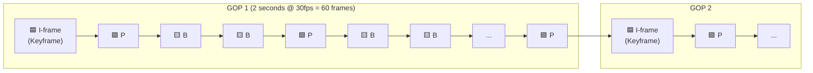
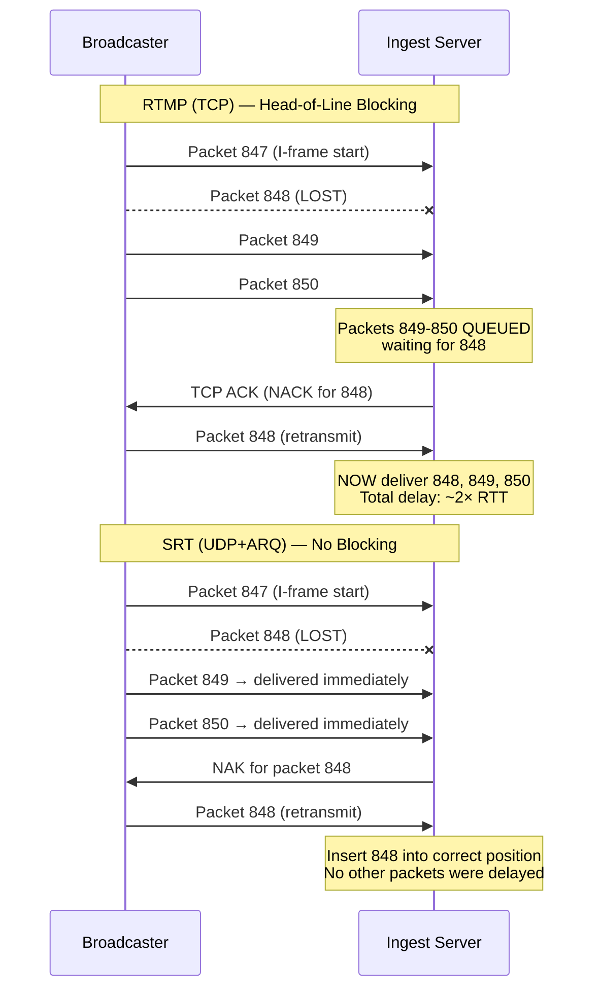
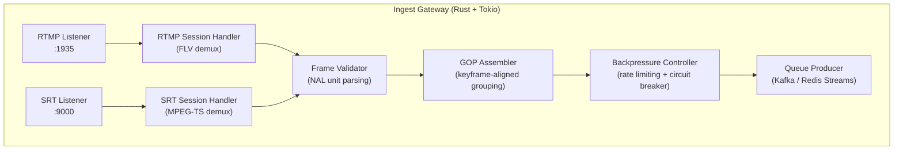
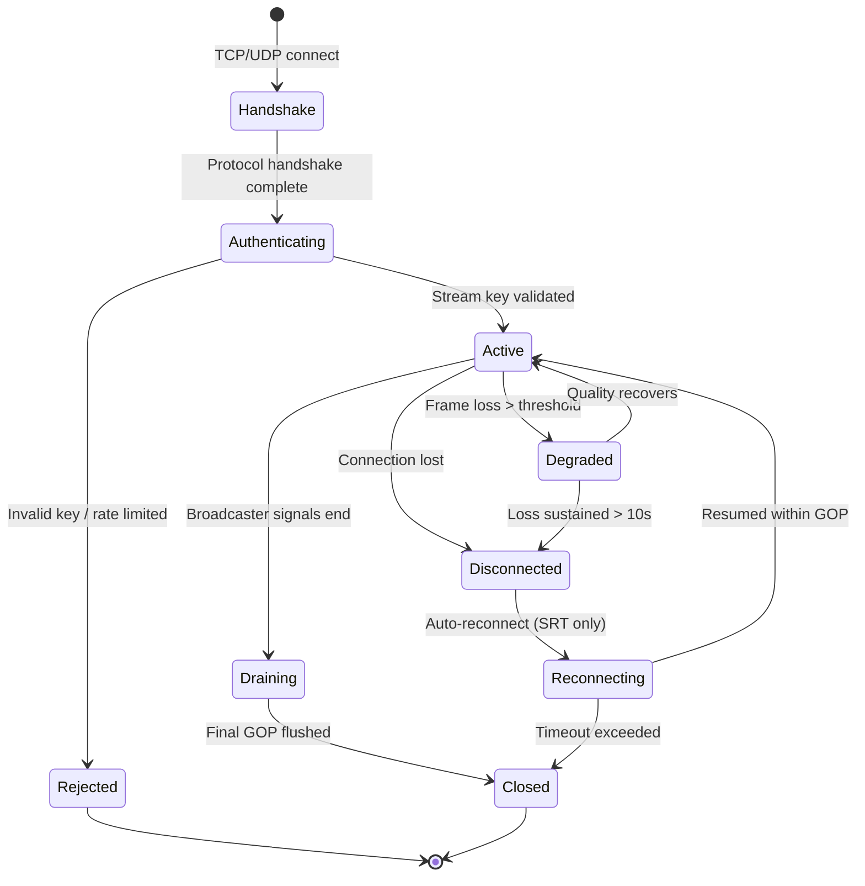
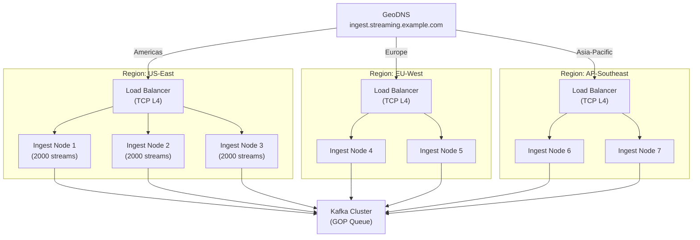

# 1. Video Protocols and Ingestion (RTMP/SRT) 🟢

> **The Problem:** A broadcaster in São Paulo pushes a 1080p60 live stream to your ingest server in Virginia. With TCP (RTMP), every dropped packet triggers a retransmission — introducing 200–800ms of head-of-line blocking that cascades into visible stuttering for millions of viewers. With raw UDP, you get zero retransmission but lose keyframes with no way to recover. We need an ingest layer that **absorbs network impairments** at the broadcaster edge without propagating latency spikes downstream.

---

## 1.1 The Anatomy of a Live Video Stream

Before we can build an ingest gateway, we need to understand what the broadcaster is actually sending. A live video stream is not a continuous flow of pixels — it is a structured sequence of **compressed frames** packed inside a **container format**.

### Frame Types: I, P, B

Every modern video codec (H.264, H.265/HEVC, AV1) compresses video using three frame types:

| Frame Type | Full Name | Description | Typical Size |
|---|---|---|---|
| **I-frame** | Intra-coded | Complete image — can be decoded independently. Also called a **keyframe**. | 50–200 KB |
| **P-frame** | Predicted | Contains only the *differences* from the previous I or P frame. | 10–50 KB |
| **B-frame** | Bi-predicted | References both previous *and* future frames for maximum compression. | 5–20 KB |

A **Group of Pictures (GOP)** starts with an I-frame followed by a sequence of P and B frames. The GOP is the atomic unit of video that can be independently decoded.



**Critical insight:** If you lose an I-frame, the entire GOP is undecodable. If you lose a P-frame, every subsequent P and B frame in that GOP is corrupted. This is why **frame-level reliability** matters more than byte-level reliability.

### Container Formats

The compressed frames are wrapped in a container that provides timing, metadata, and demuxing information:

| Container | Protocol | Use Case |
|---|---|---|
| **FLV** (Flash Video) | RTMP | Legacy but still dominant for ingest |
| **MPEG-TS** (.ts) | SRT, HLS | Transport stream — designed for lossy channels |
| **fMP4** (.m4s) | DASH, CMAF | Fragmented MP4 — modern, DRM-friendly |

---

## 1.2 Protocol Deep Dive: RTMP vs SRT

### RTMP: The Unkillable Legacy

**Real-Time Messaging Protocol (RTMP)** was designed by Macromedia in 2002 for Flash. It is built on top of TCP. It should be dead. It isn't.

**Why RTMP still dominates ingest:**
- Every hardware encoder (Blackmagic, AJA, Teradek) supports it.
- OBS Studio defaults to it.
- YouTube Live, Twitch, and Facebook Live all accept it.
- The handshake is simple and well-documented.

**Why RTMP is architecturally dangerous for live video:**

```
// 💥 BUFFERING HAZARD: TCP's head-of-line blocking kills live latency

// Scenario: Broadcaster in São Paulo → Ingest in Virginia (RTT ~120ms)
//
// 1. Packet 847 is lost in transit
// 2. TCP detects the loss after 1 RTT (~120ms)
// 3. TCP retransmits packet 847
// 4. Packets 848–900 are QUEUED in the kernel's receive buffer
//    — they cannot be delivered to the application until 847 arrives
// 5. Total stall: 120ms (detection) + 120ms (retransmit RTT) = ~240ms
//
// At 30fps, that's 7 frames of video buffered in the kernel.
// The ingest server sees a 240ms gap followed by a burst of 7 frames.
// If this happens during a keyframe boundary, the entire GOP is delayed.
//
// This is TCP's HEAD-OF-LINE BLOCKING problem.
// It is unfixable within TCP. It is a protocol-level limitation.
```

### SRT: The Modern Alternative

**Secure Reliable Transport (SRT)** is an open-source protocol developed by Haivision, built on top of UDP with application-level retransmission.

| Feature | RTMP (TCP) | SRT (UDP) |
|---|---|---|
| Transport | TCP | UDP with ARQ |
| Head-of-line blocking | Yes — kernel-level | No — application-level selective retransmit |
| Encryption | RTMPS (TLS wrapper) | Built-in AES-128/256 |
| FEC | None | Optional forward error correction |
| Latency control | None — TCP decides | Configurable latency buffer (e.g., 120ms) |
| NAT traversal | Requires port forwarding | Built-in rendezvous mode |
| Packet recovery | TCP retransmit (full RTT) | ARQ with configurable retransmit window |
| Bandwidth overhead | ~3% (TCP headers + ACKs) | ~5–10% (ARQ + FEC overhead) |



**SRT's killer feature:** The configurable **latency buffer**. You tell SRT: "I am willing to tolerate 120ms of latency." SRT uses that budget to perform retransmissions. If a packet can't be recovered within the latency budget, SRT drops it and signals the application — instead of blocking all subsequent data.

---

## 1.3 Building the Rust Ingest Gateway

Our ingest gateway must:
1. Accept RTMP connections from legacy encoders (OBS, hardware).
2. Accept SRT connections from modern encoders.
3. Parse the container (FLV or MPEG-TS) and extract raw H.264/HEVC NAL units.
4. Validate frame integrity — reject truncated or corrupt NAL units.
5. Group frames into GOPs and forward complete GOPs to the transcoding queue.
6. Apply backpressure against abusive encoders (bitrate spikes, malformed streams).

### Architecture



### The Naive RTMP Handler

```rust,editable
// 💥 BUFFERING HAZARD: Treating video as a byte stream
// This approach reads raw bytes and forwards them without understanding
// the video structure. It cannot detect:
// - Corrupt keyframes (entire GOP becomes undecodable)
// - Mid-GOP stream disconnections (partial GOP poisons the transcoder)
// - Bitrate spikes from misconfigured encoders (OOM on transcoder)

use tokio::net::TcpListener;
use tokio::io::AsyncReadExt;

async fn naive_ingest() -> std::io::Result<()> {
    let listener = TcpListener::bind("0.0.0.0:1935").await?;

    loop {
        let (mut socket, _addr) = listener.accept().await?;
        tokio::spawn(async move {
            let mut buf = vec![0u8; 65536];
            loop {
                // 💥 Problem 1: We read arbitrary chunks with no frame boundaries
                let n = socket.read(&mut buf).await.unwrap();
                if n == 0 { break; }

                // 💥 Problem 2: We forward raw bytes — the transcoder has no idea
                // where one frame ends and the next begins
                forward_to_transcoder(&buf[..n]).await;

                // 💥 Problem 3: No backpressure — a 50 Mbps stream from a
                // misconfigured encoder will overwhelm the transcoder
            }
        });
    }
}

async fn forward_to_transcoder(_data: &[u8]) {
    // Just shove bytes into a queue...
}
```

### The Production Ingest Gateway

```rust,editable
// ✅ FIX: Frame-aware RTMP ingest with validation and GOP assembly

use std::collections::VecDeque;
use std::time::{Duration, Instant};

/// Represents a single decoded video frame extracted from the FLV container.
#[derive(Debug, Clone)]
struct VideoFrame {
    /// Presentation timestamp in milliseconds
    pts_ms: u64,
    /// Decode timestamp in milliseconds
    dts_ms: u64,
    /// True if this is an IDR (Instantaneous Decoder Refresh) keyframe
    is_keyframe: bool,
    /// Raw H.264 NAL unit data (Annex B format)
    nal_data: Vec<u8>,
    /// Size in bytes — used for bitrate calculations
    size_bytes: usize,
}

/// A complete Group of Pictures — the atomic unit we send to the transcoder.
#[derive(Debug, Clone)]
struct Gop {
    /// The stream key identifying this broadcaster
    stream_key: String,
    /// Sequence number for ordering at the transcoder
    sequence: u64,
    /// All frames in this GOP, starting with a keyframe
    frames: Vec<VideoFrame>,
    /// Total bytes — used for backpressure decisions
    total_bytes: usize,
    /// Duration of this GOP
    duration: Duration,
}

/// Assembles incoming frames into complete GOPs.
/// A new GOP starts every time we see a keyframe.
struct GopAssembler {
    current_frames: Vec<VideoFrame>,
    current_bytes: usize,
    first_pts: Option<u64>,
    gop_sequence: u64,
    stream_key: String,
}

impl GopAssembler {
    fn new(stream_key: String) -> Self {
        Self {
            current_frames: Vec::with_capacity(120), // 2 sec @ 60fps
            current_bytes: 0,
            first_pts: None,
            gop_sequence: 0,
            stream_key,
        }
    }

    /// Push a frame. Returns a complete GOP if a new keyframe starts a new group.
    fn push_frame(&mut self, frame: VideoFrame) -> Option<Gop> {
        let mut completed_gop = None;

        // ✅ When we see a keyframe and we already have frames buffered,
        // the previous GOP is complete — emit it.
        if frame.is_keyframe && !self.current_frames.is_empty() {
            let duration_ms = frame.pts_ms
                - self.first_pts.unwrap_or(frame.pts_ms);

            completed_gop = Some(Gop {
                stream_key: self.stream_key.clone(),
                sequence: self.gop_sequence,
                frames: std::mem::replace(
                    &mut self.current_frames,
                    Vec::with_capacity(120),
                ),
                total_bytes: self.current_bytes,
                duration: Duration::from_millis(duration_ms),
            });

            self.gop_sequence += 1;
            self.current_bytes = 0;
            self.first_pts = None;
        }

        if self.first_pts.is_none() {
            self.first_pts = Some(frame.pts_ms);
        }

        self.current_bytes += frame.size_bytes;
        self.current_frames.push(frame);

        completed_gop
    }
}

/// Backpressure controller that rejects streams exceeding configured limits.
struct BackpressureController {
    max_bitrate_bps: u64,
    window: Duration,
    byte_log: VecDeque<(Instant, usize)>,
}

impl BackpressureController {
    fn new(max_bitrate_mbps: u64) -> Self {
        Self {
            max_bitrate_bps: max_bitrate_mbps * 1_000_000,
            window: Duration::from_secs(5),
            byte_log: VecDeque::new(),
        }
    }

    /// Returns false if the stream is exceeding the bitrate limit.
    fn admit(&mut self, bytes: usize) -> bool {
        let now = Instant::now();

        // Evict entries older than the sliding window
        while self.byte_log.front()
            .is_some_and(|(t, _)| now.duration_since(*t) > self.window)
        {
            self.byte_log.pop_front();
        }

        self.byte_log.push_back((now, bytes));

        let total_bytes: usize = self.byte_log.iter().map(|(_, b)| *b).sum();
        let window_secs = self.window.as_secs_f64();
        let current_bitrate = (total_bytes as f64 * 8.0 / window_secs) as u64;

        // ✅ Reject if sustained bitrate exceeds limit
        current_bitrate <= self.max_bitrate_bps
    }
}
```

### NAL Unit Validation

A critical step the naive approach skips entirely: **validating the H.264 NAL units** before forwarding them. Corrupt NAL units will crash the transcoder or produce visual artifacts that propagate to millions of viewers.

```rust,editable
// ✅ H.264 NAL unit type validation
// NAL units start with a 1-byte header: [forbidden_bit(1) | nal_ref_idc(2) | nal_type(5)]

/// H.264 NAL unit types we care about for ingest validation
#[derive(Debug, Clone, Copy, PartialEq)]
#[repr(u8)]
enum NalUnitType {
    /// Non-IDR slice (P or B frame)
    Slice = 1,
    /// IDR slice (keyframe — decoder refresh point)
    SliceIdr = 5,
    /// Supplemental Enhancement Information
    Sei = 6,
    /// Sequence Parameter Set (codec configuration)
    Sps = 7,
    /// Picture Parameter Set (codec configuration)
    Pps = 8,
    /// Access Unit Delimiter
    Aud = 9,
    /// Unknown type
    Unknown = 255,
}

impl From<u8> for NalUnitType {
    fn from(byte: u8) -> Self {
        match byte & 0x1F {
            1 => NalUnitType::Slice,
            5 => NalUnitType::SliceIdr,
            6 => NalUnitType::Sei,
            7 => NalUnitType::Sps,
            8 => NalUnitType::Pps,
            9 => NalUnitType::Aud,
            _ => NalUnitType::Unknown,
        }
    }
}

/// Parse a raw byte buffer into NAL units using Annex B start codes.
/// Returns an error if:
/// - No start code is found
/// - A NAL unit has the forbidden_zero_bit set (indicates corruption)
/// - An IDR frame is missing its SPS/PPS (decoder won't be able to initialize)
fn parse_nal_units(data: &[u8]) -> Result<Vec<(NalUnitType, &[u8])>, IngestError> {
    let mut units = Vec::new();
    let mut i = 0;

    while i < data.len() {
        // Find Annex B start code: 0x000001 (3-byte) or 0x00000001 (4-byte)
        let start = find_start_code(data, i)?;
        let header_byte = data[start];

        // ✅ Validate forbidden_zero_bit (bit 7) — must be 0
        if header_byte & 0x80 != 0 {
            return Err(IngestError::CorruptNalUnit {
                offset: start,
                reason: "forbidden_zero_bit is set — data corruption detected",
            });
        }

        let nal_type = NalUnitType::from(header_byte);
        let end = find_next_start_code(data, start + 1)
            .unwrap_or(data.len());

        units.push((nal_type, &data[start..end]));
        i = end;
    }

    // ✅ Validate that IDR frames have preceding SPS + PPS
    validate_parameter_sets(&units)?;

    Ok(units)
}

fn find_start_code(data: &[u8], from: usize) -> Result<usize, IngestError> {
    for i in from..data.len().saturating_sub(3) {
        if data[i] == 0 && data[i + 1] == 0 {
            if data[i + 2] == 1 {
                return Ok(i + 3);
            }
            if i + 3 < data.len() && data[i + 2] == 0 && data[i + 3] == 1 {
                return Ok(i + 4);
            }
        }
    }
    Err(IngestError::NoStartCode)
}

fn find_next_start_code(data: &[u8], from: usize) -> Option<usize> {
    for i in from..data.len().saturating_sub(3) {
        if data[i] == 0 && data[i + 1] == 0
            && (data[i + 2] == 1
                || (i + 3 < data.len() && data[i + 2] == 0 && data[i + 3] == 1))
        {
            return Some(i);
        }
    }
    None
}

fn validate_parameter_sets(
    units: &[(NalUnitType, &[u8])],
) -> Result<(), IngestError> {
    let has_idr = units.iter().any(|(t, _)| *t == NalUnitType::SliceIdr);
    let has_sps = units.iter().any(|(t, _)| *t == NalUnitType::Sps);
    let has_pps = units.iter().any(|(t, _)| *t == NalUnitType::Pps);

    if has_idr && (!has_sps || !has_pps) {
        return Err(IngestError::MissingParameterSets);
    }
    Ok(())
}

#[derive(Debug)]
enum IngestError {
    NoStartCode,
    CorruptNalUnit { offset: usize, reason: &'static str },
    MissingParameterSets,
}
```

---

## 1.4 Connection Lifecycle and Graceful Degradation

A production ingest gateway handles thousands of concurrent broadcaster connections. Each connection has a lifecycle that must be managed carefully:



### Stream Authentication

Every ingest connection must be authenticated. The broadcaster provides a **stream key** — a unique, revocable token tied to a channel:

```rust,editable
use std::collections::HashMap;
use std::sync::Arc;
use tokio::sync::RwLock;

/// Stream key validator backed by a cached lookup.
/// In production, this would query a database with a local TTL cache.
struct StreamAuthenticator {
    /// stream_key → channel_id mapping
    valid_keys: Arc<RwLock<HashMap<String, ChannelInfo>>>,
}

#[derive(Debug, Clone)]
struct ChannelInfo {
    channel_id: String,
    max_bitrate_mbps: u64,
    allowed_codecs: Vec<String>,
    is_active: bool,
}

impl StreamAuthenticator {
    /// Validate a stream key and return the channel info.
    /// Returns None if the key is invalid or the channel is disabled.
    async fn authenticate(&self, stream_key: &str) -> Option<ChannelInfo> {
        let keys = self.valid_keys.read().await;
        keys.get(stream_key)
            .filter(|info| info.is_active)
            .cloned()
    }
}
```

### Handling Dropped Frames

When the network between broadcaster and ingest degrades, frames will be lost or arrive corrupt. The gateway must decide: **forward a partial GOP or drop it entirely?**

| Strategy | Behavior | Tradeoff |
|---|---|---|
| **Drop partial GOPs** | Discard any GOP missing its keyframe | Higher quality — but creates visible "freezes" for viewers |
| **Forward with gaps** | Send partial GOP with gap markers | Lower latency — but transcoder must conceal errors |
| **Request keyframe** | Send SRT/RTMP "request IDR" message to encoder | Best recovery — but adds 1 GOP duration of latency |

The production approach uses a **layered strategy**:

```rust,editable
/// Policy for handling incomplete GOPs
#[derive(Debug, Clone)]
enum FrameLossPolicy {
    /// Drop the entire GOP if any frame is missing.
    /// Use for: Premium live broadcasts (sports, concerts)
    StrictDrop,

    /// Forward partial GOP with error concealment hints.
    /// Use for: User-generated live streams (Twitch-style)
    ForwardWithGaps,

    /// Request a new keyframe from the encoder and discard
    /// everything until it arrives.
    /// Use for: Contribution feeds between datacenters
    RequestKeyframe,
}

struct IngestSession {
    policy: FrameLossPolicy,
    consecutive_corrupt_gops: u32,
    max_corrupt_before_disconnect: u32,
}

impl IngestSession {
    fn handle_corrupt_gop(&mut self, gop: &Gop) -> IngestAction {
        self.consecutive_corrupt_gops += 1;

        if self.consecutive_corrupt_gops > self.max_corrupt_before_disconnect {
            // ✅ Circuit breaker: too many corrupt GOPs means the source
            // is fundamentally broken — disconnect cleanly
            return IngestAction::Disconnect {
                reason: "sustained frame corruption exceeded threshold",
            };
        }

        match self.policy {
            FrameLossPolicy::StrictDrop => IngestAction::DropGop,
            FrameLossPolicy::ForwardWithGaps => IngestAction::ForwardPartial {
                gop_sequence: gop.sequence,
            },
            FrameLossPolicy::RequestKeyframe => IngestAction::RequestIdr,
        }
    }

    fn handle_good_gop(&mut self) {
        // Reset the corruption counter on a good GOP
        self.consecutive_corrupt_gops = 0;
    }
}

#[derive(Debug)]
enum IngestAction {
    DropGop,
    ForwardPartial { gop_sequence: u64 },
    RequestIdr,
    Disconnect { reason: &'static str },
}
```

---

## 1.5 Scaling the Ingest Layer

A single Rust + Tokio ingest server on a 16-core machine can handle approximately **2,000–5,000 concurrent RTMP streams** (depending on bitrate and GOP size). For a global platform, we need horizontal scaling:



**Key scaling decisions:**

| Decision | Choice | Rationale |
|---|---|---|
| Load balancer type | **L4 (TCP/UDP)** not L7 | RTMP is not HTTP — L7 cannot parse it. SRT is UDP. |
| Routing strategy | **GeoDNS** | Broadcaster connects to nearest region, minimizing RTT |
| Session affinity | **Source IP hash** | Critical — RTMP sessions are stateful and cannot be migrated |
| GOP queue | **Kafka with stream key as partition key** | Guarantees ordering per-stream while parallelizing across streams |
| Failure handling | **Broadcaster reconnects** | SRT supports resumption; RTMP requires full re-handshake |

### Capacity Planning Formula

```
Ingest bandwidth per node = num_streams × avg_bitrate × safety_margin

Example:
  2,000 streams × 6 Mbps average × 1.3 safety margin = 15.6 Gbps

Required NIC: 25 GbE
Required CPU: 16 cores (1 core ≈ 200 RTMP sessions for FLV demux)
Required RAM: 32 GB (buffering 2 GOPs per stream × 2,000 streams × ~2 MB/GOP)
```

---

## 1.6 Metrics and Observability

An ingest gateway without metrics is a black box. Every frame that enters the system must be accounted for:

| Metric | Type | Alert Threshold |
|---|---|---|
| `ingest_connections_active` | Gauge | > 90% capacity per node |
| `ingest_gops_received_total` | Counter | — |
| `ingest_gops_dropped_total` | Counter | > 1% of received |
| `ingest_frame_corruption_rate` | Gauge | > 0.1% sustained |
| `ingest_keyframe_interval_seconds` | Histogram | > 4s (encoder misconfiguration) |
| `ingest_bitrate_per_stream_mbps` | Histogram | > configured max |
| `ingest_backpressure_rejections` | Counter | > 0 (investigate encoder) |
| `ingest_handshake_latency_ms` | Histogram | p99 > 500ms |

```rust,editable
/// Example: Recording ingest metrics with the `metrics` crate.
/// In production, these are scraped by Prometheus and visualized in Grafana.

fn record_gop_metrics(gop: &Gop, was_corrupt: bool) {
    // ✅ Track every GOP for capacity planning and quality monitoring
    metrics::counter!("ingest_gops_received_total",
        "stream_key" => gop.stream_key.clone()
    )
    .increment(1);

    if was_corrupt {
        metrics::counter!("ingest_gops_dropped_total",
            "stream_key" => gop.stream_key.clone(),
            "reason" => "corruption"
        )
        .increment(1);
    }

    metrics::histogram!("ingest_gop_size_bytes",
        "stream_key" => gop.stream_key.clone()
    )
    .record(gop.total_bytes as f64);

    metrics::histogram!("ingest_gop_duration_seconds",
        "stream_key" => gop.stream_key.clone()
    )
    .record(gop.duration.as_secs_f64());
}
```

---

> **Key Takeaways**
>
> 1. **RTMP is TCP-based and suffers from head-of-line blocking** — a single lost packet stalls all subsequent data. SRT solves this with UDP + application-level selective retransmission and a configurable latency buffer.
> 2. **The GOP is the atomic unit** of video processing. Never split a stream into arbitrary byte chunks — always assemble complete GOPs before forwarding to the transcoding pipeline.
> 3. **Validate at the gate.** Parse H.264 NAL units at ingest time. A corrupt keyframe that slips through will produce visual artifacts for millions of viewers.
> 4. **Backpressure is mandatory.** A misconfigured OBS encoder can spike to 50 Mbps. Without rate limiting, a single broadcaster can destabilize the entire transcoding cluster.
> 5. **Scale horizontally with GeoDNS** routing broadcasters to the nearest region, L4 load balancing with source-IP affinity, and Kafka for ordered GOP delivery to the transcoding pipeline.
