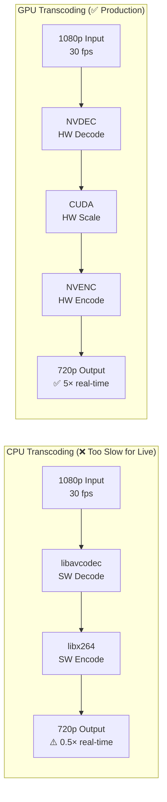
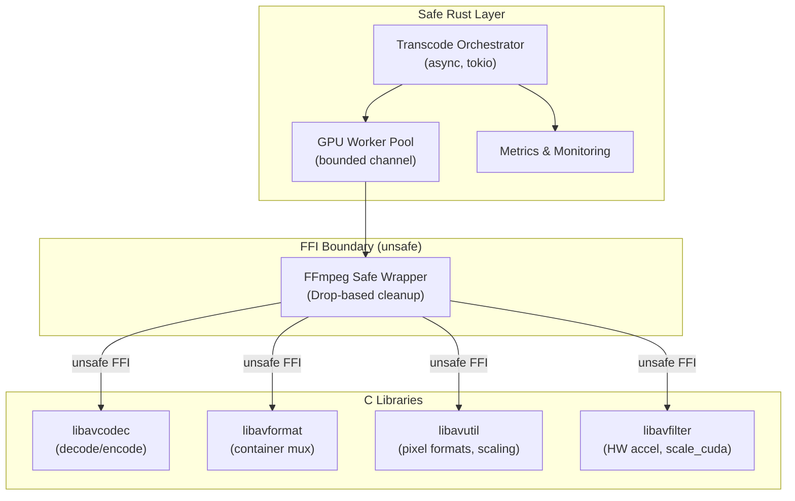
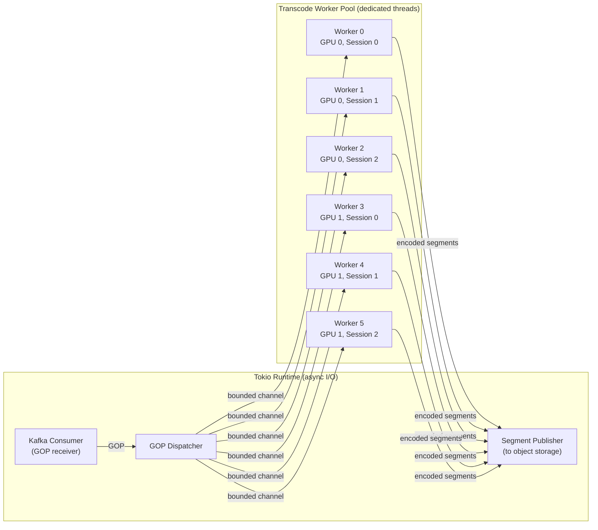
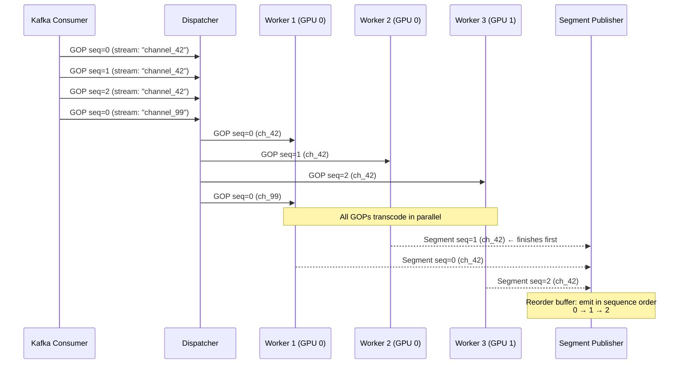
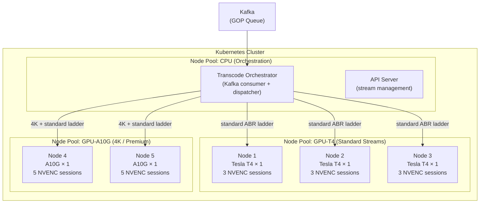

# 2. The Rust Transcoding Pipeline 🟡

> **The Problem:** You have a 1080p60 H.264 stream arriving from the ingest gateway at 8 Mbps. Your viewers are on everything from 4K smart TVs on gigabit fiber to budget Android phones on congested 4G. Serving the original stream to everyone means the phone user rebuffers every 3 seconds while the 4K TV user sees unnecessarily low quality. You need to transcode the single ingest stream into a **multi-bitrate adaptive ladder** — 1080p, 720p, 480p, 360p — simultaneously, in real time, on GPU-accelerated workers. And you need to do it in Rust.

---

## 2.1 Why Transcoding Is the Bottleneck

Transcoding is the most computationally expensive step in the entire streaming pipeline. To understand why, consider what the transcoder must do for a single second of 1080p30 video:

| Operation | Per-Frame Cost | Per-Second Cost (30fps) |
|---|---|---|
| Decode H.264 → raw YUV420 | ~2 ms (hardware) | ~60 ms |
| Scale 1920×1080 → 1280×720 | ~0.5 ms | ~15 ms |
| Encode YUV420 → H.264 @720p | ~5 ms (hardware) | ~150 ms |
| **Total per rendition** | | **~225 ms** |
| **4 renditions simultaneously** | | **~900 ms** |

For **live** video, you must transcode faster than real time. If processing one second of video takes more than one second, you fall behind and latency grows unbounded. The target is **≤ 0.5× real-time** (2× faster than real-time) to leave headroom for GOP queue spikes.

### Software vs Hardware Encoding

| Approach | Encoder | Speed (1080p30) | Quality (SSIM) | GPU Required | Cost per stream |
|---|---|---|---|---|---|
| Software (CPU) | `libx264` | 0.3–0.8× real-time | Excellent (0.97+) | No | High (8+ cores) |
| Hardware (NVIDIA) | NVENC | 3–8× real-time | Good (0.94–0.96) | Yes (T4/A10G) | Low (1 GPU session) |
| Hardware (Intel) | VA-API/QSV | 2–5× real-time | Good (0.93–0.95) | No (iGPU) | Very low |

For live streaming at scale, **hardware encoding on NVIDIA NVENC is the production standard**. The quality tradeoff (SSIM 0.94 vs 0.97) is imperceptible to viewers, and the speed advantage is 5–10×.



---

## 2.2 The Adaptive Bitrate Ladder

An **ABR ladder** defines the set of quality renditions we produce. Each rung specifies resolution, frame rate, bitrate, and codec profile:

| Rung | Resolution | FPS | Bitrate | H.264 Profile | Target Audience |
|---|---|---|---|---|---|
| **1080p** | 1920×1080 | 30 | 4,500 kbps | High | Fiber / WiFi 5GHz |
| **720p** | 1280×720 | 30 | 2,500 kbps | High | WiFi / Good 4G |
| **480p** | 854×480 | 30 | 1,200 kbps | Main | 4G / Congested WiFi |
| **360p** | 640×360 | 30 | 600 kbps | Baseline | 3G / Very poor connections |

**Critical constraint: Keyframe alignment.** Every rendition must have keyframes at the **exact same PTS (Presentation Timestamp)**. If 1080p has a keyframe at second 4.0 but 720p has one at 4.033, the player cannot switch between renditions without a visible glitch.

```
// 💥 ALIGNMENT HAZARD: Independent keyframe placement per rendition

// If each encoder decides its own keyframe placement:
//   1080p: keyframes at 0.0s, 2.0s, 4.0s, 6.0s
//   720p:  keyframes at 0.0s, 2.1s, 4.2s, 6.3s  ← DRIFTED!
//   480p:  keyframes at 0.0s, 1.8s, 3.6s, 5.4s  ← DIFFERENT INTERVAL!
//
// When the player switches from 1080p to 480p at second 4.0:
//   - 1080p segment ends cleanly at 4.0 (aligned keyframe)
//   - 480p segment starts at 3.6 — the player must either:
//     a) Decode 0.4s of video it won't display (wasted bandwidth)
//     b) Show a black frame or freeze (bad UX)
//
// SOLUTION: Force all renditions to place keyframes at the SAME timestamps
// by feeding them the SAME GOP structure from the ingest layer.
```

---

## 2.3 FFmpeg FFI: Binding Rust to libavcodec

FFmpeg is the de facto standard for video processing. Rather than rewriting decades of codec work, we use Rust's FFI to bind to FFmpeg's C libraries. This gives us access to hardware-accelerated decode/encode while keeping the orchestration logic in safe Rust.

### Architecture: Safe Wrapper Around Unsafe FFI



### The Naive FFI Approach

```rust,editable
// 💥 MEMORY HAZARD: Raw FFI without RAII wrappers
// FFmpeg's C API requires manual allocation and deallocation.
// Missing a single av_frame_free() leaks GPU memory.
// Missing av_packet_unref() leaks packet buffers.
// Forgetting avcodec_free_context() leaks the entire codec state.

use std::ptr;

// These would be actual FFI bindings — simplified for illustration
extern "C" {
    fn avcodec_alloc_context3(codec: *const ()) -> *mut AvCodecContext;
    fn avcodec_free_context(ctx: *mut *mut AvCodecContext);
    fn av_frame_alloc() -> *mut AvFrame;
    fn av_frame_free(frame: *mut *mut AvFrame);
}

#[repr(C)]
struct AvCodecContext { _private: [u8; 0] }

#[repr(C)]
struct AvFrame { _private: [u8; 0] }

unsafe fn naive_transcode(input_data: &[u8]) {
    let ctx = avcodec_alloc_context3(ptr::null());
    let frame = av_frame_alloc();

    // 💥 Problem 1: If decode_frame() panics, ctx and frame are LEAKED
    // 💥 Problem 2: No error checking on null returns
    // 💥 Problem 3: If we add early returns, we must remember to free BOTH

    // ... do work ...

    // 💥 Problem 4: Easy to forget one of these in a complex function
    av_frame_free(&mut (frame as *mut _));
    avcodec_free_context(&mut (ctx as *mut _));
}
```

### The Production FFI Wrapper

```rust,editable
// ✅ FIX: RAII wrappers that guarantee cleanup via Drop

use std::ptr::{self, NonNull};

// Safe wrapper around AVCodecContext with automatic cleanup
struct CodecContext {
    ptr: NonNull<AvCodecContextOpaque>,
}

// Opaque type representing the C struct
#[repr(C)]
struct AvCodecContextOpaque {
    _private: [u8; 0],
}

#[repr(C)]
struct AvFrameOpaque {
    _private: [u8; 0],
}

// FFI declarations (would come from bindgen in production)
extern "C" {
    fn avcodec_alloc_context3(codec: *const ()) -> *mut AvCodecContextOpaque;
    fn avcodec_free_context(ctx: *mut *mut AvCodecContextOpaque);
    fn av_frame_alloc() -> *mut AvFrameOpaque;
    fn av_frame_free(frame: *mut *mut AvFrameOpaque);
}

impl CodecContext {
    /// Allocate a new codec context. Returns None if allocation fails.
    fn new() -> Option<Self> {
        // SAFETY: avcodec_alloc_context3(null) allocates a generic context.
        // We check for null return.
        let ptr = unsafe { avcodec_alloc_context3(ptr::null()) };
        NonNull::new(ptr).map(|ptr| CodecContext { ptr })
    }

    fn as_ptr(&self) -> *mut AvCodecContextOpaque {
        self.ptr.as_ptr()
    }
}

impl Drop for CodecContext {
    fn drop(&mut self) {
        // ✅ GUARANTEED cleanup — even if the calling code panics
        // SAFETY: self.ptr was allocated by avcodec_alloc_context3
        // and has not been freed (we own it).
        unsafe {
            let mut ptr = self.ptr.as_ptr();
            avcodec_free_context(&mut ptr);
        }
    }
}

// ✅ CodecContext is NOT Send/Sync — FFmpeg contexts are not thread-safe.
// This prevents accidental sharing across tokio tasks.
impl !Send for CodecContext {}
impl !Sync for CodecContext {}

/// Safe wrapper around AVFrame
struct Frame {
    ptr: NonNull<AvFrameOpaque>,
}

impl Frame {
    fn new() -> Option<Self> {
        let ptr = unsafe { av_frame_alloc() };
        NonNull::new(ptr).map(|ptr| Frame { ptr })
    }
}

impl Drop for Frame {
    fn drop(&mut self) {
        unsafe {
            let mut ptr = self.ptr.as_ptr();
            av_frame_free(&mut ptr);
        }
    }
}
```

---

## 2.4 The GPU Worker Pool

Transcoding is CPU/GPU-bound, not I/O-bound. Tokio's async runtime is designed for I/O-bound work — running FFmpeg encode loops on the tokio thread pool would starve all other async tasks. We need a **dedicated worker pool** for transcoding.

### Architecture



### Implementation

```rust,editable
// ✅ Production GPU worker pool with bounded channels and backpressure

use std::sync::Arc;
use tokio::sync::mpsc;

/// A single rendition's encoding parameters
#[derive(Debug, Clone)]
struct RenditionConfig {
    name: String,          // e.g., "720p"
    width: u32,
    height: u32,
    bitrate_kbps: u32,
    profile: H264Profile,
    /// Force keyframe every N frames — must be identical
    /// across all renditions for ABR alignment
    keyframe_interval: u32,
}

#[derive(Debug, Clone)]
enum H264Profile {
    Baseline,
    Main,
    High,
}

/// The full ABR ladder to produce
#[derive(Debug, Clone)]
struct TranscodeLadder {
    renditions: Vec<RenditionConfig>,
}

impl TranscodeLadder {
    fn production_ladder() -> Self {
        Self {
            renditions: vec![
                RenditionConfig {
                    name: "1080p".into(),
                    width: 1920, height: 1080,
                    bitrate_kbps: 4500,
                    profile: H264Profile::High,
                    keyframe_interval: 60, // 2s @ 30fps
                },
                RenditionConfig {
                    name: "720p".into(),
                    width: 1280, height: 720,
                    bitrate_kbps: 2500,
                    profile: H264Profile::High,
                    keyframe_interval: 60,
                },
                RenditionConfig {
                    name: "480p".into(),
                    width: 854, height: 480,
                    bitrate_kbps: 1200,
                    profile: H264Profile::Main,
                    keyframe_interval: 60,
                },
                RenditionConfig {
                    name: "360p".into(),
                    width: 640, height: 360,
                    bitrate_kbps: 600,
                    profile: H264Profile::Baseline,
                    keyframe_interval: 60,
                },
            ],
        }
    }
}

/// A transcoded segment ready for packaging
#[derive(Debug)]
struct TranscodedSegment {
    stream_key: String,
    rendition: String,
    gop_sequence: u64,
    /// H.264 encoded data for this segment
    data: Vec<u8>,
    /// Duration of this segment
    duration_ms: u64,
    /// PTS of the first frame
    start_pts: u64,
    /// True if this segment starts with a keyframe (should always be true)
    starts_with_keyframe: bool,
}

/// Manages a pool of dedicated transcode worker threads.
struct TranscodePool {
    /// One sender per worker — dispatcher round-robins across them
    workers: Vec<mpsc::Sender<TranscodeJob>>,
    /// Receive completed segments from all workers
    result_rx: mpsc::Receiver<TranscodedSegment>,
}

struct TranscodeJob {
    gop: Gop,
    ladder: Arc<TranscodeLadder>,
}

// Simplified Gop struct matching Chapter 1
#[derive(Debug, Clone)]
struct Gop {
    stream_key: String,
    sequence: u64,
    frame_data: Vec<u8>,
    duration_ms: u64,
    start_pts: u64,
}

impl TranscodePool {
    fn new(num_workers: usize) -> Self {
        let (result_tx, result_rx) = mpsc::channel(num_workers * 4);
        let mut workers = Vec::with_capacity(num_workers);

        for worker_id in 0..num_workers {
            // ✅ Bounded channel provides backpressure:
            // If a worker is slow, the dispatcher blocks instead of
            // buffering unbounded GOPs in memory.
            let (job_tx, mut job_rx) = mpsc::channel::<TranscodeJob>(2);
            let result_tx = result_tx.clone();

            // ✅ Dedicated OS thread — NOT a tokio task.
            // FFmpeg encode loops are CPU-bound and would starve
            // the tokio runtime if run as async tasks.
            std::thread::Builder::new()
                .name(format!("transcode-worker-{worker_id}"))
                .spawn(move || {
                    // Pin this thread to a specific GPU if multiple GPUs
                    // are available (via CUDA device ordinal)
                    let gpu_id = worker_id / 3; // 3 workers per GPU
                    set_cuda_device(gpu_id);

                    // Block on the async channel from a sync thread
                    let rt = tokio::runtime::Builder::new_current_thread()
                        .enable_all()
                        .build()
                        .expect("worker runtime");

                    rt.block_on(async {
                        while let Some(job) = job_rx.recv().await {
                            // ✅ Transcode one GOP into all renditions
                            let segments = transcode_gop(
                                &job.gop,
                                &job.ladder,
                                worker_id,
                            );

                            for segment in segments {
                                if result_tx.send(segment).await.is_err() {
                                    return; // Pool is shutting down
                                }
                            }
                        }
                    });
                })
                .expect("spawn worker thread");

            workers.push(job_tx);
        }

        TranscodePool { workers, result_rx }
    }

    /// Dispatch a GOP to the least-loaded worker.
    async fn submit(&self, gop: Gop, ladder: Arc<TranscodeLadder>) {
        // ✅ Round-robin with backpressure — if all workers are busy,
        // this await blocks until one frees up.
        let worker_idx = gop.sequence as usize % self.workers.len();
        let job = TranscodeJob { gop, ladder };

        // If the worker channel is full, this blocks — providing
        // natural backpressure to the Kafka consumer.
        self.workers[worker_idx]
            .send(job)
            .await
            .expect("worker channel closed unexpectedly");
    }
}

fn set_cuda_device(_gpu_id: usize) {
    // In production: calls cuCtxSetCurrent() via CUDA FFI
}

/// Transcode a single GOP into all renditions in the ladder.
/// Each rendition is produced sequentially on the same GPU.
fn transcode_gop(
    gop: &Gop,
    ladder: &TranscodeLadder,
    _worker_id: usize,
) -> Vec<TranscodedSegment> {
    let mut segments = Vec::with_capacity(ladder.renditions.len());

    // In production, this would:
    // 1. Decode the GOP frames using NVDEC (hardware decode)
    // 2. For each rendition:
    //    a. Scale using scale_cuda filter
    //    b. Encode using NVENC with rendition-specific parameters
    //    c. Collect encoded packets into a segment

    for rendition in &ladder.renditions {
        let segment = TranscodedSegment {
            stream_key: gop.stream_key.clone(),
            rendition: rendition.name.clone(),
            gop_sequence: gop.sequence,
            data: encode_rendition(gop, rendition),
            duration_ms: gop.duration_ms,
            start_pts: gop.start_pts,
            starts_with_keyframe: true, // ✅ Always true — each segment = 1 GOP
        };
        segments.push(segment);
    }

    segments
}

fn encode_rendition(gop: &Gop, config: &RenditionConfig) -> Vec<u8> {
    // In production: FFmpeg FFI call chain
    // avcodec_send_packet → avcodec_receive_frame (decode)
    // scale_cuda filter (resize)
    // avcodec_send_frame → avcodec_receive_packet (encode)
    Vec::new() // Placeholder
}
```

---

## 2.5 GOP-Level Parallelism

The key insight for scaling transcoding is that **GOPs are independent**. Because each GOP starts with a keyframe that can be decoded without any prior state, we can transcode GOPs from the same stream in parallel across multiple workers — as long as we reassemble them in order afterward.



### The Reorder Buffer

Since GOPs may complete out of order (GOP 2 might finish before GOP 1 if it had fewer B-frames), we need a reorder buffer before publishing:

```rust,editable
use std::collections::BTreeMap;

/// Reorders out-of-sequence segments back into GOP order
/// before publishing to object storage.
struct ReorderBuffer {
    /// Per-stream, per-rendition: next expected sequence number
    /// and buffered out-of-order segments.
    streams: std::collections::HashMap<StreamRenditionKey, RenditionBuffer>,
}

#[derive(Debug, Clone, Hash, PartialEq, Eq)]
struct StreamRenditionKey {
    stream_key: String,
    rendition: String,
}

struct RenditionBuffer {
    next_expected: u64,
    buffered: BTreeMap<u64, TranscodedSegment>,
    /// Maximum segments to buffer before declaring a gap and skipping
    max_buffer_size: usize,
}

impl RenditionBuffer {
    fn new() -> Self {
        Self {
            next_expected: 0,
            buffered: BTreeMap::new(),
            max_buffer_size: 30, // ~60 seconds at 2s GOPs
        }
    }

    /// Insert a segment. Returns all segments that can now be
    /// emitted in order.
    fn insert(&mut self, segment: TranscodedSegment) -> Vec<TranscodedSegment> {
        let seq = segment.gop_sequence;
        self.buffered.insert(seq, segment);

        let mut ready = Vec::new();

        // ✅ Emit all consecutive segments starting from next_expected
        while let Some(seg) = self.buffered.remove(&self.next_expected) {
            self.next_expected += 1;
            ready.push(seg);
        }

        // ✅ If the buffer grows too large, we have a stuck worker.
        // Skip ahead to avoid unbounded memory growth.
        if self.buffered.len() > self.max_buffer_size {
            if let Some(&min_seq) = self.buffered.keys().next() {
                eprintln!(
                    "ReorderBuffer: skipping gap from {} to {}",
                    self.next_expected, min_seq
                );
                self.next_expected = min_seq;
                // Retry emission from the new starting point
                while let Some(seg) = self.buffered.remove(&self.next_expected) {
                    self.next_expected += 1;
                    ready.push(seg);
                }
            }
        }

        ready
    }
}
```

---

## 2.6 Encoding Parameters That Matter

The difference between a "works in the lab" encoder and a production encoder is in the parameter tuning. These settings directly affect viewer experience:

### Rate Control: CBR vs VBR vs CRF

| Mode | Description | Live Streaming? | CDN Friendly? |
|---|---|---|---|
| **CBR** (Constant Bitrate) | Every second uses exactly N kbps | ✅ Yes | ✅ Predictable bandwidth |
| **VBR** (Variable Bitrate) | Bitrate fluctuates with scene complexity | ⚠️ Risky | ❌ Bandwidth spikes |
| **CRF** (Constant Rate Factor) | Target perceptual quality, bitrate varies | ❌ No (unbounded) | ❌ Unpredictable |
| **Capped VBR** | VBR with a hard maximum bitrate | ✅ Best choice | ✅ Per-segment predictability |

**Production choice: Capped VBR.** It gives better quality than CBR on complex scenes (sports, action) while keeping the bitrate within the CDN's capacity planning model.

```rust,editable
// ✅ Production NVENC encoding parameters

/// Generate FFmpeg CLI-equivalent parameters for NVENC encoding.
/// In production, these would be set via avcodec_context fields through FFI.
struct NvencParams {
    /// Target average bitrate
    bitrate_kbps: u32,
    /// Maximum instantaneous bitrate (for capped VBR)
    max_bitrate_kbps: u32,
    /// VBV buffer size — controls how much bitrate can fluctuate
    /// Rule of thumb: 1.5–2× the target bitrate
    vbv_buffer_kbps: u32,
    /// GOP size in frames (must match across all renditions)
    gop_size: u32,
    /// Number of B-frames between I/P frames
    b_frames: u32,
    /// Reference frames for motion prediction
    ref_frames: u32,
    /// NVENC preset: trades speed for quality
    preset: NvencPreset,
    /// H.264 profile
    profile: H264Profile,
    /// Lookahead frames for better rate control decisions
    rc_lookahead: u32,
}

#[derive(Debug, Clone)]
enum NvencPreset {
    /// Fastest — lowest quality. Use for ≥8 simultaneous encodes per GPU.
    P1,
    /// Balanced — good for live streaming.
    P4,
    /// Highest quality — use for VOD or premium live.
    P7,
}

impl NvencParams {
    fn for_rendition(config: &RenditionConfig) -> Self {
        let max_bitrate = (config.bitrate_kbps as f64 * 1.5) as u32;
        let vbv_buffer = config.bitrate_kbps * 2;

        Self {
            bitrate_kbps: config.bitrate_kbps,
            max_bitrate_kbps: max_bitrate,
            vbv_buffer_kbps: vbv_buffer,
            gop_size: config.keyframe_interval,
            b_frames: 2,      // Standard for live
            ref_frames: 3,    // NVENC supports up to 4
            preset: NvencPreset::P4, // Balanced for live
            profile: config.profile.clone(),
            rc_lookahead: 8,  // 8 frames lookahead for rate control
        }
    }

    /// Convert to FFmpeg-style parameter map for logging/debugging
    fn to_param_map(&self) -> Vec<(&'static str, String)> {
        vec![
            ("b", format!("{}k", self.bitrate_kbps)),
            ("maxrate", format!("{}k", self.max_bitrate_kbps)),
            ("bufsize", format!("{}k", self.vbv_buffer_kbps)),
            ("g", self.gop_size.to_string()),
            ("bf", self.b_frames.to_string()),
            ("refs", self.ref_frames.to_string()),
            ("preset", format!("{:?}", self.preset)),
            ("rc-lookahead", self.rc_lookahead.to_string()),
        ]
    }
}
```

---

## 2.7 Kubernetes Deployment: GPU Node Pools

In production, the transcode workers run on GPU-enabled Kubernetes nodes. The deployment must handle:
- **Heterogeneous GPU types** (T4 for standard streams, A10G for 4K)
- **NVENC session limits** (NVIDIA limits concurrent encode sessions per GPU)
- **Autoscaling** based on ingest load



### NVENC Session Limits

This is a critical constraint that catches teams off-guard:

| GPU | Max NVENC Sessions | Sessions per ABR Stream (4 renditions) | Streams per GPU |
|---|---|---|---|
| Tesla T4 | 3 (driver-limited) | 4 (one per rendition) | **< 1** ⚠️ |
| A10G | 5 | 4 | **1** |
| A100 | Unlimited (data center) | 4 | **Many** |

**Wait — a T4 can't even encode one full ABR ladder?** Correct. With 4 renditions and only 3 sessions, you must either:

1. **Serialize renditions**: Encode 1080p, then 720p, then 480p, then 360p sequentially on the same session. This is 4× slower.
2. **Spread across GPUs**: Route lower renditions to separate T4s. Complex scheduling.
3. **Use A10G/A100**: Pay more per GPU but simplify the architecture.

**Production recommendation:** Use A10G nodes. The cost difference vs T4 is marginal at scale, and the simplified scheduling saves engineering time.

---

## 2.8 Error Handling and Recovery

Transcoding failures are inevitable — corrupt input, GPU driver crashes, OOM on the encoding buffer. The system must handle them gracefully:

```rust,editable
// ✅ Transient failure handling with retry and dead-letter queue

#[derive(Debug)]
enum TranscodeError {
    /// Corrupt input data — retrying won't help
    CorruptInput { gop_sequence: u64, reason: String },
    /// GPU driver error — might recover after device reset
    GpuError { device_id: usize, reason: String },
    /// Out of memory — reduce batch size or wait
    OutOfMemory { device_id: usize },
    /// Encoder produced no output — likely a parameter misconfiguration
    NoOutput { rendition: String },
}

impl TranscodeError {
    /// Should we retry this error on the same worker?
    fn is_retryable(&self) -> bool {
        match self {
            TranscodeError::CorruptInput { .. } => false,
            TranscodeError::GpuError { .. } => true,
            TranscodeError::OutOfMemory { .. } => true,
            TranscodeError::NoOutput { .. } => false,
        }
    }

    /// Maximum retries for retryable errors
    fn max_retries(&self) -> u32 {
        match self {
            TranscodeError::GpuError { .. } => 2,
            TranscodeError::OutOfMemory { .. } => 1,
            _ => 0,
        }
    }
}

/// Handle a transcode failure with retry logic
async fn handle_transcode_failure(
    error: TranscodeError,
    job: &TranscodeJob,
    attempt: u32,
) -> FailureAction {
    metrics::counter!("transcode_errors_total",
        "type" => format!("{:?}", std::mem::discriminant(&error)),
        "rendition" => job.ladder.renditions
            .first()
            .map(|r| r.name.as_str())
            .unwrap_or("unknown")
            .to_string(),
    )
    .increment(1);

    if error.is_retryable() && attempt < error.max_retries() {
        // ✅ Exponential backoff for transient errors
        let delay = std::time::Duration::from_millis(100 * 2u64.pow(attempt));
        tokio::time::sleep(delay).await;
        FailureAction::Retry
    } else {
        // ✅ Dead-letter queue for non-retryable failures
        // Operations team investigates these
        FailureAction::DeadLetter {
            reason: format!("{error:?}"),
        }
    }
}

enum FailureAction {
    Retry,
    DeadLetter { reason: String },
}
```

---

> **Key Takeaways**
>
> 1. **Use hardware encoding (NVENC) for live streaming.** Software encoding with `libx264` produces better quality but is 5–10× slower — unacceptable for real-time pipelines that must run at ≤ 0.5× real-time.
> 2. **Keyframe alignment across all renditions is non-negotiable.** If the 1080p and 720p streams have keyframes at different timestamps, the player cannot switch between them without a visible glitch. Force all renditions to use the same GOP structure from the ingest layer.
> 3. **GOPs are the unit of parallelism.** Each GOP can be transcoded independently, enabling horizontal scaling across GPU workers. Use a reorder buffer to reassemble out-of-order completions.
> 4. **Run transcoding on dedicated OS threads, not tokio tasks.** FFmpeg encode loops are CPU/GPU-bound and will starve the async runtime. Use bounded channels between the tokio orchestrator and the worker threads for backpressure.
> 5. **Wrap every FFI object in RAII.** FFmpeg's C API requires manual deallocation. Missing a single `av_frame_free()` leaks GPU memory. Rust's `Drop` trait guarantees cleanup even on panic.
> 6. **Be aware of NVENC session limits.** A Tesla T4 only supports 3 concurrent encode sessions — not enough for a 4-rendition ABR ladder. Use A10G or A100 GPUs to avoid complex scheduling workarounds.
