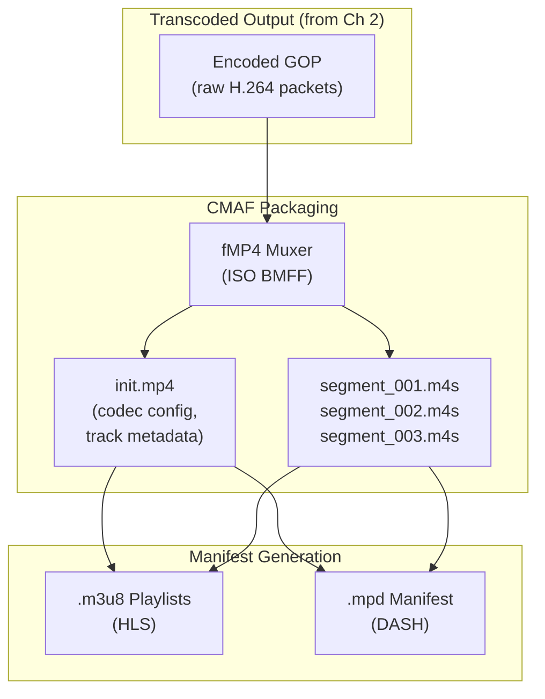
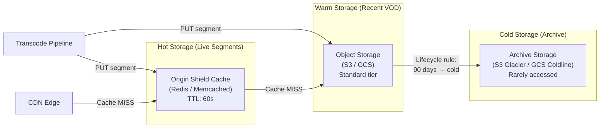
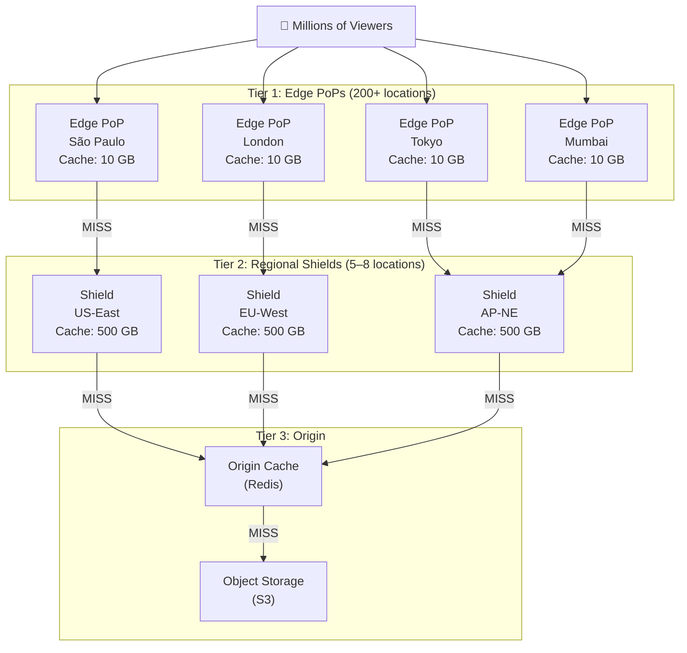
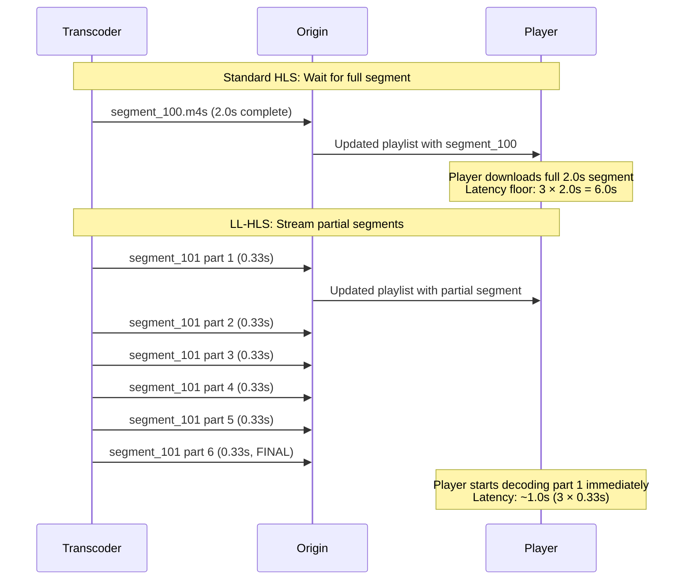

# 3. HLS, DASH, and Edge Caching 🟡

> **The Problem:** Your transcoding pipeline produces four renditions of every GOP — but the viewer's player speaks HTTP, not "raw encoded segments over Kafka." You need to package the transcoded output into a standard adaptive streaming format (HLS or DASH), push the segments to durable storage, and serve them through a CDN edge layer that achieves **99%+ cache hit rates**. For live video, every segment exists for only ~30 seconds before it's irrelevant — making cache efficiency far harder than static content.

---

## 3.1 HLS vs DASH: Protocol Comparison

The two dominant adaptive streaming protocols are **HLS (HTTP Live Streaming)** by Apple and **DASH (Dynamic Adaptive Streaming over HTTP)** by MPEG. Both work on the same principle: split video into small HTTP-downloadable segments and describe the available renditions in a manifest file.

| Feature | HLS | DASH |
|---|---|---|
| Manifest format | `.m3u8` (M3U playlist) | `.mpd` (XML) |
| Segment format | `.ts` (MPEG-TS) or `.m4s` (fMP4) | `.m4s` (fMP4) |
| DRM support | FairPlay (native), Widevine (via fMP4) | Widevine, PlayReady |
| Browser support | Safari (native), others via MSE | Chrome, Edge, Firefox via MSE |
| iOS support | ✅ Native | ❌ No native support |
| Low-latency mode | LL-HLS (partial segments) | LL-DASH (chunked transfer) |
| Segment duration | Typically 2–6 seconds | Typically 2–6 seconds |

### The Convergence: CMAF

**Common Media Application Format (CMAF)** unifies both protocols. CMAF uses **fMP4 segments** (`.m4s`) that are compatible with *both* HLS and DASH manifests. This means you generate segments **once** and serve them with two different manifest formats:



**Production decision: Use CMAF with fMP4 segments.** Generate both HLS and DASH manifests pointing to the same segment files. This halves your storage and CDN costs.

---

## 3.2 HLS Manifest Structure

An HLS stream consists of two levels of playlists:

### Master Playlist (Multi-bitrate index)

The master playlist lists all available renditions and their properties. The player reads this first and chooses a starting rendition:

```
#EXTM3U
#EXT-X-VERSION:7

## 1080p @ 4500 kbps
#EXT-X-STREAM-INF:BANDWIDTH=4500000,RESOLUTION=1920x1080,CODECS="avc1.640028",FRAME-RATE=30.0
1080p/playlist.m3u8

## 720p @ 2500 kbps
#EXT-X-STREAM-INF:BANDWIDTH=2500000,RESOLUTION=1280x720,CODECS="avc1.640020",FRAME-RATE=30.0
720p/playlist.m3u8

## 480p @ 1200 kbps
#EXT-X-STREAM-INF:BANDWIDTH=1200000,RESOLUTION=854x480,CODECS="avc1.4d401f",FRAME-RATE=30.0
480p/playlist.m3u8

## 360p @ 600 kbps
#EXT-X-STREAM-INF:BANDWIDTH=600000,RESOLUTION=640x360,CODECS="avc1.42c01e",FRAME-RATE=30.0
360p/playlist.m3u8
```

### Media Playlist (Per-rendition segment list)

Each rendition has its own media playlist that lists the individual segments. For **live** streams, this is a sliding window:

```
#EXTM3U
#EXT-X-VERSION:7
#EXT-X-TARGETDURATION:2
#EXT-X-MEDIA-SEQUENCE:1847
#EXT-X-MAP:URI="init.mp4"

#EXTINF:2.000,
segment_1847.m4s
#EXTINF:2.000,
segment_1848.m4s
#EXTINF:2.000,
segment_1849.m4s
#EXTINF:2.000,
segment_1850.m4s
#EXTINF:2.000,
segment_1851.m4s
```

**Key fields:**
- `EXT-X-MEDIA-SEQUENCE`: The sequence number of the first segment in the playlist. The player uses this to detect new segments.
- `EXT-X-TARGETDURATION`: Maximum segment duration. The player polls for new playlists at this interval.
- `EXT-X-MAP`: Points to the initialization segment containing codec configuration (SPS/PPS).

---

## 3.3 Manifest Generation in Rust

```rust,editable
// 💥 STALE MANIFEST HAZARD: Generating manifests from object storage listings
//
// Naive approach: List all .m4s files in S3, sort by name, generate playlist
//
// Problems:
// 1. S3 LIST is eventually consistent — you might miss the latest segment
// 2. S3 LIST has high latency (~200ms) under load
// 3. Manifest freshness depends on polling interval
// 4. No atomic update — player might read a half-written manifest

// ✅ FIX: Generate manifests from the transcoding pipeline's output stream,
// not from storage listings. The pipeline KNOWS what segments exist because
// it just created them.
```

```rust,editable
// ✅ Production HLS manifest generator driven by the transcoding pipeline

use std::collections::VecDeque;
use std::fmt::Write;

/// Represents a single HLS segment entry
#[derive(Debug, Clone)]
struct HlsSegment {
    /// Sequence number (monotonically increasing)
    sequence: u64,
    /// Filename of the .m4s segment
    filename: String,
    /// Duration in seconds
    duration_secs: f64,
    /// Byte size — used for bandwidth estimation
    size_bytes: usize,
}

/// State for a single rendition's media playlist
struct MediaPlaylist {
    rendition_name: String,
    /// Sliding window of segments (live streams keep only the last N)
    segments: VecDeque<HlsSegment>,
    /// How many segments to keep in the sliding window
    /// Apple recommends: 3× target duration minimum
    window_size: usize,
    /// Target segment duration (must match encoder GOP duration)
    target_duration_secs: u32,
    /// URI of the initialization segment
    init_segment_uri: String,
}

impl MediaPlaylist {
    fn new(rendition_name: &str, target_duration_secs: u32) -> Self {
        Self {
            rendition_name: rendition_name.to_string(),
            segments: VecDeque::with_capacity(10),
            window_size: 5, // 5 × 2s = 10s of live buffer
            target_duration_secs,
            init_segment_uri: format!("{rendition_name}/init.mp4"),
        }
    }

    /// Add a new segment from the transcoding pipeline.
    /// Returns the updated manifest string.
    fn push_segment(&mut self, segment: HlsSegment) -> String {
        self.segments.push_back(segment);

        // ✅ Sliding window: remove oldest segments to bound manifest size
        while self.segments.len() > self.window_size {
            self.segments.pop_front();
        }

        self.render()
    }

    /// Render the M3U8 playlist content
    fn render(&self) -> String {
        let media_sequence = self.segments.front()
            .map(|s| s.sequence)
            .unwrap_or(0);

        let mut out = String::with_capacity(1024);

        writeln!(out, "#EXTM3U").unwrap();
        writeln!(out, "#EXT-X-VERSION:7").unwrap();
        writeln!(out, "#EXT-X-TARGETDURATION:{}", self.target_duration_secs).unwrap();
        writeln!(out, "#EXT-X-MEDIA-SEQUENCE:{media_sequence}").unwrap();
        writeln!(out, "#EXT-X-MAP:URI=\"{}\"", self.init_segment_uri).unwrap();
        writeln!(out).unwrap();

        for seg in &self.segments {
            writeln!(out, "#EXTINF:{:.3},", seg.duration_secs).unwrap();
            writeln!(out, "{}", seg.filename).unwrap();
        }

        out
    }
}

/// Top-level manifest manager for an entire stream
struct StreamManifest {
    stream_key: String,
    /// One media playlist per rendition
    renditions: Vec<MediaPlaylist>,
}

impl StreamManifest {
    fn new(stream_key: &str, rendition_names: &[&str]) -> Self {
        Self {
            stream_key: stream_key.to_string(),
            renditions: rendition_names
                .iter()
                .map(|name| MediaPlaylist::new(name, 2))
                .collect(),
        }
    }

    /// Generate the HLS master playlist
    fn master_playlist(&self) -> String {
        let mut out = String::with_capacity(512);

        writeln!(out, "#EXTM3U").unwrap();
        writeln!(out, "#EXT-X-VERSION:7").unwrap();
        writeln!(out).unwrap();

        let rendition_configs = [
            ("1080p", 4_500_000, "1920x1080", "avc1.640028"),
            ("720p",  2_500_000, "1280x720",  "avc1.640020"),
            ("480p",  1_200_000, "854x480",   "avc1.4d401f"),
            ("360p",    600_000, "640x360",   "avc1.42c01e"),
        ];

        for (name, bw, res, codecs) in &rendition_configs {
            writeln!(
                out,
                "#EXT-X-STREAM-INF:BANDWIDTH={bw},RESOLUTION={res},\
                 CODECS=\"{codecs}\",FRAME-RATE=30.0"
            ).unwrap();
            writeln!(out, "{name}/playlist.m3u8").unwrap();
            writeln!(out).unwrap();
        }

        out
    }
}
```

---

## 3.4 Segment Storage Architecture

Transcoded segments must be durably stored and globally accessible. The storage layer has two tiers:



### Storage Path Convention

A consistent, hierarchical path scheme enables efficient CDN caching rules and simplified debugging:

```
/{stream_key}/{rendition}/{segment_type}/{filename}

Examples:
/channel_42/1080p/init/init.mp4
/channel_42/1080p/segments/segment_001847.m4s
/channel_42/1080p/manifests/playlist.m3u8
/channel_42/master.m3u8
```

```rust,editable
// ✅ Type-safe segment path generation

/// Generates storage paths for segments and manifests
struct StoragePath;

impl StoragePath {
    fn master_manifest(stream_key: &str) -> String {
        format!("{stream_key}/master.m3u8")
    }

    fn media_manifest(stream_key: &str, rendition: &str) -> String {
        format!("{stream_key}/{rendition}/playlist.m3u8")
    }

    fn init_segment(stream_key: &str, rendition: &str) -> String {
        format!("{stream_key}/{rendition}/init.mp4")
    }

    fn media_segment(
        stream_key: &str,
        rendition: &str,
        sequence: u64,
    ) -> String {
        format!("{stream_key}/{rendition}/segment_{sequence:06}.m4s")
    }
}

/// Upload a segment to both the origin cache and object storage
async fn publish_segment(
    stream_key: &str,
    rendition: &str,
    sequence: u64,
    data: &[u8],
    origin_cache: &OriginCache,
    object_store: &ObjectStore,
) -> Result<(), PublishError> {
    let path = StoragePath::media_segment(stream_key, rendition, sequence);

    // ✅ Write to origin cache first (lowest latency for CDN misses)
    // and object storage in parallel
    let (cache_result, storage_result) = tokio::join!(
        origin_cache.put(&path, data, Duration::from_secs(60)),
        object_store.put(&path, data),
    );

    // ✅ Origin cache failure is non-fatal — CDN will fall through to S3
    if let Err(e) = cache_result {
        tracing::warn!("Origin cache write failed for {path}: {e}");
    }

    // ✅ Object storage failure IS fatal — segment would be permanently lost
    storage_result?;

    Ok(())
}

// Placeholder types for the example
use std::time::Duration;
struct OriginCache;
impl OriginCache {
    async fn put(&self, _: &str, _: &[u8], _: Duration) -> Result<(), String> { Ok(()) }
}
struct ObjectStore;
impl ObjectStore {
    async fn put(&self, _: &str, _: &[u8]) -> Result<(), PublishError> { Ok(()) }
}
#[derive(Debug)]
enum PublishError { StorageError(String) }
```

---

## 3.5 CDN Edge Architecture

A CDN is not a magic box. Understanding its internal architecture is critical for achieving 99%+ cache hit rates on live video — a content type with unique access patterns that break most CDN default configurations.

### Why Live Video Breaks Default CDN Configs

| Property | Static Content (images, JS) | Live Video Segments |
|---|---|---|
| Lifetime | Days to forever | 2–60 seconds (live sliding window) |
| Access pattern | Power law (some files very popular) | **All viewers request the same segments simultaneously** |
| Cacheable | ✅ Long TTL | ⚠️ Short TTL, manifests change every 2s |
| Thundering herd | Rare | **Every manifest poll generates segment requests** |
| Cost of cache miss | ~100ms extra latency | Visible rebuffering for the viewer |

### Multi-Tier CDN Architecture



### Cache Hit Rate Math

For a live stream with **100,000 concurrent viewers** across 50 edge PoPs:

```
Viewers per PoP (avg):     100,000 / 50 = 2,000
Segment poll interval:     2 seconds
Segment requests per PoP:  2,000 / 2 = 1,000 req/s per rendition
Unique segments per poll:  1 (all viewers want the SAME latest segment)

Edge cache hit rate:
  First request:    MISS (1 request to shield)
  Remaining 999:    HIT  (served from edge cache)
  Hit rate:         999/1000 = 99.9%

Shield cache hit rate:
  50 PoPs each send 1 MISS = 50 requests to shield
  First request:    MISS (1 request to origin)
  Remaining 49:     HIT
  Hit rate:         49/50 = 98%

Overall origin load:
  1 request per segment per rendition per shield
  = 1 × 4 renditions × 3 shields = 12 requests per 2-second segment
  = 6 req/s to origin for 100,000 viewers
```

**This is why CDN works for live video:** Even though segments are ephemeral, **all viewers want the same segment at roughly the same time**. The thundering herd becomes an asset — the first request warms the cache for everyone else.

---

## 3.6 Cache-Control Headers

The manifest and segment files require different caching strategies:

```rust,editable
// ✅ Production cache-control header strategy

/// Returns appropriate Cache-Control headers for each content type
fn cache_control_header(content_type: ContentType, is_live: bool) -> String {
    match (content_type, is_live) {
        // Master playlist: Changes only if renditions are added/removed
        // Cache for the segment duration — players re-fetch periodically anyway
        (ContentType::MasterPlaylist, true) => {
            "public, max-age=2, s-maxage=2".to_string()
        }

        // Media playlist (live): Changes every segment duration
        // Short TTL + stale-while-revalidate for seamless updates
        (ContentType::MediaPlaylist, true) => {
            "public, max-age=1, s-maxage=1, stale-while-revalidate=2".to_string()
        }

        // Media playlist (VOD): Static — cache aggressively
        (ContentType::MediaPlaylist, false) => {
            "public, max-age=86400, s-maxage=86400".to_string()
        }

        // Init segment: Never changes for a given stream
        (ContentType::InitSegment, _) => {
            "public, max-age=86400, s-maxage=86400, immutable".to_string()
        }

        // Media segments: Immutable once created — cache forever
        // The URL includes the sequence number, so each segment is unique
        (ContentType::MediaSegment, _) => {
            "public, max-age=86400, s-maxage=86400, immutable".to_string()
        }
    }
}

#[derive(Debug, Clone, Copy)]
enum ContentType {
    MasterPlaylist,
    MediaPlaylist,
    InitSegment,
    MediaSegment,
}
```

**Critical insight:** Media segments are **content-addressed** (the sequence number is in the URL). Once `segment_001847.m4s` exists, its content never changes. This means segments can have `immutable` cache headers — the CDN will never need to revalidate them. Only the **playlist** needs short TTLs because it's a mutable pointer to the latest segments.

---

## 3.7 Thundering Herd Protection: Request Coalescing

When a popular live segment hasn't reached the edge cache yet, **thousands of viewer requests arrive simultaneously**. Without protection, all of them become cache misses that hammer the origin:

```
// 💥 THUNDERING HERD: 10,000 simultaneous cache misses

// Timeline:
// T+0.000s: Segment 1848 published to origin
// T+0.100s: Manifest updated to include segment 1848
// T+0.200s: 10,000 players simultaneously request segment 1848
//           Edge cache: MISS (segment not cached yet)
//           All 10,000 requests forwarded to shield
//           Shield cache: MISS (segment not cached yet)
//           All 10,000 requests forwarded to origin
//           Origin receives 10,000 × 4 renditions = 40,000 requests
//           in a 100ms window → origin overload → 503 errors
//
// SOLUTION: Request coalescing (also called "request collapsing")
```

```rust,editable
// ✅ FIX: Request coalescing at the edge/shield layer

use std::collections::HashMap;
use std::sync::Arc;
use tokio::sync::{Mutex, broadcast};

/// Coalesces concurrent requests for the same segment into a single
/// origin fetch. All waiters receive the same response.
struct RequestCoalescer {
    /// In-flight fetches: segment path → broadcast sender
    in_flight: Arc<Mutex<HashMap<String, broadcast::Sender<Arc<CachedSegment>>>>>,
}

#[derive(Debug, Clone)]
struct CachedSegment {
    data: Vec<u8>,
    content_type: String,
    cache_control: String,
}

impl RequestCoalescer {
    fn new() -> Self {
        Self {
            in_flight: Arc::new(Mutex::new(HashMap::new())),
        }
    }

    /// Get a segment, coalescing concurrent requests.
    /// Only the first request for a given path triggers an origin fetch.
    /// All subsequent requests wait for the same result.
    async fn get_or_fetch(
        &self,
        path: &str,
        fetch_from_origin: impl AsyncFn(&str) -> Result<CachedSegment, FetchError>,
    ) -> Result<Arc<CachedSegment>, FetchError> {
        // Check if there's already an in-flight fetch for this path
        let mut in_flight = self.in_flight.lock().await;

        if let Some(sender) = in_flight.get(path) {
            // ✅ Someone else is already fetching this segment.
            // Subscribe to the broadcast and wait for the result.
            let mut rx = sender.subscribe();
            drop(in_flight); // Release the lock while waiting

            return rx.recv().await
                .map_err(|_| FetchError::CoalescedRequestFailed);
        }

        // ✅ We are the first requester. Create a broadcast channel
        // and register ourselves as the fetcher.
        let (tx, _) = broadcast::channel(1);
        in_flight.insert(path.to_string(), tx.clone());
        drop(in_flight); // Release the lock while fetching

        // Perform the actual origin fetch
        let result = fetch_from_origin(path).await;

        // Clean up the in-flight entry
        self.in_flight.lock().await.remove(path);

        match result {
            Ok(segment) => {
                let segment = Arc::new(segment);
                // ✅ Broadcast result to all waiters (if none, that's fine)
                let _ = tx.send(segment.clone());
                Ok(segment)
            }
            Err(e) => Err(e),
        }
    }
}

#[derive(Debug)]
enum FetchError {
    OriginError(String),
    CoalescedRequestFailed,
}

trait AsyncFn<A>: Fn(A) -> Self::Fut {
    type Fut: std::future::Future<Output = Self::Out>;
    type Out;
}
impl<A, F, Fut, O> AsyncFn<A> for F
where F: Fn(A) -> Fut, Fut: std::future::Future<Output = O> {
    type Fut = Fut;
    type Out = O;
}
```

---

## 3.8 Low-Latency HLS (LL-HLS)

Standard HLS has a structural latency floor of **3 × segment duration**. With 2-second segments, that's **6 seconds minimum** from encode to display. LL-HLS reduces this by introducing **partial segments**:



LL-HLS extends the media playlist with `EXT-X-PART` tags:

```
#EXTM3U
#EXT-X-VERSION:9
#EXT-X-TARGETDURATION:2
#EXT-X-PART-INF:PART-TARGET=0.33334
#EXT-X-SERVER-CONTROL:CAN-BLOCK-RELOAD=YES,PART-HOLD-BACK=1.0
#EXT-X-MEDIA-SEQUENCE:1847
#EXT-X-MAP:URI="init.mp4"

#EXTINF:2.000,
segment_1847.m4s
#EXTINF:2.000,
segment_1848.m4s
#EXT-X-PART:DURATION=0.33334,URI="segment_1849_part0.m4s"
#EXT-X-PART:DURATION=0.33334,URI="segment_1849_part1.m4s"
#EXT-X-PART:DURATION=0.33334,URI="segment_1849_part2.m4s"
#EXT-X-PRELOAD-HINT:TYPE=PART,URI="segment_1849_part3.m4s"
```

**Key LL-HLS capabilities:**
- `CAN-BLOCK-RELOAD=YES`: The server holds the playlist response until a new partial segment is available (long-polling), avoiding wasteful polling.
- `PART-HOLD-BACK`: Minimum buffer of partial segments before playback starts.
- `EXT-X-PRELOAD-HINT`: Tells the player which partial segment will arrive next, enabling preemptive connection setup.

---

## 3.9 Monitoring the Distribution Layer

| Metric | Type | Alert Threshold |
|---|---|---|
| `cdn_cache_hit_rate` | Gauge {tier=edge/shield} | Edge < 98%, Shield < 90% |
| `cdn_origin_request_rate` | Counter | > 100 req/s per stream (coalescing broken) |
| `manifest_update_latency_ms` | Histogram | p99 > 500ms |
| `segment_publish_latency_ms` | Histogram | p99 > 1000ms |
| `segment_ttfb_ms` | Histogram {tier=edge} | p99 > 200ms |
| `manifest_stale_errors` | Counter | > 0 (player got outdated manifest) |
| `storage_put_errors` | Counter | > 0 (segment not persisted) |

```rust,editable
// ✅ Segment publication pipeline with end-to-end latency tracking

use std::time::Instant;

async fn publish_and_update_manifest(
    segment: TranscodedSegment,
    manifest: &mut StreamManifest,
    origin_cache: &OriginCache,
    object_store: &ObjectStore,
) {
    let start = Instant::now();

    // 1. Upload segment to storage
    let path = StoragePath::media_segment(
        &segment.stream_key,
        &segment.rendition,
        segment.gop_sequence,
    );

    let upload_start = Instant::now();
    publish_segment(
        &segment.stream_key,
        &segment.rendition,
        segment.gop_sequence,
        &segment.data,
        origin_cache,
        object_store,
    )
    .await
    .expect("segment upload failed");

    metrics::histogram!("segment_upload_latency_ms")
        .record(upload_start.elapsed().as_millis() as f64);

    // 2. Update the manifest with the new segment
    let hls_segment = HlsSegment {
        sequence: segment.gop_sequence,
        filename: format!("segment_{:06}.m4s", segment.gop_sequence),
        duration_secs: segment.duration_ms as f64 / 1000.0,
        size_bytes: segment.data.len(),
    };

    // Find the right rendition and push the segment
    for rendition_playlist in &mut manifest.renditions {
        if rendition_playlist.rendition_name == segment.rendition {
            let playlist_content = rendition_playlist.push_segment(hls_segment.clone());

            // 3. Upload updated manifest
            let manifest_path = StoragePath::media_manifest(
                &segment.stream_key,
                &segment.rendition,
            );
            let _ = origin_cache
                .put(
                    &manifest_path,
                    playlist_content.as_bytes(),
                    Duration::from_secs(2),
                )
                .await;
            break;
        }
    }

    // ✅ End-to-end latency: from transcode completion to CDN availability
    metrics::histogram!("segment_publish_e2e_latency_ms")
        .record(start.elapsed().as_millis() as f64);
}

// Types from earlier sections
struct TranscodedSegment {
    stream_key: String,
    rendition: String,
    gop_sequence: u64,
    data: Vec<u8>,
    duration_ms: u64,
}
struct StreamManifest {
    renditions: Vec<MediaPlaylist>,
}
```

---

> **Key Takeaways**
>
> 1. **Use CMAF (fMP4 segments) for both HLS and DASH.** Generate segments once and serve them with two different manifest formats. This halves storage costs and simplifies the pipeline.
> 2. **Segments are immutable; manifests are mutable.** Segments should have `Cache-Control: immutable` with long TTLs. Only the media playlist needs short TTLs (1–2s for live) because it's the pointer to the latest segments.
> 3. **Multi-tier CDN with origin shielding is essential.** Without a shield tier, 200 edge PoPs each sending cache misses amplifies origin load by 200×. With shielding, origin load reduces to ~1 request per segment per shield region.
> 4. **Request coalescing prevents thundering herds.** When 10,000 viewers simultaneously request a new live segment, the edge PoP should make exactly **one** origin fetch and broadcast the result to all waiters.
> 5. **Generate manifests from the pipeline, not from storage listings.** S3 LIST operations are eventually consistent and high-latency. The transcoding pipeline knows exactly which segments exist because it just created them.
> 6. **LL-HLS reduces latency from 6s to ~1s** by introducing partial segments (0.33s chunks) and server-side blocking playlist delivery — at the cost of 6× more HTTP requests per segment.
