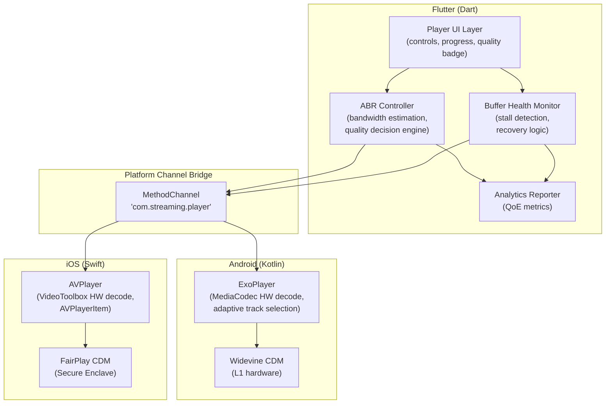
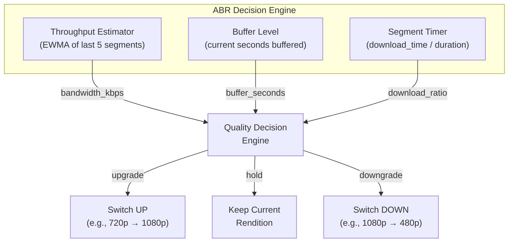

# 4. The Flutter Adaptive Player 🔴

> **The Problem:** You have a globally distributed CDN serving HLS manifests and CMAF segments. Now you need a **cross-platform video player** that runs on iOS and Android, parses the master playlist, selects an initial rendition, begins playback in under 1 second, and **seamlessly adapts quality** when the viewer walks from their living room WiFi into an elevator with spotty 4G — all without a single rebuffer event. Flutter gives you a single codebase, but video playback requires deep platform integration with ExoPlayer (Android) and AVPlayer (iOS).

---

## 4.1 Platform Player Architecture

Flutter's `video_player` package provides a basic wrapper, but production streaming requires direct control over the native player's ABR logic, buffer management, and DRM integration. This means **platform channels** — Dart calling into native Kotlin/Swift code.



### Why Not Pure Dart?

```
// 💥 PERFORMANCE HAZARD: Trying to decode video in Dart

// You CANNOT decode H.264 video in Dart. Period.
//
// 1. Dart does not have SIMD intrinsics — software decode of 1080p30
//    would consume ~4 CPU cores on a modern phone.
// 2. Dart cannot access MediaCodec (Android) or VideoToolbox (iOS)
//    hardware decoders directly — these are native APIs.
// 3. Dart's garbage collector introduces unpredictable frame drops
//    during GC pauses — 16ms pauses at 60fps = visible stuttering.
//
// The correct architecture: Dart handles the UI, ABR logic, and analytics.
// Native code handles decode, render, and DRM.
// Platform channels bridge the two.
```

---

## 4.2 Platform Channel Contract

The Dart ↔ Native bridge must expose a minimal, well-defined API:

```dart
// ✅ Production platform channel contract

/// The method channel connecting Dart ABR logic to native players
class NativePlayerBridge {
  static const _channel = MethodChannel('com.streaming.player');

  /// Initialize the native player with the master playlist URL
  static Future<void> initialize(String masterPlaylistUrl) async {
    await _channel.invokeMethod('initialize', {
      'url': masterPlaylistUrl,
      'initialBitrateKbps': 1200, // Start at 480p for fast startup
      'minBufferMs': 15000,       // 15s minimum buffer
      'maxBufferMs': 50000,       // 50s maximum buffer
      'bufferForPlaybackMs': 2500, // Start playback after 2.5s buffered
    });
  }

  /// Force the player to a specific rendition (disabling auto-ABR)
  static Future<void> setMaxBitrate(int bitrateKbps) async {
    await _channel.invokeMethod('setMaxBitrate', {
      'bitrateKbps': bitrateKbps,
    });
  }

  /// Re-enable automatic ABR
  static Future<void> enableAutoQuality() async {
    await _channel.invokeMethod('enableAutoQuality');
  }

  /// Get current playback state for ABR decision-making
  static Future<PlayerState> getPlayerState() async {
    final result = await _channel.invokeMethod('getPlayerState');
    return PlayerState.fromMap(result as Map<String, dynamic>);
  }

  /// Register a callback for player events (buffer low, stall, quality change)
  static void setEventHandler(void Function(PlayerEvent) handler) {
    _channel.setMethodCallHandler((call) async {
      switch (call.method) {
        case 'onBufferLow':
          handler(PlayerEvent.bufferLow(
            bufferMs: call.arguments['bufferMs'] as int,
          ));
        case 'onStall':
          handler(PlayerEvent.stall(
            stallDurationMs: call.arguments['durationMs'] as int,
          ));
        case 'onQualityChanged':
          handler(PlayerEvent.qualityChanged(
            fromKbps: call.arguments['fromKbps'] as int,
            toKbps: call.arguments['toKbps'] as int,
          ));
        case 'onBandwidthEstimate':
          handler(PlayerEvent.bandwidthEstimate(
            estimateKbps: call.arguments['estimateKbps'] as int,
          ));
      }
    });
  }
}

/// Snapshot of the native player's internal state
class PlayerState {
  final int currentBitrateKbps;
  final int bufferDurationMs;
  final int estimatedBandwidthKbps;
  final bool isPlaying;
  final bool isBuffering;
  final double currentPositionSec;
  final double durationSec;

  PlayerState({
    required this.currentBitrateKbps,
    required this.bufferDurationMs,
    required this.estimatedBandwidthKbps,
    required this.isPlaying,
    required this.isBuffering,
    required this.currentPositionSec,
    required this.durationSec,
  });

  factory PlayerState.fromMap(Map<String, dynamic> map) {
    return PlayerState(
      currentBitrateKbps: map['currentBitrateKbps'] as int,
      bufferDurationMs: map['bufferDurationMs'] as int,
      estimatedBandwidthKbps: map['estimatedBandwidthKbps'] as int,
      isPlaying: map['isPlaying'] as bool,
      isBuffering: map['isBuffering'] as bool,
      currentPositionSec: (map['currentPositionSec'] as num).toDouble(),
      durationSec: (map['durationSec'] as num).toDouble(),
    );
  }
}

/// Player events sent from native → Dart
sealed class PlayerEvent {
  const PlayerEvent();

  factory PlayerEvent.bufferLow({required int bufferMs}) =
      BufferLowEvent;
  factory PlayerEvent.stall({required int stallDurationMs}) =
      StallEvent;
  factory PlayerEvent.qualityChanged({
    required int fromKbps,
    required int toKbps,
  }) = QualityChangedEvent;
  factory PlayerEvent.bandwidthEstimate({required int estimateKbps}) =
      BandwidthEstimateEvent;
}

class BufferLowEvent extends PlayerEvent {
  final int bufferMs;
  const BufferLowEvent({required this.bufferMs});
}

class StallEvent extends PlayerEvent {
  final int stallDurationMs;
  const StallEvent({required this.stallDurationMs});
}

class QualityChangedEvent extends PlayerEvent {
  final int fromKbps;
  final int toKbps;
  const QualityChangedEvent({required this.fromKbps, required this.toKbps});
}

class BandwidthEstimateEvent extends PlayerEvent {
  final int estimateKbps;
  const BandwidthEstimateEvent({required this.estimateKbps});
}
```

---

## 4.3 Adaptive Bitrate Streaming (ABR) Heuristics

ABR is the most complex client-side algorithm. It must answer one question every segment boundary: **which rendition should we download next?**

### The Three Signals

| Signal | What It Measures | Strength | Weakness |
|---|---|---|---|
| **Throughput** | Download speed of the last N segments | Reacts quickly to bandwidth changes | Noisy — single slow segment causes over-reaction |
| **Buffer level** | Seconds of video buffered ahead of playback | Stable — large buffer = safe to upgrade | Slow to react — buffer drains before we notice |
| **Segment download time** | Time to download last segment vs its duration | Direct measure of "keeping up" | Does not predict future bandwidth |

**Production approach:** Combine all three using a weighted decision engine.



### The Naive ABR

```dart
// 💥 REBUFFERING HAZARD: Simple throughput-based ABR

int naiveSelectRendition(int lastSegmentBandwidthKbps, List<int> renditionBitrates) {
  // Just pick the highest rendition that fits in the measured bandwidth
  // 💥 Problem 1: Single measurement is noisy — one slow segment
  //    and we drop from 1080p to 360p for no reason
  // 💥 Problem 2: No buffer awareness — we might upgrade to 1080p
  //    but the buffer is only 2 seconds deep → rebuffer risk
  // 💥 Problem 3: No hysteresis — we oscillate between 720p and 1080p
  //    every 2 seconds as bandwidth fluctuates around the threshold

  for (final bitrate in renditionBitrates.reversed) {
    if (lastSegmentBandwidthKbps > bitrate) {
      return bitrate;
    }
  }
  return renditionBitrates.first; // Lowest quality fallback
}
```

### The Production ABR Engine

```dart
// ✅ FIX: Buffer-aware ABR with EWMA throughput estimation and hysteresis

/// Exponentially Weighted Moving Average — gives more weight to recent
/// measurements while smoothing out noise.
class EwmaEstimator {
  final double _alpha; // Smoothing factor (0.0–1.0)
  double? _estimate;

  /// [alpha] = 0.3 gives ~70% weight to history, 30% to new sample.
  /// Higher alpha = more reactive but noisier.
  EwmaEstimator({double alpha = 0.3}) : _alpha = alpha;

  double update(double sample) {
    if (_estimate == null) {
      _estimate = sample;
    } else {
      _estimate = _alpha * sample + (1 - _alpha) * _estimate!;
    }
    return _estimate!;
  }

  double get estimate => _estimate ?? 0;
}

/// The ABR ladder — sorted from lowest to highest bitrate
class AbrLadder {
  final List<Rendition> renditions;

  AbrLadder(this.renditions) {
    renditions.sort((a, b) => a.bitrateKbps.compareTo(b.bitrateKbps));
  }

  Rendition get lowest => renditions.first;
  Rendition get highest => renditions.last;

  /// Find the highest rendition that fits within the bitrate budget
  Rendition selectForBandwidth(int bandwidthKbps) {
    Rendition selected = renditions.first;
    for (final r in renditions) {
      if (r.bitrateKbps <= bandwidthKbps) {
        selected = r;
      } else {
        break;
      }
    }
    return selected;
  }

  /// Find the next lower rendition (for downgrade)
  Rendition? lowerThan(Rendition current) {
    final idx = renditions.indexOf(current);
    return idx > 0 ? renditions[idx - 1] : null;
  }

  /// Find the next higher rendition (for upgrade)
  Rendition? higherThan(Rendition current) {
    final idx = renditions.indexOf(current);
    return idx < renditions.length - 1 ? renditions[idx + 1] : null;
  }
}

class Rendition {
  final String name;
  final int bitrateKbps;
  final int width;
  final int height;

  const Rendition({
    required this.name,
    required this.bitrateKbps,
    required this.width,
    required this.height,
  });
}

/// Production ABR decision engine with buffer-awareness and hysteresis
class AbrController {
  final AbrLadder ladder;
  final EwmaEstimator _bandwidthEstimator;

  /// Current rendition being played
  Rendition _current;

  /// Minimum seconds of buffer before we consider upgrading
  static const _upgradeBufferThreshold = 15.0;
  /// If buffer drops below this, emergency downgrade
  static const _emergencyDowngradeBuffer = 4.0;
  /// Safety margin: only upgrade if bandwidth > rendition bitrate * margin
  static const _upgradeSafetyMargin = 1.35;
  /// Only downgrade if bandwidth < rendition bitrate * margin
  static const _downgradeTriggerMargin = 0.8;
  /// Minimum time between quality switches to prevent oscillation
  static const _minSwitchIntervalMs = 8000;

  DateTime _lastSwitchTime = DateTime.fromMillisecondsSinceEpoch(0);

  AbrController({required this.ladder})
      : _bandwidthEstimator = EwmaEstimator(alpha: 0.3),
        _current = ladder.lowest; // ✅ Start low for fast startup

  /// Called after each segment download completes.
  /// Returns the rendition to use for the NEXT segment.
  Rendition onSegmentDownloaded({
    required int segmentSizeBytes,
    required int downloadTimeMs,
    required double bufferLevelSeconds,
  }) {
    // 1. Update bandwidth estimate
    final segmentBandwidthKbps =
        (segmentSizeBytes * 8) ~/ downloadTimeMs; // bits/ms = kbps
    final estimatedBandwidthKbps =
        _bandwidthEstimator.update(segmentBandwidthKbps.toDouble()).toInt();

    // 2. Emergency downgrade: buffer critically low
    if (bufferLevelSeconds < _emergencyDowngradeBuffer) {
      final lowest = ladder.lowest;
      if (_current != lowest) {
        _recordSwitch(lowest);
        return _current;
      }
    }

    // 3. Check hysteresis timer — don't switch too frequently
    final now = DateTime.now();
    final msSinceLastSwitch =
        now.difference(_lastSwitchTime).inMilliseconds;
    if (msSinceLastSwitch < _minSwitchIntervalMs) {
      return _current; // Too soon to switch again
    }

    // 4. Consider upgrade: bandwidth headroom + buffer depth
    final nextUp = ladder.higherThan(_current);
    if (nextUp != null &&
        estimatedBandwidthKbps >
            (nextUp.bitrateKbps * _upgradeSafetyMargin).toInt() &&
        bufferLevelSeconds > _upgradeBufferThreshold) {
      _recordSwitch(nextUp);
      return _current;
    }

    // 5. Consider downgrade: bandwidth insufficient
    if (estimatedBandwidthKbps <
        (_current.bitrateKbps * _downgradeTriggerMargin).toInt()) {
      // ✅ Find the rendition that fits the available bandwidth
      final target = ladder.selectForBandwidth(estimatedBandwidthKbps);
      if (target.bitrateKbps < _current.bitrateKbps) {
        _recordSwitch(target);
        return _current;
      }
    }

    // 6. Hold current rendition
    return _current;
  }

  void _recordSwitch(Rendition newRendition) {
    _current = newRendition;
    _lastSwitchTime = DateTime.now();
  }
}
```

---

## 4.4 Time to First Frame (TTFF) Optimization

The most critical UX metric is **time to first frame** — the delay from tapping "Play" to seeing video on screen. Users abandon streams if TTFF exceeds 2 seconds.

### TTFF Breakdown

```mermaid
gantt
    title Time to First Frame Breakdown (Target: <1s)
    dateFormat X
    axisFormat %Lms

    section DNS + TCP
    DNS Resolution           :a, 0, 50
    TCP Handshake            :b, after a, 80

    section Manifest
    Master Playlist Fetch    :c, after b, 100
    Media Playlist Fetch     :d, after c, 80

    section Download
    Init Segment (.mp4)      :e, after d, 60
    First Media Segment      :f, after e, 200

    section Decode
    Codec Init + First Frame :g, after f, 100

    section Total
    TTFF                     :milestone, after g, 0
```



### Optimization Techniques

| Technique | Savings | Implementation |
|---|---|---|
| **Preconnect DNS + TCP** | ~130ms | Resolve DNS and open TCP connection while the UI loads |
| **Start at lowest rendition** | ~150ms | Download the 360p first segment (smallest) instead of 1080p |
| **Embed init segment in manifest** | ~60ms | Avoid a separate HTTP request for codec initialization |
| **Preload first segment** | ~200ms | Begin downloading before user taps play |
| **Parallel playlist + init fetch** | ~80ms | Download media playlist and init segment simultaneously |

```dart
// ✅ Production TTFF optimization pipeline

class FastStartController {
  final NativePlayerBridge _bridge;
  final String _masterPlaylistUrl;

  FastStartController(this._bridge, this._masterPlaylistUrl);

  /// Optimized startup sequence that minimizes TTFF
  Future<void> startPlayback() async {
    // ✅ Step 1: Parse master playlist to find the LOWEST rendition
    // (fastest to download, fastest to decode)
    final masterContent = await _fetchWithTimeout(
      _masterPlaylistUrl,
      timeout: const Duration(milliseconds: 500),
    );
    final renditions = _parseMasterPlaylist(masterContent);
    final startRendition = renditions.reduce(
      (a, b) => a.bitrateKbps < b.bitrateKbps ? a : b,
    );

    // ✅ Step 2: Fetch media playlist and init segment IN PARALLEL
    final mediaPlaylistUrl = startRendition.playlistUrl;
    final results = await Future.wait([
      _fetchWithTimeout(
        mediaPlaylistUrl,
        timeout: const Duration(milliseconds: 300),
      ),
      _fetchInitSegment(startRendition),
    ]);

    final mediaPlaylist = results[0] as String;
    final firstSegmentUrl = _parseFirstSegmentUrl(mediaPlaylist);

    // ✅ Step 3: Begin native player initialization with the low rendition
    // The native player downloads the first segment while we set up ABR
    await NativePlayerBridge.initialize(_masterPlaylistUrl);

    // ✅ Step 4: Once playback starts, the ABR controller will
    // upgrade quality based on measured bandwidth
  }

  Future<String> _fetchWithTimeout(String url, {required Duration timeout}) async {
    // HTTP GET with aggressive timeout for startup speed
    // Implementation uses dart:io HttpClient
    return ''; // placeholder
  }

  Future<void> _fetchInitSegment(Rendition rendition) async {
    // Fetch and cache init segment
  }

  List<Rendition> _parseMasterPlaylist(String content) {
    // Parse #EXT-X-STREAM-INF lines
    return [];
  }

  String _parseFirstSegmentUrl(String mediaPlaylist) {
    // Parse first segment URL from media playlist
    return '';
  }
}
```

---

## 4.5 Stall Detection and Recovery

Even with ABR, stalls (rebuffering events) can occur during sudden bandwidth drops. The player must detect stalls early and recover aggressively:

```dart
// ✅ Stall detection and recovery state machine

enum PlaybackHealth {
  /// Normal playback, buffer is healthy
  healthy,
  /// Buffer is low but still playing — increase urgency
  warning,
  /// Playback has stalled — emergency measures
  stalled,
  /// Recovering from a stall — stay at lowest quality
  recovering,
}

class StallRecoveryController {
  PlaybackHealth _state = PlaybackHealth.healthy;
  final AbrController _abr;

  /// Buffer thresholds in seconds
  static const _warningThreshold = 5.0;
  static const _criticalThreshold = 1.0;
  static const _recoveredThreshold = 15.0;

  /// Track stall count for QoE reporting
  int _stallCount = 0;
  int _totalStallDurationMs = 0;

  StallRecoveryController(this._abr);

  /// Called every 500ms by the buffer health monitor
  void updateBufferHealth(double bufferSeconds, bool isPlaying) {
    switch (_state) {
      case PlaybackHealth.healthy:
        if (bufferSeconds < _warningThreshold && isPlaying) {
          _state = PlaybackHealth.warning;
          // ✅ Proactively downgrade one step before we stall
          _abr.onSegmentDownloaded(
            segmentSizeBytes: 0,
            downloadTimeMs: 1,
            bufferLevelSeconds: bufferSeconds,
          );
        }

      case PlaybackHealth.warning:
        if (bufferSeconds > _warningThreshold) {
          _state = PlaybackHealth.healthy;
        } else if (bufferSeconds < _criticalThreshold) {
          _state = PlaybackHealth.stalled;
          _stallCount++;
          _onStallStarted();
        }

      case PlaybackHealth.stalled:
        if (bufferSeconds > _criticalThreshold && isPlaying) {
          _state = PlaybackHealth.recovering;
          _onStallEnded();
        }

      case PlaybackHealth.recovering:
        if (bufferSeconds > _recoveredThreshold) {
          _state = PlaybackHealth.healthy;
          // ✅ Only re-enable quality upgrades after buffer is deep
        }
    }
  }

  void _onStallStarted() {
    // ✅ Emergency: Drop to lowest rendition immediately
    // Don't wait for the normal ABR cycle
    NativePlayerBridge.setMaxBitrate(
      _abr.ladder.lowest.bitrateKbps,
    );
  }

  void _onStallEnded() {
    // ✅ Stay at lowest quality during recovery
    // ABR will gradually upgrade once buffer is rebuilt
  }

  /// QoE summary for analytics
  Map<String, dynamic> get qoeMetrics => {
    'stallCount': _stallCount,
    'totalStallDurationMs': _totalStallDurationMs,
    'currentHealth': _state.name,
  };
}
```

---

## 4.6 ExoPlayer Integration (Android)

On Android, ExoPlayer provides the heavy lifting — hardware decode via MediaCodec, adaptive track selection, and Widevine DRM. The Kotlin bridge translates Flutter commands into ExoPlayer API calls:

```kotlin
// ✅ Android: ExoPlayer setup via platform channel (Kotlin)

// This would live in android/app/src/main/kotlin/.../PlayerPlugin.kt

import androidx.media3.exoplayer.ExoPlayer
import androidx.media3.common.MediaItem
import androidx.media3.exoplayer.trackselection.DefaultTrackSelector
import androidx.media3.common.TrackSelectionOverride
import io.flutter.plugin.common.MethodChannel

class NativePlayerPlugin(
    private val context: android.content.Context,
    private val channel: MethodChannel,
) : MethodChannel.MethodCallHandler {

    private var player: ExoPlayer? = null
    private var trackSelector: DefaultTrackSelector? = null

    override fun onMethodCall(call: MethodCall, result: MethodChannel.Result) {
        when (call.method) {
            "initialize" -> {
                val url = call.argument<String>("url")!!
                val minBufferMs = call.argument<Int>("minBufferMs")!!
                val maxBufferMs = call.argument<Int>("maxBufferMs")!!

                // ✅ Create track selector with ABR constraints
                trackSelector = DefaultTrackSelector(context).apply {
                    parameters = buildUponParameters()
                        .setMaxVideoBitrate(
                            call.argument<Int>("initialBitrateKbps")!! * 1000
                        )
                        .build()
                }

                // ✅ Build ExoPlayer with tuned buffer parameters
                player = ExoPlayer.Builder(context)
                    .setTrackSelector(trackSelector!!)
                    .setLoadControl(
                        DefaultLoadControl.Builder()
                            .setBufferDurationsMs(
                                minBufferMs,        // Min buffer before playback
                                maxBufferMs,        // Max buffer (stop downloading)
                                call.argument<Int>("bufferForPlaybackMs")!!,
                                minBufferMs / 2     // Buffer for rebuffer recovery
                            )
                            .build()
                    )
                    .build()

                // ✅ Set the HLS media source
                val mediaItem = MediaItem.fromUri(url)
                player!!.setMediaItem(mediaItem)
                player!!.prepare()
                player!!.play()

                // ✅ Forward bandwidth estimates to Dart
                player!!.addListener(object : Player.Listener {
                    override fun onEvents(
                        player: Player,
                        events: Player.Events,
                    ) {
                        if (events.contains(Player.EVENT_PLAYBACK_STATE_CHANGED)) {
                            channel.invokeMethod("onBandwidthEstimate", mapOf(
                                "estimateKbps" to
                                    (player.totalBufferedDuration / 1000)
                            ))
                        }
                    }
                })

                result.success(null)
            }

            "setMaxBitrate" -> {
                val bitrateKbps = call.argument<Int>("bitrateKbps")!!
                trackSelector?.parameters = trackSelector!!
                    .buildUponParameters()
                    .setMaxVideoBitrate(bitrateKbps * 1000)
                    .build()
                result.success(null)
            }

            "getPlayerState" -> {
                val p = player!!
                result.success(mapOf(
                    "currentBitrateKbps" to
                        (p.videoFormat?.bitrate ?: 0) / 1000,
                    "bufferDurationMs" to
                        p.totalBufferedDuration.toInt(),
                    "estimatedBandwidthKbps" to 0, // From bandwidth meter
                    "isPlaying" to p.isPlaying,
                    "isBuffering" to
                        (p.playbackState == Player.STATE_BUFFERING),
                    "currentPositionSec" to
                        p.currentPosition / 1000.0,
                    "durationSec" to
                        p.duration / 1000.0,
                ))
            }

            else -> result.notImplemented()
        }
    }
}
```

---

## 4.7 AVPlayer Integration (iOS)

On iOS, AVPlayer handles HLS natively — including FairPlay DRM and adaptive bitrate selection. The Swift bridge provides equivalent functionality:

```swift
// ✅ iOS: AVPlayer setup via platform channel (Swift)

// This would live in ios/Runner/NativePlayerPlugin.swift

import AVFoundation
import Flutter

class NativePlayerPlugin: NSObject, FlutterPlugin {
    private var player: AVPlayer?
    private var playerItem: AVPlayerItem?
    private var timeObserver: Any?
    private let channel: FlutterMethodChannel

    init(channel: FlutterMethodChannel) {
        self.channel = channel
        super.init()
    }

    func handle(_ call: FlutterMethodCall, result: @escaping FlutterResult) {
        guard let args = call.arguments as? [String: Any] else {
            result(FlutterError(code: "INVALID_ARGS",
                                message: nil, details: nil))
            return
        }

        switch call.method {
        case "initialize":
            guard let urlString = args["url"] as? String,
                  let url = URL(string: urlString) else {
                result(FlutterError(code: "INVALID_URL",
                                    message: nil, details: nil))
                return
            }

            let asset = AVURLAsset(url: url)
            playerItem = AVPlayerItem(asset: asset)

            // ✅ Set preferred peak bitrate for initial quality
            let initialBitrateKbps = args["initialBitrateKbps"] as? Int ?? 1200
            playerItem!.preferredPeakBitRate =
                Double(initialBitrateKbps * 1000)

            // ✅ Configure forward buffer duration
            playerItem!.preferredForwardBufferDuration =
                Double((args["maxBufferMs"] as? Int ?? 50000)) / 1000.0

            player = AVPlayer(playerItem: playerItem!)

            // ✅ Observe buffer status for stall reporting
            playerItem!.addObserver(
                self,
                forKeyPath: "playbackBufferEmpty",
                options: [.new],
                context: nil
            )

            player!.play()
            result(nil)

        case "setMaxBitrate":
            let bitrateKbps = args["bitrateKbps"] as? Int ?? 0
            playerItem?.preferredPeakBitRate = Double(bitrateKbps * 1000)
            result(nil)

        case "enableAutoQuality":
            // ✅ Setting to 0 re-enables automatic selection
            playerItem?.preferredPeakBitRate = 0
            result(nil)

        case "getPlayerState":
            guard let p = player, let item = playerItem else {
                result(FlutterError(code: "NOT_INIT",
                                    message: nil, details: nil))
                return
            }

            let buffered = item.loadedTimeRanges.first?
                .timeRangeValue.duration.seconds ?? 0
            let accessLog = item.accessLog()
            let lastEvent = accessLog?.events.last

            result([
                "currentBitrateKbps":
                    Int((lastEvent?.indicatedBitrate ?? 0) / 1000),
                "bufferDurationMs": Int(buffered * 1000),
                "estimatedBandwidthKbps":
                    Int((lastEvent?.observedBitrate ?? 0) / 1000),
                "isPlaying": p.rate > 0,
                "isBuffering": !item.isPlaybackLikelyToKeepUp,
                "currentPositionSec":
                    p.currentTime().seconds,
                "durationSec": item.duration.seconds,
            ] as [String: Any])

        default:
            result(FlutterMethodNotImplemented)
        }
    }

    override func observeValue(
        forKeyPath keyPath: String?,
        of object: Any?,
        change: [NSKeyValueChangeKey: Any]?,
        context: UnsafeMutableRawPointer?
    ) {
        if keyPath == "playbackBufferEmpty" {
            channel.invokeMethod("onStall", arguments: [
                "durationMs": 0, // Measured when buffer refills
            ])
        }
    }
}
```

---

## 4.8 Quality of Experience (QoE) Metrics

Every production video player must report QoE metrics for monitoring and alerting:

| Metric | Definition | Target |
|---|---|---|
| **TTFF** (Time to First Frame) | Tap "Play" → first video frame rendered | < 1.0s (broadband), < 2.0s (4G) |
| **Rebuffer rate** | % of sessions with ≥ 1 stall event | < 0.5% |
| **Rebuffer ratio** | Total stall time / total watch time | < 0.1% |
| **Average bitrate** | Mean presented bitrate across session | ≥ 80% of available bandwidth |
| **Quality switches** | Number of rendition changes per session | < 5 per 10 minutes |
| **Startup failure rate** | % of play attempts that fail completely | < 0.1% |
| **Video start failures** | % of attempts failing before first frame | < 0.05% |

```dart
// ✅ QoE telemetry collector

class QoeTelemetry {
  DateTime? _playRequestTime;
  DateTime? _firstFrameTime;
  int _stallCount = 0;
  int _totalStallMs = 0;
  int _qualitySwitchCount = 0;
  final List<int> _bitratesSeen = [];
  DateTime? _stallStartTime;

  void onPlayRequested() {
    _playRequestTime = DateTime.now();
  }

  void onFirstFrame() {
    _firstFrameTime = DateTime.now();

    final ttff = _firstFrameTime!
        .difference(_playRequestTime!)
        .inMilliseconds;

    // Report TTFF immediately — this is the most important metric
    _reportMetric('player_ttff_ms', ttff.toDouble());
  }

  void onStallStarted() {
    _stallStartTime = DateTime.now();
    _stallCount++;
  }

  void onStallEnded() {
    if (_stallStartTime != null) {
      final duration = DateTime.now()
          .difference(_stallStartTime!)
          .inMilliseconds;
      _totalStallMs += duration;
      _stallStartTime = null;

      _reportMetric('player_stall_duration_ms', duration.toDouble());
    }
  }

  void onQualityChanged(int newBitrateKbps) {
    _qualitySwitchCount++;
    _bitratesSeen.add(newBitrateKbps);
  }

  /// Called when the user exits the player — report session summary
  Map<String, dynamic> sessionSummary() {
    final avgBitrate = _bitratesSeen.isEmpty
        ? 0
        : _bitratesSeen.reduce((a, b) => a + b) / _bitratesSeen.length;

    return {
      'ttff_ms': _firstFrameTime != null && _playRequestTime != null
          ? _firstFrameTime!.difference(_playRequestTime!).inMilliseconds
          : -1,
      'stall_count': _stallCount,
      'total_stall_ms': _totalStallMs,
      'quality_switches': _qualitySwitchCount,
      'avg_bitrate_kbps': avgBitrate.round(),
      'renditions_used': _bitratesSeen.toSet().length,
    };
  }

  void _reportMetric(String name, double value) {
    // Send to analytics backend (e.g., Datadog, Amplitude)
  }
}
```

---

## 4.9 Player UI: Quality Selector Widget

Users expect a manual quality override. Here's the Flutter widget:

```dart
// ✅ Quality selector overlay widget

import 'package:flutter/material.dart';

class QualitySelector extends StatelessWidget {
  final List<Rendition> renditions;
  final Rendition currentRendition;
  final bool isAutoMode;
  final ValueChanged<Rendition?> onSelected;

  const QualitySelector({
    super.key,
    required this.renditions,
    required this.currentRendition,
    required this.isAutoMode,
    required this.onSelected,
  });

  @override
  Widget build(BuildContext context) {
    return Container(
      decoration: BoxDecoration(
        color: Colors.black87,
        borderRadius: BorderRadius.circular(8),
      ),
      padding: const EdgeInsets.symmetric(vertical: 8),
      child: Column(
        mainAxisSize: MainAxisSize.min,
        children: [
          // Auto mode option
          _QualityOption(
            label: 'Auto',
            subtitle: isAutoMode
                ? '${currentRendition.name} (current)'
                : null,
            isSelected: isAutoMode,
            onTap: () => onSelected(null), // null = auto mode
          ),
          const Divider(color: Colors.white24, height: 1),
          // Manual rendition options (highest first)
          for (final r in renditions.reversed) ...[
            _QualityOption(
              label: '${r.height}p',
              subtitle: '${(r.bitrateKbps / 1000).toStringAsFixed(1)} Mbps',
              isSelected: !isAutoMode && r == currentRendition,
              onTap: () => onSelected(r),
            ),
          ],
        ],
      ),
    );
  }
}

class _QualityOption extends StatelessWidget {
  final String label;
  final String? subtitle;
  final bool isSelected;
  final VoidCallback onTap;

  const _QualityOption({
    required this.label,
    this.subtitle,
    required this.isSelected,
    required this.onTap,
  });

  @override
  Widget build(BuildContext context) {
    return InkWell(
      onTap: onTap,
      child: Padding(
        padding: const EdgeInsets.symmetric(horizontal: 16, vertical: 10),
        child: Row(
          children: [
            if (isSelected)
              const Icon(Icons.check, color: Colors.white, size: 18)
            else
              const SizedBox(width: 18),
            const SizedBox(width: 12),
            Column(
              crossAxisAlignment: CrossAxisAlignment.start,
              children: [
                Text(label,
                    style: const TextStyle(color: Colors.white, fontSize: 14)),
                if (subtitle != null)
                  Text(subtitle!,
                      style: const TextStyle(
                          color: Colors.white60, fontSize: 11)),
              ],
            ),
          ],
        ),
      ),
    );
  }
}
```

---

> **Key Takeaways**
>
> 1. **Video decode must happen in native code.** Dart cannot access hardware video decoders (MediaCodec, VideoToolbox). Use platform channels to bridge Flutter's Dart UI to ExoPlayer (Android) and AVPlayer (iOS).
> 2. **Start at the lowest rendition for fast TTFF.** The 360p first segment is ~75 KB vs ~560 KB for 1080p. This saves ~200ms on initial load. The ABR controller will upgrade within 2–3 segments.
> 3. **Combine throughput, buffer level, and segment download time** for ABR decisions. Throughput alone is noisy; buffer alone is slow. The weighted combination prevents both rebuffering and quality oscillation.
> 4. **Hysteresis prevents quality oscillation.** Require a higher bandwidth threshold to upgrade (1.35× rendition bitrate) than to hold (1.0×), and enforce a minimum 8-second interval between quality switches.
> 5. **Emergency downgrade on low buffer bypasses the normal ABR cycle.** When the buffer drops below 4 seconds, immediately switch to the lowest rendition — don't wait for the next segment boundary.
> 6. **Report QoE metrics for every session.** TTFF, rebuffer rate, rebuffer ratio, and average bitrate are the four metrics that determine whether your streaming platform is production-grade or a tech demo.
