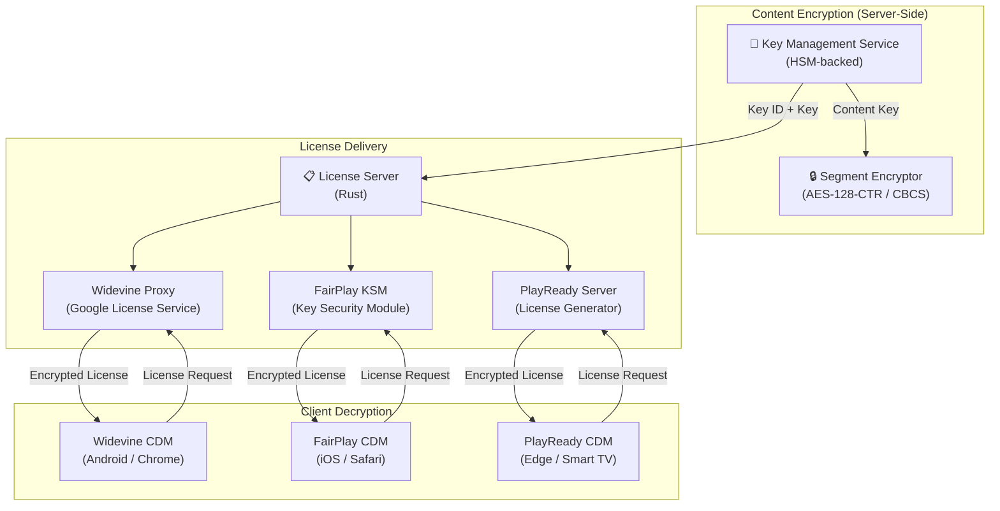
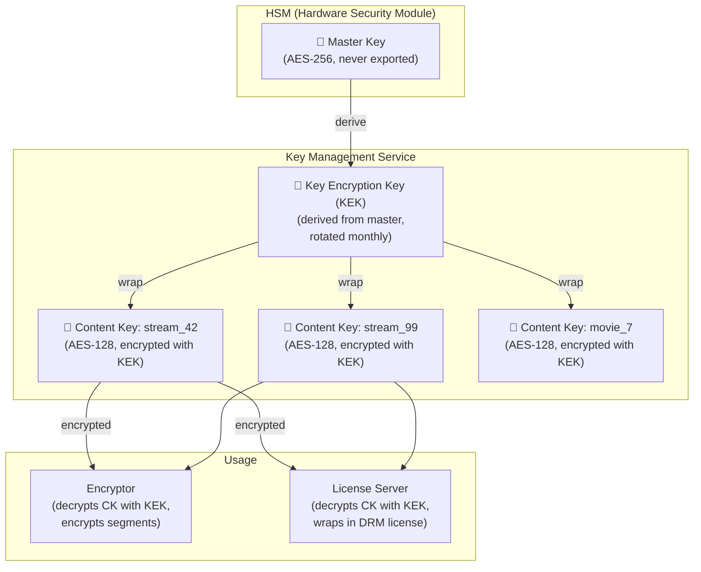
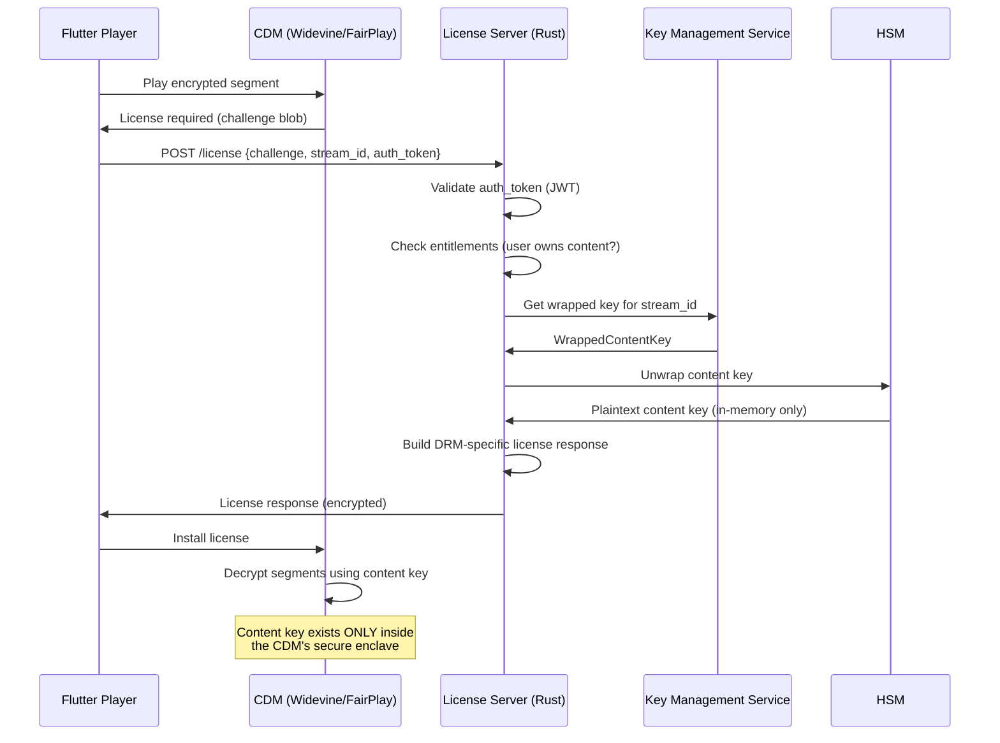
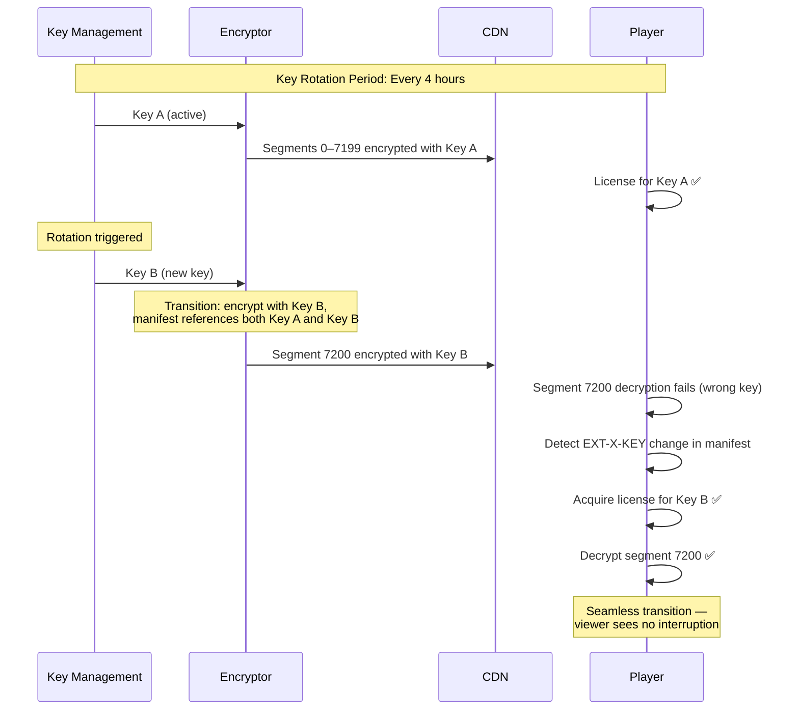
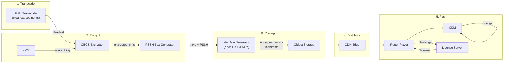

# 5. DRM and Content Protection 🔴

> **The Problem:** You have a global streaming pipeline — ingest, transcode, CDN, adaptive player — and it all works beautifully. Then a content partner asks: *"How do you prevent someone from downloading our $200M movie and uploading it to a piracy site?"* Without DRM, your HLS segments are **unencrypted HTTP files** that anyone can download with `curl`. Content owners will not license premium content to a platform without Widevine, FairPlay, and PlayReady protection. You need end-to-end encryption from the transcoding pipeline through the CDN to the viewer's hardware-secured decryption module.

---

## 5.1 The DRM Landscape

Three DRM systems dominate the streaming industry. Each is controlled by a different technology company and targets different platforms:

| DRM System | Owner | Platforms | Security Levels | License Model |
|---|---|---|---|---|
| **Widevine** | Google | Android, Chrome, Chromecast, Smart TVs | L1 (hardware), L2, L3 (software) | Free (license from Google) |
| **FairPlay** | Apple | iOS, Safari, Apple TV, macOS | Hardware-only (Secure Enclave) | Free (Apple Developer Program) |
| **PlayReady** | Microsoft | Edge, Xbox, Windows, Smart TVs | SL150 (software), SL2000, SL3000 (hardware) | Licensed (per-device fee) |

**You need all three** for full platform coverage. There is no single DRM system that works everywhere.



---

## 5.2 Encryption Modes: CTR vs CBCS

CMAF defines two encryption modes for video segments. The choice affects compatibility and performance:

| Property | AES-128-CTR (cenc) | AES-128-CBC (cbcs) |
|---|---|---|
| Mode | Counter mode — full encryption | CBC with pattern encryption (1 of every 10 blocks) |
| Performance | Higher CPU cost (encrypts every byte) | ~10× lower CPU (encrypts 10% of data) |
| Widevine | ✅ Supported | ✅ Supported (preferred on Android) |
| FairPlay | ❌ Not supported | ✅ **Required** |
| PlayReady | ✅ Supported | ✅ Supported |
| Streaming standard | DASH (traditional) | CMAF / HLS (Apple standard) |

**Production decision: Use CBCS (Common encryption with CBC pattern).** It is the only mode supported by FairPlay, and Widevine/PlayReady both support it. This allows a **single encrypted segment** to serve all three DRM systems.

```
// 💥 COMPATIBILITY HAZARD: Using CTR encryption

// If you encrypt with AES-128-CTR (cenc scheme):
//   ✅ Widevine (Android/Chrome): works
//   ✅ PlayReady (Edge/Windows): works
//   ❌ FairPlay (iOS/Safari): DOES NOT WORK
//
// You would need to encrypt TWICE — once with CTR for Widevine/PlayReady,
// once with CBCS for FairPlay. That's:
//   - 2× encryption CPU cost
//   - 2× storage for segments
//   - 2× CDN egress bandwidth
//
// SOLUTION: Use CBCS for everything.
// Widevine and PlayReady support CBCS.
// FairPlay requires CBCS.
// Single set of encrypted segments serves all platforms.
```

---

## 5.3 Key Management Architecture

Content encryption keys are the crown jewels of the DRM system. They must be generated securely, stored safely, distributed to the encryptor and license server, and **never** exposed in plaintext outside of an HSM or hardware CDM.

### Key Hierarchy



### Key Generation in Rust

```rust,editable
// ✅ Production content key management with HSM-backed storage

use std::collections::HashMap;
use std::sync::Arc;
use tokio::sync::RwLock;

/// A unique identifier for a content encryption key.
/// Format: UUID v4, hex-encoded (32 chars).
#[derive(Debug, Clone, Hash, PartialEq, Eq)]
struct KeyId(String);

/// A content encryption key wrapped (encrypted) with the KEK.
/// The raw key material is NEVER stored in plaintext.
#[derive(Debug, Clone)]
struct WrappedContentKey {
    key_id: KeyId,
    /// AES-128 key encrypted with the KEK — 16 bytes cleartext, ~32 bytes wrapped
    wrapped_key: Vec<u8>,
    /// Initialization vector for the wrapping (AES-KW or AES-GCM)
    wrap_iv: Vec<u8>,
    /// Which KEK version was used to wrap this key
    kek_version: u32,
}

/// Content key with associated metadata
#[derive(Debug, Clone)]
struct ContentKeyRecord {
    key: WrappedContentKey,
    /// Stream or asset this key protects
    content_id: String,
    /// When this key was created
    created_at: chrono::DateTime<chrono::Utc>,
    /// When this key expires (for rotation)
    expires_at: chrono::DateTime<chrono::Utc>,
    /// How many segments have been encrypted with this key
    usage_count: u64,
}

/// Key Management Service — generates and stores content encryption keys.
struct KeyManagementService {
    /// HSM client for key derivation and wrapping operations
    hsm: Arc<dyn HsmClient>,
    /// Database of issued keys (in production: encrypted database, not HashMap)
    keys: Arc<RwLock<HashMap<KeyId, ContentKeyRecord>>>,
    /// Current KEK version
    current_kek_version: u32,
}

/// Trait abstracting the HSM operations
trait HsmClient: Send + Sync {
    /// Generate a random AES-128 key inside the HSM and return it wrapped
    fn generate_and_wrap_key(&self, kek_version: u32) -> WrappedContentKey;
    /// Unwrap a content key inside the HSM — returns the plaintext key
    /// The plaintext key ONLY exists in-process memory, never on disk
    fn unwrap_key(&self, wrapped: &WrappedContentKey) -> [u8; 16];
}

impl KeyManagementService {
    /// Generate a new content key for a stream/asset.
    /// The key exists only in wrapped (encrypted) form outside the HSM.
    async fn generate_key(
        &self,
        content_id: &str,
        ttl: chrono::Duration,
    ) -> WrappedContentKey {
        let wrapped = self.hsm.generate_and_wrap_key(self.current_kek_version);

        let now = chrono::Utc::now();
        let record = ContentKeyRecord {
            key: wrapped.clone(),
            content_id: content_id.to_string(),
            created_at: now,
            expires_at: now + ttl,
            usage_count: 0,
        };

        self.keys.write().await.insert(wrapped.key_id.clone(), record);
        wrapped
    }

    /// Retrieve a content key for the license server or encryptor.
    /// Returns the wrapped key — the caller must call HSM to unwrap.
    async fn get_key(&self, key_id: &KeyId) -> Option<WrappedContentKey> {
        self.keys.read().await
            .get(key_id)
            .map(|r| r.key.clone())
    }
}
```

---

## 5.4 Segment Encryption in the Transcoding Pipeline

Encryption happens **after transcoding, before storage**. Each segment is encrypted with the content key using AES-128-CBCS:

```rust,editable
// ✅ CMAF segment encryption with AES-128-CBCS

/// Encryption parameters for a CBCS-encrypted segment
struct CbcsEncryptionParams {
    /// 16-byte content encryption key (plaintext, from HSM unwrap)
    key: [u8; 16],
    /// 16-byte initialization vector (per-segment or per-sample)
    iv: [u8; 16],
    /// Key ID (included in segment header for license lookup)
    key_id: KeyId,
    /// CBCS pattern: encrypt `crypt_byte_block` out of every
    /// `crypt_byte_block + skip_byte_block` blocks.
    /// Standard: 1:9 (encrypt 1 of every 10 AES blocks)
    crypt_byte_block: u8,
    skip_byte_block: u8,
}

impl CbcsEncryptionParams {
    fn standard(key: [u8; 16], key_id: KeyId, segment_sequence: u64) -> Self {
        // ✅ Generate per-segment IV from the segment sequence number.
        // This ensures each segment uses a unique IV without
        // requiring a random number generator.
        let mut iv = [0u8; 16];
        iv[8..16].copy_from_slice(&segment_sequence.to_be_bytes());

        Self {
            key,
            iv,
            key_id,
            crypt_byte_block: 1,
            skip_byte_block: 9,
        }
    }
}

/// Encrypt a CMAF segment using CBCS pattern encryption.
///
/// CBCS encrypts only a fraction of the data (1 in 10 blocks by default),
/// which reduces CPU overhead by ~90% compared to full CTR encryption
/// while maintaining content protection.
fn encrypt_segment_cbcs(
    plaintext: &[u8],
    params: &CbcsEncryptionParams,
) -> Vec<u8> {
    // In production, this would use the `aes` crate with CBC mode:
    //
    // use aes::cipher::{BlockEncryptMut, KeyIvInit};
    // type Aes128CbcEnc = cbc::Encryptor<aes::Aes128>;
    //
    // For each NAL unit (video sample):
    //   1. Leave the NAL header unencrypted (required for codec detection)
    //   2. Split the NAL body into 16-byte AES blocks
    //   3. Encrypt blocks 0, 10, 20, 30, ... (1-of-10 pattern)
    //   4. Leave blocks 1–9, 11–19, 21–29, ... in cleartext

    let block_size = 16; // AES block size
    let mut output = plaintext.to_vec();

    let total_blocks = plaintext.len() / block_size;
    let pattern_length = (params.crypt_byte_block + params.skip_byte_block) as usize;

    for block_idx in 0..total_blocks {
        let position_in_pattern = block_idx % pattern_length;

        // ✅ Only encrypt the first `crypt_byte_block` blocks in each pattern
        if position_in_pattern < params.crypt_byte_block as usize {
            let start = block_idx * block_size;
            let end = start + block_size;

            // In production: AES-128-CBC encrypt this block
            // Using the IV chain from the previous encrypted block
            encrypt_aes_block(
                &mut output[start..end],
                &params.key,
                &params.iv,
            );
        }
        // Blocks in the `skip` portion are left as cleartext
    }

    output
}

fn encrypt_aes_block(block: &mut [u8], _key: &[u8; 16], _iv: &[u8; 16]) {
    // Production: AES-128-CBC encryption
    // Placeholder — would use the `aes` + `cbc` crates
}
```

### Adding PSSH Boxes to Segments

Each encrypted segment must include **Protection System Specific Header (PSSH)** boxes that tell the player which DRM system to use and where to acquire the license:

```rust,editable
// ✅ Generate PSSH boxes for multi-DRM segments

/// Widevine System ID (fixed UUID)
const WIDEVINE_SYSTEM_ID: [u8; 16] = [
    0xED, 0xEF, 0x8B, 0xA9, 0x79, 0xD6, 0x4A, 0xCE,
    0xA3, 0xC8, 0x27, 0xDC, 0xD5, 0x1D, 0x21, 0xED,
];

/// PlayReady System ID (fixed UUID)
const PLAYREADY_SYSTEM_ID: [u8; 16] = [
    0x9A, 0x04, 0xF0, 0x79, 0x98, 0x40, 0x42, 0x86,
    0xAB, 0x92, 0xE6, 0x5B, 0xE0, 0x88, 0x5F, 0x95,
];

/// A PSSH box in the ISO BMFF (fMP4) container
struct PsshBox {
    system_id: [u8; 16],
    key_ids: Vec<KeyId>,
    /// DRM-system-specific data (e.g., Widevine content ID protobuf)
    data: Vec<u8>,
}

impl PsshBox {
    /// Serialize to ISO BMFF box format
    fn serialize(&self) -> Vec<u8> {
        let mut buf = Vec::new();

        // Box size (placeholder — filled at the end)
        buf.extend_from_slice(&[0u8; 4]);
        // Box type: 'pssh'
        buf.extend_from_slice(b"pssh");
        // Version 1 (includes key IDs)
        buf.push(1);
        // Flags
        buf.extend_from_slice(&[0u8; 3]);
        // System ID
        buf.extend_from_slice(&self.system_id);
        // Key ID count
        let key_count = self.key_ids.len() as u32;
        buf.extend_from_slice(&key_count.to_be_bytes());
        // Key IDs (16 bytes each)
        for key_id in &self.key_ids {
            let id_bytes = hex_to_bytes(&key_id.0);
            buf.extend_from_slice(&id_bytes);
        }
        // Data size + data
        let data_len = self.data.len() as u32;
        buf.extend_from_slice(&data_len.to_be_bytes());
        buf.extend_from_slice(&self.data);

        // Fix the box size at the beginning
        let total_size = buf.len() as u32;
        buf[0..4].copy_from_slice(&total_size.to_be_bytes());

        buf
    }
}

/// Generate PSSH boxes for both Widevine and PlayReady
fn generate_pssh_boxes(key_id: &KeyId) -> Vec<PsshBox> {
    vec![
        PsshBox {
            system_id: WIDEVINE_SYSTEM_ID,
            key_ids: vec![key_id.clone()],
            data: generate_widevine_pssh_data(key_id),
        },
        PsshBox {
            system_id: PLAYREADY_SYSTEM_ID,
            key_ids: vec![key_id.clone()],
            data: generate_playready_pssh_data(key_id),
        },
        // FairPlay does not use PSSH boxes — it uses #EXT-X-KEY in the HLS manifest
    ]
}

fn generate_widevine_pssh_data(key_id: &KeyId) -> Vec<u8> {
    // In production: Protobuf-encoded WidevinePsshData message
    // containing content_id, key_ids, and provider
    Vec::new()
}

fn generate_playready_pssh_data(key_id: &KeyId) -> Vec<u8> {
    // In production: XML PlayReady Header Object (PRO)
    // containing LA_URL (license acquisition URL) and key ID
    Vec::new()
}

fn hex_to_bytes(hex: &str) -> Vec<u8> {
    (0..hex.len())
        .step_by(2)
        .filter_map(|i| u8::from_str_radix(&hex[i..i + 2], 16).ok())
        .collect()
}
```

---

## 5.5 The Rust License Server

When a player's CDM needs to decrypt content, it sends a **license request** to the license server. The server validates the request and returns the content key wrapped in a DRM-specific license format.

### License Flow



### License Server Implementation

```rust,editable
// ✅ Production license server with authentication and entitlement checks

use std::sync::Arc;

/// Incoming license request from the player
struct LicenseRequest {
    /// The DRM system making the request
    drm_system: DrmSystem,
    /// Opaque challenge blob from the CDM
    challenge: Vec<u8>,
    /// Content identifier (stream key or asset ID)
    content_id: String,
    /// JWT authentication token
    auth_token: String,
}

#[derive(Debug, Clone, Copy)]
enum DrmSystem {
    Widevine,
    FairPlay,
    PlayReady,
}

/// License response sent back to the player
struct LicenseResponse {
    /// DRM-specific license blob (opaque to our code)
    license_data: Vec<u8>,
    /// How long this license is valid
    expiry_seconds: u64,
}

struct LicenseServer {
    kms: Arc<KeyManagementService>,
    auth: Arc<AuthService>,
    entitlements: Arc<EntitlementService>,
}

/// Authentication service (validates JWT tokens)
struct AuthService;
impl AuthService {
    async fn validate_token(&self, token: &str) -> Result<UserId, AuthError> {
        // In production: Validate JWT signature, check expiry,
        // extract user ID from claims
        // ✅ NEVER trust the token without cryptographic verification
        Ok(UserId("user_123".into()))
    }
}

#[derive(Debug, Clone)]
struct UserId(String);
#[derive(Debug)]
enum AuthError { InvalidToken, Expired }

/// Entitlement service (checks if user has access to content)
struct EntitlementService;
impl EntitlementService {
    async fn check_access(
        &self,
        user: &UserId,
        content_id: &str,
    ) -> Result<(), EntitlementError> {
        // In production: Check subscription tier, rental status,
        // geographic restrictions, concurrent stream limits
        Ok(())
    }
}

#[derive(Debug)]
enum EntitlementError {
    NotSubscribed,
    GeoBlocked,
    ConcurrentStreamLimit,
}

impl LicenseServer {
    async fn handle_request(
        &self,
        request: LicenseRequest,
    ) -> Result<LicenseResponse, LicenseError> {
        // ✅ Step 1: Authenticate the user
        let user_id = self.auth
            .validate_token(&request.auth_token)
            .await
            .map_err(|_| LicenseError::Unauthorized)?;

        // ✅ Step 2: Check entitlements (does user have access?)
        self.entitlements
            .check_access(&user_id, &request.content_id)
            .await
            .map_err(|e| match e {
                EntitlementError::NotSubscribed => LicenseError::Forbidden,
                EntitlementError::GeoBlocked => LicenseError::GeoRestricted,
                EntitlementError::ConcurrentStreamLimit => {
                    LicenseError::TooManyConcurrentStreams
                }
            })?;

        // ✅ Step 3: Retrieve the content key from KMS
        let key_id = self.content_id_to_key_id(&request.content_id).await?;
        let wrapped_key = self.kms
            .get_key(&key_id)
            .await
            .ok_or(LicenseError::KeyNotFound)?;

        // ✅ Step 4: Build DRM-specific license response
        let license = match request.drm_system {
            DrmSystem::Widevine => {
                self.build_widevine_license(&request.challenge, &wrapped_key)
                    .await?
            }
            DrmSystem::FairPlay => {
                self.build_fairplay_license(&request.challenge, &wrapped_key)
                    .await?
            }
            DrmSystem::PlayReady => {
                self.build_playready_license(&request.challenge, &wrapped_key)
                    .await?
            }
        };

        // ✅ Step 5: Log the license issuance for audit
        tracing::info!(
            user_id = %user_id.0,
            content_id = %request.content_id,
            drm = ?request.drm_system,
            "License issued"
        );

        Ok(license)
    }

    /// Map content ID to the encryption key ID.
    /// A single piece of content may use multiple keys (key rotation).
    async fn content_id_to_key_id(
        &self,
        content_id: &str,
    ) -> Result<KeyId, LicenseError> {
        // In production: Database lookup mapping content → current key ID
        Ok(KeyId(format!("{content_id}_key_001")))
    }

    async fn build_widevine_license(
        &self,
        challenge: &[u8],
        wrapped_key: &WrappedContentKey,
    ) -> Result<LicenseResponse, LicenseError> {
        // In production: Forward the challenge to Google's Widevine
        // License Service (or a Widevine CDM Server SDK instance).
        // The SDK unwraps the content key and builds the license.
        //
        // Flow:
        // 1. Deserialize the Widevine license request (protobuf)
        // 2. Verify device certificate chain
        // 3. Unwrap content key using HSM
        // 4. Encrypt content key with session key from device
        // 5. Build license response (protobuf) with key + policy

        Ok(LicenseResponse {
            license_data: vec![], // Widevine license protobuf
            expiry_seconds: 86400, // 24 hours
        })
    }

    async fn build_fairplay_license(
        &self,
        challenge: &[u8],
        wrapped_key: &WrappedContentKey,
    ) -> Result<LicenseResponse, LicenseError> {
        // In production: Implement the FairPlay Streaming (FPS) protocol:
        //
        // 1. Receive the SPC (Server Playback Context) from the client
        // 2. Decrypt the SPC using the FPS Application Certificate
        // 3. Extract the session key from the SPC
        // 4. Unwrap the content key using HSM
        // 5. Encrypt the content key with the session key
        // 6. Build the CKC (Content Key Context) response

        Ok(LicenseResponse {
            license_data: vec![], // FairPlay CKC blob
            expiry_seconds: 86400,
        })
    }

    async fn build_playready_license(
        &self,
        challenge: &[u8],
        wrapped_key: &WrappedContentKey,
    ) -> Result<LicenseResponse, LicenseError> {
        // In production: Parse the PlayReady license challenge (XML/SOAP)
        // and build a license response using the PlayReady Server SDK.

        Ok(LicenseResponse {
            license_data: vec![], // PlayReady license XML
            expiry_seconds: 86400,
        })
    }
}

#[derive(Debug)]
enum LicenseError {
    Unauthorized,
    Forbidden,
    GeoRestricted,
    TooManyConcurrentStreams,
    KeyNotFound,
    DrmServiceError(String),
}
```

---

## 5.6 Key Rotation

For live streams that run for hours (sports events, 24/7 channels), using a single content key is a security risk — if the key is compromised, all historical and future content is exposed. **Key rotation** periodically switches to a new key:



### Manifest with Key Rotation

In HLS, key changes are signaled via `EXT-X-KEY` tags in the media playlist:

```
#EXTM3U
#EXT-X-VERSION:7
#EXT-X-TARGETDURATION:2
#EXT-X-MEDIA-SEQUENCE:7198

## Key A — still active for these segments
#EXT-X-KEY:METHOD=SAMPLE-AES,URI="skd://license.example.com/key_a",KEYFORMAT="com.apple.streamingkeydelivery",KEYFORMATVERSIONS="1"
#EXTINF:2.000,
segment_7198.m4s
#EXTINF:2.000,
segment_7199.m4s

## Key B — rotation boundary
#EXT-X-KEY:METHOD=SAMPLE-AES,URI="skd://license.example.com/key_b",KEYFORMAT="com.apple.streamingkeydelivery",KEYFORMATVERSIONS="1"
#EXTINF:2.000,
segment_7200.m4s
#EXTINF:2.000,
segment_7201.m4s
```

```rust,editable
// ✅ Key rotation controller

use std::time::Duration;

struct KeyRotationController {
    kms: Arc<KeyManagementService>,
    rotation_interval: Duration,
    current_key: Option<WrappedContentKey>,
    segments_since_rotation: u64,
    max_segments_per_key: u64,
}

impl KeyRotationController {
    fn new(kms: Arc<KeyManagementService>, rotation_interval: Duration) -> Self {
        // At 2-second segments, 4 hours = 7200 segments
        let max_segments = rotation_interval.as_secs() / 2;

        Self {
            kms,
            rotation_interval,
            current_key: None,
            segments_since_rotation: 0,
            max_segments_per_key: max_segments,
        }
    }

    /// Get the current encryption key, rotating if necessary.
    /// Returns (key, did_rotate) — the encryptor needs to know if
    /// a rotation occurred to update the manifest.
    async fn get_key(
        &mut self,
        content_id: &str,
    ) -> (WrappedContentKey, bool) {
        let should_rotate = self.current_key.is_none()
            || self.segments_since_rotation >= self.max_segments_per_key;

        if should_rotate {
            // ✅ Generate a new key via KMS
            let new_key = self.kms
                .generate_key(content_id, chrono::Duration::hours(8))
                .await;

            let old_key = self.current_key.replace(new_key.clone());
            self.segments_since_rotation = 0;

            if old_key.is_some() {
                tracing::info!(
                    content_id,
                    new_key_id = %new_key.key_id.0,
                    "Key rotation completed"
                );
            }

            (new_key, old_key.is_some()) // did_rotate = true if old key existed
        } else {
            self.segments_since_rotation += 1;
            (self.current_key.clone().unwrap(), false)
        }
    }
}
```

---

## 5.7 Flutter DRM Integration

The Flutter player must handle DRM license acquisition through platform channels. Each CDM has a different callback mechanism:

```dart
// ✅ DRM license acquisition bridge for Flutter

/// Handles DRM license requests from the native CDM layer
class DrmLicenseHandler {
  static const _channel = MethodChannel('com.streaming.drm');

  /// Base URL of the license server
  final String licenseServerUrl;

  /// Auth token for the current user session
  final String Function() getAuthToken;

  DrmLicenseHandler({
    required this.licenseServerUrl,
    required this.getAuthToken,
  }) {
    _channel.setMethodCallHandler(_handleDrmCallback);
  }

  /// Called by native code when the CDM needs a license
  Future<dynamic> _handleDrmCallback(MethodCall call) async {
    switch (call.method) {
      case 'onLicenseRequest':
        return _handleLicenseRequest(
          drmSystem: call.arguments['drmSystem'] as String,
          challenge: call.arguments['challenge'] as Uint8List,
          contentId: call.arguments['contentId'] as String,
        );

      case 'onLicenseRenewal':
        return _handleLicenseRequest(
          drmSystem: call.arguments['drmSystem'] as String,
          challenge: call.arguments['challenge'] as Uint8List,
          contentId: call.arguments['contentId'] as String,
        );

      default:
        return null;
    }
  }

  /// Acquire a DRM license from the license server
  Future<Uint8List> _handleLicenseRequest({
    required String drmSystem,
    required Uint8List challenge,
    required String contentId,
  }) async {
    // ✅ Build the license server URL based on DRM system
    final endpoint = switch (drmSystem) {
      'widevine' => '$licenseServerUrl/widevine',
      'fairplay' => '$licenseServerUrl/fairplay',
      'playready' => '$licenseServerUrl/playready',
      _ => throw UnsupportedError('Unknown DRM: $drmSystem'),
    };

    // ✅ Include authentication token
    final response = await http.post(
      Uri.parse(endpoint),
      headers: {
        'Authorization': 'Bearer ${getAuthToken()}',
        'Content-Type': 'application/octet-stream',
        'X-Content-Id': contentId,
      },
      body: challenge,
    );

    if (response.statusCode == 200) {
      return response.bodyBytes;
    } else if (response.statusCode == 403) {
      throw DrmException(
        'Not authorized to play this content. '
        'Check your subscription.',
      );
    } else {
      throw DrmException(
        'License acquisition failed: ${response.statusCode}',
      );
    }
  }
}

class DrmException implements Exception {
  final String message;
  const DrmException(this.message);

  @override
  String toString() => 'DrmException: $message';
}
```

---

## 5.8 Security Levels and Offline Playback

DRM security levels determine **where** decryption happens and **what content quality** the CDM is authorized to receive:

| Level | Decryption Location | Max Quality | Use Case |
|---|---|---|---|
| **Widevine L1** | Hardware TEE / Secure Enclave | 4K HDR | Premium content, 4K movies |
| **Widevine L3** | Software (in-process) | 480p SD | Browsers, emulators, rooted devices |
| **FairPlay** | Always hardware (Secure Enclave) | 4K HDR | All Apple devices |
| **PlayReady SL3000** | Hardware TEE | 4K HDR | Xbox, premium Smart TVs |
| **PlayReady SL150** | Software | 480p SD | Older Windows devices |

**Production policy:** Only serve 1080p+ content to L1/Hardware CDMs. L3/Software CDMs get capped at 480p. This limits the value of cracking a software CDM.

```rust,editable
// ✅ Security level enforcement in the license server

#[derive(Debug, Clone, Copy, PartialEq, PartialOrd)]
enum SecurityLevel {
    /// Software-based decryption (easily crackable)
    Software,
    /// Hardware-based decryption (TEE / Secure Enclave)
    Hardware,
}

struct ContentPolicy {
    /// Maximum resolution allowed at each security level
    max_resolution: std::collections::HashMap<SecurityLevel, Resolution>,
    /// Whether offline download is permitted
    allow_offline: bool,
    /// Maximum offline license duration
    offline_license_duration: Duration,
}

#[derive(Debug, Clone, Copy)]
struct Resolution {
    width: u32,
    height: u32,
}

impl ContentPolicy {
    fn premium_movie() -> Self {
        let mut max_res = std::collections::HashMap::new();
        // ✅ Software CDMs get SD only — limits piracy value
        max_res.insert(SecurityLevel::Software, Resolution {
            width: 854, height: 480,
        });
        // ✅ Hardware CDMs get full quality
        max_res.insert(SecurityLevel::Hardware, Resolution {
            width: 3840, height: 2160,
        });

        Self {
            max_resolution: max_res,
            allow_offline: true,
            offline_license_duration: Duration::from_secs(48 * 3600), // 48 hours
        }
    }

    fn live_stream() -> Self {
        let mut max_res = std::collections::HashMap::new();
        max_res.insert(SecurityLevel::Software, Resolution {
            width: 854, height: 480,
        });
        max_res.insert(SecurityLevel::Hardware, Resolution {
            width: 1920, height: 1080,
        });

        Self {
            max_resolution: max_res,
            allow_offline: false, // ✅ Live content cannot be downloaded
            offline_license_duration: Duration::ZERO,
        }
    }
}
```

---

## 5.9 The Complete Encrypted Pipeline

Putting it all together — from transcoded segment to decrypted playback:



---

## 5.10 DRM Monitoring and Anti-Piracy

| Metric | Type | Alert Threshold |
|---|---|---|
| `license_requests_total` | Counter {drm_system, status} | Error rate > 1% |
| `license_latency_ms` | Histogram {drm_system} | p99 > 500ms |
| `license_auth_failures` | Counter | Spike > 10× baseline (credential stuffing) |
| `key_rotation_events` | Counter | Any failure |
| `security_level_distribution` | Gauge {level} | L3 percentage > 30% (device farm?) |
| `concurrent_streams_per_user` | Gauge | > policy limit |
| `license_renewals_total` | Counter | Drop to 0 (CDM crash?) |

### Watermarking: The Last Line of Defense

DRM prevents casual piracy, but determined attackers with L1 hardware can still capture the decoded video output (the "analog hole"). **Forensic watermarking** embeds an invisible, viewer-specific identifier in the video that survives re-encoding, cropping, and screen recording:

```
Viewer Alice → sees watermark pattern: [A, 1, 0, 1, 1, 0, ...]
Viewer Bob   → sees watermark pattern: [B, 0, 1, 0, 1, 1, ...]

If a pirated copy appears, extract the watermark → identify the leaker.

Techniques:
- Subtle luminance shifts in specific DCT coefficients
- Invisible modifications to motion vectors
- Server-side A/B segment stitching (each viewer gets a unique
  combination of segment variants with different watermarks)
```

---

> **Key Takeaways**
>
> 1. **You need three DRM systems for full coverage:** Widevine (Android/Chrome), FairPlay (iOS/Safari), PlayReady (Edge/Smart TVs). There is no single-DRM solution.
> 2. **Use CBCS encryption (not CTR).** CBCS is the only mode supported by FairPlay, and Widevine/PlayReady both support it. This allows a single set of encrypted segments to serve all platforms — halving storage and CDN costs.
> 3. **Content keys must never exist in plaintext outside of an HSM or CDM.** Generate keys inside the HSM, transport them in wrapped (encrypted) form, and only unwrap them inside the license server process (ephemeral in-memory) or inside the viewer's hardware CDM.
> 4. **Enforce security-level-based quality caps.** Software CDMs (Widevine L3) should only receive 480p content. This limits the value of cracking a software CDM — the attacker can only pirate SD content.
> 5. **Rotate keys for long-running live streams.** A single compromised key should not expose the entire broadcast session. Rotate every 4 hours and signal the rotation via `EXT-X-KEY` changes in the HLS manifest.
> 6. **DRM is not a complete solution.** It raises the bar for casual piracy but cannot prevent determined actors with hardware access. Forensic watermarking provides post-hoc identification of the leak source.
