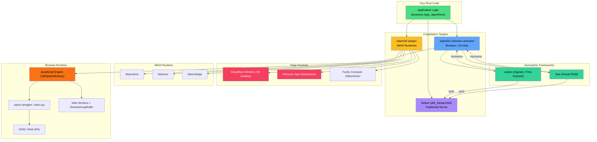

# WebAssembly & The Edge: Rust in the Browser and Beyond

## Speaker Intro

I'm an edge architecture lead and WebAssembly toolchain contributor with nearly two decades of production experience spanning V8 internals, distributed CDN systems, and Rust compiler infrastructure. I've deployed Wasm modules serving billions of requests per day at the CDN edge, contributed to `wasm-bindgen` and the WASI specification, and migrated multiple high-traffic Node.js services to Rust+Wasm — achieving 10–100× latency reductions in the process. Before the Wasm era, I spent years inside V8's TurboFan JIT pipeline and Chromium's rendering engine, which gave me an almost pathological awareness of every CPU cycle wasted at the JavaScript/native boundary. This guide distills everything I've learned about making Rust and WebAssembly work together in production — from the browser tab to the CDN edge node.

## What This Book Covers

This is a deep-dive engineering guide to **WebAssembly with Rust** — compiling Rust to a sandboxed, portable bytecode format that runs inside browsers, on edge servers, and anywhere a Wasm runtime exists. We start from first principles — **what a linear memory is, why there's no OS, and why `std::thread::spawn` panics in the browser** — and build upward through JS interop, full-stack isomorphic web frameworks, the WASI capabilities model, and production edge deployments with sub-millisecond cold starts.

This is not a "Hello, Wasm" tutorial. This is the guide you hand to a principal engineer on day one of a Wasm migration.

## Who This Is For

- **Rust backend engineers moving to the frontend** who are comfortable with ownership, lifetimes, and async but have never shipped code that runs inside a browser's JavaScript engine.
- **Node.js / React developers** who need C++-level performance on the web — image processing, cryptography, codecs, physics simulations — without writing C++ or managing Emscripten toolchains.
- **Platform engineers building edge infrastructure** evaluating Wasm as a lightweight, secure, polyglot alternative to containers and Lambda functions.
- **Technical leads assessing Wasm** for performance-critical workloads and need a rigorous understanding of the JS/Wasm boundary overhead, memory model, and ecosystem maturity.

## Prerequisites

| Concept | Where to Learn |
|---|---|
| Rust ownership, borrowing, lifetimes | *The Rust Programming Language* (The Book) |
| Async/await, `Future`, `Pin`, Tokio basics | [Async Rust](../async-book/src/SUMMARY.md) companion guide |
| Basic JavaScript: Promises, `async/await`, `fetch`, DOM APIs | MDN Web Docs |
| HTTP fundamentals: request/response, headers, status codes | Any web development reference |
| `unsafe` Rust and raw pointers (helpful, not required) | [Unsafe Rust & FFI](../unsafe-ffi-book/src/SUMMARY.md) companion guide |
| Memory layout: stack vs heap, alignment, padding | [Rust Memory Management](../memory-management-book/src/SUMMARY.md) companion guide |

## How to Use This Book

| Symbol | Meaning |
|---|---|
| 🟢 | **Foundational** — start here, even if you've shipped Wasm before |
| 🟡 | **Intermediate** — requires the preceding chapters |
| 🔴 | **Advanced** — deep internals, production patterns, expert-level |
| 💥 | Code that compiles but **panics in the browser** or violates the Wasm sandbox |
| ✅ | The idiomatic, zero-copy, boundary-aware fix |

Read Part I sequentially — it builds the mental model of the Wasm sandbox that every subsequent chapter depends on. Parts II and III can be read based on your immediate needs (frontend frameworks vs. edge deployments), but the Capstone (Chapter 8) assumes all prior material.

## Pacing Guide

| Chapters | Topic | Time | Checkpoint |
|---|---|---|---|
| 0–1 | Introduction, Wasm linear memory model | 2–3 hours | Can compile Rust to `.wasm`, load it in a browser, and call exported functions |
| 2 | `wasm-bindgen`, `js-sys`, `web-sys` | 4–6 hours | Can manipulate the DOM from Rust, pass strings across the boundary efficiently |
| 3 | Web Workers, `SharedArrayBuffer`, atomics | 4–6 hours | Can run parallel Rust computations in the browser without blocking the main thread |
| 4 | Leptos & Yew frameworks | 4–6 hours | Can build a reactive single-page application entirely in Rust |
| 5 | SSR & hydration | 4–6 hours | Can share Rust structs between server and client, render on the server, hydrate on the client |
| 6 | WASI capabilities model | 3–4 hours | Can compile and run a Wasm module with sandboxed file and network access |
| 7 | Edge deployments (Cloudflare Workers, Fermyon Spin) | 4–6 hours | Can deploy a Rust Wasm service to the CDN edge with sub-millisecond cold starts |
| 8 | Capstone: Edge Image Processor | 6–8 hours | Full production stack — edge compute + Leptos frontend + zero-copy memory management |
| Appendix | Reference card | — | Quick-reference for daily work |

**Total estimated time:** 30–45 hours for a thorough pass.

## Table of Contents

### Part I: The Browser Boundary
1. **Linear Memory and `wasm32-unknown-unknown`** 🟢 — What WebAssembly actually is (a stack-based virtual machine). The linear memory model. Why there's no OS, no heap allocator by default, and no garbage collector. Why `std::thread::spawn` and `std::fs::read` panic.
2. **Bridging the Gap with `wasm-bindgen`** 🟡 — The hidden cost of crossing the JS/Rust boundary. UTF-8 → UTF-16 string conversions. Passing complex types. Using `js-sys` and `web-sys` to manipulate the DOM directly from Rust. The `#[wasm_bindgen]` attribute in depth.
3. **Multithreading in the Browser** 🔴 — Why `std::thread` doesn't work. Web Workers and `SharedArrayBuffer` for true concurrency. Passing Rust closures to JavaScript with `Closure::wrap`. `wasm-bindgen-rayon` for data-parallel computation in the browser.

### Part II: Full-Stack Isomorphic Rust
4. **UI Frameworks: Leptos & Yew** 🟡 — The shift from JavaScript SPAs to Rust. Virtual DOM (Yew) vs. Fine-Grained Reactivity / Signals (Leptos). Component models, event handling, and routing — all in Rust.
5. **Server-Side Rendering (SSR) and Hydration** 🔴 — Sharing the exact same Rust structs between your Axum backend and your Wasm frontend. Rendering HTML on the server, streaming it to the client, and hydrating event listeners seamlessly.

### Part III: Out of the Browser (WASI & The Edge)
6. **The WebAssembly System Interface (WASI)** 🟡 — `wasm32-wasip1`. Why Wasm is "the next Docker." The capabilities-based security model. Why modules must be explicitly granted access to directories and network sockets.
7. **Rust at the Edge** 🔴 — Deploying Wasm to Cloudflare Workers and Fermyon Spin. Achieving zero cold-starts. Handling HTTP requests at the CDN edge without a traditional server. Key-value stores, durable objects, and edge state.

### Part IV: Capstone Project
8. **Capstone: The Edge-Rendered Image Processor** 🔴 — Build a production-grade, hyper-fast image manipulation pipeline: a headless WASI edge module for server-side processing, a Leptos frontend for uploads and real-time preview, zero-copy memory management across the JS/Wasm boundary, and proper `Result` → `Promise` error propagation.

### Appendices
- **Summary and Reference Card** — Cheat sheet for `wasm-bindgen` attributes, `web-sys` feature flags, JS↔Rust type equivalencies, WASI capability flags, and edge platform deployment commands.

## The WebAssembly Landscape

## Companion Guides

This book is designed to be read alongside these companion guides in the Rust Training series:

| Guide | Relevance |
|---|---|
| [Memory Management](../memory-management-book/src/SUMMARY.md) | Wasm linear memory is a flat byte array — understanding Rust's allocator, layout, and alignment is critical for zero-copy boundary crossings. |
| [Async Rust](../async-book/src/SUMMARY.md) | Server-side rendering, edge workers, and `wasm-bindgen-futures` all build on `Future`, `Pin`, and `Poll`. |
| [Microservices](../microservices-book/src/SUMMARY.md) | The edge deployment chapters (6–7) complement the Axum/Tonic patterns in the microservices guide — same Rust, different runtime. |
| [Embedded / `no_std`](../embedded-book/src/SUMMARY.md) | The browser Wasm target is spiritually similar to `no_std` — no filesystem, no threads, no OS. Many constraints overlap. |
| [Unsafe Rust & FFI](../unsafe-ffi-book/src/SUMMARY.md) | `wasm-bindgen` generates FFI glue. Understanding raw pointers and ABI boundaries helps debug serialization issues. |
| [Type-Driven Correctness](../type-driven-correctness-book/src/SUMMARY.md) | Typestate patterns ensure compile-time safety for resource handles that cross the JS/Wasm boundary. |
