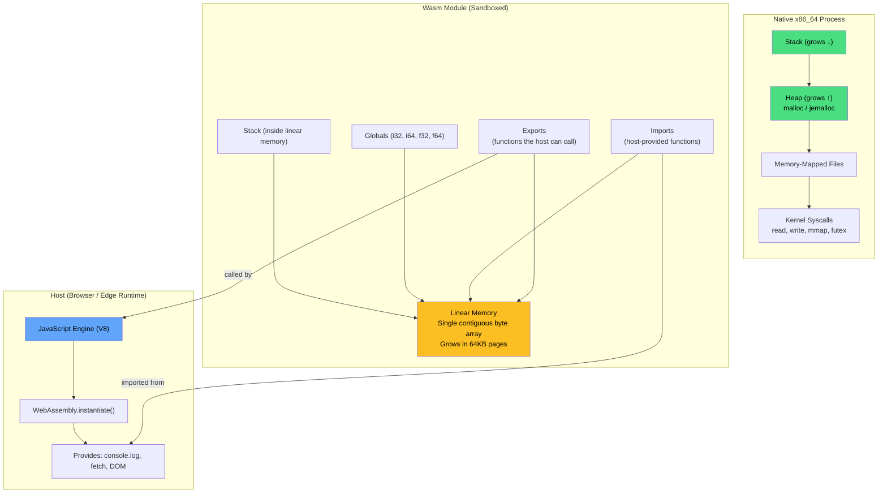
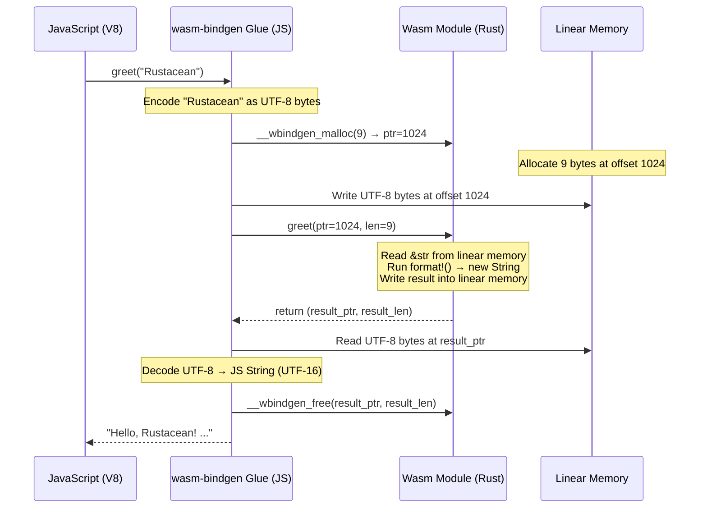
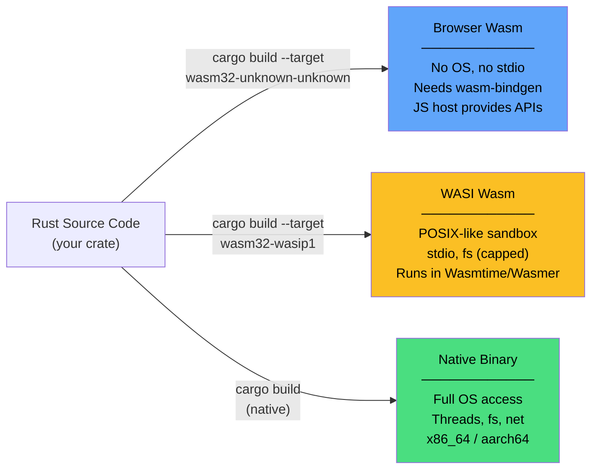

# 1. Linear Memory and `wasm32-unknown-unknown` 🟢

> **What you'll learn:**
> - What WebAssembly actually is — a stack-based virtual machine, not a CPU architecture.
> - The linear memory model: a single, flat, contiguous byte array — no OS, no heap, no GC.
> - Why `std::thread::spawn`, `std::fs::read`, and `println!` panic or fail on the `wasm32-unknown-unknown` target.
> - How to compile your first Rust binary to `.wasm` and load it in a browser.

---

## What WebAssembly Actually Is

WebAssembly (Wasm) is not a programming language. It's not an assembly language for a real CPU. It is a **portable, sandboxed bytecode format** — a specification for a virtual stack machine that any host (browser, edge runtime, IoT device) can execute safely.

Think of it this way:

| Concept | Native Binary | WebAssembly |
|---|---|---|
| **ISA** | x86_64, ARM64 — physical silicon | Virtual stack machine — no real hardware |
| **Memory** | Virtual address space managed by OS (mmap, brk) | A single flat byte array ("linear memory"), grown page-by-page |
| **System calls** | `read(2)`, `write(2)`, `mmap(2)` — OS kernel | **None.** The host must *import* capabilities into the module |
| **Threads** | OS threads (`pthread_create`, `std::thread::spawn`) | **None by default.** Requires Web Workers + `SharedArrayBuffer` |
| **Garbage collection** | N/A for Rust | N/A — Wasm is unmanaged, like C. Rust's ownership model maps perfectly. |
| **Security** | Process isolation via OS kernel | **Sandbox isolation** — Wasm cannot access host memory, files, or network unless explicitly granted |



### The Stack Machine Model

A Wasm module is a sequence of instructions that operate on a **virtual stack**. There are no registers (unlike x86 or ARM). Every instruction pops operands from the stack, performs an operation, and pushes results back.

```wasm
;; WebAssembly Text Format (WAT) — human-readable Wasm
(module
  (func $add (param $a i32) (param $b i32) (result i32)
    local.get $a    ;; push $a onto the stack
    local.get $b    ;; push $b onto the stack
    i32.add         ;; pop two i32s, push their sum
  )
  (export "add" (func $add))
)
```

When Rust compiles to `wasm32-unknown-unknown`, it targets this stack machine. LLVM's Wasm backend converts your Rust into these stack operations, and the resulting `.wasm` binary is a compact sequence of these instructions.

### The Four Wasm Value Types

Wasm has exactly **four** numeric types. That's it. No strings, no structs, no pointers-as-types:

| Type | Rust Equivalent | Size | Notes |
|---|---|---|---|
| `i32` | `i32` / `u32` / `*const T` | 4 bytes | **Pointers are i32** in wasm32 |
| `i64` | `i64` / `u64` | 8 bytes | |
| `f32` | `f32` | 4 bytes | IEEE 754 |
| `f64` | `f64` | 4 bytes | IEEE 754 |

This has a critical implication: **you cannot pass a `String`, a `Vec<u8>`, or any compound type directly across the Wasm boundary.** You can only pass numbers. Everything else must be serialized into linear memory and communicated via pointer + length.

---

## Linear Memory: The Single Flat Byte Array

Linear memory is WebAssembly's only data storage (aside from the stack and globals). It is:

1. **Contiguous** — a single flat `[u8]` slice starting at address 0.
2. **Page-granular** — grows in chunks of 64 KiB (65,536 bytes). A fresh module starts with 0 or more pages.
3. **Bounds-checked** — every memory access is validated against the current size. Out-of-bounds access traps (panics), it does **not** corrupt adjacent memory like a native buffer overflow would.
4. **Shared with the host** — JavaScript can read and write into the same byte array via `WebAssembly.Memory`.

```rust
// When Rust targets wasm32-unknown-unknown, ALL allocations
// (stack frames, heap data, static data) live inside this linear memory.

// A Vec<u8> on native:
//   - metadata (ptr, len, cap) on the stack
//   - data buffer on the heap (backed by mmap/brk)
//
// A Vec<u8> on wasm32:
//   - metadata (ptr, len, cap) on the wasm stack (inside linear memory)
//   - data buffer in the wasm heap (ALSO inside linear memory)
//   - ptr is an i32 offset into the SAME byte array
```

### Memory Layout Inside Linear Memory

```
Linear Memory (single contiguous byte array)
┌─────────────────────────────────────────────────────┐
│ Address 0x0000                                      │
│ ┌─────────────────────────────────────────────────┐ │
│ │         Static Data (.data, .rodata)            │ │
│ │         String literals, constants              │ │
│ ├─────────────────────────────────────────────────┤ │
│ │         Heap (dlmalloc by default)              │ │
│ │         Vec, String, Box allocations            │ │
│ │              grows ↓                            │ │
│ ├─────────────────────────────────────────────────┤ │
│ │              Free space                         │ │
│ ├─────────────────────────────────────────────────┤ │
│ │              grows ↑                            │ │
│ │         Stack (function frames, locals)         │ │
│ │         __stack_pointer global                  │ │
│ └─────────────────────────────────────────────────┘ │
│ Address 0xNNNN (current memory size)                │
└─────────────────────────────────────────────────────┘
```

The Rust `wasm32-unknown-unknown` target ships with `dlmalloc` as its default allocator. When you create a `Vec::with_capacity(1024)`, `dlmalloc` carves out 1024 bytes from the linear memory's heap region. If the heap is exhausted, the allocator calls `memory.grow` to request more 64 KiB pages from the Wasm runtime.

### The Boundary Problem: Pointers Are Just Offsets

In native Rust, a pointer like `0x7ffd5e3a1000` is a virtual address managed by the OS. In Wasm, a pointer like `1024` means "byte offset 1024 from the start of linear memory." This is crucial because:

1. **JavaScript can read this memory directly** — `new Uint8Array(wasmMemory.buffer, 1024, length)` gives JS a view into the same bytes Rust is using.
2. **But nobody manages ownership across the boundary** — if Rust frees that memory while JS is still reading it, you get use-after-free. If JS writes into Rust's heap metadata, you corrupt the allocator.

```javascript
// JavaScript side — reading Rust's linear memory
const memory = wasmInstance.exports.memory;
const ptr = wasmInstance.exports.get_data_ptr();  // Returns an i32 offset
const len = wasmInstance.exports.get_data_len();  // Returns an i32 length

// Create a VIEW (not a copy!) into Wasm's linear memory
const view = new Uint8Array(memory.buffer, ptr, len);
console.log(view); // We're reading Rust's heap directly

// ⚠️ DANGER: if memory.grow() is called (by Rust allocating more data),
// memory.buffer is DETACHED and `view` becomes invalid!
```

This "detached buffer" problem is one of the most common Wasm bugs. We'll solve it properly in Chapter 2 with `wasm-bindgen`.

---

## What Doesn't Work: The Missing OS

The `wasm32-unknown-unknown` target triple tells the compiler: **"There is no operating system. There is no C runtime. There is nothing."** The second `unknown` means "unknown OS." This has devastating consequences for code that assumes an OS exists:

### `std::thread::spawn` — No Threads

```rust
use std::thread;

fn main() {
    // 💥 BROWSER PANIC: "operation not supported on this platform"
    // WebAssembly has no concept of OS threads.
    // The browser's main thread is a single-threaded event loop.
    let handle = thread::spawn(|| {
        println!("Hello from a thread!");
    });
    handle.join().unwrap();
}
```

```rust
// ✅ FIX: Use Web Workers (covered in Chapter 3)
// Web Workers are the browser's concurrency primitive.
// Each Worker gets its own Wasm instance.
// SharedArrayBuffer enables shared linear memory between Workers.
// wasm-bindgen-rayon provides a Rayon-compatible threadpool on Web Workers.
```

### `std::fs::read` — No Filesystem

```rust
use std::fs;

fn main() {
    // 💥 BROWSER PANIC: "operation not supported on this platform"
    // There is no filesystem in the browser sandbox.
    let data = fs::read("config.json").unwrap();
    println!("{}", String::from_utf8_lossy(&data));
}
```

```rust
// ✅ FIX: Use the Fetch API via web-sys
// Files in the browser come from HTTP requests or the File API.
use wasm_bindgen::prelude::*;
use wasm_bindgen_futures::JsFuture;
use web_sys::{Request, RequestInit, Response};

pub async fn fetch_config() -> Result<String, JsValue> {
    let resp: Response = JsFuture::from(
        web_sys::window().unwrap().fetch_with_str("/config.json")
    ).await?.dyn_into()?;
    let text = JsFuture::from(resp.text()?).await?;
    Ok(text.as_string().unwrap())
}
```

### `println!` — No stdout

```rust
fn main() {
    // 💥 This doesn't panic, but it goes NOWHERE.
    // wasm32-unknown-unknown has no file descriptors.
    // stdout is a no-op sink. Your logs vanish silently.
    println!("Am I printing? (No. Nobody is listening.)");
}
```

```rust
// ✅ FIX: Use web_sys::console for browser logging
use web_sys::console;

pub fn log(msg: &str) {
    console::log_1(&msg.into());
}
```

### Summary of Unavailable APIs

| API | Why It Fails | Alternative |
|---|---|---|
| `std::thread::spawn` | No OS threads | Web Workers + `SharedArrayBuffer` (Ch. 3) |
| `std::fs::read/write` | No filesystem | `fetch` API / `File` API via `web-sys` |
| `std::net::TcpStream` | No sockets | `fetch` / WebSocket via `web-sys` |
| `std::time::Instant` | No monotonic clock | `js_sys::Date::now()` or `web_sys::Performance` |
| `std::env::var` | No environment | Compile-time `cfg` or JS-side configuration |
| `println!` / `eprintln!` | No stdout/stderr | `web_sys::console::log_1` |
| `std::process::exit` | No process concept | `unreachable!()` or host-side teardown |

---

## Your First Wasm Binary

Let's compile Rust to WebAssembly and run it in a browser.

### Step 1: Install the Target

```bash
# Add the Wasm target to your Rust toolchain
rustup target add wasm32-unknown-unknown

# Install wasm-pack (the build tool for Rust → Wasm)
cargo install wasm-pack

# Optional: install wasm-tools for inspecting .wasm files
cargo install wasm-tools
```

### Step 2: Create the Project

```bash
cargo new --lib wasm-hello
cd wasm-hello
```

```toml
# Cargo.toml
[package]
name = "wasm-hello"
version = "0.1.0"
edition = "2021"

[lib]
crate-type = ["cdylib"]  # "C dynamic library" — required for Wasm

[dependencies]
wasm-bindgen = "0.2"
```

The `crate-type = ["cdylib"]` is critical. It tells the compiler to produce a dynamic library (a `.wasm` file) rather than an `.rlib` (Rust's native intermediate format).

### Step 3: Write the Rust Code

```rust
// src/lib.rs
use wasm_bindgen::prelude::*;

/// Exported to JavaScript as `greet(name: string): string`
#[wasm_bindgen]
pub fn greet(name: &str) -> String {
    format!("Hello, {name}! This string was built in Rust's linear memory.")
}

/// Exported to JavaScript as `add(a: number, b: number): number`
#[wasm_bindgen]
pub fn add(a: i32, b: i32) -> i32 {
    a + b
}

/// Exported to JavaScript as `fibonacci(n: number): BigInt`
#[wasm_bindgen]
pub fn fibonacci(n: u32) -> u64 {
    match n {
        0 => 0,
        1 => 1,
        _ => {
            let (mut a, mut b) = (0u64, 1u64);
            for _ in 2..=n {
                let temp = a + b;
                a = b;
                b = temp;
            }
            b
        }
    }
}
```

### Step 4: Build

```bash
wasm-pack build --target web
# Output:
#   pkg/wasm_hello_bg.wasm   ← The compiled WebAssembly binary
#   pkg/wasm_hello.js        ← The JS glue generated by wasm-bindgen
#   pkg/wasm_hello.d.ts      ← TypeScript type definitions
```

### Step 5: Load in a Browser

```html
<!DOCTYPE html>
<html>
<head><title>Rust + Wasm</title></head>
<body>
  <script type="module">
    // Import the JS glue generated by wasm-pack
    import init, { greet, add, fibonacci } from './pkg/wasm_hello.js';

    async function main() {
      // Initialize the Wasm module (downloads and compiles the .wasm file)
      await init();

      // Call Rust functions directly from JavaScript!
      console.log(greet("Rustacean"));  // "Hello, Rustacean! ..."
      console.log(add(40, 2));           // 42
      console.log(fibonacci(50));        // 12586269025n (BigInt)
    }

    main();
  </script>
</body>
</html>
```

### What Just Happened Under the Hood

When you called `greet("Rustacean")`, this is what *actually* happened:



Notice the **four boundary crossings** just to pass a string in and get one back:
1. **Allocate** into linear memory (`__wbindgen_malloc`)
2. **Write** the UTF-8 bytes into linear memory
3. **Call** the Rust function (which reads from + writes to linear memory)
4. **Read** the result bytes from linear memory and **free** them

For `add(40, 2)`, there was only **one** boundary crossing — `i32` values are passed directly on the Wasm stack. This is why **numeric-heavy code is fast and string-heavy code is slow** in Wasm interop. Chapter 2 will explore how to minimize these crossings.

---

## Inspecting the Wasm Binary

You can inspect what's actually in your `.wasm` file:

```bash
# Show the size
ls -lh pkg/wasm_hello_bg.wasm
# → 42K (tiny! A comparable JS bundle would be much larger)

# Dump the module's imports and exports
wasm-tools print pkg/wasm_hello_bg.wasm | head -30

# Show the custom sections (wasm-bindgen metadata, etc.)
wasm-tools dump pkg/wasm_hello_bg.wasm | grep "section"
```

Key things to look for:

| Section | What It Contains |
|---|---|
| `(memory ...)` | The linear memory declaration (initial + max pages) |
| `(export "memory" ...)` | The linear memory is exported for JS to access |
| `(export "greet" ...)` | Your `#[wasm_bindgen]` functions |
| `(import "wbg" ...)` | Functions imported from the JS glue |
| `(data ...)` | Static data segments (string literals, etc.) |

---

## The `wasm32-unknown-unknown` vs `wasm32-wasip1` Split

There are two primary Wasm targets in Rust. Understanding the difference is fundamental:

| Aspect | `wasm32-unknown-unknown` | `wasm32-wasip1` |
|---|---|---|
| **Host** | Browser / JS engine | Standalone Wasm runtime (Wasmtime, Wasmer) |
| **OS abstraction** | None — the "unknown" OS | WASI — a POSIX-like capability-based interface |
| **`std::fs`** | ❌ Panics | ✅ Works (with granted capabilities) |
| **`std::thread`** | ❌ Panics | ⚠️ `wasi-threads` proposal (experimental) |
| **`println!`** | No-op (silent) | ✅ Writes to host's stdout |
| **Entry point** | `#[wasm_bindgen]` exports | `fn main()` |
| **Use case** | Browser apps, JS interop | CLI tools, edge workers, server-side Wasm |
| **Interop layer** | `wasm-bindgen` / `web-sys` | WASI syscalls / Component Model |



We cover `wasm32-unknown-unknown` (browser) in Parts I–II and `wasm32-wasip1` (WASI / edge) in Part III.

---

## Understanding `wasm-pack` Build Targets

`wasm-pack` supports multiple output targets that determine how the JS glue is generated:

| `--target` | Output Format | Use Case |
|---|---|---|
| `web` | ES modules (`import init from ...`) | Modern browsers, Vite, direct `<script type="module">` |
| `bundler` | CommonJS/ESM for bundlers | Webpack, Rollup, Parcel |
| `nodejs` | CommonJS (`require(...)`) | Node.js scripts and tests |
| `no-modules` | Global `wasm_bindgen(...)` | Legacy browsers without module support |

For this book, we use `--target web` unless stated otherwise.

---

<details>
<summary><strong>🏋️ Exercise: Memory Inspector</strong> (click to expand)</summary>

**Challenge:** Write a Rust Wasm library that:
1. Exports a function `allocate_buffer(size: usize) -> *mut u8` that allocates a byte buffer and returns the pointer (as an `i32` offset into linear memory).
2. Exports a function `buffer_sum() -> u32` that sums all bytes in the last allocated buffer.
3. On the JavaScript side, write directly into the Wasm linear memory at the returned pointer, then call `buffer_sum()` to verify the bytes were written.

This exercise forces you to understand that Wasm pointers are just integer offsets and that JS can directly read/write linear memory.

<details>
<summary>🔑 Solution</summary>

**Rust side (`src/lib.rs`):**

```rust
use wasm_bindgen::prelude::*;
use std::cell::RefCell;

// Thread-local storage for our buffer reference.
// In wasm32-unknown-unknown, there IS only one thread, so this is safe.
thread_local! {
    static BUFFER: RefCell<Option<Vec<u8>>> = RefCell::new(None);
}

/// Allocate a buffer of `size` bytes and return its pointer.
/// JavaScript can write data directly to this address in linear memory.
#[wasm_bindgen]
pub fn allocate_buffer(size: usize) -> *mut u8 {
    // Create a zeroed Vec — this allocates in Wasm's linear memory
    let buf = vec![0u8; size];
    let ptr = buf.as_ptr() as *mut u8;

    // Store the Vec so it isn't dropped (which would free the memory)
    BUFFER.with(|b| {
        *b.borrow_mut() = Some(buf);
    });

    // Return the raw pointer — JS sees this as an i32 offset
    ptr
}

/// Sum all bytes in the last allocated buffer.
/// Call this AFTER writing data from JavaScript.
#[wasm_bindgen]
pub fn buffer_sum() -> u32 {
    BUFFER.with(|b| {
        b.borrow()
            .as_ref()
            .map(|buf| buf.iter().map(|&byte| byte as u32).sum())
            .unwrap_or(0)
    })
}

/// Return the length of the current buffer (so JS knows the bounds).
#[wasm_bindgen]
pub fn buffer_len() -> usize {
    BUFFER.with(|b| {
        b.borrow().as_ref().map(|buf| buf.len()).unwrap_or(0)
    })
}
```

**JavaScript side:**

```javascript
import init, { allocate_buffer, buffer_sum, buffer_len } from './pkg/wasm_hello.js';

async function main() {
    const wasm = await init();

    // Step 1: Ask Rust to allocate 10 bytes in linear memory
    const ptr = allocate_buffer(10);
    console.log(`Buffer allocated at offset: ${ptr}`);

    // Step 2: Get a view into Wasm's linear memory
    // wasm.memory is the WebAssembly.Memory object
    const memory = new Uint8Array(wasm.memory.buffer);

    // Step 3: Write bytes directly into Rust's allocation
    for (let i = 0; i < 10; i++) {
        memory[ptr + i] = i + 1;  // [1, 2, 3, 4, 5, 6, 7, 8, 9, 10]
    }

    // Step 4: Ask Rust to read those bytes and sum them
    const sum = buffer_sum();
    console.log(`Sum of bytes: ${sum}`);  // 55 (= 1+2+...+10)

    // Step 5: Verify from JS side
    const jsSum = Array.from(memory.slice(ptr, ptr + 10))
        .reduce((a, b) => a + b, 0);
    console.assert(sum === jsSum, "Rust and JS should see the same bytes!");
}

main();
```

**Key takeaways from this exercise:**

1. `allocate_buffer` returns a raw `i32` — it's just an offset into the flat byte array.
2. JavaScript accesses the same bytes via `new Uint8Array(wasm.memory.buffer)`.
3. Rust's `Vec` metadata (ptr, len, cap) keeps the allocation alive — if you drop the `Vec`, the memory is freed and JS would be accessing garbage.
4. **`memory.buffer` can be detached** if `memory.grow()` is called. In production, always re-create your `Uint8Array` view after any Rust call that might allocate.

</details>
</details>

---

> **Key Takeaways**
> - WebAssembly is a **sandboxed stack machine** with a flat linear memory model — no OS, no GC, no threads, no filesystem.
> - Rust's ownership model maps beautifully to Wasm's unmanaged memory — there is no GC to fight.
> - The `wasm32-unknown-unknown` target assumes **no host OS** — anything beyond pure computation must be imported from the JS host via `wasm-bindgen`.
> - Compound types (`String`, `Vec`, structs) **cannot cross the boundary directly** — they must be serialized into linear memory and passed as pointer + length.
> - Numeric types (`i32`, `f64`) cross the boundary with zero overhead — prefer numeric APIs for hot paths.
> - `memory.buffer` can be **detached** when linear memory grows — always re-create `Uint8Array` views after potential allocations.

> **See also:**
> - [Chapter 2: Bridging the Gap with `wasm-bindgen`](ch02-wasm-bindgen.md) — deep dive into the JS/Rust boundary layer.
> - [Memory Management companion guide](../memory-management-book/src/SUMMARY.md) — Rust's allocator, layout, and alignment in detail.
> - [Embedded Rust: Surviving Without `std`](../embedded-book/src/ch01-surviving-without-std.md) — the `no_std` mental model that directly parallels Wasm's constraints.
