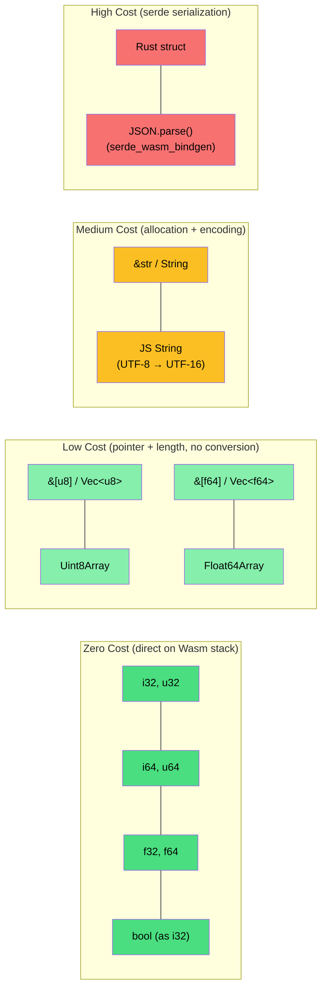
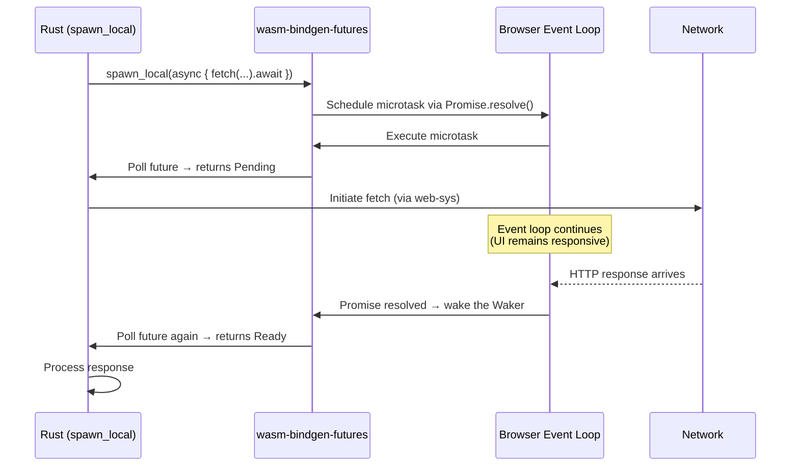

# 2. Bridging the Gap with `wasm-bindgen` 🟡

> **What you'll learn:**
> - How `wasm-bindgen` generates the JS↔Rust glue code and what it costs at each boundary crossing.
> - The hidden UTF-8 → UTF-16 conversion tax when passing strings, and how to avoid it.
> - How to use `js-sys` (ECMAScript builtins) and `web-sys` (Web APIs) to manipulate the DOM, call `fetch`, and use `console.log` — all from Rust.
> - Advanced patterns: `JsValue`, `Closure::wrap`, returning `Result<T, JsValue>`, and typed arrays for zero-copy data transfer.

---

## The Boundary Problem (Revisited)

In Chapter 1, we saw that Wasm can only pass four numeric types (`i32`, `i64`, `f32`, `f64`) across the boundary. Everything else — strings, structs, byte arrays — must be **serialized into linear memory** and communicated as pointer + length.

`wasm-bindgen` automates this serialization. But automation doesn't mean *free*. Every boundary crossing has a cost, and a boundary-obsessed engineer must understand what that cost is.



### The Cost Hierarchy

| Data Type | Boundary Cost | What Happens |
|---|---|---|
| `i32`, `f64`, `bool` | **Zero** | Passed directly on the Wasm operand stack |
| `&[u8]`, `Vec<u8>` | **Low** — memcpy only | JS glue copies bytes into/out of linear memory. No encoding. |
| `&[f32]`, `Vec<f64>` | **Low** — memcpy, typed view | JS `Float64Array` can view linear memory directly (careful: detach risk) |
| `&str`, `String` | **Medium** — encoding + alloc | UTF-8 (Rust) ↔ UTF-16 (JS). `TextEncoder`/`TextDecoder` in the glue. |
| Custom struct (via `serde`) | **High** — serialize + parse | Round-trips through JSON or a binary format. Multiple allocations. |
| Custom struct (via `#[wasm_bindgen]`) | **Medium** — opaque pointer | Struct stays in Wasm memory; JS gets a handle (destructor-bound). |

---

## The String Tax: UTF-8 vs UTF-16

This is the single most important performance concept in browser Wasm interop.

Rust strings are **UTF-8**: compact, variable-width, used by virtually everything outside JavaScript. JavaScript strings are **UTF-16**: fixed 2-byte code units, inherited from Java/Windows.

Every time a `String` crosses the JS/Wasm boundary, a **transcoding** happens:

```
Rust → JS:  UTF-8 bytes (in linear memory) → TextDecoder → JS String (UTF-16, in V8's heap)
JS → Rust:  JS String (UTF-16) → TextEncoder → UTF-8 bytes (written into linear memory)
```

### The Naive Way (String Round-Trip)

```rust
use wasm_bindgen::prelude::*;

// 💥 EXPENSIVE: Every call allocates in linear memory, transcodes UTF-8→UTF-16,
// then allocates AGAIN in linear memory for the result, and transcodes back.
#[wasm_bindgen]
pub fn process_text(input: String) -> String {
    // `input` was: JS String → UTF-16 → TextEncoder → UTF-8 → malloc into LM → Rust String
    let result = input.to_uppercase();
    // `result` will be: Rust String → UTF-8 bytes in LM → TextDecoder → JS String (UTF-16)
    result
    // Total: 2 allocations in linear memory + 2 transcodings + 1 V8 heap allocation
}
```

### The Boundary-Aware Way (Avoid Strings on Hot Paths)

```rust
use wasm_bindgen::prelude::*;

// ✅ FIX: Keep data as raw bytes. Let JavaScript handle the string at the edges.
// Process UTF-8 bytes directly — no transcoding needed.
#[wasm_bindgen]
pub fn process_bytes(input: &[u8]) -> Vec<u8> {
    // &[u8] crosses the boundary as a memcpy — no UTF-8/UTF-16 conversion.
    // This is just pointer + length on the Wasm side.
    input.iter().map(|b| b.to_ascii_uppercase()).collect()
}
```

```javascript
// JavaScript side — encode once, decode once, at the application boundary
const encoder = new TextEncoder();
const decoder = new TextDecoder();

const inputBytes = encoder.encode("hello wasm");    // UTF-16 → UTF-8 (once)
const outputBytes = process_bytes(inputBytes);       // Raw bytes, no transcoding
const result = decoder.decode(outputBytes);           // UTF-8 → UTF-16 (once)
console.log(result); // "HELLO WASM"
```

**Rule of thumb:** If you're processing text in Wasm (search, transform, parse), keep it as `&[u8]` inside Wasm and only convert to/from JS strings at the outermost boundary.

---

## `#[wasm_bindgen]` In Depth

The `#[wasm_bindgen]` attribute is the core macro that generates the JS↔Rust glue. Here's what it supports:

### Exporting Functions

```rust
use wasm_bindgen::prelude::*;

// Basic export: JS can call `add(2, 3)` → 5
#[wasm_bindgen]
pub fn add(a: i32, b: i32) -> i32 {
    a + b
}

// Rename for JavaScript: JS calls `computeHash(data)`
#[wasm_bindgen(js_name = "computeHash")]
pub fn compute_hash(data: &[u8]) -> u32 {
    // Simple FNV-1a hash for demonstration
    let mut hash: u32 = 2166136261;
    for &byte in data {
        hash ^= byte as u32;
        hash = hash.wrapping_mul(16777619);
    }
    hash
}

// Async function: returns a JS Promise
#[wasm_bindgen]
pub async fn fetch_data(url: String) -> Result<JsValue, JsValue> {
    let window = web_sys::window().unwrap();
    let resp = wasm_bindgen_futures::JsFuture::from(
        window.fetch_with_str(&url)
    ).await?;
    Ok(resp)
}
```

### Exporting Structs (Opaque Handles)

When you export a struct with `#[wasm_bindgen]`, the struct stays in Wasm linear memory. JavaScript receives an **opaque handle** — a wrapper object with methods that proxy back into Wasm. The struct is automatically freed when the JS wrapper is garbage-collected (via `FinalizationRegistry`).

```rust
use wasm_bindgen::prelude::*;

#[wasm_bindgen]
pub struct ImageProcessor {
    width: u32,
    height: u32,
    pixels: Vec<u8>,  // RGBA data, stays in linear memory
}

#[wasm_bindgen]
impl ImageProcessor {
    /// Constructor — called from JS as `new ImageProcessor(800, 600)`
    #[wasm_bindgen(constructor)]
    pub fn new(width: u32, height: u32) -> ImageProcessor {
        let size = (width * height * 4) as usize; // RGBA = 4 bytes per pixel
        ImageProcessor {
            width,
            height,
            pixels: vec![0; size],
        }
    }

    /// Load pixel data from a JS Uint8Array — memcpy, no transcoding
    pub fn load_pixels(&mut self, data: &[u8]) {
        self.pixels.copy_from_slice(data);
    }

    /// Apply a sepia filter (operates entirely in Wasm — zero boundary crossings)
    pub fn apply_sepia(&mut self) {
        for chunk in self.pixels.chunks_exact_mut(4) {
            let (r, g, b) = (chunk[0] as f32, chunk[1] as f32, chunk[2] as f32);
            chunk[0] = ((0.393 * r + 0.769 * g + 0.189 * b).min(255.0)) as u8;
            chunk[1] = ((0.349 * r + 0.686 * g + 0.168 * b).min(255.0)) as u8;
            chunk[2] = ((0.272 * r + 0.534 * g + 0.131 * b).min(255.0)) as u8;
            // Alpha (chunk[3]) unchanged
        }
    }

    /// Return a pointer to the pixel data in linear memory.
    /// JavaScript can create a Uint8Array view at this address.
    pub fn pixels_ptr(&self) -> *const u8 {
        self.pixels.as_ptr()
    }

    /// Return the pixel data length.
    pub fn pixels_len(&self) -> usize {
        self.pixels.len()
    }

    /// Return pixel data as a copy (safer but slower)
    pub fn get_pixels(&self) -> Vec<u8> {
        self.pixels.clone()
    }
}
```

```javascript
// JavaScript side
import init, { ImageProcessor } from './pkg/image_lib.js';

async function processImage() {
    const wasm = await init();

    // Create the processor — struct lives in Wasm linear memory
    const processor = new ImageProcessor(800, 600);

    // Load image data (from a canvas, file, etc.)
    const canvas = document.getElementById('canvas');
    const ctx = canvas.getContext('2d');
    const imageData = ctx.getImageData(0, 0, 800, 600);

    // Pass pixel bytes into Wasm — this is a memcpy, O(N) but no transcoding
    processor.load_pixels(imageData.data);

    // Apply the sepia filter — runs entirely inside Wasm, ZERO boundary crossings
    processor.apply_sepia();

    // Option A: Copy the result back (safe, but allocates)
    const result = processor.get_pixels(); // Returns a new Uint8Array (copy)

    // Option B: Zero-copy view into linear memory (fast, but fragile)
    const ptr = processor.pixels_ptr();
    const len = processor.pixels_len();
    const view = new Uint8Array(wasm.memory.buffer, ptr, len);
    // ⚠️ WARNING: `view` becomes invalid if Wasm allocates and triggers memory.grow!

    // Write result back to the canvas
    const output = new ImageData(new Uint8ClampedArray(view), 800, 600);
    ctx.putImageData(output, 0, 0);

    // Free the Rust struct — this calls Drop in Wasm
    processor.free();
}
```

### Importing JavaScript Functions

You can call JavaScript functions from Rust using `#[wasm_bindgen]` `extern "C"` blocks:

```rust
use wasm_bindgen::prelude::*;

#[wasm_bindgen]
extern "C" {
    // Import console.log — called as `log("message")` from Rust
    #[wasm_bindgen(js_namespace = console)]
    fn log(s: &str);

    // Import window.alert
    fn alert(s: &str);

    // Import a custom JS function defined in the host
    #[wasm_bindgen(js_namespace = myApp, js_name = "sendAnalytics")]
    fn send_analytics(event: &str, value: f64);

    // Import a JS type
    type HTMLDocument;
    #[wasm_bindgen(method, getter)]
    fn title(this: &HTMLDocument) -> String;
    #[wasm_bindgen(method, setter)]
    fn set_title(this: &HTMLDocument, title: &str);
}

#[wasm_bindgen]
pub fn init() {
    log("Wasm module initialized!");  // Calls console.log in JS
}
```

---

## `js-sys`: ECMAScript Built-ins from Rust

The `js-sys` crate provides Rust bindings to all ECMAScript standard built-in objects — `Array`, `Object`, `Map`, `Set`, `Date`, `Promise`, `RegExp`, `JSON`, and more.

```toml
# Cargo.toml
[dependencies]
wasm-bindgen = "0.2"
js-sys = "0.3"
```

```rust
use js_sys::{Array, Date, JSON, Map, Object, Promise, Reflect};
use wasm_bindgen::prelude::*;

#[wasm_bindgen]
pub fn js_sys_demo() -> JsValue {
    // Create a JS Array from Rust
    let arr = Array::new();
    arr.push(&JsValue::from_str("hello"));
    arr.push(&JsValue::from(42));
    arr.push(&JsValue::TRUE);

    // Create a JS Map
    let map = Map::new();
    map.set(&JsValue::from_str("key"), &JsValue::from(99));

    // Get the current date
    let now = Date::now(); // Milliseconds since epoch (f64)

    // Parse JSON
    let parsed = JSON::parse(r#"{"name": "Rustacean", "level": 42}"#).unwrap();

    // Read a property from a JS object using Reflect
    let name = Reflect::get(&parsed, &JsValue::from_str("name")).unwrap();

    // Return the JS object to JavaScript
    parsed
}
```

### When to Use `js-sys` vs Native Rust

| Operation | Use `js-sys`? | Reason |
|---|---|---|
| Date/time | ✅ Yes | `std::time` doesn't work in `wasm32-unknown-unknown` |
| Regex | ❌ No | Use the `regex` crate — it compiles to Wasm and is faster |
| JSON parsing | ⚠️ Depends | `serde_json` is faster for typed Rust structs; `js-sys::JSON` for JS interop |
| Math (`sin`, `cos`, `sqrt`) | ❌ No | Rust's `f64` methods compile directly to Wasm `f64.sqrt` etc. |
| Promises | ✅ Yes | Required for async JS interop (`wasm-bindgen-futures`) |
| Arrays/Maps as JS return values | ✅ Yes | When you need to return JS-native collection types |

---

## `web-sys`: The Entire Web Platform from Rust

The `web-sys` crate provides bindings to **every Web API** — DOM, `fetch`, Canvas, WebGL, WebSocket, `IntersectionObserver`, Web Workers, and hundreds more. Each API is gated behind a Cargo feature flag to keep binary size minimal.

```toml
# Cargo.toml
[dependencies]
wasm-bindgen = "0.2"
web-sys = { version = "0.3", features = [
    "Window",
    "Document",
    "Element",
    "HtmlElement",
    "HtmlCanvasElement",
    "CanvasRenderingContext2d",
    "console",
    "Headers",
    "Request",
    "RequestInit",
    "RequestMode",
    "Response",
    "Performance",
]}
```

### DOM Manipulation from Rust

```rust
use wasm_bindgen::prelude::*;
use web_sys::{Document, Element, HtmlElement, Window};

#[wasm_bindgen(start)]
pub fn main() -> Result<(), JsValue> {
    let window: Window = web_sys::window().unwrap();
    let document: Document = window.document().unwrap();
    let body: HtmlElement = document.body().unwrap();

    // Create a new <div> element
    let div: Element = document.create_element("div")?;
    div.set_id("rust-app");
    div.set_inner_html("<h1>Hello from Rust!</h1>");
    div.set_attribute("style", "color: #e94560; font-family: monospace;")?;

    // Append to body
    body.append_child(&div)?;

    // Add a click handler
    let closure = Closure::wrap(Box::new(move || {
        web_sys::console::log_1(&"Div clicked!".into());
    }) as Box<dyn FnMut()>);

    div.add_event_listener_with_callback("click", closure.as_ref().unchecked_ref())?;
    closure.forget(); // Prevent the closure from being dropped (leak it intentionally)
    // In production, store the Closure and drop it when removing the listener.

    Ok(())
}
```

### Typed Array Zero-Copy Pattern

For numeric data (images, audio, scientific computing), you can avoid copying entirely by sharing a view into linear memory:

```rust
use wasm_bindgen::prelude::*;
use js_sys::{Float64Array, Uint8Array};

#[wasm_bindgen]
pub struct DataBuffer {
    data: Vec<f64>,
}

#[wasm_bindgen]
impl DataBuffer {
    #[wasm_bindgen(constructor)]
    pub fn new(size: usize) -> DataBuffer {
        DataBuffer {
            data: vec![0.0; size],
        }
    }

    /// Fill with sample data
    pub fn fill_sine_wave(&mut self, frequency: f64) {
        let len = self.data.len() as f64;
        for (i, val) in self.data.iter_mut().enumerate() {
            *val = (2.0 * std::f64::consts::PI * frequency * (i as f64) / len).sin();
        }
    }

    /// The Naive/Expensive Way: copy data to a new JS array
    pub fn get_data_copy(&self) -> Vec<f64> {
        // 💥 EXPENSIVE: Allocates a Vec, copies all f64s, then wasm-bindgen
        // copies AGAIN into a new Float64Array on the JS side.
        // For 1 million f64s = 16 MB copied twice = 32 MB of allocation churn.
        self.data.clone()
    }

    /// The Zero-Copy Wasm Way: return a view into linear memory
    pub fn get_data_view(&self) -> Float64Array {
        // ✅ ZERO-COPY: Creates a Float64Array that points directly into
        // Wasm linear memory. No allocation, no copy.
        // ⚠️ CAUTION: This view is invalidated if memory.grow() is called!
        unsafe {
            Float64Array::view(&self.data)
        }
    }
}
```

```javascript
// JavaScript side — performance comparison
const buf = new DataBuffer(1_000_000); // 1M f64s = 8 MB
buf.fill_sine_wave(440.0);

// Naive: ~16ms — copies 8 MB from linear memory to JS heap
console.time('copy');
const copied = buf.get_data_copy();
console.timeEnd('copy');

// Zero-copy: ~0.01ms — just wraps a pointer, no data movement
console.time('view');
const viewed = buf.get_data_view();
console.timeEnd('view');

// ⚠️ CRITICAL: After any Wasm call that might allocate (grow memory),
// `viewed` may be INVALID. Always re-create views after allocations.
```

---

## Handling Errors: `Result<T, JsValue>` → Promise Rejections

Rust's `Result` type maps naturally to JavaScript's Promise rejections via `wasm-bindgen`:

```rust
use wasm_bindgen::prelude::*;
use wasm_bindgen_futures::JsFuture;
use web_sys::{Request, RequestInit, RequestMode, Response};

/// Fetch a URL and return the response body as a string.
/// On error, the Promise rejects with a descriptive JS Error.
#[wasm_bindgen]
pub async fn fetch_text(url: &str) -> Result<String, JsValue> {
    // Build the request
    let mut opts = RequestInit::new();
    opts.method("GET");
    opts.mode(RequestMode::Cors);

    let request = Request::new_with_str_and_init(url, &opts)
        .map_err(|e| JsValue::from_str(&format!("Failed to create request: {:?}", e)))?;

    // Fetch
    let window = web_sys::window().ok_or_else(|| JsValue::from_str("No window"))?;
    let resp_value = JsFuture::from(window.fetch_with_request(&request)).await?;
    let resp: Response = resp_value.dyn_into()
        .map_err(|_| JsValue::from_str("Response was not a Response object"))?;

    // Check status
    if !resp.ok() {
        return Err(JsValue::from_str(&format!(
            "HTTP {}: {}",
            resp.status(),
            resp.status_text()
        )));
    }

    // Read body
    let text = JsFuture::from(resp.text()?).await?;
    text.as_string().ok_or_else(|| JsValue::from_str("Body was not a string"))
}
```

```javascript
// JavaScript side — errors become Promise rejections
try {
    const body = await fetch_text("https://httpbin.org/get");
    console.log("Success:", body);
} catch (err) {
    // `err` is the JsValue from Rust's Err(...)
    console.error("Rust error:", err);
}
```

### Error Conversion Pattern

For production code, define a custom error type that converts cleanly:

```rust
use wasm_bindgen::prelude::*;
use std::fmt;

/// A domain error that converts to a JS Error object.
#[derive(Debug)]
pub enum AppError {
    Network(String),
    Parse(String),
    Validation(String),
}

impl fmt::Display for AppError {
    fn fmt(&self, f: &mut fmt::Formatter<'_>) -> fmt::Result {
        match self {
            AppError::Network(msg) => write!(f, "NetworkError: {msg}"),
            AppError::Parse(msg) => write!(f, "ParseError: {msg}"),
            AppError::Validation(msg) => write!(f, "ValidationError: {msg}"),
        }
    }
}

impl From<AppError> for JsValue {
    fn from(err: AppError) -> JsValue {
        // Create a proper JS Error object (not just a string)
        let js_err = js_sys::Error::new(&err.to_string());
        js_err.set_name(match &err {
            AppError::Network(_) => "NetworkError",
            AppError::Parse(_) => "ParseError",
            AppError::Validation(_) => "ValidationError",
        });
        js_err.into()
    }
}

#[wasm_bindgen]
pub fn validate_email(email: &str) -> Result<(), JsValue> {
    if !email.contains('@') {
        return Err(AppError::Validation("Missing @ symbol".into()).into());
    }
    Ok(())
}
```

---

## `wasm-bindgen-futures`: Bridging Rust Futures and JS Promises

The `wasm-bindgen-futures` crate provides the glue between Rust's `async/await` and JavaScript's `Promise`:

| Direction | Function | What It Does |
|---|---|---|
| JS → Rust | `JsFuture::from(promise)` | Converts a JS `Promise` into a Rust `Future` (`.await`-able) |
| Rust → JS | `#[wasm_bindgen] pub async fn ...` | Automatically wraps the return in a `Promise` |
| Rust → JS | `wasm_bindgen_futures::spawn_local(future)` | Spawns a Rust `Future` on the browser's microtask queue |

```rust
use wasm_bindgen::prelude::*;
use wasm_bindgen_futures::{spawn_local, JsFuture};

/// spawn_local: fire-and-forget async task on the main thread
#[wasm_bindgen(start)]
pub fn main() {
    spawn_local(async {
        // This runs on the browser's microtask queue (like a Promise.resolve().then(...))
        let window = web_sys::window().unwrap();
        let resp = JsFuture::from(window.fetch_with_str("/api/data")).await.unwrap();
        web_sys::console::log_1(&"Fetch complete!".into());
    });
}
```

### How `spawn_local` Works Under the Hood



**Critical insight:** `spawn_local` does **not** create a new thread. It schedules the future on the same thread's microtask queue. If your future does CPU-heavy work between `.await` points, it **blocks the browser's main thread** and freezes the UI. For CPU-heavy work, use Web Workers (Chapter 3).

---

## Closure Leaking and Memory Management

When you pass a Rust closure to JavaScript (as an event listener, callback, etc.), you must manage its lifetime carefully:

```rust
use wasm_bindgen::prelude::*;
use wasm_bindgen::closure::Closure;

#[wasm_bindgen]
pub fn setup_click_handler() {
    let document = web_sys::window().unwrap().document().unwrap();
    let button = document.get_element_by_id("my-btn").unwrap();

    // Create a closure that JavaScript can call
    let closure = Closure::wrap(Box::new(|| {
        web_sys::console::log_1(&"Button clicked!".into());
    }) as Box<dyn FnMut()>);

    // Pass the closure to JavaScript as an event listener
    button.add_event_listener_with_callback(
        "click",
        closure.as_ref().unchecked_ref(),
    ).unwrap();

    // ⚠️ CRITICAL DECISION POINT:
    // Option A: closure.forget() — LEAKS the closure (never freed)
    //   Use when the listener lives for the entire page lifetime.
    closure.forget();

    // Option B: Store the closure and drop it later
    //   Use when you need to remove the listener.
    // BUFFER.with(|b| b.borrow_mut().push(closure));
}
```

### The Closure Lifecycle Table

| Pattern | When to Use | Memory Impact |
|---|---|---|
| `closure.forget()` | Page-lifetime listeners (global UI) | Small, fixed leak — acceptable |
| Store in `static` / `thread_local!` | Listeners you'll remove later | No leak — drop when done |
| `Closure::once(...)` | One-shot callbacks (e.g., `setTimeout`) | Auto-freed after single invocation |

```rust
use wasm_bindgen::prelude::*;
use wasm_bindgen::closure::Closure;

/// One-shot closure: automatically freed after first call
#[wasm_bindgen]
pub fn delayed_log(ms: i32) {
    let closure = Closure::once(move || {
        web_sys::console::log_1(&format!("Fired after {ms}ms!").into());
        // Closure is automatically dropped after this returns
    });

    web_sys::window()
        .unwrap()
        .set_timeout_with_callback_and_timeout_and_arguments_0(
            closure.as_ref().unchecked_ref(),
            ms,
        )
        .unwrap();

    closure.forget(); // For one-shot, this is fine — but Closure::once handles cleanup
}
```

---

## `serde-wasm-bindgen`: Structured Data Without JSON Strings

When you need to pass complex Rust structs to JavaScript, you have two options:

### Option A: JSON Round-Trip (Simple but Slow)

```rust
use serde::{Serialize, Deserialize};
use wasm_bindgen::prelude::*;

#[derive(Serialize, Deserialize)]
pub struct User {
    name: String,
    age: u32,
    scores: Vec<f64>,
}

// 💥 EXPENSIVE: Serializes to a JSON string, then JS JSON.parse()s it.
// Two allocations + two transcoding passes.
#[wasm_bindgen]
pub fn get_user_json() -> String {
    let user = User {
        name: "Alice".into(),
        age: 30,
        scores: vec![95.0, 87.5, 92.0],
    };
    serde_json::to_string(&user).unwrap()
}
```

### Option B: `serde-wasm-bindgen` (Direct JS Value Construction)

```rust
use serde::{Serialize, Deserialize};
use wasm_bindgen::prelude::*;

#[derive(Serialize, Deserialize)]
pub struct User {
    name: String,
    age: u32,
    scores: Vec<f64>,
}

// ✅ BETTER: Constructs JS objects directly via the `Reflect` API.
// No JSON string intermediate. No double-transcoding.
#[wasm_bindgen]
pub fn get_user() -> Result<JsValue, JsValue> {
    let user = User {
        name: "Alice".into(),
        age: 30,
        scores: vec![95.0, 87.5, 92.0],
    };
    serde_wasm_bindgen::to_value(&user).map_err(|e| JsValue::from_str(&e.to_string()))
}

#[wasm_bindgen]
pub fn update_user(val: JsValue) -> Result<JsValue, JsValue> {
    let mut user: User = serde_wasm_bindgen::from_value(val)
        .map_err(|e| JsValue::from_str(&e.to_string()))?;
    user.age += 1;
    serde_wasm_bindgen::to_value(&user).map_err(|e| JsValue::from_str(&e.to_string()))
}
```

```javascript
// JavaScript side
const user = get_user();         // Returns a plain JS object { name: "Alice", age: 30, scores: [...] }
console.log(user.name);          // "Alice" — it's a real JS object, not a JSON string
const updated = update_user(user); // Pass it back, get a modified copy
console.log(updated.age);        // 31
```

---

## Binary Size Optimization

Wasm binary size directly impacts load time. Every kilobyte matters on mobile. Here's how to minimize it:

```toml
# Cargo.toml
[profile.release]
opt-level = "z"     # Optimize for size (not speed)
lto = true          # Link-Time Optimization — eliminates dead code across crates
codegen-units = 1   # Single codegen unit — better optimizations, slower builds
strip = true        # Strip debug symbols

[profile.release.package."*"]
opt-level = "z"     # Optimize dependencies for size too
```

```bash
# After building, run wasm-opt for further size reduction
wasm-pack build --release --target web
wasm-opt -Oz -o pkg/optimized.wasm pkg/my_crate_bg.wasm
# Typical reduction: 30-50% smaller

# Compare sizes
ls -lh pkg/my_crate_bg.wasm pkg/optimized.wasm
```

| Technique | Typical Savings | Tradeoff |
|---|---|---|
| `opt-level = "z"` | 10–20% | Slightly slower runtime |
| `lto = true` | 15–30% | Slower compilation |
| `wasm-opt -Oz` | 20–40% | Requires `binaryen` installed |
| `strip = true` | 5–10% | No debug symbols |
| Minimize `web-sys` features | Variable | More verbose `Cargo.toml` |
| Avoid `serde_json` (use `serde-wasm-bindgen`) | ~50 KB | Different API |

---

<details>
<summary><strong>🏋️ Exercise: The Boundary Benchmark</strong> (click to expand)</summary>

**Challenge:** Build a Wasm library that:
1. Exports a `transform_strings(input: Vec<String>) -> Vec<String>` function that converts each string to uppercase.
2. Exports a `transform_bytes(input: &[u8], count: u32) -> Vec<u8>` function that interprets the input as newline-separated UTF-8 strings, uppercases them, and returns the result as concatenated bytes.
3. On the JavaScript side, benchmark both approaches with 10,000 strings and measure the time difference.

The goal is to viscerally feel the string-boundary tax.

<details>
<summary>🔑 Solution</summary>

**Rust side (`src/lib.rs`):**

```rust
use wasm_bindgen::prelude::*;

/// The Naive/Expensive Way: Passes Vec<String> across the boundary.
/// Each String requires UTF-8 ↔ UTF-16 transcoding.
/// For N strings: N allocations + N transcodings + JS array overhead.
#[wasm_bindgen]
pub fn transform_strings(input: Vec<String>) -> Vec<String> {
    input.into_iter().map(|s| s.to_uppercase()).collect()
}

/// The Zero-Copy Wasm Way: Passes raw bytes across the boundary.
/// One memcpy in, one memcpy out. Zero transcoding inside Wasm.
/// The bytes are newline-separated UTF-8 strings.
#[wasm_bindgen]
pub fn transform_bytes(input: &[u8]) -> Vec<u8> {
    // Process UTF-8 bytes directly — valid because to_ascii_uppercase
    // preserves UTF-8 validity for ASCII characters.
    let mut output = Vec::with_capacity(input.len());
    for &byte in input {
        if byte == b'\n' {
            output.push(b'\n');
        } else {
            output.push(byte.to_ascii_uppercase());
        }
    }
    output
}
```

**JavaScript side:**

```javascript
import init, { transform_strings, transform_bytes } from './pkg/my_crate.js';

async function benchmark() {
    await init();
    const N = 10_000;

    // Generate test data
    const strings = Array.from({ length: N }, (_, i) => `hello world item ${i}`);
    const joined = strings.join('\n');

    // Benchmark 1: Vec<String> (expensive — N string transcodings)
    const t1 = performance.now();
    const result1 = transform_strings(strings);
    const t2 = performance.now();
    console.log(`Vec<String>: ${(t2 - t1).toFixed(2)}ms`);

    // Benchmark 2: Raw bytes (cheap — one memcpy each way)
    const encoder = new TextEncoder();
    const decoder = new TextDecoder();
    const bytes = encoder.encode(joined);

    const t3 = performance.now();
    const resultBytes = transform_bytes(bytes);
    const result2 = decoder.decode(resultBytes).split('\n');
    const t4 = performance.now();
    console.log(`Raw bytes:   ${(t4 - t3).toFixed(2)}ms`);

    // Verify correctness
    console.assert(result1[0] === result2[0], "Results should match!");
    console.log(`Speedup: ${((t2 - t1) / (t4 - t3)).toFixed(1)}x`);
    // Typical result: 3-10x faster with raw bytes
}

benchmark();
```

**Expected results** (varies by browser/machine):

| Method | 10,000 strings | Explanation |
|---|---|---|
| `Vec<String>` | ~15–40ms | N allocations, N UTF-8→UTF-16 transcodings, N JS string constructions |
| Raw `&[u8]` | ~2–5ms | 1 memcpy in, 1 bulk operation, 1 memcpy out, 1 `TextDecoder` call |

The raw bytes approach is **3–10× faster** because it minimizes boundary crossings and avoids per-string transcoding overhead.

</details>
</details>

---

> **Key Takeaways**
> - **The cost hierarchy matters:** `i32` (free) → `&[u8]` (memcpy) → `String` (transcode) → `struct` (serialize). Design your API to use the cheapest type possible for hot paths.
> - **The string tax is real:** Every `String` crossing requires UTF-8 ↔ UTF-16 conversion. Keep text as raw bytes inside Wasm; encode/decode only at the outer boundary.
> - **`web-sys` feature flags control binary size:** Only enable the APIs you actually use. Check `Cargo.toml` before wondering why your `.wasm` is 500 KB.
> - **`Closure::wrap` leaks by default** — use `forget()` for page-lifetime callbacks, store the `Closure` for removable listeners, and prefer `Closure::once` for one-shot callbacks.
> - **`serde-wasm-bindgen` avoids the JSON round-trip** — construct JS objects directly via `Reflect`, saving both CPU time and binary size.
> - **Always optimize for size** in release builds: `opt-level = "z"`, `lto = true`, `wasm-opt -Oz`.

> **See also:**
> - [Chapter 1: Linear Memory](ch01-linear-memory.md) — the foundational memory model that explains *why* boundary crossings are expensive.
> - [Chapter 3: Multithreading in the Browser](ch03-multithreading-browser.md) — `SharedArrayBuffer` and `Closure` usage with Web Workers.
> - [Chapter 4: UI Frameworks](ch04-ui-frameworks.md) — how Leptos and Yew abstract away the `web-sys` boilerplate.
> - [Unsafe Rust & FFI companion guide](../unsafe-ffi-book/src/SUMMARY.md) — the `unsafe { Float64Array::view(...) }` pattern in depth.
