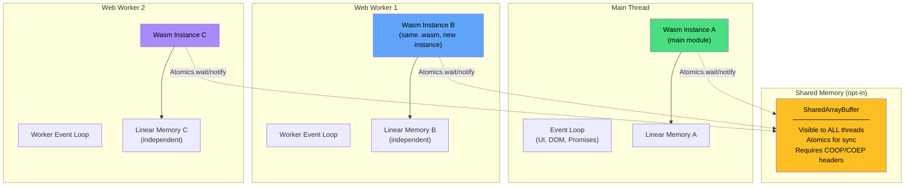
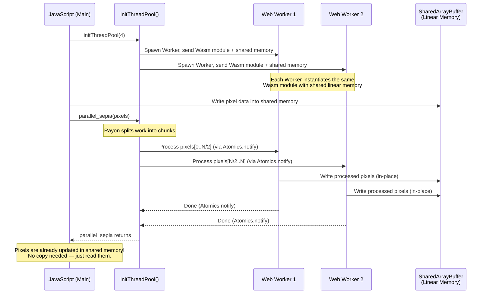

# 3. Multithreading in the Browser 🔴

> **What you'll learn:**
> - Why `std::thread::spawn` panics in Wasm and what the browser offers instead (Web Workers).
> - How `SharedArrayBuffer` enables true shared memory between Workers — and why it requires specific HTTP headers.
> - How to pass Rust closures to JavaScript Workers using `Closure::wrap` and structured cloning.
> - How `wasm-bindgen-rayon` gives you a Rayon-compatible threadpool running on Web Workers for data-parallel computation.

---

## Why There Are No Threads in Wasm

Recap from Chapter 1: the `wasm32-unknown-unknown` target has **no operating system**. OS threads are created via system calls (`pthread_create` on POSIX, `CreateThread` on Windows). Wasm has no system calls. Therefore:

```rust
use std::thread;

fn main() {
    // 💥 BROWSER PANIC: "operation not supported on this platform"
    // std::thread::spawn calls pthread_create, which doesn't exist in the Wasm sandbox.
    let handle = thread::spawn(|| 42);
    handle.join().unwrap();
}
```

But the browser **does** have concurrency. It's just not exposed through POSIX threads. The browser's concurrency model is:

| Primitive | What It Is | Shared Memory? | Use Case |
|---|---|---|---|
| **Event Loop** | Single-threaded cooperative scheduling | N/A | UI updates, I/O callbacks, Promises |
| **Web Workers** | Separate OS threads with isolated heaps | ❌ by default, ✅ with `SharedArrayBuffer` | CPU-heavy background tasks |
| **`SharedArrayBuffer`** | Shared byte array accessible from multiple Workers | ✅ | Parallel computation on shared data |
| **`Atomics`** | Atomic operations on `SharedArrayBuffer` | ✅ | Synchronization (mutexes, futexes, wait/notify) |



### The Two Concurrency Models

| Model | How It Works | When to Use |
|---|---|---|
| **Isolated Workers** | Each Worker gets its own Wasm instance with independent linear memory. Communication via `postMessage` (structured clone = copy). | Simple offloading — image decode, crypto hash on a background thread |
| **Shared Memory Workers** | All Workers share a `SharedArrayBuffer` as their Wasm linear memory. Synchronization via `Atomics`. | Parallel computation — matrix multiply, pixel processing, scientific simulations |

---

## Model 1: Isolated Web Workers (Message Passing)

The simplest model: spawn a Web Worker, give it its own Wasm module, send data via `postMessage`, and receive results back. No shared memory, no synchronization bugs — just message passing.

### The Blocking Problem

```rust
use wasm_bindgen::prelude::*;

// 💥 BROWSER FREEZE: This function takes 5 seconds of pure CPU.
// If called on the main thread, the browser UI is completely unresponsive.
// Scrolling, clicking, animations — all frozen.
#[wasm_bindgen]
pub fn expensive_computation(data: &[u8]) -> u64 {
    // Simulate heavy work: hash every byte 1000 times
    let mut result: u64 = 0;
    for _ in 0..1000 {
        for &byte in data {
            result = result.wrapping_mul(31).wrapping_add(byte as u64);
        }
    }
    result
}
```

```javascript
// 💥 MAIN THREAD — UI freezes during computation
const result = expensive_computation(largeData);
// Nothing renders until this returns. User sees a frozen page.
```

### The Fix: Offload to a Web Worker

```javascript
// ✅ FIX: main.js — spawn the work on a Worker
const worker = new Worker(new URL('./worker.js', import.meta.url), {
    type: 'module',
});

// Send data to the worker (structured clone = copy of the ArrayBuffer)
worker.postMessage({ data: largeUint8Array });

// Receive result without blocking the main thread
worker.onmessage = (event) => {
    console.log("Result:", event.data.result);
    // UI was responsive the entire time!
};
```

```javascript
// ✅ worker.js — runs on a separate OS thread
import init, { expensive_computation } from './pkg/my_crate.js';

// Initialize the Wasm module in the Worker
const wasmReady = init();

self.onmessage = async (event) => {
    await wasmReady;
    const { data } = event.data;

    // This blocks the WORKER's thread — but NOT the main thread.
    // The main thread's event loop continues running normally.
    const result = expensive_computation(data);

    // Send the result back to the main thread
    self.postMessage({ result });
};
```

### Cost of Message Passing

`postMessage` uses **structured cloning** — it deep-copies the data. For a 10 MB `ArrayBuffer`:

| Operation | Time | Notes |
|---|---|---|
| `postMessage` (copy) | ~2–5ms | Creates a fresh copy in the Worker's heap |
| `postMessage` (transfer) | ~0.01ms | **Moves** the `ArrayBuffer` — original becomes detached |
| Wasm computation | Variable | Runs on the Worker thread |
| Return `postMessage` | ~2–5ms | Copy result back |

**Use `Transferable` objects** to avoid copying large buffers:

```javascript
// ✅ Transfer (move) instead of copy — near-zero overhead
// The original `buffer` becomes detached and unusable on the sending side.
worker.postMessage({ data: buffer }, [buffer]);
// buffer.byteLength === 0 after this — it was moved, not copied
```

---

## Model 2: Shared Memory with `SharedArrayBuffer`

For truly parallel computation — where multiple Workers operate on the same data simultaneously — you need `SharedArrayBuffer`. This is the Wasm equivalent of shared-memory multithreading.

### Security Requirements: COOP/COEP Headers

After the Spectre vulnerability, browsers disabled `SharedArrayBuffer` by default. To re-enable it, your server **must** send these HTTP headers:

```
Cross-Origin-Opener-Policy: same-origin
Cross-Origin-Embedder-Policy: require-corp
```

```javascript
// Check if SharedArrayBuffer is available
if (typeof SharedArrayBuffer === 'undefined') {
    console.error(
        "SharedArrayBuffer not available! " +
        "Ensure COOP/COEP headers are set on your server."
    );
}
```

Without these headers, `SharedArrayBuffer` is `undefined` and the Wasm threads feature simply does not work. This is a **hard requirement** — there is no polyfill.

### Manual Shared Memory Setup

```javascript
// Create shared memory that all Workers can access
const memory = new WebAssembly.Memory({
    initial: 256,  // 256 pages = 16 MB
    maximum: 1024, // 1024 pages = 64 MB
    shared: true,  // ← This makes it a SharedArrayBuffer
});

// Import the compiled Wasm module
const { module } = await WebAssembly.compileStreaming(fetch('my_crate_bg.wasm'));

// Instantiate on the main thread with the shared memory
const mainInstance = await WebAssembly.instantiate(module, {
    env: { memory },
    // ... other imports
});

// Each Worker gets the SAME module and SAME memory
const worker = new Worker('worker.js');
worker.postMessage({ module, memory });
```

```javascript
// worker.js
self.onmessage = async ({ data: { module, memory } }) => {
    // Instantiate the SAME module with the SAME shared memory
    const instance = await WebAssembly.instantiate(module, {
        env: { memory },
    });

    // Now both threads read/write the same linear memory!
    // Use Atomics for synchronization to avoid data races.
};
```

---

## Passing Rust Closures to JavaScript with `Closure::wrap`

A common pattern: you want to create a callback in Rust that JavaScript calls later (event listener, Worker message handler, timer callback). `Closure::wrap` bridges this gap.

```rust
use wasm_bindgen::prelude::*;
use wasm_bindgen::closure::Closure;
use web_sys::Worker;

/// Spawn a Web Worker and attach a Rust closure as the message handler.
#[wasm_bindgen]
pub fn spawn_worker_with_callback() -> Result<Worker, JsValue> {
    // Create a new Web Worker
    let worker = Worker::new("./worker.js")?;

    // Create a Rust closure that handles messages from the Worker
    let onmessage = Closure::wrap(Box::new(move |event: web_sys::MessageEvent| {
        let data = event.data();
        web_sys::console::log_2(&"Worker sent:".into(), &data);

        // Process the result in Rust
        if let Some(result) = data.as_f64() {
            web_sys::console::log_1(
                &format!("Computation result: {result}").into()
            );
        }
    }) as Box<dyn FnMut(web_sys::MessageEvent)>);

    // Set the onmessage handler
    worker.set_onmessage(Some(onmessage.as_ref().unchecked_ref()));

    // Leak the closure — it must outlive the Worker.
    // If we drop it, the callback pointer becomes dangling.
    onmessage.forget();

    // Send work to the Worker
    worker.post_message(&JsValue::from(42))?;

    Ok(worker)
}
```

### Closure Lifetime Patterns for Workers

```rust
use wasm_bindgen::prelude::*;
use wasm_bindgen::closure::Closure;
use std::cell::RefCell;
use std::rc::Rc;

/// Pattern: Store the closure so it can be cleaned up later
#[wasm_bindgen]
pub struct WorkerHandle {
    worker: web_sys::Worker,
    // Store the closure to prevent it from being dropped
    _onmessage: Closure<dyn FnMut(web_sys::MessageEvent)>,
}

#[wasm_bindgen]
impl WorkerHandle {
    #[wasm_bindgen(constructor)]
    pub fn new(script_url: &str) -> Result<WorkerHandle, JsValue> {
        let worker = web_sys::Worker::new(script_url)?;
        let results: Rc<RefCell<Vec<f64>>> = Rc::new(RefCell::new(Vec::new()));

        let results_clone = results.clone();
        let onmessage = Closure::wrap(Box::new(move |event: web_sys::MessageEvent| {
            if let Some(val) = event.data().as_f64() {
                results_clone.borrow_mut().push(val);
            }
        }) as Box<dyn FnMut(web_sys::MessageEvent)>);

        worker.set_onmessage(Some(onmessage.as_ref().unchecked_ref()));

        Ok(WorkerHandle {
            worker,
            _onmessage: onmessage, // Stored — dropped when WorkerHandle is freed
        })
    }

    pub fn send(&self, value: f64) -> Result<(), JsValue> {
        self.worker.post_message(&JsValue::from(value))
    }

    /// Terminate the worker and clean up
    pub fn terminate(self) {
        self.worker.terminate();
        // self is dropped here, which drops _onmessage, freeing the closure
    }
}
```

---

## `wasm-bindgen-rayon`: Rayon on Web Workers

The `wasm-bindgen-rayon` crate provides a Rayon-compatible threadpool that runs on Web Workers with `SharedArrayBuffer`. This means you can use Rayon's `par_iter()`, `par_chunks()`, and other parallel iterators — and they'll execute across multiple browser threads.

### Setup

```toml
# Cargo.toml
[dependencies]
wasm-bindgen = "0.2"
rayon = "1.8"
wasm-bindgen-rayon = "1.2"

[target.'cfg(target_arch = "wasm32")'.dependencies]
# wasm-bindgen-rayon replaces Rayon's thread pool with Web Workers
wasm-bindgen-rayon = "1.2"
```

```rust
// src/lib.rs
use wasm_bindgen::prelude::*;
use rayon::prelude::*;

// This initializer is REQUIRED — it sets up the Web Worker threadpool.
// Call it from JavaScript before using any Rayon-based functions.
pub use wasm_bindgen_rayon::init_thread_pool;

/// Process pixels in parallel using Rayon's par_chunks_exact_mut.
/// On native: uses OS threads. On Wasm: uses Web Workers.
#[wasm_bindgen]
pub fn parallel_sepia(pixels: &mut [u8]) {
    // Each chunk is one RGBA pixel (4 bytes).
    // Rayon distributes chunks across Web Workers automatically.
    pixels.par_chunks_exact_mut(4).for_each(|chunk| {
        let (r, g, b) = (chunk[0] as f32, chunk[1] as f32, chunk[2] as f32);
        chunk[0] = (0.393 * r + 0.769 * g + 0.189 * b).min(255.0) as u8;
        chunk[1] = (0.349 * r + 0.686 * g + 0.168 * b).min(255.0) as u8;
        chunk[2] = (0.272 * r + 0.534 * g + 0.131 * b).min(255.0) as u8;
        // Alpha unchanged
    });
}

/// Parallel sort — uses Rayon's parallel merge sort
#[wasm_bindgen]
pub fn parallel_sort(data: &mut [f64]) {
    data.par_sort_unstable_by(|a, b| a.partial_cmp(b).unwrap());
}
```

```javascript
// JavaScript side
import init, { initThreadPool, parallel_sepia } from './pkg/my_crate.js';

async function main() {
    await init();

    // Initialize the Rayon threadpool with N web workers.
    // navigator.hardwareConcurrency gives the number of logical CPU cores.
    await initThreadPool(navigator.hardwareConcurrency);

    // Now Rayon's par_iter() uses Web Workers!
    const imageData = ctx.getImageData(0, 0, canvas.width, canvas.height);
    parallel_sepia(imageData.data);
    ctx.putImageData(imageData, 0, 0);
}

main();
```

### Build Configuration for Threads

Wasm threads require specific build flags:

```bash
# Build with atomics and shared memory support
RUSTFLAGS='-C target-feature=+atomics,+bulk-memory,+mutable-globals' \
  cargo build --target wasm32-unknown-unknown --release -Z build-std=std,panic_abort

# Or with wasm-pack (nightly required for -Z build-std)
RUSTFLAGS='-C target-feature=+atomics,+bulk-memory,+mutable-globals' \
  wasm-pack build --target web -- -Z build-std=std,panic_abort
```

| Flag | What It Enables |
|---|---|
| `+atomics` | Wasm atomic instructions (`i32.atomic.load`, `wait`, `notify`) |
| `+bulk-memory` | `memory.copy`, `memory.fill` — needed for efficient SharedArrayBuffer ops |
| `+mutable-globals` | Allows mutable globals (used by the thread pool for stack pointers) |
| `-Z build-std` | Rebuilds `std` with the above features enabled (nightly-only) |

### How It Works Under the Hood



---

## Native Threads vs Web Workers: A Comparison

| Aspect | `std::thread` (Native) | Web Workers (Browser) |
|---|---|---|
| **Creation** | `thread::spawn(closure)` — ~1µs | `new Worker(url)` — ~1-5ms (script fetch + init) |
| **Shared Memory** | Default — all threads share the process heap | Opt-in via `SharedArrayBuffer` + COOP/COEP headers |
| **Synchronization** | `Mutex`, `RwLock`, `Condvar`, atomics | `Atomics.wait()`, `Atomics.notify()`, atomics |
| **Message Passing** | `std::sync::mpsc` channels | `postMessage` (structured clone or transfer) |
| **Stack Size** | Configurable (default ~8 MB) | Worker has its own stack (default ~1 MB) |
| **Spawning Cost** | Low (~1µs for `spawn`) | High (~1-5ms for `new Worker`) — reuse a pool |
| **Max Threads** | OS-limited (typically thousands) | Browser-limited (typically 8-16 Workers) |
| **Thread-local Storage** | `thread_local!` macro | Each Worker has its own globals |
| **`Send`/`Sync` enforcement** | Compile-time via Rust's type system | Runtime — structured clone rejects non-cloneable types |

### The `!Send` Problem in Wasm

Many `web-sys` types (like `Window`, `Document`, `HtmlElement`) are `!Send` — they cannot be sent to another thread. This is correct: DOM objects are main-thread-only in all browsers.

```rust
// 💥 COMPILE ERROR: web_sys::Window is !Send
// You cannot use DOM objects in a Web Worker.
let window = web_sys::window().unwrap();
std::thread::spawn(move || {
    let doc = window.document(); // ← Window is not Send!
});
```

```rust
// ✅ FIX: Workers don't have access to the DOM. Use message passing.
// Compute in the Worker, send results to the main thread for DOM updates.

// In the Worker:
#[wasm_bindgen]
pub fn compute_in_worker(data: &[u8]) -> Vec<u8> {
    // Pure computation — no DOM access needed
    data.iter().map(|b| b.wrapping_mul(2)).collect()
}

// On the main thread: use the result to update the DOM
// worker.onmessage = (e) => { document.getElementById('result').textContent = e.data; }
```

---

## Advanced: Manual Atomics for Custom Synchronization

If you need fine-grained control beyond Rayon's abstractions, you can use Rust's `std::sync::atomic` types, which compile to Wasm atomic instructions when the `+atomics` target feature is enabled:

```rust
use std::sync::atomic::{AtomicU32, Ordering};

/// A lock-free counter shared between the main thread and Workers.
/// This works because all Workers share the same linear memory (SharedArrayBuffer).
#[wasm_bindgen]
pub struct SharedCounter {
    count: AtomicU32,
}

#[wasm_bindgen]
impl SharedCounter {
    #[wasm_bindgen(constructor)]
    pub fn new() -> SharedCounter {
        SharedCounter {
            count: AtomicU32::new(0),
        }
    }

    /// Atomically increment the counter. Safe to call from multiple Workers.
    pub fn increment(&self) -> u32 {
        self.count.fetch_add(1, Ordering::Relaxed)
    }

    /// Read the current value.
    pub fn get(&self) -> u32 {
        self.count.load(Ordering::SeqCst)
    }
}
```

### Futex-Style Waiting in the Browser

Rust's `parking_lot`, `std::sync::Mutex`, and other synchronization primitives compile to `Atomics.wait` / `Atomics.notify` on Wasm (with `+atomics`). But there's a critical restriction:

```
⚠️ Atomics.wait() CANNOT be called on the main thread.
   It would block the event loop, freezing the entire browser tab.
   Browsers throw a TypeError if you try.
```

This means:
- **Workers can block** (wait for a mutex, wait on a condvar) — that's fine, they're background threads.
- **The main thread must never block** — it must use `Atomics.waitAsync()` or message-based coordination.

---

<details>
<summary><strong>🏋️ Exercise: Parallel Mandelbrot Set</strong> (click to expand)</summary>

**Challenge:** Build a Wasm application that renders the Mandelbrot set using parallel computation:

1. Create a Rust library that computes the Mandelbrot set for a given region of the complex plane.
2. Use `wasm-bindgen-rayon` to parallelize the computation across Web Workers.
3. Write the pixel data directly into a `SharedArrayBuffer`-backed section of linear memory.
4. On the JavaScript side, read the pixel data and render it to a `<canvas>`.
5. Compare the rendering time between single-threaded and parallel versions.

<details>
<summary>🔑 Solution</summary>

**Rust side (`src/lib.rs`):**

```rust
use wasm_bindgen::prelude::*;
use rayon::prelude::*;

pub use wasm_bindgen_rayon::init_thread_pool;

/// Compute the escape iteration for a single point in the complex plane.
/// Returns 0–max_iter, mapped to a color later.
fn mandelbrot_escape(cx: f64, cy: f64, max_iter: u32) -> u32 {
    let mut zx = 0.0_f64;
    let mut zy = 0.0_f64;
    let mut iter = 0u32;

    // Classic escape-time algorithm:
    // z(n+1) = z(n)² + c, escape when |z| > 2
    while zx * zx + zy * zy <= 4.0 && iter < max_iter {
        let tmp = zx * zx - zy * zy + cx;
        zy = 2.0 * zx * zy + cy;
        zx = tmp;
        iter += 1;
    }
    iter
}

/// Map an iteration count to an RGBA pixel value.
fn iter_to_rgba(iter: u32, max_iter: u32) -> [u8; 4] {
    if iter == max_iter {
        return [0, 0, 0, 255]; // Black for points inside the set
    }
    // Smooth coloring using a sine-based palette
    let t = iter as f64 / max_iter as f64;
    let r = (9.0 * (1.0 - t) * t * t * t * 255.0) as u8;
    let g = (15.0 * (1.0 - t) * (1.0 - t) * t * t * 255.0) as u8;
    let b = (8.5 * (1.0 - t) * (1.0 - t) * (1.0 - t) * t * 255.0) as u8;
    [r, g, b, 255]
}

/// Single-threaded Mandelbrot — for comparison baseline.
#[wasm_bindgen]
pub fn mandelbrot_single(
    pixels: &mut [u8],
    width: u32,
    height: u32,
    x_min: f64,
    y_min: f64,
    x_max: f64,
    y_max: f64,
    max_iter: u32,
) {
    let x_scale = (x_max - x_min) / width as f64;
    let y_scale = (y_max - y_min) / height as f64;

    for py in 0..height {
        for px in 0..width {
            let cx = x_min + px as f64 * x_scale;
            let cy = y_min + py as f64 * y_scale;
            let iter = mandelbrot_escape(cx, cy, max_iter);
            let rgba = iter_to_rgba(iter, max_iter);
            let idx = ((py * width + px) * 4) as usize;
            pixels[idx..idx + 4].copy_from_slice(&rgba);
        }
    }
}

/// Parallel Mandelbrot using Rayon — distributes rows across Web Workers.
/// Each Worker processes a chunk of rows independently.
#[wasm_bindgen]
pub fn mandelbrot_parallel(
    pixels: &mut [u8],
    width: u32,
    height: u32,
    x_min: f64,
    y_min: f64,
    x_max: f64,
    y_max: f64,
    max_iter: u32,
) {
    let x_scale = (x_max - x_min) / width as f64;
    let y_scale = (y_max - y_min) / height as f64;
    let row_bytes = (width * 4) as usize;

    // Rayon splits the pixel buffer into row-sized chunks and processes in parallel.
    // On native: uses OS threads. On Wasm: uses Web Workers via wasm-bindgen-rayon.
    pixels
        .par_chunks_exact_mut(row_bytes)
        .enumerate()
        .for_each(|(py, row)| {
            let cy = y_min + py as f64 * y_scale;
            for px in 0..width {
                let cx = x_min + px as f64 * x_scale;
                let iter = mandelbrot_escape(cx, cy, max_iter);
                let rgba = iter_to_rgba(iter, max_iter);
                let idx = (px * 4) as usize;
                row[idx..idx + 4].copy_from_slice(&rgba);
            }
        });
}
```

**JavaScript side:**

```html
<!DOCTYPE html>
<html>
<head>
  <title>Parallel Mandelbrot</title>
  <!-- CRITICAL: COOP/COEP headers must be set on the server for SharedArrayBuffer -->
</head>
<body>
  <canvas id="canvas" width="1024" height="768"></canvas>
  <div id="stats"></div>
  <script type="module">
    import init, {
        initThreadPool,
        mandelbrot_single,
        mandelbrot_parallel,
    } from './pkg/mandelbrot.js';

    async function main() {
        const wasm = await init();

        // Initialize Rayon's Web Worker threadpool
        const cores = navigator.hardwareConcurrency || 4;
        await initThreadPool(cores);
        console.log(`Thread pool initialized with ${cores} workers`);

        const canvas = document.getElementById('canvas');
        const ctx = canvas.getContext('2d');
        const W = canvas.width;
        const H = canvas.height;

        // Mandelbrot region of interest
        const region = { xMin: -2.5, yMin: -1.0, xMax: 1.0, yMax: 1.0 };
        const maxIter = 256;

        // Create a pixel buffer in Wasm memory
        const imageData = ctx.createImageData(W, H);
        const pixels = new Uint8Array(imageData.data.buffer);

        // Benchmark: single-threaded
        const t1 = performance.now();
        mandelbrot_single(pixels, W, H,
            region.xMin, region.yMin, region.xMax, region.yMax, maxIter);
        const singleTime = performance.now() - t1;

        ctx.putImageData(imageData, 0, 0);

        // Benchmark: parallel (using Rayon on Web Workers)
        const t2 = performance.now();
        mandelbrot_parallel(pixels, W, H,
            region.xMin, region.yMin, region.xMax, region.yMax, maxIter);
        const parallelTime = performance.now() - t2;

        ctx.putImageData(imageData, 0, 0);

        document.getElementById('stats').textContent =
            `Single: ${singleTime.toFixed(1)}ms | ` +
            `Parallel (${cores} cores): ${parallelTime.toFixed(1)}ms | ` +
            `Speedup: ${(singleTime / parallelTime).toFixed(1)}x`;
    }

    main();
  </script>
</body>
</html>
```

**Expected results (1024×768, 256 iterations):**

| Cores | Single-threaded | Parallel | Speedup |
|---|---|---|---|
| 1 (baseline) | ~120ms | ~120ms | 1.0× |
| 4 | ~120ms | ~35ms | 3.4× |
| 8 | ~120ms | ~20ms | 6.0× |

The scaling isn't perfectly linear due to Worker spawn overhead and Atomics synchronization, but for compute-heavy workloads like this, the speedup is dramatic.

</details>
</details>

---

> **Key Takeaways**
> - **`std::thread::spawn` doesn't work in Wasm.** The browser's concurrency primitive is the Web Worker — a separate OS thread with its own event loop.
> - **Isolated Workers** communicate via `postMessage` (copy or transfer). Simple, safe, no shared memory bugs.
> - **Shared memory** requires `SharedArrayBuffer` + COOP/COEP HTTP headers. Without the headers, it doesn't work — no polyfill exists.
> - **`wasm-bindgen-rayon`** provides a drop-in Rayon threadpool on Web Workers. Use `par_iter()` and friends just like native Rust — the crate handles the Worker lifecycle.
> - **Never block the main thread.** `Atomics.wait()` throws on the main thread. CPU-heavy work must run on Workers.
> - **Build with `+atomics,+bulk-memory,+mutable-globals`** and `-Z build-std` (nightly) to enable Wasm thread support.
> - **Reuse Worker pools** — spawning a Worker costs 1-5ms. Creating a pool once at startup (via `initThreadPool`) amortizes this cost.

> **See also:**
> - [Chapter 2: `wasm-bindgen`](ch02-wasm-bindgen.md) — `Closure::wrap` and memory management for closures passed to JS.
> - [Concurrency in Rust companion guide](../concurrency-book/src/SUMMARY.md) — deep dive into `Send`/`Sync`, atomics, and lock-free structures.
> - [Chapter 5: SSR and Hydration](ch05-ssr-hydration.md) — why server-side rendering uses native threads while the client uses Workers.
